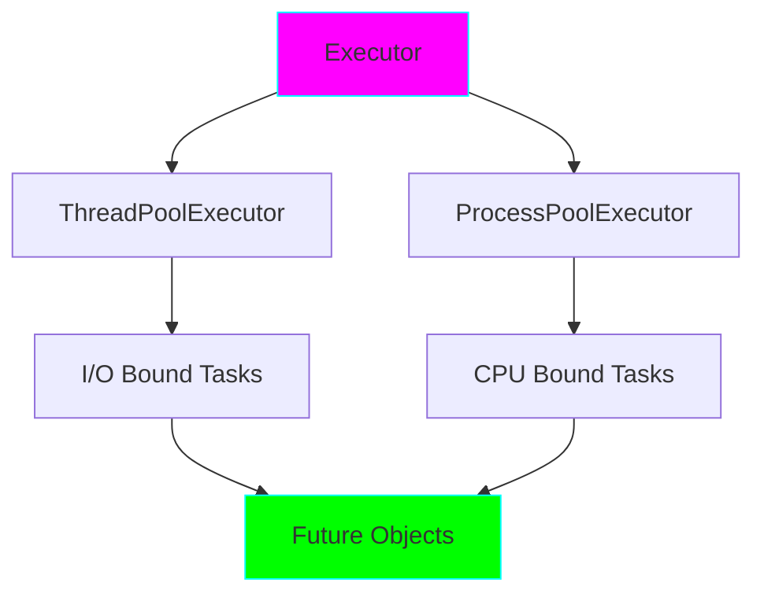

# Project 18: Concurrent Futures - High-Level Concurrency

**Difficulty:** Expert ⭐⭐⭐⭐⭐⭐

## Core Concepts

`concurrent.futures` provides a high-level interface for running tasks asynchronously using threads or processes.



## ThreadPoolExecutor

```python
from concurrent.futures import ThreadPoolExecutor
import time

def task(n):
    """I/O bound task."""
    print(f"Task {n} starting")
    time.sleep(1)
    return n * 2

# Execute tasks concurrently
with ThreadPoolExecutor(max_workers=3) as executor:
    futures = [executor.submit(task, i) for i in range(5)]

    for future in futures:
        result = future.result()  # Blocks until complete
        print(f"Result: {result}")
```

## ProcessPoolExecutor

```python
from concurrent.futures import ProcessPoolExecutor

def cpu_intensive(n):
    """CPU bound task."""
    return sum(i * i for i in range(n))

# Execute using processes (bypasses GIL)
with ProcessPoolExecutor(max_workers=4) as executor:
    results = executor.map(cpu_intensive, [10**6, 10**6, 10**6])
    print(list(results))
```

## Future Objects

```python
from concurrent.futures import ThreadPoolExecutor

with ThreadPoolExecutor() as executor:
    future = executor.submit(task, 5)

    # Check status
    print(future.done())  # False initially

    # Add callback
    future.add_done_callback(lambda f: print(f"Completed: {f.result()}"))

    # Wait for result
    result = future.result(timeout=5)
    print(result)

    # Exception handling
    try:
        result = future.result()
    except Exception as e:
        print(f"Task failed: {e}")
```

## Waiting for Multiple Futures

```python
from concurrent.futures import wait, FIRST_COMPLETED, ALL_COMPLETED

with ThreadPoolExecutor() as executor:
    futures = [executor.submit(task, i) for i in range(5)]

    # Wait for all to complete
    done, pending = wait(futures, return_when=ALL_COMPLETED)

    # Or wait for first to complete
    done, pending = wait(futures, return_when=FIRST_COMPLETED)

    for future in done:
        print(future.result())
```

## as_completed

```python
from concurrent.futures import as_completed

with ThreadPoolExecutor() as executor:
    futures = {executor.submit(task, i): i for i in range(5)}

    # Process results as they complete
    for future in as_completed(futures):
        original_arg = futures[future]
        try:
            result = future.result()
            print(f"Task {original_arg}: {result}")
        except Exception as e:
            print(f"Task {original_arg} failed: {e}")
```

## Advanced Patterns

### Pattern 1: Pipeline with Futures
```python
from concurrent.futures import ThreadPoolExecutor, as_completed

def stage1(data):
    return data * 2

def stage2(data):
    return data + 10

def stage3(data):
    return data ** 2

def pipeline(items):
    """Process items through pipeline."""
    with ThreadPoolExecutor() as executor:
        # Stage 1
        stage1_futures = [executor.submit(stage1, item) for item in items]

        # Stage 2 (depends on stage 1)
        stage2_futures = []
        for future in as_completed(stage1_futures):
            result = future.result()
            stage2_futures.append(executor.submit(stage2, result))

        # Stage 3 (depends on stage 2)
        stage3_futures = []
        for future in as_completed(stage2_futures):
            result = future.result()
            stage3_futures.append(executor.submit(stage3, result))

        # Collect final results
        return [f.result() for f in as_completed(stage3_futures)]

results = pipeline([1, 2, 3, 4, 5])
print(results)
```

### Pattern 2: Map-Reduce
```python
from concurrent.futures import ProcessPoolExecutor
from functools import reduce

def map_task(data):
    """Map phase."""
    return [x * 2 for x in data]

def reduce_task(acc, data):
    """Reduce phase."""
    return acc + sum(data)

# Data chunks
chunks = [[1, 2, 3], [4, 5, 6], [7, 8, 9]]

with ProcessPoolExecutor() as executor:
    # Map phase (parallel)
    mapped = executor.map(map_task, chunks)

    # Reduce phase
    result = reduce(reduce_task, mapped, 0)
    print(result)
```

### Pattern 3: Rate-Limited Executor
```python
import time
from concurrent.futures import ThreadPoolExecutor
from threading import Semaphore

class RateLimitedExecutor:
    """Executor with rate limiting."""

    def __init__(self, max_workers, rate_limit):
        self.executor = ThreadPoolExecutor(max_workers)
        self.rate_limit = rate_limit
        self.semaphore = Semaphore(rate_limit)

    def submit(self, fn, *args, **kwargs):
        def wrapped():
            with self.semaphore:
                result = fn(*args, **kwargs)
                time.sleep(1 / self.rate_limit)
                return result

        return self.executor.submit(wrapped)

    def __enter__(self):
        return self

    def __exit__(self, *args):
        self.executor.shutdown(wait=True)

# Max 5 requests per second
with RateLimitedExecutor(max_workers=10, rate_limit=5) as executor:
    futures = [executor.submit(task, i) for i in range(20)]
    results = [f.result() for f in futures]
```

### Pattern 4: Retry Logic
```python
from concurrent.futures import ThreadPoolExecutor
import time

def retry_task(fn, max_attempts=3, delay=1):
    """Retry task on failure."""
    for attempt in range(max_attempts):
        try:
            return fn()
        except Exception as e:
            if attempt == max_attempts - 1:
                raise
            print(f"Attempt {attempt + 1} failed, retrying...")
            time.sleep(delay)

def unreliable_task():
    import random
    if random.random() < 0.7:
        raise Exception("Task failed")
    return "Success"

with ThreadPoolExecutor() as executor:
    future = executor.submit(retry_task, unreliable_task)
    result = future.result()
    print(result)
```

### Pattern 5: Progress Tracking
```python
from concurrent.futures import ThreadPoolExecutor, as_completed

def track_progress(futures, total):
    """Track progress of futures."""
    completed = 0
    for future in as_completed(futures):
        completed += 1
        percent = (completed / total) * 100
        print(f"Progress: {percent:.1f}% ({completed}/{total})")
        yield future.result()

with ThreadPoolExecutor() as executor:
    futures = [executor.submit(task, i) for i in range(10)]
    results = list(track_progress(futures, len(futures)))
```

## When to Use What

| Task Type | Use | Why |
|-----------|-----|-----|
| **I/O Bound** | ThreadPoolExecutor | Efficient for waiting |
| **CPU Bound** | ProcessPoolExecutor | Bypasses GIL |
| **Mixed** | Both | Separate concerns |
| **Async I/O** | asyncio | More efficient than threads |

## Key Takeaways
- ThreadPoolExecutor for I/O-bound tasks
- ProcessPoolExecutor for CPU-bound tasks
- Future objects represent async results
- `wait()` and `as_completed()` for coordination
- Can combine with callbacks
- Higher level than threading/multiprocessing
- Automatic resource management with context managers

## References
- concurrent.futures - https://docs.python.org/3/library/concurrent.futures.html
- PEP 3148 - futures - execute computations asynchronously
