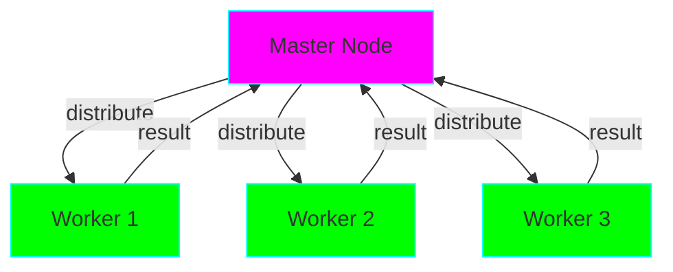

# Project 19: Distributed Computing - Scaling Beyond One Machine

**Difficulty:** Expert ⭐⭐⭐⭐⭐⭐

## Core Concepts

Distributed computing distributes tasks across multiple machines for scalability and fault tolerance.



## Tools & Frameworks

### 1. multiprocessing.managers

```python
from multiprocessing.managers import BaseManager
from queue import Queue

# Server
class QueueManager(BaseManager):
    pass

task_queue = Queue()
result_queue = Queue()

QueueManager.register('get_task_queue', callable=lambda: task_queue)
QueueManager.register('get_result_queue', callable=lambda: result_queue)

manager = QueueManager(address=('', 50000), authkey=b'secret')
server = manager.get_server()

# Add tasks
for i in range(10):
    task_queue.put(i)

server.serve_forever()

# Client (on different machine)
class QueueManager(BaseManager):
    pass

QueueManager.register('get_task_queue')
QueueManager.register('get_result_queue')

manager = QueueManager(address=('server_ip', 50000), authkey=b'secret')
manager.connect()

tasks = manager.get_task_queue()
results = manager.get_result_queue()

while not tasks.empty():
    task = tasks.get()
    result = task * 2  # Process
    results.put(result)
```

### 2. Celery (Task Queue)

```python
from celery import Celery

# Configure Celery
app = Celery('tasks', broker='redis://localhost:6379/0')

@app.task
def process_data(data):
    """Process data asynchronously."""
    import time
    time.sleep(2)
    return data * 2

# Submit task
result = process_data.delay(42)

# Check status
print(result.ready())  # False
print(result.get(timeout=10))  # Blocks until complete: 84

# Chain tasks
from celery import chain
workflow = chain(
    process_data.s(2),
    process_data.s(),  # Uses result from previous
    process_data.s()
)
result = workflow()
print(result.get())  # 16
```

### 3. Ray (Modern Distributed Framework)

```python
import ray

ray.init()

@ray.remote
def process_task(x):
    import time
    time.sleep(1)
    return x * 2

@ray.remote
class DistributedCounter:
    def __init__(self):
        self.value = 0

    def increment(self):
        self.value += 1
        return self.value

# Execute remotely
futures = [process_task.remote(i) for i in range(10)]
results = ray.get(futures)  # [0, 2, 4, 6, 8, 10, 12, 14, 16, 18]

# Remote actors
counter = DistributedCounter.remote()
ray.get(counter.increment.remote())  # 1
```

### 4. Dask (Parallel Computing)

```python
import dask
import dask.array as da

# Lazy evaluation
x = da.random.random((10000, 10000), chunks=(1000, 1000))
y = x + x.T
z = y.mean(axis=0)

# Compute when needed
result = z.compute()  # Distributed computation

# Dask DataFrame (like pandas but distributed)
import dask.dataframe as dd

df = dd.read_csv('large_file.csv')
result = df.groupby('column').mean().compute()

# Task graphs
from dask import delayed

@delayed
def inc(x):
    return x + 1

@delayed
def add(x, y):
    return x + y

a = inc(1)
b = inc(2)
c = add(a, b)

result = c.compute()  # Executes distributed
```

## Distributed Patterns

### Pattern 1: Map-Reduce

```python
# Master
def map_reduce(data, map_fn, reduce_fn):
    """Distribute map-reduce computation."""

    # Map phase (distribute)
    with ProcessPoolExecutor() as executor:
        mapped = executor.map(map_fn, data)

    # Reduce phase
    from functools import reduce
    return reduce(reduce_fn, mapped)

# Usage
data = [[1, 2, 3], [4, 5, 6], [7, 8, 9]]
result = map_reduce(
    data,
    lambda chunk: sum(chunk),
    lambda a, b: a + b
)
print(result)  # 45
```

### Pattern 2: Work Stealing

```python
from queue import Queue
from threading import Thread

class WorkStealingPool:
    """Workers steal tasks from each other."""

    def __init__(self, num_workers):
        self.queues = [Queue() for _ in range(num_workers)]
        self.workers = []

        for i in range(num_workers):
            worker = Thread(target=self._worker, args=(i,))
            worker.start()
            self.workers.append(worker)

    def _worker(self, worker_id):
        my_queue = self.queues[worker_id]

        while True:
            # Try own queue first
            if not my_queue.empty():
                task = my_queue.get()
                task()
            else:
                # Steal from others
                for queue in self.queues:
                    if not queue.empty():
                        task = queue.get()
                        task()
                        break

    def submit(self, task):
        # Add to least loaded queue
        min_queue = min(self.queues, key=lambda q: q.qsize())
        min_queue.put(task)
```

### Pattern 3: Scatter-Gather

```python
from concurrent.futures import ThreadPoolExecutor, as_completed

def scatter_gather(data, fn):
    """Scatter data to workers, gather results."""

    with ThreadPoolExecutor(max_workers=10) as executor:
        # Scatter: distribute to workers
        futures = {executor.submit(fn, item): item for item in data}

        # Gather: collect results
        results = {}
        for future in as_completed(futures):
            original_item = futures[future]
            results[original_item] = future.result()

    return results

# Usage
results = scatter_gather(
    range(100),
    lambda x: x ** 2
)
```

### Pattern 4: Pipeline Parallelism

```python
from queue import Queue
from threading import Thread

class Pipeline:
    """Multi-stage parallel pipeline."""

    def __init__(self, *stages):
        self.stages = stages
        self.queues = [Queue() for _ in range(len(stages) + 1)]

        for i, stage in enumerate(stages):
            Thread(
                target=self._worker,
                args=(i, stage),
                daemon=True
            ).start()

    def _worker(self, stage_idx, fn):
        input_queue = self.queues[stage_idx]
        output_queue = self.queues[stage_idx + 1]

        while True:
            item = input_queue.get()
            if item is None:
                break
            result = fn(item)
            output_queue.put(result)

    def process(self, items):
        # Feed input
        for item in items:
            self.queues[0].put(item)
        self.queues[0].put(None)  # Sentinel

        # Collect output
        results = []
        while True:
            result = self.queues[-1].get()
            if result is None:
                break
            results.append(result)
        return results

# Usage
pipeline = Pipeline(
    lambda x: x * 2,  # Stage 1
    lambda x: x + 10, # Stage 2
    lambda x: x ** 2  # Stage 3
)

results = pipeline.process([1, 2, 3, 4, 5])
```

## Fault Tolerance

### Retry with Exponential Backoff

```python
import time
import random

def retry_with_backoff(fn, max_attempts=5):
    """Retry failed tasks with exponential backoff."""
    for attempt in range(max_attempts):
        try:
            return fn()
        except Exception as e:
            if attempt == max_attempts - 1:
                raise

            wait_time = (2 ** attempt) + random.random()
            print(f"Attempt {attempt + 1} failed, waiting {wait_time:.2f}s")
            time.sleep(wait_time)
```

### Checkpointing

```python
import pickle

class CheckpointedComputation:
    """Save progress periodically."""

    def __init__(self, checkpoint_file):
        self.checkpoint_file = checkpoint_file
        self.state = self.load_checkpoint()

    def load_checkpoint(self):
        try:
            with open(self.checkpoint_file, 'rb') as f:
                return pickle.load(f)
        except FileNotFoundError:
            return {'progress': 0, 'results': []}

    def save_checkpoint(self):
        with open(self.checkpoint_file, 'wb') as f:
            pickle.dump(self.state, f)

    def process(self, items):
        for i, item in enumerate(items[self.state['progress']:]):
            result = item * 2  # Process
            self.state['results'].append(result)
            self.state['progress'] = i + 1

            if i % 10 == 0:
                self.save_checkpoint()

        return self.state['results']
```

## Key Takeaways
- Distributed computing scales beyond one machine
- Use message queues for task distribution
- Celery for async task processing
- Ray/Dask for scientific computing
- Handle network failures gracefully
- Implement checkpointing for long tasks
- Monitor and balance load
- Consider data locality

## References
- Celery - https://docs.celeryq.dev/
- Ray - https://docs.ray.io/
- Dask - https://docs.dask.org/
- multiprocessing.managers - https://docs.python.org/3/library/multiprocessing.html#managers
