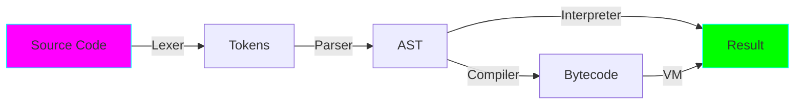

# Project 20: Language Implementation - Build Your Own Language

**Difficulty:** Expert ⭐⭐⭐⭐⭐⭐

## Core Concepts

Implementing a programming language involves: lexical analysis, parsing, AST construction, and interpretation/compilation.



## Simple Calculator Language

### 1. Lexer (Tokenization)

```python
import re
from enum import Enum
from dataclasses import dataclass

class TokenType(Enum):
    NUMBER = 'NUMBER'
    PLUS = 'PLUS'
    MINUS = 'MINUS'
    MULTIPLY = 'MULTIPLY'
    DIVIDE = 'DIVIDE'
    LPAREN = 'LPAREN'
    RPAREN = 'RPAREN'
    EOF = 'EOF'

@dataclass
class Token:
    type: TokenType
    value: any

class Lexer:
    """Convert source code to tokens."""

    def __init__(self, text):
        self.text = text
        self.pos = 0

    def current_char(self):
        if self.pos >= len(self.text):
            return None
        return self.text[self.pos]

    def advance(self):
        self.pos += 1

    def skip_whitespace(self):
        while self.current_char() and self.current_char().isspace():
            self.advance()

    def number(self):
        result = ''
        while self.current_char() and self.current_char().isdigit():
            result += self.current_char()
            self.advance()
        return int(result)

    def tokenize(self):
        tokens = []

        while self.current_char():
            self.skip_whitespace()

            if not self.current_char():
                break

            if self.current_char().isdigit():
                tokens.append(Token(TokenType.NUMBER, self.number()))
            elif self.current_char() == '+':
                tokens.append(Token(TokenType.PLUS, '+'))
                self.advance()
            elif self.current_char() == '-':
                tokens.append(Token(TokenType.MINUS, '-'))
                self.advance()
            elif self.current_char() == '*':
                tokens.append(Token(TokenType.MULTIPLY, '*'))
                self.advance()
            elif self.current_char() == '/':
                tokens.append(Token(TokenType.DIVIDE, '/'))
                self.advance()
            elif self.current_char() == '(':
                tokens.append(Token(TokenType.LPAREN, '('))
                self.advance()
            elif self.current_char() == ')':
                tokens.append(Token(TokenType.RPAREN, ')'))
                self.advance()
            else:
                raise SyntaxError(f"Invalid character: {self.current_char()}")

        tokens.append(Token(TokenType.EOF, None))
        return tokens
```

### 2. Parser (Build AST)

```python
from dataclasses import dataclass
from typing import Union

@dataclass
class Number:
    value: int

@dataclass
class BinOp:
    left: Union['Number', 'BinOp']
    op: str
    right: Union['Number', 'BinOp']

class Parser:
    """Parse tokens into AST."""

    def __init__(self, tokens):
        self.tokens = tokens
        self.pos = 0

    def current_token(self):
        return self.tokens[self.pos]

    def eat(self, token_type):
        if self.current_token().type == token_type:
            self.pos += 1
        else:
            raise SyntaxError(f"Expected {token_type}, got {self.current_token().type}")

    def factor(self):
        """factor : NUMBER | LPAREN expr RPAREN"""
        token = self.current_token()

        if token.type == TokenType.NUMBER:
            self.eat(TokenType.NUMBER)
            return Number(token.value)
        elif token.type == TokenType.LPAREN:
            self.eat(TokenType.LPAREN)
            node = self.expr()
            self.eat(TokenType.RPAREN)
            return node

    def term(self):
        """term : factor ((MULTIPLY | DIVIDE) factor)*"""
        node = self.factor()

        while self.current_token().type in (TokenType.MULTIPLY, TokenType.DIVIDE):
            token = self.current_token()
            if token.type == TokenType.MULTIPLY:
                self.eat(TokenType.MULTIPLY)
            elif token.type == TokenType.DIVIDE:
                self.eat(TokenType.DIVIDE)

            node = BinOp(left=node, op=token.value, right=self.factor())

        return node

    def expr(self):
        """expr : term ((PLUS | MINUS) term)*"""
        node = self.term()

        while self.current_token().type in (TokenType.PLUS, TokenType.MINUS):
            token = self.current_token()
            if token.type == TokenType.PLUS:
                self.eat(TokenType.PLUS)
            elif token.type == TokenType.MINUS:
                self.eat(TokenType.MINUS)

            node = BinOp(left=node, op=token.value, right=self.term())

        return node

    def parse(self):
        return self.expr()
```

### 3. Interpreter (Execute AST)

```python
class Interpreter:
    """Interpret and execute AST."""

    def visit(self, node):
        method_name = f'visit_{type(node).__name__}'
        method = getattr(self, method_name)
        return method(node)

    def visit_Number(self, node):
        return node.value

    def visit_BinOp(self, node):
        left = self.visit(node.left)
        right = self.visit(node.right)

        if node.op == '+':
            return left + right
        elif node.op == '-':
            return left - right
        elif node.op == '*':
            return left * right
        elif node.op == '/':
            return left / right

    def interpret(self, ast):
        return self.visit(ast)
```

### Complete Language Pipeline

```python
def calculate(expression):
    """Complete pipeline: source -> result."""
    # Lexer
    lexer = Lexer(expression)
    tokens = lexer.tokenize()

    # Parser
    parser = Parser(tokens)
    ast = parser.parse()

    # Interpreter
    interpreter = Interpreter()
    result = interpreter.interpret(ast)

    return result

# Usage
print(calculate("2 + 3 * 4"))        # 14
print(calculate("(2 + 3) * 4"))      # 20
print(calculate("10 / 2 + 3"))       # 8.0
```

## Advanced Language Features

### Variables

```python
class Identifier:
    def __init__(self, name):
        self.name = name

class Assignment:
    def __init__(self, name, value):
        self.name = name
        self.value = value

class InterpreterWithVars:
    def __init__(self):
        self.variables = {}

    def visit_Identifier(self, node):
        if node.name not in self.variables:
            raise NameError(f"Undefined variable: {node.name}")
        return self.variables[node.name]

    def visit_Assignment(self, node):
        value = self.visit(node.value)
        self.variables[node.name] = value
        return value
```

### Functions

```python
@dataclass
class Function:
    name: str
    params: list
    body: any

@dataclass
class Call:
    name: str
    args: list

def visit_Function(self, node):
    self.functions[node.name] = node

def visit_Call(self, node):
    func = self.functions[node.name]

    # Create new scope
    old_vars = self.variables.copy()

    # Bind parameters
    for param, arg in zip(func.params, node.args):
        self.variables[param] = self.visit(arg)

    # Execute function body
    result = self.visit(func.body)

    # Restore scope
    self.variables = old_vars

    return result
```

### Control Flow

```python
@dataclass
class If:
    condition: any
    then_branch: any
    else_branch: any = None

@dataclass
class While:
    condition: any
    body: any

def visit_If(self, node):
    if self.visit(node.condition):
        return self.visit(node.then_branch)
    elif node.else_branch:
        return self.visit(node.else_branch)

def visit_While(self, node):
    result = None
    while self.visit(node.condition):
        result = self.visit(node.body)
    return result
```

## Bytecode Compiler

```python
class Compiler:
    """Compile AST to bytecode."""

    def __init__(self):
        self.code = []

    def compile_Number(self, node):
        self.code.append(('LOAD_CONST', node.value))

    def compile_BinOp(self, node):
        self.compile(node.left)
        self.compile(node.right)

        if node.op == '+':
            self.code.append(('ADD',))
        elif node.op == '-':
            self.code.append(('SUB',))
        elif node.op == '*':
            self.code.append(('MUL',))
        elif node.op == '/':
            self.code.append(('DIV',))

    def compile(self, node):
        method = getattr(self, f'compile_{type(node).__name__}')
        method(node)
        return self.code

class VM:
    """Virtual machine to execute bytecode."""

    def __init__(self):
        self.stack = []

    def run(self, bytecode):
        for instruction in bytecode:
            op = instruction[0]

            if op == 'LOAD_CONST':
                self.stack.append(instruction[1])
            elif op == 'ADD':
                b, a = self.stack.pop(), self.stack.pop()
                self.stack.append(a + b)
            elif op == 'SUB':
                b, a = self.stack.pop(), self.stack.pop()
                self.stack.append(a - b)
            elif op == 'MUL':
                b, a = self.stack.pop(), self.stack.pop()
                self.stack.append(a * b)
            elif op == 'DIV':
                b, a = self.stack.pop(), self.stack.pop()
                self.stack.append(a / b)

        return self.stack[-1] if self.stack else None
```

## Real-World Example: DSL

```python
# Domain-Specific Language for rules
# Syntax: when <condition> then <action>

# Example rule:
# when temperature > 30 then turn_on_ac()

# Complete implementation would include:
# 1. Lexer for keywords (when, then, and, or)
# 2. Parser for rule grammar
# 3. Interpreter to execute rules
# 4. Integration with Python functions
```

## Key Takeaways
- Languages have: lexer, parser, interpreter/compiler
- Lexer converts source to tokens
- Parser builds AST from tokens
- Interpreter executes AST
- Compiler translates to bytecode/machine code
- Use recursive descent for parsing
- Visitor pattern for traversing AST
- Start simple, add features incrementally

## References
- Crafting Interpreters - http://craftinginterpreters.com/
- Let's Build A Simple Interpreter - https://ruslanspivak.com/lsbasi-part1/
- PLY (Python Lex-Yacc) - https://www.dabeaz.com/ply/
- Language Implementation Patterns - Book by Terence Parr
