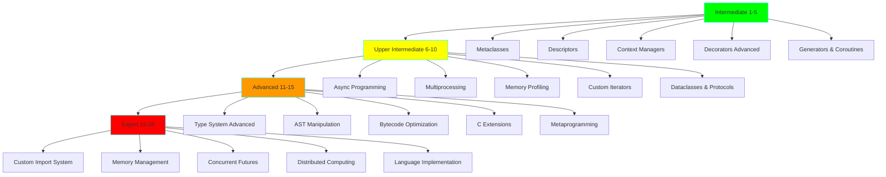

# Advanced Python Learning - 20 Progressive Projects

**Status:** 🚧 In Progress

**Tech Stack:** Python 3.12

**Started:** 2025-11-09

## Overview

A comprehensive learning path for mastering advanced Python concepts through 20 progressive projects. Each project builds on previous knowledge, taking you from intermediate to expert level Python programming.



## Learning Path

### Phase 1: Intermediate (Projects 1-5)
**Time Estimate:** 2-3 weeks | **Difficulty:** ⭐⭐⭐

Master Python's object model and advanced control flow patterns.

| Project | Topic | Key Concepts |
|---------|-------|--------------|
| **01** | [Metaclasses](01-metaclasses/) | Class creation, type(), singleton pattern, ORM design |
| **02** | [Descriptors](02-descriptors/) | Attribute access protocol, properties, validation |
| **03** | [Context Managers](03-context-managers/) | Resource management, `__enter__`/`__exit__`, @contextmanager |
| **04** | [Advanced Decorators](04-decorators-advanced/) | Parameterized decorators, class decorators, stacking |
| **05** | [Generators & Coroutines](05-generators-coroutines/) | Lazy evaluation, yield from, cooperative multitasking |

### Phase 2: Upper Intermediate (Projects 6-10)
**Time Estimate:** 3-4 weeks | **Difficulty:** ⭐⭐⭐⭐

Learn concurrency, performance optimization, and modern Python features.

| Project | Topic | Key Concepts |
|---------|-------|--------------|
| **06** | [Async Programming](06-async-programming/) | asyncio, async/await, concurrent I/O |
| **07** | [Multiprocessing](07-multiprocessing/) | True parallelism, GIL bypass, shared memory |
| **08** | [Memory Profiling](08-memory-profiling/) | tracemalloc, optimization, __slots__ |
| **09** | [Custom Iterators](09-custom-iterators/) | Iterator protocol, infinite sequences |
| **10** | [Dataclasses & Protocols](10-dataclass-protocols/) | Modern Python, structural subtyping |

### Phase 3: Advanced (Projects 11-15)
**Time Estimate:** 4-5 weeks | **Difficulty:** ⭐⭐⭐⭐⭐

Dive deep into Python internals and metaprogramming.

| Project | Topic | Key Concepts |
|---------|-------|--------------|
| **11** | [Advanced Type System](11-type-system-advanced/) | Generics, TypedDict, Literal, overload |
| **12** | [AST Manipulation](12-ast-manipulation/) | Code analysis, transformation, DSLs |
| **13** | [Bytecode Optimization](13-bytecode-optimization/) | dis module, peephole optimization |
| **14** | [C Extensions](14-c-extensions/) | ctypes, cffi, Cython, performance |
| **15** | [Metaprogramming](15-metaprogramming/) | Dynamic code generation, import hooks |

### Phase 4: Expert (Projects 16-20)
**Time Estimate:** 5-6 weeks | **Difficulty:** ⭐⭐⭐⭐⭐⭐

Build systems-level Python applications and languages.

| Project | Topic | Key Concepts |
|---------|-------|--------------|
| **16** | [Custom Import System](16-custom-import-system/) | Meta path finders, custom loaders |
| **17** | [Memory Management](17-memory-management/) | GC internals, weak references, ref counting |
| **18** | [Concurrent Futures](18-concurrent-futures/) | High-level concurrency, executors |
| **19** | [Distributed Computing](19-distributed-computing/) | Celery, Ray, Dask, scaling |
| **20** | [Language Implementation](20-language-implementation/) | Lexer, parser, interpreter, compiler |

## Environment Setup

```bash
# Navigate to project directory
cd projects/advanced-python-learning

# Create virtual environment using uv (recommended)
uv venv

# Activate environment
source .venv/bin/activate  # Linux/Mac

# Install dependencies
uv pip install -e .
```

## Daily Study Routine (ADHD-Friendly)

**Total Time:** ~2.5 hours/day

1. **Read Concepts** (30 min) - Understand theory
2. **Run Examples** (15 min) - See code in action
3. **Experiment** (30 min) - Modify and break things
4. **Break** (15 min) - Step away
5. **Build Something** (45 min) - Apply concepts
6. **Document Learning** (15 min) - Write what you learned

## Dependencies

See pyproject.toml for complete list.

## Graduation Criteria

- [x] All 20 projects documented
- [ ] All example code tested
- [ ] Build 3 real applications
- [ ] Contribute to open source
- [ ] Can teach concepts to others

## References

- Python Documentation - https://docs.python.org/3/
- Fluent Python by Luciano Ramalho
- Real Python - https://realpython.com/
