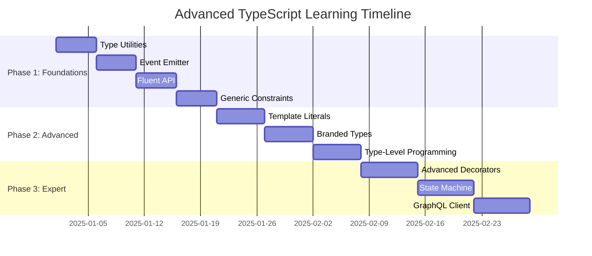

# 📚 Advanced TypeScript - Comprehensive Learning Plan

## 🎯 Overview

This learning plan guides you through mastering Advanced TypeScript over **8-10 weeks** with a structured, progressive approach optimized for focused learning.



## 🗓️ Weekly Schedule

### Week 1-2: Foundation (Projects 1-4)

#### Project 1: Advanced Type Utilities
**Time:** 3-5 days | **Difficulty:** 🟢 Medium

**Day 1: Understanding**
- [ ] Read TypeScript Handbook on Mapped Types
- [ ] Study project README and concepts
- [ ] Run all examples, observe types in IDE
- [ ] Create mind map of utility type categories

**Day 2-3: Implementation**
- [ ] Implement DeepPartial from scratch
- [ ] Create DeepReadonly step by step
- [ ] Build PickByType and OmitByType
- [ ] Practice exercises from README

**Day 4-5: Application**
- [ ] Build type-safe form state manager
- [ ] Create API response wrapper types
- [ ] Implement type transformations for your own project
- [ ] Document learnings and patterns

**Key Concepts:**
- Mapped types: `{ [K in keyof T]: ... }`
- Conditional types: `T extends U ? X : Y`
- The `infer` keyword for type extraction
- Recursive type definitions

**Success Criteria:**
- ✅ Can explain mapped types to someone else
- ✅ Can create custom utility types from scratch
- ✅ Understand when to use each utility pattern

---

#### Project 2: Type-Safe Event Emitter
**Time:** 3-5 days | **Difficulty:** 🟢 Medium

**Day 1: Understanding**
- [ ] Study generic constraints
- [ ] Review string literal types
- [ ] Understand event map patterns
- [ ] Analyze EventEmitter implementation

**Day 2-3: Implementation**
- [ ] Build basic EventEmitter from scratch
- [ ] Add async event support
- [ ] Implement wildcard listeners
- [ ] Create namespaced events

**Day 4-5: Application**
- [ ] Create domain event system for e-commerce
- [ ] Build WebSocket event wrapper
- [ ] Implement observable state pattern
- [ ] Test with real-world scenarios

**Key Concepts:**
- Generic constraints: `<T extends Record<string, any>>`
- String literal types for event names
- Type-safe callback signatures
- Event payload inference

**Success Criteria:**
- ✅ Understand generic constraints deeply
- ✅ Can create type-safe event systems
- ✅ Know how to infer types from event maps

---

#### Project 3: Fluent API Builder
**Time:** 4-6 days | **Difficulty:** 🟡 Medium-Advanced

**Day 1-2: Understanding**
- [ ] Study builder pattern
- [ ] Learn method chaining with types
- [ ] Understand type accumulation
- [ ] Review phantom types introduction

**Day 3-4: Implementation**
- [ ] Build basic query builder
- [ ] Implement type accumulation
- [ ] Add state tracking with phantom types
- [ ] Create HTTP request builder

**Day 5-6: Application**
- [ ] Build SQL query builder
- [ ] Create validation chain
- [ ] Implement form builder
- [ ] Design your own fluent API

**Key Concepts:**
- Method chaining: returning `this` with proper types
- Type accumulation: building types through calls
- Phantom types: encoding state in type parameter
- Conditional return types

**Success Criteria:**
- ✅ Can create fluent APIs with perfect inference
- ✅ Understand phantom type pattern
- ✅ Know how to enforce method call order via types

---

#### Project 4: Advanced Generic Constraints
**Time:** 4-6 days | **Difficulty:** 🟡 Medium-Advanced

**Day 1-2: Understanding**
- [ ] Deep dive into generic variance
- [ ] Study multiple type parameter constraints
- [ ] Learn constructor type constraints
- [ ] Understand covariance/contravariance

**Day 3-4: Implementation**
- [ ] Create typed cache with constraints
- [ ] Build event bus with typed events
- [ ] Implement comparable interface
- [ ] Create serializable type constraint

**Day 5-6: Application**
- [ ] Design plugin system with constraints
- [ ] Build dependency injection container
- [ ] Create type-safe middleware system
- [ ] Apply to real project

**Key Concepts:**
- Multiple type parameters with relationships
- Constructor constraints: `new (...args: any[]) => T`
- Recursive constraints
- Variance in generics

**Success Criteria:**
- ✅ Master complex generic constraints
- ✅ Understand variance implications
- ✅ Can design flexible yet type-safe APIs

---

### Week 3-5: Advanced Techniques (Projects 5-7)

#### Project 5: Template Literal Types
**Time:** 5-7 days | **Difficulty:** 🟠 Advanced

**Day 1-2: Understanding**
- [ ] Study template literal type syntax
- [ ] Learn intrinsic string manipulation types
- [ ] Understand string parsing at type level
- [ ] Review path parameter extraction

**Day 3-4: Implementation**
- [ ] Build string case converters (camelCase, snake_case)
- [ ] Implement route parameter parser
- [ ] Create query string parser
- [ ] Build CSS type system

**Day 5-7: Application**
- [ ] Type-safe routing system
- [ ] Branded string types (Email, URL, UUID)
- [ ] SQL query builder with template literals
- [ ] API endpoint type generator

**Key Concepts:**
- Template literal types: `` type T = `${A}${B}` ``
- String intrinsics: Uppercase, Lowercase, Capitalize
- Pattern matching in types
- String parsing with infer

**Success Criteria:**
- ✅ Can manipulate strings at type level
- ✅ Understand template literal patterns
- ✅ Can parse and validate string formats via types

---

#### Project 6: Branded & Phantom Types
**Time:** 5-7 days | **Difficulty:** 🟠 Advanced

**Day 1-2: Understanding**
- [ ] Learn nominal vs structural typing
- [ ] Study branded type pattern
- [ ] Understand phantom type parameters
- [ ] Review smart constructor pattern

**Day 3-5: Implementation**
- [ ] Create branded ID types
- [ ] Build money type with operations
- [ ] Implement validated/unvalidated phantom types
- [ ] Create sanitized HTML phantom type

**Day 6-7: Application**
- [ ] Design units of measure system
- [ ] Build state machine with phantom types
- [ ] Create compile-time state tracking
- [ ] Apply to domain model

**Key Concepts:**
- Branded types: `type Brand<T, B> = T & { __brand: B }`
- Phantom types: unused type parameters for state
- Smart constructors for type safety
- Nominal typing in structural system

**Success Criteria:**
- ✅ Understand difference between nominal/structural
- ✅ Can prevent value mixing with branded types
- ✅ Use phantom types for compile-time state

---

#### Project 7: Type-Level Programming
**Time:** 6-8 days | **Difficulty:** 🟠 Advanced

**Day 1-3: Understanding**
- [ ] Study recursive type definitions
- [ ] Learn type-level arithmetic
- [ ] Understand type-level algorithms
- [ ] Review tuple manipulation

**Day 4-6: Implementation**
- [ ] Build type-level number system
- [ ] Implement list operations (reverse, flatten)
- [ ] Create boolean logic at type level
- [ ] Build string operations

**Day 7-8: Application**
- [ ] Deep path access type
- [ ] JSON schema validator types
- [ ] Parser combinator types
- [ ] State machine types

**Key Concepts:**
- Recursive type definitions
- Tuple length as numbers
- Type-level algorithms
- Accumulator pattern in types

**Success Criteria:**
- ✅ Can perform computations at type level
- ✅ Understand recursive type limits
- ✅ Know when type-level programming is appropriate

---

### Week 6-8: Expert Patterns (Projects 8-10)

#### Project 8: Advanced Decorators
**Time:** 6-8 days | **Difficulty:** 🟠 Advanced

**Day 1-2: Understanding**
- [ ] Study decorator specification
- [ ] Learn metadata reflection
- [ ] Understand decorator factories
- [ ] Review decorator execution order

**Day 3-5: Implementation**
- [ ] Create method decorators (memoize, retry, measure)
- [ ] Build class decorators (singleton, seal)
- [ ] Implement property decorators (validate, readonly)
- [ ] Create parameter decorators

**Day 6-8: Application**
- [ ] Build dependency injection system
- [ ] Create validation framework
- [ ] Implement ORM-like decorators
- [ ] Design your own decorator library

**Key Concepts:**
- Method/class/property/parameter decorators
- Decorator factories with parameters
- Metadata reflection API
- Decorator composition

**Success Criteria:**
- ✅ Understand all decorator types
- ✅ Can create reusable decorator libraries
- ✅ Know decorator execution order and timing

---

#### Project 9: Type-Safe State Machine
**Time:** 6-8 days | **Difficulty:** 🔴 Expert

**Day 1-3: Understanding**
- [ ] Study FSM theory
- [ ] Learn state machine patterns in TS
- [ ] Understand compile-time state tracking
- [ ] Review XState patterns

**Day 4-6: Implementation**
- [ ] Build basic state machine
- [ ] Add context (extended state)
- [ ] Implement guards and actions
- [ ] Create hierarchical states

**Day 7-8: Application**
- [ ] Model authentication flow
- [ ] Build connection state machine
- [ ] Create promise-like state machine
- [ ] Design complex business workflow

**Key Concepts:**
- FSM theory: states, events, transitions
- Phantom types for state tracking
- Guards and actions
- Type-safe transitions

**Success Criteria:**
- ✅ Can model complex flows as FSM
- ✅ Understand compile-time state guarantees
- ✅ Know when to use state machines

---

#### Project 10: Type-Safe GraphQL Client
**Time:** 7-10 days | **Difficulty:** 🔴 Expert

**Day 1-3: Understanding**
- [ ] Study GraphQL schema structure
- [ ] Learn schema-driven type generation
- [ ] Understand selection set typing
- [ ] Review type inference from schema

**Day 4-7: Implementation**
- [ ] Build schema type definitions
- [ ] Create type extraction utilities
- [ ] Implement typed client
- [ ] Add query builder

**Day 8-10: Application**
- [ ] Connect to real GraphQL API
- [ ] Build mutation support
- [ ] Add subscription types
- [ ] Create code generator

**Key Concepts:**
- Schema-driven development
- Deep type inference
- Selection set type calculation
- Query result type derivation

**Success Criteria:**
- ✅ Understand schema-to-types mapping
- ✅ Can infer types from arbitrary queries
- ✅ Master complex type transformations

---

## 🎯 Daily Study Routine

### Morning Session (2 hours)

```
9:00 - 9:30   | Review yesterday's work
9:30 - 10:30  | Learn new concepts (read, watch, research)
10:30 - 11:00 | Hands-on coding exercises
```

### Afternoon Session (2-3 hours)

```
14:00 - 15:30 | Deep implementation work
15:30 - 15:45 | Break
15:45 - 17:00 | Practice exercises and experimentation
```

### Evening (30 min)

```
20:00 - 20:30 | Document learnings, update notes
```

## 📝 Study Techniques

### Active Learning
- **Don't just read** - Type out every example
- **Break things** - Modify code to see what breaks
- **Explain out loud** - Teach rubber duck/imaginary person
- **Draw diagrams** - Visualize type transformations

### Spaced Repetition
- Review previous project after 1 day
- Review again after 3 days
- Review again after 1 week
- Quick review before moving to next phase

### Project-Based Learning
- Apply each concept to a real project
- Combine techniques from multiple projects
- Build something you'll actually use

## 🏆 Milestones & Celebrations

### Week 2: Foundation Complete
- [ ] Completed projects 1-4
- [ ] Can explain advanced type concepts
- [ ] Built at least one real-world application
- **Reward:** Share your progress, take a day off

### Week 5: Advanced Techniques Complete
- [ ] Completed projects 5-7
- [ ] Comfortable with type-level programming
- [ ] Can solve Type Challenges (medium level)
- **Reward:** Write a blog post, teach someone

### Week 8: Expert Level Achieved
- [ ] Completed all 10 projects
- [ ] Built complex real-world application
- [ ] Can contribute to TypeScript community
- **Reward:** Celebrate! You're now an expert! 🎉

## 📊 Progress Tracking

Use this checklist to track your progress:

```markdown
## Week 1
- [ ] Mon: Project 1 - Day 1
- [ ] Tue: Project 1 - Day 2
- [ ] Wed: Project 1 - Day 3
- [ ] Thu: Project 1 - Day 4
- [ ] Fri: Project 1 - Day 5
- [ ] Weekend: Review & catch up

## Week 2
- [ ] Mon: Project 2 - Day 1
... and so on
```

## 💡 Tips for Success

### Avoid These Pitfalls
- ❌ Skipping the fundamentals
- ❌ Not practicing exercises
- ❌ Moving too fast through projects
- ❌ Only reading without coding
- ❌ Perfectionism preventing progress

### Best Practices
- ✅ Take breaks (Pomodoro technique)
- ✅ Ask questions in TypeScript community
- ✅ Keep a learning journal
- ✅ Build real projects alongside learning
- ✅ Review regularly with spaced repetition

## 🔗 Additional Resources

### Communities
- [TypeScript Discord](https://discord.gg/typescript)
- [r/typescript](https://reddit.com/r/typescript)
- [TypeScript GitHub Discussions](https://github.com/microsoft/TypeScript/discussions)

### Practice
- [Type Challenges](https://github.com/type-challenges/type-challenges)
- [Exercism TypeScript Track](https://exercism.org/tracks/typescript)
- [TypeScript Playground](https://www.typescriptlang.org/play)

### References
- [TypeScript Handbook](https://www.typescriptlang.org/docs/)
- [Total TypeScript](https://www.totaltypescript.com/)
- [TypeScript Deep Dive](https://basarat.gitbook.io/typescript/)

---

**Remember:** Consistency beats intensity. 2 hours daily is better than 14 hours on Sunday! 🚀
