# 🚀 Advanced TypeScript Learning

**Status:** 🚧 In Progress
**Tech Stack:** TypeScript 5.3+, Node.js 20+, Vitest
**Complexity:** Medium → Expert

## 📖 Overview

A comprehensive learning project featuring **10 progressively complex TypeScript projects** designed to take you from medium to expert level TypeScript proficiency. Each project focuses on advanced type system features with practical, real-world applications.

```mermaid
graph LR
    A[01: Type Utilities] --> B[02: Event Emitter]
    B --> C[03: Fluent API]
    C --> D[04: Generic Constraints]
    D --> E[05: Template Literals]
    E --> F[06: Branded Types]
    F --> G[07: Type-Level Programming]
    G --> H[08: Decorators]
    H --> I[09: State Machine]
    I --> J[10: GraphQL Client]

    style A fill:#00ffff,stroke:#ff00ff
    style E fill:#00ffff,stroke:#ff00ff
    style J fill:#00ff00,stroke:#ff00ff
```



## 🎯 Learning Objectives

By completing this project, you will master:

- ✅ **Advanced Type Utilities** - Custom mapped types, conditional types, deep transformations
- ✅ **Generic Programming** - Complex constraints, variance, and type inference
- ✅ **Template Literal Types** - Type-level string manipulation and parsing
- ✅ **Nominal Typing** - Branded types and phantom types for type safety
- ✅ **Type-Level Programming** - Recursive types, type-level algorithms, computations
- ✅ **Decorators** - Method/class/property/parameter decorators with metadata
- ✅ **State Machines** - Type-safe FSM with compile-time guarantees
- ✅ **Schema-Driven Types** - Full type inference from external schemas

## 📚 Project Structure

```
src/
├── 01-advanced-type-utilities/     # 🟢 Medium
│   ├── README.md
│   └── index.ts
├── 02-type-safe-event-emitter/     # 🟢 Medium
├── 03-fluent-api-builder/          # 🟡 Medium-Advanced
├── 04-advanced-generic-constraints/ # 🟡 Medium-Advanced
├── 05-template-literal-types/      # 🟠 Advanced
├── 06-branded-phantom-types/       # 🟠 Advanced
├── 07-type-level-programming/      # 🟠 Advanced
├── 08-advanced-decorators/         # 🟠 Advanced
├── 09-type-safe-state-machine/     # 🔴 Expert
└── 10-type-safe-graphql-client/    # 🔴 Expert
```

## 🏃 Quick Start

### Prerequisites

- Node.js 20.11.0 or higher
- npm or yarn
- TypeScript knowledge (intermediate level)

### Setup

```bash
# Navigate to project
cd projects/advanced-typescript-learning

# Install dependencies
npm install

# Type check all projects
npm run type-check

# Run tests
npm test

# Build all projects
npm run build
```

### Running Individual Projects

Each project is a standalone module. You can run them individually:

```bash
# Run a specific project
npx tsx src/01-advanced-type-utilities/index.ts

# Or using Node with built files
npm run build
node dist/01-advanced-type-utilities/index.js
```

## 📋 Learning Path

### **Phase 1: Foundations (Projects 1-4)** 🟢

**Estimated Time:** 2-3 weeks
**Focus:** Advanced type transformations and generic programming

1. **Advanced Type Utilities** - Master built-in utilities and create custom ones
2. **Type-Safe Event Emitter** - Generic constraints with practical application
3. **Fluent API Builder** - Method chaining with type accumulation
4. **Advanced Generic Constraints** - Complex constraints and variance

**Milestone:** You should be comfortable reading and writing complex generic types.

### **Phase 2: Advanced Techniques (Projects 5-7)** 🟠

**Estimated Time:** 3-4 weeks
**Focus:** Type-level programming and nominal typing

5. **Template Literal Types** - String manipulation at type level
6. **Branded & Phantom Types** - Encode invariants in types
7. **Type-Level Programming** - Recursive types and type-level algorithms

**Milestone:** You can perform computations and transformations at the type level.

### **Phase 3: Expert Patterns (Projects 8-10)** 🔴

**Estimated Time:** 3-4 weeks
**Focus:** Real-world advanced patterns and architectures

8. **Advanced Decorators** - Metadata reflection and decorator patterns
9. **Type-Safe State Machine** - FSM with compile-time guarantees
10. **Type-Safe GraphQL Client** - Full schema-to-types inference

**Milestone:** You can design and implement expert-level TypeScript architectures.

## 🎓 Recommended Study Approach

### For Each Project:

1. **Read the README** (15-30 min)
   - Understand concepts
   - Review examples
   - Note nuanced scenarios

2. **Study the Implementation** (1-2 hours)
   - Read code with comments
   - Run the examples
   - Experiment with modifications

3. **Complete Practice Exercises** (2-4 hours)
   - Implement suggested exercises
   - Create variations
   - Test edge cases

4. **Build Something Real** (4-8 hours)
   - Apply concepts to a real project
   - Combine multiple techniques
   - Document your learnings

### Study Tips for ADHD

- ⏱️ **Use Pomodoro Technique** - 25 min focused work, 5 min break
- 📝 **Take Visual Notes** - Create diagrams, mind maps
- 🎯 **One Project at a Time** - Don't jump around
- 🏆 **Celebrate Completions** - Mark progress visually
- 🔄 **Review Previous Projects** - Spaced repetition helps

## 🧪 Practice Exercises

Each project includes practice exercises. Here are some cross-project challenges:

### Beginner Challenges
- [ ] Create a type-safe configuration system using project 1 & 3
- [ ] Build an event-driven calculator using projects 2 & 4
- [ ] Implement a type-safe router using project 5

### Intermediate Challenges
- [ ] Create a validated form system using projects 3, 6, & 8
- [ ] Build a state machine with event emitter using projects 2 & 9
- [ ] Implement a type-safe ORM query builder using projects 3, 5, & 10

### Advanced Challenges
- [ ] Design a full-stack type-safe RPC system
- [ ] Build a compile-time validated CSS-in-JS library
- [ ] Create a type-safe state management library like Redux

## 📖 Additional Resources

### Official Documentation
- [TypeScript Handbook](https://www.typescriptlang.org/docs/handbook/intro.html)
- [TypeScript Deep Dive](https://basarat.gitbook.io/typescript/)

### Articles & Blogs
- [Matt Pocock's TypeScript Tips](https://www.totaltypescript.com/)
- [Type Challenges](https://github.com/type-challenges/type-challenges)

### Videos
- [TypeScript Congress Talks](https://portal.gitnation.org/events/typescript-congress)
- [No BS TS by Jack Herrington](https://www.youtube.com/@jherr)

## 🎯 Graduation Criteria

This project is ready to graduate to its own repository when:

- [x] All 10 projects implemented with full documentation
- [ ] All practice exercises completed
- [ ] Test coverage >80%
- [ ] Published as npm package with examples
- [ ] Video tutorials/blog posts created
- [ ] Community feedback incorporated

## 📝 Learning Log

### What I Learned
- Advanced type system features beyond basic TypeScript
- How to encode business logic in types
- Type-level programming techniques
- Real-world applications of advanced types

### Challenges Faced
- Understanding variance in generic types
- Debugging complex type errors
- Balancing type safety with developer experience

### Next Steps
- Apply these patterns in production projects
- Contribute to TypeScript community
- Explore TypeScript compiler internals

## 🔗 Related Projects

- [Type Challenges](https://github.com/type-challenges/type-challenges) - Practice type-level programming
- [tRPC](https://trpc.io/) - End-to-end typesafe APIs
- [Zod](https://zod.dev/) - TypeScript-first schema validation

## 📄 License

MIT - Feel free to use for learning and commercial projects

---

**Remember:** Advanced TypeScript is a marathon, not a sprint. Take your time, experiment, and enjoy the journey! 🎉
