# 🔍 CI/CD Monitor Agent

**Status:** 🧪 Experimental
**Tech Stack:** Python 3.11, OpenAI API, GitHub Actions API
**Purpose:** Intelligent CI/CD monitoring that explains WHY builds fail and suggests fixes

---

## Problem

Traditional CI/CD notifications are unhelpful:
- ❌ "Build failed" - **but WHY?**
- ❌ Cryptic error messages in logs
- ❌ No context or suggestions
- ❌ Requires manual log diving
- ❌ Same failures repeat without learning

**You need:** Smart monitoring that analyzes failures and suggests fixes.

---

## Solution

An AI agent that:
1. **Monitors** GitHub Actions workflows
2. **Detects** when builds fail
3. **Parses** build logs with LLM
4. **Identifies** root cause of failure
5. **Suggests** specific fixes
6. **Tracks** failure patterns over time

```mermaid
graph LR
    A[🔄 GitHub Actions] --> B[Workflow Status Change]
    B --> C{Status?}
    C -->|Success| D[✅ Log Success]
    C -->|Failure| E[📥 Fetch Logs]
    E --> F[🤖 Parse with LLM]
    F --> G[Identify Root Cause]
    G --> H[Generate Suggestion]
    H --> I[📧 Smart Notification]
    I --> J[💾 Track Pattern]

    style A fill:#ff00ff,stroke:#00ffff,stroke-width:2px
    style F fill:#00ffff,stroke:#ff00ff,stroke-width:2px
    style I fill:#00ff00,stroke:#ff00ff,stroke-width:2px
```



---

## Features

### Core Features
- ✅ **Smart Monitoring** - Watches GitHub Actions workflows
- ✅ **Log Analysis** - Parses logs with LLM to find root cause
- ✅ **ReAct Pattern** - Reasons step-by-step about failures
- ✅ **Contextual Suggestions** - Provides actionable fixes
- ✅ **Pattern Tracking** - Learns from repeated failures
- ✅ **Multiple Channels** - Slack, Discord, Email, GitHub Issues

### Advanced Features
- 🔄 **Automatic Retries** - Intelligently retry transient failures
- 📊 **Failure Analytics** - Dashboard of common failure types
- 🎯 **Noise Reduction** - Filter out known, expected failures
- 🔗 **Cross-Repo Learning** - Share knowledge across projects
- 📈 **Trend Detection** - Spot increasing failure rates

---

## Architecture


### Components

| Component | Purpose | Technology |
|-----------|---------|------------|
| **Workflow Monitor** | Poll GitHub Actions API | requests / PyGithub |
| **Log Parser** | Extract errors from logs | regex / custom parser |
| **ReAct Engine** | Reason about failures | OpenAI with ReAct prompt |
| **Pattern Tracker** | Track failure patterns | SQLite |
| **Notifier** | Send smart alerts | Slack SDK / SMTP / GitHub API |

---

## Installation

### Prerequisites
- Python 3.11
- GitHub Personal Access Token (PAT) with repo access
- OpenAI API key
- Slack webhook (optional)

### Setup

```bash
# Navigate to project
cd /home/user/fantastic-engine/projects/cicd-monitor-agent

# Create virtual environment
python -m venv .venv
source .venv/bin/activate  # On Windows: .venv\Scripts\activate

# Install dependencies
pip install -r requirements.txt

# Copy environment template
cp .env.example .env

# Edit .env with your credentials
nano .env
```

### Configuration

Edit `.env`:

```bash
# GitHub Configuration
GITHUB_TOKEN=ghp_your_github_token
GITHUB_REPO=owner/repo
GITHUB_WORKFLOW_NAME=CI  # or leave empty to monitor all workflows

# OpenAI Configuration
OPENAI_API_KEY=sk-your-api-key
OPENAI_MODEL=gpt-4-turbo-preview

# Notification Channels
SLACK_WEBHOOK_URL=https://hooks.slack.com/services/YOUR/WEBHOOK/URL
GITHUB_CREATE_ISSUES=true
EMAIL_ENABLED=false

# Monitoring Settings
POLL_INTERVAL_SECONDS=60
MAX_LOG_LENGTH=5000
IGNORE_SUCCESS=true

# ReAct Settings
MAX_REASONING_STEPS=5
ENABLE_REACT=true

# Pattern Tracking
PATTERN_DB_PATH=./data/patterns.db
LEARN_FROM_HISTORY=true

# Logging
LOG_LEVEL=INFO
LOG_FILE=./logs/monitor.log
```

---

## Usage

### 1. Start Monitoring (Daemon Mode)

```bash
# Start monitoring
python -m src.monitor --daemon

# Or run once
python -m src.monitor --once
```

**Output:**
```
🔍 CI/CD Monitor Agent v0.1.0
📡 Monitoring: owner/repo
🔄 Polling every 60 seconds...

[2025-11-16 14:23:05] ✅ Workflow "CI" #1234 succeeded
[2025-11-16 14:24:12] ❌ Workflow "CI" #1235 failed
  └─ Analyzing failure...
  └─ 🤖 Root cause: Test failure in test_auth.py
  └─ 💡 Suggestion: Missing mock for external API call
  └─ 📧 Notification sent to Slack
  └─ 📊 Pattern stored
```

### 2. Analyze Specific Workflow Run

```bash
# Analyze failed workflow
python -m src.analyze --run-id 1235

# With verbose output
python -m src.analyze --run-id 1235 --verbose
```

**Output:**
```
🔍 Analyzing Workflow Run #1235

📥 Fetching logs...
  ├─ Job: build
  ├─ Job: test (FAILED)
  └─ Job: deploy (SKIPPED)

🤖 ReAct Analysis:

Thought: The workflow failed in the 'test' job. I need to examine the test logs.

Action: Extract error lines from test job logs

Observation:
  Line 234: FAILED tests/test_auth.py::test_login_with_invalid_token
  Line 235: requests.exceptions.ConnectionError: Connection refused
  Line 236: [Errno 111] Connection refused

Thought: The test is trying to connect to an external service that's not available.

Action: Check test file for external dependencies

Observation: test_auth.py makes HTTP requests to auth.example.com without mocking.

Thought: The root cause is a missing mock for the external API in tests.

💡 Root Cause:
  Test failure due to unmocked external HTTP request

🔧 Suggested Fix:
  Add mock for auth.example.com in test_auth.py:

  ```python
  import responses

  @responses.activate
  def test_login_with_invalid_token():
      responses.add(
          responses.POST,
          'https://auth.example.com/login',
          json={'error': 'Invalid token'},
          status=401
      )
      # ... rest of test
  ```

📊 Similar failures: 3 times in the past week
💰 Cost: $0.08 | ⏱️ Time: 4.2s
```

### 3. View Failure Patterns

```bash
# Show failure patterns
python -m src.patterns --stats

# Show specific pattern
python -m src.patterns --pattern "connection_refused"
```

### 4. Python API

```python
from src.cicd_monitor import CICDMonitor

# Initialize monitor
monitor = CICDMonitor(
    github_token="ghp_xxx",
    openai_api_key="sk_xxx",
    repo="owner/repo"
)

# Analyze specific run
result = monitor.analyze_workflow_run(run_id=1235)

print(f"Root cause: {result.root_cause}")
print(f"Suggestion: {result.suggestion}")
print(f"Cost: ${result.cost:.2f}")

# Start monitoring (blocking)
monitor.start_daemon(poll_interval=60)
```

---

## Examples

### Example 1: Test Failure

**Workflow Log:**
```
FAILED tests/test_api.py::test_create_user
AssertionError: assert 200 == 201
```

**AI Analysis:**
```
🤖 Root Cause:
  Assertion expects HTTP 201 (Created) but API returns 200 (OK)

🔧 Suggested Fix:
  Update the assertion in test_api.py:

  - assert response.status_code == 200
  + assert response.status_code == 201

  Or update the API to return 201 for resource creation (RESTful best practice).

📊 Severity: LOW
📈 Trend: First occurrence
```

### Example 2: Dependency Installation Failure

**Workflow Log:**
```
ERROR: Could not find a version that satisfies the requirement numpy==1.24.0
ERROR: No matching distribution found for numpy==1.24.0
```

**AI Analysis:**
```
🤖 Root Cause:
  numpy 1.24.0 is not available for Python 3.12 (only supports up to 3.11)

🔧 Suggested Fix:
  Option 1: Downgrade Python version in .github/workflows/ci.yml:
    python-version: '3.11'

  Option 2: Upgrade numpy to 1.26.0+ which supports Python 3.12:
    numpy>=1.26.0

📊 Severity: MEDIUM
📈 Trend: New issue (Python 3.12 recently added)
```

### Example 3: Environment Variable Missing

**Workflow Log:**
```
KeyError: 'DATABASE_URL'
```

**AI Analysis:**
```
🤖 Root Cause:
  Required environment variable DATABASE_URL is not set in GitHub Actions

🔧 Suggested Fix:
  Add to .github/workflows/ci.yml:

  env:
    DATABASE_URL: postgresql://localhost/test_db

  Or add to GitHub repository secrets and reference it:

  env:
    DATABASE_URL: ${{ secrets.DATABASE_URL }}

📊 Severity: HIGH
📈 Trend: Occurred after recent workflow changes
```

---

## ReAct Pattern

This agent uses the ReAct (Reasoning + Acting) pattern for analysis:


**Example ReAct Trace:**
```
1. Thought: Build failed. Need to find which step failed.
   Action: Extract exit codes from each step
   Observation: Step 3 (pytest) exited with code 1

2. Thought: pytest failed. Need to see which test failed.
   Action: Extract failed test names from output
   Observation: test_database_connection failed

3. Thought: Database test failed. Need to check error message.
   Action: Extract error message around test failure
   Observation: "Connection refused to localhost:5432"

4. Thought: PostgreSQL not running. Need to check workflow setup.
   Action: Check for database service in workflow YAML
   Observation: No 'services' section in workflow

5. Thought: Root cause found. Database service missing from CI config.
   Answer: Add PostgreSQL service to GitHub Actions workflow
```

---

## Project Structure

```
cicd-monitor-agent/
├── README.md
├── requirements.txt
├── .env.example
├── .python-version
├── src/
│   ├── __init__.py
│   ├── cicd_monitor.py        # Main monitor class
│   ├── github_client.py        # GitHub Actions API wrapper
│   ├── log_parser.py           # Log parsing logic
│   ├── react_engine.py         # ReAct reasoning engine
│   ├── notifier.py             # Multi-channel notifications
│   ├── pattern_tracker.py      # Failure pattern tracking
│   ├── monitor.py              # CLI daemon
│   ├── analyze.py              # CLI for analysis
│   └── patterns.py             # CLI for pattern viewing
├── data/
│   └── patterns.db             # Pattern database (auto-created)
└── tests/
    └── test_react_engine.py
```

---

## Cost Tracking

### OpenAI Costs (Approximate)

| Workflow Run Size | Log Lines | Estimated Cost (GPT-4) | Estimated Cost (GPT-3.5) |
|------------------|-----------|----------------------|------------------------|
| Small | <100 | $0.02 - $0.05 | $0.005 - $0.01 |
| Medium | 100-500 | $0.05 - $0.15 | $0.01 - $0.03 |
| Large | 500-1000 | $0.15 - $0.30 | $0.03 - $0.08 |

### Monthly Cost Estimate

Assuming 20 builds/day, 30% failure rate:
- Daily failures: 6
- Monthly failures: 180
- Cost (GPT-4): $9 - $27/month
- Cost (GPT-3.5): $2 - $6/month

---

## Notification Examples

### Slack Notification

```
❌ Build Failed: CI #1235

🔍 Root Cause:
Test failure due to missing database service

🔧 Suggested Fix:
Add PostgreSQL service to .github/workflows/ci.yml:

```yaml
services:
  postgres:
    image: postgres:14
    env:
      POSTGRES_PASSWORD: postgres
    options: >-
      --health-cmd pg_isready
      --health-interval 10s
```

📊 Similar failures: 2 in past week
🔗 View run: https://github.com/owner/repo/actions/runs/1235
💰 Analysis cost: $0.08
```

---

## Learning Log

### What I Learned
- [ ] GitHub Actions API and webhook events
- [ ] ReAct pattern for LLM reasoning
- [ ] Log parsing and error extraction
- [ ] Pattern recognition for failure types
- [ ] Multi-channel notification systems

### Challenges
- [ ] Handling large log files (token limits)
- [ ] Distinguishing transient vs. permanent failures
- [ ] False positive reduction
- [ ] Context extraction from logs
- [ ] Cost optimization for frequent monitoring

### Next Steps
- [ ] Add GitLab CI/CD support
- [ ] Implement automatic PR creation with fixes
- [ ] Build failure prediction model
- [ ] Integration with PagerDuty/Opsgenie
- [ ] Custom retry strategies per failure type
- [ ] Web dashboard for analytics

---

## Graduation Criteria

- [ ] Successfully monitored 100+ workflow runs
- [ ] 90%+ accuracy in root cause identification
- [ ] <$20/month in API costs
- [ ] <5 second analysis time
- [ ] Integration with Slack/Discord working
- [ ] Pattern database shows learning over time
- [ ] Documentation complete

---

## Resources

- [GitHub Actions API Documentation](https://docs.github.com/en/rest/actions)
- [ReAct Paper](https://arxiv.org/abs/2210.03629)
- [Slack Incoming Webhooks](https://api.slack.com/messaging/webhooks)
- [OpenAI Function Calling](https://platform.openai.com/docs/guides/function-calling)

---

**Last Updated:** 2025-11-16
**Maintainer:** You (ADHD-friendly version)
