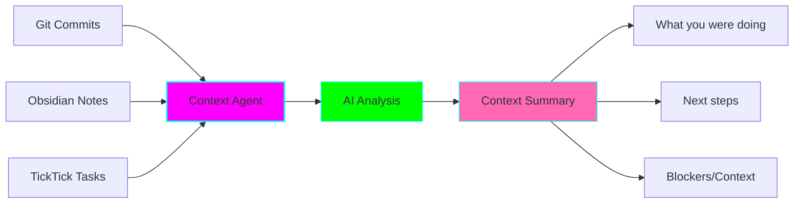
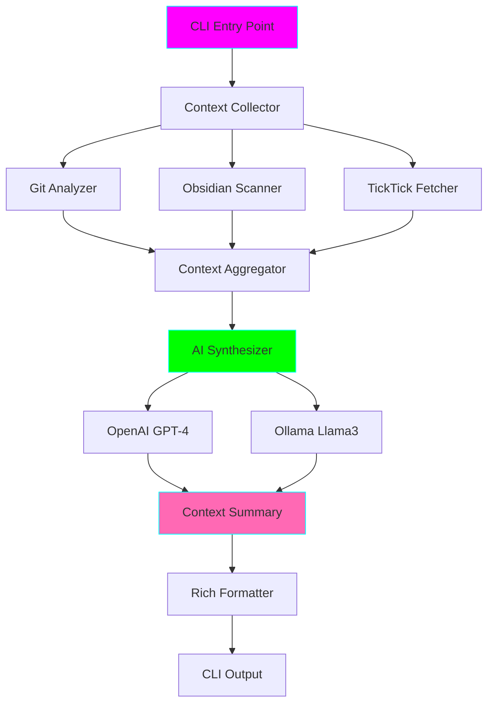

# 🧠 Context Recovery Agent

**Status:** 🚧 In Progress
**Tech Stack:** Python 3.11+, OpenAI/Ollama, Git, Obsidian
**Purpose:** AI agent that helps you resume work after interruptions

## Problem

ADHD brains struggle with context switching. After interruptions (meetings, breaks, days off), it takes significant time and mental energy to remember:
- What were you working on?
- What were you about to do next?
- What blockers did you encounter?
- What context/decisions are relevant?

## Solution

The Context Recovery Agent analyzes your digital footprints to generate a "where you left off" summary:

1. **Git Commits** - Last 3 commits show what code you changed
2. **Obsidian Notes** - Recent notes show your thinking/planning
3. **TickTick Tasks** - Active tasks show your current goals
4. **AI Synthesis** - GPT-4/Ollama synthesizes this into actionable context



## Features

- ✅ Analyzes last 3 git commits
- ✅ Reads Obsidian notes from last 24 hours
- ✅ Fetches active TickTick tasks (via local MCP server)
- ✅ Generates concise summary with AI (OpenAI GPT-4 or Ollama)
- ✅ Identifies next logical steps
- ✅ Highlights blockers and relevant context
- ✅ CLI interface with rich formatting
- ✅ Fallback to Ollama if OpenAI unavailable

## Installation

```bash
cd projects/context-recovery-agent

# Create virtual environment
python -m venv .venv
source .venv/bin/activate  # On Windows: .venv\Scripts\activate

# Install dependencies
pip install -r requirements.txt

# Configure (optional - will use defaults)
cp .env.example .env
# Edit .env with your settings
```

## Configuration

Create a `.env` file:

```env
# AI Provider (openai or ollama)
AI_PROVIDER=openai

# OpenAI (if using)
OPENAI_API_KEY=sk-...

# Ollama (if using)
OLLAMA_BASE_URL=http://localhost:11434
OLLAMA_MODEL=llama3

# Paths
OBSIDIAN_VAULT_PATH=/path/to/your/obsidian/vault
TICKTICK_MCP_URL=http://localhost:3000

# Git (defaults to current directory)
GIT_REPO_PATH=.
```

## Usage

### Basic Usage

```bash
# Run in current git repo
python main.py

# Specify git repo
python main.py --repo /path/to/repo

# Use Ollama instead of OpenAI
python main.py --provider ollama

# Include more commits
python main.py --commits 5

# Include notes from last N days
python main.py --days 3
```

### Example Output

```
╔══════════════════════════════════════════════════════════════╗
║              🧠 Context Recovery Agent                        ║
║              Where you left off...                            ║
╚══════════════════════════════════════════════════════════════╝

📊 Analyzing your digital footprints...
✅ Found 3 git commits
✅ Found 5 recent Obsidian notes
✅ Found 8 active TickTick tasks
✅ Generated context summary

╔══════════════════════════════════════════════════════════════╗
║                    What You Were Working On                   ║
╚══════════════════════════════════════════════════════════════╝

You were implementing a new feature for the user authentication system.
Your last commits show:
- Added JWT token validation middleware
- Created user session management
- Started writing tests for login flow

From your notes, you were planning to:
- Refactor the token refresh logic
- Add rate limiting to prevent brute force attacks
- Document the authentication flow

╔══════════════════════════════════════════════════════════════╗
║                        Next Logical Steps                     ║
╚══════════════════════════════════════════════════════════════╝

1. Complete the login flow tests (partially done)
2. Implement token refresh endpoint
3. Add rate limiting middleware
4. Update API documentation

╔══════════════════════════════════════════════════════════════╗
║                    Blockers & Context                         ║
╚══════════════════════════════════════════════════════════════╝

🚧 Blocker: Need to decide on rate limiting strategy
   - Your notes mention Redis vs. in-memory
   - Consider scalability requirements

📝 Context: Authentication spec is in docs/auth-spec.md
📝 Context: Related PR discussion in #123
```

## Architecture



## Code Structure

```
context-recovery-agent/
├── main.py                 # CLI entry point
├── context_agent.py        # Core agent logic
├── collectors/
│   ├── git_collector.py    # Git commit analysis
│   ├── obsidian_collector.py  # Obsidian note scanning
│   └── ticktick_collector.py  # TickTick task fetching
├── synthesizer.py          # AI context synthesis
├── formatter.py            # Output formatting
├── requirements.txt
├── .env.example
└── README.md
```

## Cost Estimation

### OpenAI (GPT-4-turbo)
- Input: ~2000 tokens (commits + notes + tasks)
- Output: ~500 tokens (summary)
- Cost: ~$0.03 per run
- Daily usage (5 runs): ~$0.15

### Ollama (Free)
- Llama 3 8B running locally
- No API costs
- Requires ~8GB RAM

## Performance

- **Git Analysis:** <1 second
- **Obsidian Scanning:** 1-2 seconds (depends on vault size)
- **TickTick Fetch:** <1 second
- **AI Generation:** 3-10 seconds (OpenAI) or 5-15 seconds (Ollama)
- **Total:** ~5-15 seconds

## Graduation Criteria

- [ ] Successfully used for 2+ weeks
- [ ] Reduces context recovery time by >50%
- [ ] Handles edge cases (no commits, no notes, etc.)
- [ ] Well-documented and tested
- [ ] Integration with other ADHD tools (Pomodoro, Dashboard)

## Future Enhancements

- 🔮 Voice output (read summary aloud)
- 🔮 Slack/Discord integration (fetch recent messages)
- 🔮 Calendar integration (recent meetings)
- 🔮 Browser history analysis (recent tabs)
- 🔮 Code context (current branch, open PRs)
- 🔮 Learning mode (improves summaries based on feedback)
- 🔮 Scheduled summaries (morning digest)

## Related Projects

- [Pomodoro Tracker](../pomodoro-tracker/) - Track when you work best
- [Executive Function Dashboard](../executive-function-dashboard/) - See all context at once

---

**Last Updated:** 2025-11-16
**Maintainer:** ADHD-friendly development practices applied
