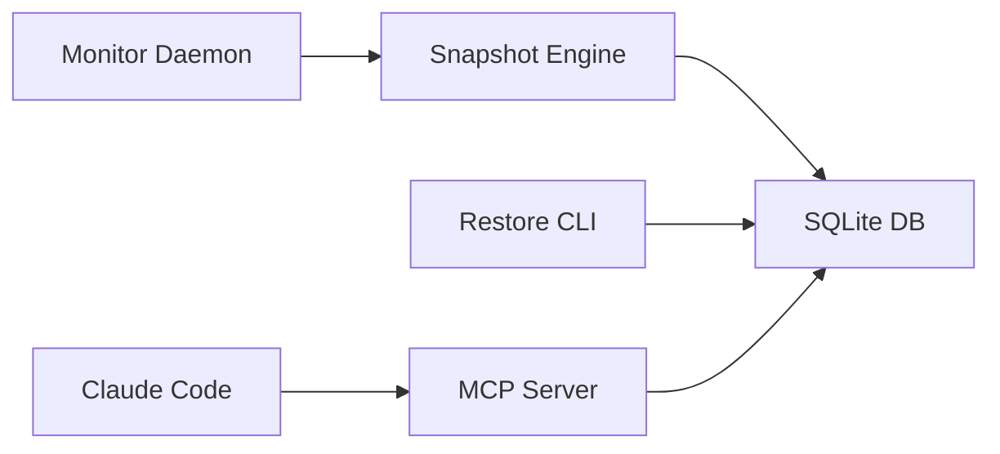

# 🔄 Context Switch Recovery Assistant

**Status:** 🚧 In Progress | **Tech:** Python + MCP | **Purpose:** Resume work faster after interruptions

## Overview

Auto-snapshot code state, terminal, browser tabs. Generate "where was I?" summaries. Quick-restore with one click.

## Features

### 📸 Auto-Snapshots
- Code editor state (cursor position, open files)
- Terminal history and current commands
- Browser tabs and positions
- Git branch and uncommitted changes
- Environment variables

### 🤖 AI Summaries
- "What was I working on?"
- Code change summary
- Next probable steps
- Related context

### ⚡ Quick Restore
- One-click restore
- Restore to specific timestamp
- Partial restore (just tabs, just code, etc.)

### 🔌 MCP Integration
- Expose snapshots to Claude Code
- AI-powered context reconstruction
- Natural language queries

## Quick Start

```bash
cd projects/context-switch-assistant
uv venv && source .venv/bin/activate
uv pip install -e .

# Start background monitor
context-switch monitor

# Create manual snapshot
context-switch snapshot --name "before-meeting"

# List snapshots
context-switch list

# Restore
context-switch restore --latest
```

## Architecture



## Snapshot Contents

```json
{
  "timestamp": "2024-01-15T14:30:00Z",
  "editor": {
    "open_files": [...],
    "cursor_positions": {...},
    "unsaved_changes": {...}
  },
  "terminal": {
    "cwd": "/path/to/project",
    "history": [...],
    "current_command": "npm run dev"
  },
  "browser": {
    "tabs": [...]
  },
  "git": {
    "branch": "feature/auth",
    "uncommitted": [...]
  },
  "ai_summary": "Working on authentication..."
}
```

## Graduation Criteria

- [ ] Auto-snapshot every 15 minutes
- [ ] Restore success rate >95%
- [ ] MCP integration functional
- [ ] Used daily for 30+ days
