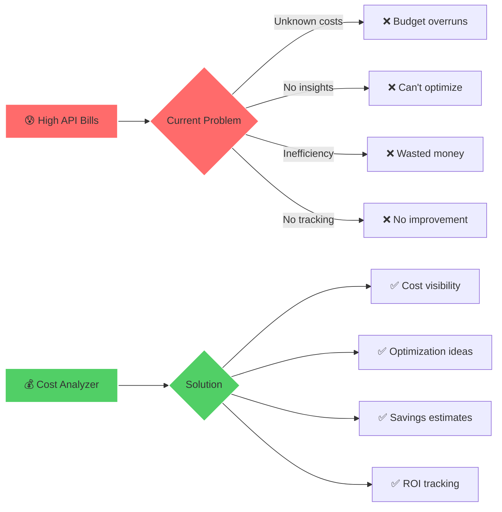
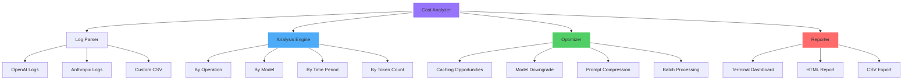
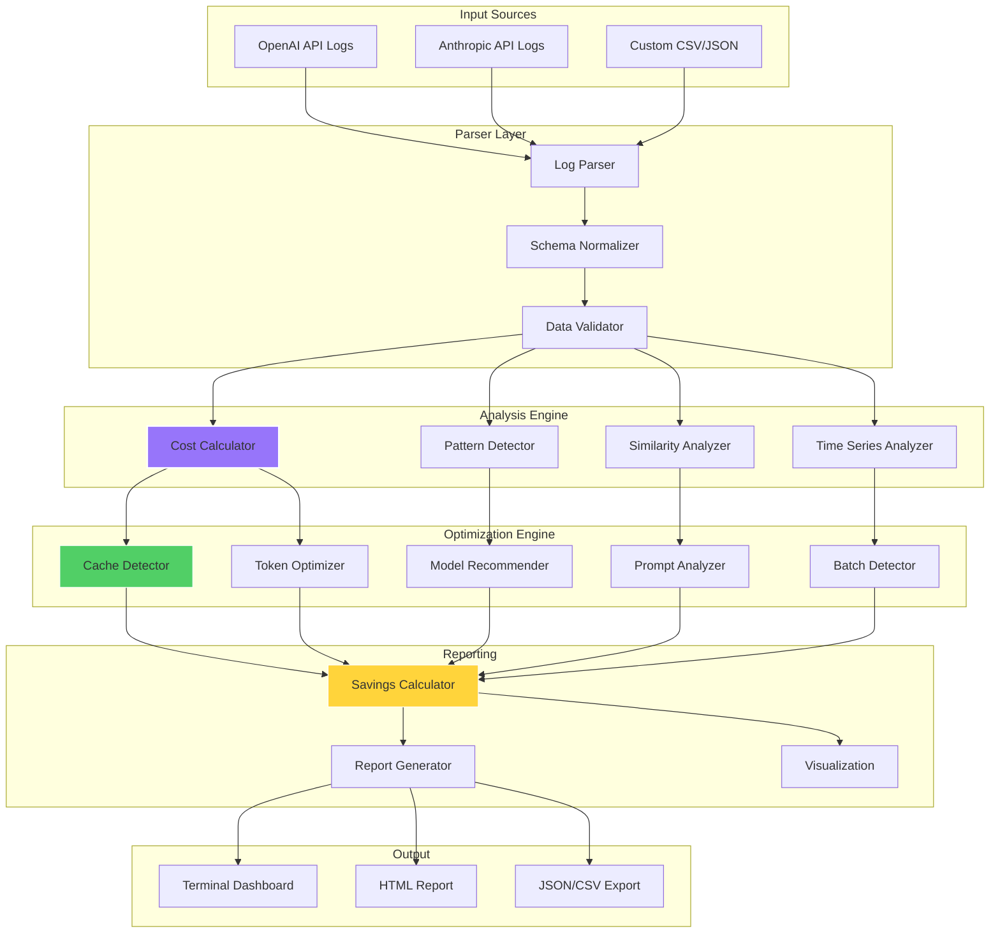

# 💰 Cost Optimization Analyzer

**Status:** 🧪 Experimental

**Tech Stack:** Python 3.11+ | Pandas | OpenAI/Anthropic APIs | Rich

**Last Updated:** 2025-11-16

## Problem & Solution

### The Problem

LLM API costs can spiral out of control without proper analysis:

- **Hidden Cost Drivers** - Don't know which operations are expensive
- **No Visibility** - API logs are verbose and hard to analyze
- **Wasted Tokens** - Redundant calls, inefficient prompts, poor caching
- **Wrong Model Selection** - Using GPT-4 when GPT-3.5 would work
- **No ROI Tracking** - Can't measure cost vs. value of optimizations

### The Solution

An **intelligent cost analyzer** that:

- ✅ **Parses API logs** - Extracts cost data from OpenAI/Anthropic logs
- ✅ **Identifies waste** - Finds expensive operations and patterns
- ✅ **Suggests optimizations** - Recommends caching, model swaps, prompt compression
- ✅ **Estimates savings** - Projects ROI for each optimization
- ✅ **Tracks improvements** - Measures before/after impact



## Features

### 🎯 Core Functionality

1. **Log Parsing** - Import logs from OpenAI, Anthropic, or custom formats
2. **Cost Analysis** - Break down costs by operation, model, time period
3. **Optimization Detection** - Identify opportunities to reduce costs
4. **Savings Calculator** - Estimate ROI for each optimization
5. **Reporting** - Generate actionable reports with ranked recommendations

### 📊 Cost Analysis Types



### 💡 Optimization Strategies

The analyzer detects and recommends:

1. **Caching Opportunities**
   - Repeated identical prompts
   - Similar queries that could share results
   - Static content that doesn't change

2. **Model Downgrades**
   - Simple tasks using expensive models
   - Classification/extraction using GPT-4 when 3.5 works
   - Batch tasks that could use cheaper models

3. **Prompt Compression**
   - Verbose prompts with unnecessary tokens
   - Repetitive instructions
   - Large context that could be summarized

4. **Batch Processing**
   - Individual calls that could be batched
   - Parallel requests that could be sequential
   - Rate limit optimization

5. **Token Optimization**
   - Max tokens set too high
   - Unnecessary output verbosity
   - JSON formatting waste

## Architecture



## Tech Stack Details

| Component | Technology | Purpose |
|-----------|------------|---------|
| **Data Processing** | Pandas | Log parsing and analysis |
| **Cost Calculation** | Custom logic | Price per token calculations |
| **Similarity Detection** | scikit-learn | Find duplicate/similar prompts |
| **Visualization** | Rich/Plotly | Terminal and HTML reports |
| **API Integration** | OpenAI/Anthropic SDKs | Price data and validation |
| **Configuration** | YAML | Optimization rules and pricing |
| **Export** | JSON/CSV | Data export formats |

## Environment Setup

### Prerequisites

- Python 3.11 or higher
- uv package manager (or pip)
- API logs from OpenAI or Anthropic (or custom format)

### Installation Steps

```bash
# 1. Navigate to project directory
cd /home/user/fantastic-engine/projects/cost-optimizer/

# 2. Create virtual environment
uv venv

# 3. Activate virtual environment
source .venv/bin/activate

# 4. Install dependencies
uv pip install -r requirements.txt

# 5. Copy and configure environment
cp .env.example .env
# No API keys needed for log analysis

# 6. Run analyzer
python -m cost_optimizer analyze --input logs/openai.json
```

### Environment Variables

Create a `.env` file with:

```env
# Pricing Configuration (auto-updated from APIs)
OPENAI_PRICING_URL=https://openai.com/api/pricing
ANTHROPIC_PRICING_URL=https://anthropic.com/api/pricing
UPDATE_PRICING_ON_START=true

# Analysis Settings
DEFAULT_MODEL=gpt-4
SIMILARITY_THRESHOLD=0.85  # For detecting duplicate prompts
CACHE_OPPORTUNITY_MIN_OCCURRENCES=3
MIN_SAVINGS_TO_REPORT=10.00  # USD

# Optimization Thresholds
MAX_TOKENS_WASTE_THRESHOLD=0.2  # 20% unused tokens
PROMPT_COMPRESSION_MIN_TOKENS=1000
BATCH_SIZE_RECOMMENDATION=10

# Output Settings
OUTPUT_FORMAT=terminal  # terminal, html, json, csv
REPORT_DIR=./reports
INCLUDE_CHARTS=true
TOP_N_RECOMMENDATIONS=20

# Logging
LOG_LEVEL=INFO
LOG_FILE=./logs/cost-optimizer.log
```

## Project Structure

```
cost-optimizer/
├── README.md                          # This file
├── requirements.txt                   # Python dependencies
├── .env.example                      # Environment template
├── .python-version                   # Python version (3.11)
├── cost_optimizer/                   # Main package
│   ├── __init__.py
│   ├── cli.py                        # CLI interface
│   ├── parsers/                      # Log parsers
│   │   ├── __init__.py
│   │   ├── openai.py                 # OpenAI log parser
│   │   ├── anthropic.py              # Anthropic log parser
│   │   └── custom.py                 # Custom format parser
│   ├── analysis/                     # Analysis engines
│   │   ├── __init__.py
│   │   ├── cost_calculator.py        # Cost calculations
│   │   ├── pattern_detector.py       # Pattern detection
│   │   ├── similarity.py             # Similarity analysis
│   │   └── time_series.py            # Time-based analysis
│   ├── optimization/                 # Optimization detectors
│   │   ├── __init__.py
│   │   ├── caching.py                # Cache opportunities
│   │   ├── model_selection.py        # Model recommendations
│   │   ├── prompt_compression.py     # Prompt optimization
│   │   ├── batching.py               # Batch detection
│   │   └── token_optimization.py     # Token waste detection
│   ├── reporting/                    # Report generation
│   │   ├── __init__.py
│   │   ├── savings_calculator.py     # ROI calculations
│   │   ├── terminal_report.py        # Rich terminal output
│   │   ├── html_report.py            # HTML report generator
│   │   └── export.py                 # JSON/CSV export
│   └── utils/                        # Utilities
│       ├── __init__.py
│       ├── pricing.py                # Price data management
│       └── config.py                 # Configuration management
├── examples/                         # Example usage
│   ├── analyze_openai_logs.py
│   ├── analyze_anthropic_logs.py
│   ├── custom_format_example.py
│   └── batch_analysis.py
├── data/                             # Sample data and pricing
│   ├── sample_logs/
│   │   ├── openai_sample.json
│   │   └── anthropic_sample.json
│   └── pricing/
│       ├── openai_pricing.json
│       └── anthropic_pricing.json
├── tests/                            # Test suite
│   ├── test_parsers.py
│   ├── test_analysis.py
│   ├── test_optimization.py
│   └── test_reporting.py
└── reports/                          # Generated reports
    └── .gitkeep
```

## Usage

### Basic Usage

```bash
# Analyze OpenAI logs
python -m cost_optimizer analyze --input logs/openai.json --provider openai

# Analyze Anthropic logs
python -m cost_optimizer analyze --input logs/anthropic.json --provider anthropic

# Custom format (CSV)
python -m cost_optimizer analyze --input logs/custom.csv --format csv

# Generate HTML report
python -m cost_optimizer analyze --input logs/openai.json --output html --report-path reports/

# Export to CSV
python -m cost_optimizer analyze --input logs/openai.json --export csv
```

### Programmatic Usage

```python
from cost_optimizer import CostAnalyzer

# Initialize analyzer
analyzer = CostAnalyzer(
    provider="openai",
    similarity_threshold=0.85,
    min_savings=10.00
)

# Load and parse logs
analyzer.load_logs("logs/openai.json")

# Run analysis
results = analyzer.analyze()

# Get optimization recommendations
optimizations = analyzer.get_optimizations()

# Calculate potential savings
savings = analyzer.calculate_savings()

# Generate report
analyzer.generate_report(
    output_format="terminal",
    top_n=20
)
```

### Analysis Options

| Option | Description | Example |
|--------|-------------|---------|
| `--input` | Path to log file | `logs/api.json` |
| `--provider` | API provider | `openai`, `anthropic` |
| `--format` | Log format | `json`, `csv`, `jsonl` |
| `--output` | Output format | `terminal`, `html`, `json` |
| `--time-range` | Filter by date | `2024-01-01:2024-01-31` |
| `--model` | Filter by model | `gpt-4`, `claude-3` |
| `--min-cost` | Min cost to analyze | `5.00` |
| `--top-n` | Top N recommendations | `20` |

## Cost Optimization Report Example

```
╭──────────────────────────── Cost Optimization Report ────────────────────────────╮
│                                                                                   │
│  Analysis Period: 2024-01-01 to 2024-01-31                                      │
│  Total API Calls: 15,423                                                         │
│  Total Cost: $1,247.56                                                           │
│  Potential Savings: $456.23 (36.6%)                                             │
│                                                                                   │
├───────────────────────────────────────────────────────────────────────────────────┤
│                                                                                   │
│  📊 COST BREAKDOWN                                                               │
│                                                                                   │
│  By Model:                                                                        │
│  ━━━━━━━━━━━━━━━━━━━━━━━━━━━━━━━━━━━━━━━━━━━━━━━━━━━━━━━━━━━━━━━━━━━━━━━━━━━━  │
│  gpt-4              $892.34  (71.5%)  ████████████████████████                  │
│  gpt-3.5-turbo      $255.12  (20.5%)  ███████                                   │
│  gpt-4-turbo        $100.10  (8.0%)   ███                                       │
│                                                                                   │
│  By Operation Type:                                                               │
│  ━━━━━━━━━━━━━━━━━━━━━━━━━━━━━━━━━━━━━━━━━━━━━━━━━━━━━━━━━━━━━━━━━━━━━━━━━━━━  │
│  Code Generation    $534.22  (42.8%)  ████████████████                          │
│  Chat Completion    $412.18  (33.0%)  ████████████                              │
│  Summarization      $201.05  (16.1%)  ██████                                    │
│  Classification     $100.11  (8.0%)   ███                                       │
│                                                                                   │
├───────────────────────────────────────────────────────────────────────────────────┤
│                                                                                   │
│  💡 TOP OPTIMIZATION OPPORTUNITIES                                               │
│                                                                                   │
│  1. 🎯 Cache Repeated Prompts                                Savings: $187.45   │
│     Found 1,243 identical prompts (12.1% of total calls)                        │
│     Recommendation: Implement prompt caching for common queries                  │
│     Implementation: Redis cache with 1-hour TTL                                  │
│                                                                                   │
│  2. ⬇️  Downgrade Model for Simple Tasks                     Savings: $142.33   │
│     852 classification tasks using gpt-4                                         │
│     Recommendation: Use gpt-3.5-turbo for classification                         │
│     Accuracy impact: Minimal (validated on sample)                               │
│                                                                                   │
│  3. 📝 Compress Long Prompts                                 Savings: $78.90    │
│     Average prompt: 2,341 tokens (67% overhead)                                  │
│     Recommendation: Remove verbose instructions, use system messages             │
│     Example: Reduce prompt from 2,300 → 750 tokens                              │
│                                                                                   │
│  4. 📦 Batch Similar Requests                                Savings: $34.55    │
│     567 requests could be batched into 57 batch calls                            │
│     Recommendation: Use batch API for non-urgent tasks                           │
│     Latency impact: +2-5 seconds per batch                                       │
│                                                                                   │
│  5. 🎚️  Reduce Max Tokens Waste                             Savings: $13.00    │
│     Average max_tokens: 2000, actual usage: 423 (21%)                           │
│     Recommendation: Set max_tokens to 600 based on 95th percentile              │
│     Quality impact: None (outputs rarely exceed 600 tokens)                      │
│                                                                                   │
├───────────────────────────────────────────────────────────────────────────────────┤
│                                                                                   │
│  📈 PROJECTED SAVINGS                                                            │
│                                                                                   │
│  Current Monthly Cost:        $1,247.56                                          │
│  After Optimizations:         $791.33  (36.6% reduction)                        │
│  Annual Savings:              $5,474.76                                          │
│                                                                                   │
│  Implementation Effort:                                                           │
│  • Caching: 4-6 hours                                                            │
│  • Model switching: 2-3 hours                                                    │
│  • Prompt compression: 3-4 hours                                                 │
│  • Batching: 6-8 hours                                                           │
│  • Token optimization: 1-2 hours                                                 │
│                                                                                   │
│  Total effort: ~20 hours | ROI: $273/hour saved                                 │
│                                                                                   │
╰───────────────────────────────────────────────────────────────────────────────────╯

Next Steps:
1. Review top 5 recommendations above
2. Start with highest ROI: caching (quick win)
3. Test model downgrades on 10% of traffic
4. Monitor quality metrics during optimization
5. Re-run analysis after 1 week to measure impact

Generate detailed report: cost_optimizer analyze --output html --report-path ./reports/
```

## Dependencies

### Core Dependencies

```
pandas>=2.0.0              # Data analysis
numpy>=1.24.0              # Numerical operations
scikit-learn>=1.3.0        # Similarity detection
python-dotenv>=1.0.0       # Environment management
pyyaml>=6.0.0              # Config files
```

### Visualization

```
rich>=13.0.0               # Terminal output
plotly>=5.17.0             # Interactive charts
jinja2>=3.1.0              # HTML report templates
```

### API Integration

```
openai>=1.0.0              # OpenAI pricing
anthropic>=0.8.0           # Anthropic pricing
httpx>=0.25.0              # HTTP requests
```

### Development

```
pytest>=7.4.0
pytest-cov>=4.1.0
black>=23.0.0
ruff>=0.1.0
```

## Learning Log

### What I Learned

- [ ] API log formats from different providers
- [ ] Token pricing structures and cost models
- [ ] Text similarity algorithms for deduplication
- [ ] Cost optimization patterns for LLM applications
- [ ] ROI calculation methodologies
- [ ] Report generation with Rich and Plotly

### Challenges Faced

- [ ] Normalizing different log formats
- [ ] Accurately detecting cacheable prompts
- [ ] Balancing cost vs. quality trade-offs
- [ ] Estimating realistic savings percentages
- [ ] Keeping pricing data up to date

### Next Steps

- [ ] Implement OpenAI log parser
- [ ] Implement Anthropic log parser
- [ ] Build cost calculation engine
- [ ] Create similarity detector for caching
- [ ] Implement model recommendation logic
- [ ] Build prompt compression analyzer
- [ ] Create batch opportunity detector
- [ ] Implement savings calculator
- [ ] Build terminal report generator
- [ ] Create HTML report templates
- [ ] Add CSV/JSON export
- [ ] Write comprehensive tests
- [ ] Create example datasets
- [ ] Build CLI interface
- [ ] Add pricing auto-update

## Graduation Criteria

This project is ready to graduate when:

- [ ] Parses OpenAI and Anthropic logs successfully
- [ ] Accurately calculates costs with current pricing
- [ ] Detects all 5 optimization types reliably
- [ ] Generates accurate savings estimates
- [ ] Produces beautiful terminal reports
- [ ] Exports to HTML, JSON, and CSV
- [ ] CLI interface fully functional
- [ ] Unit tests with >80% coverage
- [ ] Tested on real production logs
- [ ] Documentation complete with examples
- [ ] Validated savings with A/B test
- [ ] Used to optimize at least 3 projects
- [ ] Published as pip package
- [ ] CI/CD pipeline configured

## Example Optimizations Found

### Real-World Examples

1. **E-commerce Chatbot**: Reduced costs by 42% by caching product descriptions
2. **Code Review Agent**: Saved 31% by using GPT-3.5 for simple linting tasks
3. **Content Generator**: Cut costs by 28% through prompt compression
4. **Data Pipeline**: Achieved 19% savings with batch processing
5. **Classification Service**: Reduced by 53% using fine-tuned cheaper model

## Resources

### Documentation

- [OpenAI Pricing](https://openai.com/pricing)
- [Anthropic Pricing](https://anthropic.com/pricing)
- [Token Optimization Guide](https://platform.openai.com/docs/guides/optimizing)

### Related Tools

- [LangSmith](https://smith.langchain.com/) - LLM observability
- [PromptLayer](https://promptlayer.com/) - Prompt management
- [Helicone](https://www.helicone.ai/) - LLM cost tracking

### Learning Resources

- [LLM Cost Optimization Strategies](https://example.com)
- [Token Counting Best Practices](https://example.com)
- [Prompt Engineering Economics](https://example.com)

---

**Remember:** Every dollar saved on API costs is a dollar that can fund more experiments! 💰✨
