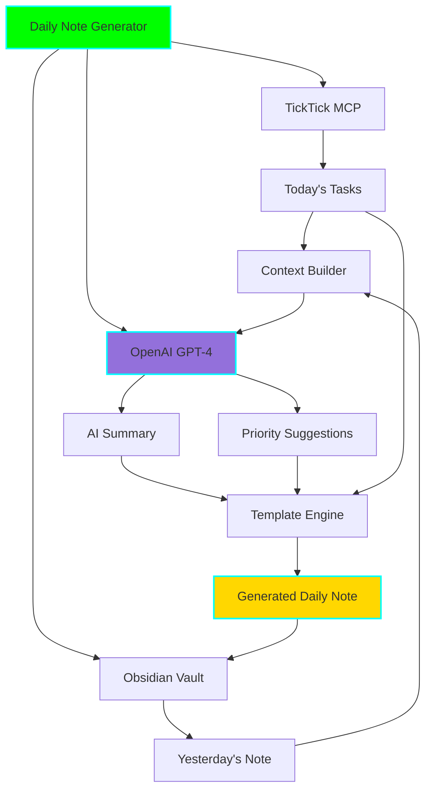
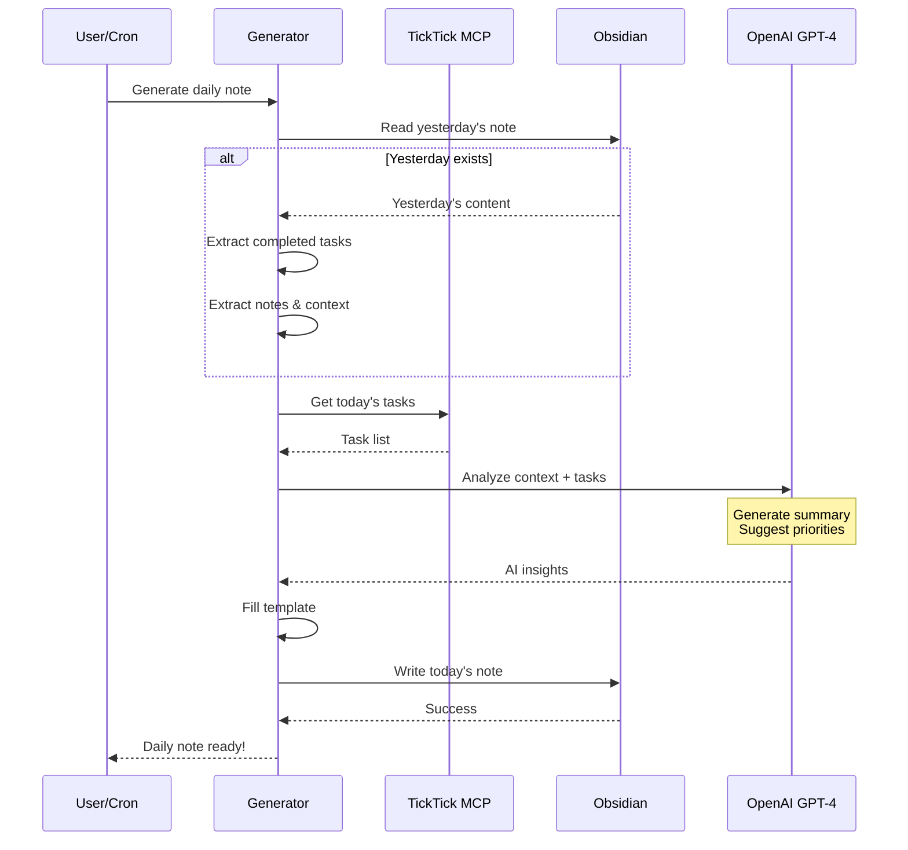

# 📝 Daily Note Generator

**Status:** 🧪 Experimental
**Tech Stack:** Python 3.11+, OpenAI GPT-4, TickTick MCP Server
**Purpose:** Automatically generate contextualized daily notes with AI-powered summaries

## 🎯 ADHD Benefits

- **🌅 Perfect Morning Routine:** Start each day with clarity, not confusion
- **🧠 Memory Assistance:** See exactly where you left off yesterday
- **⚡ Reduced Decision Fatigue:** AI suggests what to focus on today
- **📊 Progress Visibility:** Track momentum with automatic summaries
- **⏰ Consistency:** Automated generation = no more forgotten daily notes
- **🎯 Priority Focus:** 1-3 key tasks to prevent overwhelm

## 📋 Overview

This tool generates intelligent daily notes in Obsidian by:

1. **Fetching Today's Tasks** from TickTick
2. **Retrieving Yesterday's Progress** from your previous daily note
3. **Generating AI Summary** of "where you left off"
4. **Suggesting Priority Tasks** (1-3 items) for today
5. **Creating Formatted Note** in your Obsidian vault

Perfect for morning routines - wake up to a daily note that knows your context!

## 🏗️ Architecture



## 🔄 Generation Workflow



## 📁 Project Structure

```
daily-note-generator/
├── README.md
├── requirements.txt
├── .env.example
├── .python-version
├── config/
│   ├── template.md                # Daily note template
│   ├── prompts.yaml               # AI prompts
│   └── mcp_config.json            # TickTick MCP config
├── src/
│   ├── __init__.py
│   ├── main.py                    # Main entry point
│   ├── ticktick_client.py         # Fetch tasks from TickTick
│   ├── obsidian_manager.py        # Read/write Obsidian notes
│   ├── context_builder.py         # Build context for AI
│   ├── ai_generator.py            # OpenAI integration
│   └── template_engine.py         # Fill note template
├── examples/
│   ├── yesterday_note.md          # Example previous note
│   ├── generated_note.md          # Example output
│   └── custom_templates/          # Template variations
└── tests/
    ├── test_generator.py
    └── fixtures/
```

## 🚀 Getting Started

### Prerequisites

1. **OpenAI API Key** - For GPT-4 access
2. **TickTick MCP Server** running locally
3. **Obsidian Vault** with daily notes folder
4. **Python 3.11+** installed

### Installation

```bash
# Navigate to project
cd /home/user/fantastic-engine/projects/daily-note-generator

# Create virtual environment
uv venv
source .venv/bin/activate

# Install dependencies
pip install -r requirements.txt

# Copy environment template
cp .env.example .env

# Edit with your API keys and paths
nano .env
```

### Configuration

Edit `.env`:

```bash
# OpenAI Configuration
OPENAI_API_KEY=sk-your-api-key-here
OPENAI_MODEL=gpt-4-turbo-preview

# TickTick MCP Server
TICKTICK_MCP_URL=http://localhost:3000

# Obsidian Configuration
OBSIDIAN_VAULT_PATH=/path/to/your/obsidian/vault
DAILY_NOTES_FOLDER=Daily Notes
DAILY_NOTE_FORMAT=YYYY-MM-DD  # or "YYYY/MM/YYYY-MM-DD" etc.

# Generation Settings
MAX_PRIORITY_TASKS=3
INCLUDE_HABIT_TRACKER=true
INCLUDE_GRATITUDE_SECTION=true
```

Edit `config/template.md` to customize your daily note format:

```markdown
# {{date}}

## 🌅 Where You Left Off

{{ai_summary}}

## 🎯 Priority Tasks (Focus on These!)

{{priority_tasks}}

## 📋 All Tasks

{{all_tasks}}

## 📝 Notes

## 🏆 Wins

## 🙏 Gratitude

## 📊 Habit Tracker

- [ ] Exercise
- [ ] Meditation
- [ ] Deep work session
```

## 🎮 Usage

### Generate Today's Note

```bash
# Generate note for today
python src/main.py

# Generate for specific date
python src/main.py --date 2025-11-17

# Preview without creating file
python src/main.py --dry-run

# Use custom template
python src/main.py --template config/custom_templates/minimal.md
```

### Automated Morning Generation

Add to crontab for automatic generation:

```bash
# Generate daily note at 6 AM every day
0 6 * * * cd /path/to/daily-note-generator && .venv/bin/python src/main.py

# Or use systemd timer (Linux)
```

### Interactive Mode

```bash
# Interactive CLI
python src/main.py --interactive

# Prompts you for:
# - Which tasks to prioritize
# - Additional context to include
# - Template to use
```

## 📊 Example Output

### Input Context

**Yesterday's Note (2025-11-15):**
```markdown
# 2025-11-15

## Tasks
- [x] Finish API documentation
- [x] Review pull requests
- [ ] Start database migration (blocked by infrastructure team)

## Notes
- Had productive pair programming session on auth module
- Discovered performance issue in user query - need to investigate
- Team sync moved to next week
```

**Today's TickTick Tasks:**
- Complete database migration
- Investigate user query performance
- Write unit tests for auth module
- Plan Q4 features
- Review design mockups

### Generated Output (2025-11-16)

```markdown
# 2025-11-16

## 🌅 Where You Left Off

Yesterday was productive! You completed the API documentation and reviewed pull requests. You also had a valuable pair programming session on the auth module.

However, you discovered a performance issue in the user query that needs investigation. The database migration you wanted to start was blocked by the infrastructure team.

## 🎯 Priority Tasks (Focus on These!)

Based on yesterday's context and blockers, here are your top priorities:

1. **Investigate user query performance** - You discovered this issue yesterday; addressing it early prevents it from growing
2. **Write unit tests for auth module** - Natural follow-up to yesterday's pair programming session while it's fresh
3. **Complete database migration** - Check if infrastructure blockers are resolved; if not, follow up with the team

## 📋 All Tasks

### From TickTick
- [ ] Complete database migration #dev
- [ ] Investigate user query performance #bug
- [ ] Write unit tests for auth module #testing
- [ ] Plan Q4 features #planning
- [ ] Review design mockups #design

## 📝 Notes

## 🏆 Wins

## 🙏 Gratitude

## 📊 Habit Tracker
- [ ] Exercise
- [ ] Meditation
- [ ] Deep work session
```

## 🎨 Template Customization

### Available Variables

| Variable | Description | Example |
|----------|-------------|---------|
| `{{date}}` | Today's date | 2025-11-16 |
| `{{day_of_week}}` | Day name | Tuesday |
| `{{ai_summary}}` | AI-generated context | "Yesterday you..." |
| `{{priority_tasks}}` | AI-suggested priorities | Numbered list 1-3 |
| `{{all_tasks}}` | All TickTick tasks | Checkbox list |
| `{{completed_yesterday}}` | Completed tasks count | 5 |
| `{{weather}}` | Weather (if enabled) | Sunny, 72°F |

### Template Examples

**Minimal Template:**
```markdown
# {{date}}

{{ai_summary}}

## Today
{{priority_tasks}}
{{all_tasks}}
```

**Detailed Template:**
```markdown
# {{date}} - {{day_of_week}}

## Morning Review
{{ai_summary}}

## Focus Areas
{{priority_tasks}}

## Complete Task List
{{all_tasks}}

## Energy Level
- [ ] High
- [ ] Medium
- [ ] Low

## Time Blocks
- 9-11 AM:
- 11-1 PM:
- 2-4 PM:
- 4-6 PM:

## Reflection (End of Day)
### What went well:

### What to improve:

### Tomorrow's focus:
```

## 🤖 AI Prompt Customization

Edit `config/prompts.yaml`:

```yaml
summary_prompt: |
  Analyze the following context from yesterday's daily note and today's tasks.

  Yesterday's note:
  {yesterday_content}

  Today's tasks:
  {today_tasks}

  Create a brief, encouraging "where you left off" summary (2-3 sentences) that:
  1. Acknowledges yesterday's accomplishments
  2. Notes any unfinished items or blockers
  3. Creates continuity with today's work

  Keep it conversational and motivating for someone with ADHD.

priority_prompt: |
  Based on this context, suggest 1-3 priority tasks for today.

  Context:
  {context}

  Today's tasks:
  {today_tasks}

  For each priority task, briefly explain WHY it should be prioritized.
  Consider:
  - Blockers or dependencies from yesterday
  - Time-sensitive items
  - High-impact work
  - Building momentum from yesterday

  Format as a numbered list with brief explanations.

tone: encouraging  # Options: professional, casual, encouraging, minimal
```

## 📈 Advanced Features

### Weather Integration

```bash
# Enable in .env
WEATHER_ENABLED=true
WEATHER_LOCATION="San Francisco, CA"
WEATHER_API_KEY=your-openweathermap-key
```

### Habit Tracking

```yaml
# config/habits.yaml
daily_habits:
  - name: Exercise
    icon: 💪
  - name: Meditation
    icon: 🧘
  - name: Deep Work
    icon: 🎯
  - name: Read
    icon: 📚
```

### Weekly Review Integration

```bash
# Generate weekly summary on Sundays
python src/main.py --weekly-review
```

## 🚨 Troubleshooting

### No Tasks Showing Up

1. Check TickTick MCP server is running:
   ```bash
   curl http://localhost:3000/health
   ```

2. Verify tasks exist for today:
   ```bash
   python src/main.py --debug --show-tasks
   ```

### AI Summary Too Long/Short

Adjust in `config/prompts.yaml`:
```yaml
summary_max_length: 150  # words
summary_style: concise  # Options: concise, detailed, bullet-points
```

### Template Variables Not Rendering

```bash
# Check template syntax
python src/main.py --validate-template config/template.md
```

## 💰 Cost Estimates

### OpenAI API Costs

With GPT-4 Turbo:
- ~500-1000 tokens per generation
- Cost: ~$0.01-0.02 per daily note
- Monthly (30 days): ~$0.30-0.60

### Optimization Tips

1. Use GPT-3.5 for summaries (cheaper, still good)
2. Cache yesterday's note analysis
3. Batch process multiple days

## 🎯 Graduation Criteria

- [ ] Successfully generates 30 consecutive days
- [ ] AI summaries are consistently helpful (user feedback)
- [ ] Template system supports 5+ custom templates
- [ ] Integration with task sync (Project #16)
- [ ] Mobile app/widget support
- [ ] Complete test coverage (>85%)
- [ ] Performance: Generate note in <5 seconds
- [ ] Documentation with video walkthrough

## 🔮 Future Enhancements

- [ ] Voice note integration (transcribe → add to daily note)
- [ ] Automatic goal tracking
- [ ] Mood/energy tracking with insights
- [ ] Integration with calendar events
- [ ] Smart scheduling suggestions
- [ ] Weekly/monthly review automation
- [ ] Custom AI models (fine-tuned on your notes)
- [ ] Mobile push notification when note is ready

## 📚 Dependencies

- `openai` - OpenAI API client
- `requests` - HTTP client for TickTick MCP
- `python-dotenv` - Environment management
- `pyyaml` - Configuration parsing
- `jinja2` - Template rendering
- `click` - CLI interface
- `rich` - Beautiful terminal output
- `python-dateutil` - Date handling

## 📝 License

MIT License - See LICENSE file

## 🤝 Contributing

Experimental project - contributions welcome!

1. Fork the repository
2. Create feature branch
3. Test with your own daily notes
4. Submit pull request

## 📞 Support

For issues or questions:
- Review the troubleshooting section
- Check TickTick MCP documentation
- Review OpenAI API docs

---

**Start every day with clarity! 🌅**
