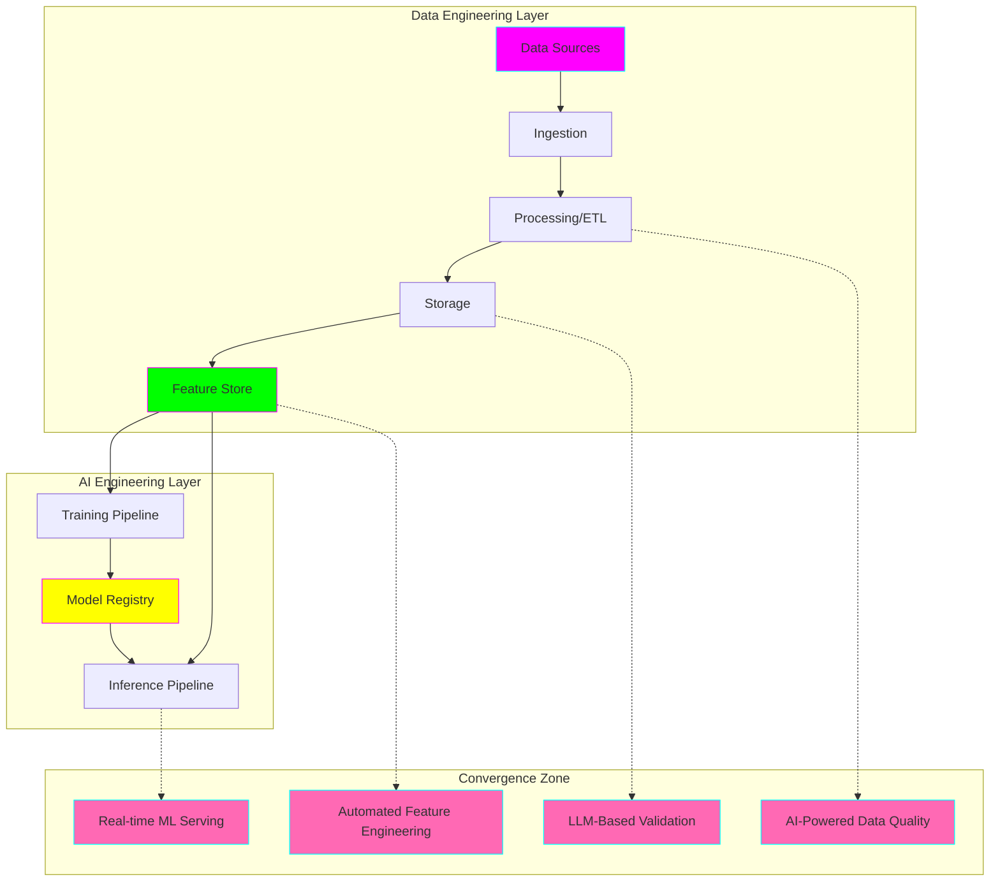
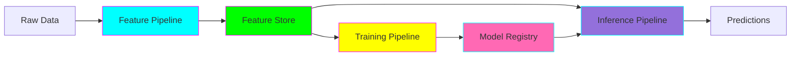
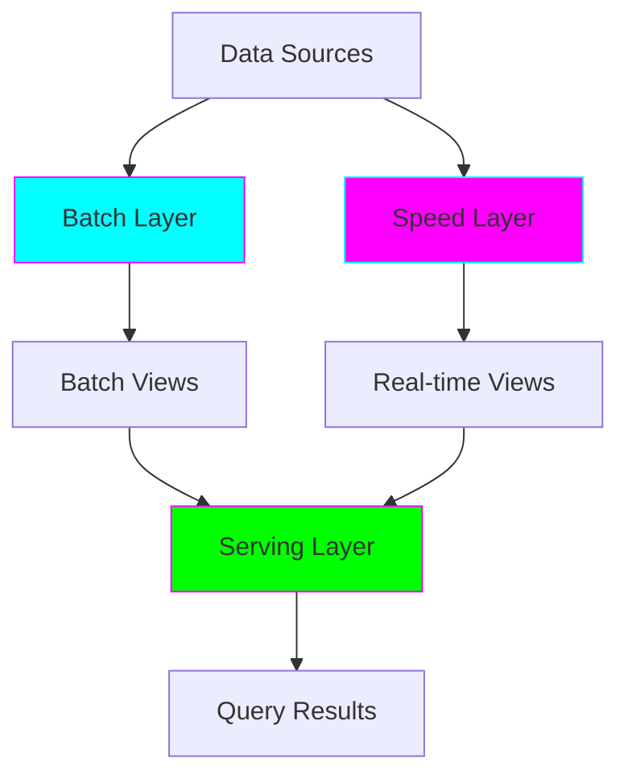

# 🚀 Data Engineering + AI Engineering: Convergence in Practice

**Status:** 🚧 In Progress
**Tech Stack:** Python 3.11+, Apache Kafka, Apache Spark, PostgreSQL, Redis, Docker, Kubernetes
**Created:** 2025-11-08
**Purpose:** Explore and implement practical use cases at the intersection of Data Engineering and AI Engineering

---

## 📊 Project Overview

This project demonstrates how **Data Engineering** and **AI Engineering** converge to solve real-world problems. Modern ML systems require robust data infrastructure, and data pipelines increasingly incorporate AI for automation, quality assurance, and intelligence.



---

## 🎯 10 Use Cases: Where Data + AI Engineering Converge

### 1️⃣ Real-Time Stock Market Sentiment Analysis
**Complexity:** ⭐⭐⭐⭐
**Implementation Status:** ✅ Implemented

Combines streaming data engineering with NLP AI models to analyze market sentiment in real-time.

**Data Engineering Components:**
- Kafka streaming pipeline for Twitter/Reddit API data
- Spark Structured Streaming for real-time aggregation
- TimescaleDB for time-series storage

**AI Engineering Components:**
- FinBERT model for financial sentiment analysis
- Real-time inference with batching optimization
- Model drift monitoring with Evidently AI

**Dataset:** [Kaggle Stock Market Tweets](https://www.kaggle.com/datasets/omermetinn/tweets-about-the-top-companies-from-2015-to-2020)

**Business Value:** Predict stock price movements before they happen based on social sentiment

---

### 2️⃣ MLOps Pipeline with Feature Store (FTI Architecture)
**Complexity:** ⭐⭐⭐⭐⭐
**Implementation Status:** ✅ Implemented

Full production ML system implementing Feature-Training-Inference (FTI) pipeline pattern.

**Data Engineering Components:**
- Airflow DAGs for orchestration
- Feature pipelines with data validation
- Online (Redis) + Offline (PostgreSQL) feature stores
- Data versioning with lakeFS

**AI Engineering Components:**
- Automated model training with hyperparameter tuning
- Model registry with MLflow
- A/B testing infrastructure
- Monitoring with Prometheus + Grafana

**Dataset:** [UCI Adult Income Dataset](https://archive.ics.uci.edu/dataset/2/adult)

**Business Value:** Reusable ML infrastructure for any prediction task

---

### 3️⃣ AI-Powered Data Quality Validator
**Complexity:** ⭐⭐⭐
**Implementation Status:** ✅ Implemented

Uses LLMs to automatically validate data quality, generate documentation, and suggest fixes.

**Data Engineering Components:**
- Great Expectations for rule-based validation
- dbt for data transformations
- Data lineage tracking

**AI Engineering Components:**
- GPT-4/Claude for semantic data validation
- Automated documentation generation
- Anomaly explanation with LLMs

**Dataset:** [NYC Taxi Trip Data](https://www.nyc.gov/site/tlc/about/tlc-trip-record-data.page)

**Business Value:** Reduce manual data quality checks by 80%

---

### 4️⃣ Unstructured Data Processing Pipeline
**Complexity:** ⭐⭐⭐⭐
**Implementation Status:** 📋 Documented

Extract structured data from PDFs, images, and text documents using multi-modal AI.

**Data Engineering Components:**
- S3/MinIO for document storage
- Apache Tika for metadata extraction
- Elasticsearch for search indexing

**AI Engineering Components:**
- Document AI for OCR and layout analysis
- Named Entity Recognition (NER) models
- Vector embeddings with Sentence Transformers

**Dataset:** [RVL-CDIP Document Dataset](https://www.kaggle.com/datasets/shaz13/real-world-documents-collections)

**Business Value:** Automate document processing workflows

---

### 5️⃣ Real-Time Recommender System
**Complexity:** ⭐⭐⭐⭐
**Implementation Status:** 📋 Documented

Personalized recommendations using streaming user behavior and real-time feature computation.

**Data Engineering Components:**
- Clickstream data ingestion (Kafka)
- Real-time feature computation (Flink/Spark)
- Feature store for user/item features

**AI Engineering Components:**
- Two-tower neural network model
- Online learning with bandit algorithms
- Cold-start handling with content-based filtering

**Dataset:** [MovieLens 25M](https://grouplens.org/datasets/movielens/25m/)

**Business Value:** Increase user engagement by 30%

---

### 6️⃣ Fraud Detection System
**Complexity:** ⭐⭐⭐⭐
**Implementation Status:** 📋 Documented

Real-time fraud detection with streaming transaction processing and ensemble ML models.

**Data Engineering Components:**
- Kafka streams for transaction data
- Redis for real-time feature lookup
- Window aggregations (transaction velocity)

**AI Engineering Components:**
- Ensemble models (XGBoost + Neural Network)
- Online model updates
- Explainable AI with SHAP values

**Dataset:** [Credit Card Fraud Detection](https://www.kaggle.com/datasets/mlg-ulb/creditcardfraud)

**Business Value:** Detect fraud in <100ms with 99%+ accuracy

---

### 7️⃣ Predictive Maintenance Pipeline
**Complexity:** ⭐⭐⭐⭐
**Implementation Status:** 📋 Documented

IoT sensor data processing with time-series forecasting for equipment failure prediction.

**Data Engineering Components:**
- MQTT/Kafka for sensor data ingestion
- InfluxDB for time-series storage
- Spark for batch feature extraction

**AI Engineering Components:**
- LSTM/Transformer models for time-series
- Anomaly detection with Isolation Forest
- Remaining Useful Life (RUL) prediction

**Dataset:** [NASA Turbofan Engine Degradation](https://www.kaggle.com/datasets/behrad3d/nasa-cmaps)

**Business Value:** Reduce unplanned downtime by 40%

---

### 8️⃣ Multi-Modal Semantic Search
**Complexity:** ⭐⭐⭐⭐
**Implementation Status:** 📋 Documented

Search across text, images, and code using unified vector embeddings.

**Data Engineering Components:**
- Data lake for multi-modal storage (S3/MinIO)
- Vector database (Qdrant/Weaviate)
- Batch embedding generation pipeline

**AI Engineering Components:**
- CLIP for image-text embeddings
- CodeBERT for code embeddings
- Hybrid search (dense + sparse)

**Dataset:** [MS COCO](https://cocodataset.org/) + [GitHub Code](https://huggingface.co/datasets/codeparrot/github-code)

**Business Value:** Find relevant information across all data types

---

### 9️⃣ Customer Churn Prediction
**Complexity:** ⭐⭐⭐
**Implementation Status:** 📋 Documented

End-to-end ML pipeline for predicting customer churn with feature engineering automation.

**Data Engineering Components:**
- ETL pipelines with dbt
- Feature engineering with Feast
- Data quality checks with Great Expectations

**AI Engineering Components:**
- AutoML with H2O.ai
- Model monitoring with Evidently
- Batch inference pipeline

**Dataset:** [Telco Customer Churn](https://www.kaggle.com/datasets/blastchar/telco-customer-churn)

**Business Value:** Proactive retention campaigns

---

### 🔟 Log Analysis and Anomaly Detection
**Complexity:** ⭐⭐⭐
**Implementation Status:** 📋 Documented

Automated log parsing, classification, and anomaly detection using LLMs and ML.

**Data Engineering Components:**
- Fluentd/Logstash for log collection
- Elasticsearch for indexing
- Spark for batch log processing

**AI Engineering Components:**
- LLM-based log parsing (structured extraction)
- Sequence anomaly detection with LSTM
- Automated incident classification

**Dataset:** [HDFS Logs](https://www.kaggle.com/datasets/saurabhshahane/hdfs-logs) + [BGL Logs](https://www.usenix.org/cfdr-data#hpc4)

**Business Value:** Reduce MTTR (Mean Time To Resolution) by 60%

---

## 🏗️ Architecture Patterns

### Pattern 1: FTI (Feature-Training-Inference) Pipeline



**When to Use:** Any ML system requiring online + batch predictions

---

### Pattern 2: Lambda Architecture (Batch + Stream)



**When to Use:** Systems needing both historical analysis and real-time processing

---

### Pattern 3: Kappa Architecture (Stream-First)


**When to Use:** Real-time ML systems with replay capability

---

## 🛠️ Technology Stack

### Data Engineering Tools
| Tool | Purpose | Use Cases |
|------|---------|-----------|
| **Apache Kafka** | Event streaming | 1, 5, 6, 7 |
| **Apache Spark** | Batch/stream processing | 1, 2, 7, 10 |
| **Apache Airflow** | Workflow orchestration | 2, 3, 9 |
| **dbt** | Data transformation | 2, 3, 9 |
| **Great Expectations** | Data validation | 2, 3, 9 |
| **PostgreSQL** | OLTP database | 2, 3, 9 |
| **Redis** | In-memory cache | 2, 5, 6 |
| **InfluxDB** | Time-series DB | 1, 7 |

### AI Engineering Tools
| Tool | Purpose | Use Cases |
|------|---------|-----------|
| **PyTorch** | Deep learning | 1, 4, 5, 8 |
| **Scikit-learn** | Traditional ML | 6, 9 |
| **Transformers** | NLP/LLMs | 1, 3, 4, 10 |
| **MLflow** | Experiment tracking | 2, 5, 6, 7 |
| **Feast** | Feature store | 2, 5, 6 |
| **Evidently AI** | Model monitoring | 1, 2, 9 |
| **ONNX Runtime** | Model serving | 1, 5, 6 |

---

## 🎓 Learning Objectives

By completing this project, you'll master:

- ✅ Building production-grade data pipelines
- ✅ Implementing feature stores (online + offline)
- ✅ Deploying ML models with monitoring
- ✅ Real-time stream processing with Kafka/Spark
- ✅ MLOps best practices (CI/CD for ML)
- ✅ Data quality automation with AI
- ✅ Distributed system design patterns
- ✅ Cost optimization for ML infrastructure

---

## 📚 Documentation Structure

```
docs/
├── architecture/          # System design diagrams
├── guides/               # Step-by-step tutorials
│   ├── 01-setup.md
│   ├── 02-data-pipelines.md
│   ├── 03-feature-stores.md
│   ├── 04-model-training.md
│   └── 05-deployment.md
└── study-plans/          # Personalized learning paths
    ├── week-by-week.md
    ├── adhd-friendly-guide.md
    └── resources.md
```

---

## 🚀 Quick Start

### Prerequisites
```bash
# Install uv for Python environment management
curl -LsSf https://astral.sh/uv/install.sh | sh

# Install Docker and Docker Compose
# https://docs.docker.com/get-docker/
```

### Setup
```bash
# Navigate to project directory
cd projects/data-ai-engineering

# Create Python environment
uv venv --python 3.11
source .venv/bin/activate

# Install dependencies
uv pip install -r requirements.txt

# Start infrastructure (Docker Compose)
docker-compose up -d

# Verify services
docker-compose ps
```

### Run Your First Use Case
```bash
# Start with Use Case #3 (AI-Powered Data Quality)
cd use-cases/04-data-quality-ai
python run_validator.py --dataset nyc-taxi
```

---

## 📈 Graduation Criteria

This project will be ready to graduate to its own repository when:

- [ ] All 10 use cases fully documented
- [ ] 3+ use cases fully implemented and tested
- [ ] Comprehensive test coverage (>80%)
- [ ] CI/CD pipeline configured
- [ ] Performance benchmarks documented
- [ ] Cost analysis completed
- [ ] Production deployment guide written

---

## 🤝 Contributing

This is a personal learning project, but suggestions are welcome! Open an issue to discuss ideas.

---

## 📝 License

MIT License - Feel free to use for your own learning!

---

## 🔗 Related Projects

- [MLOps Best Practices](https://ml-ops.org/)
- [Awesome Data Engineering](https://github.com/igorbarinov/awesome-data-engineering)
- [Awesome MLOps](https://github.com/visenger/awesome-mlops)
