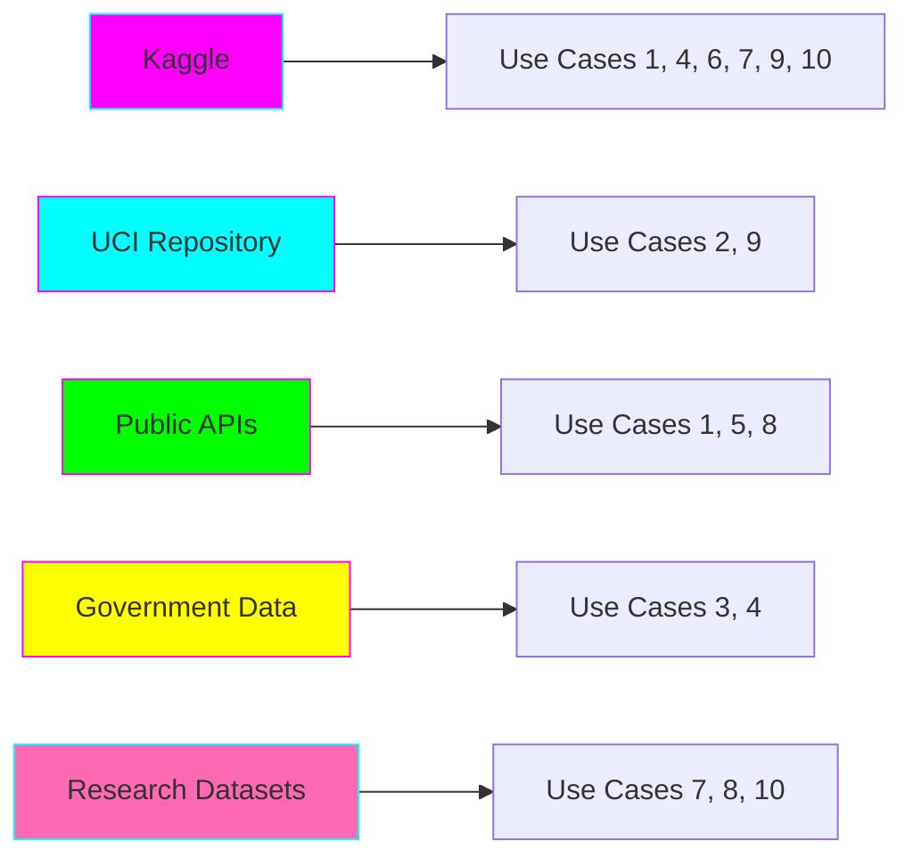

# 📊 Open Source Datasets for All Use Cases

This document provides detailed information about the datasets used in each use case, including download links, schemas, and preprocessing steps.

---

## Dataset Sources Overview



---

## Use Case #1: Real-Time Stock Market Sentiment Analysis

### Primary Dataset: Stock Market Tweets
- **Source:** Kaggle
- **Link:** https://www.kaggle.com/datasets/omermetinn/tweets-about-the-top-companies-from-2015-to-2020
- **Size:** ~1M tweets, ~500MB
- **Format:** CSV
- **License:** CC0: Public Domain

**Schema:**
```python
{
    'tweet_id': int64,
    'writer': str,
    'post_date': datetime,
    'body': str,
    'comment_num': int,
    'retweet_num': int,
    'like_num': int,
    'ticker': str  # Stock symbol
}
```

**Download & Setup:**
```bash
# Install Kaggle CLI
pip install kaggle

# Download dataset
kaggle datasets download -d omermetinn/tweets-about-the-top-companies-from-2015-to-2020

# Extract
unzip tweets-about-the-top-companies-from-2015-to-2020.zip -d data/stock-tweets/
```

### Supplementary: Stock Price Data
- **Source:** Yahoo Finance API
- **Link:** https://pypi.org/project/yfinance/
- **License:** Free for personal use

```python
import yfinance as yf
# Download stock prices for AAPL, GOOGL, TSLA, etc.
df = yf.download(['AAPL', 'GOOGL', 'TSLA'], start='2015-01-01', end='2020-12-31')
```

---

## Use Case #2: MLOps Pipeline with Feature Store

### Primary Dataset: UCI Adult Income Dataset
- **Source:** UCI Machine Learning Repository
- **Link:** https://archive.ics.uci.edu/dataset/2/adult
- **Size:** 48,842 instances, ~5MB
- **Format:** CSV
- **License:** Open Data Commons

**Schema:**
```python
{
    'age': int,
    'workclass': str,
    'fnlwgt': int,
    'education': str,
    'education-num': int,
    'marital-status': str,
    'occupation': str,
    'relationship': str,
    'race': str,
    'sex': str,
    'capital-gain': int,
    'capital-loss': int,
    'hours-per-week': int,
    'native-country': str,
    'income': str  # Target: >50K or <=50K
}
```

**Download & Setup:**
```bash
# Using ucimlrepo package
pip install ucimlrepo

# Python code:
from ucimlrepo import fetch_ucirepo
adult = fetch_ucirepo(id=2)
X = adult.data.features
y = adult.data.targets
```

---

## Use Case #3: AI-Powered Data Quality Validator

### Primary Dataset: NYC Taxi Trip Data
- **Source:** NYC Taxi & Limousine Commission
- **Link:** https://www.nyc.gov/site/tlc/about/tlc-trip-record-data.page
- **Size:** ~10GB per month (we'll use 1 month sample)
- **Format:** Parquet
- **License:** Open Data

**Schema:**
```python
{
    'VendorID': int,
    'tpep_pickup_datetime': datetime,
    'tpep_dropoff_datetime': datetime,
    'passenger_count': int,
    'trip_distance': float,
    'RatecodeID': int,
    'store_and_fwd_flag': str,
    'PULocationID': int,
    'DOLocationID': int,
    'payment_type': int,
    'fare_amount': float,
    'extra': float,
    'mta_tax': float,
    'tip_amount': float,
    'tolls_amount': float,
    'improvement_surcharge': float,
    'total_amount': float,
    'congestion_surcharge': float
}
```

**Download & Setup:**
```bash
# Download January 2024 data
wget https://d37ci6vzurychx.cloudfront.net/trip-data/yellow_tripdata_2024-01.parquet \
  -O data/nyc-taxi/yellow_tripdata_2024-01.parquet
```

---

## Use Case #4: Unstructured Data Processing

### Primary Dataset: RVL-CDIP Document Dataset
- **Source:** Kaggle (originally from IIT-CDIP)
- **Link:** https://www.kaggle.com/datasets/shaz13/real-world-documents-collections
- **Size:** 400,000 images, ~50GB
- **Format:** TIFF/PNG images + labels
- **License:** CC BY 4.0

**Classes:** (16 document types)
- letter, form, email, handwritten, advertisement, scientific report, scientific publication,
  specification, file folder, news article, budget, invoice, presentation, questionnaire,
  resume, memo

**Download & Setup:**
```bash
kaggle datasets download -d shaz13/real-world-documents-collections
unzip real-world-documents-collections.zip -d data/documents/
```

---

## Use Case #5: Real-Time Recommender System

### Primary Dataset: MovieLens 25M
- **Source:** GroupLens Research
- **Link:** https://grouplens.org/datasets/movielens/25m/
- **Size:** 25 million ratings, ~250MB
- **Format:** CSV
- **License:** Open for academic use

**Files:**
- `ratings.csv`: userId, movieId, rating, timestamp
- `movies.csv`: movieId, title, genres
- `tags.csv`: userId, movieId, tag, timestamp
- `links.csv`: movieId, imdbId, tmdbId

**Download & Setup:**
```bash
wget https://files.grouplens.org/datasets/movielens/ml-25m.zip
unzip ml-25m.zip -d data/movielens/
```

---

## Use Case #6: Fraud Detection System

### Primary Dataset: Credit Card Fraud Detection
- **Source:** Kaggle (from Worldline and ULB)
- **Link:** https://www.kaggle.com/datasets/mlg-ulb/creditcardfraud
- **Size:** 284,807 transactions, ~150MB
- **Format:** CSV
- **License:** DbCL v1.0

**Schema:**
```python
{
    'Time': int,  # Seconds since first transaction
    'V1-V28': float,  # PCA-transformed features (anonymized)
    'Amount': float,
    'Class': int  # 0=legitimate, 1=fraud
}
```

**Note:** Highly imbalanced dataset (0.172% fraud rate)

**Download & Setup:**
```bash
kaggle datasets download -d mlg-ulb/creditcardfraud
unzip creditcardfraud.zip -d data/fraud/
```

---

## Use Case #7: Predictive Maintenance

### Primary Dataset: NASA Turbofan Engine Degradation
- **Source:** NASA Prognostics Data Repository (via Kaggle)
- **Link:** https://www.kaggle.com/datasets/behrad3d/nasa-cmaps
- **Size:** 4 datasets (FD001-FD004), ~50MB total
- **Format:** TXT (space-separated)
- **License:** Public Domain

**Schema:**
```python
{
    'unit_number': int,
    'time_cycles': int,
    'operational_setting_1': float,
    'operational_setting_2': float,
    'operational_setting_3': float,
    'sensor_measurement_1-21': float  # 21 sensor readings
}
```

**Download & Setup:**
```bash
kaggle datasets download -d behrad3d/nasa-cmaps
unzip nasa-cmaps.zip -d data/predictive-maintenance/
```

---

## Use Case #8: Multi-Modal Semantic Search

### Primary Dataset: MS COCO (Images + Captions)
- **Source:** Microsoft COCO
- **Link:** https://cocodataset.org/#download
- **Size:** 118K training images, ~18GB
- **Format:** JPEG + JSON annotations
- **License:** CC BY 4.0

**Download & Setup:**
```bash
# Download 2017 Train images
wget http://images.cocodataset.org/zips/train2017.zip
wget http://images.cocodataset.org/annotations/annotations_trainval2017.zip

unzip train2017.zip -d data/coco/
unzip annotations_trainval2017.zip -d data/coco/
```

### Supplementary: GitHub Code Dataset
- **Source:** Hugging Face
- **Link:** https://huggingface.co/datasets/codeparrot/github-code
- **Size:** ~20GB (Python subset recommended)
- **License:** Apache 2.0

```python
from datasets import load_dataset
ds = load_dataset("codeparrot/github-code",
                  languages=["Python"],
                  streaming=True)
```

---

## Use Case #9: Customer Churn Prediction

### Primary Dataset: Telco Customer Churn
- **Source:** Kaggle (IBM Sample Dataset)
- **Link:** https://www.kaggle.com/datasets/blastchar/telco-customer-churn
- **Size:** 7,043 customers, ~1MB
- **Format:** CSV
- **License:** Open Database

**Schema:**
```python
{
    'customerID': str,
    'gender': str,
    'SeniorCitizen': int,
    'Partner': str,
    'Dependents': str,
    'tenure': int,
    'PhoneService': str,
    'MultipleLines': str,
    'InternetService': str,
    'OnlineSecurity': str,
    'OnlineBackup': str,
    'DeviceProtection': str,
    'TechSupport': str,
    'StreamingTV': str,
    'StreamingMovies': str,
    'Contract': str,
    'PaperlessBilling': str,
    'PaymentMethod': str,
    'MonthlyCharges': float,
    'TotalCharges': float,
    'Churn': str  # Target: Yes/No
}
```

**Download & Setup:**
```bash
kaggle datasets download -d blastchar/telco-customer-churn
unzip telco-customer-churn.zip -d data/churn/
```

---

## Use Case #10: Log Analysis and Anomaly Detection

### Primary Dataset: HDFS Logs
- **Source:** Kaggle (Loghub)
- **Link:** https://www.kaggle.com/datasets/saurabhshahane/hdfs-logs
- **Size:** ~1.5GB uncompressed
- **Format:** Log text files
- **License:** Open Data

**Sample Log Entry:**
```
081109 203615 148 INFO dfs.DataNode$PacketResponder: PacketResponder 1 for block blk_38865049064139660 terminating
```

**Download & Setup:**
```bash
kaggle datasets download -d saurabhshahane/hdfs-logs
unzip hdfs-logs.zip -d data/logs/
```

### Supplementary: BGL Logs
- **Source:** Usenix CFDR
- **Link:** https://www.usenix.org/cfdr-data#hpc4
- **Size:** ~700MB
- **Format:** Log text files
- **License:** Open Data

---

## Data Storage Structure

Recommended directory structure for all datasets:

```
data/
├── stock-tweets/
│   ├── raw/
│   ├── processed/
│   └── features/
├── adult-income/
├── nyc-taxi/
├── documents/
├── movielens/
├── fraud/
├── predictive-maintenance/
├── coco/
├── github-code/
├── churn/
└── logs/
```

---

## Data Preprocessing Scripts

Each use case folder contains preprocessing scripts:

```bash
# Generic preprocessing template
python use-cases/{use-case-name}/scripts/01_download_data.py
python use-cases/{use-case-name}/scripts/02_clean_data.py
python use-cases/{use-case-name}/scripts/03_feature_engineering.py
```

---

## Dataset Size Summary

| Use Case | Dataset | Raw Size | Processed Size | Download Time (100Mbps) |
|----------|---------|----------|----------------|-------------------------|
| 1 | Stock Tweets | 500MB | 200MB | ~1 min |
| 2 | Adult Income | 5MB | 3MB | <10 sec |
| 3 | NYC Taxi | 10GB | 5GB | ~15 min |
| 4 | RVL-CDIP | 50GB | 30GB | ~90 min |
| 5 | MovieLens | 250MB | 150MB | ~30 sec |
| 6 | Fraud Detection | 150MB | 80MB | ~20 sec |
| 7 | NASA Turbofan | 50MB | 30MB | ~10 sec |
| 8 | MS COCO | 18GB | 10GB | ~25 min |
| 9 | Telco Churn | 1MB | 500KB | <5 sec |
| 10 | HDFS Logs | 1.5GB | 800MB | ~2 min |

**Total:** ~80GB raw, ~46GB processed

---

## Quick Start: Download All Datasets

```bash
# Run the master download script
cd projects/data-ai-engineering
python scripts/download_all_datasets.py --use-cases 1,2,3

# Or download specific use case
python scripts/download_all_datasets.py --use-case 2
```

---

## Data Ethics and Privacy

✅ **All datasets are:**
- Publicly available
- Properly licensed for educational/research use
- Anonymized (where applicable)
- Free to download

⚠️ **Important Notes:**
- NYC Taxi data is anonymized
- Credit card fraud data is PCA-transformed (privacy-preserving)
- MovieLens has explicit research-use license
- Always check license before commercial use

---

## Dataset Updates

Datasets are versioned in DVC (Data Version Control):

```bash
# Track dataset with DVC
dvc add data/stock-tweets/raw/tweets.csv
git add data/stock-tweets/raw/tweets.csv.dvc

# Pull latest dataset version
dvc pull
```
