# 🚀 Getting Started: Data + AI Engineering

**Read Time:** 10 minutes
**Difficulty:** Beginner
**Prerequisites:** Basic Python, SQL, Docker knowledge

---

## 🎯 What You'll Learn (in 10 minutes)


1. **Core Concepts** (2 min) - What is Data + AI Engineering?
2. **Environment Setup** (5 min) - Install tools
3. **First Use Case** (3 min) - Run AI Data Quality Validator

---

## 📖 Part 1: Core Concepts (2 minutes)

### What is Data Engineering?

```mermaid
flowchart LR
    A[Raw Data<br/>💾] --> B[Extract<br/>📥]
    B --> C[Transform<br/>⚙️]
    C --> D[Load<br/>📤]
    D --> E[Clean Data<br/>✨]

    style A fill:#ff00ff,stroke:#00ffff
    style E fill:#00ff00,stroke:#ff00ff
```



**In simple terms:** Moving and cleaning data so it's ready to use.

**Examples:**
- Collecting user clicks from website → Database
- Converting CSVs → Organized database tables
- Combining data from 10 different sources

---

### What is AI Engineering?

```mermaid
flowchart LR
    A[Clean Data<br/>✨] --> B[Train Model<br/>🧠]
    B --> C[Deploy Model<br/>🚀]
    C --> D[Make Predictions<br/>🔮]

    style A fill:#00ff00,stroke:#ff00ff
    style B fill:#ffff00,stroke:#ff00ff
    style C fill:#ff69b4,stroke:#00ffff
    style D fill:#9370db,stroke:#00ffff
```



**In simple terms:** Building and running AI models in production.

**Examples:**
- Training a model to detect spam
- Deploying model to classify 1M emails/day
- Monitoring model accuracy over time

---

### How They Converge 🤝


**Why this matters:**
- ✅ Faster iteration (no handoffs)
- ✅ Better models (you control the data)
- ✅ Higher pay (rare skillset)

---

## 🛠️ Part 2: Environment Setup (5 minutes)

### Checklist

- [ ] Install Docker
- [ ] Install Python 3.11+
- [ ] Install uv (Python package manager)
- [ ] Clone repository
- [ ] Verify setup

---

### Step-by-Step Setup

#### 1. Install Docker (1 min)

```bash
# Mac
brew install --cask docker

# Linux
curl -fsSL https://get.docker.com -o get-docker.sh
sudo sh get-docker.sh

# Verify
docker --version
# Output: Docker version 24.x.x
```

#### 2. Install Python + uv (1 min)

```bash
# Install uv (fast Python package manager)
curl -LsSf https://astral.sh/uv/install.sh | sh

# Verify
uv --version
python3 --version
```

#### 3. Navigate to Project (30 sec)

```bash
cd /home/user/fantastic-engine/projects/data-ai-engineering
```

#### 4. Test Setup (2 min)

```bash
# Quick test: Run AI Data Quality Validator
cd use-cases/04-data-quality-ai

# Create virtual environment
uv venv --python 3.11
source .venv/bin/activate

# Install minimal dependencies
uv pip install pandas click rich loguru

# Test import
python -c "import pandas; print('✅ Setup successful!')"
```

✅ If you see "Setup successful!" → Continue!
❌ If you see errors → Check Python version

---

## 🎮 Part 3: Your First Project (3 minutes)

Let's run the **AI-Powered Data Quality Validator**!

### What It Does

```mermaid
flowchart LR
    A[📊 Your Data] --> B[🤖 AI Validator]
    B --> C1[✅ Quality Report]
    B --> C2[💡 Suggestions]
    B --> C3[📝 Auto Docs]

    style A fill:#ff00ff,stroke:#00ffff
    style B fill:#00ff00,stroke:#ff00ff
```



**In 30 seconds:** AI reads your data, finds problems, explains them in English, and suggests fixes.

---

### Run It!

```bash
# 1. Create sample dataset (10 seconds)
cat > sample_data.csv << 'EOF'
age,income,score
25,50000,85
30,-5000,92
35,75000,88
40,60000,150
EOF

# 2. Run validator (20 seconds)
python run_validator.py \
  --dataset sample_data.csv \
  --quick \
  --llm-provider none

# Output:
# 🔍 AI-Powered Data Quality Validator
# ✓ Loading dataset...
# ✓ Running validation...
# ✅ Validation PASSED
```

### What Just Happened?

1. ✅ Validator loaded your CSV
2. ✅ Checked for common issues (negatives, outliers)
3. ✅ Generated report

**Next:** Try with a real dataset (NYC Taxi data)!

---

## ✅ Part 4: Validation (30 seconds)

Quick quiz to check understanding:

### Question 1
**What does Data Engineering do?**
- A) Train AI models
- B) Move and clean data ✅
- C) Build websites

### Question 2
**What's the benefit of Data + AI convergence?**
- A) Slower development
- B) Faster iteration, better models ✅
- C) More meetings

### Question 3
**What did the validator check in our example?**
- A) Spelling errors
- B) Data quality issues (negative values, outliers) ✅
- C) Code bugs

---

## 🎯 What's Next?


**Recommended Path:**

### Week 1: Foundations
- [ ] Read: [02-core-concepts.md](02-core-concepts.md) - Deep dive into architecture patterns
- [ ] Practice: Use Case #3 (AI Data Quality) - Full tutorial
- [ ] Time: 2-3 hours

### Week 2: Production ML
- [ ] Read: [03-mlops-fundamentals.md](03-mlops-fundamentals.md) - Feature stores, model registry
- [ ] Practice: Use Case #2 (MLOps Pipeline) - Build FTI pipeline
- [ ] Time: 4-5 hours

### Week 3: Real-Time Systems
- [ ] Read: [04-streaming-systems.md](04-streaming-systems.md) - Kafka, Spark Streaming
- [ ] Practice: Use Case #1 (Real-time Sentiment) - Streaming pipeline
- [ ] Time: 4-5 hours

### Week 4: Advanced Topics
- [ ] Read: [05-production-deployment.md](05-production-deployment.md) - Kubernetes, monitoring
- [ ] Practice: Deploy to AWS/GCP
- [ ] Time: 3-4 hours

**Total Time:** ~15 hours over 4 weeks = **1 hour/day**

---

## 🆘 Troubleshooting

### Issue: Docker not working
```bash
# Check Docker is running
docker ps

# If not:
# Mac: Open Docker Desktop app
# Linux: sudo systemctl start docker
```

### Issue: Python version wrong
```bash
# Install Python 3.11 with uv
uv python install 3.11

# Create environment with specific version
uv venv --python 3.11
```

### Issue: Import errors
```bash
# Make sure venv is activated
source .venv/bin/activate  # Mac/Linux
.venv\Scripts\activate     # Windows

# Reinstall dependencies
uv pip install -r requirements.txt
```

---

## 📚 Additional Resources

### Quick References
- [Cheat Sheet](../architecture/cheat-sheet.md) - All commands in one place
- [FAQ](../architecture/faq.md) - Common questions

### Deep Dives (when ready)
- [Architecture Patterns](../architecture/patterns.md)
- [Best Practices](../architecture/best-practices.md)

---

## 🎉 Congratulations!

You've completed the getting started guide!

**You now know:**
- ✅ What Data + AI Engineering is
- ✅ How to set up your environment
- ✅ How to run your first use case

**Next step:** [Core Concepts Guide →](02-core-concepts.md)

---

**Time spent:** ~10 minutes
**Progress:** ████░░░░░░ 10% of full project

Keep going! 🚀
