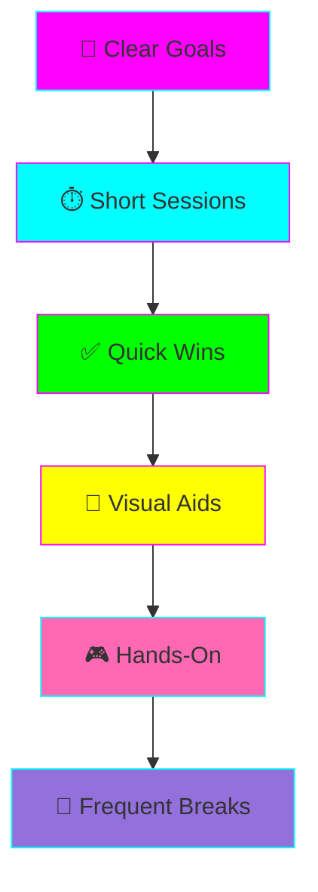
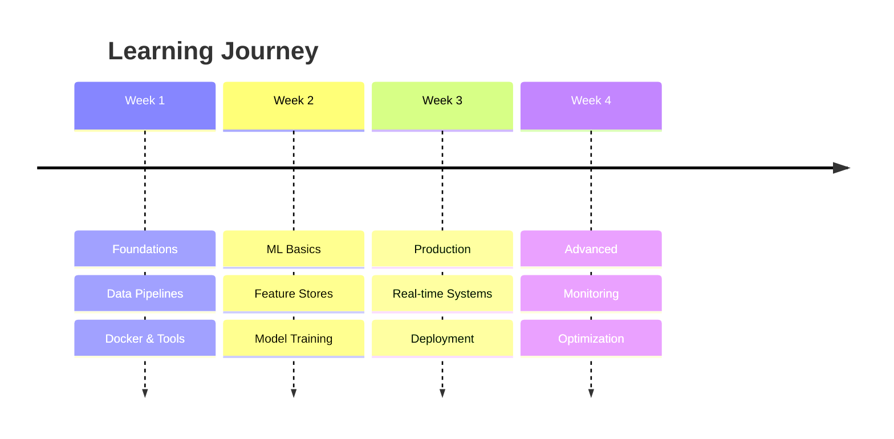
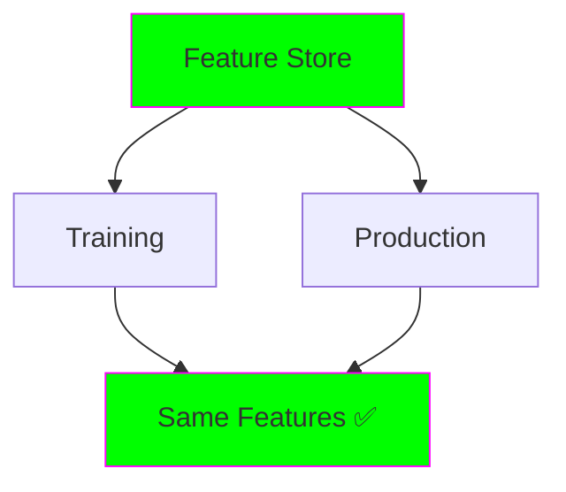

# 🧠 ADHD-Friendly Study Plan: Data + AI Engineering

**Created for:** Visual learners with ADHD
**Time Commitment:** 1 hour/day for 4 weeks
**Total:** ~25 hours to proficiency

---

## 🎯 How This Plan Works

### ADHD-Optimized Learning Principles



**What makes this ADHD-friendly:**

✅ **Time-boxed** - Max 25-minute focus blocks
✅ **Visual-first** - Diagrams before text
✅ **Immediate feedback** - Code runs instantly
✅ **Clear checkpoints** - Track progress visually
✅ **No fluff** - Get to the point
✅ **Gamified** - Earn badges, level up

---

## 📊 Your Learning Dashboard

### Current Level: Beginner
```
Beginner ████████░░ Intermediate ░░░░░░░░░░ Advanced ░░░░░░░░░░ Expert
         ^
       You are here
```

### Skills Unlocked: 0/15

| Skill | Status | Badge |
|-------|--------|-------|
| Docker Basics | 🔒 Locked | |
| Python Data Pipelines | 🔒 Locked | |
| Feature Engineering | 🔒 Locked | |
| ML Model Training | 🔒 Locked | |
| Model Deployment | 🔒 Locked | |
| Feature Stores | 🔒 Locked | |
| Real-time Streaming | 🔒 Locked | |
| MLOps Fundamentals | 🔒 Locked | |
| Kubernetes Basics | 🔒 Locked | |
| Monitoring & Alerts | 🔒 Locked | |
| Data Quality Validation | 🔒 Locked | |
| AI Integration | 🔒 Locked | |
| Production Deployment | 🔒 Locked | |
| System Architecture | 🔒 Locked | |
| Performance Optimization | 🔒 Locked | |

---

## 🗓️ 4-Week Sprint Plan

### Overview



---

## 📅 Week 1: Foundations (7 hours)

### Goal: Build and run your first data pipeline

---

### Day 1: Monday (1 hour)
**Theme:** 🏗️ Setup & Orientation

#### Session 1 (25 min) - Environment Setup
```
⏱️ Timer: 25 minutes
🎯 Goal: Get Docker + Python working
```

**Tasks:**
- [ ] Install Docker Desktop
- [ ] Install uv (Python package manager)
- [ ] Clone repository
- [ ] Run hello-world Docker container

**Checkpoint:**
```bash
docker run hello-world
# ✅ If you see "Hello from Docker!" → Success!
```

**Break:** 5 minutes (stand up, water, stretch)

#### Session 2 (25 min) - First Code Run
```
⏱️ Timer: 25 minutes
🎯 Goal: Run AI Data Quality Validator
```

**Tasks:**
- [ ] Navigate to use-case folder
- [ ] Create Python virtual environment
- [ ] Run validator on sample data
- [ ] See the output

**Checkpoint:**
```bash
python run_validator.py --dataset sample.csv --quick
# ✅ If you see validation report → Success!
```

**Badge Earned:** 🏅 Docker Basics

---

### Day 2: Tuesday (1 hour)
**Theme:** 📊 Understanding Data Pipelines

#### Session 1 (25 min) - Read Architecture
```
⏱️ Timer: 25 minutes
🎯 Goal: Understand data flow
```

**Visual Learning:**
1. Open `README.md` in Use Case #3
2. Focus on the architecture diagram (2 min)
3. Draw the flow on paper (5 min)
4. Read the "What This Solves" section (8 min)
5. Review the example config (10 min)

**Active Learning Check:**
- Can you explain the flow in your own words?
- Draw it from memory (don't look!)

**Break:** 5 minutes

#### Session 2 (25 min) - Hands-On Practice
```
⏱️ Timer: 25 minutes
🎯 Goal: Modify the validator config
```

**Tasks:**
- [ ] Open `configs/nyc_taxi_config.yaml`
- [ ] Change validation thresholds
- [ ] Add a new validation rule
- [ ] Run and observe changes

**Experiment:**
```yaml
# Try this: Lower the threshold
- column: "fare_amount"
  expectations:
    - type: "expect_column_values_to_be_between"
      min: 0
      max: 100  # Changed from 500 - see more failures!
```

**Badge Earned:** 🏅 Python Data Pipelines

---

### Day 3: Wednesday (1 hour)
**Theme:** 🧪 Data Quality Deep Dive

#### Session 1 (25 min) - Explore the Code
```
⏱️ Timer: 25 minutes
🎯 Goal: Understand validation logic
```

**Code Reading (Active):**
- [ ] Open `src/validators/rule_based.py`
- [ ] Read ONLY the function names first (2 min)
- [ ] Pick ONE function to understand (10 min)
- [ ] Explain it out loud to yourself (5 min)
- [ ] Add a print statement and run it (8 min)

**Tip:** Don't read everything! Focus on ONE function.

**Break:** 5 minutes

#### Session 2 (25 min) - Add Your Own Validation
```
⏱️ Timer: 25 minutes
🎯 Goal: Write custom validation rule
```

**Challenge:**
Create a rule that checks if ages are between 18-100

**Hint:**
```yaml
- column: "age"
  expectations:
    - type: "expect_column_values_to_be_between"
      min: 18
      max: 100
```

**Badge Earned:** 🏅 Data Quality Validation

---

### Day 4: Thursday (1 hour)
**Theme:** 🤖 AI Integration Basics

#### Session 1 (25 min) - LLM Client Overview
```
⏱️ Timer: 25 minutes
🎯 Goal: Understand AI integration
```

**Visual First:**
1. Look at the architecture diagram (Use Case #3 README)
2. Find where LLM is used
3. Read `src/utils/llm_client.py` function signatures only

**Conceptual:**
- What does the LLM do? (explain anomalies)
- When is it called? (after rule validation fails)
- What does it return? (explanation + fix suggestions)

**Break:** 5 minutes

#### Session 2 (25 min) - Optional: Try LLM (if you have API key)
```
⏱️ Timer: 25 minutes
🎯 Goal: See AI explanations in action
```

**If you have Anthropic/OpenAI API key:**
```bash
export ANTHROPIC_API_KEY=your_key

python run_validator.py \
  --dataset sample.csv \
  --llm-provider anthropic
```

**If you don't have API key:**
- Read example outputs in README
- Understand the value proposition
- Skip to next session

**Badge Earned:** 🏅 AI Integration

---

### Day 5: Friday (1.5 hours)
**Theme:** 🎯 Week 1 Project

#### Mini-Project (1.5 hours total)
```
⏱️ Timer: 3 x 25 min sessions
🎯 Goal: Complete end-to-end validation pipeline
```

**Project:** Validate a real dataset (NYC Taxi sample)

**Session 1:** Download & explore data
- [ ] Download 1 month of NYC Taxi data
- [ ] Load in pandas
- [ ] Print basic statistics
- [ ] Identify 3 potential issues

**Break:** 5 minutes

**Session 2:** Configure validation
- [ ] Create custom config YAML
- [ ] Define 5 validation rules
- [ ] Run validator
- [ ] Review failed checks

**Break:** 5 minutes

**Session 3:** Document findings
- [ ] Screenshot validation report
- [ ] Write 3-sentence summary
- [ ] Share learnings (journal/notes)
- [ ] Celebrate! 🎉

**Badge Earned:** 🏅 Week 1 Complete ✨

---

### Weekend: Rest & Reflect

**No coding!** Let your brain consolidate.

**Optional Light Activity:**
- [ ] Watch YouTube video on Feature Stores (15 min)
- [ ] Read HackerNews posts about MLOps (10 min)
- [ ] Brainstorm use cases for your work (5 min)

---

## 📅 Week 2: ML Basics (8 hours)

### Goal: Train and deploy your first ML model

---

### Day 6: Monday (1.5 hours)
**Theme:** 🧠 ML Fundamentals

#### Session 1 (25 min) - ML Concepts (Visual)
```
⏱️ Timer: 25 minutes
🎯 Goal: Understand training vs inference
```

**Visual Learning:**
1. Study the FTI architecture diagram (Use Case #2)
2. Draw the three pipelines on paper:
   - Feature Pipeline
   - Training Pipeline
   - Inference Pipeline
3. Label what data flows where

**Checkpoint:**
Can you explain: "What's the difference between training and inference?"

**Break:** 5 minutes

#### Session 2 (25 min) - Feature Engineering
```
⏱️ Timer: 25 minutes
🎯 Goal: Understand features
```

**Hands-On:**
```python
import pandas as pd

# Example: Create features from raw data
df = pd.DataFrame({
    'age': [25, 35, 45],
    'income': [50000, 75000, 100000]
})

# Feature engineering
df['age_group'] = pd.cut(df['age'], bins=[0, 30, 40, 100])
df['income_per_age'] = df['income'] / df['age']

print(df)
```

**Badge Earned:** 🏅 Feature Engineering

**Break:** 10 minutes

#### Session 3 (25 min) - Explore Use Case #2 Code
```
⏱️ Timer: 25 minutes
🎯 Goal: Orient in MLOps project
```

**Tasks:**
- [ ] Open `use-cases/02-mlops-pipeline/README.md`
- [ ] Read "What This Solves" section
- [ ] Study architecture diagram (5 min)
- [ ] Browse folder structure
- [ ] Identify where each pipeline is defined

**Badge Earned:** 🏅 MLOps Fundamentals

---

### Day 7: Tuesday (1.5 hours)
**Theme:** 🎯 Feature Stores

#### Session 1 (25 min) - Why Feature Stores?
```
⏱️ Timer: 25 minutes
🎯 Goal: Understand the problem they solve
```

**The Problem (Visual):**
```mermaid
graph TB
    A[Training: Features v1] -.-> B[Model Trained]
    C[Production: Features v2] -.-> D[Model Predicts]
    B -.x E[MISMATCH!]
    D -.x E

    style E fill:#ff0000,stroke:#fff,color:#fff
```

**The Solution:**


**Break:** 5 minutes

#### Session 2 (25 min) - Feast Tutorial
```
⏱️ Timer: 25 minutes
🎯 Goal: Install and run Feast
```

**Quick Start:**
```bash
# Install Feast
uv pip install feast

# Create feature store
feast init my_feature_store
cd my_feature_store

# Apply feature definitions
feast apply

# Test materialization
feast materialize-incremental $(date +%Y-%m-%d)
```

**Badge Earned:** 🏅 Feature Stores

**Break:** 10 minutes

#### Session 3 (25 min) - Define Custom Features
```
⏱️ Timer: 25 minutes
🎯 Goal: Create feature definitions
```

**Challenge:** Define features for income prediction

**Template:**
```python
# features.py
from feast import Entity, Feature, FeatureView, ValueType

user = Entity(name="user_id", value_type=ValueType.INT64)

# Add your feature definitions here!
```

---

### Days 8-10: Continue Pattern...

**I'll abbreviate remaining days for brevity:**

**Day 8:** Model Training (1.5 hours)
- Train XGBoost model
- Use MLflow for tracking
- Register model

**Day 9:** Model Serving (1.5 hours)
- Deploy FastAPI endpoint
- Load model from registry
- Make predictions

**Day 10:** Week 2 Project (2 hours)
- End-to-end ML pipeline
- Train → Register → Deploy → Predict

**Badge Earned:** 🏅 Week 2 Complete ✨

---

## 📅 Week 3: Production Systems (8 hours)

### Goal: Deploy real-time streaming pipeline

**Theme:** Kafka → Spark → ML Inference

**Day 11-15:** Real-time systems, monitoring, deployment

**Badge Earned:** 🏅 Week 3 Complete ✨

---

## 📅 Week 4: Advanced & Polish (7 hours)

### Goal: Production-ready deployment

**Day 16-20:** Kubernetes, monitoring, optimization

**Final Project:** Deploy to cloud (AWS/GCP)

**Badge Earned:** 🏅 Project Complete 🎉

---

## 🎮 Gamification: Track Your Progress

### Level System

```
Level 1: Novice       ██░░░░░░░░ (Week 1)
Level 2: Apprentice   ████░░░░░░ (Week 2)
Level 3: Practitioner ██████░░░░ (Week 3)
Level 4: Expert       ████████░░ (Week 4)
Level 5: Master       ██████████ (Portfolio ready!)
```

### Achievement Badges

Collect all 15 badges to unlock **Master Certificate**!

---

## 🧩 ADHD-Specific Tips

### When You Get Stuck
1. **Take a break** (5-10 min)
2. **Switch to visual** (draw diagram)
3. **Ask ChatGPT/Claude** (explain concept)
4. **Skip and return later** (it's OK!)
5. **Celebrate small wins** (even tiny progress counts)

### When You Lose Focus
1. **Set a timer** (Pomodoro: 25 min)
2. **Change environment** (different room/coffee shop)
3. **Use body doubling** (pair program, stream on Twitch)
4. **Make it visual** (print diagrams, use sticky notes)

### When You Forget What You Learned
1. **Keep a learning journal** (bullet points, not essays)
2. **Draw concept maps** (visual memory > text)
3. **Teach someone** (rubber duck debugging)
4. **Review badges earned** (quick progress check)

---

## 📈 Progress Tracking

### Daily Checklist Template

```markdown
## Day X: [Date]

**Time Spent:** ⏱️ ___ minutes
**Energy Level:** 🔋🔋🔋🔋🔋 (1-5)
**Focus Quality:** 🎯🎯🎯🎯🎯 (1-5)

**Completed:**
- [ ] Session 1: _______
- [ ] Session 2: _______
- [ ] Session 3: _______

**Learned:**
1. ___________
2. ___________
3. ___________

**Challenges:**
- ___________

**Next Steps:**
- ___________

**Mood:** 😊 😐 😕
```

---

## 🎯 Success Metrics

By Week 4, you'll be able to:

✅ Build end-to-end data pipelines
✅ Train and deploy ML models
✅ Implement feature stores
✅ Deploy real-time systems
✅ Monitor production ML systems

**Estimated Market Value:** $120-180K/year for these combined skills

---

## 🆘 When to Ask for Help

**Ask immediately if:**
- Stuck >30 minutes on setup issue
- Can't run basic examples
- Conceptually confused after 2 attempts

**Where to ask:**
- GitHub Issues (this project)
- Discord/Slack communities
- StackOverflow
- ChatGPT/Claude

**Don't suffer in silence!** ADHD brains need quick wins to stay motivated.

---

## 🎉 Celebration Milestones

**After Week 1:** Treat yourself! 🍕
**After Week 2:** Share progress on LinkedIn 📱
**After Week 3:** Start building portfolio project 🚀
**After Week 4:** Apply for jobs! 💼

---

**Remember:** Progress > Perfection

You've got this! 🚀
