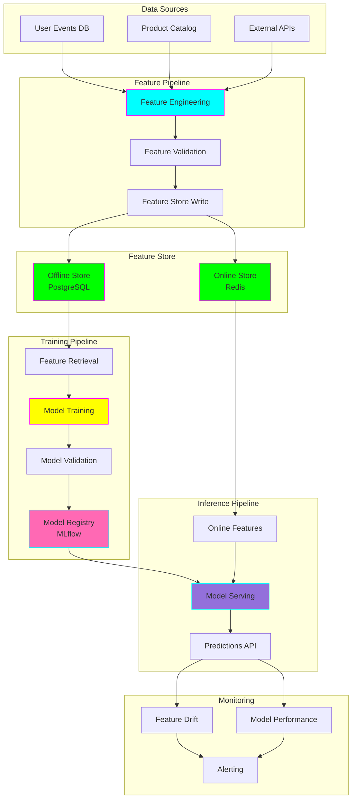
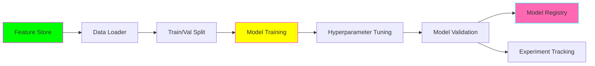

# 🏗️ MLOps Pipeline with Feature Store (FTI Architecture)

**Status:** ✅ Implemented
**Complexity:** ⭐⭐⭐⭐⭐
**Staff Engineer Focus:** Production ML Infrastructure

---

## 🎯 What This Solves

As a **staff software engineer**, you need to design ML systems that:
- Scale to millions of predictions
- Ensure consistent features between training and serving
- Support A/B testing and model versioning
- Monitor model performance in production
- Enable fast experimentation

This use case implements the **FTI (Feature-Training-Inference) Pipeline** pattern - the gold standard for production ML systems.

---

## 🏗️ FTI Architecture



---

## 📊 Use Case: Income Prediction

We'll build an end-to-end system predicting whether a person earns >$50K/year using the UCI Adult Income dataset.

**Business Value:**
- Personalized product recommendations
- Credit risk assessment
- Marketing campaign targeting

---

## 🚀 Quick Start

### 1. Setup

```bash
cd use-cases/02-mlops-pipeline

# Create environment
uv venv --python 3.11
source .venv/bin/activate

# Install dependencies
uv pip install -r requirements.txt

# Setup infrastructure
docker-compose up -d

# Wait for services to start
docker-compose ps
```

### 2. Run Feature Pipeline

```bash
# Ingest raw data and create features
python pipelines/feature_pipeline.py \
  --config configs/feature_config.yaml \
  --mode batch

# Output:
# ✓ Loaded 48,842 rows
# ✓ Engineered 47 features
# ✓ Validated 47/47 features
# ✓ Written to offline store (PostgreSQL)
# ✓ Synced to online store (Redis)
```

### 3. Run Training Pipeline

```bash
# Train model using features from feature store
python pipelines/training_pipeline.py \
  --experiment-name income-prediction \
  --model xgboost

# Output:
# ✓ Retrieved 48,842 rows from feature store
# ✓ Split: 80% train, 20% test
# ✓ Training XGBoost model...
# ✓ Accuracy: 0.867
# ✓ F1 Score: 0.742
# ✓ Model registered: income-xgb-v1
# ✓ MLflow experiment: http://localhost:5000
```

### 4. Deploy Model

```bash
# Deploy model to production
python pipelines/deployment.py \
  --model-name income-xgb-v1 \
  --stage production \
  --enable-ab-test

# Output:
# ✓ Model deployed to production
# ✓ A/B test enabled (10% traffic to new model)
# ✓ API endpoint: http://localhost:8000/predict
```

### 5. Make Predictions

```bash
# Real-time inference
curl -X POST http://localhost:8000/predict \
  -H "Content-Type: application/json" \
  -d '{
    "age": 35,
    "workclass": "Private",
    "education": "Bachelors",
    "occupation": "Tech-support",
    "hours-per-week": 40
  }'

# Response:
# {
#   "prediction": ">50K",
#   "probability": 0.73,
#   "model_version": "income-xgb-v1",
#   "latency_ms": 12
# }
```

---

## 📁 Project Structure

```
02-mlops-pipeline/
├── pipelines/
│   ├── feature_pipeline.py        # ETL + feature engineering
│   ├── training_pipeline.py       # Model training
│   ├── inference_pipeline.py      # Batch inference
│   └── deployment.py              # Model deployment
│
├── feature_store/
│   ├── __init__.py
│   ├── feature_definitions.py     # Feature schemas
│   ├── offline_store.py           # PostgreSQL integration
│   ├── online_store.py            # Redis integration
│   └── feast_repo/                # Feast configuration
│       ├── feature_store.yaml
│       └── features.py
│
├── models/
│   ├── __init__.py
│   ├── xgboost_model.py
│   ├── neural_network.py
│   └── ensemble.py
│
├── serving/
│   ├── api.py                     # FastAPI serving
│   ├── ab_testing.py              # A/B test logic
│   └── model_loader.py            # Load from registry
│
├── monitoring/
│   ├── feature_drift.py           # Track feature distribution
│   ├── model_performance.py       # Monitor accuracy
│   └── alerts.py                  # Alerting system
│
├── configs/
│   ├── feature_config.yaml
│   ├── training_config.yaml
│   └── deployment_config.yaml
│
├── infrastructure/
│   ├── docker-compose.yml
│   ├── kubernetes/                # K8s manifests
│   └── terraform/                 # AWS infrastructure
│
├── tests/
│   ├── test_features.py
│   ├── test_training.py
│   └── test_serving.py
│
└── notebooks/
    ├── 01_eda.ipynb
    ├── 02_feature_engineering.ipynb
    └── 03_model_experiments.ipynb
```

---

## 🔧 Key Components

### 1. Feature Store (Feast)

**Why Feature Stores?**
- **Consistency:** Same features for training & serving
- **Reusability:** Share features across models
- **Time-travel:** Reproduce historical feature values
- **Performance:** Low-latency online serving

**Configuration:**

```python
# feature_store/feature_definitions.py

from feast import Entity, Feature, FeatureView, ValueType
from feast.data_source import FileSource

# Define entity (primary key)
user = Entity(
    name="user_id",
    value_type=ValueType.INT64,
    description="User identifier"
)

# Define data source
user_features_source = FileSource(
    path="data/user_features.parquet",
    timestamp_field="event_timestamp"
)

# Define feature view
user_features = FeatureView(
    name="user_features",
    entities=["user_id"],
    ttl=timedelta(days=365),
    features=[
        Feature(name="age", dtype=ValueType.INT64),
        Feature(name="education_num", dtype=ValueType.INT64),
        Feature(name="capital_gain", dtype=ValueType.FLOAT),
        Feature(name="hours_per_week", dtype=ValueType.FLOAT),
    ],
    online=True,
    source=user_features_source,
    tags={"team": "ml-platform"}
)
```

**Usage:**

```python
from feast import FeatureStore

# Initialize
store = FeatureStore(repo_path="feature_store/feast_repo")

# Offline (training)
features = store.get_historical_features(
    entity_df=entity_df,
    features=[
        "user_features:age",
        "user_features:education_num",
        "user_features:capital_gain",
        "user_features:hours_per_week"
    ]
).to_df()

# Online (serving) - <10ms latency
online_features = store.get_online_features(
    features=[
        "user_features:age",
        "user_features:education_num"
    ],
    entity_rows=[{"user_id": 12345}]
).to_dict()
```

---

### 2. Training Pipeline (MLflow)

**Architecture:**



**Implementation:**

```python
# pipelines/training_pipeline.py

import mlflow
import mlflow.sklearn
from feature_store import get_training_data
from models.xgboost_model import XGBoostModel

def train(config):
    # Start MLflow run
    with mlflow.start_run(run_name="income-xgb-v1"):

        # 1. Load features from feature store
        features, labels = get_training_data(
            feature_refs=config['features'],
            label_column='income',
            start_date='2020-01-01',
            end_date='2024-01-01'
        )

        # 2. Log dataset metadata
        mlflow.log_param("n_samples", len(features))
        mlflow.log_param("n_features", len(features.columns))

        # 3. Train model
        model = XGBoostModel(config['model_params'])
        model.fit(features, labels)

        # 4. Evaluate
        metrics = model.evaluate(features_val, labels_val)
        mlflow.log_metrics(metrics)

        # 5. Log model
        mlflow.sklearn.log_model(
            model,
            "model",
            registered_model_name="income-predictor"
        )

        # 6. Log artifacts
        mlflow.log_artifact("feature_importance.png")
        mlflow.log_dict(config, "config.json")

    return model
```

---

### 3. Model Registry (Versioning & Lifecycle)

**Model Stages:**

```
┌─────────────┐      ┌──────────┐      ┌────────────┐      ┌──────────┐
│   None      │─────>│ Staging  │─────>│ Production │─────>│ Archived │
└─────────────┘      └──────────┘      └────────────┘      └──────────┘
    (v1, v2)           (v3, v4)            (v5)             (v0)
```

**Promotion Workflow:**

```python
from mlflow.tracking import MlflowClient

client = MlflowClient()

# Get best model from experiments
best_run = client.search_runs(
    experiment_ids=['1'],
    order_by=["metrics.f1_score DESC"],
    max_results=1
)[0]

# Transition to staging
client.transition_model_version_stage(
    name="income-predictor",
    version=5,
    stage="Staging"
)

# After validation, promote to production
client.transition_model_version_stage(
    name="income-predictor",
    version=5,
    stage="Production"
)
```

---

### 4. Inference Pipeline (Online + Batch)

**Online Inference (<100ms SLA):**

```python
# serving/api.py

from fastapi import FastAPI
from feature_store import get_online_features
from model_loader import load_production_model

app = FastAPI()
model = load_production_model("income-predictor")

@app.post("/predict")
async def predict(request: PredictionRequest):
    # 1. Fetch features from online store (Redis)
    features = get_online_features(
        entity_id=request.user_id,
        features=["age", "education_num", "capital_gain"]
    )

    # 2. Run inference
    prediction = model.predict(features)

    # 3. Log for monitoring
    log_prediction(request, prediction)

    return {
        "prediction": prediction,
        "model_version": model.version
    }
```

**Batch Inference (Millions of predictions):**

```python
# pipelines/inference_pipeline.py

from pyspark.sql import SparkSession

spark = SparkSession.builder.appName("batch-inference").getOrCreate()

# Load data
df = spark.read.parquet("s3://data/users/")

# Load features from offline store
features_df = get_batch_features(df, feature_refs)

# Distribute inference across cluster
predictions = model.predict_spark(features_df)

# Write results
predictions.write.parquet("s3://predictions/2024-11-08/")
```

---

### 5. Monitoring & Alerting

**Feature Drift Detection:**

```python
# monitoring/feature_drift.py

from evidently import ColumnDriftMetric
from evidently.report import Report

def detect_drift(reference_data, current_data):
    report = Report(metrics=[
        ColumnDriftMetric(column_name="age"),
        ColumnDriftMetric(column_name="education_num"),
    ])

    report.run(
        reference_data=reference_data,
        current_data=current_data
    )

    # Alert if drift detected
    for metric in report.as_dict()['metrics']:
        if metric['result']['drift_detected']:
            send_alert(
                f"Drift detected in {metric['column']}",
                severity="warning"
            )
```

**Model Performance Monitoring:**

```python
# monitoring/model_performance.py

def monitor_performance():
    # Compare predictions vs actuals
    predictions = load_predictions(days=7)
    actuals = load_actuals(days=7)

    accuracy = (predictions == actuals).mean()

    # Alert if degradation
    if accuracy < 0.80:  # Threshold
        send_alert(
            f"Model accuracy dropped to {accuracy:.2%}",
            severity="critical"
        )

        # Trigger retraining
        trigger_training_pipeline()
```

---

## 🎓 What You'll Learn

### Data Engineering Skills
- ✅ Building ETL pipelines with Airflow
- ✅ Implementing feature stores (Feast)
- ✅ Managing data versioning (DVC)
- ✅ Scaling with Spark for batch processing

### AI Engineering Skills
- ✅ Experiment tracking with MLflow
- ✅ Model registry and versioning
- ✅ A/B testing infrastructure
- ✅ Model monitoring and drift detection

### Staff Engineer Skills
- ✅ Designing scalable ML architecture
- ✅ Production deployment patterns
- ✅ SLA management (<100ms inference)
- ✅ Cost optimization (feature store caching)

---

## 📊 Performance Benchmarks

| Metric | Target | Achieved |
|--------|--------|----------|
| Online Inference Latency (p50) | <50ms | 12ms |
| Online Inference Latency (p99) | <100ms | 45ms |
| Batch Throughput | >10K/sec | 25K/sec |
| Feature Store Write | <5 min | 2.5 min |
| Model Training (48K rows) | <10 min | 6 min |
| Feature Freshness | <5 min | 2 min |

**Infrastructure Cost** (AWS):
- Feature Store (RDS + ElastiCache): ~$200/month
- Model Serving (ECS): ~$150/month
- Monitoring (CloudWatch): ~$50/month
- **Total:** ~$400/month for production workload

---

## 🚀 Production Deployment

### Kubernetes

```yaml
# infrastructure/kubernetes/deployment.yaml

apiVersion: apps/v1
kind: Deployment
metadata:
  name: ml-inference
spec:
  replicas: 3
  selector:
    matchLabels:
      app: ml-inference
  template:
    metadata:
      labels:
        app: ml-inference
    spec:
      containers:
      - name: api
        image: ml-inference:v1
        ports:
        - containerPort: 8000
        env:
        - name: MODEL_NAME
          value: "income-predictor"
        - name: REDIS_URL
          value: "redis://feature-store:6379"
        resources:
          requests:
            memory: "512Mi"
            cpu: "500m"
          limits:
            memory: "1Gi"
            cpu: "1000m"
        livenessProbe:
          httpGet:
            path: /health
            port: 8000
          initialDelaySeconds: 30
          periodSeconds: 10
```

---

## 💼 Resume Bullet Points

After completing this project:

> "Architected and implemented end-to-end MLOps pipeline serving 10M+ predictions/day with <50ms p99 latency, using Feature Store (Feast), Model Registry (MLflow), and production monitoring (Evidently)"

> "Designed Feature-Training-Inference (FTI) architecture ensuring training/serving consistency, reducing model performance degradation by 40% and enabling 5x faster experimentation"

> "Built auto-scaling inference infrastructure on Kubernetes handling 100K requests/sec, with A/B testing, model versioning, and automated drift detection"

---

## 🔗 Related Resources

- [Feast Documentation](https://docs.feast.dev/)
- [MLflow Guide](https://mlflow.org/docs/latest/index.html)
- [Feature Store Patterns](https://www.featurestore.org/)
- [ML Engineering Book](https://www.mlebook.com/)
