# Advanced Data Engineering with Python - Learning Plan

## Table of Contents

1. [Learning Philosophy](#learning-philosophy)
2. [Pre-requisites](#pre-requisites)
3. [Study Schedule](#study-schedule)
4. [Learning Resources](#learning-resources)
5. [Detailed Project Breakdown](#detailed-project-breakdown)
6. [Certification & Portfolio](#certification--portfolio)

## Learning Philosophy


### Core Principles

1. **Learn by Building** - Every concept is reinforced with hands-on projects
2. **Progressive Complexity** - Start simple, build confidence, tackle harder challenges
3. **Real-world Focus** - All projects mirror production scenarios
4. **Iterative Learning** - Revisit concepts at deeper levels
5. **Active Documentation** - Write as you learn to reinforce understanding

## Pre-requisites

### Required Knowledge


**Must Have:**
- ✅ Python programming (intermediate level)
- ✅ SQL querying and database concepts
- ✅ Command-line comfort
- ✅ Git basics
- ✅ Basic understanding of APIs and web services

**Nice to Have:**
- 🔶 Docker & containerization
- 🔶 Cloud platform experience (AWS/GCP/Azure)
- 🔶 Distributed systems concepts
- 🔶 Basic statistics knowledge

### Technical Setup

**Hardware:**
- Minimum: 16GB RAM, 4 cores, 50GB free disk
- Recommended: 32GB RAM, 8 cores, 100GB SSD

**Software:**
- Python 3.12+
- Docker & Docker Compose
- PostgreSQL client
- Redis (for caching exercises)
- Optional: Kafka, Spark (can use Docker)

## Study Schedule

### 🗓️ 12-Week Intensive Track (15-20 hrs/week)


**Week-by-Week Breakdown:**

| Week | Projects | Focus Area | Time Commitment |
|------|----------|------------|-----------------|
| 1 | 1-3 | Data formats & validation | 15-18 hrs |
| 2 | 4-6 | ETL patterns & optimization | 16-20 hrs |
| 3 | 7-10 | Deduplication & time-series | 18-20 hrs |
| 4 | 11-13 | Distributed computing intro | 16-18 hrs |
| 5 | 14-16 | Orchestration & streaming | 18-22 hrs |
| 6 | 17-20 | Delta Lake & CDC | 16-20 hrs |
| 7 | 21-22 | Lambda & Kappa architectures | 18-20 hrs |
| 8 | 23-24 | Feature stores & data mesh | 18-22 hrs |
| 9 | 25-26 | Query engines & Iceberg | 20-24 hrs |
| 10 | 27-28 | Observability & replication | 18-20 hrs |
| 11 | 29-30 | Time-travel & ML platforms | 20-24 hrs |
| 12 | Review | Portfolio polish & review | 15-20 hrs |

### 🗓️ 20-Week Balanced Track (8-10 hrs/week)

Ideal for working professionals:

- **Weeks 1-6:** Tier 1 (Projects 1-10) - 1-2 projects/week
- **Weeks 7-14:** Tier 2 (Projects 11-20) - 1-2 projects/week
- **Weeks 15-20:** Tier 3 (Projects 21-30) - 1-2 projects/week

### 🗓️ Self-Paced Track

Study at your own pace. Recommended milestones:

- ✅ Complete Tier 1 within first month
- ✅ Complete Tier 2 within second and third months
- ✅ Complete Tier 3 within fourth and fifth months

## Learning Resources

### 📚 Essential Books

1. **Fundamentals of Data Engineering** by Joe Reis & Matt Housley
   - Read: Chapters 1-8 before starting
   - Reference: Throughout all projects

2. **Designing Data-Intensive Applications** by Martin Kleppmann
   - Focus: Chapters 3 (Storage), 10 (Batch), 11 (Stream)

3. **The Data Warehouse Toolkit** by Ralph Kimball
   - Essential for: Projects 5, 10, 24

### 🎥 Video Courses (Supplementary)

- **Data Engineering Zoomcamp** (DataTalks.Club) - Free
- **Spark and Python for Big Data** (Udemy)
- **Kafka Fundamentals** (Confluent)

### 📝 Documentation to Master

- [Apache Spark Docs](https://spark.apache.org/docs/latest/)
- [Delta Lake Guide](https://docs.delta.io/latest/index.html)
- [Apache Airflow Docs](https://airflow.apache.org/docs/)
- [Kafka Documentation](https://kafka.apache.org/documentation/)
- [Polars User Guide](https://pola-rs.github.io/polars-book/)

### 🛠️ Hands-on Platforms

- **Databricks Community Edition** - Free Spark notebooks
- **Confluent Cloud** - Free Kafka tier
- **AWS Free Tier** - S3, Glue, RDS
- **Google Cloud** - BigQuery sandbox

## Detailed Project Breakdown

### 🟢 Tier 1: Foundation & Medium Complexity

#### Project 1: CSV to Parquet Pipeline
**Complexity:** ⭐⭐☆☆☆ | **Time:** 4-6 hours

**Concepts:**
- Columnar vs row-based storage
- Parquet file format internals
- Partition strategies
- Compression algorithms

**Skills:**
- PyArrow and Pandas integration
- Partitioned writes
- Schema evolution
- Performance benchmarking

**Nuanced Scenarios:**
- Nested data structures in Parquet
- Predicate pushdown optimization
- Dynamic partition generation
- Memory-efficient chunked processing

**Success Criteria:**
- [ ] Convert 1GB+ CSV to Parquet with 10x+ compression
- [ ] Implement Hive-style partitioning
- [ ] Handle schema changes gracefully
- [ ] Benchmark read/write performance

---

#### Project 2: Data Validation Framework
**Complexity:** ⭐⭐⭐☆☆ | **Time:** 6-8 hours

**Concepts:**
- Data contracts and schemas
- Statistical validation
- Anomaly detection basics
- Validation rule engines

**Skills:**
- Pandera schema definitions
- Great Expectations checkpoints
- Custom validation rules
- Validation reporting

**Nuanced Scenarios:**
- Cross-column validation
- Time-series anomaly detection
- Conditional validation rules
- Threshold-based alerts

**Success Criteria:**
- [ ] Define reusable schema validators
- [ ] Implement 10+ validation rule types
- [ ] Generate validation reports
- [ ] Integrate with CI/CD pipeline

---

#### Project 3: Incremental ETL Pattern
**Complexity:** ⭐⭐⭐☆☆ | **Time:** 6-8 hours

**Concepts:**
- Change data capture concepts
- Watermarking strategies
- Delta detection algorithms
- Idempotent processing

**Skills:**
- Timestamp-based incremental loads
- Hash-based change detection
- Merge/upsert operations
- State management

**Nuanced Scenarios:**
- Late-arriving data handling
- Out-of-order event processing
- Backfill strategies
- Deleted record detection

**Success Criteria:**
- [ ] Implement timestamp-based CDC
- [ ] Handle late arrivals correctly
- [ ] Process only changed records
- [ ] Support full refresh fallback

---

#### Project 4: Database Connection Pool Manager
**Complexity:** ⭐⭐☆☆☆ | **Time:** 4-5 hours

**Concepts:**
- Connection pooling theory
- Database connection lifecycle
- Thread safety considerations
- Resource management

**Skills:**
- SQLAlchemy connection pools
- Context managers
- Connection health checks
- Retry logic

**Nuanced Scenarios:**
- Connection leak detection
- Dynamic pool sizing
- Multi-database routing
- Read replica distribution

**Success Criteria:**
- [ ] Implement efficient connection reuse
- [ ] Handle connection failures gracefully
- [ ] Support multiple database types
- [ ] Monitor pool metrics

---

#### Project 5: Slowly Changing Dimensions (SCD)
**Complexity:** ⭐⭐⭐☆☆ | **Time:** 7-9 hours

**Concepts:**
- Dimensional modeling
- SCD Type 1, 2, 3 patterns
- Surrogate keys
- Temporal data modeling

**Skills:**
- Historical tracking implementation
- Effective dating strategies
- Dimension table design
- SQL merge operations

**Nuanced Scenarios:**
- Hybrid SCD types
- Late-arriving dimension updates
- Slowly changing hierarchies
- Performance optimization for large dimensions

**Success Criteria:**
- [ ] Implement SCD Type 1 (overwrite)
- [ ] Implement SCD Type 2 (history tracking)
- [ ] Implement SCD Type 3 (limited history)
- [ ] Handle late arrivals correctly

---

#### Project 6: Data Deduplication Engine
**Complexity:** ⭐⭐⭐⭐☆ | **Time:** 8-10 hours

**Concepts:**
- Hash-based deduplication
- Fuzzy matching algorithms
- Similarity metrics
- Blocking strategies

**Skills:**
- Record linkage techniques
- Levenshtein distance
- Soundex/Metaphone algorithms
- Probabilistic matching

**Nuanced Scenarios:**
- Multi-field composite matching
- Confidence scoring
- Human-in-the-loop review
- Performance at scale

**Success Criteria:**
- [ ] Exact match deduplication
- [ ] Fuzzy matching with configurable threshold
- [ ] Handle 1M+ records efficiently
- [ ] Provide match confidence scores

---

#### Project 7: Multi-Source Data Merger
**Complexity:** ⭐⭐⭐☆☆ | **Time:** 6-8 hours

**Concepts:**
- Data integration patterns
- Schema alignment
- Master data management
- Conflict resolution

**Skills:**
- Heterogeneous source connectors
- Schema mapping
- Data quality reconciliation
- Golden record creation

**Nuanced Scenarios:**
- Conflicting source priorities
- Partial data from sources
- Dynamic source discovery
- Lineage tracking across merges

**Success Criteria:**
- [ ] Merge data from 3+ sources
- [ ] Resolve field conflicts with rules
- [ ] Track data lineage
- [ ] Generate data quality reports

---

#### Project 8: Column-Store Query Optimizer
**Complexity:** ⭐⭐⭐☆☆ | **Time:** 6-7 hours

**Concepts:**
- Column-oriented storage
- Query execution plans
- Predicate pushdown
- Vectorized execution

**Skills:**
- DuckDB for analytics
- Query profiling
- Index strategies
- Partition pruning

**Nuanced Scenarios:**
- Join order optimization
- Aggregate pushdown
- Parallel query execution
- Adaptive query execution

**Success Criteria:**
- [ ] Optimize queries with DuckDB
- [ ] Implement partitioning strategy
- [ ] Achieve 10x+ speedup on analytics
- [ ] Analyze and explain query plans

---

#### Project 9: Data Lineage Tracker
**Complexity:** ⭐⭐⭐⭐☆ | **Time:** 8-10 hours

**Concepts:**
- Data lineage graphs
- Provenance tracking
- Metadata management
- Impact analysis

**Skills:**
- DAG representation
- Column-level lineage
- Lineage visualization
- Metadata extraction

**Nuanced Scenarios:**
- Automatic lineage extraction from SQL
- Cross-system lineage tracking
- Lineage versioning
- Impact analysis for schema changes

**Success Criteria:**
- [ ] Track table-level lineage
- [ ] Track column-level transformations
- [ ] Visualize lineage DAG
- [ ] Perform impact analysis

---

#### Project 10: Time-Series Data Aggregator
**Complexity:** ⭐⭐⭐☆☆ | **Time:** 6-8 hours

**Concepts:**
- Time-series databases
- Window functions
- Rollup strategies
- Downsampling techniques

**Skills:**
- Pandas time-series operations
- Moving averages & aggregations
- Time-based partitioning
- Materialized rollups

**Nuanced Scenarios:**
- Irregular time-series handling
- Gap filling strategies
- Seasonal decomposition
- Multi-resolution storage

**Success Criteria:**
- [ ] Implement multiple aggregation windows
- [ ] Handle irregular timestamps
- [ ] Generate rollup tables
- [ ] Optimize time-range queries

---

### 🟡 Tier 2: Advanced Intermediate

#### Project 11: Distributed ETL with Dask
**Complexity:** ⭐⭐⭐☆☆ | **Time:** 7-9 hours

**Concepts:**
- Distributed DataFrames
- Task scheduling
- Lazy evaluation
- Cluster computing basics

**Skills:**
- Dask DataFrame operations
- Distributed computing patterns
- Memory management
- Performance tuning

**Nuanced Scenarios:**
- Spill to disk strategies
- Task graph optimization
- Adaptive scheduling
- Multi-worker coordination

**Success Criteria:**
- [ ] Scale pandas workload to 10GB+
- [ ] Utilize multi-core processing
- [ ] Implement efficient partitioning
- [ ] Monitor resource usage

---

#### Project 12: Apache Spark Pipeline
**Complexity:** ⭐⭐⭐⭐☆ | **Time:** 10-12 hours

**Concepts:**
- Spark architecture (Driver, Executors)
- RDD, DataFrame, Dataset APIs
- Catalyst optimizer
- Tungsten execution engine

**Skills:**
- PySpark transformations
- Spark SQL
- UDF optimization
- Join strategies

**Nuanced Scenarios:**
- Data skew handling
- Broadcast joins
- Repartitioning strategies
- Adaptive query execution

**Success Criteria:**
- [ ] Process 50GB+ dataset
- [ ] Optimize shuffle operations
- [ ] Implement complex transformations
- [ ] Tune Spark configurations

---

#### Project 13: Kafka Streaming Consumer
**Complexity:** ⭐⭐⭐⭐☆ | **Time:** 8-10 hours

**Concepts:**
- Pub/sub messaging
- Consumer groups
- Offset management
- Message delivery semantics

**Skills:**
- Kafka consumer implementation
- Deserialization (Avro, JSON, Protobuf)
- Error handling
- Exactly-once semantics

**Nuanced Scenarios:**
- Rebalancing strategies
- Offset reset scenarios
- Schema evolution handling
- Back-pressure management

**Success Criteria:**
- [ ] Consume from Kafka topic reliably
- [ ] Handle multiple message formats
- [ ] Implement idempotent processing
- [ ] Monitor consumer lag

---

#### Project 14: Apache Airflow DAG Builder
**Complexity:** ⭐⭐⭐⭐☆ | **Time:** 9-11 hours

**Concepts:**
- Workflow orchestration
- DAG structure
- Task dependencies
- Scheduling strategies

**Skills:**
- Airflow operators
- XCom for task communication
- Dynamic DAG generation
- SLA monitoring

**Nuanced Scenarios:**
- Conditional task execution
- Branching workflows
- SubDAGs and TaskGroups
- Cross-DAG dependencies

**Success Criteria:**
- [ ] Build complex multi-stage DAG
- [ ] Implement error handling & retries
- [ ] Use sensors for external triggers
- [ ] Monitor and alert on failures

---

#### Project 15: Delta Lake Implementation
**Complexity:** ⭐⭐⭐⭐☆ | **Time:** 8-10 hours

**Concepts:**
- ACID on data lakes
- Transaction logs
- Time travel
- Schema enforcement

**Skills:**
- Delta table operations
- Merge/upsert commands
- Optimize & vacuum
- Z-ordering

**Nuanced Scenarios:**
- Concurrent write handling
- Schema evolution strategies
- Version retention policies
- Partition evolution

**Success Criteria:**
- [ ] Implement ACID transactions
- [ ] Support time-travel queries
- [ ] Perform merge operations
- [ ] Optimize table layout

---

#### Project 16: CDC with Debezium
**Complexity:** ⭐⭐⭐⭐⭐ | **Time:** 10-12 hours

**Concepts:**
- Transaction log mining
- Event streaming
- Schema registry
- Eventual consistency

**Skills:**
- Debezium connector setup
- Change event processing
- Tombstone handling
- Snapshot strategies

**Nuanced Scenarios:**
- DDL change handling
- Large transaction processing
- Connector failure recovery
- Cross-database CDC

**Success Criteria:**
- [ ] Capture database changes in real-time
- [ ] Process insert/update/delete events
- [ ] Handle schema changes
- [ ] Ensure no data loss

---

#### Project 17: API Rate Limiter & Backfill
**Complexity:** ⭐⭐⭐☆☆ | **Time:** 6-8 hours

**Concepts:**
- Rate limiting algorithms
- Exponential backoff
- API pagination
- Idempotent requests

**Skills:**
- Token bucket implementation
- Retry logic with jitter
- Parallel request management
- State persistence

**Nuanced Scenarios:**
- Dynamic rate adjustment
- Multi-endpoint rate limits
- Quota exhaustion handling
- Historical data backfill

**Success Criteria:**
- [ ] Respect API rate limits
- [ ] Handle failures gracefully
- [ ] Support incremental backfill
- [ ] Track extraction progress

---

#### Project 18: S3 Data Lake Organization
**Complexity:** ⭐⭐⭐⭐☆ | **Time:** 8-10 hours

**Concepts:**
- Data lake architecture
- Partition strategies
- Object lifecycle policies
- Metadata management

**Skills:**
- Boto3 for S3 operations
- Hive partitioning
- S3 event notifications
- Glue catalog integration

**Nuanced Scenarios:**
- Multi-tenant isolation
- Access pattern optimization
- Cost optimization strategies
- Metadata synchronization

**Success Criteria:**
- [ ] Implement medallion architecture (bronze/silver/gold)
- [ ] Optimize partition strategy
- [ ] Integrate with metadata catalog
- [ ] Implement lifecycle policies

---

#### Project 19: Real-time Deduplication
**Complexity:** ⭐⭐⭐⭐☆ | **Time:** 8-10 hours

**Concepts:**
- Stateful stream processing
- Windowing strategies
- State backends
- Checkpointing

**Skills:**
- Stream deduplication logic
- State management
- Watermarking
- Late event handling

**Nuanced Scenarios:**
- State size management
- Exactly-once guarantees
- Multi-key deduplication
- State recovery

**Success Criteria:**
- [ ] Deduplicate streaming events
- [ ] Handle high throughput (10k+ msg/sec)
- [ ] Maintain state efficiently
- [ ] Support late arrivals

---

#### Project 20: Prefect Deployment Pipeline
**Complexity:** ⭐⭐⭐⭐☆ | **Time:** 8-10 hours

**Concepts:**
- Modern workflow orchestration
- Hybrid execution model
- Parameterized flows
- Event-driven workflows

**Skills:**
- Prefect flows and tasks
- Deployment management
- Work pools and workers
- Notification integrations

**Nuanced Scenarios:**
- Dynamic task mapping
- Conditional flow execution
- Multi-environment deployments
- Observability integration

**Success Criteria:**
- [ ] Build parameterized data pipeline
- [ ] Deploy to Prefect Cloud/Server
- [ ] Implement monitoring & alerts
- [ ] Handle failures gracefully

---

### 🟣 Tier 3: Expert Level

#### Project 21: Lambda Architecture System
**Complexity:** ⭐⭐⭐⭐⭐ | **Time:** 12-15 hours

**Concepts:**
- Batch vs stream processing
- Serving layer design
- Eventual consistency
- View reconciliation

**Skills:**
- Batch pipeline (Spark)
- Stream pipeline (Kafka + Flink)
- Serving layer (Redis/PostgreSQL)
- Query router

**Nuanced Scenarios:**
- Batch-stream view merging
- Reprocessing strategies
- Data correction workflows
- Performance optimization

**Success Criteria:**
- [ ] Implement batch layer
- [ ] Implement speed layer
- [ ] Implement serving layer
- [ ] Reconcile batch and real-time views

---

#### Project 22: Kappa Architecture Pipeline
**Complexity:** ⭐⭐⭐⭐⭐ | **Time:** 12-15 hours

**Concepts:**
- Stream-first architecture
- Reprocessing via replay
- Event sourcing
- Stateful stream processing

**Skills:**
- Kafka Streams or Flink
- Event-driven design
- State management
- Exactly-once processing

**Nuanced Scenarios:**
- Historical data reprocessing
- State migration strategies
- Multi-version deployment
- Scalability patterns

**Success Criteria:**
- [ ] Process all data as streams
- [ ] Support reprocessing via replay
- [ ] Maintain stateful aggregations
- [ ] Achieve low-latency results

---

#### Project 23: Real-time Feature Store
**Complexity:** ⭐⭐⭐⭐⭐ | **Time:** 12-15 hours

**Concepts:**
- Feature engineering
- Online/offline feature consistency
- Point-in-time correctness
- Feature serving latency

**Skills:**
- Feature computation pipelines
- Feast or custom feature store
- Low-latency serving
- Feature versioning

**Nuanced Scenarios:**
- Feature freshness SLAs
- Training/serving skew prevention
- Feature monitoring
- Multi-model feature sharing

**Success Criteria:**
- [ ] Implement feature computation
- [ ] Serve features with <10ms latency
- [ ] Ensure training/serving consistency
- [ ] Support feature versioning

---

#### Project 24: Data Mesh Implementation
**Complexity:** ⭐⭐⭐⭐⭐ | **Time:** 15-18 hours

**Concepts:**
- Domain-driven design
- Data as a product
- Federated governance
- Self-serve infrastructure

**Skills:**
- Multi-domain architecture
- Data product definition
- Metadata management
- Governance automation

**Nuanced Scenarios:**
- Cross-domain data sharing
- Data contract enforcement
- Decentralized quality
- Discovery mechanisms

**Success Criteria:**
- [ ] Define 3+ data products
- [ ] Implement federated catalog
- [ ] Enforce data contracts
- [ ] Enable self-serve access

---

#### Project 25: Custom Query Engine
**Complexity:** ⭐⭐⭐⭐⭐ | **Time:** 15-20 hours

**Concepts:**
- SQL parsing
- Query planning
- Execution engines
- Optimization techniques

**Skills:**
- Parser implementation (sqlparse or pyparsing)
- Logical/physical plan generation
- Operator implementation
- Cost-based optimization

**Nuanced Scenarios:**
- Join algorithm selection
- Index utilization
- Statistics collection
- Adaptive execution

**Success Criteria:**
- [ ] Parse SQL queries
- [ ] Generate execution plans
- [ ] Execute basic queries
- [ ] Optimize with statistics

---

#### Project 26: Lakehouse with Iceberg
**Complexity:** ⭐⭐⭐⭐⭐ | **Time:** 12-15 hours

**Concepts:**
- Table format evolution
- Hidden partitioning
- Time-travel & rollback
- Schema evolution

**Skills:**
- PyIceberg operations
- Metadata management
- Partition evolution
- Snapshot isolation

**Nuanced Scenarios:**
- Concurrent writer coordination
- Metadata compaction
- Partition spec evolution
- File compaction strategies

**Success Criteria:**
- [ ] Create and manage Iceberg tables
- [ ] Implement hidden partitioning
- [ ] Support schema evolution
- [ ] Enable time-travel queries

---

#### Project 27: Data Quality Observability Platform
**Complexity:** ⭐⭐⭐⭐⭐ | **Time:** 15-18 hours

**Concepts:**
- Data observability pillars
- Anomaly detection
- Lineage tracking
- Incident management

**Skills:**
- Metrics collection
- Statistical profiling
- Alerting systems
- Dashboard creation

**Nuanced Scenarios:**
- ML-based anomaly detection
- Root cause analysis
- SLA monitoring
- Automated remediation

**Success Criteria:**
- [ ] Monitor data quality metrics
- [ ] Detect anomalies automatically
- [ ] Alert on quality degradation
- [ ] Track lineage and impact

---

#### Project 28: Multi-Region Data Replication
**Complexity:** ⭐⭐⭐⭐⭐ | **Time:** 12-15 hours

**Concepts:**
- Geo-distribution
- Replication strategies
- Conflict resolution
- Consistency models

**Skills:**
- Cross-region data sync
- Eventual consistency handling
- Conflict detection
- Network optimization

**Nuanced Scenarios:**
- Active-active replication
- Partition tolerance
- Latency optimization
- Disaster recovery

**Success Criteria:**
- [ ] Replicate data across 2+ regions
- [ ] Handle network partitions
- [ ] Resolve conflicts automatically
- [ ] Minimize replication lag

---

#### Project 29: Time-Travel Query System
**Complexity:** ⭐⭐⭐⭐⭐ | **Time:** 12-15 hours

**Concepts:**
- Temporal databases
- Versioning strategies
- Historical queries
- Storage optimization

**Skills:**
- Bi-temporal modeling
- Version storage
- Query rewriting
- Retention policies

**Nuanced Scenarios:**
- As-of queries
- Version-based auditing
- Temporal joins
- Space-efficient storage

**Success Criteria:**
- [ ] Query data at any point in time
- [ ] Support temporal predicates
- [ ] Optimize storage with compression
- [ ] Implement retention policies

---

#### Project 30: Real-time ML Feature Platform
**Complexity:** ⭐⭐⭐⭐⭐ | **Time:** 15-20 hours

**Concepts:**
- End-to-end ML pipelines
- Feature engineering automation
- Model serving integration
- Feature drift detection

**Skills:**
- Stream feature computation
- Low-latency serving
- Feature monitoring
- A/B testing support

**Nuanced Scenarios:**
- Feature freshness vs latency tradeoffs
- Training/serving alignment
- Feature versioning for models
- Scalability to 100k+ requests/sec

**Success Criteria:**
- [ ] Compute features in real-time
- [ ] Serve features with <5ms p99 latency
- [ ] Monitor feature quality
- [ ] Support model versioning

---

## Study Tips for ADHD-Friendly Learning

### ✅ Do's

1. **Time-box each session** - Use Pomodoro (25 min work, 5 min break)
2. **One project at a time** - Complete before moving to next
3. **Document immediately** - Don't wait until later
4. **Celebrate wins** - Check off completed tasks
5. **Visual progress** - Use diagrams and checklists
6. **Take breaks** - Step away when stuck

### ❌ Don'ts

1. **Don't skip projects** - Build foundation progressively
2. **Don't aim for perfection** - Working code > perfect code
3. **Don't multitask** - Focus on one concept at a time
4. **Don't rush** - Understanding > speed
5. **Don't work when tired** - Quality suffers

### 🎯 Focus Techniques

```mermaid
graph LR
    A[Start Project] --> B{Clear on goal?}
    B -->|No| C[Re-read objectives]
    B -->|Yes| D[Break into tasks]
    C --> D
    D --> E[Set 25-min timer]
    E --> F[Code ONE task]
    F --> G{Timer done?}
    G -->|Yes| H[5-min break]
    G -->|No| F
    H --> I{Task complete?}
    I -->|Yes| J[✅ Check it off!]
    I -->|No| E
    J --> K{Project done?}
    K -->|No| D
    K -->|Yes| L[🎉 Celebrate!]

    style A fill:#00ff00,stroke:#00ffff
    style J fill:#ffff00,stroke:#00ffff
    style L fill:#ff00ff,stroke:#00ffff
```



## Certification & Portfolio

### Building Your Portfolio

For each completed project:

1. **Clean, documented code** - Push to GitHub
2. **Architecture diagram** - Visual explanation
3. **README with results** - Metrics, learnings, screenshots
4. **Blog post** (optional) - Deepen understanding by teaching

### Portfolio Structure

```
your-github-username/
├── data-engineering-portfolio/
│   ├── README.md                          # Portfolio overview
│   ├── 01-csv-to-parquet/
│   │   ├── README.md
│   │   ├── src/
│   │   ├── tests/
│   │   └── results/
│   ├── 02-data-validation/
│   │   └── ...
│   └── ...
```

### Certificate of Completion

After completing all 30 projects:

- ✅ Self-assess using rubrics in each project
- ✅ Review all documentation
- ✅ Polish portfolio README
- ✅ Share on LinkedIn/Twitter
- ✅ Write summary blog post of learnings

### Career Readiness

**Interview Preparation:**
- Deep-dive one project from each tier
- Explain architecture decisions
- Discuss tradeoffs and alternatives
- Demonstrate production thinking

**Resume Highlights:**
- "Built 30+ data engineering projects covering ETL, streaming, and distributed processing"
- Specific technologies: Spark, Kafka, Airflow, Delta Lake, etc.
- Measurable results from projects

---

## Next Steps

1. ✅ Set up development environment
2. ✅ Choose your study track (12-week, 20-week, or self-paced)
3. ✅ Block time on calendar
4. ✅ Start Project 01
5. ✅ Document as you learn
6. ✅ Share your progress

**Let's start building! 🚀**
