# Advanced Data Engineering with Python

**Status:** 🚧 In Progress

**Tech Stack:** Python 3.12, Modern Data Engineering Ecosystem

**Started:** 2025-11-09

## Overview

A comprehensive, hands-on course covering advanced data engineering concepts with Python. This course includes 30 progressively complex projects designed to take you from intermediate to expert level in modern data engineering practices.

## Architecture


## Learning Path Structure

This course is divided into three tiers:

### 🟢 Tier 1: Foundation & Medium Complexity (Projects 1-10)
**Focus:** Core data engineering skills, ETL patterns, data quality, and optimization

### 🟡 Tier 2: Advanced Intermediate (Projects 11-20)
**Focus:** Distributed computing, streaming, orchestration, and lakehouse architectures

### 🟣 Tier 3: Expert Level (Projects 21-30)
**Focus:** Production-grade systems, real-time analytics, ML platforms, and advanced optimization

## Environment Setup

### Prerequisites
- Python 3.12+
- Docker & Docker Compose
- At least 16GB RAM (32GB recommended for some projects)
- Basic understanding of Python, SQL, and command-line tools

### Quick Start

```bash
# Navigate to project directory
cd projects/data-engineering-python-course

# Setup Python environment (using uv - recommended)
uv venv
source .venv/bin/activate  # On Windows: .venv\Scripts\activate

# Or using standard venv
python -m venv .venv
source .venv/bin/activate

# Install dependencies
pip install -r requirements.txt

# For individual projects, see project-specific requirements
cd projects/01-csv-to-parquet-pipeline
pip install -r requirements.txt
```

## Course Structure

```
data-engineering-python-course/
├── README.md                          # This file
├── LEARNING_PLAN.md                   # Detailed learning plan & study guide
├── .python-version                    # Python version specification
├── requirements.txt                   # Core dependencies
├── docs/                              # Course documentation
│   ├── concepts/                      # Conceptual guides
│   ├── best-practices/               # Best practices guides
│   └── resources/                    # Additional learning resources
└── projects/                          # 30 hands-on projects
    ├── 01-csv-to-parquet-pipeline/
    ├── 02-data-validation-framework/
    ├── 03-incremental-etl-pattern/
    ├── ...
    └── 30-realtime-ml-feature-platform/
```

## 30 Projects Roadmap

### 🟢 Tier 1: Foundation & Medium Complexity

1. **CSV to Parquet Pipeline** - Efficient data format conversion with partitioning
2. **Data Validation Framework** - Schema validation and data quality rules
3. **Incremental ETL Pattern** - Change data capture and delta processing
4. **Database Connection Pool Manager** - Optimized database connection handling
5. **Slowly Changing Dimensions (SCD)** - Type 1, 2, and 3 implementation
6. **Data Deduplication Engine** - Fuzzy matching and duplicate detection
7. **Multi-Source Data Merger** - Join and merge data from heterogeneous sources
8. **Column-Store Query Optimizer** - DuckDB-based analytics optimization
9. **Data Lineage Tracker** - Track data flow and transformations
10. **Time-Series Data Aggregator** - Efficient window functions and rollups

### 🟡 Tier 2: Advanced Intermediate

11. **Distributed ETL with Dask** - Scale pandas workloads across clusters
12. **Apache Spark Pipeline** - PySpark for big data processing
13. **Kafka Streaming Consumer** - Real-time data ingestion from Kafka
14. **Apache Airflow DAG Builder** - Complex workflow orchestration
15. **Delta Lake Implementation** - ACID transactions on data lake
16. **CDC with Debezium** - Change data capture from databases
17. **API Rate Limiter & Backfill** - Throttled API data extraction
18. **S3 Data Lake Organization** - Partition strategies and metadata catalog
19. **Real-time Deduplication** - Stream deduplication with state management
20. **Prefect Deployment Pipeline** - Modern workflow orchestration

### 🟣 Tier 3: Expert Level

21. **Lambda Architecture System** - Batch + streaming unified view
22. **Kappa Architecture Pipeline** - Stream-only data processing
23. **Real-time Feature Store** - ML feature computation and serving
24. **Data Mesh Implementation** - Decentralized data ownership model
25. **Custom Query Engine** - SQL parser and execution engine
26. **Lakehouse with Iceberg** - Modern table format implementation
27. **Data Quality Observability Platform** - Monitoring and alerting system
28. **Multi-Region Data Replication** - Geo-distributed data sync
29. **Time-Travel Query System** - Historical data versioning and querying
30. **Real-time ML Feature Platform** - End-to-end feature engineering pipeline

## Learning Approach

```mermaid
flowchart LR
    A[📚 Read Concepts] --> B[💡 Understand Theory]
    B --> C[👨‍💻 Code Project]
    C --> D[🧪 Test & Experiment]
    D --> E[📊 Analyze Results]
    E --> F[📝 Document Learning]
    F --> G{Next Project?}
    G -->|Yes| A
    G -->|No| H[🎓 Master Level Achieved]

    style A fill:#ff69b4,stroke:#00ffff
    style C fill:#00ff00,stroke:#00ffff
    style H fill:#ff00ff,stroke:#00ffff
```



### For Each Project:

1. **Read the concept documentation** (`docs/concepts/`)
2. **Study the project README** - Understand objectives and architecture
3. **Implement the solution** - Write code incrementally
4. **Run tests** - Verify correctness
5. **Experiment with variations** - Try different approaches
6. **Document your learnings** - Update learning log

## Key Concepts Covered

- **Data Formats:** Parquet, Avro, ORC, Delta, Iceberg
- **Data Quality:** Validation, profiling, anomaly detection
- **ETL Patterns:** Full refresh, incremental, CDC, streaming
- **Data Modeling:** Star schema, snowflake, data vault, dimensional modeling
- **Distributed Computing:** Dask, Spark, Ray
- **Streaming:** Kafka, real-time processing, windowing
- **Orchestration:** Airflow, Prefect, Dagster
- **Data Lakes/Lakehouses:** S3, Delta Lake, Iceberg, Hudi
- **Optimization:** Partitioning, indexing, compression, caching
- **Data Governance:** Lineage, catalog, quality monitoring
- **Production Engineering:** Monitoring, alerting, reliability

## Dependencies

See `requirements.txt` for the comprehensive list of libraries used across all projects.

Key library categories:
- **Data Processing:** pandas, polars, dask, pyspark, ray
- **Data Quality:** great-expectations, pandera, pydantic
- **Orchestration:** airflow, prefect, dagster
- **Databases:** sqlalchemy, psycopg2, duckdb, clickhouse
- **Streaming:** kafka-python, confluent-kafka
- **Cloud Storage:** boto3, google-cloud-storage, azure-storage-blob
- **Data Formats:** pyarrow, delta-spark, deltalake

## Time Commitment

- **Estimated total time:** 150-200 hours
- **Per project average:** 5-7 hours
- **Recommended pace:** 2-3 projects per week
- **Completion timeline:** 10-15 weeks

## Learning Log

### What I'm Learning

- Modern data engineering patterns and best practices
- Production-grade data pipeline implementation
- Distributed computing and stream processing
- Data quality and observability

### Progress Tracking

- [ ] Tier 1 Complete (Projects 1-10)
- [ ] Tier 2 Complete (Projects 11-20)
- [ ] Tier 3 Complete (Projects 21-30)

### Next Steps

1. Complete project infrastructure
2. Start with Project 01
3. Build progressively through all 30 projects

## Graduation Criteria

Before moving to own repository:
- [x] Course structure defined
- [ ] All 30 projects implemented
- [ ] Comprehensive documentation complete
- [ ] All tests passing
- [ ] Production deployment examples included

## References

- [The Data Engineering Handbook](https://github.com/DataExpert-io/data-engineer-handbook)
- [Fundamentals of Data Engineering (O'Reilly)](https://www.oreilly.com/library/view/fundamentals-of-data/9781098108298/)
- [Designing Data-Intensive Applications](https://dataintensive.net/)
- [Apache Spark Documentation](https://spark.apache.org/docs/latest/)
- [Kafka: The Definitive Guide](https://www.confluent.io/resources/kafka-the-definitive-guide/)

---

**Let's build production-grade data engineering skills! 🚀**
