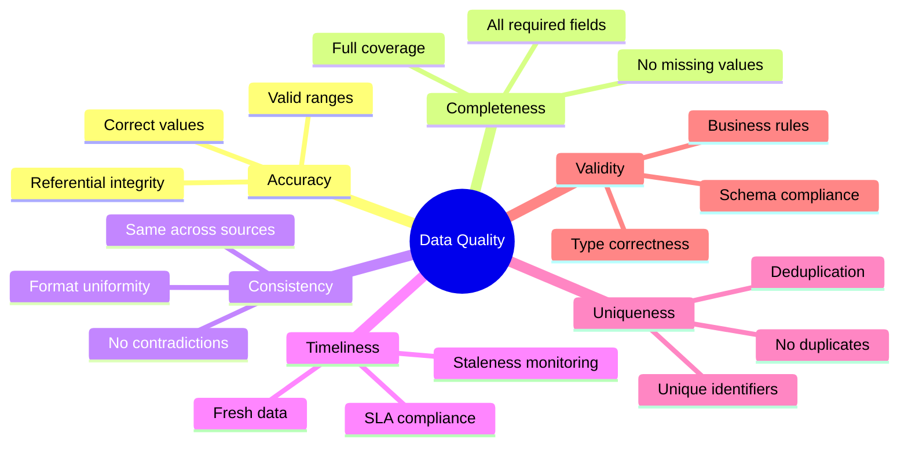
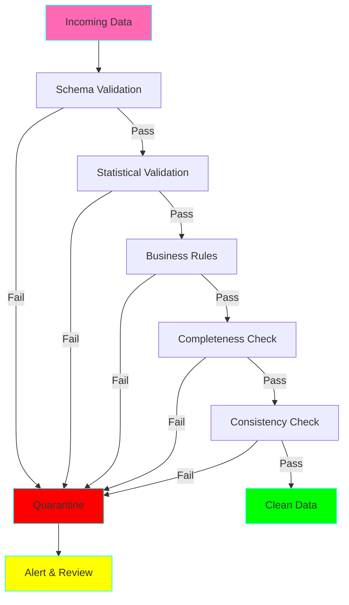

# Data Quality Best Practices

## The Six Dimensions of Data Quality



## Implementing Data Quality Checks

### 1. Schema Validation

```python
# Define expected schema
schema = {
    "user_id": {"type": "int", "required": True},
    "email": {"type": "str", "required": True, "regex": r"^[\w\.-]+@[\w\.-]+\.\w+$"},
    "age": {"type": "int", "min": 0, "max": 150},
    "created_at": {"type": "datetime", "required": True}
}

# Validate data
validate_schema(df, schema)
```

### 2. Statistical Validation

```python
# Check for outliers
assert df['amount'].between(0, 1000000).all(), "Amount outliers detected"

# Check distribution shift
historical_mean = 100
current_mean = df['amount'].mean()
assert abs(current_mean - historical_mean) / historical_mean < 0.1, "Mean shifted > 10%"
```

### 3. Referential Integrity

```python
# Ensure foreign keys exist
assert df['user_id'].isin(users_df['id']).all(), "Orphaned user_ids found"
```

### 4. Completeness Checks

```python
# Required fields must not be null
required_fields = ['user_id', 'email', 'created_at']
for field in required_fields:
    assert df[field].notna().all(), f"Nulls found in required field: {field}"

# Acceptable null rate for optional fields
assert df['phone'].isna().mean() < 0.3, "Phone null rate exceeds 30%"
```

## Data Quality Framework



## Data Quality Monitoring

### Metrics to Track

1. **Freshness:** Time since last update
2. **Volume:** Row count trends
3. **Schema changes:** Column additions/removals
4. **Null rates:** Per-column null percentages
5. **Duplicate rates:** Percentage of duplicate rows
6. **Value distributions:** Statistical profiles

### Alerting Strategy

```python
# Define SLAs
SLAs = {
    "freshness_hours": 2,
    "min_rows_per_day": 1000,
    "max_null_rate": 0.05,
    "max_duplicate_rate": 0.01
}

# Check SLAs
if hours_since_last_update > SLAs["freshness_hours"]:
    alert("Data staleness SLA violated")

if daily_row_count < SLAs["min_rows_per_day"]:
    alert("Volume anomaly detected")
```

## Best Practices

### ✅ Do

1. **Validate early:** Catch issues at ingestion
2. **Fail loudly:** Don't silently skip bad data
3. **Quarantine, don't drop:** Keep bad data for analysis
4. **Track metrics over time:** Detect trends
5. **Automate alerts:** Don't rely on manual checks
6. **Document quality rules:** Make expectations explicit

### ❌ Don't

1. **Assume data is clean:** Always validate
2. **Ignore warning signs:** Small issues become big problems
3. **Drop data silently:** You'll regret it later
4. **Over-engineer:** Start simple, iterate
5. **Forget to version checks:** Quality rules evolve
6. **Skip monitoring:** Quality degrades over time

## Related Projects

- **Project 02:** Data Validation Framework
- **Project 06:** Data Deduplication Engine
- **Project 27:** Data Quality Observability Platform
