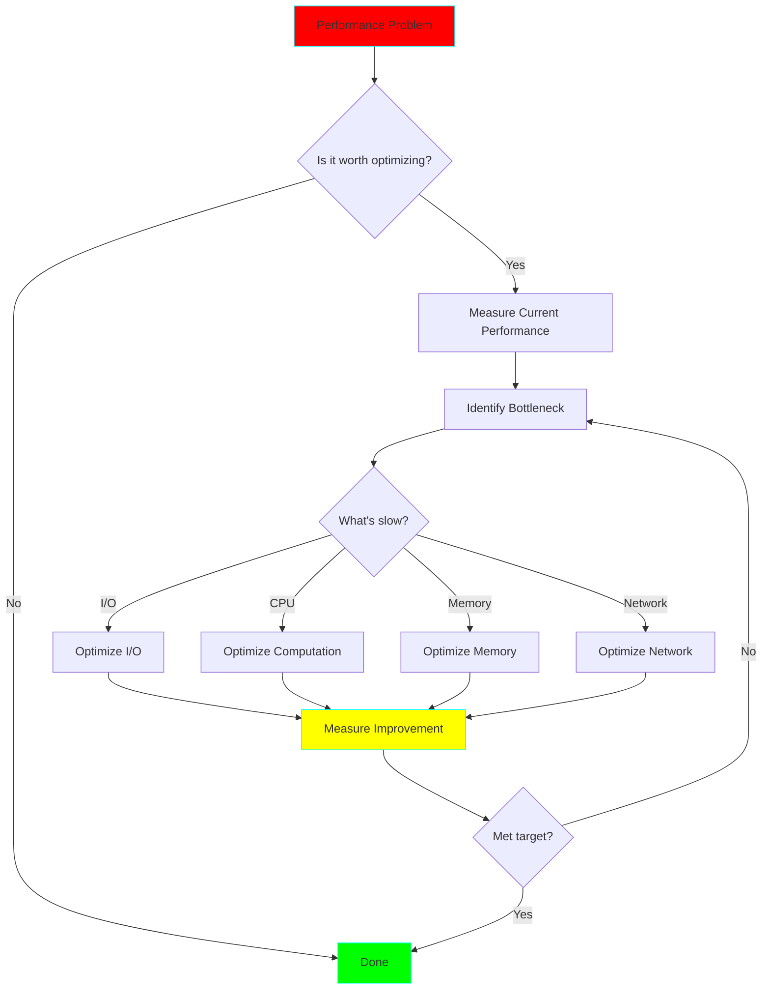

# Performance Optimization Best Practices

## The Performance Optimization Hierarchy



## Optimization Techniques

### 1. I/O Optimization

#### Use Columnar Formats

```python
# ❌ Slow: Row-based format
df = pd.read_csv("large_file.csv")  # Reads all columns

# ✅ Fast: Columnar format with column selection
df = pd.read_parquet("large_file.parquet", columns=['id', 'amount'])
```

**Speedup:** 5-10x for selective column queries

#### Partitioning

```python
# ❌ Slow: Scan entire dataset
df = pd.read_parquet("data.parquet")
df_filtered = df[df['date'] == '2024-01-01']

# ✅ Fast: Partition pruning
df = pd.read_parquet(
    "data.parquet",
    filters=[('date', '==', '2024-01-01')]
)
```

**Speedup:** 10-100x depending on partition selectivity

#### Compression

```python
# Balance compression ratio vs speed
compressions = {
    'snappy': 'Fast compression, good for hot data',
    'gzip': 'High compression, good for cold data',
    'zstd': 'Best balance for most use cases'
}
```

### 2. Computation Optimization

#### Vectorization

```python
# ❌ Slow: Python loop
result = []
for value in df['price']:
    result.append(value * 1.1)

# ✅ Fast: Vectorized operation
result = df['price'] * 1.1
```

**Speedup:** 10-100x

#### Avoid UDFs in Spark

```python
# ❌ Slow: Python UDF
from pyspark.sql.functions import udf
double_udf = udf(lambda x: x * 2)
df = df.withColumn('doubled', double_udf('value'))

# ✅ Fast: Built-in function
from pyspark.sql.functions import col
df = df.withColumn('doubled', col('value') * 2)
```

**Speedup:** 5-50x

#### Use Pandas UDF for Complex Logic

```python
from pyspark.sql.functions import pandas_udf
import pandas as pd

@pandas_udf('double')
def complex_calculation(s: pd.Series) -> pd.Series:
    # Vectorized pandas operations
    return s.apply(some_complex_function)
```

### 3. Memory Optimization

#### Chunked Processing

```python
# ❌ Runs out of memory
df = pd.read_csv("100GB_file.csv")

# ✅ Memory-efficient chunking
for chunk in pd.read_csv("100GB_file.csv", chunksize=100000):
    process(chunk)
```

#### Optimize Data Types

```python
# ❌ Memory-heavy
df['user_id'] = df['user_id'].astype('int64')  # 8 bytes per value

# ✅ Memory-efficient
df['user_id'] = df['user_id'].astype('int32')  # 4 bytes per value

# Even better for categorical data
df['country'] = df['country'].astype('category')
```

**Memory savings:** 50-90%

### 4. Network Optimization

#### Broadcast Joins

```python
# ❌ Slow: Shuffle join
large_df.join(small_df, on='key')

# ✅ Fast: Broadcast join
from pyspark.sql.functions import broadcast
large_df.join(broadcast(small_df), on='key')
```

**Speedup:** 2-10x for small dimension tables

#### Batch API Calls

```python
# ❌ Slow: One request per row
for user_id in user_ids:
    response = requests.get(f"/api/users/{user_id}")

# ✅ Fast: Batch requests
response = requests.post("/api/users/batch", json={"ids": user_ids})
```

## Performance Measurement

### Always Measure Before and After

```python
import time

# Measure execution time
start = time.time()
result = expensive_operation()
duration = time.time() - start
print(f"Execution time: {duration:.2f}s")

# Measure memory usage
import memory_profiler

@memory_profiler.profile
def memory_intensive_function():
    # Your code here
    pass
```

### Common Performance Metrics

| Metric | Target | Tool |
|--------|--------|------|
| Latency | < 100ms for APIs | time.time(), cProfile |
| Throughput | > 10k rows/sec | Batch processing benchmarks |
| Memory | < 80% of available RAM | memory_profiler, tracemalloc |
| CPU | < 80% utilization | htop, psutil |
| I/O wait | < 20% | iostat |

## Performance Anti-Patterns

### ❌ Premature Optimization

Don't optimize before you have a performance problem. Measure first!

### ❌ Over-Engineering

Simple solutions often outperform complex ones:

```python
# ❌ Complex
from concurrent.futures import ThreadPoolExecutor
with ThreadPoolExecutor(max_workers=10) as executor:
    futures = [executor.submit(process, item) for item in items]
    results = [f.result() for f in futures]

# ✅ Simple (if items < 1000)
results = [process(item) for item in items]
```

### ❌ Ignoring the 80/20 Rule

Focus on the 20% of code that takes 80% of execution time.

## Optimization Checklist

- [ ] Profile to identify bottleneck
- [ ] Set measurable performance target
- [ ] Implement optimization
- [ ] Measure improvement
- [ ] Verify correctness
- [ ] Document why optimization was needed

## Related Projects

- **Project 01:** CSV to Parquet Pipeline (compression)
- **Project 08:** Column-Store Query Optimizer
- **Project 12:** Apache Spark Pipeline (shuffle optimization)
- **Project 30:** Real-time ML Feature Platform (latency optimization)
