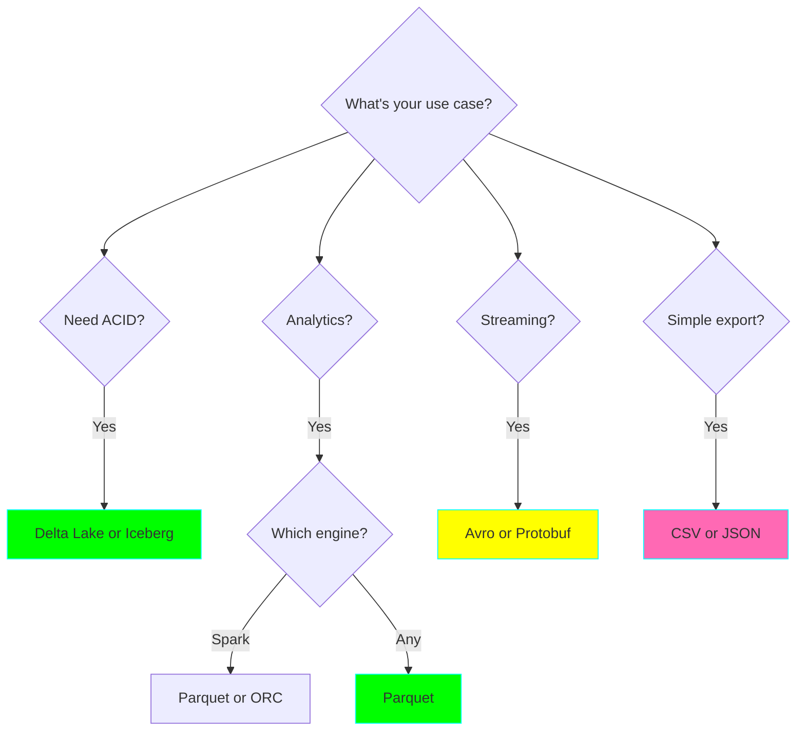

# Data Formats in Data Engineering

## Overview

Understanding data formats is fundamental to data engineering. The choice of format impacts storage efficiency, query performance, and compatibility with downstream systems.

## Comparison Table

| Format | Type | Schema | Compression | Splittable | Best For |
|--------|------|--------|-------------|------------|----------|
| CSV | Row-based | No | Poor | Yes | Simple exports, small datasets |
| JSON | Row-based | No | Poor | Line-delimited | APIs, semi-structured |
| Parquet | Columnar | Yes | Excellent | Yes | Analytics, data lakes |
| Avro | Row-based | Yes | Good | Yes | Streaming, schema evolution |
| ORC | Columnar | Yes | Excellent | Yes | Hive, heavy analytics |
| Delta | Columnar | Yes | Excellent | Yes | ACID on data lakes |
| Iceberg | Columnar | Yes | Excellent | Yes | Modern lakehouse |

## When to Use Each Format

## Related Projects

- **Project 01:** CSV to Parquet Pipeline
- **Project 15:** Delta Lake Implementation
- **Project 26:** Lakehouse with Iceberg
