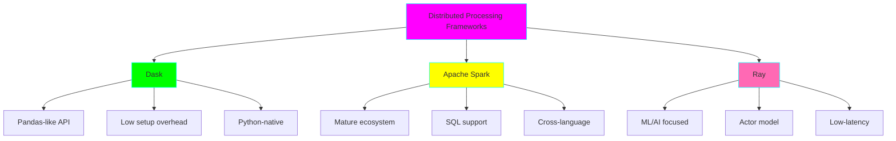
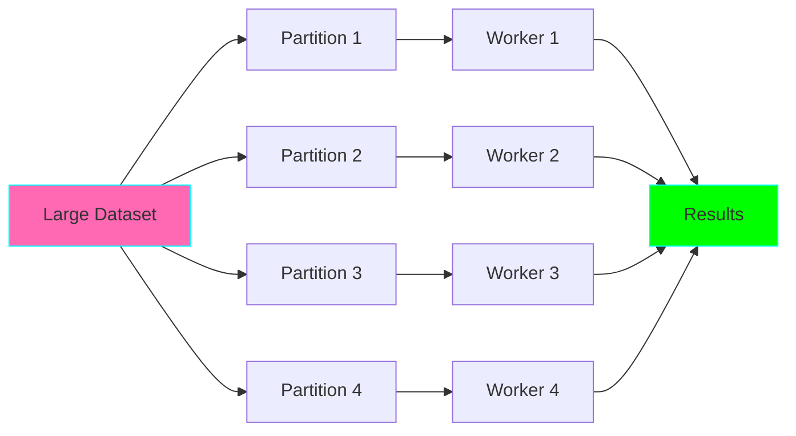
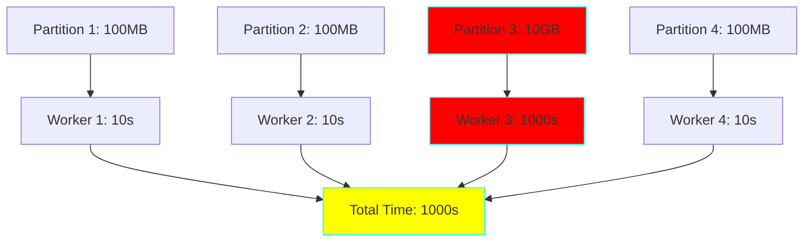

# Distributed Computing in Data Engineering

## Why Distributed Computing?

When data exceeds single-machine capacity, distributed computing allows:

- **Horizontal scaling:** Add more machines instead of bigger machines
- **Fault tolerance:** Resilience to individual machine failures
- **Parallel processing:** Process data faster by utilizing multiple CPUs
- **Cost efficiency:** Use commodity hardware instead of expensive servers

## Framework Comparison

## When to Use Which Framework

### Dask
**Best for:**
- Scaling pandas workflows
- Quick prototyping
- Python-heavy teams
- 10GB - 1TB datasets

**Example use case:** Scale existing pandas analytics pipeline from 5GB to 100GB

### Apache Spark
**Best for:**
- > 1TB datasets
- SQL-heavy workloads
- Multi-language teams (Python, Scala, Java)
- Enterprise deployments

**Example use case:** Process 10TB of log data daily with complex SQL transformations

### Ray
**Best for:**
- ML model training at scale
- Reinforcement learning
- Low-latency distributed computing
- Microservices orchestration

**Example use case:** Distributed hyperparameter tuning for deep learning models

## Distributed Computing Concepts

### 1. Partitioning

### 2. Shuffle Operations

Expensive operations that require data movement across workers:
- **JOIN:** Requires matching keys on same worker
- **GROUP BY:** Groups must be co-located
- **ORDER BY:** Global sorting requires coordination

**Optimization:** Minimize shuffles by:
- Partitioning data by join keys
- Using broadcast joins for small tables
- Filtering before joining

### 3. Data Skew

**Solutions:**
- Salting: Add random prefix to skewed keys
- Adaptive partitioning: Dynamically adjust partition counts
- Pre-aggregation: Reduce data before shuffle

## Related Projects

- **Project 11:** Distributed ETL with Dask
- **Project 12:** Apache Spark Pipeline
- **Project 21:** Lambda Architecture System
- **Project 22:** Kappa Architecture Pipeline
