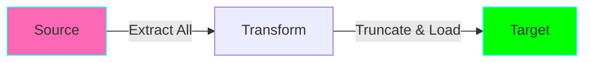
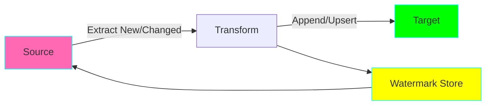
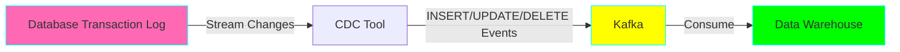
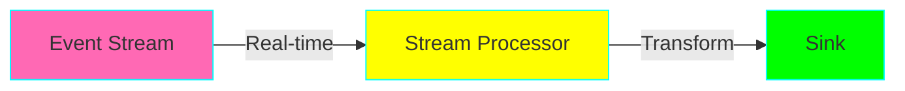
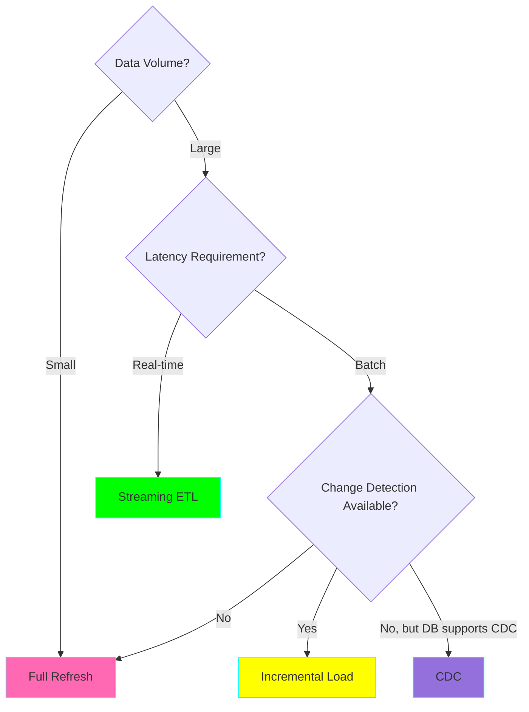

# ETL Patterns

## Overview

ETL (Extract, Transform, Load) patterns define how data moves from source to destination. Modern data engineering uses various patterns depending on latency, volume, and freshness requirements.

## Common Patterns

### 1. Full Refresh

**When to use:**
- Small datasets (< 1GB)
- No historical tracking needed
- Simple refresh logic

**Pros:** Simple, consistent state
**Cons:** Inefficient, longer processing time

---

### 2. Incremental Load

**When to use:**
- Large datasets
- Frequent updates
- Timestamp or sequence ID available

**Pros:** Efficient, faster
**Cons:** Complex change detection

---

### 3. Change Data Capture (CDC)

**When to use:**
- Near real-time sync needed
- All changes must be captured
- Source database supports CDC

**Pros:** Low latency, complete change history
**Cons:** Complex setup, database dependency

---

### 4. Streaming ETL

**When to use:**
- Sub-second latency required
- Event-driven architecture
- Continuous processing

**Pros:** Real-time insights
**Cons:** Complex state management

## Pattern Decision Tree

## Related Projects

- **Project 03:** Incremental ETL Pattern
- **Project 13:** Kafka Streaming Consumer
- **Project 16:** CDC with Debezium
