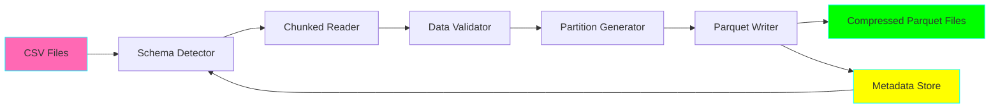
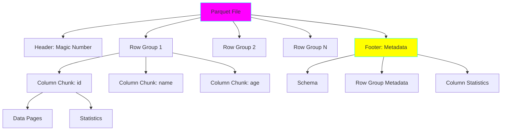

# Project 01: CSV to Parquet Pipeline

**Complexity:** ⭐⭐☆☆☆ | **Time:** 4-6 hours | **Tier:** Foundation

## Overview

Build an efficient pipeline to convert CSV files to Parquet format with intelligent partitioning, compression, and schema management. This project teaches the fundamentals of columnar storage and its advantages over row-based formats.

## Learning Objectives

After completing this project, you will understand:

- ✅ Differences between row-based (CSV) and columnar (Parquet) storage
- ✅ Parquet file format internals and metadata structure
- ✅ Partition strategies for efficient querying
- ✅ Compression algorithms and their tradeoffs
- ✅ Schema evolution and compatibility
- ✅ Memory-efficient chunked processing

## Architecture



## Key Concepts

### Columnar vs Row-Based Storage

**Row-Based (CSV):**
```
[id, name, age, city]
[1, "Alice", 30, "NYC"]
[2, "Bob", 25, "LA"]
```
- All columns for one row stored together
- Efficient for: Full row retrieval, transactional workloads
- Inefficient for: Analytical queries on few columns

**Columnar (Parquet):**
```
[id]:   [1, 2]
[name]: ["Alice", "Bob"]
[age]:  [30, 25]
[city]: ["NYC", "LA"]
```
- Each column stored separately
- Efficient for: Analytical queries, column-specific operations
- Better compression (similar data types together)

### Parquet File Structure



### Partition Strategies

**Hive-Style Partitioning:**
```
data/
├── year=2023/
│   ├── month=01/
│   │   └── data.parquet
│   └── month=02/
│       └── data.parquet
└── year=2024/
    └── month=01/
        └── data.parquet
```

**Benefits:**
- **Partition pruning:** Skip entire directories during queries
- **Parallel processing:** Each partition processed independently
- **Time-based retention:** Delete old partitions easily

### Compression Algorithms

| Algorithm | Compression Ratio | Speed | Use Case |
|-----------|------------------|-------|----------|
| Snappy | 2-3x | Fast | Default choice, balanced |
| GZIP | 3-5x | Slow | High compression needed |
| ZSTD | 3-4x | Medium | Best balance |
| LZ4 | 2-2.5x | Very Fast | Low-latency reads |
| Brotli | 4-6x | Very Slow | Archival storage |

## Implementation Guide

### Step 1: Schema Detection and Validation

```python
import pyarrow as pa
import pyarrow.parquet as pq
import pandas as pd
from typing import Dict, List, Optional
import logging

class SchemaDetector:
    """Automatically detect and validate schemas from CSV files."""

    def __init__(self):
        self.logger = logging.getLogger(__name__)

    def detect_schema(self, csv_path: str, sample_size: int = 10000) -> pa.Schema:
        """
        Detect PyArrow schema from CSV file.

        Args:
            csv_path: Path to CSV file
            sample_size: Number of rows to sample for type inference

        Returns:
            PyArrow schema
        """
        # Read sample for type inference
        df_sample = pd.read_csv(csv_path, nrows=sample_size)

        # Convert to PyArrow and infer schema
        table = pa.Table.from_pandas(df_sample)
        schema = table.schema

        self.logger.info(f"Detected schema: {schema}")
        return schema

    def validate_schema_compatibility(
        self,
        old_schema: pa.Schema,
        new_schema: pa.Schema
    ) -> tuple[bool, List[str]]:
        """
        Check if schemas are compatible for appending.

        Returns:
            (is_compatible, list_of_issues)
        """
        issues = []

        # Check for missing columns
        old_fields = {f.name: f for f in old_schema}
        new_fields = {f.name: f for f in new_schema}

        for col in old_fields:
            if col not in new_fields:
                issues.append(f"Column '{col}' removed in new schema")

        # Check for type changes
        for col in new_fields:
            if col in old_fields:
                if old_fields[col].type != new_fields[col].type:
                    issues.append(
                        f"Type mismatch for '{col}': "
                        f"{old_fields[col].type} -> {new_fields[col].type}"
                    )

        return len(issues) == 0, issues
```

### Step 2: Chunked CSV Reader

```python
class ChunkedCSVReader:
    """Memory-efficient CSV reader using chunking."""

    def __init__(self, chunk_size: int = 100000):
        self.chunk_size = chunk_size
        self.logger = logging.getLogger(__name__)

    def read_chunks(self, csv_path: str):
        """
        Read CSV in chunks to avoid memory overflow.

        Yields:
            PyArrow Table chunks
        """
        self.logger.info(f"Reading {csv_path} in chunks of {self.chunk_size}")

        chunk_num = 0
        for chunk in pd.read_csv(csv_path, chunksize=self.chunk_size):
            chunk_num += 1
            self.logger.debug(f"Processing chunk {chunk_num}: {len(chunk)} rows")

            # Convert to PyArrow Table
            table = pa.Table.from_pandas(chunk)
            yield table
```

### Step 3: Partition Strategy Implementation

```python
from datetime import datetime
from pathlib import Path

class PartitionStrategy:
    """Handles data partitioning logic."""

    @staticmethod
    def extract_partition_values(
        table: pa.Table,
        partition_cols: List[str]
    ) -> Dict[str, List]:
        """Extract unique partition values from table."""
        partition_values = {}

        for col in partition_cols:
            column_data = table.column(col).to_pylist()
            unique_values = list(set(column_data))
            partition_values[col] = unique_values

        return partition_values

    @staticmethod
    def create_partition_path(
        base_path: str,
        partition_cols: List[str],
        partition_values: Dict[str, any]
    ) -> Path:
        """
        Create Hive-style partition path.

        Example: base_path/year=2024/month=01/day=15
        """
        path = Path(base_path)

        for col in partition_cols:
            value = partition_values[col]
            path = path / f"{col}={value}"

        return path

    @staticmethod
    def filter_table_by_partition(
        table: pa.Table,
        partition_cols: List[str],
        partition_values: Dict[str, any]
    ) -> pa.Table:
        """Filter table rows matching partition values."""
        mask = None

        for col, value in partition_values.items():
            col_data = table.column(col)
            col_mask = pa.compute.equal(col_data, value)

            if mask is None:
                mask = col_mask
            else:
                mask = pa.compute.and_(mask, col_mask)

        return table.filter(mask)
```

### Step 4: Parquet Writer with Compression

```python
class ParquetPipeline:
    """Main pipeline orchestrator."""

    def __init__(
        self,
        output_base_path: str,
        compression: str = 'snappy',
        partition_cols: Optional[List[str]] = None,
        row_group_size: int = 100000
    ):
        self.output_base_path = Path(output_base_path)
        self.compression = compression
        self.partition_cols = partition_cols or []
        self.row_group_size = row_group_size
        self.logger = logging.getLogger(__name__)

        self.schema_detector = SchemaDetector()
        self.reader = ChunkedCSVReader()

    def convert(self, csv_path: str):
        """
        Convert CSV to partitioned Parquet files.
        """
        self.logger.info(f"Starting conversion: {csv_path}")

        # Detect schema from first chunk
        schema = self.schema_detector.detect_schema(csv_path)

        # Process each chunk
        for chunk_table in self.reader.read_chunks(csv_path):
            if self.partition_cols:
                self._write_partitioned(chunk_table)
            else:
                self._write_single_file(chunk_table)

        self.logger.info("Conversion complete!")

    def _write_partitioned(self, table: pa.Table):
        """Write table with partitioning."""
        partition_strategy = PartitionStrategy()

        # Get unique partition combinations
        partition_values = partition_strategy.extract_partition_values(
            table, self.partition_cols
        )

        # Generate all partition combinations
        import itertools
        partition_combinations = [
            dict(zip(self.partition_cols, combo))
            for combo in itertools.product(*partition_values.values())
        ]

        # Write each partition
        for partition in partition_combinations:
            # Filter data for this partition
            partition_table = partition_strategy.filter_table_by_partition(
                table, self.partition_cols, partition
            )

            if len(partition_table) == 0:
                continue

            # Create partition path
            partition_path = partition_strategy.create_partition_path(
                str(self.output_base_path), self.partition_cols, partition
            )
            partition_path.mkdir(parents=True, exist_ok=True)

            # Remove partition columns from data
            columns_to_write = [
                col for col in partition_table.column_names
                if col not in self.partition_cols
            ]
            partition_table = partition_table.select(columns_to_write)

            # Write parquet file
            output_file = partition_path / f"data_{datetime.now().timestamp()}.parquet"
            pq.write_table(
                partition_table,
                output_file,
                compression=self.compression,
                row_group_size=self.row_group_size
            )

            self.logger.info(f"Wrote {len(partition_table)} rows to {output_file}")

    def _write_single_file(self, table: pa.Table):
        """Write table as single file."""
        self.output_base_path.mkdir(parents=True, exist_ok=True)
        output_file = self.output_base_path / f"data_{datetime.now().timestamp()}.parquet"

        pq.write_table(
            table,
            output_file,
            compression=self.compression,
            row_group_size=self.row_group_size
        )

        self.logger.info(f"Wrote {len(table)} rows to {output_file}")
```

### Step 5: Performance Benchmarking

```python
import time
from dataclasses import dataclass

@dataclass
class BenchmarkResults:
    csv_size_mb: float
    parquet_size_mb: float
    compression_ratio: float
    write_time_seconds: float
    read_time_seconds: float
    csv_read_time: float
    parquet_read_time: float
    speedup: float

class Benchmarker:
    """Benchmark CSV vs Parquet performance."""

    @staticmethod
    def get_file_size_mb(path: str) -> float:
        """Get file size in MB."""
        return Path(path).stat().st_size / (1024 * 1024)

    def benchmark(
        self,
        csv_path: str,
        parquet_path: str
    ) -> BenchmarkResults:
        """
        Compare CSV and Parquet performance.
        """
        # Measure CSV read time
        start = time.time()
        df_csv = pd.read_csv(csv_path)
        csv_read_time = time.time() - start

        # Measure Parquet read time
        start = time.time()
        df_parquet = pd.read_parquet(parquet_path)
        parquet_read_time = time.time() - start

        # Calculate metrics
        csv_size = self.get_file_size_mb(csv_path)
        parquet_size = self.get_file_size_mb(parquet_path)

        return BenchmarkResults(
            csv_size_mb=csv_size,
            parquet_size_mb=parquet_size,
            compression_ratio=csv_size / parquet_size,
            write_time_seconds=0,  # Set during conversion
            read_time_seconds=parquet_read_time,
            csv_read_time=csv_read_time,
            parquet_read_time=parquet_read_time,
            speedup=csv_read_time / parquet_read_time
        )
```

## Nuanced Scenarios

### 1. Nested Data Structures

**Challenge:** Converting JSON-like nested CSVs to Parquet.

```python
# CSV with JSON column
# id,name,attributes
# 1,Alice,"{""age"": 30, ""city"": ""NYC""}"

import json

def parse_nested_csv(csv_path: str) -> pa.Table:
    """Parse CSV with JSON columns into nested Parquet schema."""
    df = pd.read_csv(csv_path)

    # Parse JSON column
    df['attributes'] = df['attributes'].apply(json.loads)

    # Define nested schema
    schema = pa.schema([
        ('id', pa.int64()),
        ('name', pa.string()),
        ('attributes', pa.struct([
            ('age', pa.int64()),
            ('city', pa.string())
        ]))
    ])

    # Convert with schema
    table = pa.Table.from_pandas(df, schema=schema)
    return table
```

### 2. Predicate Pushdown Optimization

**Challenge:** Design partitions to maximize query performance.

```python
# Bad partitioning: Too many small files
# partition by: user_id (millions of unique values)

# Good partitioning: Balanced file sizes
# partition by: year, month, day (manageable cardinality)

def optimize_partition_strategy(
    table: pa.Table,
    target_partition_size_mb: float = 128
) -> List[str]:
    """
    Automatically suggest partition columns based on:
    - Cardinality
    - Data distribution
    - Target partition size
    """
    recommendations = []

    for col in table.column_names:
        cardinality = len(set(table.column(col).to_pylist()))
        avg_partition_size = (len(table) / cardinality) * estimate_row_size(table)

        if 64 <= avg_partition_size <= 256:  # MB
            recommendations.append(col)

    return recommendations
```

### 3. Schema Evolution Handling

**Challenge:** Add new columns without rewriting all data.

```python
def evolve_schema(
    old_parquet_path: str,
    new_csv_path: str,
    output_path: str
):
    """
    Add new columns to existing Parquet files.
    Uses schema merging and null filling.
    """
    # Read existing data
    old_table = pq.read_table(old_parquet_path)

    # Read new data
    new_df = pd.read_csv(new_csv_path)
    new_table = pa.Table.from_pandas(new_df)

    # Merge schemas
    merged_fields = {}
    for field in old_table.schema:
        merged_fields[field.name] = field
    for field in new_table.schema:
        if field.name not in merged_fields:
            merged_fields[field.name] = field

    merged_schema = pa.schema(list(merged_fields.values()))

    # Add missing columns with nulls
    def add_missing_columns(table: pa.Table, schema: pa.Schema) -> pa.Table:
        for field in schema:
            if field.name not in table.column_names:
                null_array = pa.nulls(len(table), type=field.type)
                table = table.append_column(field, null_array)
        return table

    old_table = add_missing_columns(old_table, merged_schema)
    new_table = add_missing_columns(new_table, merged_schema)

    # Concatenate and write
    combined = pa.concat_tables([old_table, new_table])
    pq.write_table(combined, output_path)
```

### 4. Dynamic Partition Generation

**Challenge:** Automatically partition based on data distribution.

```python
def auto_partition(
    table: pa.Table,
    max_partitions: int = 1000,
    min_partition_size: int = 10000
) -> List[str]:
    """
    Automatically select partition columns based on:
    - Cardinality
    - Distribution
    - Query patterns
    """
    from collections import Counter

    candidates = []

    for col in table.column_names:
        values = table.column(col).to_pylist()
        cardinality = len(set(values))

        # Skip high-cardinality columns
        if cardinality > max_partitions:
            continue

        # Check distribution
        distribution = Counter(values)
        min_size = min(distribution.values())
        max_size = max(distribution.values())

        # Prefer balanced distributions
        balance_score = min_size / max_size if max_size > 0 else 0

        if balance_score > 0.1 and min_size >= min_partition_size:
            candidates.append((col, balance_score, cardinality))

    # Sort by balance and cardinality
    candidates.sort(key=lambda x: (x[1], -x[2]), reverse=True)

    return [col for col, _, _ in candidates[:3]]
```

## Exercises

### Exercise 1: Basic Conversion
Convert a 100MB CSV file to Parquet and measure:
- File size reduction
- Read speed improvement
- Memory usage difference

### Exercise 2: Partitioning Strategy
Given a sales dataset with columns: `date`, `product_id`, `customer_id`, `amount`:
- Design optimal partition strategy
- Justify your choices
- Implement and benchmark queries

### Exercise 3: Schema Evolution
Start with schema V1: `id, name, email`
Add fields in V2: `id, name, email, phone, address`
Implement backward-compatible evolution

### Exercise 4: Compression Comparison
Test all compression algorithms on your data:
- Measure compression ratio
- Measure write speed
- Measure read speed
- Choose optimal for your use case

## Success Criteria

- [ ] Convert 1GB+ CSV to Parquet with 10x+ compression
- [ ] Implement Hive-style partitioning with 2-3 levels
- [ ] Handle schema changes gracefully (add/remove columns)
- [ ] Benchmark and document 5x+ read speedup
- [ ] Process large files in chunks without OOM errors
- [ ] Write comprehensive tests for edge cases

## Testing Checklist

```python
# tests/test_csv_to_parquet.py

def test_basic_conversion():
    """Test simple CSV to Parquet conversion."""
    pass

def test_partitioned_write():
    """Test Hive-style partitioning."""
    pass

def test_schema_detection():
    """Test automatic schema inference."""
    pass

def test_schema_compatibility():
    """Test schema evolution compatibility."""
    pass

def test_chunked_processing():
    """Test memory-efficient chunked reads."""
    pass

def test_compression_algorithms():
    """Test different compression options."""
    pass

def test_nested_structures():
    """Test nested/struct columns."""
    pass

def test_large_file_handling():
    """Test files larger than available RAM."""
    pass
```

## Common Pitfalls

1. **Memory Overflow:** Always use chunked reading for large files
2. **Over-partitioning:** Too many partitions = too many small files
3. **Under-partitioning:** Too few partitions = poor query performance
4. **Wrong Compression:** Choose based on read vs write tradeoffs
5. **Schema Mismatch:** Validate schemas before appending data

## Next Steps

After completing this project:
1. Move to **Project 02: Data Validation Framework**
2. Combine with Project 03 for incremental Parquet updates
3. Apply partitioning knowledge to Projects 08 and 10

## References

- [Apache Parquet Documentation](https://parquet.apache.org/docs/)
- [PyArrow Parquet Guide](https://arrow.apache.org/docs/python/parquet.html)
- [Parquet Format Specification](https://github.com/apache/parquet-format)
- [Choosing Compression Algorithms](https://www.upsolver.com/blog/apache-parquet-why-use)

---

**Happy Learning! 🚀**
