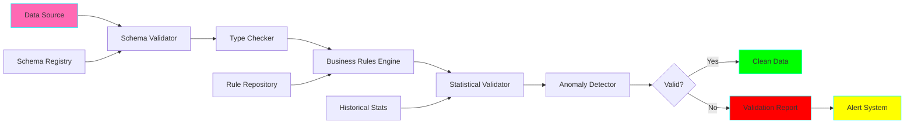
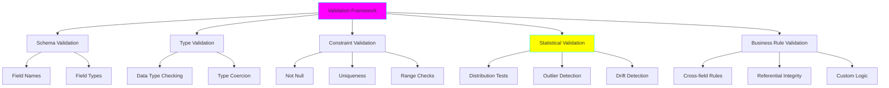

# Project 02: Data Validation Framework

**Complexity:** ⭐⭐⭐☆☆ | **Time:** 6-8 hours | **Tier:** Foundation

## Overview

Build a comprehensive data validation framework that enforces data contracts, performs statistical validation, and detects anomalies. This project teaches how to ensure data quality throughout the pipeline lifecycle and prevent bad data from propagating downstream.

## Learning Objectives

After completing this project, you will understand:

- ✅ Data contracts and schema-based validation
- ✅ Statistical validation techniques
- ✅ Anomaly detection fundamentals
- ✅ Validation rule engine architecture
- ✅ Data quality metrics and reporting
- ✅ Integration with CI/CD pipelines

## Architecture



## Key Concepts

### Data Contracts

**Definition:** A formal agreement between data producers and consumers about data structure, types, and quality.

```python
# Example Data Contract
contract = {
    "schema": {
        "user_id": "int64",
        "email": "string",
        "age": "int32",
        "created_at": "timestamp"
    },
    "constraints": {
        "user_id": ["not_null", "unique"],
        "email": ["not_null", "email_format"],
        "age": [">=0", "<=150"]
    },
    "quality_thresholds": {
        "completeness": 0.95,
        "uniqueness": 0.99,
        "validity": 0.98
    }
}
```

### Validation Layers



### Validation Rule Types

| Rule Type | Purpose | Example |
|-----------|---------|---------|
| **Schema** | Structure validation | Column names match expected |
| **Type** | Data type validation | age is integer |
| **Null** | Missing value checks | email is not null |
| **Uniqueness** | Duplicate detection | user_id is unique |
| **Range** | Value boundaries | age between 0 and 150 |
| **Pattern** | Format validation | email matches regex |
| **Referential** | Foreign key checks | customer_id exists in customers |
| **Statistical** | Distribution checks | Mean within 2 std dev |
| **Custom** | Business logic | end_date > start_date |

### Quality Metrics

```python
# Data Quality Dimensions
quality_metrics = {
    "completeness": "% of non-null values",
    "uniqueness": "% of unique values",
    "validity": "% of values passing validation",
    "consistency": "% of values consistent across sources",
    "accuracy": "% of values matching ground truth",
    "timeliness": "% of data arriving within SLA"
}
```

## Implementation Guide

### Step 1: Schema Validation with Pandera

```python
import pandera as pa
from pandera import Column, DataFrameSchema, Check
import pandas as pd
from typing import Dict, List, Optional
from dataclasses import dataclass
from datetime import datetime

@dataclass
class ValidationResult:
    """Encapsulates validation results."""
    is_valid: bool
    errors: List[str]
    warnings: List[str]
    metrics: Dict[str, float]
    timestamp: datetime

class SchemaValidator:
    """Schema-based validation using Pandera."""

    def __init__(self):
        self.schemas: Dict[str, DataFrameSchema] = {}

    def register_schema(self, name: str, schema: DataFrameSchema):
        """Register a schema for validation."""
        self.schemas[name] = schema

    def define_user_schema(self) -> DataFrameSchema:
        """Example: Define user data schema."""
        return DataFrameSchema({
            "user_id": Column(
                int,
                checks=[
                    Check.greater_than(0),
                    Check(lambda x: x.is_unique, error="user_id must be unique")
                ],
                nullable=False
            ),
            "email": Column(
                str,
                checks=[
                    Check.str_matches(r'^[\w\.-]+@[\w\.-]+\.\w+$'),
                    Check(lambda x: x.is_unique, error="email must be unique")
                ],
                nullable=False
            ),
            "age": Column(
                int,
                checks=[
                    Check.in_range(0, 150),
                ],
                nullable=True
            ),
            "created_at": Column(
                pa.DateTime,
                checks=[
                    Check.less_than_or_equal_to(pd.Timestamp.now())
                ],
                nullable=False
            ),
            "status": Column(
                str,
                checks=[
                    Check.isin(['active', 'inactive', 'pending'])
                ],
                nullable=False
            )
        })

    def validate(
        self,
        df: pd.DataFrame,
        schema_name: str,
        lazy: bool = True
    ) -> ValidationResult:
        """
        Validate DataFrame against registered schema.

        Args:
            df: DataFrame to validate
            schema_name: Name of registered schema
            lazy: If True, collect all errors; if False, fail fast

        Returns:
            ValidationResult with errors and metrics
        """
        if schema_name not in self.schemas:
            raise ValueError(f"Schema '{schema_name}' not registered")

        schema = self.schemas[schema_name]
        errors = []
        warnings = []

        try:
            # Validate schema
            validated_df = schema.validate(df, lazy=lazy)
            is_valid = True
        except pa.errors.SchemaErrors as e:
            is_valid = False
            # Collect all validation errors
            for error in e.failure_cases.itertuples():
                errors.append(
                    f"Column '{error.column}': {error.check} failed for {error.failure_case}"
                )
        except pa.errors.SchemaError as e:
            is_valid = False
            errors.append(str(e))

        # Calculate quality metrics
        metrics = self._calculate_metrics(df)

        return ValidationResult(
            is_valid=is_valid,
            errors=errors,
            warnings=warnings,
            metrics=metrics,
            timestamp=datetime.now()
        )

    def _calculate_metrics(self, df: pd.DataFrame) -> Dict[str, float]:
        """Calculate data quality metrics."""
        total_cells = df.shape[0] * df.shape[1]

        return {
            "completeness": 1 - (df.isnull().sum().sum() / total_cells),
            "row_count": len(df),
            "column_count": len(df.columns),
            "duplicate_rows": df.duplicated().sum() / len(df) if len(df) > 0 else 0
        }
```

### Step 2: Statistical Validation

```python
import numpy as np
from scipy import stats
from typing import Tuple

class StatisticalValidator:
    """Perform statistical validation and anomaly detection."""

    def __init__(self, confidence_level: float = 0.95):
        self.confidence_level = confidence_level

    def validate_distribution(
        self,
        data: pd.Series,
        expected_mean: float,
        expected_std: float,
        tolerance_std: float = 3.0
    ) -> Tuple[bool, str]:
        """
        Validate that data distribution matches expectations.

        Args:
            data: Series to validate
            expected_mean: Expected mean value
            expected_std: Expected standard deviation
            tolerance_std: Number of std deviations for tolerance

        Returns:
            (is_valid, message)
        """
        actual_mean = data.mean()
        actual_std = data.std()

        # Check if mean is within tolerance
        mean_diff = abs(actual_mean - expected_mean)
        is_mean_valid = mean_diff <= (tolerance_std * expected_std)

        # Check if std is within tolerance
        std_ratio = actual_std / expected_std if expected_std > 0 else float('inf')
        is_std_valid = 0.5 <= std_ratio <= 2.0

        if is_mean_valid and is_std_valid:
            return True, "Distribution within expected range"
        else:
            msg = []
            if not is_mean_valid:
                msg.append(f"Mean drift: {actual_mean:.2f} vs {expected_mean:.2f}")
            if not is_std_valid:
                msg.append(f"Std deviation drift: {actual_std:.2f} vs {expected_std:.2f}")
            return False, "; ".join(msg)

    def detect_outliers_iqr(
        self,
        data: pd.Series,
        multiplier: float = 1.5
    ) -> Tuple[pd.Series, Dict]:
        """
        Detect outliers using Interquartile Range (IQR) method.

        Args:
            data: Series to analyze
            multiplier: IQR multiplier for outlier threshold

        Returns:
            (outlier_mask, statistics)
        """
        q1 = data.quantile(0.25)
        q3 = data.quantile(0.75)
        iqr = q3 - q1

        lower_bound = q1 - (multiplier * iqr)
        upper_bound = q3 + (multiplier * iqr)

        outlier_mask = (data < lower_bound) | (data > upper_bound)

        stats_dict = {
            "q1": q1,
            "q3": q3,
            "iqr": iqr,
            "lower_bound": lower_bound,
            "upper_bound": upper_bound,
            "outlier_count": outlier_mask.sum(),
            "outlier_percentage": (outlier_mask.sum() / len(data)) * 100
        }

        return outlier_mask, stats_dict

    def detect_outliers_zscore(
        self,
        data: pd.Series,
        threshold: float = 3.0
    ) -> Tuple[pd.Series, Dict]:
        """
        Detect outliers using Z-score method.

        Args:
            data: Series to analyze
            threshold: Z-score threshold

        Returns:
            (outlier_mask, statistics)
        """
        z_scores = np.abs(stats.zscore(data.dropna()))
        outlier_mask = pd.Series(False, index=data.index)
        outlier_mask[data.dropna().index] = z_scores > threshold

        stats_dict = {
            "mean": data.mean(),
            "std": data.std(),
            "threshold": threshold,
            "outlier_count": outlier_mask.sum(),
            "outlier_percentage": (outlier_mask.sum() / len(data)) * 100
        }

        return outlier_mask, stats_dict

    def validate_data_freshness(
        self,
        timestamp_column: pd.Series,
        max_age_hours: int = 24
    ) -> Tuple[bool, str]:
        """
        Validate that data is fresh (recent).

        Args:
            timestamp_column: Column with timestamps
            max_age_hours: Maximum allowed age in hours

        Returns:
            (is_fresh, message)
        """
        max_timestamp = timestamp_column.max()
        age_hours = (pd.Timestamp.now() - max_timestamp).total_seconds() / 3600

        is_fresh = age_hours <= max_age_hours

        message = (
            f"Data age: {age_hours:.1f} hours "
            f"({'within' if is_fresh else 'exceeds'} {max_age_hours}h threshold)"
        )

        return is_fresh, message
```

### Step 3: Custom Business Rules Engine

```python
from abc import ABC, abstractmethod
from enum import Enum
from typing import Callable, Any

class RuleSeverity(Enum):
    """Rule violation severity levels."""
    ERROR = "error"
    WARNING = "warning"
    INFO = "info"

class ValidationRule(ABC):
    """Base class for validation rules."""

    def __init__(
        self,
        name: str,
        description: str,
        severity: RuleSeverity = RuleSeverity.ERROR
    ):
        self.name = name
        self.description = description
        self.severity = severity

    @abstractmethod
    def validate(self, df: pd.DataFrame) -> Tuple[bool, List[str]]:
        """
        Validate rule against DataFrame.

        Returns:
            (is_valid, list_of_violations)
        """
        pass

class CrossFieldRule(ValidationRule):
    """Validate relationships between fields."""

    def __init__(
        self,
        name: str,
        description: str,
        validation_fn: Callable[[pd.DataFrame], pd.Series],
        severity: RuleSeverity = RuleSeverity.ERROR
    ):
        super().__init__(name, description, severity)
        self.validation_fn = validation_fn

    def validate(self, df: pd.DataFrame) -> Tuple[bool, List[str]]:
        """Apply cross-field validation function."""
        try:
            mask = self.validation_fn(df)
            violations = (~mask).sum()

            if violations == 0:
                return True, []
            else:
                violation_indices = df[~mask].index.tolist()[:10]  # Show first 10
                messages = [
                    f"Rule '{self.name}' violated at rows: {violation_indices}"
                ]
                return False, messages
        except Exception as e:
            return False, [f"Rule '{self.name}' failed: {str(e)}"]

class ReferentialIntegrityRule(ValidationRule):
    """Validate foreign key relationships."""

    def __init__(
        self,
        name: str,
        description: str,
        foreign_key: str,
        reference_values: set,
        severity: RuleSeverity = RuleSeverity.ERROR
    ):
        super().__init__(name, description, severity)
        self.foreign_key = foreign_key
        self.reference_values = reference_values

    def validate(self, df: pd.DataFrame) -> Tuple[bool, List[str]]:
        """Check if all foreign key values exist in reference set."""
        if self.foreign_key not in df.columns:
            return False, [f"Column '{self.foreign_key}' not found"]

        fk_values = set(df[self.foreign_key].dropna().unique())
        invalid_values = fk_values - self.reference_values

        if len(invalid_values) == 0:
            return True, []
        else:
            return False, [
                f"Invalid foreign key values in '{self.foreign_key}': "
                f"{list(invalid_values)[:10]}"
            ]

class BusinessRulesEngine:
    """Engine to execute business validation rules."""

    def __init__(self):
        self.rules: List[ValidationRule] = []

    def add_rule(self, rule: ValidationRule):
        """Register a validation rule."""
        self.rules.append(rule)

    def validate_all(self, df: pd.DataFrame) -> ValidationResult:
        """Execute all registered rules."""
        errors = []
        warnings = []

        for rule in self.rules:
            is_valid, messages = rule.validate(df)

            if not is_valid:
                if rule.severity == RuleSeverity.ERROR:
                    errors.extend(messages)
                elif rule.severity == RuleSeverity.WARNING:
                    warnings.extend(messages)

        return ValidationResult(
            is_valid=len(errors) == 0,
            errors=errors,
            warnings=warnings,
            metrics={"rules_evaluated": len(self.rules)},
            timestamp=datetime.now()
        )
```

### Step 4: Validation Reporting

```python
from pathlib import Path
import json

class ValidationReporter:
    """Generate validation reports."""

    def __init__(self, output_dir: str = "./validation_reports"):
        self.output_dir = Path(output_dir)
        self.output_dir.mkdir(parents=True, exist_ok=True)

    def generate_report(
        self,
        result: ValidationResult,
        dataset_name: str,
        save_to_file: bool = True
    ) -> Dict:
        """
        Generate comprehensive validation report.

        Args:
            result: ValidationResult object
            dataset_name: Name of validated dataset
            save_to_file: Whether to save report to file

        Returns:
            Report dictionary
        """
        report = {
            "dataset": dataset_name,
            "timestamp": result.timestamp.isoformat(),
            "validation_status": "PASSED" if result.is_valid else "FAILED",
            "summary": {
                "is_valid": result.is_valid,
                "error_count": len(result.errors),
                "warning_count": len(result.warnings)
            },
            "errors": result.errors,
            "warnings": result.warnings,
            "metrics": result.metrics
        }

        if save_to_file:
            filename = f"{dataset_name}_{result.timestamp.strftime('%Y%m%d_%H%M%S')}.json"
            filepath = self.output_dir / filename

            with open(filepath, 'w') as f:
                json.dump(report, f, indent=2, default=str)

            report["report_path"] = str(filepath)

        return report

    def generate_html_report(self, report: Dict) -> str:
        """Generate HTML version of report."""
        status_color = "green" if report["summary"]["is_valid"] else "red"

        html = f"""
        <!DOCTYPE html>
        <html>
        <head>
            <title>Validation Report: {report['dataset']}</title>
            <style>
                body {{ font-family: Arial, sans-serif; margin: 20px; }}
                .status {{ font-size: 24px; font-weight: bold; color: {status_color}; }}
                .section {{ margin: 20px 0; }}
                .error {{ color: red; }}
                .warning {{ color: orange; }}
                table {{ border-collapse: collapse; width: 100%; }}
                th, td {{ border: 1px solid #ddd; padding: 8px; text-align: left; }}
                th {{ background-color: #4CAF50; color: white; }}
            </style>
        </head>
        <body>
            <h1>Data Validation Report</h1>
            <div class="section">
                <h2>Dataset: {report['dataset']}</h2>
                <p>Timestamp: {report['timestamp']}</p>
                <p class="status">Status: {report['validation_status']}</p>
            </div>

            <div class="section">
                <h2>Summary</h2>
                <table>
                    <tr><th>Metric</th><th>Value</th></tr>
                    <tr><td>Errors</td><td>{report['summary']['error_count']}</td></tr>
                    <tr><td>Warnings</td><td>{report['summary']['warning_count']}</td></tr>
                </table>
            </div>

            <div class="section">
                <h2>Metrics</h2>
                <table>
                    <tr><th>Metric</th><th>Value</th></tr>
                    {''.join(f"<tr><td>{k}</td><td>{v}</td></tr>" for k, v in report['metrics'].items())}
                </table>
            </div>

            {self._format_issues_html(report['errors'], 'Errors', 'error')}
            {self._format_issues_html(report['warnings'], 'Warnings', 'warning')}
        </body>
        </html>
        """

        return html

    def _format_issues_html(self, issues: List[str], title: str, css_class: str) -> str:
        """Format issues section in HTML."""
        if not issues:
            return ""

        items = "".join(f"<li>{issue}</li>" for issue in issues)
        return f"""
            <div class="section">
                <h2>{title}</h2>
                <ul class="{css_class}">
                    {items}
                </ul>
            </div>
        """
```

### Step 5: Complete Validation Pipeline

```python
class DataValidationPipeline:
    """Orchestrate complete validation workflow."""

    def __init__(self):
        self.schema_validator = SchemaValidator()
        self.stats_validator = StatisticalValidator()
        self.rules_engine = BusinessRulesEngine()
        self.reporter = ValidationReporter()

    def setup_user_validation(self):
        """Configure validation for user dataset."""
        # Register schema
        user_schema = self.schema_validator.define_user_schema()
        self.schema_validator.register_schema("users", user_schema)

        # Add business rules
        self.rules_engine.add_rule(
            CrossFieldRule(
                name="age_consistency",
                description="Age must be consistent with birth_date",
                validation_fn=lambda df: (
                    (pd.Timestamp.now().year - df['birth_date'].dt.year) == df['age']
                ) if 'birth_date' in df.columns else pd.Series(True, index=df.index),
                severity=RuleSeverity.WARNING
            )
        )

    def validate(
        self,
        df: pd.DataFrame,
        schema_name: str,
        run_statistical: bool = True,
        run_business_rules: bool = True
    ) -> ValidationResult:
        """
        Run complete validation pipeline.

        Args:
            df: DataFrame to validate
            schema_name: Name of schema to use
            run_statistical: Whether to run statistical validation
            run_business_rules: Whether to run business rules

        Returns:
            Consolidated ValidationResult
        """
        all_errors = []
        all_warnings = []
        all_metrics = {}

        # Schema validation
        schema_result = self.schema_validator.validate(df, schema_name)
        all_errors.extend(schema_result.errors)
        all_warnings.extend(schema_result.warnings)
        all_metrics.update(schema_result.metrics)

        # Statistical validation
        if run_statistical and schema_result.is_valid:
            for col in df.select_dtypes(include=[np.number]).columns:
                outlier_mask, stats = self.stats_validator.detect_outliers_iqr(df[col])
                if stats['outlier_percentage'] > 5:  # More than 5% outliers
                    all_warnings.append(
                        f"Column '{col}' has {stats['outlier_percentage']:.1f}% outliers"
                    )
                all_metrics[f"{col}_outliers"] = stats['outlier_percentage']

        # Business rules validation
        if run_business_rules:
            rules_result = self.rules_engine.validate_all(df)
            all_errors.extend(rules_result.errors)
            all_warnings.extend(rules_result.warnings)
            all_metrics.update(rules_result.metrics)

        return ValidationResult(
            is_valid=len(all_errors) == 0,
            errors=all_errors,
            warnings=all_warnings,
            metrics=all_metrics,
            timestamp=datetime.now()
        )
```

## Nuanced Scenarios

### 1. Time-Series Anomaly Detection

**Challenge:** Detect anomalies in time-series data that traditional methods miss.

```python
from sklearn.ensemble import IsolationForest

class TimeSeriesAnomalyDetector:
    """Detect anomalies in time-series data."""

    def __init__(self, contamination: float = 0.1):
        self.contamination = contamination
        self.model = IsolationForest(contamination=contamination, random_state=42)

    def detect_anomalies(
        self,
        df: pd.DataFrame,
        timestamp_col: str,
        value_col: str,
        window_size: int = 24
    ) -> pd.DataFrame:
        """
        Detect anomalies using Isolation Forest on rolling features.

        Args:
            df: DataFrame with time-series data
            timestamp_col: Name of timestamp column
            value_col: Name of value column to analyze
            window_size: Rolling window size for feature engineering

        Returns:
            DataFrame with anomaly flags
        """
        df = df.sort_values(timestamp_col).copy()

        # Feature engineering
        df['rolling_mean'] = df[value_col].rolling(window_size).mean()
        df['rolling_std'] = df[value_col].rolling(window_size).std()
        df['deviation'] = (df[value_col] - df['rolling_mean']) / df['rolling_std']
        df['hour'] = pd.to_datetime(df[timestamp_col]).dt.hour
        df['day_of_week'] = pd.to_datetime(df[timestamp_col]).dt.dayofweek

        # Prepare features
        features = ['rolling_mean', 'rolling_std', 'deviation', 'hour', 'day_of_week']
        X = df[features].fillna(0)

        # Detect anomalies
        df['anomaly'] = self.model.fit_predict(X)
        df['anomaly_score'] = self.model.score_samples(X)

        return df
```

### 2. Cross-Column Validation Rules

**Challenge:** Validate complex relationships between multiple columns.

```python
class ComplexCrossColumnValidator:
    """Validate complex multi-column relationships."""

    @staticmethod
    def validate_date_range(
        df: pd.DataFrame,
        start_col: str,
        end_col: str
    ) -> Tuple[bool, List[str]]:
        """Validate that end_date > start_date."""
        invalid = df[df[end_col] <= df[start_col]]

        if len(invalid) == 0:
            return True, []
        else:
            return False, [
                f"Found {len(invalid)} rows where {end_col} <= {start_col}"
            ]

    @staticmethod
    def validate_conditional_required(
        df: pd.DataFrame,
        condition_col: str,
        condition_value: Any,
        required_col: str
    ) -> Tuple[bool, List[str]]:
        """
        Validate that a column is not null when a condition is met.

        Example: If status='active', email must not be null
        """
        invalid = df[
            (df[condition_col] == condition_value) &
            (df[required_col].isnull())
        ]

        if len(invalid) == 0:
            return True, []
        else:
            return False, [
                f"Found {len(invalid)} rows where {condition_col}='{condition_value}' "
                f"but {required_col} is null"
            ]

    @staticmethod
    def validate_sum_constraint(
        df: pd.DataFrame,
        columns: List[str],
        expected_sum: float,
        tolerance: float = 0.01
    ) -> Tuple[bool, List[str]]:
        """Validate that sum of columns equals expected value."""
        actual_sum = df[columns].sum(axis=1)
        invalid = df[abs(actual_sum - expected_sum) > tolerance]

        if len(invalid) == 0:
            return True, []
        else:
            return False, [
                f"Found {len(invalid)} rows where sum({columns}) != {expected_sum}"
            ]
```

### 3. Threshold-Based Alerts

**Challenge:** Configure dynamic thresholds for different metrics.

```python
from typing import NamedTuple

class Threshold(NamedTuple):
    """Threshold configuration."""
    warning: float
    error: float
    comparison: str  # 'greater_than', 'less_than', 'equals'

class ThresholdBasedValidator:
    """Validate metrics against configurable thresholds."""

    def __init__(self):
        self.thresholds: Dict[str, Threshold] = {}

    def set_threshold(
        self,
        metric_name: str,
        warning: float,
        error: float,
        comparison: str = 'greater_than'
    ):
        """Configure threshold for a metric."""
        self.thresholds[metric_name] = Threshold(warning, error, comparison)

    def check_metric(
        self,
        metric_name: str,
        value: float
    ) -> Tuple[str, str]:
        """
        Check metric against threshold.

        Returns:
            (status, message) where status is 'ok', 'warning', or 'error'
        """
        if metric_name not in self.thresholds:
            return 'ok', f"No threshold configured for {metric_name}"

        threshold = self.thresholds[metric_name]

        if threshold.comparison == 'greater_than':
            if value > threshold.error:
                return 'error', f"{metric_name}={value} exceeds error threshold {threshold.error}"
            elif value > threshold.warning:
                return 'warning', f"{metric_name}={value} exceeds warning threshold {threshold.warning}"
        elif threshold.comparison == 'less_than':
            if value < threshold.error:
                return 'error', f"{metric_name}={value} below error threshold {threshold.error}"
            elif value < threshold.warning:
                return 'warning', f"{metric_name}={value} below warning threshold {threshold.warning}"

        return 'ok', f"{metric_name}={value} within acceptable range"
```

### 4. Conditional Validation Rules

**Challenge:** Apply different validation rules based on data characteristics.

```python
class ConditionalValidator:
    """Apply validation rules conditionally."""

    def __init__(self):
        self.conditional_rules: List[Tuple[Callable, ValidationRule]] = []

    def add_conditional_rule(
        self,
        condition: Callable[[pd.DataFrame], pd.Series],
        rule: ValidationRule
    ):
        """
        Add a rule that applies only when condition is met.

        Args:
            condition: Function that returns boolean mask
            rule: Validation rule to apply
        """
        self.conditional_rules.append((condition, rule))

    def validate(self, df: pd.DataFrame) -> ValidationResult:
        """Execute all conditional rules."""
        errors = []
        warnings = []

        for condition, rule in self.conditional_rules:
            # Apply condition
            mask = condition(df)
            subset = df[mask]

            if len(subset) == 0:
                continue  # Condition not met for any rows

            # Validate subset
            is_valid, messages = rule.validate(subset)

            if not is_valid:
                if rule.severity == RuleSeverity.ERROR:
                    errors.extend(messages)
                else:
                    warnings.extend(messages)

        return ValidationResult(
            is_valid=len(errors) == 0,
            errors=errors,
            warnings=warnings,
            metrics={"conditional_rules": len(self.conditional_rules)},
            timestamp=datetime.now()
        )

# Example usage
validator = ConditionalValidator()

# Rule 1: For premium customers, email must be verified
validator.add_conditional_rule(
    condition=lambda df: df['customer_tier'] == 'premium',
    rule=CrossFieldRule(
        name="premium_email_verified",
        description="Premium customers must have verified emails",
        validation_fn=lambda df: df['email_verified'] == True
    )
)

# Rule 2: For large transactions, approval is required
validator.add_conditional_rule(
    condition=lambda df: df['amount'] > 10000,
    rule=CrossFieldRule(
        name="large_transaction_approval",
        description="Transactions > $10k must be approved",
        validation_fn=lambda df: df['approved'] == True
    )
)
```

## Exercises

### Exercise 1: Schema Definition
Define a comprehensive schema for an e-commerce orders dataset with:
- Order metadata (id, customer_id, timestamps)
- Line items (product_id, quantity, price)
- Constraints (totals must match, dates logical)

### Exercise 2: Anomaly Detection
Implement a validator that detects:
- Sudden spikes in numeric values
- Unusual patterns in categorical distributions
- Missing data patterns

### Exercise 3: Custom Business Rules
Create 5 custom business rules for a financial transactions dataset:
- Transaction amount limits
- Fraud detection patterns
- Compliance checks
- Cross-account validation

### Exercise 4: CI/CD Integration
Integrate validation into a CI/CD pipeline:
- Run validation on every commit
- Fail builds on validation errors
- Generate and publish reports
- Alert on quality degradation

## Success Criteria

- [ ] Define reusable schema validators for 3+ datasets
- [ ] Implement 10+ different validation rule types
- [ ] Create statistical anomaly detection
- [ ] Generate comprehensive validation reports (JSON + HTML)
- [ ] Integrate with CI/CD pipeline
- [ ] Handle 1M+ row datasets efficiently
- [ ] Support custom business rules engine
- [ ] Provide actionable error messages

## Testing Checklist

```python
# tests/test_data_validation.py

def test_schema_validation():
    """Test schema-based validation."""
    pass

def test_type_validation():
    """Test data type validation."""
    pass

def test_constraint_validation():
    """Test constraint checks (null, unique, range)."""
    pass

def test_statistical_validation():
    """Test distribution and outlier detection."""
    pass

def test_cross_field_rules():
    """Test multi-column validation rules."""
    pass

def test_referential_integrity():
    """Test foreign key validation."""
    pass

def test_custom_rules():
    """Test custom business rules."""
    pass

def test_validation_reporting():
    """Test report generation."""
    pass

def test_threshold_alerts():
    """Test threshold-based alerting."""
    pass

def test_conditional_validation():
    """Test conditional rule execution."""
    pass

def test_time_series_anomalies():
    """Test time-series anomaly detection."""
    pass

def test_performance_large_dataset():
    """Test validation on 1M+ rows."""
    pass
```

## Common Pitfalls

1. **Over-validation:** Too many rules slow down pipeline
2. **Under-validation:** Missing critical data quality issues
3. **Poor Error Messages:** Unclear what went wrong
4. **No Severity Levels:** All issues treated equally
5. **Ignoring Performance:** Validation becomes bottleneck
6. **Static Thresholds:** Not adapting to data evolution
7. **No Monitoring:** Validation failures go unnoticed

## Next Steps

After completing this project:
1. Move to **Project 03: Incremental ETL Pattern**
2. Integrate validation into Project 01's pipeline
3. Apply validation to all downstream projects
4. Build monitoring dashboards for validation metrics

## References

- [Great Expectations Documentation](https://docs.greatexpectations.io/)
- [Pandera Schema Validation](https://pandera.readthedocs.io/)
- [Data Quality Dimensions](https://www.dataversity.net/the-six-dimensions-of-data-quality/)
- [Anomaly Detection Techniques](https://scikit-learn.org/stable/modules/outlier_detection.html)
- [Data Contracts](https://datacontract.com/)

---

**Happy Validating! 🚀**
