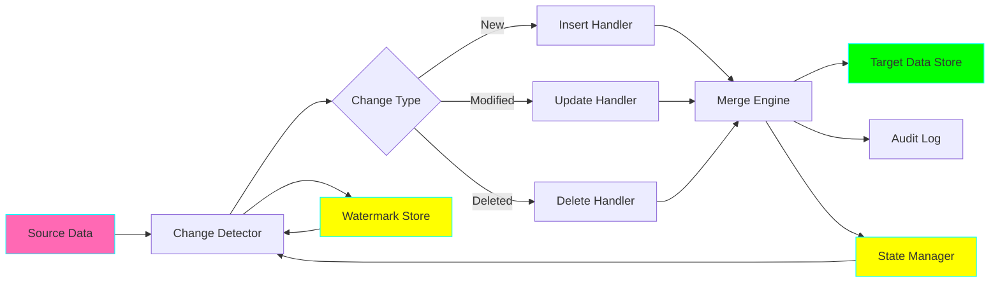
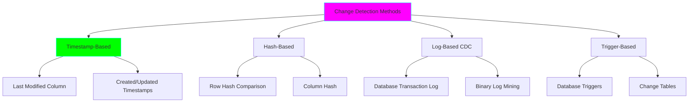

# Project 03: Incremental ETL Pattern

**Complexity:** ⭐⭐⭐☆☆ | **Time:** 6-8 hours | **Tier:** Foundation

## Overview

Build an incremental ETL (Extract, Transform, Load) pipeline that processes only changed data rather than full refreshes. This project teaches change data capture (CDC) concepts, watermarking strategies, and idempotent processing patterns crucial for efficient data pipelines.

## Learning Objectives

After completing this project, you will understand:

- ✅ Incremental vs full refresh strategies
- ✅ Change data capture (CDC) concepts
- ✅ Watermarking and checkpointing
- ✅ Hash-based change detection
- ✅ Merge/upsert operations
- ✅ Late-arriving data handling
- ✅ Idempotent processing patterns

## Architecture



## Key Concepts

### Incremental vs Full Refresh

**Full Refresh (Naive Approach):**
```python
# Full refresh - process everything
def full_refresh():
    data = extract_all_data()      # Read entire source
    transformed = transform(data)   # Process everything
    load(transformed, mode='overwrite')  # Replace target
```

**Problems:**
- ❌ Processes unchanged data repeatedly
- ❌ High resource consumption
- ❌ Long processing times
- ❌ Expensive for large datasets

**Incremental (Efficient Approach):**
```python
# Incremental - process only changes
def incremental_load():
    last_watermark = get_last_watermark()
    changes = extract_changes_since(last_watermark)  # Only new/changed
    transformed = transform(changes)
    load(transformed, mode='merge')  # Update only changed records
    update_watermark(new_watermark)
```

**Benefits:**
- ✅ Processes only deltas
- ✅ Lower resource usage
- ✅ Faster execution
- ✅ Cost-effective

### Change Detection Strategies



| Strategy | Pros | Cons | Use Case |
|----------|------|------|----------|
| **Timestamp** | Simple, fast | Requires timestamp columns | Most common |
| **Hash** | Detects any change | CPU intensive | No timestamps available |
| **Log-based** | Real-time, accurate | Complex setup | Critical data |
| **Trigger-based** | Captures all changes | Performance impact | Audit requirements |

### Watermarking

**Definition:** A watermark is a checkpoint that tracks the last successfully processed record.

```python
# Watermark example
watermark = {
    "table": "users",
    "column": "updated_at",
    "last_value": "2024-11-09 10:30:00",
    "last_processed_id": 12345,
    "timestamp": "2024-11-09 11:00:00"
}
```

### Merge/Upsert Operations

**SQL Merge Pattern:**
```sql
MERGE INTO target t
USING source s
ON t.id = s.id
WHEN MATCHED THEN
    UPDATE SET t.value = s.value, t.updated_at = s.updated_at
WHEN NOT MATCHED THEN
    INSERT (id, value, updated_at) VALUES (s.id, s.value, s.updated_at)
WHEN NOT MATCHED BY SOURCE THEN
    DELETE;  -- Optional: handle deletes
```

## Implementation Guide

### Step 1: Watermark Management

```python
import json
from pathlib import Path
from datetime import datetime
from typing import Optional, Dict, Any
import pandas as pd

class WatermarkManager:
    """Manage watermarks for incremental processing."""

    def __init__(self, state_file: str = "./watermarks.json"):
        self.state_file = Path(state_file)
        self.watermarks: Dict[str, Dict[str, Any]] = self._load_state()

    def _load_state(self) -> Dict:
        """Load watermarks from state file."""
        if self.state_file.exists():
            with open(self.state_file, 'r') as f:
                return json.load(f)
        return {}

    def _save_state(self):
        """Persist watermarks to state file."""
        self.state_file.parent.mkdir(parents=True, exist_ok=True)
        with open(self.state_file, 'w') as f:
            json.dump(self.watermarks, f, indent=2, default=str)

    def get_watermark(
        self,
        table_name: str,
        column_name: str = "updated_at"
    ) -> Optional[Any]:
        """
        Get last watermark for a table.

        Args:
            table_name: Name of the table
            column_name: Name of the watermark column

        Returns:
            Last watermark value or None if not found
        """
        key = f"{table_name}:{column_name}"
        if key in self.watermarks:
            return self.watermarks[key]["value"]
        return None

    def set_watermark(
        self,
        table_name: str,
        column_name: str,
        value: Any,
        metadata: Optional[Dict] = None
    ):
        """
        Update watermark for a table.

        Args:
            table_name: Name of the table
            column_name: Name of the watermark column
            value: New watermark value
            metadata: Additional metadata to store
        """
        key = f"{table_name}:{column_name}"
        self.watermarks[key] = {
            "value": value,
            "updated_at": datetime.now().isoformat(),
            "metadata": metadata or {}
        }
        self._save_state()

    def get_metadata(self, table_name: str, column_name: str = "updated_at") -> Dict:
        """Get metadata for a watermark."""
        key = f"{table_name}:{column_name}"
        if key in self.watermarks:
            return self.watermarks[key].get("metadata", {})
        return {}
```

### Step 2: Timestamp-Based Change Detection

```python
from sqlalchemy import create_engine, text
from typing import Tuple
import logging

class TimestampBasedExtractor:
    """Extract data using timestamp-based incremental logic."""

    def __init__(self, connection_string: str):
        self.engine = create_engine(connection_string)
        self.logger = logging.getLogger(__name__)

    def extract_incremental(
        self,
        table_name: str,
        timestamp_column: str,
        last_watermark: Optional[datetime] = None,
        batch_size: int = 10000
    ) -> pd.DataFrame:
        """
        Extract records modified since last watermark.

        Args:
            table_name: Source table name
            timestamp_column: Column to use for incremental logic
            last_watermark: Last processed timestamp
            batch_size: Number of records per batch

        Returns:
            DataFrame with incremental data
        """
        # Build query
        if last_watermark:
            query = f"""
                SELECT *
                FROM {table_name}
                WHERE {timestamp_column} > :watermark
                ORDER BY {timestamp_column}
                LIMIT :batch_size
            """
            params = {"watermark": last_watermark, "batch_size": batch_size}
        else:
            # First run - get all data or use initial date
            query = f"""
                SELECT *
                FROM {table_name}
                ORDER BY {timestamp_column}
                LIMIT :batch_size
            """
            params = {"batch_size": batch_size}

        self.logger.info(f"Extracting from {table_name} since {last_watermark}")

        # Execute and return
        with self.engine.connect() as conn:
            df = pd.read_sql(text(query), conn, params=params)

        self.logger.info(f"Extracted {len(df)} records")
        return df

    def get_max_timestamp(
        self,
        df: pd.DataFrame,
        timestamp_column: str
    ) -> Optional[datetime]:
        """Get maximum timestamp from DataFrame."""
        if len(df) == 0:
            return None
        return df[timestamp_column].max()
```

### Step 3: Hash-Based Change Detection

```python
import hashlib
from typing import Set

class HashBasedChangeDetector:
    """Detect changes using hash comparison."""

    def __init__(self):
        self.logger = logging.getLogger(__name__)

    def calculate_row_hash(
        self,
        row: pd.Series,
        columns: Optional[list] = None
    ) -> str:
        """
        Calculate hash for a row.

        Args:
            row: Pandas Series representing a row
            columns: Specific columns to hash (None = all columns)

        Returns:
            MD5 hash string
        """
        if columns:
            values = row[columns]
        else:
            values = row

        # Convert to string and hash
        row_string = '|'.join(str(v) for v in values.values)
        return hashlib.md5(row_string.encode()).hexdigest()

    def add_hash_column(
        self,
        df: pd.DataFrame,
        columns: Optional[list] = None,
        hash_column: str = "row_hash"
    ) -> pd.DataFrame:
        """
        Add hash column to DataFrame.

        Args:
            df: Input DataFrame
            columns: Columns to include in hash
            hash_column: Name of hash column to create

        Returns:
            DataFrame with hash column added
        """
        df = df.copy()
        df[hash_column] = df.apply(
            lambda row: self.calculate_row_hash(row, columns),
            axis=1
        )
        return df

    def detect_changes(
        self,
        source_df: pd.DataFrame,
        target_df: pd.DataFrame,
        key_columns: list,
        hash_column: str = "row_hash"
    ) -> Tuple[pd.DataFrame, pd.DataFrame, pd.DataFrame]:
        """
        Detect inserts, updates, and deletes using hash comparison.

        Args:
            source_df: New data from source
            target_df: Existing data in target
            key_columns: Columns that uniquely identify a row
            hash_column: Name of hash column

        Returns:
            (inserts, updates, deletes) as DataFrames
        """
        # Ensure both have hash columns
        if hash_column not in source_df.columns:
            source_df = self.add_hash_column(source_df, hash_column=hash_column)
        if hash_column not in target_df.columns:
            target_df = self.add_hash_column(target_df, hash_column=hash_column)

        # Create key for joining
        source_df['_key'] = source_df[key_columns].astype(str).agg('|'.join, axis=1)
        target_df['_key'] = target_df[key_columns].astype(str).agg('|'.join, axis=1)

        # Find inserts (in source but not in target)
        source_keys = set(source_df['_key'])
        target_keys = set(target_df['_key'])
        insert_keys = source_keys - target_keys
        inserts = source_df[source_df['_key'].isin(insert_keys)].drop('_key', axis=1)

        # Find potential updates (in both source and target)
        common_keys = source_keys & target_keys
        source_common = source_df[source_df['_key'].isin(common_keys)]
        target_common = target_df[target_df['_key'].isin(common_keys)]

        # Compare hashes to find actual updates
        merged = source_common.merge(
            target_common[['_key', hash_column]],
            on='_key',
            suffixes=('_source', '_target')
        )
        updates = merged[
            merged[f'{hash_column}_source'] != merged[f'{hash_column}_target']
        ].drop(['_key', f'{hash_column}_target'], axis=1)
        updates = updates.rename(columns={f'{hash_column}_source': hash_column})

        # Find deletes (in target but not in source)
        delete_keys = target_keys - source_keys
        deletes = target_df[target_df['_key'].isin(delete_keys)].drop('_key', axis=1)

        self.logger.info(
            f"Changes detected - Inserts: {len(inserts)}, "
            f"Updates: {len(updates)}, Deletes: {len(deletes)}"
        )

        return inserts, updates, deletes
```

### Step 4: Merge/Upsert Engine

```python
class MergeEngine:
    """Handle merge/upsert operations."""

    def __init__(self, connection_string: str):
        self.engine = create_engine(connection_string)
        self.logger = logging.getLogger(__name__)

    def merge(
        self,
        df: pd.DataFrame,
        table_name: str,
        key_columns: list,
        method: str = "upsert"
    ):
        """
        Merge data into target table.

        Args:
            df: DataFrame with data to merge
            table_name: Target table name
            key_columns: Columns that uniquely identify rows
            method: 'upsert', 'insert_only', or 'update_only'
        """
        if len(df) == 0:
            self.logger.info("No data to merge")
            return

        if method == "upsert":
            self._upsert(df, table_name, key_columns)
        elif method == "insert_only":
            self._insert(df, table_name)
        elif method == "update_only":
            self._update(df, table_name, key_columns)
        else:
            raise ValueError(f"Unknown merge method: {method}")

    def _upsert(self, df: pd.DataFrame, table_name: str, key_columns: list):
        """Perform upsert (insert or update)."""
        from sqlalchemy.dialects.postgresql import insert

        with self.engine.begin() as conn:
            for _, row in df.iterrows():
                # Build insert statement with ON CONFLICT UPDATE
                stmt = insert(table_name).values(**row.to_dict())

                # Define update dict (all columns except keys)
                update_dict = {
                    col: row[col]
                    for col in df.columns
                    if col not in key_columns
                }

                # Add ON CONFLICT clause
                stmt = stmt.on_conflict_do_update(
                    index_elements=key_columns,
                    set_=update_dict
                )

                conn.execute(stmt)

        self.logger.info(f"Upserted {len(df)} rows into {table_name}")

    def _insert(self, df: pd.DataFrame, table_name: str):
        """Insert new records only."""
        df.to_sql(
            table_name,
            self.engine,
            if_exists='append',
            index=False,
            method='multi'
        )
        self.logger.info(f"Inserted {len(df)} rows into {table_name}")

    def _update(self, df: pd.DataFrame, table_name: str, key_columns: list):
        """Update existing records only."""
        with self.engine.begin() as conn:
            for _, row in df.iterrows():
                # Build WHERE clause from key columns
                where_clause = " AND ".join(
                    f"{col} = :{col}" for col in key_columns
                )

                # Build SET clause from non-key columns
                set_clause = ", ".join(
                    f"{col} = :{col}"
                    for col in df.columns
                    if col not in key_columns
                )

                query = f"""
                    UPDATE {table_name}
                    SET {set_clause}
                    WHERE {where_clause}
                """

                conn.execute(text(query), row.to_dict())

        self.logger.info(f"Updated {len(df)} rows in {table_name}")

    def soft_delete(
        self,
        df: pd.DataFrame,
        table_name: str,
        key_columns: list,
        delete_flag_column: str = "is_deleted"
    ):
        """
        Soft delete records by setting a flag.

        Args:
            df: DataFrame with records to delete
            table_name: Target table
            key_columns: Key columns
            delete_flag_column: Column to use for soft delete flag
        """
        with self.engine.begin() as conn:
            for _, row in df.iterrows():
                where_clause = " AND ".join(
                    f"{col} = :{col}" for col in key_columns
                )

                query = f"""
                    UPDATE {table_name}
                    SET {delete_flag_column} = TRUE,
                        deleted_at = NOW()
                    WHERE {where_clause}
                """

                conn.execute(text(query), row[key_columns].to_dict())

        self.logger.info(f"Soft deleted {len(df)} rows in {table_name}")
```

### Step 5: Complete Incremental ETL Pipeline

```python
from dataclasses import dataclass
from typing import Optional

@dataclass
class ETLMetrics:
    """ETL execution metrics."""
    extracted_count: int
    inserted_count: int
    updated_count: int
    deleted_count: int
    execution_time_seconds: float
    new_watermark: Optional[Any]

class IncrementalETLPipeline:
    """Orchestrate complete incremental ETL workflow."""

    def __init__(
        self,
        source_connection: str,
        target_connection: str,
        watermark_file: str = "./watermarks.json"
    ):
        self.watermark_manager = WatermarkManager(watermark_file)
        self.extractor = TimestampBasedExtractor(source_connection)
        self.change_detector = HashBasedChangeDetector()
        self.merge_engine = MergeEngine(target_connection)
        self.logger = logging.getLogger(__name__)

    def run_timestamp_based(
        self,
        source_table: str,
        target_table: str,
        timestamp_column: str,
        key_columns: list,
        batch_size: int = 10000
    ) -> ETLMetrics:
        """
        Run incremental ETL using timestamp-based detection.

        Args:
            source_table: Source table name
            target_table: Target table name
            timestamp_column: Column to use for incremental logic
            key_columns: Unique key columns
            batch_size: Batch size for extraction

        Returns:
            ETL execution metrics
        """
        import time
        start_time = time.time()

        # Get last watermark
        last_watermark = self.watermark_manager.get_watermark(
            source_table, timestamp_column
        )

        self.logger.info(f"Starting incremental ETL for {source_table}")
        self.logger.info(f"Last watermark: {last_watermark}")

        # Extract incremental data
        df = self.extractor.extract_incremental(
            source_table,
            timestamp_column,
            last_watermark,
            batch_size
        )

        if len(df) == 0:
            self.logger.info("No new data to process")
            return ETLMetrics(0, 0, 0, 0, time.time() - start_time, last_watermark)

        # Transform (add your transformations here)
        transformed_df = self._transform(df)

        # Load using merge
        self.merge_engine.merge(
            transformed_df,
            target_table,
            key_columns,
            method="upsert"
        )

        # Update watermark
        new_watermark = self.extractor.get_max_timestamp(df, timestamp_column)
        self.watermark_manager.set_watermark(
            source_table,
            timestamp_column,
            new_watermark,
            metadata={
                "records_processed": len(df),
                "execution_time": time.time() - start_time
            }
        )

        return ETLMetrics(
            extracted_count=len(df),
            inserted_count=0,  # Merge combines inserts/updates
            updated_count=0,
            deleted_count=0,
            execution_time_seconds=time.time() - start_time,
            new_watermark=new_watermark
        )

    def run_hash_based(
        self,
        source_df: pd.DataFrame,
        target_df: pd.DataFrame,
        target_table: str,
        key_columns: list
    ) -> ETLMetrics:
        """
        Run incremental ETL using hash-based detection.

        Args:
            source_df: Current source data
            target_df: Existing target data
            target_table: Target table name
            key_columns: Unique key columns

        Returns:
            ETL execution metrics
        """
        import time
        start_time = time.time()

        # Detect changes
        inserts, updates, deletes = self.change_detector.detect_changes(
            source_df, target_df, key_columns
        )

        # Apply changes
        if len(inserts) > 0:
            self.merge_engine.merge(inserts, target_table, key_columns, "insert_only")

        if len(updates) > 0:
            self.merge_engine.merge(updates, target_table, key_columns, "update_only")

        if len(deletes) > 0:
            self.merge_engine.soft_delete(deletes, target_table, key_columns)

        return ETLMetrics(
            extracted_count=len(source_df),
            inserted_count=len(inserts),
            updated_count=len(updates),
            deleted_count=len(deletes),
            execution_time_seconds=time.time() - start_time,
            new_watermark=None
        )

    def _transform(self, df: pd.DataFrame) -> pd.DataFrame:
        """
        Apply transformations to data.
        Override this method with custom transformations.
        """
        # Example transformations
        df = df.copy()

        # Add audit columns
        df['etl_inserted_at'] = datetime.now()
        df['etl_updated_at'] = datetime.now()

        return df
```

## Nuanced Scenarios

### 1. Late-Arriving Data Handling

**Challenge:** Handle records that arrive out of order or delayed.

```python
class LateArrivalHandler:
    """Handle late-arriving data in incremental processing."""

    def __init__(self, grace_period_hours: int = 24):
        self.grace_period_hours = grace_period_hours

    def process_with_grace_period(
        self,
        df: pd.DataFrame,
        timestamp_column: str,
        watermark: datetime,
        current_time: datetime
    ) -> Tuple[pd.DataFrame, pd.DataFrame]:
        """
        Separate timely vs late-arriving records.

        Args:
            df: Input DataFrame
            timestamp_column: Timestamp column name
            watermark: Last watermark
            current_time: Current processing time

        Returns:
            (timely_records, late_records)
        """
        grace_cutoff = current_time - pd.Timedelta(hours=self.grace_period_hours)

        # Records within grace period
        timely = df[df[timestamp_column] >= grace_cutoff]

        # Late arrivals (before grace period but after watermark)
        late = df[
            (df[timestamp_column] < grace_cutoff) &
            (df[timestamp_column] > watermark)
        ]

        return timely, late

    def handle_late_arrivals(
        self,
        late_df: pd.DataFrame,
        target_table: str,
        key_columns: list,
        merge_engine: MergeEngine
    ):
        """Process late-arriving records."""
        if len(late_df) == 0:
            return

        # Late arrivals should upsert to handle potential duplicates
        merge_engine.merge(
            late_df,
            target_table,
            key_columns,
            method="upsert"
        )
```

### 2. Backfill Strategies

**Challenge:** Reprocess historical data without breaking incremental logic.

```python
class BackfillManager:
    """Manage backfill operations."""

    def __init__(self, pipeline: IncrementalETLPipeline):
        self.pipeline = pipeline
        self.logger = logging.getLogger(__name__)

    def backfill_date_range(
        self,
        source_table: str,
        target_table: str,
        timestamp_column: str,
        key_columns: list,
        start_date: datetime,
        end_date: datetime,
        chunk_days: int = 7
    ):
        """
        Backfill data for a date range in chunks.

        Args:
            source_table: Source table
            target_table: Target table
            timestamp_column: Timestamp column
            key_columns: Key columns
            start_date: Start of backfill range
            end_date: End of backfill range
            chunk_days: Days per chunk
        """
        current_date = start_date

        while current_date < end_date:
            chunk_end = min(current_date + pd.Timedelta(days=chunk_days), end_date)

            self.logger.info(f"Backfilling {current_date} to {chunk_end}")

            # Temporarily override watermark for this chunk
            original_watermark = self.pipeline.watermark_manager.get_watermark(
                source_table, timestamp_column
            )

            # Set watermark to chunk start
            self.pipeline.watermark_manager.set_watermark(
                source_table, timestamp_column, current_date
            )

            # Process chunk
            self.pipeline.run_timestamp_based(
                source_table,
                target_table,
                timestamp_column,
                key_columns
            )

            current_date = chunk_end

        # Restore original watermark
        if original_watermark:
            self.pipeline.watermark_manager.set_watermark(
                source_table, timestamp_column, original_watermark
            )
```

### 3. Deleted Record Detection

**Challenge:** Detect and handle deleted records from source.

```python
class DeleteDetector:
    """Detect deleted records."""

    def detect_deletes_by_comparison(
        self,
        source_df: pd.DataFrame,
        target_df: pd.DataFrame,
        key_columns: list
    ) -> pd.DataFrame:
        """
        Detect deletes by comparing source and target keys.

        Args:
            source_df: Current source data
            target_df: Existing target data
            key_columns: Key columns

        Returns:
            DataFrame of deleted records
        """
        # Get keys from both datasets
        source_df['_key'] = source_df[key_columns].astype(str).agg('|'.join, axis=1)
        target_df['_key'] = target_df[key_columns].astype(str).agg('|'.join, axis=1)

        source_keys = set(source_df['_key'])
        target_keys = set(target_df['_key'])

        # Keys in target but not in source = deleted
        deleted_keys = target_keys - source_keys

        return target_df[target_df['_key'].isin(deleted_keys)].drop('_key', axis=1)

    def detect_deletes_by_flag(
        self,
        df: pd.DataFrame,
        delete_flag_column: str = "is_deleted"
    ) -> pd.DataFrame:
        """
        Detect deletes using a delete flag column.

        Args:
            df: Source DataFrame with delete flag
            delete_flag_column: Name of delete flag column

        Returns:
            DataFrame of deleted records
        """
        if delete_flag_column not in df.columns:
            return pd.DataFrame()

        return df[df[delete_flag_column] == True]
```

### 4. Idempotent Processing

**Challenge:** Ensure pipeline can run multiple times without creating duplicates.

```python
class IdempotentProcessor:
    """Ensure idempotent ETL processing."""

    def __init__(self, state_file: str = "./processing_state.json"):
        self.state_file = Path(state_file)
        self.state = self._load_state()

    def _load_state(self) -> Dict:
        """Load processing state."""
        if self.state_file.exists():
            with open(self.state_file, 'r') as f:
                return json.load(f)
        return {}

    def _save_state(self):
        """Save processing state."""
        with open(self.state_file, 'w') as f:
            json.dump(self.state, f, indent=2, default=str)

    def is_batch_processed(self, batch_id: str) -> bool:
        """Check if batch was already processed."""
        return batch_id in self.state

    def mark_batch_processed(
        self,
        batch_id: str,
        metadata: Optional[Dict] = None
    ):
        """Mark batch as processed."""
        self.state[batch_id] = {
            "processed_at": datetime.now().isoformat(),
            "metadata": metadata or {}
        }
        self._save_state()

    def process_batch_idempotently(
        self,
        batch_id: str,
        process_fn: Callable,
        *args,
        **kwargs
    ):
        """
        Process batch only if not already processed.

        Args:
            batch_id: Unique batch identifier
            process_fn: Function to process batch
            *args, **kwargs: Arguments to pass to process_fn
        """
        if self.is_batch_processed(batch_id):
            self.logger.info(f"Batch {batch_id} already processed, skipping")
            return

        # Process batch
        result = process_fn(*args, **kwargs)

        # Mark as processed
        self.mark_batch_processed(batch_id, {"result": str(result)})

        return result
```

## Exercises

### Exercise 1: Basic Incremental Load
Implement a timestamp-based incremental load for a users table:
- Extract records modified since last run
- Track watermarks persistently
- Handle first run (no watermark)

### Exercise 2: Hash-Based Detection
Build a hash-based change detector that:
- Compares source and target data
- Identifies inserts, updates, and deletes
- Handles 100k+ records efficiently

### Exercise 3: Late Arrival Handling
Design a system to handle late-arriving data:
- Define grace period
- Separate timely vs late records
- Reprocess late arrivals correctly

### Exercise 4: Full Backfill
Implement a backfill strategy:
- Reprocess 1 year of historical data
- Chunk processing to avoid memory issues
- Don't break ongoing incremental loads

## Success Criteria

- [ ] Implement timestamp-based CDC successfully
- [ ] Implement hash-based change detection
- [ ] Handle late arrivals correctly
- [ ] Process only changed records (not full refresh)
- [ ] Support merge/upsert operations
- [ ] Maintain watermarks persistently
- [ ] Enable backfill without breaking incremental logic
- [ ] Ensure idempotent processing
- [ ] Handle deleted records appropriately
- [ ] Process 1M+ records efficiently

## Testing Checklist

```python
# tests/test_incremental_etl.py

def test_watermark_persistence():
    """Test watermark save and load."""
    pass

def test_timestamp_extraction():
    """Test timestamp-based incremental extraction."""
    pass

def test_hash_change_detection():
    """Test hash-based change detection."""
    pass

def test_merge_upsert():
    """Test merge/upsert operations."""
    pass

def test_late_arrival_handling():
    """Test late-arriving data processing."""
    pass

def test_backfill():
    """Test backfill operations."""
    pass

def test_delete_detection():
    """Test deleted record detection."""
    pass

def test_idempotency():
    """Test idempotent processing."""
    pass

def test_first_run():
    """Test behavior when no watermark exists."""
    pass

def test_performance_large_dataset():
    """Test performance with 1M+ records."""
    pass
```

## Common Pitfalls

1. **No Watermark Management:** Reprocessing all data every time
2. **Ignoring Late Arrivals:** Missing out-of-order data
3. **Not Handling Deletes:** Deleted records remain in target
4. **No Idempotency:** Duplicates on reruns
5. **Poor Batching:** Memory issues with large datasets
6. **Hardcoded Timestamps:** Difficult to backfill
7. **No State Recovery:** Can't resume after failures

## Next Steps

After completing this project:
1. Move to **Project 04: Database Connection Pool Manager**
2. Combine with Project 02 for validated incremental loads
3. Apply to Project 01 for incremental Parquet updates
4. Use in Project 05 for SCD implementation

## References

- [Change Data Capture Patterns](https://www.confluent.io/blog/change-data-capture-with-kafka-connect/)
- [Incremental Data Processing](https://docs.databricks.com/delta/delta-batch.html)
- [Watermarking Strategies](https://beam.apache.org/documentation/programming-guide/#watermarks)
- [Merge/Upsert Patterns](https://www.postgresql.org/docs/current/sql-insert.html)
- [Idempotent Data Pipelines](https://medium.com/data-engineering/idempotent-data-pipelines-7e5b8b8e6f8e)

---

**Happy Building! 🚀**
