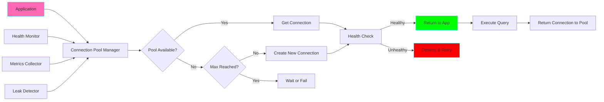
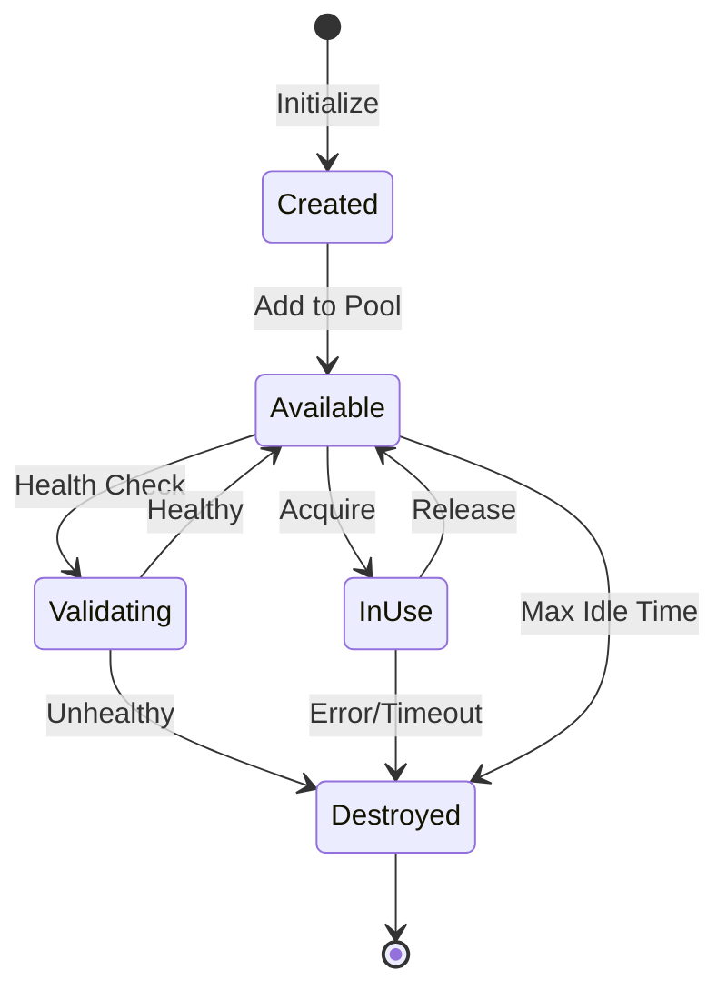

# Project 04: Database Connection Pool Manager

**Complexity:** ⭐⭐☆☆☆ | **Time:** 4-5 hours | **Tier:** Foundation

## Overview

Build an efficient database connection pool manager that handles connection lifecycle, health checks, retry logic, and supports multiple database types. This project teaches resource management, thread safety, and best practices for database connectivity in production systems.

## Learning Objectives

After completing this project, you will understand:

- ✅ Connection pooling theory and benefits
- ✅ Database connection lifecycle management
- ✅ Thread safety in concurrent environments
- ✅ Connection health checks and validation
- ✅ Retry logic and circuit breaker patterns
- ✅ Resource cleanup and leak detection
- ✅ Multi-database routing strategies

## Architecture



## Key Concepts

### Why Connection Pooling?

**Without Pooling (Inefficient):**
```python
# Every query creates a new connection
for query in queries:
    conn = create_connection()  # Expensive: ~100ms
    result = conn.execute(query)
    conn.close()
```

**Problems:**
- ❌ High overhead (connection establishment is slow)
- ❌ Resource exhaustion (too many connections)
- ❌ Poor performance under load

**With Pooling (Efficient):**
```python
# Reuse existing connections
pool = ConnectionPool(max_size=10)
for query in queries:
    with pool.get_connection() as conn:  # Fast: ~1ms
        result = conn.execute(query)
    # Connection returned to pool automatically
```

**Benefits:**
- ✅ Fast connection reuse
- ✅ Controlled resource usage
- ✅ Better performance
- ✅ Automatic lifecycle management

### Connection Lifecycle



### Pool Configuration Parameters

| Parameter | Description | Typical Value | Impact |
|-----------|-------------|---------------|--------|
| **min_size** | Minimum connections | 2-5 | Startup cost vs availability |
| **max_size** | Maximum connections | 10-50 | Resource limit vs concurrency |
| **timeout** | Wait timeout (seconds) | 30 | Responsiveness vs failure rate |
| **max_idle_time** | Idle connection lifetime | 600 | Resource cleanup vs overhead |
| **validation_interval** | Health check frequency | 30 | Reliability vs overhead |
| **max_retries** | Connection retry attempts | 3 | Resilience vs latency |

### Thread Safety

```python
# Thread-safe pool operations
import threading

class ThreadSafePool:
    def __init__(self):
        self._lock = threading.Lock()
        self._connections = []

    def acquire(self):
        with self._lock:  # Ensure thread-safe access
            if self._connections:
                return self._connections.pop()
            return self._create_new()

    def release(self, conn):
        with self._lock:
            self._connections.append(conn)
```

## Implementation Guide

### Step 1: Basic Connection Pool

```python
from contextlib import contextmanager
from typing import Optional, Dict, Any, List
from dataclasses import dataclass
from datetime import datetime, timedelta
import threading
import time
import logging
from queue import Queue, Empty, Full
from sqlalchemy import create_engine, text
from sqlalchemy.pool import QueuePool, NullPool

@dataclass
class PoolConfig:
    """Connection pool configuration."""
    min_size: int = 2
    max_size: int = 10
    timeout: float = 30.0
    max_idle_time: float = 600.0
    validation_interval: float = 30.0
    max_retries: int = 3
    retry_delay: float = 1.0

@dataclass
class PoolMetrics:
    """Pool usage metrics."""
    total_connections: int = 0
    active_connections: int = 0
    idle_connections: int = 0
    wait_count: int = 0
    error_count: int = 0
    created_count: int = 0
    destroyed_count: int = 0
    avg_wait_time: float = 0.0

class ConnectionWrapper:
    """Wrapper for database connection with metadata."""

    def __init__(self, connection, pool_config: PoolConfig):
        self.connection = connection
        self.created_at = datetime.now()
        self.last_used = datetime.now()
        self.use_count = 0
        self.is_healthy = True
        self.pool_config = pool_config

    def mark_used(self):
        """Mark connection as recently used."""
        self.last_used = datetime.now()
        self.use_count += 1

    def is_idle_too_long(self) -> bool:
        """Check if connection has been idle too long."""
        idle_time = (datetime.now() - self.last_used).total_seconds()
        return idle_time > self.pool_config.max_idle_time

    def needs_validation(self) -> bool:
        """Check if connection needs health validation."""
        time_since_last_use = (datetime.now() - self.last_used).total_seconds()
        return time_since_last_use > self.pool_config.validation_interval


class ConnectionPool:
    """Thread-safe database connection pool."""

    def __init__(
        self,
        connection_string: str,
        config: Optional[PoolConfig] = None
    ):
        self.connection_string = connection_string
        self.config = config or PoolConfig()
        self.logger = logging.getLogger(__name__)

        # Thread-safe queue for available connections
        self._pool: Queue[ConnectionWrapper] = Queue(maxsize=self.config.max_size)

        # Track all connections (available + in-use)
        self._all_connections: List[ConnectionWrapper] = []
        self._lock = threading.RLock()

        # Metrics
        self.metrics = PoolMetrics()

        # Initialize minimum connections
        self._initialize_pool()

    def _initialize_pool(self):
        """Create minimum number of connections."""
        self.logger.info(f"Initializing pool with {self.config.min_size} connections")
        for _ in range(self.config.min_size):
            conn_wrapper = self._create_connection()
            if conn_wrapper:
                self._pool.put(conn_wrapper)

    def _create_connection(self) -> Optional[ConnectionWrapper]:
        """Create a new database connection."""
        try:
            engine = create_engine(
                self.connection_string,
                poolclass=NullPool  # We manage our own pool
            )
            connection = engine.connect()

            conn_wrapper = ConnectionWrapper(connection, self.config)

            with self._lock:
                self._all_connections.append(conn_wrapper)
                self.metrics.created_count += 1
                self.metrics.total_connections += 1

            self.logger.info(f"Created new connection (total: {self.metrics.total_connections})")
            return conn_wrapper

        except Exception as e:
            self.logger.error(f"Failed to create connection: {e}")
            self.metrics.error_count += 1
            return None

    def _validate_connection(self, conn_wrapper: ConnectionWrapper) -> bool:
        """Validate connection health."""
        try:
            # Simple validation query
            conn_wrapper.connection.execute(text("SELECT 1"))
            conn_wrapper.is_healthy = True
            return True
        except Exception as e:
            self.logger.warning(f"Connection validation failed: {e}")
            conn_wrapper.is_healthy = False
            return False

    def acquire(self, timeout: Optional[float] = None) -> ConnectionWrapper:
        """
        Acquire a connection from the pool.

        Args:
            timeout: Maximum time to wait for connection (None = use config default)

        Returns:
            ConnectionWrapper

        Raises:
            TimeoutError: If connection not available within timeout
        """
        timeout = timeout or self.config.timeout
        start_time = time.time()

        for attempt in range(self.config.max_retries):
            try:
                # Try to get connection from pool
                conn_wrapper = self._pool.get(timeout=timeout)

                # Validate if needed
                if conn_wrapper.needs_validation():
                    if not self._validate_connection(conn_wrapper):
                        self._destroy_connection(conn_wrapper)
                        continue  # Retry

                # Check if idle too long
                if conn_wrapper.is_idle_too_long():
                    self._destroy_connection(conn_wrapper)
                    continue  # Retry

                # Connection is good
                conn_wrapper.mark_used()

                with self._lock:
                    self.metrics.active_connections += 1
                    self.metrics.idle_connections = self._pool.qsize()

                wait_time = time.time() - start_time
                self._update_avg_wait_time(wait_time)

                return conn_wrapper

            except Empty:
                # Pool is empty, try to create new connection
                with self._lock:
                    if self.metrics.total_connections < self.config.max_size:
                        conn_wrapper = self._create_connection()
                        if conn_wrapper:
                            conn_wrapper.mark_used()
                            self.metrics.active_connections += 1
                            return conn_wrapper

                # Can't create new, wait and retry
                if attempt < self.config.max_retries - 1:
                    time.sleep(self.config.retry_delay)
                    self.metrics.wait_count += 1
                else:
                    raise TimeoutError(
                        f"Could not acquire connection within {timeout}s "
                        f"(pool size: {self.metrics.total_connections}/{self.config.max_size})"
                    )

    def release(self, conn_wrapper: ConnectionWrapper):
        """
        Return connection to pool.

        Args:
            conn_wrapper: Connection to release
        """
        if not conn_wrapper.is_healthy:
            self._destroy_connection(conn_wrapper)
            return

        try:
            # Rollback any uncommitted transactions
            if conn_wrapper.connection.in_transaction():
                conn_wrapper.connection.rollback()

            # Return to pool
            self._pool.put_nowait(conn_wrapper)

            with self._lock:
                self.metrics.active_connections -= 1
                self.metrics.idle_connections = self._pool.qsize()

        except Full:
            # Pool is full, destroy connection
            self._destroy_connection(conn_wrapper)

    def _destroy_connection(self, conn_wrapper: ConnectionWrapper):
        """Destroy a connection and remove from tracking."""
        try:
            conn_wrapper.connection.close()
        except Exception as e:
            self.logger.error(f"Error closing connection: {e}")

        with self._lock:
            if conn_wrapper in self._all_connections:
                self._all_connections.remove(conn_wrapper)
            self.metrics.total_connections -= 1
            self.metrics.destroyed_count += 1

        self.logger.info(f"Destroyed connection (remaining: {self.metrics.total_connections})")

    def _update_avg_wait_time(self, wait_time: float):
        """Update average wait time metric."""
        with self._lock:
            total_acquires = self.metrics.created_count + self.metrics.wait_count
            if total_acquires > 0:
                self.metrics.avg_wait_time = (
                    (self.metrics.avg_wait_time * (total_acquires - 1) + wait_time) /
                    total_acquires
                )

    @contextmanager
    def get_connection(self, timeout: Optional[float] = None):
        """
        Context manager for safe connection usage.

        Usage:
            with pool.get_connection() as conn:
                conn.execute("SELECT * FROM users")
        """
        conn_wrapper = self.acquire(timeout)
        try:
            yield conn_wrapper.connection
        finally:
            self.release(conn_wrapper)

    def close_all(self):
        """Close all connections and shut down pool."""
        self.logger.info("Closing all connections...")

        with self._lock:
            for conn_wrapper in list(self._all_connections):
                self._destroy_connection(conn_wrapper)

        self.logger.info("Pool closed")

    def get_metrics(self) -> PoolMetrics:
        """Get current pool metrics."""
        with self._lock:
            return PoolMetrics(
                total_connections=self.metrics.total_connections,
                active_connections=self.metrics.active_connections,
                idle_connections=self._pool.qsize(),
                wait_count=self.metrics.wait_count,
                error_count=self.metrics.error_count,
                created_count=self.metrics.created_count,
                destroyed_count=self.metrics.destroyed_count,
                avg_wait_time=self.metrics.avg_wait_time
            )
```

### Step 2: Multi-Database Router

```python
from enum import Enum
from typing import Dict

class DatabaseType(Enum):
    """Supported database types."""
    POSTGRESQL = "postgresql"
    MYSQL = "mysql"
    SQLITE = "sqlite"
    ORACLE = "oracle"

class MultiDatabasePoolManager:
    """Manage pools for multiple databases."""

    def __init__(self):
        self.pools: Dict[str, ConnectionPool] = {}
        self.logger = logging.getLogger(__name__)

    def register_pool(
        self,
        name: str,
        connection_string: str,
        config: Optional[PoolConfig] = None
    ):
        """
        Register a connection pool.

        Args:
            name: Pool identifier
            connection_string: Database connection string
            config: Pool configuration
        """
        if name in self.pools:
            raise ValueError(f"Pool '{name}' already registered")

        pool = ConnectionPool(connection_string, config)
        self.pools[name] = pool
        self.logger.info(f"Registered pool: {name}")

    def get_pool(self, name: str) -> ConnectionPool:
        """Get pool by name."""
        if name not in self.pools:
            raise ValueError(f"Pool '{name}' not found")
        return self.pools[name]

    @contextmanager
    def get_connection(self, pool_name: str, timeout: Optional[float] = None):
        """Get connection from named pool."""
        pool = self.get_pool(pool_name)
        with pool.get_connection(timeout) as conn:
            yield conn

    def close_all(self):
        """Close all pools."""
        for name, pool in self.pools.items():
            self.logger.info(f"Closing pool: {name}")
            pool.close_all()

    def get_all_metrics(self) -> Dict[str, PoolMetrics]:
        """Get metrics for all pools."""
        return {
            name: pool.get_metrics()
            for name, pool in self.pools.items()
        }
```

### Step 3: Read Replica Load Balancing

```python
import random
from typing import List

class ReadReplicaRouter:
    """Route read queries to replica databases."""

    def __init__(self, pool_manager: MultiDatabasePoolManager):
        self.pool_manager = pool_manager
        self.master_pool = "master"
        self.replica_pools: List[str] = []
        self.logger = logging.getLogger(__name__)

    def register_master(self, connection_string: str, config: Optional[PoolConfig] = None):
        """Register master database."""
        self.pool_manager.register_pool(self.master_pool, connection_string, config)

    def register_replica(
        self,
        name: str,
        connection_string: str,
        config: Optional[PoolConfig] = None
    ):
        """Register a read replica."""
        self.pool_manager.register_pool(name, connection_string, config)
        self.replica_pools.append(name)
        self.logger.info(f"Registered replica: {name}")

    @contextmanager
    def get_connection_for_write(self):
        """Get connection to master for writes."""
        with self.pool_manager.get_connection(self.master_pool) as conn:
            yield conn

    @contextmanager
    def get_connection_for_read(self, strategy: str = "round_robin"):
        """
        Get connection to replica for reads.

        Args:
            strategy: 'round_robin', 'random', or 'least_loaded'
        """
        if not self.replica_pools:
            # No replicas, use master
            pool_name = self.master_pool
        else:
            pool_name = self._select_replica(strategy)

        with self.pool_manager.get_connection(pool_name) as conn:
            yield conn

    def _select_replica(self, strategy: str) -> str:
        """Select replica based on strategy."""
        if strategy == "random":
            return random.choice(self.replica_pools)

        elif strategy == "round_robin":
            # Simple round-robin (not thread-safe for demo)
            if not hasattr(self, '_rr_index'):
                self._rr_index = 0
            pool_name = self.replica_pools[self._rr_index % len(self.replica_pools)]
            self._rr_index += 1
            return pool_name

        elif strategy == "least_loaded":
            # Choose replica with fewest active connections
            metrics = self.pool_manager.get_all_metrics()
            replica_metrics = {
                name: metrics[name]
                for name in self.replica_pools
            }
            return min(
                replica_metrics.items(),
                key=lambda x: x[1].active_connections
            )[0]

        else:
            raise ValueError(f"Unknown strategy: {strategy}")
```

### Step 4: Connection Leak Detection

```python
import traceback
from typing import Dict, Optional

class ConnectionLeakDetector:
    """Detect and report connection leaks."""

    def __init__(self, pool: ConnectionPool):
        self.pool = pool
        self.tracked_connections: Dict[int, Dict] = {}
        self.logger = logging.getLogger(__name__)

    def track_acquire(self, conn_wrapper: ConnectionWrapper) -> int:
        """Track when connection is acquired."""
        conn_id = id(conn_wrapper)
        self.tracked_connections[conn_id] = {
            "acquired_at": datetime.now(),
            "stack_trace": traceback.format_stack(),
            "wrapper": conn_wrapper
        }
        return conn_id

    def track_release(self, conn_wrapper: ConnectionWrapper):
        """Track when connection is released."""
        conn_id = id(conn_wrapper)
        if conn_id in self.tracked_connections:
            del self.tracked_connections[conn_id]

    def detect_leaks(self, threshold_seconds: float = 300) -> List[Dict]:
        """
        Detect connections held longer than threshold.

        Args:
            threshold_seconds: Max time connection should be held

        Returns:
            List of suspected leaks with details
        """
        now = datetime.now()
        leaks = []

        for conn_id, info in self.tracked_connections.items():
            held_time = (now - info["acquired_at"]).total_seconds()

            if held_time > threshold_seconds:
                leaks.append({
                    "conn_id": conn_id,
                    "held_seconds": held_time,
                    "acquired_at": info["acquired_at"],
                    "stack_trace": info["stack_trace"]
                })

        if leaks:
            self.logger.warning(f"Detected {len(leaks)} potential connection leaks")

        return leaks

    def report_leaks(self, leaks: List[Dict]):
        """Generate detailed leak report."""
        for leak in leaks:
            self.logger.error(
                f"Connection leak detected:\n"
                f"  Held for: {leak['held_seconds']:.1f}s\n"
                f"  Acquired at: {leak['acquired_at']}\n"
                f"  Stack trace:\n{''.join(leak['stack_trace'])}"
            )
```

### Step 5: Circuit Breaker Pattern

```python
from enum import Enum

class CircuitState(Enum):
    """Circuit breaker states."""
    CLOSED = "closed"      # Normal operation
    OPEN = "open"          # Failing, reject requests
    HALF_OPEN = "half_open"  # Testing if recovered

class CircuitBreaker:
    """Protect against cascading failures."""

    def __init__(
        self,
        failure_threshold: int = 5,
        recovery_timeout: float = 60.0,
        success_threshold: int = 2
    ):
        self.failure_threshold = failure_threshold
        self.recovery_timeout = recovery_timeout
        self.success_threshold = success_threshold

        self.state = CircuitState.CLOSED
        self.failure_count = 0
        self.success_count = 0
        self.last_failure_time: Optional[datetime] = None
        self.logger = logging.getLogger(__name__)

        self._lock = threading.Lock()

    def call(self, func, *args, **kwargs):
        """
        Execute function with circuit breaker protection.

        Args:
            func: Function to call
            *args, **kwargs: Arguments to pass to function

        Returns:
            Function result

        Raises:
            Exception: If circuit is open
        """
        with self._lock:
            if self.state == CircuitState.OPEN:
                if self._should_attempt_reset():
                    self.state = CircuitState.HALF_OPEN
                    self.logger.info("Circuit breaker entering HALF_OPEN state")
                else:
                    raise Exception("Circuit breaker is OPEN")

        try:
            result = func(*args, **kwargs)
            self._on_success()
            return result

        except Exception as e:
            self._on_failure()
            raise

    def _on_success(self):
        """Handle successful call."""
        with self._lock:
            self.failure_count = 0

            if self.state == CircuitState.HALF_OPEN:
                self.success_count += 1
                if self.success_count >= self.success_threshold:
                    self.state = CircuitState.CLOSED
                    self.success_count = 0
                    self.logger.info("Circuit breaker CLOSED")

    def _on_failure(self):
        """Handle failed call."""
        with self._lock:
            self.failure_count += 1
            self.last_failure_time = datetime.now()

            if self.state == CircuitState.HALF_OPEN:
                self.state = CircuitState.OPEN
                self.logger.warning("Circuit breaker OPEN (failure in HALF_OPEN)")

            elif self.failure_count >= self.failure_threshold:
                self.state = CircuitState.OPEN
                self.logger.warning(
                    f"Circuit breaker OPEN (failures: {self.failure_count})"
                )

    def _should_attempt_reset(self) -> bool:
        """Check if enough time has passed to try recovery."""
        if self.last_failure_time is None:
            return True

        elapsed = (datetime.now() - self.last_failure_time).total_seconds()
        return elapsed >= self.recovery_timeout
```

## Nuanced Scenarios

### 1. Dynamic Pool Sizing

**Challenge:** Adjust pool size based on load.

```python
class DynamicConnectionPool(ConnectionPool):
    """Connection pool with dynamic sizing."""

    def __init__(self, connection_string: str, config: Optional[PoolConfig] = None):
        super().__init__(connection_string, config)
        self.scale_up_threshold = 0.8  # 80% utilization
        self.scale_down_threshold = 0.2  # 20% utilization

    def _should_scale_up(self) -> bool:
        """Check if pool should grow."""
        utilization = self.metrics.active_connections / self.config.max_size
        return utilization > self.scale_up_threshold

    def _should_scale_down(self) -> bool:
        """Check if pool should shrink."""
        utilization = self.metrics.active_connections / self.config.max_size
        return utilization < self.scale_down_threshold

    def auto_scale(self):
        """Automatically adjust pool size."""
        with self._lock:
            if self._should_scale_up() and self.config.max_size < 50:
                self.config.max_size += 5
                self.logger.info(f"Scaled up pool to {self.config.max_size}")

            elif self._should_scale_down() and self.config.max_size > self.config.min_size:
                self.config.max_size -= 5
                self.logger.info(f"Scaled down pool to {self.config.max_size}")
```

### 2. Connection Warming

**Challenge:** Pre-warm connections to avoid cold starts.

```python
class ConnectionWarmer:
    """Pre-warm connections before peak usage."""

    def __init__(self, pool: ConnectionPool):
        self.pool = pool

    def warm_pool(self, target_size: int):
        """Create connections up to target size."""
        current_size = self.pool.metrics.total_connections

        for _ in range(target_size - current_size):
            conn_wrapper = self.pool._create_connection()
            if conn_wrapper:
                self.pool.release(conn_wrapper)
```

### 3. Query Timeout Management

**Challenge:** Enforce query timeouts to prevent long-running queries.

```python
import signal
from contextlib import contextmanager

class TimeoutError(Exception):
    pass

def timeout_handler(signum, frame):
    raise TimeoutError("Query timeout")

@contextmanager
def query_timeout(seconds):
    """Context manager for query timeout."""
    # Set timeout
    old_handler = signal.signal(signal.SIGALRM, timeout_handler)
    signal.alarm(seconds)

    try:
        yield
    finally:
        # Restore
        signal.alarm(0)
        signal.signal(signal.SIGALRM, old_handler)

# Usage
with pool.get_connection() as conn:
    with query_timeout(30):
        result = conn.execute("SELECT * FROM large_table")
```

### 4. Connection Retry with Exponential Backoff

**Challenge:** Retry failed connections with increasing delays.

```python
import time

class ExponentialBackoffRetry:
    """Retry with exponential backoff."""

    def __init__(
        self,
        max_retries: int = 5,
        base_delay: float = 1.0,
        max_delay: float = 60.0
    ):
        self.max_retries = max_retries
        self.base_delay = base_delay
        self.max_delay = max_delay

    def retry(self, func, *args, **kwargs):
        """Execute function with retry logic."""
        for attempt in range(self.max_retries):
            try:
                return func(*args, **kwargs)
            except Exception as e:
                if attempt == self.max_retries - 1:
                    raise

                delay = min(
                    self.base_delay * (2 ** attempt),
                    self.max_delay
                )

                # Add jitter
                jitter = random.uniform(0, delay * 0.1)
                time.sleep(delay + jitter)
```

## Exercises

### Exercise 1: Basic Pool Implementation
Implement a basic connection pool with:
- Min/max size configuration
- Connection reuse
- Thread-safe operations
- Basic health checks

### Exercise 2: Metrics Dashboard
Create a monitoring dashboard that shows:
- Active vs idle connections
- Connection wait times
- Error rates
- Pool utilization over time

### Exercise 3: Read Replica Routing
Build a system that:
- Routes writes to master
- Distributes reads across replicas
- Handles replica failures gracefully
- Implements load balancing strategies

### Exercise 4: Leak Detection
Implement connection leak detection:
- Track connection acquisition
- Detect long-held connections
- Generate leak reports
- Auto-cleanup leaked connections

## Success Criteria

- [ ] Implement thread-safe connection pool
- [ ] Support multiple database types
- [ ] Handle connection failures gracefully
- [ ] Implement health checks and validation
- [ ] Track and report pool metrics
- [ ] Detect connection leaks
- [ ] Support read replica routing
- [ ] Implement retry logic with backoff
- [ ] Handle concurrent access correctly
- [ ] Provide context manager API

## Testing Checklist

```python
# tests/test_connection_pool.py

def test_pool_initialization():
    """Test pool creates min connections."""
    pass

def test_connection_acquire_release():
    """Test basic acquire/release cycle."""
    pass

def test_max_pool_size():
    """Test pool doesn't exceed max size."""
    pass

def test_connection_timeout():
    """Test timeout when pool exhausted."""
    pass

def test_connection_validation():
    """Test health check functionality."""
    pass

def test_thread_safety():
    """Test concurrent access."""
    pass

def test_connection_reuse():
    """Test connections are reused."""
    pass

def test_leak_detection():
    """Test leak detection."""
    pass

def test_multi_database():
    """Test multiple database pools."""
    pass

def test_circuit_breaker():
    """Test circuit breaker pattern."""
    pass
```

## Common Pitfalls

1. **No Thread Safety:** Race conditions in concurrent access
2. **Connection Leaks:** Not releasing connections
3. **No Health Checks:** Using dead connections
4. **Poor Configuration:** Too few or too many connections
5. **No Timeout Handling:** Hanging on unavailable connections
6. **Missing Cleanup:** Resource exhaustion over time
7. **No Metrics:** Can't diagnose performance issues

## Next Steps

After completing this project:
1. Move to **Project 05: Slowly Changing Dimensions**
2. Use connection pools in Projects 03 and 05
3. Implement monitoring dashboards
4. Apply to all database-heavy projects

## References

- [SQLAlchemy Connection Pooling](https://docs.sqlalchemy.org/en/20/core/pooling.html)
- [Database Connection Pooling](https://en.wikipedia.org/wiki/Connection_pool)
- [HikariCP Design](https://github.com/brettwooldridge/HikariCP/wiki/About-Pool-Sizing)
- [Circuit Breaker Pattern](https://martinfowler.com/bliki/CircuitBreaker.html)
- [Connection Pool Best Practices](https://www.cockroachlabs.com/docs/stable/connection-pooling.html)

---

**Happy Pooling! 🚀**
