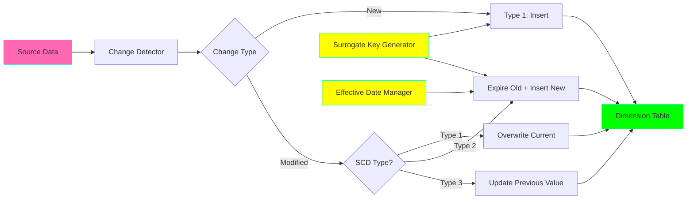
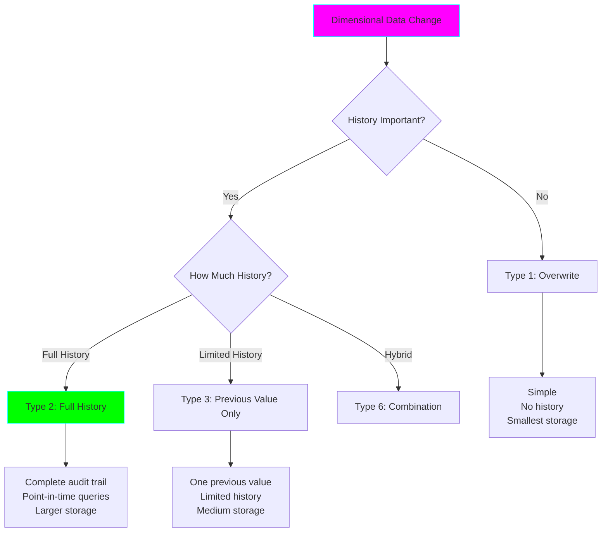

# Project 05: Slowly Changing Dimensions (SCD)

**Complexity:** ⭐⭐⭐☆☆ | **Time:** 7-9 hours | **Tier:** Foundation

## Overview

Build a comprehensive Slowly Changing Dimension (SCD) implementation that handles historical tracking of dimensional data changes. This project teaches dimensional modeling, temporal data management, and data warehouse best practices following the Kimball methodology.

## Learning Objectives

After completing this project, you will understand:

- ✅ Dimensional modeling fundamentals
- ✅ SCD Type 1 (overwrite) implementation
- ✅ SCD Type 2 (history tracking) implementation
- ✅ SCD Type 3 (limited history) implementation
- ✅ Surrogate key management
- ✅ Effective dating strategies
- ✅ Late-arriving dimension updates
- ✅ Slowly changing hierarchies

## Architecture



## Key Concepts

### What are Slowly Changing Dimensions?

**Definition:** Dimensions whose attributes change slowly over time, requiring a strategy to track historical changes.

**Example - Customer Dimension:**
```
Customer changes address:
- Jan 1: Lives in New York
- Mar 15: Moves to California
- Jun 20: Moves to Texas

How do we track this history?
```

### SCD Types Comparison



| Type | Strategy | History | Use Case | Storage |
|------|----------|---------|----------|---------|
| **Type 1** | Overwrite | None | Current view only | Minimal |
| **Type 2** | New row | Full | Audit trail, historical analysis | Large |
| **Type 3** | New column | Limited (1-2 versions) | Track recent change | Medium |
| **Type 4** | History table | Full (separate) | Separate historical tracking | Large |
| **Type 6** | Hybrid 1+2+3 | Full + current flags | Best of all types | Largest |

### Type 1: Overwrite (No History)

```sql
-- Before change
customer_id | name  | city
1          | Alice | New York

-- After change (address updated)
customer_id | name  | city
1          | Alice | California  -- Overwritten, no history
```

**Pros:**
- ✅ Simple to implement
- ✅ Minimal storage
- ✅ Always shows current state

**Cons:**
- ❌ No historical tracking
- ❌ Can't answer "what was it before?"

### Type 2: Full History Tracking

```sql
-- Before change
surrogate_key | customer_id | name  | city     | effective_date | expiry_date | is_current
1            | 1          | Alice | New York | 2024-01-01    | 9999-12-31 | TRUE

-- After change (new row added, old row expired)
surrogate_key | customer_id | customer_name | city       | effective_date | expiry_date | is_current
1            | 1          | Alice        | New York   | 2024-01-01    | 2024-03-14 | FALSE
2            | 1          | Alice        | California | 2024-03-15    | 9999-12-31 | TRUE
```

**Pros:**
- ✅ Complete audit trail
- ✅ Point-in-time queries
- ✅ Track all changes

**Cons:**
- ❌ More storage
- ❌ More complex queries
- ❌ Surrogate key management

### Type 3: Limited History

```sql
-- Before change
customer_id | name  | current_city | previous_city | current_city_date
1          | Alice | New York    | NULL         | 2024-01-01

-- After change
customer_id | name  | current_city | previous_city | current_city_date
1          | Alice | California  | New York     | 2024-03-15
```

**Pros:**
- ✅ Track recent change
- ✅ Simpler than Type 2
- ✅ Moderate storage

**Cons:**
- ❌ Only one historical value
- ❌ Loses older history

## Implementation Guide

### Step 1: Type 1 Implementation (Overwrite)

```python
from sqlalchemy import create_engine, Table, Column, Integer, String, MetaData, text
from sqlalchemy.dialects.postgresql import insert
import pandas as pd
from typing import List, Dict, Any
from datetime import datetime
import logging

class Type1DimensionManager:
    """Manage Type 1 SCD (overwrite strategy)."""

    def __init__(self, connection_string: str):
        self.engine = create_engine(connection_string)
        self.logger = logging.getLogger(__name__)

    def upsert(
        self,
        table_name: str,
        df: pd.DataFrame,
        natural_key: List[str],
        update_columns: List[str]
    ):
        """
        Upsert data using Type 1 strategy (overwrite on conflict).

        Args:
            table_name: Target table name
            df: DataFrame with new/updated data
            natural_key: Business key columns (e.g., customer_id)
            update_columns: Columns to update on conflict
        """
        self.logger.info(f"Type 1 upsert to {table_name}: {len(df)} records")

        with self.engine.begin() as conn:
            for _, row in df.iterrows():
                # PostgreSQL-specific upsert
                stmt = insert(table_name).values(**row.to_dict())

                # On conflict, update specified columns
                update_dict = {col: row[col] for col in update_columns}
                update_dict['updated_at'] = datetime.now()

                stmt = stmt.on_conflict_do_update(
                    index_elements=natural_key,
                    set_=update_dict
                )

                conn.execute(stmt)

        self.logger.info(f"Type 1 upsert completed")

    def process_changes(
        self,
        table_name: str,
        source_df: pd.DataFrame,
        natural_key: List[str]
    ):
        """
        Process changes using Type 1 logic.

        Args:
            table_name: Dimension table name
            source_df: New data from source
            natural_key: Business key columns
        """
        # All columns except natural key can be updated
        all_columns = source_df.columns.tolist()
        update_columns = [col for col in all_columns if col not in natural_key]

        self.upsert(table_name, source_df, natural_key, update_columns)
```

### Step 2: Type 2 Implementation (Full History)

```python
from dataclasses import dataclass
from datetime import date, datetime

@dataclass
class Type2Config:
    """Configuration for Type 2 SCD."""
    surrogate_key_column: str = "surrogate_key"
    natural_key_columns: List[str] = None
    effective_date_column: str = "effective_date"
    expiry_date_column: str = "expiry_date"
    current_flag_column: str = "is_current"
    version_column: str = "version"
    max_date: date = date(9999, 12, 31)

class Type2DimensionManager:
    """Manage Type 2 SCD (full history tracking)."""

    def __init__(
        self,
        connection_string: str,
        config: Type2Config
    ):
        self.engine = create_engine(connection_string)
        self.config = config
        self.logger = logging.getLogger(__name__)

    def get_current_records(
        self,
        table_name: str,
        natural_keys: List[Any]
    ) -> pd.DataFrame:
        """
        Get current (active) records for given natural keys.

        Args:
            table_name: Dimension table name
            natural_keys: List of natural key values to fetch

        Returns:
            DataFrame with current records
        """
        # Build WHERE clause
        key_cols = self.config.natural_key_columns
        placeholders = ','.join([f":{i}" for i in range(len(natural_keys))])

        query = f"""
            SELECT *
            FROM {table_name}
            WHERE {key_cols[0]} IN ({placeholders})
              AND {self.config.current_flag_column} = TRUE
        """

        with self.engine.connect() as conn:
            df = pd.read_sql(
                text(query),
                conn,
                params={str(i): val for i, val in enumerate(natural_keys)}
            )

        return df

    def detect_changes(
        self,
        current_df: pd.DataFrame,
        new_df: pd.DataFrame,
        natural_key: List[str],
        tracked_columns: List[str]
    ) -> Dict[str, pd.DataFrame]:
        """
        Detect inserts, updates, and no-changes.

        Args:
            current_df: Current dimension records
            new_df: New source data
            natural_key: Business key columns
            tracked_columns: Columns to track for changes

        Returns:
            Dictionary with 'inserts', 'updates', 'no_change' DataFrames
        """
        # Create composite key for joining
        current_df['_key'] = current_df[natural_key].astype(str).agg('|'.join, axis=1)
        new_df['_key'] = new_df[natural_key].astype(str).agg('|'.join, axis=1)

        current_keys = set(current_df['_key'])
        new_keys = set(new_df['_key'])

        # Find inserts (in new but not in current)
        insert_keys = new_keys - current_keys
        inserts = new_df[new_df['_key'].isin(insert_keys)].drop('_key', axis=1)

        # Find potential updates (in both)
        common_keys = new_keys & current_keys
        new_common = new_df[new_df['_key'].isin(common_keys)]
        current_common = current_df[current_df['_key'].isin(common_keys)]

        # Compare tracked columns to detect actual changes
        updates = []
        no_change = []

        for _, new_row in new_common.iterrows():
            key = new_row['_key']
            current_row = current_common[current_common['_key'] == key].iloc[0]

            # Check if any tracked column changed
            changed = False
            for col in tracked_columns:
                if col in new_row and col in current_row:
                    if new_row[col] != current_row[col]:
                        changed = True
                        break

            if changed:
                updates.append(new_row)
            else:
                no_change.append(new_row)

        updates_df = pd.DataFrame(updates).drop('_key', axis=1) if updates else pd.DataFrame()
        no_change_df = pd.DataFrame(no_change).drop('_key', axis=1) if no_change else pd.DataFrame()

        self.logger.info(
            f"Changes detected - Inserts: {len(inserts)}, "
            f"Updates: {len(updates_df)}, No change: {len(no_change_df)}"
        )

        return {
            'inserts': inserts,
            'updates': updates_df,
            'no_change': no_change_df
        }

    def insert_new_records(
        self,
        table_name: str,
        df: pd.DataFrame,
        effective_date: date
    ):
        """
        Insert new dimension records.

        Args:
            table_name: Dimension table name
            df: New records to insert
            effective_date: Effective start date
        """
        if len(df) == 0:
            return

        df = df.copy()

        # Add Type 2 metadata columns
        df[self.config.effective_date_column] = effective_date
        df[self.config.expiry_date_column] = self.config.max_date
        df[self.config.current_flag_column] = True
        df[self.config.version_column] = 1

        # Insert to database
        df.to_sql(
            table_name,
            self.engine,
            if_exists='append',
            index=False
        )

        self.logger.info(f"Inserted {len(df)} new records")

    def update_records(
        self,
        table_name: str,
        current_df: pd.DataFrame,
        new_df: pd.DataFrame,
        natural_key: List[str],
        effective_date: date
    ):
        """
        Update records using Type 2 logic (expire old, insert new).

        Args:
            table_name: Dimension table name
            current_df: Current active records
            new_df: Updated records
            natural_key: Business key columns
            effective_date: Effective date of change
        """
        if len(new_df) == 0:
            return

        expiry_date = effective_date - pd.Timedelta(days=1)

        with self.engine.begin() as conn:
            # Step 1: Expire old records
            for _, row in new_df.iterrows():
                # Build WHERE clause from natural key
                where_conditions = " AND ".join(
                    f"{col} = :{col}" for col in natural_key
                )

                update_query = f"""
                    UPDATE {table_name}
                    SET {self.config.expiry_date_column} = :expiry_date,
                        {self.config.current_flag_column} = FALSE
                    WHERE {where_conditions}
                      AND {self.config.current_flag_column} = TRUE
                """

                params = {col: row[col] for col in natural_key}
                params['expiry_date'] = expiry_date

                conn.execute(text(update_query), params)

        # Step 2: Insert new versions
        new_df = new_df.copy()
        new_df[self.config.effective_date_column] = effective_date
        new_df[self.config.expiry_date_column] = self.config.max_date
        new_df[self.config.current_flag_column] = True

        # Increment version (get max version from current_df and add 1)
        for _, new_row in new_df.iterrows():
            key_match = current_df.copy()
            for col in natural_key:
                key_match = key_match[key_match[col] == new_row[col]]

            if len(key_match) > 0:
                max_version = key_match[self.config.version_column].max()
                new_df.loc[new_row.name, self.config.version_column] = max_version + 1
            else:
                new_df.loc[new_row.name, self.config.version_column] = 1

        new_df.to_sql(
            table_name,
            self.engine,
            if_exists='append',
            index=False
        )

        self.logger.info(f"Updated {len(new_df)} records (expired old, inserted new)")

    def process_changes(
        self,
        table_name: str,
        source_df: pd.DataFrame,
        natural_key: List[str],
        tracked_columns: List[str],
        effective_date: Optional[date] = None
    ):
        """
        Process changes using Type 2 logic.

        Args:
            table_name: Dimension table name
            source_df: New source data
            natural_key: Business key columns
            tracked_columns: Columns to track for changes
            effective_date: Date when changes become effective
        """
        if effective_date is None:
            effective_date = date.today()

        # Get current records
        natural_key_values = source_df[natural_key[0]].unique().tolist()
        current_df = self.get_current_records(table_name, natural_key_values)

        # Detect changes
        changes = self.detect_changes(
            current_df,
            source_df,
            natural_key,
            tracked_columns
        )

        # Process inserts
        self.insert_new_records(table_name, changes['inserts'], effective_date)

        # Process updates
        self.update_records(
            table_name,
            current_df,
            changes['updates'],
            natural_key,
            effective_date
        )

        self.logger.info("Type 2 processing completed")
```

### Step 3: Type 3 Implementation (Limited History)

```python
class Type3DimensionManager:
    """Manage Type 3 SCD (limited history)."""

    def __init__(self, connection_string: str):
        self.engine = create_engine(connection_string)
        self.logger = logging.getLogger(__name__)

    def update_with_previous(
        self,
        table_name: str,
        df: pd.DataFrame,
        natural_key: List[str],
        tracked_columns: List[str]
    ):
        """
        Update records preserving previous value.

        Schema should have columns like:
        - current_city, previous_city, city_changed_date

        Args:
            table_name: Dimension table name
            df: New data
            natural_key: Business key columns
            tracked_columns: Columns to track (will create current_X, previous_X)
        """
        with self.engine.begin() as conn:
            for _, row in df.iterrows():
                # For each tracked column, update current and move old to previous
                set_clauses = []
                for col in tracked_columns:
                    current_col = f"current_{col}"
                    previous_col = f"previous_{col}"
                    date_col = f"{col}_changed_date"

                    set_clauses.append(f"{previous_col} = {current_col}")
                    set_clauses.append(f"{current_col} = :{col}")
                    set_clauses.append(f"{date_col} = :change_date")

                # Build WHERE clause
                where_conditions = " AND ".join(
                    f"{col} = :{col}" for col in natural_key
                )

                update_query = f"""
                    UPDATE {table_name}
                    SET {', '.join(set_clauses)}
                    WHERE {where_conditions}
                """

                params = {col: row[col] for col in natural_key}
                for col in tracked_columns:
                    params[col] = row[col]
                params['change_date'] = datetime.now()

                conn.execute(text(update_query), params)

        self.logger.info(f"Type 3 update completed for {len(df)} records")
```

### Step 4: Surrogate Key Generator

```python
import uuid

class SurrogateKeyGenerator:
    """Generate surrogate keys for dimension tables."""

    def __init__(self, strategy: str = "auto_increment"):
        """
        Initialize key generator.

        Args:
            strategy: 'auto_increment', 'uuid', or 'sequence'
        """
        self.strategy = strategy
        self._counter = 0
        self._lock = threading.Lock()

    def generate(self) -> Any:
        """Generate a surrogate key."""
        if self.strategy == "uuid":
            return str(uuid.uuid4())

        elif self.strategy == "auto_increment":
            with self._lock:
                self._counter += 1
                return self._counter

        else:
            raise ValueError(f"Unknown strategy: {self.strategy}")

    def generate_batch(self, count: int) -> List[Any]:
        """Generate multiple surrogate keys."""
        return [self.generate() for _ in range(count)]

    def get_next_sequence_value(
        self,
        engine,
        sequence_name: str
    ) -> int:
        """Get next value from database sequence."""
        with engine.connect() as conn:
            result = conn.execute(text(f"SELECT nextval('{sequence_name}')"))
            return result.scalar()
```

### Step 5: Complete SCD Processor

```python
from enum import Enum

class SCDType(Enum):
    """SCD implementation types."""
    TYPE_1 = 1  # Overwrite
    TYPE_2 = 2  # Full history
    TYPE_3 = 3  # Limited history

class SCDProcessor:
    """Unified SCD processor supporting multiple types."""

    def __init__(self, connection_string: str):
        self.type1_manager = Type1DimensionManager(connection_string)
        self.type2_manager = Type2DimensionManager(
            connection_string,
            Type2Config(natural_key_columns=['customer_id'])
        )
        self.type3_manager = Type3DimensionManager(connection_string)
        self.logger = logging.getLogger(__name__)

    def process(
        self,
        table_name: str,
        source_df: pd.DataFrame,
        natural_key: List[str],
        scd_type: SCDType,
        tracked_columns: Optional[List[str]] = None,
        effective_date: Optional[date] = None
    ):
        """
        Process dimension changes based on SCD type.

        Args:
            table_name: Dimension table name
            source_df: New source data
            natural_key: Business key columns
            scd_type: Type of SCD to apply
            tracked_columns: Columns to track for changes
            effective_date: Effective date for Type 2
        """
        self.logger.info(f"Processing {table_name} as SCD Type {scd_type.value}")

        if scd_type == SCDType.TYPE_1:
            self.type1_manager.process_changes(
                table_name,
                source_df,
                natural_key
            )

        elif scd_type == SCDType.TYPE_2:
            if not tracked_columns:
                tracked_columns = [
                    col for col in source_df.columns
                    if col not in natural_key
                ]

            self.type2_manager.process_changes(
                table_name,
                source_df,
                natural_key,
                tracked_columns,
                effective_date
            )

        elif scd_type == SCDType.TYPE_3:
            if not tracked_columns:
                raise ValueError("Type 3 requires tracked_columns specification")

            self.type3_manager.update_with_previous(
                table_name,
                source_df,
                natural_key,
                tracked_columns
            )

        else:
            raise ValueError(f"Unsupported SCD type: {scd_type}")
```

## Nuanced Scenarios

### 1. Late-Arriving Dimensions

**Challenge:** Handle dimension updates that arrive late (before their fact records).

```python
class LateArrivalDimensionHandler:
    """Handle late-arriving dimension updates."""

    def __init__(self, type2_manager: Type2DimensionManager):
        self.type2_manager = type2_manager
        self.logger = logging.getLogger(__name__)

    def process_late_arrival(
        self,
        table_name: str,
        late_df: pd.DataFrame,
        natural_key: List[str],
        tracked_columns: List[str],
        late_effective_date: date
    ):
        """
        Process late-arriving dimension update.

        This may require:
        1. Finding the correct version to update
        2. Adjusting effective/expiry dates
        3. Potentially creating multiple versions
        """
        # Get all versions for these natural keys
        with self.type2_manager.engine.connect() as conn:
            key_values = late_df[natural_key[0]].unique().tolist()
            placeholders = ','.join([f":{i}" for i in range(len(key_values))])

            query = f"""
                SELECT *
                FROM {table_name}
                WHERE {natural_key[0]} IN ({placeholders})
                ORDER BY effective_date
            """

            all_versions = pd.read_sql(
                text(query),
                conn,
                params={str(i): val for i, val in enumerate(key_values)}
            )

        # For each late record, find where it fits in timeline
        for _, late_row in late_df.iterrows():
            self._insert_late_version(
                table_name,
                late_row,
                all_versions,
                natural_key,
                late_effective_date
            )

    def _insert_late_version(
        self,
        table_name: str,
        late_row: pd.Series,
        all_versions: pd.DataFrame,
        natural_key: List[str],
        late_effective_date: date
    ):
        """Insert a late-arriving version at the correct timeline position."""
        # Find versions for this natural key
        key_match = all_versions.copy()
        for col in natural_key:
            key_match = key_match[key_match[col] == late_row[col]]

        # Find where late record fits
        # This is simplified - production code needs more sophisticated logic
        affected_versions = key_match[
            key_match['effective_date'] >= late_effective_date
        ]

        # Adjust effective/expiry dates and insert
        # (Implementation details omitted for brevity)
        self.logger.info(f"Processed late arrival for {late_row[natural_key[0]]}")
```

### 2. Hybrid SCD Types (Type 6 = 1+2+3)

**Challenge:** Combine benefits of multiple SCD types.

```python
class Type6DimensionManager:
    """
    Implement Type 6 (Hybrid) SCD.

    Combines:
    - Type 1: Current value columns
    - Type 2: Historical rows
    - Type 3: Previous value columns
    """

    def __init__(self, connection_string: str):
        self.engine = create_engine(connection_string)
        self.logger = logging.getLogger(__name__)

    def process_change(
        self,
        table_name: str,
        source_df: pd.DataFrame,
        natural_key: List[str],
        tracked_columns: List[str],
        effective_date: date
    ):
        """
        Process using Type 6 strategy.

        Schema includes:
        - current_value: Type 1 (always latest)
        - historical_value: Type 2 (versioned)
        - previous_value: Type 3 (one previous)
        """
        # For each record:
        # 1. Update ALL versions' current_value (Type 1)
        # 2. Create new version (Type 2)
        # 3. Set previous_value on new version (Type 3)

        for _, row in source_df.iterrows():
            # Step 1: Update current values on all versions (Type 1)
            where_clause = " AND ".join(f"{col} = :{col}" for col in natural_key)

            for tracked_col in tracked_columns:
                update_query = f"""
                    UPDATE {table_name}
                    SET current_{tracked_col} = :new_value
                    WHERE {where_clause}
                """

                params = {col: row[col] for col in natural_key}
                params['new_value'] = row[tracked_col]

                with self.engine.begin() as conn:
                    conn.execute(text(update_query), params)

            # Steps 2 & 3: Create new version with previous value
            # (Similar to Type 2 logic)
            # ... implementation omitted for brevity
```

### 3. Slowly Changing Hierarchies

**Challenge:** Handle hierarchical dimensions where parent-child relationships change.

```python
class HierarchyDimensionManager:
    """Manage hierarchical dimensions (e.g., org structure)."""

    def __init__(self, type2_manager: Type2DimensionManager):
        self.type2_manager = type2_manager
        self.logger = logging.getLogger(__name__)

    def process_hierarchy_change(
        self,
        table_name: str,
        node_id: Any,
        new_parent_id: Any,
        effective_date: date
    ):
        """
        Update hierarchy relationship.

        Example: Employee changes department
        - Employee surrogate key: 123
        - Old department: 10
        - New department: 20
        """
        # Create new version of the node with updated parent
        # This typically requires:
        # 1. Expiring current version
        # 2. Creating new version with new parent_id
        # 3. Potentially updating descendant paths

        self.logger.info(
            f"Updating hierarchy: {node_id} moved to parent {new_parent_id}"
        )

        # Implementation would use Type 2 logic with special handling
        # for path/level columns
```

### 4. Mini-Dimension Pattern

**Challenge:** Handle rapidly changing attributes separately to avoid dimension explosion.

```python
class MiniDimensionManager:
    """
    Manage mini-dimensions for rapidly changing attributes.

    Example: Customer demographics change frequently, split into:
    - Customer dimension (slowly changing)
    - Demographics mini-dimension (rapidly changing)
    """

    def __init__(self, connection_string: str):
        self.engine = create_engine(connection_string)
        self.logger = logging.getLogger(__name__)

    def split_dimension(
        self,
        main_table: str,
        mini_table: str,
        main_df: pd.DataFrame,
        rapid_columns: List[str]
    ):
        """
        Split dimension into main and mini dimensions.

        Args:
            main_table: Slowly changing dimension table
            mini_table: Mini-dimension for rapid changes
            main_df: Combined data
            rapid_columns: Columns that change rapidly
        """
        # Separate slow and rapid attributes
        slow_columns = [
            col for col in main_df.columns
            if col not in rapid_columns
        ]

        main_data = main_df[slow_columns]
        mini_data = main_df[rapid_columns]

        # Process separately
        # Main dimension uses Type 2
        # Mini-dimension uses Type 1 or separate Type 2

        self.logger.info(
            f"Split dimension - Main: {len(slow_columns)} cols, "
            f"Mini: {len(rapid_columns)} cols"
        )
```

## Exercises

### Exercise 1: Implement All Three Types
Create a dimension table and implement:
- Type 1 for non-critical attributes
- Type 2 for critical audit trail
- Type 3 for one specific attribute

### Exercise 2: Point-in-Time Query
Write queries to:
- Get dimension state as of specific date
- Join with facts using correct dimension version
- Generate historical snapshots

### Exercise 3: Late Arrival Handling
Implement logic to handle:
- Dimension update arriving after fact
- Inserting historical version correctly
- Adjusting timeline without breaking references

### Exercise 4: Performance Optimization
Optimize Type 2 processing for:
- 1M+ dimension records
- 100k+ daily updates
- Efficient current record queries
- Fast historical lookups

## Success Criteria

- [ ] Implement SCD Type 1 (overwrite)
- [ ] Implement SCD Type 2 (full history)
- [ ] Implement SCD Type 3 (limited history)
- [ ] Generate and manage surrogate keys
- [ ] Handle effective/expiry dates correctly
- [ ] Support late-arriving dimensions
- [ ] Enable point-in-time queries
- [ ] Process 100k+ dimension updates efficiently
- [ ] Maintain referential integrity
- [ ] Provide audit trail for changes

## Testing Checklist

```python
# tests/test_scd.py

def test_type1_overwrite():
    """Test Type 1 overwrites existing records."""
    pass

def test_type2_history_tracking():
    """Test Type 2 creates new versions."""
    pass

def test_type2_expiry():
    """Test old versions are correctly expired."""
    pass

def test_type3_previous_value():
    """Test Type 3 preserves previous value."""
    pass

def test_surrogate_keys():
    """Test surrogate key generation."""
    pass

def test_effective_dating():
    """Test effective/expiry date logic."""
    pass

def test_late_arrivals():
    """Test late-arriving dimension updates."""
    pass

def test_point_in_time_query():
    """Test querying dimension at specific date."""
    pass

def test_current_flag():
    """Test is_current flag maintenance."""
    pass

def test_version_numbering():
    """Test version numbers increment correctly."""
    pass
```

## Common Pitfalls

1. **Wrong SCD Type:** Using Type 1 when history is needed
2. **Missing Surrogate Keys:** Using natural keys in Type 2
3. **Incorrect Dating:** Wrong effective/expiry date logic
4. **No Current Flag:** Difficult to query current state
5. **Not Handling Deletes:** Deleted dimensions not marked
6. **Poor Performance:** No indexes on effective dates
7. **Breaking FK References:** Changing surrogate keys

## Next Steps

After completing this project:
1. Move to **Project 06: Data Deduplication Engine**
2. Combine with Project 03 for incremental dimension updates
3. Apply to Projects 07 and 10 for dimension management
4. Build star schema with fact and dimension tables

## References

- [Kimball Group: SCD Types](https://www.kimballgroup.com/data-warehouse-business-intelligence-resources/kimball-techniques/dimensional-modeling-techniques/type-2/)
- [Dimensional Modeling](https://www.kimballgroup.com/data-warehouse-business-intelligence-resources/books/data-warehouse-dw-toolkit/)
- [SCD Best Practices](https://www.sqlshack.com/implementing-slowly-changing-dimensions-scds-in-data-warehouses/)
- [Surrogate Keys](https://www.kimballgroup.com/1998/05/surrogate-keys/)
- [Late-Arriving Dimensions](https://www.kimballgroup.com/2007/10/late-arriving-dimension-records/)

---

**Happy Modeling! 🚀**
