# Project 06: Data Deduplication Engine

**Complexity:** ⭐⭐⭐⭐☆ | **Time:** 8-10 hours | **Tier:** Foundation

## Overview

Build a sophisticated data deduplication engine that handles both exact and fuzzy matching using hash-based techniques, similarity metrics, and probabilistic matching. This project teaches advanced record linkage and entity resolution techniques critical for data quality.

## Learning Objectives

After completing this project, you will understand:

- ✅ Hash-based deduplication strategies (MD5, SHA, content-addressable hashing)
- ✅ Fuzzy matching algorithms (Levenshtein, Jaro-Winkler, Soundex, Metaphone)
- ✅ Similarity metrics and scoring (Cosine, Jaccard, TF-IDF)
- ✅ Blocking strategies for performance at scale
- ✅ Probabilistic record linkage (Fellegi-Sunter model)
- ✅ Multi-field composite matching with weighted scoring
- ✅ Human-in-the-loop review workflows

## Architecture


## Key Concepts

### Hash-Based Deduplication

**Exact Match Using Hashing:**
```
Record 1: "John Smith, 123 Main St"
Record 2: "John Smith, 123 Main St"

Hash(Record 1) = "a1b2c3d4"
Hash(Record 2) = "a1b2c3d4"

Match: 100% (hashes identical)
```

**Benefits:**
- O(1) lookup time with hash index
- Memory-efficient for large datasets
- Deterministic results
- Perfect for exact duplicates

**Limitations:**
- Cannot handle typos or variations
- Sensitive to field order and formatting
- Not suitable for fuzzy matching

### Fuzzy Matching Algorithms

#### Levenshtein Distance

Measures minimum edits (insert, delete, substitute) needed to transform one string to another:

```
"kitten" → "sitting"
1. kitten → sitten (substitute k → s)
2. sitten → sittin (substitute e → i)
3. sittin → sitting (insert g)

Distance = 3
Similarity = 1 - (3 / max_length) = 0.571
```

#### Jaro-Winkler Similarity

Optimized for short strings like names, gives higher weight to matching prefixes:

```
"MARTHA" vs "MARHTA"
Common chars: M, A, R, T, H, A
Transpositions: 2 (TH swapped)

Jaro = (6/6 + 6/6 + (6-2)/6) / 3 = 0.944
Jaro-Winkler = 0.944 + (0.1 × 4 × (1-0.944)) = 0.966
```

#### Soundex/Metaphone

Phonetic algorithms for names that sound similar:

```
Soundex:
"Smith"    → S530
"Smythe"   → S530
"Schmidt"  → S530

Metaphone:
"Catherine" → K0RN
"Kathryn"   → K0RN
"Katharine" → K0RN
```

### Blocking Strategies

**Problem:** Comparing N records requires N² comparisons (expensive!)

**Solution:** Block records into groups, only compare within blocks

```mermaid
graph LR
    A[1M Records] --> B{Blocking Key}

    B -->|First 3 chars of name| C[Block: JOH]
    B -->|First 3 chars of name| D[Block: MAR]
    B -->|First 3 chars of name| E[Block: SMI]

    C --> C1[John Smith<br/>John Doe<br/>Johnny Appleseed]
    D --> D1[Mary Jones<br/>Martha Stewart<br/>Mark Twain]
    E --> E1[Smith Johnson<br/>Smithson Blake]

    C1 --> F[3² = 9 comparisons]
    D1 --> G[3² = 9 comparisons]
    E1 --> H[2² = 4 comparisons]

    style A fill:#ff69b4,stroke:#00ffff
    style F fill:#00ff00,stroke:#00ffff
    style G fill:#00ff00,stroke:#00ffff
    style H fill:#00ff00,stroke:#00ffff
```



**Common Blocking Keys:**
- First N characters of name
- ZIP code
- Email domain
- Date ranges
- Phonetic codes (Soundex)

### Similarity Metrics

| Metric | Best For | Range | Formula |
|--------|----------|-------|---------|
| Levenshtein | General text | 0-1 | 1 - (edits / max_len) |
| Jaro-Winkler | Names | 0-1 | Weighted by prefix match |
| Cosine | Text documents | 0-1 | dot(A,B) / (‖A‖ × ‖B‖) |
| Jaccard | Sets/tokens | 0-1 | ‖A ∩ B‖ / ‖A ∪ B‖ |
| TF-IDF | Long text | 0-1 | Term frequency × inverse document frequency |

## Implementation Guide

### Step 1: Exact Hash-Based Deduplication

```python
import hashlib
import pandas as pd
from typing import List, Set, Dict, Tuple
from dataclasses import dataclass
import logging

@dataclass
class DuplicateGroup:
    """Represents a group of duplicate records."""
    hash_key: str
    record_ids: List[int]
    count: int
    sample_record: Dict

class HashDeduplicator:
    """Exact deduplication using content hashing."""

    def __init__(self, columns: List[str], hash_algorithm: str = 'sha256'):
        """
        Initialize hash-based deduplicator.

        Args:
            columns: Columns to include in hash calculation
            hash_algorithm: 'md5', 'sha1', or 'sha256'
        """
        self.columns = columns
        self.hash_algorithm = hash_algorithm
        self.logger = logging.getLogger(__name__)

    def compute_hash(self, record: pd.Series) -> str:
        """
        Compute hash for a single record.

        Args:
            record: Pandas Series representing one record

        Returns:
            Hexadecimal hash string
        """
        # Extract and normalize values
        values = []
        for col in self.columns:
            value = record[col]
            # Normalize: lowercase, strip whitespace
            if isinstance(value, str):
                value = value.lower().strip()
            values.append(str(value))

        # Concatenate and hash
        content = '|'.join(values)

        if self.hash_algorithm == 'md5':
            hash_obj = hashlib.md5(content.encode())
        elif self.hash_algorithm == 'sha1':
            hash_obj = hashlib.sha1(content.encode())
        else:  # sha256
            hash_obj = hashlib.sha256(content.encode())

        return hash_obj.hexdigest()

    def find_duplicates(self, df: pd.DataFrame) -> List[DuplicateGroup]:
        """
        Find all duplicate groups in DataFrame.

        Args:
            df: Input DataFrame

        Returns:
            List of DuplicateGroup objects
        """
        self.logger.info(f"Computing hashes for {len(df)} records")

        # Compute hash for each record
        df['_hash'] = df.apply(self.compute_hash, axis=1)

        # Group by hash
        hash_groups = df.groupby('_hash')

        duplicates = []
        for hash_key, group in hash_groups:
            if len(group) > 1:
                dup_group = DuplicateGroup(
                    hash_key=hash_key,
                    record_ids=group.index.tolist(),
                    count=len(group),
                    sample_record=group.iloc[0].to_dict()
                )
                duplicates.append(dup_group)

        self.logger.info(f"Found {len(duplicates)} duplicate groups")
        return duplicates

    def deduplicate(self, df: pd.DataFrame, keep: str = 'first') -> pd.DataFrame:
        """
        Remove duplicates from DataFrame.

        Args:
            df: Input DataFrame
            keep: 'first', 'last', or False (remove all duplicates)

        Returns:
            DataFrame with duplicates removed
        """
        df['_hash'] = df.apply(self.compute_hash, axis=1)

        if keep == False:
            # Remove all duplicates
            counts = df['_hash'].value_counts()
            unique_hashes = counts[counts == 1].index
            result = df[df['_hash'].isin(unique_hashes)]
        else:
            # Keep first or last
            result = df.drop_duplicates(subset=['_hash'], keep=keep)

        return result.drop(columns=['_hash'])
```

### Step 2: Fuzzy Matching with Multiple Algorithms

```python
from Levenshtein import distance as levenshtein_distance
from Levenshtein import jaro_winkler
import jellyfish
from sklearn.feature_extraction.text import TfidfVectorizer
from sklearn.metrics.pairwise import cosine_similarity
import numpy as np

class FuzzyMatcher:
    """Fuzzy matching using multiple similarity algorithms."""

    def __init__(self):
        self.logger = logging.getLogger(__name__)

    @staticmethod
    def levenshtein_similarity(s1: str, s2: str) -> float:
        """
        Calculate Levenshtein similarity (0-1).

        Args:
            s1, s2: Strings to compare

        Returns:
            Similarity score (1 = identical, 0 = completely different)
        """
        if not s1 or not s2:
            return 0.0

        distance = levenshtein_distance(s1.lower(), s2.lower())
        max_len = max(len(s1), len(s2))

        return 1 - (distance / max_len)

    @staticmethod
    def jaro_winkler_similarity(s1: str, s2: str) -> float:
        """
        Calculate Jaro-Winkler similarity (0-1).

        Better for short strings like names.
        """
        if not s1 or not s2:
            return 0.0

        return jaro_winkler(s1.lower(), s2.lower())

    @staticmethod
    def soundex_match(s1: str, s2: str) -> bool:
        """
        Check if two strings have same Soundex code.

        Good for matching phonetically similar names.
        """
        if not s1 or not s2:
            return False

        code1 = jellyfish.soundex(s1)
        code2 = jellyfish.soundex(s2)

        return code1 == code2

    @staticmethod
    def metaphone_match(s1: str, s2: str) -> bool:
        """
        Check if two strings have same Metaphone code.

        More accurate than Soundex for English names.
        """
        if not s1 or not s2:
            return False

        code1 = jellyfish.metaphone(s1)
        code2 = jellyfish.metaphone(s2)

        return code1 == code2

    @staticmethod
    def jaccard_similarity(s1: str, s2: str, q: int = 2) -> float:
        """
        Calculate Jaccard similarity using q-grams.

        Args:
            s1, s2: Strings to compare
            q: Q-gram size (default: 2 for bigrams)

        Returns:
            Jaccard similarity (0-1)
        """
        def get_qgrams(s: str, q: int) -> Set[str]:
            """Extract q-grams from string."""
            s = s.lower()
            return set(s[i:i+q] for i in range(len(s) - q + 1))

        if not s1 or not s2:
            return 0.0

        qgrams1 = get_qgrams(s1, q)
        qgrams2 = get_qgrams(s2, q)

        intersection = len(qgrams1 & qgrams2)
        union = len(qgrams1 | qgrams2)

        return intersection / union if union > 0 else 0.0

    @staticmethod
    def cosine_similarity_tfidf(texts1: List[str], texts2: List[str]) -> np.ndarray:
        """
        Calculate cosine similarity using TF-IDF vectors.

        Best for longer text fields.

        Args:
            texts1, texts2: Lists of text strings

        Returns:
            Similarity matrix
        """
        # Combine all texts for TF-IDF fitting
        all_texts = texts1 + texts2

        # Create TF-IDF vectors
        vectorizer = TfidfVectorizer(lowercase=True, strip_accents='unicode')
        tfidf_matrix = vectorizer.fit_transform(all_texts)

        # Split back into two groups
        n1 = len(texts1)
        vectors1 = tfidf_matrix[:n1]
        vectors2 = tfidf_matrix[n1:]

        # Calculate cosine similarity
        similarities = cosine_similarity(vectors1, vectors2)

        return similarities
```

### Step 3: Blocking Engine for Performance

```python
from collections import defaultdict
from itertools import combinations

class BlockingEngine:
    """Reduce comparison space using blocking keys."""

    def __init__(self, blocking_keys: List[str]):
        """
        Initialize blocking engine.

        Args:
            blocking_keys: List of blocking strategies to use
                Options: 'first_n_chars', 'soundex', 'zip_code', etc.
        """
        self.blocking_keys = blocking_keys
        self.logger = logging.getLogger(__name__)

    def generate_blocking_key(
        self,
        record: pd.Series,
        strategy: str
    ) -> str:
        """
        Generate blocking key for a record using specified strategy.

        Args:
            record: Single record
            strategy: Blocking strategy name

        Returns:
            Blocking key string
        """
        if strategy == 'first_3_chars_name':
            name = str(record.get('name', '')).lower().strip()
            return name[:3] if len(name) >= 3 else name

        elif strategy == 'soundex_name':
            name = str(record.get('name', ''))
            return jellyfish.soundex(name) if name else ''

        elif strategy == 'zip_code':
            return str(record.get('zip_code', ''))[:5]

        elif strategy == 'email_domain':
            email = str(record.get('email', ''))
            return email.split('@')[-1].lower() if '@' in email else ''

        elif strategy == 'year_month':
            date_col = record.get('date', record.get('created_at', ''))
            if pd.notna(date_col):
                dt = pd.to_datetime(date_col)
                return f"{dt.year}-{dt.month:02d}"
            return ''

        else:
            raise ValueError(f"Unknown blocking strategy: {strategy}")

    def create_blocks(
        self,
        df: pd.DataFrame,
        strategy: str
    ) -> Dict[str, List[int]]:
        """
        Partition records into blocks using specified strategy.

        Args:
            df: Input DataFrame
            strategy: Blocking strategy

        Returns:
            Dictionary mapping block keys to record indices
        """
        blocks = defaultdict(list)

        for idx, record in df.iterrows():
            block_key = self.generate_blocking_key(record, strategy)
            if block_key:
                blocks[block_key].append(idx)

        self.logger.info(
            f"Created {len(blocks)} blocks using '{strategy}' strategy"
        )

        return dict(blocks)

    def generate_candidate_pairs(
        self,
        df: pd.DataFrame,
        max_block_size: int = 1000
    ) -> Set[Tuple[int, int]]:
        """
        Generate candidate pairs using multiple blocking strategies.

        Args:
            df: Input DataFrame
            max_block_size: Skip blocks larger than this (likely too generic)

        Returns:
            Set of (index1, index2) candidate pairs
        """
        all_pairs = set()

        for strategy in self.blocking_keys:
            blocks = self.create_blocks(df, strategy)

            pairs_from_strategy = 0
            for block_key, indices in blocks.items():
                # Skip very large blocks
                if len(indices) > max_block_size:
                    self.logger.warning(
                        f"Skipping large block '{block_key}' with {len(indices)} records"
                    )
                    continue

                # Generate all pairs within block
                for idx1, idx2 in combinations(indices, 2):
                    all_pairs.add((min(idx1, idx2), max(idx1, idx2)))
                    pairs_from_strategy += 1

            self.logger.info(
                f"Strategy '{strategy}' generated {pairs_from_strategy} pairs"
            )

        self.logger.info(
            f"Total unique candidate pairs: {len(all_pairs)} "
            f"(vs {len(df) * (len(df) - 1) // 2} full comparison)"
        )

        return all_pairs
```

### Step 4: Multi-Field Matching with Confidence Scoring

```python
@dataclass
class MatchResult:
    """Result of comparing two records."""
    record1_id: int
    record2_id: int
    field_scores: Dict[str, float]
    overall_score: float
    confidence: str  # 'high', 'medium', 'low'
    is_match: bool

class MultiFieldMatcher:
    """Match records using multiple fields with weighted scoring."""

    def __init__(
        self,
        field_config: Dict[str, Dict],
        high_threshold: float = 0.9,
        medium_threshold: float = 0.7
    ):
        """
        Initialize multi-field matcher.

        Args:
            field_config: Configuration for each field
                Example: {
                    'name': {'weight': 0.4, 'algorithm': 'jaro_winkler'},
                    'email': {'weight': 0.3, 'algorithm': 'levenshtein'},
                    'phone': {'weight': 0.3, 'algorithm': 'exact'}
                }
            high_threshold: Score above this = high confidence match
            medium_threshold: Score above this = medium confidence match
        """
        self.field_config = field_config
        self.high_threshold = high_threshold
        self.medium_threshold = medium_threshold
        self.fuzzy_matcher = FuzzyMatcher()
        self.logger = logging.getLogger(__name__)

        # Validate weights sum to 1.0
        total_weight = sum(cfg['weight'] for cfg in field_config.values())
        if not (0.99 <= total_weight <= 1.01):
            raise ValueError(f"Field weights must sum to 1.0, got {total_weight}")

    def compare_field(
        self,
        value1: any,
        value2: any,
        algorithm: str
    ) -> float:
        """
        Compare two field values using specified algorithm.

        Returns:
            Similarity score (0-1)
        """
        # Handle missing values
        if pd.isna(value1) or pd.isna(value2):
            return 0.0

        # Convert to strings
        str1 = str(value1).strip()
        str2 = str(value2).strip()

        if not str1 or not str2:
            return 0.0

        # Apply algorithm
        if algorithm == 'exact':
            return 1.0 if str1.lower() == str2.lower() else 0.0

        elif algorithm == 'levenshtein':
            return self.fuzzy_matcher.levenshtein_similarity(str1, str2)

        elif algorithm == 'jaro_winkler':
            return self.fuzzy_matcher.jaro_winkler_similarity(str1, str2)

        elif algorithm == 'jaccard':
            return self.fuzzy_matcher.jaccard_similarity(str1, str2)

        elif algorithm == 'soundex':
            return 1.0 if self.fuzzy_matcher.soundex_match(str1, str2) else 0.0

        elif algorithm == 'metaphone':
            return 1.0 if self.fuzzy_matcher.metaphone_match(str1, str2) else 0.0

        else:
            raise ValueError(f"Unknown algorithm: {algorithm}")

    def match_records(
        self,
        record1: pd.Series,
        record2: pd.Series
    ) -> MatchResult:
        """
        Compare two records across all configured fields.

        Returns:
            MatchResult with scores and confidence
        """
        field_scores = {}
        weighted_score = 0.0

        # Compare each field
        for field_name, config in self.field_config.items():
            value1 = record1.get(field_name)
            value2 = record2.get(field_name)

            score = self.compare_field(
                value1,
                value2,
                config['algorithm']
            )

            field_scores[field_name] = score
            weighted_score += score * config['weight']

        # Determine confidence level
        if weighted_score >= self.high_threshold:
            confidence = 'high'
            is_match = True
        elif weighted_score >= self.medium_threshold:
            confidence = 'medium'
            is_match = False  # Needs review
        else:
            confidence = 'low'
            is_match = False

        return MatchResult(
            record1_id=record1.name,
            record2_id=record2.name,
            field_scores=field_scores,
            overall_score=weighted_score,
            confidence=confidence,
            is_match=is_match
        )
```

### Step 5: Complete Deduplication Pipeline

```python
class DeduplicationEngine:
    """Main orchestrator for deduplication process."""

    def __init__(
        self,
        exact_match_columns: List[str],
        fuzzy_field_config: Dict[str, Dict],
        blocking_strategies: List[str],
        auto_merge_threshold: float = 0.9,
        review_threshold: float = 0.7
    ):
        """
        Initialize deduplication engine.

        Args:
            exact_match_columns: Columns for hash-based exact matching
            fuzzy_field_config: Field configuration for fuzzy matching
            blocking_strategies: List of blocking strategies
            auto_merge_threshold: Auto-merge if score >= this
            review_threshold: Send to review if score >= this
        """
        self.hash_dedup = HashDeduplicator(exact_match_columns)
        self.blocking = BlockingEngine(blocking_strategies)
        self.matcher = MultiFieldMatcher(
            fuzzy_field_config,
            high_threshold=auto_merge_threshold,
            medium_threshold=review_threshold
        )
        self.logger = logging.getLogger(__name__)

    def deduplicate(
        self,
        df: pd.DataFrame,
        use_exact: bool = True,
        use_fuzzy: bool = True
    ) -> Dict[str, pd.DataFrame]:
        """
        Run complete deduplication pipeline.

        Args:
            df: Input DataFrame
            use_exact: Apply exact hash-based matching first
            use_fuzzy: Apply fuzzy matching

        Returns:
            Dictionary with:
                - 'unique': Deduplicated records
                - 'exact_duplicates': Exact duplicates found
                - 'fuzzy_matches': High confidence fuzzy matches
                - 'review_queue': Medium confidence matches
                - 'stats': Deduplication statistics
        """
        results = {}
        stats = {}

        self.logger.info(f"Starting deduplication of {len(df)} records")

        # Step 1: Exact matching
        if use_exact:
            self.logger.info("Running exact hash-based deduplication")
            exact_dups = self.hash_dedup.find_duplicates(df)
            df_deduped = self.hash_dedup.deduplicate(df, keep='first')

            results['exact_duplicates'] = exact_dups
            stats['exact_duplicates_found'] = len(exact_dups)
            stats['records_after_exact'] = len(df_deduped)
        else:
            df_deduped = df.copy()

        # Step 2: Fuzzy matching
        if use_fuzzy and len(df_deduped) > 1:
            self.logger.info("Running fuzzy matching")

            # Generate candidate pairs using blocking
            candidate_pairs = self.blocking.generate_candidate_pairs(df_deduped)
            stats['candidate_pairs'] = len(candidate_pairs)

            # Compare each candidate pair
            high_confidence_matches = []
            medium_confidence_matches = []

            for idx1, idx2 in candidate_pairs:
                record1 = df_deduped.loc[idx1]
                record2 = df_deduped.loc[idx2]

                match_result = self.matcher.match_records(record1, record2)

                if match_result.confidence == 'high':
                    high_confidence_matches.append(match_result)
                elif match_result.confidence == 'medium':
                    medium_confidence_matches.append(match_result)

            results['fuzzy_matches'] = high_confidence_matches
            results['review_queue'] = medium_confidence_matches

            stats['high_confidence_matches'] = len(high_confidence_matches)
            stats['review_queue_size'] = len(medium_confidence_matches)

            self.logger.info(
                f"Found {len(high_confidence_matches)} high confidence matches, "
                f"{len(medium_confidence_matches)} need review"
            )

        results['unique'] = df_deduped
        results['stats'] = stats

        return results

    def generate_report(self, results: Dict) -> str:
        """Generate human-readable deduplication report."""
        stats = results['stats']

        report = f"""
Deduplication Report
{'=' * 50}

Input Records: {stats.get('input_records', 'N/A')}

Exact Match Results:
  - Duplicate groups found: {stats.get('exact_duplicates_found', 0)}
  - Records after exact dedup: {stats.get('records_after_exact', 'N/A')}

Fuzzy Match Results:
  - Candidate pairs evaluated: {stats.get('candidate_pairs', 0)}
  - High confidence matches: {stats.get('high_confidence_matches', 0)}
  - Medium confidence (review): {stats.get('review_queue_size', 0)}

Final Unique Records: {len(results.get('unique', []))}
"""
        return report
```

## Nuanced Scenarios

### 1. Multi-Field Composite Matching

**Challenge:** Different fields require different matching strategies.

```python
# Example: Customer record matching
field_config = {
    # Name: Fuzzy match with high weight
    'full_name': {
        'weight': 0.35,
        'algorithm': 'jaro_winkler',
        'preprocessing': lambda x: x.upper().strip()
    },

    # Email: Exact match with medium weight
    'email': {
        'weight': 0.25,
        'algorithm': 'exact',
        'preprocessing': lambda x: x.lower().strip()
    },

    # Phone: Normalize then exact match
    'phone': {
        'weight': 0.20,
        'algorithm': 'exact',
        'preprocessing': lambda x: re.sub(r'\D', '', x)  # Remove non-digits
    },

    # Address: Fuzzy match with lower weight
    'address': {
        'weight': 0.15,
        'algorithm': 'levenshtein',
        'preprocessing': lambda x: re.sub(r'\s+', ' ', x.upper())
    },

    # Birth date: Exact match
    'birth_date': {
        'weight': 0.05,
        'algorithm': 'exact',
        'preprocessing': lambda x: str(x)
    }
}

# Use weighted scoring
matcher = MultiFieldMatcher(field_config, high_threshold=0.85, medium_threshold=0.65)
```

### 2. Confidence Scoring with ML

**Challenge:** Improve matching accuracy using machine learning.

```python
from sklearn.ensemble import RandomForestClassifier
import numpy as np

class MLConfidenceScorer:
    """
    Use ML model to predict match probability.

    Learns from historical match decisions.
    """

    def __init__(self):
        self.model = RandomForestClassifier(n_estimators=100, random_state=42)
        self.is_trained = False

    def extract_features(self, match_result: MatchResult) -> np.ndarray:
        """
        Convert match result to feature vector.

        Features:
            - Individual field scores
            - Overall score
            - Score variance
            - Max/min field scores
            - Number of exact matches
        """
        scores = list(match_result.field_scores.values())

        features = [
            match_result.overall_score,
            np.mean(scores),
            np.std(scores),
            np.min(scores),
            np.max(scores),
            sum(1 for s in scores if s == 1.0),  # Exact matches
            sum(1 for s in scores if s >= 0.9),  # Near matches
            sum(1 for s in scores if s < 0.5),   # Poor matches
        ]

        return np.array(features)

    def train(
        self,
        match_results: List[MatchResult],
        labels: List[bool]
    ):
        """
        Train model on labeled match results.

        Args:
            match_results: List of MatchResult objects
            labels: True if match, False if not match
        """
        X = np.array([self.extract_features(mr) for mr in match_results])
        y = np.array(labels)

        self.model.fit(X, y)
        self.is_trained = True

    def predict_confidence(self, match_result: MatchResult) -> float:
        """
        Predict match probability.

        Returns:
            Probability between 0-1
        """
        if not self.is_trained:
            raise ValueError("Model not trained yet")

        features = self.extract_features(match_result).reshape(1, -1)
        probability = self.model.predict_proba(features)[0][1]

        return probability
```

### 3. Human-in-the-Loop Review Workflow

**Challenge:** Handle ambiguous matches that need human review.

```python
class ReviewQueue:
    """Manage human review workflow for ambiguous matches."""

    def __init__(self, db_connection):
        self.db = db_connection
        self.logger = logging.getLogger(__name__)

    def add_to_queue(
        self,
        match_result: MatchResult,
        record1_data: Dict,
        record2_data: Dict
    ):
        """Add match to review queue."""
        review_item = {
            'id': f"{match_result.record1_id}_{match_result.record2_id}",
            'record1': record1_data,
            'record2': record2_data,
            'field_scores': match_result.field_scores,
            'overall_score': match_result.overall_score,
            'status': 'pending',
            'created_at': pd.Timestamp.now()
        }

        # Save to database
        self.db.insert('review_queue', review_item)
        self.logger.info(f"Added match to review queue: {review_item['id']}")

    def get_next_for_review(self) -> Dict:
        """Get next item from review queue."""
        return self.db.query(
            "SELECT * FROM review_queue WHERE status = 'pending' "
            "ORDER BY overall_score DESC LIMIT 1"
        )

    def record_decision(
        self,
        review_id: str,
        is_match: bool,
        reviewer: str,
        notes: str = ""
    ):
        """
        Record human decision on match.

        Can be used to retrain ML model.
        """
        self.db.update(
            'review_queue',
            {
                'status': 'reviewed',
                'is_match': is_match,
                'reviewer': reviewer,
                'reviewed_at': pd.Timestamp.now(),
                'notes': notes
            },
            f"id = '{review_id}'"
        )

        self.logger.info(f"Recorded decision for {review_id}: match={is_match}")

    def get_training_data(self) -> Tuple[List[MatchResult], List[bool]]:
        """
        Get reviewed decisions for ML training.

        Returns:
            (match_results, labels)
        """
        reviewed = self.db.query(
            "SELECT * FROM review_queue WHERE status = 'reviewed'"
        )

        # Convert to training data
        match_results = []
        labels = []

        for item in reviewed:
            # Reconstruct MatchResult
            mr = MatchResult(
                record1_id=item['record1']['id'],
                record2_id=item['record2']['id'],
                field_scores=item['field_scores'],
                overall_score=item['overall_score'],
                confidence='medium',
                is_match=item['is_match']
            )
            match_results.append(mr)
            labels.append(item['is_match'])

        return match_results, labels
```

### 4. Performance at Scale

**Challenge:** Deduplicate 1M+ records efficiently.

```python
class ScalableDeduplicator:
    """
    Optimized deduplication for large datasets.

    Strategies:
    - Parallel processing
    - Batch processing
    - Database-backed storage
    - Progressive blocking
    """

    def __init__(self, n_workers: int = 4):
        self.n_workers = n_workers
        self.logger = logging.getLogger(__name__)

    def deduplicate_large_dataset(
        self,
        df: pd.DataFrame,
        batch_size: int = 100000
    ) -> pd.DataFrame:
        """
        Deduplicate large dataset in batches.

        Process:
        1. Hash-based exact dedup (fast, can handle millions)
        2. Split into batches
        3. Block within each batch
        4. Parallel fuzzy matching
        5. Merge results
        """
        from multiprocessing import Pool

        self.logger.info(f"Deduplicating {len(df)} records")

        # Step 1: Exact dedup (fast)
        hash_dedup = HashDeduplicator(['name', 'email', 'phone'])
        df = hash_dedup.deduplicate(df, keep='first')

        self.logger.info(f"After exact dedup: {len(df)} records")

        # Step 2: Split into batches
        batches = [
            df.iloc[i:i + batch_size]
            for i in range(0, len(df), batch_size)
        ]

        self.logger.info(f"Split into {len(batches)} batches")

        # Step 3: Process batches in parallel
        with Pool(self.n_workers) as pool:
            batch_results = pool.map(self._process_batch, batches)

        # Step 4: Merge results
        final_df = pd.concat(batch_results, ignore_index=True)

        self.logger.info(f"Final unique records: {len(final_df)}")

        return final_df

    def _process_batch(self, batch: pd.DataFrame) -> pd.DataFrame:
        """Process single batch with fuzzy dedup."""
        engine = DeduplicationEngine(
            exact_match_columns=[],
            fuzzy_field_config={
                'name': {'weight': 0.6, 'algorithm': 'jaro_winkler'},
                'email': {'weight': 0.4, 'algorithm': 'levenshtein'}
            },
            blocking_strategies=['first_3_chars_name', 'email_domain']
        )

        results = engine.deduplicate(batch, use_exact=False, use_fuzzy=True)
        return results['unique']
```

## Exercises

### Exercise 1: Basic Hash Deduplication
- Load a dataset with duplicate records
- Implement exact deduplication using MD5, SHA1, and SHA256
- Compare performance and collision rates
- Analyze which columns to include in hash

### Exercise 2: Name Matching Comparison
- Collect 100 name pairs (50 matches, 50 non-matches)
- Compare Levenshtein, Jaro-Winkler, Soundex, Metaphone
- Calculate precision and recall for each
- Determine optimal algorithm for your use case

### Exercise 3: Blocking Strategy Optimization
- Generate synthetic dataset with 100k records
- Compare blocking strategies: first_n_chars, soundex, zip_code
- Measure reduction in comparison space
- Analyze false negatives (missed matches)

### Exercise 4: Multi-Field Matching
- Design matching strategy for customer records
- Implement weighted scoring across 5+ fields
- Tune thresholds for auto-merge vs review
- Measure precision and recall

### Exercise 5: Production Pipeline
- Build end-to-end deduplication system
- Handle 1M+ record dataset
- Implement review queue
- Generate metrics and reports

## Success Criteria

- [ ] Exact match deduplication handles 1M+ records in < 1 minute
- [ ] Fuzzy matching achieves 95%+ precision on test dataset
- [ ] Blocking reduces comparison space by 100x+
- [ ] Multi-field matching with configurable weights implemented
- [ ] Confidence scoring separates high/medium/low matches accurately
- [ ] Human review queue functional with feedback loop
- [ ] Performance optimizations for large-scale processing
- [ ] Comprehensive test coverage (exact, fuzzy, edge cases)

## Testing Checklist

```python
# tests/test_deduplication.py

def test_hash_exact_match():
    """Test exact hash-based deduplication."""
    pass

def test_levenshtein_similarity():
    """Test Levenshtein distance calculation."""
    pass

def test_jaro_winkler_names():
    """Test Jaro-Winkler on name matching."""
    pass

def test_soundex_phonetic():
    """Test Soundex phonetic matching."""
    pass

def test_blocking_strategy():
    """Test blocking reduces comparison space."""
    pass

def test_multi_field_scoring():
    """Test weighted multi-field matching."""
    pass

def test_confidence_thresholds():
    """Test confidence level assignment."""
    pass

def test_large_dataset_performance():
    """Test performance on 100k+ records."""
    pass

def test_review_queue_workflow():
    """Test human review queue operations."""
    pass

def test_ml_confidence_scoring():
    """Test ML-based confidence prediction."""
    pass
```

## Common Pitfalls

1. **Insufficient Preprocessing:** Always normalize strings (lowercase, trim, remove special chars)
2. **Over-blocking:** Too restrictive blocking = missed matches
3. **Under-blocking:** Too loose blocking = performance issues
4. **Fixed Thresholds:** Different fields need different thresholds
5. **Ignoring Data Quality:** Garbage in = garbage out, clean data first
6. **No Human Review:** Even 95% accuracy = 5% errors at scale
7. **Scalability Issues:** Test with production-scale data early

## Next Steps

After completing this project:
1. Move to **Project 07: Multi-Source Data Merger** (builds on deduplication)
2. Combine with **Project 09: Data Lineage Tracker** for MDM
3. Apply fuzzy matching to **Project 19: Real-time Deduplication**

## References

- [Record Linkage Toolkit Documentation](https://recordlinkage.readthedocs.io/)
- [Fellegi-Sunter Model](https://en.wikipedia.org/wiki/Record_linkage#Probabilistic_record_linkage)
- [Python Levenshtein Library](https://github.com/maxbachmann/Levenshtein)
- [Jellyfish Phonetic Algorithms](https://github.com/jamesturk/jellyfish)
- [Dedupe.io Python Library](https://docs.dedupe.io/en/latest/)

---

**Happy Learning! 🚀**
