# Project 07: Multi-Source Data Merger

**Complexity:** ⭐⭐⭐☆☆ | **Time:** 6-8 hours | **Tier:** Foundation

## Overview

Build a robust data integration system that merges data from multiple heterogeneous sources, handles schema alignment, resolves conflicts, and creates golden records. This project teaches Master Data Management (MDM) principles and data integration patterns essential for enterprise data engineering.

## Learning Objectives

After completing this project, you will understand:

- ✅ Data integration patterns and architectures
- ✅ Schema alignment and mapping strategies
- ✅ Conflict resolution rules and priorities
- ✅ Golden record creation and survivorship rules
- ✅ Data quality reconciliation across sources
- ✅ Source-of-truth determination
- ✅ Lineage tracking across merges
- ✅ Master Data Management (MDM) principles

## Architecture


## Key Concepts

### Data Integration Patterns

#### 1. Hub-and-Spoke Integration


**Benefits:**
- Centralized governance
- Single source of truth
- Simplified data quality management

**Challenges:**
- Single point of failure
- Potential bottleneck
- Complex synchronization

#### 2. Point-to-Point Integration

```
Source A <--> Source B
Source A <--> Source C
Source B <--> Source C
```

**Benefits:**
- Direct data flow
- Lower latency
- No central dependency

**Challenges:**
- O(N²) connections
- Difficult to maintain
- Inconsistent data states

#### 3. Federation Pattern

```
Virtual View Layer
↓ ↓ ↓
Source A | Source B | Source C
(Data stays at source)
```

**Benefits:**
- No data duplication
- Always fresh data
- Lower storage costs

**Challenges:**
- Query performance
- Availability dependencies
- Complex query translation

### Schema Mapping

**Challenge:** Different sources use different schemas for same entity

```python
# Source 1 (CRM):
{
    "customer_id": "C12345",
    "first_name": "John",
    "last_name": "Doe",
    "email": "john.doe@example.com",
    "phone": "+1-555-0100"
}

# Source 2 (ERP):
{
    "account_number": "ACC-9876",
    "full_name": "John Doe",
    "contact_email": "j.doe@example.com",
    "telephone": "555-0100"
}

# Source 3 (Marketing):
{
    "lead_id": "L-555",
    "name": "John Doe",
    "email_address": "john.doe@company.com",
    "mobile": "5550100"
}

# Unified Schema (Target):
{
    "person_id": "unique_generated_id",
    "first_name": "John",
    "last_name": "Doe",
    "primary_email": "john.doe@example.com",
    "phone_numbers": ["+1-555-0100"],
    "source_ids": {
        "crm": "C12345",
        "erp": "ACC-9876",
        "marketing": "L-555"
    },
    "data_lineage": {...}
}
```

### Conflict Resolution Strategies

| Strategy | When to Use | Example |
|----------|-------------|---------|
| **Source Priority** | One source is authoritative | CRM wins over Marketing |
| **Most Recent** | Temporal ordering matters | Latest update wins |
| **Most Complete** | Data completeness valued | Record with most fields |
| **Aggregate** | Combine multiple values | All phone numbers merged |
| **Custom Logic** | Complex business rules | Validate + choose |
| **Manual Review** | High-value or ambiguous | Queue for human decision |

### Golden Record Creation

**Golden Record:** The single, most accurate, and complete version of a data entity

```mermaid
graph LR
    S1[Source 1:<br/>name, email, phone] --> M[Merge]
    S2[Source 2:<br/>name, address, DOB] --> M
    S3[Source 3:<br/>email, company, title] --> M

    M --> G[Golden Record:<br/>✅ name<br/>✅ email<br/>✅ phone<br/>✅ address<br/>✅ DOB<br/>✅ company<br/>✅ title]

    style G fill:#00ff00,stroke:#00ffff
```



**Survivorship Rules:** Determine which value wins for each field

## Implementation Guide

### Step 1: Source Connectors

```python
from abc import ABC, abstractmethod
import pandas as pd
from typing import Dict, List, Any
import logging
from dataclasses import dataclass

@dataclass
class SourceMetadata:
    """Metadata about a data source."""
    source_id: str
    source_name: str
    priority: int  # Higher = more authoritative
    schema_version: str
    last_updated: str
    record_count: int

class DataSourceConnector(ABC):
    """Abstract base class for data source connectors."""

    def __init__(self, source_metadata: SourceMetadata):
        self.metadata = source_metadata
        self.logger = logging.getLogger(__name__)

    @abstractmethod
    def extract(self) -> pd.DataFrame:
        """Extract data from source."""
        pass

    @abstractmethod
    def validate_connection(self) -> bool:
        """Test if source is accessible."""
        pass

class CRMConnector(DataSourceConnector):
    """Connector for CRM system."""

    def __init__(self, source_metadata: SourceMetadata, db_connection):
        super().__init__(source_metadata)
        self.db = db_connection

    def extract(self) -> pd.DataFrame:
        """Extract customer data from CRM."""
        query = """
            SELECT
                customer_id,
                first_name,
                last_name,
                email,
                phone,
                created_at,
                updated_at
            FROM customers
            WHERE active = true
        """

        df = pd.read_sql(query, self.db)
        df['_source'] = self.metadata.source_id
        df['_source_priority'] = self.metadata.priority
        df['_extracted_at'] = pd.Timestamp.now()

        self.logger.info(f"Extracted {len(df)} records from CRM")
        return df

    def validate_connection(self) -> bool:
        """Test database connection."""
        try:
            self.db.execute("SELECT 1")
            return True
        except Exception as e:
            self.logger.error(f"CRM connection failed: {e}")
            return False

class ERPConnector(DataSourceConnector):
    """Connector for ERP system."""

    def __init__(self, source_metadata: SourceMetadata, api_url: str, api_key: str):
        super().__init__(source_metadata)
        self.api_url = api_url
        self.api_key = api_key

    def extract(self) -> pd.DataFrame:
        """Extract account data from ERP via API."""
        import requests

        headers = {'Authorization': f'Bearer {self.api_key}'}
        response = requests.get(f"{self.api_url}/accounts", headers=headers)
        response.raise_for_status()

        data = response.json()
        df = pd.DataFrame(data['accounts'])

        df['_source'] = self.metadata.source_id
        df['_source_priority'] = self.metadata.priority
        df['_extracted_at'] = pd.Timestamp.now()

        self.logger.info(f"Extracted {len(df)} records from ERP")
        return df

    def validate_connection(self) -> bool:
        """Test API connection."""
        try:
            import requests
            headers = {'Authorization': f'Bearer {self.api_key}'}
            response = requests.get(f"{self.api_url}/health", headers=headers)
            return response.status_code == 200
        except Exception as e:
            self.logger.error(f"ERP connection failed: {e}")
            return False

class CSVConnector(DataSourceConnector):
    """Connector for CSV files."""

    def __init__(self, source_metadata: SourceMetadata, file_path: str):
        super().__init__(source_metadata)
        self.file_path = file_path

    def extract(self) -> pd.DataFrame:
        """Extract data from CSV file."""
        df = pd.read_csv(self.file_path)

        df['_source'] = self.metadata.source_id
        df['_source_priority'] = self.metadata.priority
        df['_extracted_at'] = pd.Timestamp.now()

        self.logger.info(f"Extracted {len(df)} records from CSV")
        return df

    def validate_connection(self) -> bool:
        """Test if file exists and is readable."""
        try:
            import os
            return os.path.exists(self.file_path) and os.access(self.file_path, os.R_OK)
        except Exception as e:
            self.logger.error(f"CSV file validation failed: {e}")
            return False
```

### Step 2: Schema Mapper

```python
from typing import Callable, Optional

@dataclass
class FieldMapping:
    """Mapping configuration for a single field."""
    source_field: str
    target_field: str
    transformation: Optional[Callable] = None
    default_value: Any = None
    is_required: bool = False

class SchemaMapper:
    """Maps source schemas to unified target schema."""

    def __init__(self, target_schema: Dict[str, type]):
        """
        Initialize schema mapper.

        Args:
            target_schema: Dictionary defining target schema
                Example: {'person_id': str, 'first_name': str, 'email': str}
        """
        self.target_schema = target_schema
        self.mappings: Dict[str, List[FieldMapping]] = {}
        self.logger = logging.getLogger(__name__)

    def register_source_mapping(
        self,
        source_id: str,
        field_mappings: List[FieldMapping]
    ):
        """
        Register schema mapping for a data source.

        Args:
            source_id: Unique identifier for source
            field_mappings: List of field mapping configurations
        """
        self.mappings[source_id] = field_mappings
        self.logger.info(f"Registered schema mapping for source: {source_id}")

    def map_record(self, record: pd.Series, source_id: str) -> Dict[str, Any]:
        """
        Map a single record to target schema.

        Args:
            record: Source record
            source_id: Source identifier

        Returns:
            Dictionary with target schema fields
        """
        if source_id not in self.mappings:
            raise ValueError(f"No mapping registered for source: {source_id}")

        mapped_record = {}

        for field_mapping in self.mappings[source_id]:
            source_value = record.get(field_mapping.source_field)

            # Apply transformation if specified
            if field_mapping.transformation and pd.notna(source_value):
                try:
                    target_value = field_mapping.transformation(source_value)
                except Exception as e:
                    self.logger.warning(
                        f"Transformation failed for {field_mapping.source_field}: {e}"
                    )
                    target_value = field_mapping.default_value
            elif pd.isna(source_value):
                target_value = field_mapping.default_value
            else:
                target_value = source_value

            # Validate required fields
            if field_mapping.is_required and target_value is None:
                raise ValueError(
                    f"Required field {field_mapping.target_field} is missing"
                )

            mapped_record[field_mapping.target_field] = target_value

        return mapped_record

    def map_dataframe(self, df: pd.DataFrame, source_id: str) -> pd.DataFrame:
        """
        Map entire DataFrame to target schema.

        Args:
            df: Source DataFrame
            source_id: Source identifier

        Returns:
            DataFrame with target schema
        """
        self.logger.info(f"Mapping {len(df)} records from {source_id}")

        mapped_records = []
        for idx, record in df.iterrows():
            try:
                mapped_record = self.map_record(record, source_id)
                # Preserve metadata
                mapped_record['_source'] = record.get('_source', source_id)
                mapped_record['_source_priority'] = record.get('_source_priority', 0)
                mapped_record['_extracted_at'] = record.get('_extracted_at')
                mapped_records.append(mapped_record)
            except Exception as e:
                self.logger.error(f"Failed to map record {idx}: {e}")

        result_df = pd.DataFrame(mapped_records)
        self.logger.info(f"Successfully mapped {len(result_df)} records")

        return result_df
```

### Step 3: Conflict Detection and Resolution

```python
from enum import Enum
from typing import List, Tuple

class ConflictResolutionStrategy(Enum):
    """Available conflict resolution strategies."""
    SOURCE_PRIORITY = "source_priority"
    MOST_RECENT = "most_recent"
    MOST_COMPLETE = "most_complete"
    CONCATENATE = "concatenate"
    CUSTOM = "custom"

@dataclass
class ConflictRule:
    """Rule for resolving conflicts in a specific field."""
    field_name: str
    strategy: ConflictResolutionStrategy
    custom_resolver: Optional[Callable] = None

class ConflictResolver:
    """Detect and resolve conflicts when merging data sources."""

    def __init__(self, conflict_rules: List[ConflictRule]):
        """
        Initialize conflict resolver.

        Args:
            conflict_rules: Rules for each field
        """
        self.rules = {rule.field_name: rule for rule in conflict_rules}
        self.logger = logging.getLogger(__name__)

    def detect_conflicts(
        self,
        records: List[Dict[str, Any]],
        key_field: str
    ) -> Dict[str, List[Dict]]:
        """
        Group records by key and detect conflicts.

        Args:
            records: List of records from different sources
            key_field: Field to use for matching (e.g., 'email')

        Returns:
            Dictionary mapping keys to conflicting records
        """
        from collections import defaultdict

        grouped = defaultdict(list)
        for record in records:
            key = record.get(key_field)
            if key:
                grouped[key].append(record)

        # Only return groups with conflicts
        conflicts = {
            key: records_list
            for key, records_list in grouped.items()
            if len(records_list) > 1
        }

        self.logger.info(f"Detected {len(conflicts)} conflicting record groups")
        return conflicts

    def resolve_field(
        self,
        field_name: str,
        values: List[Tuple[Any, Dict]]  # (value, metadata)
    ) -> Tuple[Any, str]:
        """
        Resolve conflict for a single field.

        Args:
            field_name: Name of field
            values: List of (value, metadata) tuples

        Returns:
            (resolved_value, resolution_reason)
        """
        if field_name not in self.rules:
            # Default: use first non-null value
            for value, metadata in values:
                if pd.notna(value):
                    return value, "first_non_null"
            return None, "all_null"

        rule = self.rules[field_name]
        strategy = rule.strategy

        # Filter out null values
        non_null_values = [(v, m) for v, m in values if pd.notna(v)]

        if not non_null_values:
            return None, "all_null"

        if strategy == ConflictResolutionStrategy.SOURCE_PRIORITY:
            # Sort by source priority (descending)
            sorted_values = sorted(
                non_null_values,
                key=lambda x: x[1].get('_source_priority', 0),
                reverse=True
            )
            return sorted_values[0][0], "source_priority"

        elif strategy == ConflictResolutionStrategy.MOST_RECENT:
            # Sort by timestamp (descending)
            sorted_values = sorted(
                non_null_values,
                key=lambda x: pd.to_datetime(x[1].get('_extracted_at', '1970-01-01')),
                reverse=True
            )
            return sorted_values[0][0], "most_recent"

        elif strategy == ConflictResolutionStrategy.MOST_COMPLETE:
            # Choose value with most information (longest string, most items, etc.)
            def completeness(value):
                if isinstance(value, str):
                    return len(value.strip())
                elif isinstance(value, (list, dict)):
                    return len(value)
                else:
                    return 1

            sorted_values = sorted(
                non_null_values,
                key=lambda x: completeness(x[0]),
                reverse=True
            )
            return sorted_values[0][0], "most_complete"

        elif strategy == ConflictResolutionStrategy.CONCATENATE:
            # Combine all unique values
            unique_values = list(set(v for v, m in non_null_values))
            if len(unique_values) == 1:
                return unique_values[0], "single_value"
            else:
                return unique_values, "concatenated"

        elif strategy == ConflictResolutionStrategy.CUSTOM:
            # Use custom resolver function
            if rule.custom_resolver:
                result = rule.custom_resolver(non_null_values)
                return result, "custom_logic"
            else:
                raise ValueError(f"Custom resolver not provided for {field_name}")

        else:
            raise ValueError(f"Unknown resolution strategy: {strategy}")

    def resolve_conflicts(
        self,
        conflict_groups: Dict[str, List[Dict]]
    ) -> List[Dict[str, Any]]:
        """
        Resolve all conflicts to create golden records.

        Args:
            conflict_groups: Dictionary of conflicting record groups

        Returns:
            List of resolved golden records
        """
        golden_records = []

        for key, records in conflict_groups.items():
            self.logger.debug(f"Resolving conflicts for key: {key}")

            golden_record = {}
            resolution_log = {}

            # Get all unique fields across records
            all_fields = set()
            for record in records:
                all_fields.update(record.keys())

            # Resolve each field
            for field in all_fields:
                # Skip metadata fields
                if field.startswith('_'):
                    continue

                # Collect values for this field
                field_values = [
                    (record.get(field), record)
                    for record in records
                ]

                # Resolve conflict
                resolved_value, reason = self.resolve_field(field, field_values)
                golden_record[field] = resolved_value
                resolution_log[field] = reason

            # Add metadata
            golden_record['_source_records'] = len(records)
            golden_record['_sources'] = [r.get('_source') for r in records]
            golden_record['_resolution_log'] = resolution_log
            golden_record['_created_at'] = pd.Timestamp.now()

            golden_records.append(golden_record)

        self.logger.info(f"Created {len(golden_records)} golden records")
        return golden_records
```

### Step 4: Data Quality Validation

```python
class MergeQualityValidator:
    """Validate data quality after merging."""

    def __init__(self, quality_rules: List[Dict]):
        """
        Initialize quality validator.

        Args:
            quality_rules: List of validation rules
                Example: [
                    {'field': 'email', 'rule': 'email_format'},
                    {'field': 'phone', 'rule': 'phone_format'},
                    {'field': 'name', 'rule': 'not_empty'}
                ]
        """
        self.rules = quality_rules
        self.logger = logging.getLogger(__name__)

    def validate_record(self, record: Dict[str, Any]) -> Tuple[bool, List[str]]:
        """
        Validate a single golden record.

        Returns:
            (is_valid, list_of_issues)
        """
        import re

        issues = []

        for rule_config in self.rules:
            field = rule_config['field']
            rule = rule_config['rule']
            value = record.get(field)

            if rule == 'not_empty':
                if pd.isna(value) or (isinstance(value, str) and not value.strip()):
                    issues.append(f"{field} is empty")

            elif rule == 'email_format':
                if value and not re.match(r'^[a-zA-Z0-9._%+-]+@[a-zA-Z0-9.-]+\.[a-zA-Z]{2,}$', str(value)):
                    issues.append(f"{field} has invalid email format")

            elif rule == 'phone_format':
                if value:
                    digits = re.sub(r'\D', '', str(value))
                    if len(digits) < 10:
                        issues.append(f"{field} has invalid phone format")

            elif rule == 'no_duplicates':
                # Check if multiple sources had same value (good sign)
                sources = record.get('_sources', [])
                if len(sources) > 1 and len(set(sources)) == 1:
                    issues.append(f"{field} only from single source despite multiple sources")

        return len(issues) == 0, issues

    def generate_quality_report(
        self,
        golden_records: List[Dict]
    ) -> Dict[str, Any]:
        """
        Generate quality report for merged data.

        Returns:
            Quality metrics and issues
        """
        total_records = len(golden_records)
        valid_records = 0
        all_issues = []

        for record in golden_records:
            is_valid, issues = self.validate_record(record)
            if is_valid:
                valid_records += 1
            else:
                all_issues.extend(issues)

        # Calculate completeness
        field_completeness = {}
        if golden_records:
            for field in golden_records[0].keys():
                if not field.startswith('_'):
                    non_null_count = sum(
                        1 for r in golden_records
                        if pd.notna(r.get(field))
                    )
                    field_completeness[field] = non_null_count / total_records

        report = {
            'total_records': total_records,
            'valid_records': valid_records,
            'validation_rate': valid_records / total_records if total_records > 0 else 0,
            'total_issues': len(all_issues),
            'issue_breakdown': dict(pd.Series(all_issues).value_counts()),
            'field_completeness': field_completeness
        }

        return report
```

### Step 5: Complete Merger Pipeline

```python
class MultiSourceMerger:
    """Main orchestrator for multi-source data merging."""

    def __init__(
        self,
        schema_mapper: SchemaMapper,
        conflict_resolver: ConflictResolver,
        quality_validator: MergeQualityValidator,
        match_key: str = 'email'
    ):
        """
        Initialize multi-source merger.

        Args:
            schema_mapper: Schema mapping engine
            conflict_resolver: Conflict resolution engine
            quality_validator: Quality validation engine
            match_key: Field to use for matching records across sources
        """
        self.schema_mapper = schema_mapper
        self.conflict_resolver = conflict_resolver
        self.quality_validator = quality_validator
        self.match_key = match_key
        self.logger = logging.getLogger(__name__)

    def merge(
        self,
        source_connectors: List[DataSourceConnector]
    ) -> Dict[str, Any]:
        """
        Execute complete merge pipeline.

        Args:
            source_connectors: List of data source connectors

        Returns:
            Dictionary with:
                - 'golden_records': Merged data
                - 'quality_report': Quality metrics
                - 'lineage': Data lineage information
                - 'stats': Merge statistics
        """
        self.logger.info(f"Starting merge from {len(source_connectors)} sources")

        all_mapped_records = []
        source_stats = {}

        # Step 1: Extract and map from each source
        for connector in source_connectors:
            source_id = connector.metadata.source_id

            # Validate connection
            if not connector.validate_connection():
                self.logger.error(f"Skipping source {source_id}: connection failed")
                continue

            # Extract data
            source_df = connector.extract()

            # Map to unified schema
            mapped_df = self.schema_mapper.map_dataframe(source_df, source_id)

            # Convert to list of dicts
            records = mapped_df.to_dict('records')
            all_mapped_records.extend(records)

            source_stats[source_id] = {
                'extracted': len(source_df),
                'mapped': len(mapped_df),
                'priority': connector.metadata.priority
            }

        self.logger.info(f"Total mapped records: {len(all_mapped_records)}")

        # Step 2: Detect conflicts
        conflict_groups = self.conflict_resolver.detect_conflicts(
            all_mapped_records,
            self.match_key
        )

        # Step 3: Resolve conflicts
        golden_records = self.conflict_resolver.resolve_conflicts(conflict_groups)

        # Step 4: Add records with no conflicts
        conflicted_keys = set(conflict_groups.keys())
        unique_records = [
            record for record in all_mapped_records
            if record.get(self.match_key) not in conflicted_keys
        ]
        golden_records.extend(unique_records)

        self.logger.info(f"Total golden records: {len(golden_records)}")

        # Step 5: Quality validation
        quality_report = self.quality_validator.generate_quality_report(golden_records)

        # Step 6: Build lineage
        lineage = self._build_lineage(golden_records, source_stats)

        # Prepare results
        results = {
            'golden_records': pd.DataFrame(golden_records),
            'quality_report': quality_report,
            'lineage': lineage,
            'stats': {
                'total_sources': len(source_connectors),
                'total_input_records': len(all_mapped_records),
                'conflicted_groups': len(conflict_groups),
                'golden_records': len(golden_records),
                'source_breakdown': source_stats
            }
        }

        return results

    def _build_lineage(
        self,
        golden_records: List[Dict],
        source_stats: Dict
    ) -> Dict[str, Any]:
        """Build data lineage information."""
        lineage = {
            'sources': source_stats,
            'transformations': [
                'schema_mapping',
                'conflict_resolution',
                'quality_validation'
            ],
            'created_at': pd.Timestamp.now().isoformat(),
            'record_lineage': []
        }

        # Sample lineage for first 10 records
        for record in golden_records[:10]:
            lineage['record_lineage'].append({
                'key': record.get(self.match_key),
                'sources': record.get('_sources', []),
                'source_count': record.get('_source_records', 1),
                'resolution_log': record.get('_resolution_log', {})
            })

        return lineage
```

## Nuanced Scenarios

### 1. Conflicting Source Priorities

**Scenario:** Different fields should trust different sources

```python
# Example: Customer data merger with field-specific priorities
field_specific_rules = [
    # CRM is authoritative for contact info
    ConflictRule('email', ConflictResolutionStrategy.SOURCE_PRIORITY),
    ConflictRule('phone', ConflictResolutionStrategy.SOURCE_PRIORITY),

    # ERP is authoritative for financial data
    ConflictRule('credit_limit', ConflictResolutionStrategy.SOURCE_PRIORITY),
    ConflictRule('payment_terms', ConflictResolutionStrategy.SOURCE_PRIORITY),

    # Marketing has latest preferences
    ConflictRule('email_opt_in', ConflictResolutionStrategy.MOST_RECENT),
    ConflictRule('interests', ConflictResolutionStrategy.MOST_RECENT),

    # Aggregate all interactions
    ConflictRule('notes', ConflictResolutionStrategy.CONCATENATE),
    ConflictRule('tags', ConflictResolutionStrategy.CONCATENATE),
]

# Custom resolver for address (prefer most complete)
def resolve_address(values):
    """Choose address with most fields populated."""
    scored_addresses = []
    for value, metadata in values:
        if isinstance(value, dict):
            score = sum(1 for v in value.values() if v)
            scored_addresses.append((value, score))

    if scored_addresses:
        return max(scored_addresses, key=lambda x: x[1])[0]
    return None

ConflictRule('address', ConflictResolutionStrategy.CUSTOM, custom_resolver=resolve_address)
```

### 2. Partial Data from Sources

**Scenario:** Some sources only provide subset of fields

```python
# Source 1: Only has basic info
{
    'email': 'john@example.com',
    'name': 'John Doe'
}

# Source 2: Only has preferences
{
    'email': 'john@example.com',
    'newsletter': True,
    'interests': ['tech', 'sports']
}

# Source 3: Only has activity
{
    'email': 'john@example.com',
    'last_login': '2024-01-15',
    'purchase_count': 5
}

# Golden Record: Combines all
{
    'email': 'john@example.com',
    'name': 'John Doe',
    'newsletter': True,
    'interests': ['tech', 'sports'],
    'last_login': '2024-01-15',
    'purchase_count': 5,
    '_sources': ['source1', 'source2', 'source3']
}
```

**Implementation:** Use "most complete" strategy

```python
def merge_partial_records(records):
    """Merge records with different fields populated."""
    golden = {}

    for record in records:
        for field, value in record.items():
            if pd.notna(value):
                # If field not in golden, add it
                if field not in golden:
                    golden[field] = value
                # If field exists but current is more complete
                elif is_more_complete(value, golden[field]):
                    golden[field] = value

    return golden

def is_more_complete(new_value, existing_value):
    """Check if new value is more complete than existing."""
    if pd.isna(existing_value):
        return True
    if isinstance(new_value, str) and isinstance(existing_value, str):
        return len(new_value.strip()) > len(existing_value.strip())
    if isinstance(new_value, dict) and isinstance(existing_value, dict):
        return len(new_value) > len(existing_value)
    return False
```

### 3. Dynamic Source Discovery

**Scenario:** New data sources added without code changes

```python
class DynamicSourceRegistry:
    """Registry for dynamically discovered data sources."""

    def __init__(self, config_path: str):
        """
        Initialize from configuration file.

        Config format (YAML):
        sources:
          - id: crm_prod
            type: postgres
            connection: postgresql://...
            priority: 10
            schema_mapping: {...}

          - id: marketing_api
            type: rest_api
            url: https://...
            priority: 5
            schema_mapping: {...}
        """
        self.config_path = config_path
        self.sources = {}
        self.load_config()

    def load_config(self):
        """Load source configurations."""
        import yaml

        with open(self.config_path) as f:
            config = yaml.safe_load(f)

        for source_config in config['sources']:
            connector = self._create_connector(source_config)
            self.sources[source_config['id']] = connector

    def _create_connector(self, config: Dict) -> DataSourceConnector:
        """Factory method to create connector based on type."""
        source_type = config['type']

        metadata = SourceMetadata(
            source_id=config['id'],
            source_name=config.get('name', config['id']),
            priority=config.get('priority', 5),
            schema_version=config.get('schema_version', '1.0'),
            last_updated='',
            record_count=0
        )

        if source_type == 'postgres':
            from sqlalchemy import create_engine
            engine = create_engine(config['connection'])
            return CRMConnector(metadata, engine)

        elif source_type == 'rest_api':
            return ERPConnector(
                metadata,
                config['url'],
                config.get('api_key', '')
            )

        elif source_type == 'csv':
            return CSVConnector(metadata, config['file_path'])

        else:
            raise ValueError(f"Unknown source type: {source_type}")

    def get_all_connectors(self) -> List[DataSourceConnector]:
        """Get all registered connectors."""
        return list(self.sources.values())
```

### 4. Lineage Tracking Across Merges

**Scenario:** Track exactly where each field value came from

```python
class DetailedLineageTracker:
    """Track field-level lineage through merge process."""

    def __init__(self):
        self.lineage_graph = {}

    def track_field_lineage(
        self,
        golden_record_id: str,
        field_name: str,
        source_id: str,
        source_record_id: str,
        transformation: str
    ):
        """Record lineage for a single field."""
        if golden_record_id not in self.lineage_graph:
            self.lineage_graph[golden_record_id] = {}

        self.lineage_graph[golden_record_id][field_name] = {
            'source': source_id,
            'source_record_id': source_record_id,
            'transformation': transformation,
            'timestamp': pd.Timestamp.now().isoformat()
        }

    def get_field_lineage(
        self,
        golden_record_id: str,
        field_name: str
    ) -> Dict[str, Any]:
        """Get lineage for specific field."""
        return self.lineage_graph.get(golden_record_id, {}).get(field_name, {})

    def visualize_lineage(self, golden_record_id: str) -> str:
        """Generate visual lineage diagram."""
        lineage = self.lineage_graph.get(golden_record_id, {})

        diagram = f"Golden Record: {golden_record_id}\n"
        diagram += "=" * 50 + "\n\n"

        for field, info in lineage.items():
            diagram += f"{field}:\n"
            diagram += f"  Source: {info['source']}\n"
            diagram += f"  Record ID: {info['source_record_id']}\n"
            diagram += f"  Transform: {info['transformation']}\n"
            diagram += f"  Time: {info['timestamp']}\n\n"

        return diagram
```

## Exercises

### Exercise 1: Basic Two-Source Merge
- Create two CSV files with overlapping customer data
- Implement schema mapping for both sources
- Merge using simple conflict resolution
- Generate quality report

### Exercise 2: Priority-Based Resolution
- Set up 3 sources with different priorities (CRM=10, ERP=8, Marketing=5)
- Configure conflicts to respect source priority
- Verify higher priority sources win conflicts
- Document resolution decisions

### Exercise 3: Field-Specific Strategies
- Design conflict rules where different fields use different strategies
- Implement custom resolver for complex field (address, phone list)
- Test with synthetic data having various conflict patterns
- Measure accuracy of resolutions

### Exercise 4: Dynamic Source Addition
- Create configuration file for source registry
- Implement dynamic connector loading
- Add new source without code changes
- Verify automatic schema mapping

### Exercise 5: Production Pipeline
- Build complete merger with 4+ real data sources
- Implement lineage tracking
- Generate comprehensive quality reports
- Create monitoring dashboard

## Success Criteria

- [ ] Successfully merge 3+ heterogeneous data sources
- [ ] Implement at least 4 different conflict resolution strategies
- [ ] Achieve 95%+ data quality score on golden records
- [ ] Track complete lineage from source to golden record
- [ ] Handle 100k+ records across sources efficiently
- [ ] Detect and report all schema mismatches
- [ ] Generate actionable quality reports
- [ ] Support dynamic source registration

## Testing Checklist

```python
# tests/test_multi_source_merger.py

def test_schema_mapping():
    """Test schema mapping from source to target."""
    pass

def test_conflict_detection():
    """Test detection of conflicting records."""
    pass

def test_source_priority_resolution():
    """Test source priority conflict resolution."""
    pass

def test_most_recent_resolution():
    """Test timestamp-based conflict resolution."""
    pass

def test_concatenate_resolution():
    """Test value aggregation strategy."""
    pass

def test_custom_resolver():
    """Test custom resolution logic."""
    pass

def test_quality_validation():
    """Test data quality rules."""
    pass

def test_lineage_tracking():
    """Test lineage capture and retrieval."""
    pass

def test_partial_data_merge():
    """Test merging records with different fields."""
    pass

def test_dynamic_source_registry():
    """Test dynamic source loading."""
    pass
```

## Common Pitfalls

1. **Ignoring Data Types:** Ensure type compatibility during schema mapping
2. **No Default Values:** Always provide defaults for missing fields
3. **Hardcoded Priorities:** Make priorities configurable
4. **Lossy Concatenation:** Preserve original values when aggregating
5. **Missing Lineage:** Track source for every field value
6. **No Validation:** Always validate golden records after merge
7. **Memory Issues:** Process large datasets in batches

## Next Steps

After completing this project:
1. Combine with **Project 06: Data Deduplication Engine** for MDM
2. Move to **Project 09: Data Lineage Tracker** for advanced lineage
3. Apply to **Project 24: Data Mesh Implementation**

## References

- [Master Data Management Best Practices](https://www.informatica.com/resources/articles/what-is-master-data-management.html)
- [Data Integration Patterns](https://www.enterpriseintegrationpatterns.com/)
- [Golden Record Creation](https://www.talend.com/resources/what-is-golden-record/)
- [Conflict Resolution Strategies](https://martinfowler.com/articles/patterns-of-distributed-systems/versioned-value.html)

---

**Happy Learning! 🚀**
