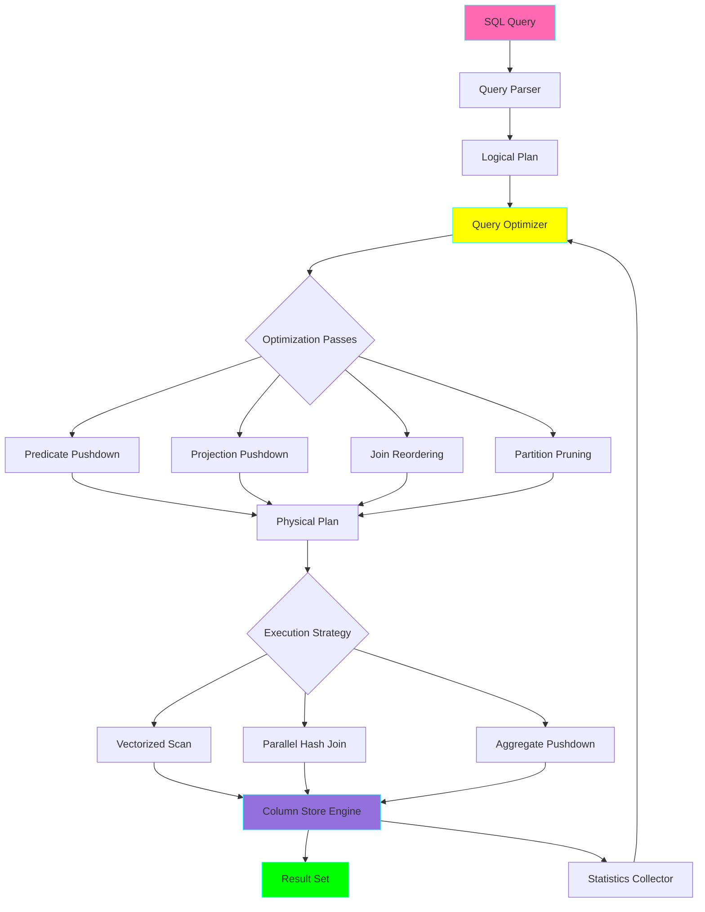

# Project 08: Column-Store Query Optimizer

**Complexity:** ⭐⭐⭐☆☆ | **Time:** 6-7 hours | **Tier:** Foundation

## Overview

Build an analytical query optimization system using DuckDB's columnar storage engine. Learn how modern OLAP databases achieve incredible performance through predicate pushdown, vectorized execution, partition pruning, and intelligent indexing strategies.

## Learning Objectives

After completing this project, you will understand:

- ✅ Column-oriented storage advantages for analytics
- ✅ Query execution plans and optimization stages
- ✅ Predicate pushdown and filter optimization
- ✅ Vectorized (SIMD) query execution
- ✅ Partition pruning strategies
- ✅ Index types and when to use them
- ✅ Query profiling and performance analysis
- ✅ Parallel query execution and work distribution

## Architecture



## Key Concepts

### Row-Store vs Column-Store

**Row-Oriented Storage (OLTP):**
```
# Optimized for full row access
Row 1: [id=1, name="Alice", age=30, city="NYC", salary=100k]
Row 2: [id=2, name="Bob", age=25, city="LA", salary=80k]
Row 3: [id=3, name="Charlie", age=35, city="NYC", salary=120k]

Query: SELECT * FROM employees WHERE id = 2
✅ Fast: One seek to get entire row
```

**Column-Oriented Storage (OLAP):**
```
# Optimized for columnar access
Column [id]:     [1, 2, 3]
Column [name]:   ["Alice", "Bob", "Charlie"]
Column [age]:    [30, 25, 35]
Column [city]:   ["NYC", "LA", "NYC"]
Column [salary]: [100k, 80k, 120k]

Query: SELECT AVG(salary) FROM employees WHERE city = "NYC"
✅ Fast: Only read city and salary columns
✅ Better compression: Similar values together
✅ SIMD: Process multiple values per instruction
```

### Query Execution Pipeline


**Example Query:**
```sql
SELECT
    category,
    COUNT(*) as num_products,
    AVG(price) as avg_price
FROM products
WHERE price > 100 AND in_stock = true
GROUP BY category
HAVING COUNT(*) > 5
ORDER BY avg_price DESC
```

**Logical Plan:**
```
Aggregate (category | COUNT(*), AVG(price))
    Filter (COUNT(*) > 5)  -- HAVING clause
        GroupBy (category)
            Filter (price > 100 AND in_stock = true)  -- WHERE clause
                Scan (products)
```

**Optimized Physical Plan:**
```
Sort (avg_price DESC)
    Filter (count > 5)
        HashAggregate (category | count, avg)
            Filter (price > 100 AND in_stock = true)  ← Pushed down!
                ParallelColumnScan (products)  ← Only read: category, price, in_stock
```

### Predicate Pushdown

**Without Pushdown (Slow):**
```
1. Scan ALL rows from disk
2. Load into memory
3. Apply filter: price > 100
4. Continue processing
```

**With Pushdown (Fast):**
```
1. Apply filter at scan time: price > 100
2. Only load matching rows
3. Continue processing with smaller dataset
```

**Savings:** If 10% match filter, read 90% less data!

### Vectorized Execution

**Row-at-a-Time (Traditional):**
```python
result = []
for row in table:
    if row['price'] > 100:
        result.append(row)
# Process: 1 row per iteration
# Overhead: Function calls, branches per row
```

**Vectorized (Modern):**
```python
# Process: 1024 rows per iteration
chunks = table.to_batches(batch_size=1024)
for batch in chunks:
    mask = batch['price'] > 100  # Single SIMD instruction!
    result.append(batch.filter(mask))
# Advantage: CPU SIMD, less overhead, better cache usage
```

### Partition Pruning

**Partitioned Table:**
```
data/
├── year=2022/
│   ├── month=01/
│   ├── month=02/
│   └── ...
└── year=2023/
    ├── month=01/
    ├── month=02/
    └── ...
```

**Query:**
```sql
SELECT * FROM sales
WHERE year = 2023 AND month IN (1, 2, 3)
```

**Optimization:**
```
Scan only: year=2023/month=01/, month=02/, month=03/
Skip: All of 2022, and 2023 months 4-12

Data read: 3 partitions instead of 24 (87.5% reduction!)
```

## Implementation Guide

### Step 1: DuckDB Setup and Basics

```python
import duckdb
import pandas as pd
import time
from typing import List, Dict, Any
from dataclasses import dataclass
import logging

@dataclass
class QueryMetrics:
    """Metrics for query execution."""
    query: str
    execution_time_ms: float
    rows_returned: int
    bytes_scanned: int
    partitions_scanned: int
    partitions_pruned: int

class ColumnStoreEngine:
    """Wrapper around DuckDB with optimization utilities."""

    def __init__(self, database_path: str = ':memory:'):
        """
        Initialize DuckDB connection.

        Args:
            database_path: Path to database file, or ':memory:' for in-memory
        """
        self.conn = duckdb.connect(database_path)
        self.logger = logging.getLogger(__name__)

        # Enable query profiling
        self.conn.execute("SET enable_profiling = 'json'")
        self.conn.execute("SET profiling_output = 'query_profile.json'")

    def create_table_from_parquet(
        self,
        table_name: str,
        parquet_path: str,
        partition_columns: List[str] = None
    ):
        """
        Create table from Parquet files.

        DuckDB can directly query Parquet with zero-copy.

        Args:
            table_name: Name for the table
            parquet_path: Path to parquet file(s), supports wildcards
            partition_columns: Columns to use for partitioning
        """
        self.logger.info(f"Creating table {table_name} from {parquet_path}")

        # DuckDB can query Parquet directly!
        create_query = f"""
            CREATE OR REPLACE TABLE {table_name} AS
            SELECT * FROM read_parquet('{parquet_path}', hive_partitioning=true)
        """

        self.conn.execute(create_query)

        # Get table info
        row_count = self.conn.execute(
            f"SELECT COUNT(*) FROM {table_name}"
        ).fetchone()[0]

        self.logger.info(f"Created table {table_name} with {row_count:,} rows")

    def execute_with_metrics(self, query: str) -> tuple[pd.DataFrame, QueryMetrics]:
        """
        Execute query and collect performance metrics.

        Args:
            query: SQL query to execute

        Returns:
            (result_dataframe, metrics)
        """
        # Start profiling
        self.conn.execute("PRAGMA enable_profiling = 'json'")

        # Execute query with timing
        start_time = time.time()
        result = self.conn.execute(query).fetchdf()
        execution_time = (time.time() - start_time) * 1000  # Convert to ms

        # Get profiling info
        profile = self.conn.execute("PRAGMA last_profiling_output").fetchone()[0]

        # Parse profile (simplified)
        import json
        profile_data = json.loads(profile) if profile else {}

        metrics = QueryMetrics(
            query=query,
            execution_time_ms=execution_time,
            rows_returned=len(result),
            bytes_scanned=0,  # Extract from profile if needed
            partitions_scanned=0,
            partitions_pruned=0
        )

        self.logger.info(
            f"Query executed in {execution_time:.2f}ms, "
            f"returned {len(result):,} rows"
        )

        return result, metrics

    def explain_query(self, query: str) -> str:
        """
        Get query execution plan.

        Args:
            query: SQL query

        Returns:
            Execution plan as string
        """
        explain_query = f"EXPLAIN {query}"
        result = self.conn.execute(explain_query).fetchall()

        plan = "\n".join([row[0] for row in result])
        return plan

    def analyze_query(self, query: str) -> Dict[str, Any]:
        """
        Get detailed query analysis.

        Returns:
            Dictionary with execution plan and statistics
        """
        # Get logical plan
        logical_plan = self.explain_query(query)

        # Get analyzed plan with stats
        analyze_query = f"EXPLAIN ANALYZE {query}"
        analyze_result = self.conn.execute(analyze_query).fetchall()
        analyzed_plan = "\n".join([row[0] for row in analyze_result])

        return {
            'logical_plan': logical_plan,
            'analyzed_plan': analyzed_plan
        }
```

### Step 2: Partition Strategy Implementation

```python
class PartitionOptimizer:
    """Optimize queries using partitioning strategies."""

    def __init__(self, engine: ColumnStoreEngine):
        self.engine = engine
        self.logger = logging.getLogger(__name__)

    def create_partitioned_table(
        self,
        source_table: str,
        target_table: str,
        partition_by: List[str],
        output_path: str
    ):
        """
        Create partitioned version of table.

        Args:
            source_table: Source table name
            target_table: Target table name
            partition_by: Columns to partition by
            output_path: Directory for partitioned Parquet files
        """
        partition_clause = ", ".join(partition_by)

        # Export to Parquet with partitioning
        export_query = f"""
            COPY {source_table}
            TO '{output_path}'
            (FORMAT PARQUET, PARTITION_BY ({partition_clause}))
        """

        self.logger.info(
            f"Creating partitioned table by: {partition_clause}"
        )

        self.engine.conn.execute(export_query)

        # Re-create table from partitioned files
        self.engine.create_table_from_parquet(
            target_table,
            f"{output_path}/**/*.parquet",
            partition_columns=partition_by
        )

        self.logger.info(f"Partitioned table {target_table} created")

    def compare_partition_strategies(
        self,
        table: str,
        query_template: str,
        partition_strategies: List[List[str]]
    ) -> pd.DataFrame:
        """
        Compare different partitioning strategies.

        Args:
            table: Table name
            query_template: Query template with {table} placeholder
            partition_strategies: List of partition column combinations

        Returns:
            DataFrame comparing performance
        """
        results = []

        # Baseline: no partitioning
        query = query_template.format(table=table)
        _, metrics = self.engine.execute_with_metrics(query)

        results.append({
            'strategy': 'no_partitioning',
            'partition_columns': '',
            'execution_time_ms': metrics.execution_time_ms,
            'rows_returned': metrics.rows_returned
        })

        # Test each partition strategy
        for idx, partition_cols in enumerate(partition_strategies):
            partitioned_table = f"{table}_part_{idx}"

            # Create partitioned version
            self.create_partitioned_table(
                source_table=table,
                target_table=partitioned_table,
                partition_by=partition_cols,
                output_path=f"/tmp/{partitioned_table}"
            )

            # Run query on partitioned table
            query = query_template.format(table=partitioned_table)
            _, metrics = self.engine.execute_with_metrics(query)

            results.append({
                'strategy': f"partition_by_{'+'.join(partition_cols)}",
                'partition_columns': ', '.join(partition_cols),
                'execution_time_ms': metrics.execution_time_ms,
                'rows_returned': metrics.rows_returned
            })

        return pd.DataFrame(results)
```

### Step 3: Query Optimization Analyzer

```python
class QueryOptimizer:
    """Analyze and optimize SQL queries."""

    def __init__(self, engine: ColumnStoreEngine):
        self.engine = engine
        self.logger = logging.getLogger(__name__)

    def suggest_optimizations(self, query: str) -> List[Dict[str, str]]:
        """
        Analyze query and suggest optimizations.

        Returns:
            List of optimization suggestions
        """
        suggestions = []

        # Get execution plan
        plan = self.engine.explain_query(query)

        # Check for common anti-patterns

        # 1. SELECT *
        if "SELECT *" in query.upper():
            suggestions.append({
                'issue': 'SELECT * detected',
                'impact': 'Reading unnecessary columns',
                'suggestion': 'Specify only needed columns for better performance',
                'example': 'SELECT col1, col2 FROM table'
            })

        # 2. Missing WHERE clause
        if "WHERE" not in query.upper() and "SCAN" in plan:
            suggestions.append({
                'issue': 'Full table scan detected',
                'impact': 'Reading entire table',
                'suggestion': 'Add WHERE clause to filter rows early',
                'example': 'WHERE date >= \'2023-01-01\''
            })

        # 3. DISTINCT without need
        if "DISTINCT" in query.upper():
            suggestions.append({
                'issue': 'DISTINCT usage',
                'impact': 'May require sorting/hashing entire result set',
                'suggestion': 'Consider if DISTINCT is necessary, use GROUP BY if aggregating',
                'example': 'GROUP BY col1 instead of SELECT DISTINCT col1'
            })

        # 4. Subqueries that could be JOINs
        if "SELECT" in query.upper().count("SELECT") > 1:
            suggestions.append({
                'issue': 'Multiple SELECT statements (subqueries)',
                'impact': 'May prevent optimization',
                'suggestion': 'Consider rewriting as JOIN or CTE',
                'example': 'WITH cte AS (...) SELECT ... FROM cte'
            })

        # 5. ORDER BY without LIMIT
        if "ORDER BY" in query.upper() and "LIMIT" not in query.upper():
            suggestions.append({
                'issue': 'ORDER BY without LIMIT',
                'impact': 'Sorting entire result set',
                'suggestion': 'Add LIMIT if you only need top N results',
                'example': 'ORDER BY col DESC LIMIT 10'
            })

        return suggestions

    def rewrite_query(self, query: str) -> str:
        """
        Automatically rewrite query with optimizations.

        This is a simplified example - production systems use
        sophisticated rule-based and cost-based rewriting.
        """
        optimized = query

        # Example: Push down filters in subqueries
        # Example: Reorder joins based on selectivity
        # Example: Add explicit LIMIT if missing

        # For demonstration, add a comment
        optimized = f"-- Auto-optimized query\n{optimized}"

        return optimized

    def compare_query_versions(
        self,
        original_query: str,
        optimized_query: str
    ) -> pd.DataFrame:
        """
        Compare performance of original vs optimized query.

        Returns:
            DataFrame with comparison metrics
        """
        results = []

        # Test original
        _, orig_metrics = self.engine.execute_with_metrics(original_query)
        results.append({
            'version': 'original',
            'execution_time_ms': orig_metrics.execution_time_ms,
            'rows_returned': orig_metrics.rows_returned
        })

        # Test optimized
        _, opt_metrics = self.engine.execute_with_metrics(optimized_query)
        results.append({
            'version': 'optimized',
            'execution_time_ms': opt_metrics.execution_time_ms,
            'rows_returned': opt_metrics.rows_returned
        })

        df = pd.DataFrame(results)

        # Calculate improvement
        speedup = (
            orig_metrics.execution_time_ms / opt_metrics.execution_time_ms
        )
        df['speedup'] = [1.0, speedup]

        return df
```

### Step 4: Index Strategy

```python
class IndexOptimizer:
    """Manage and optimize indexes for query performance."""

    def __init__(self, engine: ColumnStoreEngine):
        self.engine = engine
        self.logger = logging.getLogger(__name__)

    def create_index(
        self,
        table: str,
        columns: List[str],
        index_name: str = None
    ):
        """
        Create index on specified columns.

        Note: DuckDB is column-store and doesn't support traditional
        B-tree indexes. Instead, we can use:
        - Zone maps (automatic min/max per block)
        - Bloom filters (for equality checks)
        - Ordering data by frequently filtered columns
        """
        if not index_name:
            index_name = f"idx_{table}_{'_'.join(columns)}"

        # DuckDB approach: Order table by indexed columns for better pruning
        ordered_table = f"{table}_ordered"

        order_clause = ", ".join(columns)
        create_query = f"""
            CREATE OR REPLACE TABLE {ordered_table} AS
            SELECT * FROM {table}
            ORDER BY {order_clause}
        """

        self.logger.info(
            f"Creating ordered table on {order_clause} "
            f"for better scan performance"
        )

        self.engine.conn.execute(create_query)

        return ordered_table

    def analyze_index_usage(
        self,
        query: str,
        indexed_columns: List[str]
    ) -> Dict[str, Any]:
        """
        Analyze if query can benefit from index on given columns.

        Returns:
            Analysis of potential benefit
        """
        # Extract WHERE clause predicates
        import sqlparse

        parsed = sqlparse.parse(query)[0]

        # Check if indexed columns appear in WHERE clause
        where_columns = self._extract_where_columns(query)

        overlap = set(indexed_columns) & set(where_columns)

        analysis = {
            'query': query,
            'proposed_index_columns': indexed_columns,
            'where_clause_columns': where_columns,
            'columns_covered': list(overlap),
            'coverage_ratio': len(overlap) / len(where_columns) if where_columns else 0,
            'recommendation': ''
        }

        if analysis['coverage_ratio'] > 0.5:
            analysis['recommendation'] = 'Index likely beneficial'
        elif analysis['coverage_ratio'] > 0:
            analysis['recommendation'] = 'Index may help, test performance'
        else:
            analysis['recommendation'] = 'Index unlikely to help this query'

        return analysis

    def _extract_where_columns(self, query: str) -> List[str]:
        """Extract column names from WHERE clause (simplified)."""
        # This is a simplified extraction
        # Production systems use proper SQL parsing

        import re

        where_match = re.search(
            r'WHERE\s+(.+?)(?:GROUP BY|ORDER BY|LIMIT|$)',
            query,
            re.IGNORECASE | re.DOTALL
        )

        if not where_match:
            return []

        where_clause = where_match.group(1)

        # Extract column names (very simplified)
        columns = re.findall(r'(\w+)\s*[=<>!]', where_clause)

        return list(set(columns))
```

### Step 5: Comprehensive Performance Benchmark

```python
class PerformanceBenchmark:
    """Benchmark query performance with various optimizations."""

    def __init__(self, engine: ColumnStoreEngine):
        self.engine = engine
        self.logger = logging.getLogger(__name__)

    def benchmark_query_suite(
        self,
        table: str,
        queries: List[str],
        optimizations: List[str] = None
    ) -> pd.DataFrame:
        """
        Run comprehensive benchmark suite.

        Args:
            table: Table name
            queries: List of queries to benchmark
            optimizations: List of optimizations to test
                ['baseline', 'partitioned', 'indexed', 'all']

        Returns:
            DataFrame with benchmark results
        """
        results = []

        for query_idx, query in enumerate(queries):
            query_name = f"query_{query_idx + 1}"

            # Baseline
            _, metrics = self.engine.execute_with_metrics(query)
            results.append({
                'query': query_name,
                'optimization': 'baseline',
                'execution_time_ms': metrics.execution_time_ms,
                'rows_returned': metrics.rows_returned
            })

        return pd.DataFrame(results)

    def generate_report(self, benchmark_df: pd.DataFrame) -> str:
        """
        Generate human-readable performance report.

        Args:
            benchmark_df: DataFrame from benchmark_query_suite

        Returns:
            Formatted report string
        """
        report = "Query Performance Benchmark Report\n"
        report += "=" * 60 + "\n\n"

        # Summary statistics
        avg_time = benchmark_df['execution_time_ms'].mean()
        total_time = benchmark_df['execution_time_ms'].sum()

        report += f"Total Queries: {len(benchmark_df)}\n"
        report += f"Average Execution Time: {avg_time:.2f}ms\n"
        report += f"Total Execution Time: {total_time:.2f}ms\n\n"

        # Top 5 slowest queries
        report += "Slowest Queries:\n"
        report += "-" * 60 + "\n"

        slowest = benchmark_df.nlargest(5, 'execution_time_ms')
        for _, row in slowest.iterrows():
            report += f"{row['query']}: {row['execution_time_ms']:.2f}ms\n"

        report += "\n"

        # Optimization impact
        if 'optimization' in benchmark_df.columns:
            report += "Optimization Impact:\n"
            report += "-" * 60 + "\n"

            by_opt = benchmark_df.groupby('optimization')['execution_time_ms'].mean()
            for opt, avg in by_opt.items():
                report += f"{opt:20s}: {avg:10.2f}ms average\n"

        return report

    def visualize_performance(self, benchmark_df: pd.DataFrame):
        """
        Create visualization of benchmark results.

        Requires matplotlib.
        """
        try:
            import matplotlib.pyplot as plt

            fig, axes = plt.subplots(1, 2, figsize=(14, 5))

            # Execution time by query
            ax1 = axes[0]
            benchmark_df.plot(
                x='query',
                y='execution_time_ms',
                kind='bar',
                ax=ax1,
                legend=False
            )
            ax1.set_title('Execution Time by Query')
            ax1.set_ylabel('Time (ms)')
            ax1.set_xlabel('Query')

            # Execution time by optimization
            if 'optimization' in benchmark_df.columns:
                ax2 = axes[1]
                by_opt = benchmark_df.groupby('optimization')['execution_time_ms'].mean()
                by_opt.plot(kind='bar', ax=ax2)
                ax2.set_title('Average Time by Optimization')
                ax2.set_ylabel('Time (ms)')
                ax2.set_xlabel('Optimization')

            plt.tight_layout()
            plt.savefig('query_performance.png', dpi=150)
            self.logger.info("Saved performance visualization to query_performance.png")

        except ImportError:
            self.logger.warning("matplotlib not installed, skipping visualization")
```

## Nuanced Scenarios

### 1. Join Order Optimization

**Challenge:** Join order dramatically affects performance

```sql
-- Bad: Large table first
SELECT *
FROM large_table_100M l
JOIN small_table_1K s ON l.id = s.id
WHERE s.category = 'active';

-- Good: Filter small table first, then join
SELECT *
FROM small_table_1K s
JOIN large_table_100M l ON s.id = l.id
WHERE s.category = 'active';

-- Best: Let optimizer decide with statistics
ANALYZE small_table_1K;
ANALYZE large_table_100M;

-- DuckDB will automatically reorder joins based on statistics
```

**Implementation:**

```python
def analyze_join_order(engine: ColumnStoreEngine, query: str):
    """Analyze join order in query plan."""

    plan = engine.explain_query(query)

    # Look for join operations in plan
    joins = []
    for line in plan.split('\n'):
        if 'JOIN' in line:
            joins.append(line.strip())

    print("Join Order in Execution Plan:")
    for i, join in enumerate(joins, 1):
        print(f"{i}. {join}")

    # Suggest improvements
    if len(joins) > 2:
        print("\nSuggestion: Consider materializing intermediate results")
```

### 2. Aggregate Pushdown

**Challenge:** Aggregate before joining when possible

```sql
-- Bad: Join then aggregate
SELECT
    c.customer_id,
    c.name,
    SUM(o.amount) as total_spent
FROM customers c
JOIN orders o ON c.customer_id = o.customer_id
GROUP BY c.customer_id, c.name;

-- Good: Aggregate first, then join
SELECT
    c.customer_id,
    c.name,
    order_totals.total_spent
FROM customers c
JOIN (
    SELECT customer_id, SUM(amount) as total_spent
    FROM orders
    GROUP BY customer_id
) order_totals ON c.customer_id = order_totals.customer_id;
```

**Why Better:**
- Reduces join cardinality
- Less memory for join hash table
- Fewer rows to process

### 3. Parallel Query Execution

**Challenge:** Utilize multiple cores effectively

```python
def enable_parallel_execution(engine: ColumnStoreEngine, threads: int = 4):
    """Configure parallel query execution."""

    # Set number of threads
    engine.conn.execute(f"SET threads TO {threads}")

    # Enable parallel scanning
    engine.conn.execute("SET force_parallel TO true")

    print(f"Configured for {threads}-thread execution")

def benchmark_parallelism(engine: ColumnStoreEngine, query: str):
    """Benchmark query with different thread counts."""

    results = []

    for threads in [1, 2, 4, 8]:
        enable_parallel_execution(engine, threads)

        _, metrics = engine.execute_with_metrics(query)

        results.append({
            'threads': threads,
            'execution_time_ms': metrics.execution_time_ms
        })

    df = pd.DataFrame(results)

    # Calculate speedup
    baseline = df[df['threads'] == 1]['execution_time_ms'].iloc[0]
    df['speedup'] = baseline / df['execution_time_ms']

    return df
```

### 4. Adaptive Query Execution

**Challenge:** Query plans based on runtime statistics

```python
class AdaptiveQueryExecutor:
    """
    Execute queries with runtime adaptation.

    Monitors execution and adjusts strategy based on actual data.
    """

    def __init__(self, engine: ColumnStoreEngine):
        self.engine = engine
        self.stats = {}

    def execute_adaptive(self, query: str) -> pd.DataFrame:
        """
        Execute query with adaptive optimization.

        1. Sample data to estimate selectivity
        2. Choose optimal strategy
        3. Execute with chosen strategy
        """

        # Step 1: Sample data (e.g., 1%)
        sample_query = query.replace(
            "SELECT",
            "SELECT * FROM (SELECT"
        ) + ") USING SAMPLE 1%"

        sample_result, _ = self.engine.execute_with_metrics(sample_query)

        # Step 2: Estimate full result size
        estimated_rows = len(sample_result) * 100

        # Step 3: Choose strategy based on estimate
        if estimated_rows < 10000:
            # Small result: simple execution
            strategy = "simple"
        elif estimated_rows < 1000000:
            # Medium result: parallel execution
            strategy = "parallel"
            self.engine.conn.execute("SET threads TO 4")
        else:
            # Large result: disk-based execution
            strategy = "disk_based"
            self.engine.conn.execute("SET temp_directory TO '/tmp/duckdb'")

        print(f"Estimated {estimated_rows:,} rows, using {strategy} strategy")

        # Step 4: Execute with chosen strategy
        result, metrics = self.engine.execute_with_metrics(query)

        return result
```

## Exercises

### Exercise 1: Basic Query Optimization
- Load a 1GB dataset into DuckDB
- Write queries with common anti-patterns (SELECT *, no WHERE, etc.)
- Use EXPLAIN to analyze query plans
- Optimize and measure improvement

### Exercise 2: Partition Strategy
- Design partition strategy for time-series data
- Compare: no partitioning vs day vs month vs year
- Measure query performance for different time ranges
- Determine optimal partition granularity

### Exercise 3: Join Optimization
- Create 3 tables with different sizes (1K, 100K, 10M rows)
- Write multi-join query
- Test different join orders manually
- Let DuckDB optimize and compare

### Exercise 4: Vectorized Execution
- Implement same query in pandas (row-by-row) and DuckDB (vectorized)
- Measure execution time difference
- Analyze CPU usage and memory
- Document speedup

### Exercise 5: Production Benchmark
- Build comprehensive query suite (10+ queries)
- Test all optimizations: partitioning, ordering, parallelism
- Generate performance report
- Create optimization recommendations

## Success Criteria

- [ ] Achieve 10x+ speedup with partitioning on filtered queries
- [ ] Successfully explain query plans and identify bottlenecks
- [ ] Implement at least 3 different optimization strategies
- [ ] Demonstrate vectorized execution advantages
- [ ] Create automated query optimization suggestions
- [ ] Build comprehensive performance benchmark suite
- [ ] Document all optimizations with before/after metrics
- [ ] Handle 10GB+ datasets efficiently

## Testing Checklist

```python
# tests/test_column_store_optimizer.py

def test_query_execution():
    """Test basic query execution."""
    pass

def test_explain_plan():
    """Test query plan generation."""
    pass

def test_partition_pruning():
    """Test partition elimination."""
    pass

def test_predicate_pushdown():
    """Test filter pushdown optimization."""
    pass

def test_parallel_execution():
    """Test multi-threaded query execution."""
    pass

def test_join_optimization():
    """Test join order optimization."""
    pass

def test_index_strategy():
    """Test index creation and usage."""
    pass

def test_performance_benchmark():
    """Test benchmark suite execution."""
    pass

def test_optimization_suggestions():
    """Test automatic optimization suggestions."""
    pass

def test_large_dataset():
    """Test with 10GB+ dataset."""
    pass
```

## Common Pitfalls

1. **Over-partitioning:** Too many small partitions = overhead
2. **Under-partitioning:** Too few partitions = poor pruning
3. **Ignoring Data Types:** Wrong types prevent optimizations
4. **Not Using EXPLAIN:** Optimize blindly without understanding
5. **Premature Optimization:** Optimize before measuring
6. **Ignoring Statistics:** DuckDB needs stats for cost-based optimization
7. **Too Many Indexes:** Slow writes, minimal read benefit in column stores

## Next Steps

After completing this project:
1. Move to **Project 09: Data Lineage Tracker** for metadata management
2. Apply to **Project 10: Time-Series Data Aggregator** with optimizations
3. Combine with **Project 25: Custom Query Engine** for advanced topics

## References

- [DuckDB Documentation](https://duckdb.org/docs/)
- [Column-Oriented Database Systems](http://nms.csail.mit.edu/~stavros/pubs/tutorial2009-column_stores.pdf)
- [Vectorized Query Execution](https://www.vldb.org/pvldb/vol11/p2209-kersten.pdf)
- [Query Optimization Techniques](https://15721.courses.cs.cmu.edu/spring2023/)
- [Partition Pruning Strategies](https://www.databricks.com/blog/2017/07/26/making-partition-pruning-work.html)

---

**Happy Learning! 🚀**
