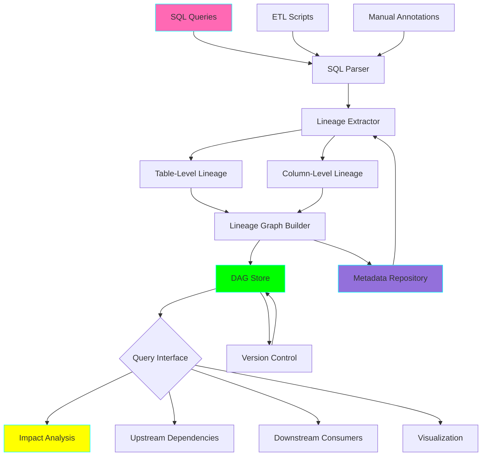
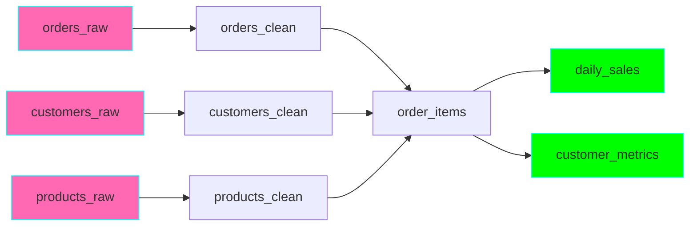

# Project 09: Data Lineage Tracker

**Complexity:** ⭐⭐⭐⭐☆ | **Time:** 8-10 hours | **Tier:** Foundation

## Overview

Build a comprehensive data lineage tracking system that captures table-level and column-level transformations, visualizes data flow as directed acyclic graphs (DAGs), performs impact analysis for schema changes, and automatically extracts lineage from SQL queries. Essential for data governance, debugging, and compliance.

## Learning Objectives

After completing this project, you will understand:

- ✅ Data lineage concepts and importance for governance
- ✅ DAG (Directed Acyclic Graph) representation of data flows
- ✅ Column-level vs table-level lineage tracking
- ✅ Metadata extraction from SQL queries
- ✅ Impact analysis for schema changes
- ✅ Lineage versioning and temporal tracking
- ✅ Provenance tracking for data quality
- ✅ Lineage visualization techniques

## Architecture



## Key Concepts

### Data Lineage vs Data Provenance

**Data Lineage:**
- Shows **HOW** data moves and transforms
- Tracks transformations: source → target
- Answers: "Where did this data come from?"

**Data Provenance:**
- Shows **WHY** and **WHEN** data was created
- Tracks context: who, when, why, how
- Answers: "Who created this? When? Why?"

**Example:**
```
Lineage:
  raw_sales → cleaned_sales → sales_summary → dashboard

Provenance:
  sales_summary created by:
    - User: etl_service_account
    - Time: 2024-01-15 03:00:00
    - Reason: Daily aggregation job
    - Quality: 99.8% complete
```

### Table-Level Lineage

Tracks dependencies between tables/datasets:



### Column-Level Lineage

Tracks transformations of individual columns:

```sql
-- Query:
SELECT
    customer_id,
    CONCAT(first_name, ' ', last_name) as full_name,
    UPPER(email) as email_normalized,
    order_total * 0.9 as discounted_total
FROM orders;

-- Column Lineage:
target.customer_id ← source.customer_id (direct)
target.full_name ← source.first_name + source.last_name (concat)
target.email_normalized ← source.email (transform: upper)
target.discounted_total ← source.order_total (transform: multiply)
```

### DAG Representation

**Properties of Data Lineage DAG:**
- **Directed:** Data flows in one direction
- **Acyclic:** No circular dependencies (would create infinite loops)
- **Nodes:** Tables, columns, or transformations
- **Edges:** Dependencies or transformations

**Example:**
```
Raw Data (Source Nodes)
    ↓
Cleansing Transformations
    ↓
Business Logic Transformations
    ↓
Aggregations
    ↓
Reports/Dashboards (Sink Nodes)
```

### Impact Analysis

**Upstream Impact:** What tables/columns affect this one?
```
Question: If orders_raw schema changes, what breaks?

Answer:
  orders_raw [CHANGE HERE]
    ↓
  orders_clean [AFFECTED]
    ↓
  order_items [AFFECTED]
    ↓
  daily_sales [AFFECTED]
    ↓
  revenue_dashboard [AFFECTED]
```

**Downstream Impact:** What depends on this table/column?
```
Question: If we drop column "customer_tier" from customers table, what breaks?

Answer:
  customers.customer_tier [COLUMN TO DROP]
    → customer_metrics.tier_distribution [WILL BREAK]
    → marketing_dashboard.tier_widget [WILL BREAK]
    → email_campaign.tier_filter [WILL BREAK]
```

## Implementation Guide

### Step 1: Core Lineage Model

```python
from dataclasses import dataclass, field
from typing import List, Dict, Set, Optional
from enum import Enum
import networkx as nx
import logging
from datetime import datetime

class TransformationType(Enum):
    """Types of data transformations."""
    DIRECT = "direct"  # Simple passthrough
    FILTER = "filter"  # WHERE clause
    JOIN = "join"  # Table join
    AGGREGATE = "aggregate"  # GROUP BY, SUM, etc.
    EXPRESSION = "expression"  # Calculated field
    UNION = "union"  # UNION of tables
    SUBQUERY = "subquery"  # Nested query

@dataclass
class DataEntity:
    """Represents a data entity (table or column)."""
    name: str
    entity_type: str  # 'table' or 'column'
    schema: Optional[str] = None
    database: Optional[str] = None
    metadata: Dict = field(default_factory=dict)

    def __hash__(self):
        return hash(f"{self.database}.{self.schema}.{self.name}")

    def __str__(self):
        parts = [p for p in [self.database, self.schema, self.name] if p]
        return ".".join(parts)

@dataclass
class LineageEdge:
    """Represents a lineage relationship between entities."""
    source: DataEntity
    target: DataEntity
    transformation: TransformationType
    transformation_logic: Optional[str] = None
    created_at: datetime = field(default_factory=datetime.now)
    metadata: Dict = field(default_factory=dict)

class LineageGraph:
    """
    Graph-based representation of data lineage.

    Uses NetworkX for graph operations.
    """

    def __init__(self):
        self.graph = nx.DiGraph()
        self.logger = logging.getLogger(__name__)

    def add_entity(self, entity: DataEntity):
        """Add a data entity to the lineage graph."""
        self.graph.add_node(
            str(entity),
            entity=entity,
            type=entity.entity_type,
            metadata=entity.metadata
        )

    def add_lineage(self, edge: LineageEdge):
        """
        Add a lineage relationship.

        Args:
            edge: LineageEdge describing the relationship
        """
        # Ensure nodes exist
        self.add_entity(edge.source)
        self.add_entity(edge.target)

        # Add edge
        self.graph.add_edge(
            str(edge.source),
            str(edge.target),
            transformation=edge.transformation,
            logic=edge.transformation_logic,
            created_at=edge.created_at,
            metadata=edge.metadata
        )

        self.logger.info(
            f"Added lineage: {edge.source} → {edge.target} "
            f"({edge.transformation.value})"
        )

    def get_upstream_dependencies(
        self,
        entity: str,
        depth: int = None
    ) -> Set[str]:
        """
        Get all upstream dependencies (what this entity depends on).

        Args:
            entity: Entity name
            depth: Max depth to traverse (None = unlimited)

        Returns:
            Set of upstream entity names
        """
        if entity not in self.graph:
            return set()

        if depth == 0:
            return set()

        # Get direct predecessors
        predecessors = set(self.graph.predecessors(entity))

        if depth is None or depth > 1:
            # Recursively get upstream dependencies
            all_upstream = predecessors.copy()
            next_depth = None if depth is None else depth - 1

            for pred in predecessors:
                all_upstream.update(
                    self.get_upstream_dependencies(pred, next_depth)
                )

            return all_upstream
        else:
            return predecessors

    def get_downstream_consumers(
        self,
        entity: str,
        depth: int = None
    ) -> Set[str]:
        """
        Get all downstream consumers (what depends on this entity).

        Args:
            entity: Entity name
            depth: Max depth to traverse (None = unlimited)

        Returns:
            Set of downstream entity names
        """
        if entity not in self.graph:
            return set()

        if depth == 0:
            return set()

        # Get direct successors
        successors = set(self.graph.successors(entity))

        if depth is None or depth > 1:
            # Recursively get downstream consumers
            all_downstream = successors.copy()
            next_depth = None if depth is None else depth - 1

            for succ in successors:
                all_downstream.update(
                    self.get_downstream_consumers(succ, next_depth)
                )

            return all_downstream
        else:
            return successors

    def get_lineage_path(
        self,
        source: str,
        target: str
    ) -> List[List[str]]:
        """
        Find all lineage paths from source to target.

        Args:
            source: Source entity name
            target: Target entity name

        Returns:
            List of paths (each path is a list of entity names)
        """
        if source not in self.graph or target not in self.graph:
            return []

        try:
            # Find all simple paths
            paths = list(nx.all_simple_paths(self.graph, source, target))
            return paths
        except nx.NetworkXNoPath:
            return []

    def detect_cycles(self) -> List[List[str]]:
        """
        Detect circular dependencies (should not exist in valid lineage).

        Returns:
            List of cycles found
        """
        try:
            cycles = list(nx.simple_cycles(self.graph))
            if cycles:
                self.logger.warning(f"Found {len(cycles)} cycles in lineage graph!")
            return cycles
        except:
            return []
```

### Step 2: SQL Lineage Extractor

```python
import sqlparse
from sqlparse.sql import IdentifierList, Identifier, Where, Token
from sqlparse.tokens import Keyword, DML

class SQLLineageExtractor:
    """
    Extract lineage information from SQL queries.

    Parses SQL to identify source tables, target tables,
    and column-level transformations.
    """

    def __init__(self):
        self.logger = logging.getLogger(__name__)

    def extract_lineage(self, sql: str) -> Dict[str, any]:
        """
        Extract lineage from SQL query.

        Args:
            sql: SQL query string

        Returns:
            Dictionary with lineage information
        """
        # Parse SQL
        parsed = sqlparse.parse(sql)[0]

        # Determine query type
        query_type = self._get_query_type(parsed)

        if query_type == 'SELECT':
            return self._extract_select_lineage(parsed, sql)
        elif query_type == 'INSERT':
            return self._extract_insert_lineage(parsed, sql)
        elif query_type == 'CREATE':
            return self._extract_create_lineage(parsed, sql)
        elif query_type == 'UPDATE':
            return self._extract_update_lineage(parsed, sql)
        else:
            self.logger.warning(f"Unsupported query type: {query_type}")
            return {}

    def _get_query_type(self, parsed) -> str:
        """Get the type of SQL query."""
        first_token = parsed.token_first(skip_ws=True, skip_cm=True)
        if first_token and first_token.ttype is DML:
            return first_token.value.upper()
        return "UNKNOWN"

    def _extract_select_lineage(
        self,
        parsed,
        sql: str
    ) -> Dict[str, any]:
        """Extract lineage from SELECT query."""
        lineage = {
            'query_type': 'SELECT',
            'source_tables': [],
            'columns': [],
            'filters': [],
            'joins': []
        }

        # Extract FROM clause tables
        from_seen = False
        for token in parsed.tokens:
            if from_seen:
                if isinstance(token, IdentifierList):
                    for identifier in token.get_identifiers():
                        lineage['source_tables'].append(str(identifier))
                elif isinstance(token, Identifier):
                    lineage['source_tables'].append(str(token))

            if token.ttype is Keyword and token.value.upper() == 'FROM':
                from_seen = True

        # Extract SELECT clause columns (simplified)
        select_seen = False
        for token in parsed.tokens:
            if select_seen and token.ttype is not Keyword:
                if isinstance(token, IdentifierList):
                    for identifier in token.get_identifiers():
                        lineage['columns'].append(self._parse_column(identifier))
                elif isinstance(token, Identifier):
                    lineage['columns'].append(self._parse_column(token))
                break

            if token.ttype is DML and token.value.upper() == 'SELECT':
                select_seen = True

        return lineage

    def _extract_insert_lineage(
        self,
        parsed,
        sql: str
    ) -> Dict[str, any]:
        """Extract lineage from INSERT query."""
        lineage = {
            'query_type': 'INSERT',
            'target_table': None,
            'source_lineage': {}
        }

        # Extract target table
        insert_seen = False
        for token in parsed.tokens:
            if insert_seen:
                if token.ttype is not Keyword and str(token).strip():
                    # Clean up table name (remove INTO keyword if present)
                    table_name = str(token).replace('INTO', '').strip()
                    lineage['target_table'] = table_name
                    break

            if token.ttype is DML and token.value.upper() == 'INSERT':
                insert_seen = True

        # If INSERT ... SELECT, extract source lineage
        if 'SELECT' in sql.upper():
            # Find SELECT portion
            select_start = sql.upper().find('SELECT')
            select_query = sql[select_start:]

            # Recursively extract SELECT lineage
            lineage['source_lineage'] = self.extract_lineage(select_query)

        return lineage

    def _extract_create_lineage(
        self,
        parsed,
        sql: str
    ) -> Dict[str, any]:
        """Extract lineage from CREATE TABLE AS SELECT query."""
        lineage = {
            'query_type': 'CREATE',
            'target_table': None,
            'source_lineage': {}
        }

        # Extract target table name
        # Simplified: look for pattern CREATE TABLE <name> AS
        tokens_str = [str(t) for t in parsed.tokens]
        for i, token in enumerate(tokens_str):
            if 'TABLE' in token.upper():
                # Next non-whitespace token should be table name
                for j in range(i + 1, len(tokens_str)):
                    if tokens_str[j].strip():
                        lineage['target_table'] = tokens_str[j].strip()
                        break
                break

        # If CREATE ... AS SELECT, extract source lineage
        if 'SELECT' in sql.upper():
            select_start = sql.upper().find('SELECT')
            select_query = sql[select_start:]
            lineage['source_lineage'] = self.extract_lineage(select_query)

        return lineage

    def _extract_update_lineage(
        self,
        parsed,
        sql: str
    ) -> Dict[str, any]:
        """Extract lineage from UPDATE query."""
        # Simplified implementation
        return {
            'query_type': 'UPDATE',
            'target_table': None,
            'updated_columns': []
        }

    def _parse_column(self, identifier) -> Dict[str, str]:
        """
        Parse column identifier to extract name and alias.

        Args:
            identifier: sqlparse Identifier

        Returns:
            Dictionary with column info
        """
        col_info = {
            'expression': str(identifier),
            'alias': None
        }

        # Check for alias
        if identifier.has_alias():
            col_info['alias'] = identifier.get_alias()
            col_info['expression'] = identifier.get_real_name()

        return col_info

    def build_column_lineage(
        self,
        lineage_info: Dict
    ) -> List[Dict]:
        """
        Build column-level lineage from extracted query info.

        Args:
            lineage_info: Output from extract_lineage

        Returns:
            List of column lineage mappings
        """
        column_lineages = []

        if lineage_info.get('query_type') != 'SELECT':
            return column_lineages

        source_tables = lineage_info.get('source_tables', [])
        columns = lineage_info.get('columns', [])

        for col in columns:
            expression = col['expression']
            alias = col.get('alias') or expression

            # Determine transformation type
            if expression == alias and '(' not in expression:
                # Direct passthrough
                transformation = TransformationType.DIRECT
            elif any(func in expression.upper() for func in ['SUM', 'COUNT', 'AVG', 'MAX', 'MIN']):
                transformation = TransformationType.AGGREGATE
            else:
                transformation = TransformationType.EXPRESSION

            column_lineages.append({
                'source_column': expression,
                'target_column': alias,
                'transformation': transformation,
                'source_tables': source_tables
            })

        return column_lineages
```

### Step 3: Impact Analysis Engine

```python
class ImpactAnalyzer:
    """Analyze impact of changes to data entities."""

    def __init__(self, lineage_graph: LineageGraph):
        self.graph = lineage_graph
        self.logger = logging.getLogger(__name__)

    def analyze_schema_change(
        self,
        entity: str,
        change_type: str
    ) -> Dict[str, any]:
        """
        Analyze impact of schema change.

        Args:
            entity: Entity being changed (table or column)
            change_type: Type of change ('drop', 'rename', 'type_change')

        Returns:
            Impact analysis report
        """
        report = {
            'entity': entity,
            'change_type': change_type,
            'immediate_impact': [],
            'downstream_impact': [],
            'total_affected': 0,
            'criticality': 'low'
        }

        # Get immediate downstream consumers
        immediate = self.graph.get_downstream_consumers(entity, depth=1)
        report['immediate_impact'] = list(immediate)

        # Get all downstream consumers
        all_downstream = self.graph.get_downstream_consumers(entity)
        report['downstream_impact'] = list(all_downstream)
        report['total_affected'] = len(all_downstream)

        # Determine criticality
        if report['total_affected'] == 0:
            report['criticality'] = 'none'
        elif report['total_affected'] < 5:
            report['criticality'] = 'low'
        elif report['total_affected'] < 20:
            report['criticality'] = 'medium'
        else:
            report['criticality'] = 'high'

        self.logger.info(
            f"Impact analysis for {entity}: "
            f"{report['total_affected']} entities affected "
            f"(criticality: {report['criticality']})"
        )

        return report

    def find_root_causes(
        self,
        entity: str,
        max_depth: int = 10
    ) -> List[str]:
        """
        Find root source entities for a given entity.

        Args:
            entity: Target entity
            max_depth: Maximum depth to traverse

        Returns:
            List of root source entities
        """
        # Get all upstream dependencies
        upstream = self.graph.get_upstream_dependencies(entity)

        # Find entities with no predecessors (root sources)
        roots = []
        for node in upstream:
            if len(list(self.graph.graph.predecessors(node))) == 0:
                roots.append(node)

        return roots

    def compare_lineage_versions(
        self,
        version1: LineageGraph,
        version2: LineageGraph
    ) -> Dict[str, any]:
        """
        Compare two versions of lineage graph.

        Useful for tracking lineage changes over time.

        Args:
            version1: Older lineage graph
            version2: Newer lineage graph

        Returns:
            Comparison report
        """
        v1_entities = set(version1.graph.nodes())
        v2_entities = set(version2.graph.nodes())

        v1_edges = set(version1.graph.edges())
        v2_edges = set(version2.graph.edges())

        comparison = {
            'entities_added': list(v2_entities - v1_entities),
            'entities_removed': list(v1_entities - v2_entities),
            'edges_added': list(v2_edges - v1_edges),
            'edges_removed': list(v1_edges - v2_edges),
            'summary': {}
        }

        comparison['summary'] = {
            'total_changes': (
                len(comparison['entities_added']) +
                len(comparison['entities_removed']) +
                len(comparison['edges_added']) +
                len(comparison['edges_removed'])
            ),
            'entities_changed': (
                len(comparison['entities_added']) +
                len(comparison['entities_removed'])
            ),
            'relationships_changed': (
                len(comparison['edges_added']) +
                len(comparison['edges_removed'])
            )
        }

        return comparison
```

### Step 4: Lineage Visualization

```python
class LineageVisualizer:
    """Visualize data lineage graphs."""

    def __init__(self, lineage_graph: LineageGraph):
        self.graph = lineage_graph
        self.logger = logging.getLogger(__name__)

    def generate_dot(
        self,
        entity: str = None,
        depth: int = None,
        direction: str = 'both'
    ) -> str:
        """
        Generate GraphViz DOT format for lineage visualization.

        Args:
            entity: Focus entity (None = entire graph)
            depth: Max depth from focus entity
            direction: 'upstream', 'downstream', or 'both'

        Returns:
            DOT format string
        """
        import graphviz

        dot = graphviz.Digraph(comment='Data Lineage')
        dot.attr(rankdir='LR')  # Left to right

        # Determine which nodes to include
        if entity:
            nodes_to_include = {entity}

            if direction in ['upstream', 'both']:
                nodes_to_include.update(
                    self.graph.get_upstream_dependencies(entity, depth)
                )

            if direction in ['downstream', 'both']:
                nodes_to_include.update(
                    self.graph.get_downstream_consumers(entity, depth)
                )
        else:
            nodes_to_include = set(self.graph.graph.nodes())

        # Add nodes
        for node in nodes_to_include:
            node_data = self.graph.graph.nodes[node]
            entity_type = node_data.get('type', 'unknown')

            # Color by type
            if entity_type == 'table':
                color = 'lightblue'
            elif entity_type == 'column':
                color = 'lightgreen'
            else:
                color = 'lightgray'

            # Highlight focus entity
            if node == entity:
                color = 'yellow'
                dot.node(node, node, style='filled', fillcolor=color, shape='box', penwidth='3')
            else:
                dot.node(node, node, style='filled', fillcolor=color, shape='box')

        # Add edges
        for source, target in self.graph.graph.edges():
            if source in nodes_to_include and target in nodes_to_include:
                edge_data = self.graph.graph.edges[source, target]
                transformation = edge_data.get('transformation', 'unknown')

                dot.edge(source, target, label=str(transformation.value))

        return dot.source

    def save_visualization(
        self,
        output_path: str,
        entity: str = None,
        depth: int = None,
        format: str = 'png'
    ):
        """
        Save lineage visualization to file.

        Args:
            output_path: Output file path (without extension)
            entity: Focus entity
            depth: Max depth
            format: Output format ('png', 'svg', 'pdf')
        """
        try:
            import graphviz

            dot_source = self.generate_dot(entity, depth)
            dot = graphviz.Source(dot_source)
            dot.render(output_path, format=format, cleanup=True)

            self.logger.info(f"Saved lineage visualization to {output_path}.{format}")

        except ImportError:
            self.logger.error("graphviz not installed, cannot save visualization")

    def generate_ascii_tree(
        self,
        entity: str,
        direction: str = 'upstream',
        depth: int = 3
    ) -> str:
        """
        Generate ASCII tree visualization.

        Args:
            entity: Root entity
            direction: 'upstream' or 'downstream'
            depth: Max depth

        Returns:
            ASCII tree string
        """
        tree = f"{entity}\n"

        if direction == 'upstream':
            dependencies = self.graph.get_upstream_dependencies(entity, depth=1)
            prefix = "← "
        else:
            dependencies = self.graph.get_downstream_consumers(entity, depth=1)
            prefix = "→ "

        for dep in sorted(dependencies):
            tree += f"  {prefix}{dep}\n"

            # Recursively add children
            if depth > 1:
                subtree = self.generate_ascii_tree(dep, direction, depth - 1)
                for line in subtree.split('\n')[1:]:  # Skip first line (entity name)
                    if line:
                        tree += f"    {line}\n"

        return tree
```

### Step 5: Complete Lineage Tracker

```python
class DataLineageTracker:
    """Main orchestrator for data lineage tracking."""

    def __init__(self):
        self.lineage_graph = LineageGraph()
        self.sql_extractor = SQLLineageExtractor()
        self.impact_analyzer = ImpactAnalyzer(self.lineage_graph)
        self.visualizer = LineageVisualizer(self.lineage_graph)
        self.logger = logging.getLogger(__name__)

    def track_query(self, sql: str, query_metadata: Dict = None):
        """
        Track lineage from SQL query.

        Args:
            sql: SQL query string
            query_metadata: Additional metadata (job_id, timestamp, etc.)
        """
        # Extract lineage from SQL
        lineage_info = self.sql_extractor.extract_lineage(sql)

        # Build column-level lineage
        column_lineages = self.sql_extractor.build_column_lineage(lineage_info)

        # Add to graph
        for col_lineage in column_lineages:
            source = DataEntity(
                name=col_lineage['source_column'],
                entity_type='column',
                metadata=query_metadata or {}
            )

            target = DataEntity(
                name=col_lineage['target_column'],
                entity_type='column',
                metadata=query_metadata or {}
            )

            edge = LineageEdge(
                source=source,
                target=target,
                transformation=col_lineage['transformation'],
                transformation_logic=sql,
                metadata=query_metadata or {}
            )

            self.lineage_graph.add_lineage(edge)

        self.logger.info(f"Tracked {len(column_lineages)} column lineages from query")

    def analyze_impact(self, entity: str, change_type: str) -> Dict:
        """
        Analyze impact of change to entity.

        Args:
            entity: Entity name
            change_type: Type of change

        Returns:
            Impact analysis report
        """
        return self.impact_analyzer.analyze_schema_change(entity, change_type)

    def visualize(
        self,
        entity: str = None,
        output_path: str = 'lineage',
        format: str = 'png'
    ):
        """
        Visualize lineage graph.

        Args:
            entity: Focus entity (None = entire graph)
            output_path: Output file path
            format: Output format
        """
        self.visualizer.save_visualization(output_path, entity, format=format)

    def export_lineage(self, output_path: str):
        """
        Export lineage graph to JSON file.

        Args:
            output_path: Output JSON file path
        """
        import json
        from networkx.readwrite import json_graph

        graph_data = json_graph.node_link_data(self.lineage_graph.graph)

        with open(output_path, 'w') as f:
            json.dump(graph_data, f, indent=2, default=str)

        self.logger.info(f"Exported lineage to {output_path}")

    def import_lineage(self, input_path: str):
        """
        Import lineage graph from JSON file.

        Args:
            input_path: Input JSON file path
        """
        import json
        from networkx.readwrite import json_graph

        with open(input_path, 'r') as f:
            graph_data = json.load(f)

        self.lineage_graph.graph = json_graph.node_link_graph(graph_data)

        self.logger.info(f"Imported lineage from {input_path}")
```

## Nuanced Scenarios

### 1. Automatic Lineage Extraction from SQL

**Challenge:** Extract lineage from complex SQL with joins, subqueries, CTEs

```python
# Complex query with CTE
sql = """
WITH customer_orders AS (
    SELECT
        c.customer_id,
        c.name,
        COUNT(o.order_id) as order_count,
        SUM(o.total) as total_spent
    FROM customers c
    LEFT JOIN orders o ON c.customer_id = o.customer_id
    GROUP BY c.customer_id, c.name
),
high_value_customers AS (
    SELECT *
    FROM customer_orders
    WHERE total_spent > 10000
)
SELECT
    name,
    order_count,
    total_spent,
    total_spent / order_count as avg_order_value
FROM high_value_customers
ORDER BY total_spent DESC
"""

# Advanced SQL parser would extract:
# - CTE dependencies
# - Join relationships
# - Aggregation transformations
# - Calculated fields
```

### 2. Cross-System Lineage Tracking

**Challenge:** Track lineage across different systems (database → Spark → S3 → dashboard)

```python
class CrossSystemLineageTracker:
    """Track lineage across multiple systems."""

    def track_cross_system_flow(
        self,
        flow_definition: Dict
    ):
        """
        Track lineage across system boundaries.

        Example flow:
        {
            'stages': [
                {
                    'system': 'postgresql',
                    'entity': 'sales.orders',
                    'type': 'source'
                },
                {
                    'system': 'spark',
                    'transformation': 'aggregate_daily_sales.py',
                    'type': 'processing'
                },
                {
                    'system': 's3',
                    'entity': 's3://bucket/daily_sales',
                    'type': 'storage'
                },
                {
                    'system': 'tableau',
                    'entity': 'Sales Dashboard',
                    'type': 'visualization'
                }
            ]
        }
        """
        pass
```

### 3. Temporal Lineage (Time-Travel)

**Challenge:** Track how lineage evolves over time

```python
class TemporalLineageTracker:
    """Track lineage changes over time."""

    def __init__(self):
        self.lineage_snapshots = {}  # timestamp → LineageGraph

    def create_snapshot(self, timestamp: datetime, lineage: LineageGraph):
        """Save lineage snapshot at specific time."""
        self.lineage_snapshots[timestamp] = lineage

    def query_lineage_at_time(
        self,
        entity: str,
        timestamp: datetime
    ) -> Set[str]:
        """Get lineage as it existed at specific time."""
        # Find nearest snapshot before timestamp
        valid_times = [t for t in self.lineage_snapshots if t <= timestamp]

        if not valid_times:
            return set()

        nearest_time = max(valid_times)
        historical_lineage = self.lineage_snapshots[nearest_time]

        return historical_lineage.get_upstream_dependencies(entity)
```

### 4. ML-Based Lineage Prediction

**Challenge:** Predict likely lineage relationships when metadata is incomplete

```python
class LineagePredictor:
    """Use ML to suggest likely lineage relationships."""

    def suggest_lineage(
        self,
        source_table: str,
        target_table: str,
        existing_lineage: LineageGraph
    ) -> float:
        """
        Predict probability of lineage relationship.

        Features:
        - Name similarity
        - Schema similarity
        - Historical patterns
        - Column overlap

        Returns:
            Probability score 0-1
        """
        # Extract features
        features = self._extract_features(source_table, target_table)

        # Use trained model to predict
        # probability = model.predict_proba(features)[1]

        return 0.0  # Placeholder
```

## Exercises

### Exercise 1: Basic Lineage Tracking
- Create lineage graph with 5 tables
- Add table-level dependencies
- Query upstream/downstream relationships
- Visualize the graph

### Exercise 2: SQL Lineage Extraction
- Parse 10 different SQL queries (SELECT, INSERT, CREATE)
- Extract table and column lineage
- Build lineage graph automatically
- Compare with manual annotation

### Exercise 3: Impact Analysis
- Simulate dropping a column from source table
- Perform impact analysis
- Identify all affected downstream entities
- Generate impact report

### Exercise 4: Column-Level Lineage
- Track transformations across 3-stage pipeline
- Map individual columns through transformations
- Identify transformation types (aggregate, filter, etc.)
- Visualize column flow

### Exercise 5: Production System
- Build lineage tracker for real data warehouse
- Integrate with query logs
- Create automated lineage discovery
- Build impact analysis dashboard

## Success Criteria

- [ ] Track table-level lineage for 20+ tables
- [ ] Extract column-level lineage from SQL queries
- [ ] Perform impact analysis for schema changes
- [ ] Visualize lineage as DAG (graphical or ASCII)
- [ ] Handle complex SQL (joins, subqueries, CTEs)
- [ ] Detect circular dependencies if present
- [ ] Export/import lineage metadata
- [ ] Support lineage versioning over time

## Testing Checklist

```python
# tests/test_lineage_tracker.py

def test_add_lineage():
    """Test adding lineage relationships."""
    pass

def test_upstream_dependencies():
    """Test querying upstream dependencies."""
    pass

def test_downstream_consumers():
    """Test querying downstream consumers."""
    pass

def test_sql_extraction():
    """Test SQL lineage extraction."""
    pass

def test_column_lineage():
    """Test column-level lineage tracking."""
    pass

def test_impact_analysis():
    """Test impact analysis for changes."""
    pass

def test_cycle_detection():
    """Test circular dependency detection."""
    pass

def test_lineage_export_import():
    """Test exporting and importing lineage."""
    pass

def test_visualization():
    """Test lineage visualization generation."""
    pass

def test_temporal_lineage():
    """Test time-based lineage queries."""
    pass
```

## Common Pitfalls

1. **Incomplete SQL Parsing:** Basic regex won't handle complex SQL
2. **Missing Metadata:** Track who/when/why for each lineage entry
3. **No Versioning:** Lineage changes over time, track history
4. **Performance:** Large graphs can be slow, use indexing
5. **Circular Dependencies:** Validate DAG property
6. **Cross-System Gaps:** Track lineage across all systems
7. **Manual Maintenance:** Automate lineage extraction

## Next Steps

After completing this project:
1. Move to **Project 10: Time-Series Data Aggregator**
2. Combine with **Project 07: Multi-Source Data Merger** for complete MDM
3. Apply to **Project 27: Data Quality Observability Platform**

## References

- [Data Lineage Best Practices](https://www.talend.com/resources/what-is-data-lineage/)
- [Apache Atlas Documentation](https://atlas.apache.org/)
- [OpenLineage Specification](https://openlineage.io/)
- [NetworkX Documentation](https://networkx.org/)
- [SQL Parsing with sqlparse](https://sqlparse.readthedocs.io/)

---

**Happy Learning! 🚀**
