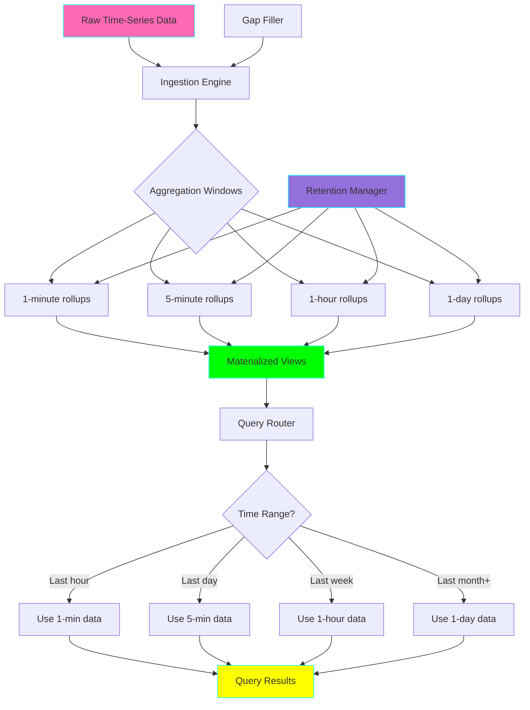
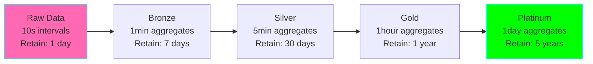

# Project 10: Time-Series Data Aggregator

**Complexity:** ⭐⭐⭐☆☆ | **Time:** 6-8 hours | **Tier:** Foundation

## Overview

Build a sophisticated time-series data aggregation system that handles multiple aggregation windows, rollup strategies, downsampling techniques, and materialized views. Learn how to efficiently store and query time-series data at multiple resolutions for analytics and monitoring applications.

## Learning Objectives

After completing this project, you will understand:

- ✅ Time-series database concepts and patterns
- ✅ Window functions and time-based aggregations
- ✅ Rollup strategies (sum, avg, min, max, percentiles)
- ✅ Downsampling and retention policies
- ✅ Materialized rollup tables for query performance
- ✅ Handling irregular time-series data
- ✅ Gap filling and interpolation strategies
- ✅ Multi-resolution storage architectures

## Architecture



## Key Concepts

### Time-Series Aggregation Windows

**Fixed Windows:**
```
Timeline: 00:00 ──── 00:05 ──── 00:10 ──── 00:15 ──── 00:20
Window 1: [00:00 - 00:05)
Window 2: [00:05 - 00:10)
Window 3: [00:10 - 00:15)
Window 4: [00:15 - 00:20)

✅ Aligned to clock boundaries
✅ No overlap between windows
✅ Easy to materialize and cache
```

**Sliding Windows:**
```
Timeline: ────•────•────•────•────•────•────•────
           00:00 00:01 00:02 00:03 00:04 00:05

5-min sliding window at 00:03:
  [23:58 - 00:03] (last 5 minutes)

✅ Smooth metrics (no cliff at window boundaries)
❌ Expensive to compute (overlapping data)
```

**Tumbling Windows:**
```
Same as fixed windows, but explicitly:
- Non-overlapping
- Fixed duration
- Aligned to epoch or specific timestamp
```

### Rollup Strategies

**Common Aggregations:**

| Aggregation | Use Case | Composable? | Example |
|-------------|----------|-------------|---------|
| **SUM** | Counters, totals | ✅ Yes | Total requests |
| **COUNT** | Event counting | ✅ Yes | Number of users |
| **AVG** | Metrics | ❌ No* | Response time |
| **MIN/MAX** | Extremes | ❌ No* | Peak CPU |
| **P50/P95/P99** | Percentiles | ❌ No | Latency percentiles |
| **STDDEV** | Variance | ❌ No | Jitter |

*Can be made composable with additional metadata (count + sum for avg)

**Composable vs Non-Composable:**

```python
# Composable (SUM):
hour_sum = sum([min1_sum, min2_sum, ..., min60_sum])  ✅

# Non-composable (AVG):
hour_avg ≠ avg([min1_avg, min2_avg, ..., min60_avg])  ❌

# Solution for AVG:
hour_avg = sum([min1_sum, min2_sum, ...]) / sum([min1_count, min2_count, ...])  ✅
```

### Multi-Resolution Storage

**Medallion Pattern for Time-Series:**



**Benefits:**
- Query performance: Use appropriate resolution
- Storage efficiency: Delete high-res old data
- Cost optimization: Cheaper storage for aggregates

### Gap Filling Strategies

**Problem:** Missing data points in time-series

```
Expected: [t0, t1, t2, t3, t4, t5]
Actual:   [t0, t1, ---, t3, ---, t5]
```

**Strategies:**

1. **Forward Fill:** Use last known value
2. **Backward Fill:** Use next known value
3. **Linear Interpolation:** Linear between points
4. **Zero Fill:** Fill with 0 (for counters)
5. **Null:** Keep gaps as null

```python
# Example: Temperature sensor with gaps
timestamps: [10:00, 10:05,       10:15, 10:20]
values:     [20°C,  21°C,        23°C,  24°C]
                           ↑ missing

# Forward fill:
values:     [20°C,  21°C, 21°C,  23°C,  24°C]

# Linear interpolation:
values:     [20°C,  21°C, 22°C,  23°C,  24°C]
```

### Retention Policies

**Define data lifecycle:**

```yaml
retention_policy:
  raw_data:
    resolution: 10s
    retain_for: 24h
    action: downsample_to_1min

  minute_data:
    resolution: 1min
    retain_for: 7d
    action: downsample_to_5min

  hourly_data:
    resolution: 1h
    retain_for: 1y
    action: archive_to_s3

  daily_data:
    resolution: 1d
    retain_for: 5y
    action: delete
```

## Implementation Guide

### Step 1: Time-Series Data Model

```python
from dataclasses import dataclass
from datetime import datetime, timedelta
from typing import Dict, List, Optional, Any
import pandas as pd
import numpy as np
from enum import Enum
import logging

class AggregationFunction(Enum):
    """Supported aggregation functions."""
    SUM = "sum"
    COUNT = "count"
    AVG = "avg"
    MIN = "min"
    MAX = "max"
    FIRST = "first"
    LAST = "last"
    STDDEV = "stddev"
    PERCENTILE_50 = "p50"
    PERCENTILE_95 = "p95"
    PERCENTILE_99 = "p99"

@dataclass
class TimeSeriesMetric:
    """Represents a time-series metric."""
    metric_name: str
    timestamp: datetime
    value: float
    tags: Dict[str, str] = None
    metadata: Dict[str, Any] = None

@dataclass
class AggregationWindow:
    """Configuration for aggregation window."""
    name: str
    interval: timedelta
    aggregations: List[AggregationFunction]
    retention_period: Optional[timedelta] = None

class TimeSeriesStorage:
    """
    Storage layer for time-series data.

    Supports multiple resolutions and retention policies.
    """

    def __init__(self):
        self.data: Dict[str, pd.DataFrame] = {}
        self.logger = logging.getLogger(__name__)

    def write_raw(
        self,
        metric_name: str,
        datapoints: List[TimeSeriesMetric]
    ):
        """
        Write raw time-series data points.

        Args:
            metric_name: Name of the metric
            datapoints: List of TimeSeriesMetric objects
        """
        if not datapoints:
            return

        # Convert to DataFrame
        data = {
            'timestamp': [dp.timestamp for dp in datapoints],
            'value': [dp.value for dp in datapoints],
        }

        # Add tags as columns
        if datapoints[0].tags:
            for tag_key in datapoints[0].tags.keys():
                data[tag_key] = [dp.tags.get(tag_key) for dp in datapoints]

        df = pd.DataFrame(data)
        df = df.set_index('timestamp')
        df = df.sort_index()

        # Append or create
        if metric_name in self.data:
            self.data[metric_name] = pd.concat([self.data[metric_name], df])
            # Remove duplicates (keep last)
            self.data[metric_name] = self.data[metric_name][
                ~self.data[metric_name].index.duplicated(keep='last')
            ]
        else:
            self.data[metric_name] = df

        self.logger.info(
            f"Wrote {len(datapoints)} points for {metric_name}"
        )

    def read_range(
        self,
        metric_name: str,
        start_time: datetime,
        end_time: datetime,
        tags: Dict[str, str] = None
    ) -> pd.DataFrame:
        """
        Read time-series data for a time range.

        Args:
            metric_name: Name of the metric
            start_time: Start of time range
            end_time: End of time range
            tags: Optional tag filters

        Returns:
            DataFrame with time-series data
        """
        if metric_name not in self.data:
            return pd.DataFrame()

        df = self.data[metric_name]

        # Filter by time range
        df = df.loc[start_time:end_time]

        # Filter by tags
        if tags:
            for tag_key, tag_value in tags.items():
                if tag_key in df.columns:
                    df = df[df[tag_key] == tag_value]

        return df

    def delete_before(
        self,
        metric_name: str,
        before_time: datetime
    ):
        """
        Delete data points before specified time.

        Used for retention policy enforcement.

        Args:
            metric_name: Name of the metric
            before_time: Delete everything before this time
        """
        if metric_name not in self.data:
            return

        original_size = len(self.data[metric_name])

        self.data[metric_name] = self.data[metric_name].loc[before_time:]

        deleted_count = original_size - len(self.data[metric_name])

        self.logger.info(
            f"Deleted {deleted_count} points from {metric_name} "
            f"before {before_time}"
        )
```

### Step 2: Aggregation Engine

```python
class TimeSeriesAggregator:
    """
    Aggregate time-series data into multiple resolutions.
    """

    def __init__(self, storage: TimeSeriesStorage):
        self.storage = storage
        self.logger = logging.getLogger(__name__)

    def aggregate(
        self,
        metric_name: str,
        window: AggregationWindow,
        start_time: datetime,
        end_time: datetime,
        group_by_tags: List[str] = None
    ) -> pd.DataFrame:
        """
        Aggregate time-series data for a window.

        Args:
            metric_name: Name of the metric
            window: Aggregation window configuration
            start_time: Start of aggregation period
            end_time: End of aggregation period
            group_by_tags: Tags to group by

        Returns:
            DataFrame with aggregated data
        """
        # Read raw data
        df = self.storage.read_range(metric_name, start_time, end_time)

        if df.empty:
            return df

        # Resample to window interval
        resampler = df.resample(window.interval)

        # Group by tags if specified
        if group_by_tags:
            grouper = [pd.Grouper(freq=window.interval)] + group_by_tags
            resampler = df.groupby(grouper)

        # Apply aggregations
        results = {}

        for agg_func in window.aggregations:
            if agg_func == AggregationFunction.SUM:
                results['sum'] = resampler['value'].sum()

            elif agg_func == AggregationFunction.COUNT:
                results['count'] = resampler['value'].count()

            elif agg_func == AggregationFunction.AVG:
                results['avg'] = resampler['value'].mean()

            elif agg_func == AggregationFunction.MIN:
                results['min'] = resampler['value'].min()

            elif agg_func == AggregationFunction.MAX:
                results['max'] = resampler['value'].max()

            elif agg_func == AggregationFunction.FIRST:
                results['first'] = resampler['value'].first()

            elif agg_func == AggregationFunction.LAST:
                results['last'] = resampler['value'].last()

            elif agg_func == AggregationFunction.STDDEV:
                results['stddev'] = resampler['value'].std()

            elif agg_func == AggregationFunction.PERCENTILE_50:
                results['p50'] = resampler['value'].quantile(0.5)

            elif agg_func == AggregationFunction.PERCENTILE_95:
                results['p95'] = resampler['value'].quantile(0.95)

            elif agg_func == AggregationFunction.PERCENTILE_99:
                results['p99'] = resampler['value'].quantile(0.99)

        # Combine results
        if results:
            agg_df = pd.DataFrame(results)
        else:
            agg_df = pd.DataFrame()

        self.logger.info(
            f"Aggregated {len(df)} points into {len(agg_df)} "
            f"{window.interval} windows"
        )

        return agg_df

    def create_rollup_table(
        self,
        source_metric: str,
        target_metric: str,
        window: AggregationWindow,
        start_time: datetime,
        end_time: datetime
    ):
        """
        Create materialized rollup table.

        Args:
            source_metric: Source metric name
            target_metric: Target rollup table name
            window: Aggregation window
            start_time: Start time
            end_time: End time
        """
        # Perform aggregation
        agg_df = self.aggregate(
            source_metric,
            window,
            start_time,
            end_time
        )

        # Store as new metric
        if not agg_df.empty:
            # Convert back to TimeSeriesMetric format
            datapoints = []
            for timestamp, row in agg_df.iterrows():
                for col in agg_df.columns:
                    dp = TimeSeriesMetric(
                        metric_name=f"{target_metric}.{col}",
                        timestamp=timestamp,
                        value=row[col],
                        tags={'aggregation': col}
                    )
                    datapoints.append(dp)

            self.storage.write_raw(target_metric, datapoints)

            self.logger.info(
                f"Created rollup table {target_metric} "
                f"with {len(datapoints)} points"
            )
```

### Step 3: Gap Filling and Interpolation

```python
class GapFiller:
    """Fill gaps in time-series data."""

    @staticmethod
    def fill_gaps(
        df: pd.DataFrame,
        method: str = 'ffill',
        limit: int = None
    ) -> pd.DataFrame:
        """
        Fill missing values in time-series.

        Args:
            df: Time-series DataFrame
            method: 'ffill', 'bfill', 'linear', 'zero', 'none'
            limit: Maximum number of consecutive gaps to fill

        Returns:
            DataFrame with filled gaps
        """
        if method == 'ffill':
            # Forward fill
            return df.fillna(method='ffill', limit=limit)

        elif method == 'bfill':
            # Backward fill
            return df.fillna(method='bfill', limit=limit)

        elif method == 'linear':
            # Linear interpolation
            return df.interpolate(method='linear', limit=limit)

        elif method == 'zero':
            # Fill with zero
            return df.fillna(0)

        elif method == 'none':
            # Keep gaps as-is
            return df

        else:
            raise ValueError(f"Unknown fill method: {method}")

    @staticmethod
    def detect_gaps(
        df: pd.DataFrame,
        expected_interval: timedelta,
        tolerance: timedelta = None
    ) -> List[Dict]:
        """
        Detect gaps in time-series data.

        Args:
            df: Time-series DataFrame
            expected_interval: Expected time between points
            tolerance: Acceptable deviation from expected interval

        Returns:
            List of gap information
        """
        if tolerance is None:
            tolerance = expected_interval * 0.1

        gaps = []

        for i in range(len(df) - 1):
            current_time = df.index[i]
            next_time = df.index[i + 1]

            actual_interval = next_time - current_time
            expected = expected_interval

            # Check if gap exceeds expected interval
            if actual_interval > (expected + tolerance):
                gaps.append({
                    'start': current_time,
                    'end': next_time,
                    'duration': actual_interval,
                    'expected_interval': expected,
                    'missing_points': int(actual_interval / expected) - 1
                })

        return gaps

    @staticmethod
    def fill_regular_timestamps(
        df: pd.DataFrame,
        interval: timedelta,
        method: str = 'ffill'
    ) -> pd.DataFrame:
        """
        Create regular timestamp grid and fill values.

        Args:
            df: Irregular time-series DataFrame
            interval: Desired interval
            method: Fill method

        Returns:
            DataFrame with regular timestamps
        """
        if df.empty:
            return df

        # Create regular timestamp range
        start = df.index.min().floor(interval)
        end = df.index.max().ceil(interval)

        regular_index = pd.date_range(start, end, freq=interval)

        # Reindex to regular grid
        regular_df = df.reindex(regular_index)

        # Fill gaps
        regular_df = GapFiller.fill_gaps(regular_df, method=method)

        return regular_df
```

### Step 4: Retention Policy Manager

```python
@dataclass
class RetentionPolicy:
    """Retention policy configuration."""
    metric_pattern: str  # Regex pattern for metric names
    retention_period: timedelta
    downsample_to: Optional[AggregationWindow] = None
    archive_location: Optional[str] = None

class RetentionManager:
    """Manage data retention policies."""

    def __init__(self, storage: TimeSeriesStorage, aggregator: TimeSeriesAggregator):
        self.storage = storage
        self.aggregator = aggregator
        self.policies: List[RetentionPolicy] = []
        self.logger = logging.getLogger(__name__)

    def add_policy(self, policy: RetentionPolicy):
        """Add retention policy."""
        self.policies.append(policy)
        self.logger.info(
            f"Added retention policy: {policy.metric_pattern} → "
            f"{policy.retention_period}"
        )

    def enforce_policies(self):
        """
        Enforce all retention policies.

        Called periodically (e.g., daily).
        """
        import re

        now = datetime.now()

        for policy in self.policies:
            pattern = re.compile(policy.metric_pattern)

            # Find matching metrics
            for metric_name in list(self.storage.data.keys()):
                if pattern.match(metric_name):
                    self._enforce_policy(metric_name, policy, now)

    def _enforce_policy(
        self,
        metric_name: str,
        policy: RetentionPolicy,
        current_time: datetime
    ):
        """Enforce policy on specific metric."""
        cutoff_time = current_time - policy.retention_period

        # Get data before cutoff
        df = self.storage.read_range(
            metric_name,
            datetime.min,
            cutoff_time
        )

        if df.empty:
            return

        # Downsample if specified
        if policy.downsample_to:
            self.logger.info(
                f"Downsampling {metric_name} data before {cutoff_time}"
            )

            self.aggregator.create_rollup_table(
                source_metric=metric_name,
                target_metric=f"{metric_name}_downsampled",
                window=policy.downsample_to,
                start_time=df.index.min(),
                end_time=cutoff_time
            )

        # Archive if specified
        if policy.archive_location:
            self.logger.info(
                f"Archiving {metric_name} to {policy.archive_location}"
            )
            # Save to archive (e.g., S3, cold storage)
            df.to_parquet(
                f"{policy.archive_location}/{metric_name}_{cutoff_time}.parquet"
            )

        # Delete old data
        self.storage.delete_before(metric_name, cutoff_time)

        self.logger.info(
            f"Enforced retention policy on {metric_name}: "
            f"deleted {len(df)} points before {cutoff_time}"
        )
```

### Step 5: Query Router with Auto-Resolution Selection

```python
class TimeSeriesQueryRouter:
    """
    Intelligent query router.

    Automatically selects optimal data resolution based on query range.
    """

    def __init__(self, storage: TimeSeriesStorage):
        self.storage = storage
        self.resolution_map: List[Dict] = []
        self.logger = logging.getLogger(__name__)

    def register_resolution(
        self,
        resolution: timedelta,
        metric_suffix: str,
        max_range: timedelta
    ):
        """
        Register an available data resolution.

        Args:
            resolution: Time interval of this resolution
            metric_suffix: Suffix to append to metric name
            max_range: Maximum time range this resolution should be used for
        """
        self.resolution_map.append({
            'resolution': resolution,
            'suffix': metric_suffix,
            'max_range': max_range
        })

        # Sort by resolution (finest first)
        self.resolution_map.sort(key=lambda x: x['resolution'])

        self.logger.info(
            f"Registered resolution: {resolution} (suffix: {metric_suffix})"
        )

    def query(
        self,
        metric_name: str,
        start_time: datetime,
        end_time: datetime,
        tags: Dict[str, str] = None
    ) -> pd.DataFrame:
        """
        Query time-series data with automatic resolution selection.

        Args:
            metric_name: Base metric name
            start_time: Query start time
            end_time: Query end time
            tags: Optional tag filters

        Returns:
            DataFrame with query results
        """
        query_range = end_time - start_time

        # Select appropriate resolution
        selected_resolution = None

        for res_config in self.resolution_map:
            if query_range <= res_config['max_range']:
                selected_resolution = res_config
                break

        # Default to coarsest resolution if range is very large
        if not selected_resolution:
            selected_resolution = self.resolution_map[-1]

        # Build metric name with resolution suffix
        full_metric_name = f"{metric_name}{selected_resolution['suffix']}"

        self.logger.info(
            f"Query range {query_range} → using resolution "
            f"{selected_resolution['resolution']} "
            f"(metric: {full_metric_name})"
        )

        # Execute query
        result = self.storage.read_range(
            full_metric_name,
            start_time,
            end_time,
            tags
        )

        return result
```

### Step 6: Complete Time-Series Pipeline

```python
class TimeSeriesPipeline:
    """
    Complete time-series data pipeline.

    Handles ingestion, aggregation, retention, and querying.
    """

    def __init__(self):
        self.storage = TimeSeriesStorage()
        self.aggregator = TimeSeriesAggregator(self.storage)
        self.retention_manager = RetentionManager(self.storage, self.aggregator)
        self.query_router = TimeSeriesQueryRouter(self.storage)
        self.logger = logging.getLogger(__name__)

    def setup_rollup_pipeline(
        self,
        metric_name: str,
        rollup_configs: List[Dict]
    ):
        """
        Setup multi-resolution rollup pipeline.

        Args:
            metric_name: Base metric name
            rollup_configs: List of rollup configurations
                Example: [
                    {
                        'window': timedelta(minutes=1),
                        'aggregations': [SUM, AVG, MAX],
                        'retention': timedelta(days=7),
                        'suffix': '_1min'
                    },
                    {
                        'window': timedelta(hours=1),
                        'aggregations': [SUM, AVG, MAX],
                        'retention': timedelta(days=365),
                        'suffix': '_1hour'
                    }
                ]
        """
        for config in rollup_configs:
            window = AggregationWindow(
                name=f"{metric_name}{config['suffix']}",
                interval=config['window'],
                aggregations=config['aggregations'],
                retention_period=config.get('retention')
            )

            # Register with query router
            self.query_router.register_resolution(
                resolution=config['window'],
                metric_suffix=config['suffix'],
                max_range=config.get('max_query_range', timedelta(days=30))
            )

            # Add retention policy
            if config.get('retention'):
                policy = RetentionPolicy(
                    metric_pattern=f"{metric_name}{config['suffix']}.*",
                    retention_period=config['retention']
                )
                self.retention_manager.add_policy(policy)

            self.logger.info(
                f"Setup rollup: {metric_name}{config['suffix']} "
                f"at {config['window']} resolution"
            )

    def ingest(self, datapoints: List[TimeSeriesMetric]):
        """
        Ingest raw time-series data points.

        Args:
            datapoints: List of TimeSeriesMetric objects
        """
        # Group by metric name
        by_metric = {}
        for dp in datapoints:
            if dp.metric_name not in by_metric:
                by_metric[dp.metric_name] = []
            by_metric[dp.metric_name].append(dp)

        # Write to storage
        for metric_name, points in by_metric.items():
            self.storage.write_raw(metric_name, points)

    def run_aggregations(self, metric_name: str, end_time: datetime = None):
        """
        Run all configured aggregations for a metric.

        Args:
            metric_name: Metric to aggregate
            end_time: End time for aggregation (default: now)
        """
        if end_time is None:
            end_time = datetime.now()

        # This would run all configured rollup windows
        # Implementation depends on stored rollup configurations
        pass

    def query(
        self,
        metric_name: str,
        start_time: datetime,
        end_time: datetime,
        tags: Dict[str, str] = None
    ) -> pd.DataFrame:
        """
        Query time-series data with automatic resolution selection.

        Args:
            metric_name: Metric to query
            start_time: Query start time
            end_time: Query end time
            tags: Optional tag filters

        Returns:
            DataFrame with results
        """
        return self.query_router.query(metric_name, start_time, end_time, tags)
```

## Nuanced Scenarios

### 1. Irregular Time-Series Handling

**Challenge:** Data arrives at irregular intervals

```python
# Sensor data with irregular timestamps
data = [
    ('2024-01-01 10:00:00', 20.5),
    ('2024-01-01 10:00:03', 20.6),  # 3 seconds later
    ('2024-01-01 10:00:11', 20.8),  # 8 seconds later
    ('2024-01-01 10:01:05', 21.2),  # 54 seconds later
]

# Strategy 1: Resample to regular grid
regular_data = fill_regular_timestamps(
    df,
    interval=timedelta(seconds=10),
    method='linear'  # Interpolate between points
)

# Strategy 2: Use time-weighted averaging
def time_weighted_avg(group):
    """Weight values by time duration."""
    durations = group.index.to_series().diff().shift(-1)
    weights = durations.dt.total_seconds()
    return (group['value'] * weights).sum() / weights.sum()
```

### 2. Seasonal Decomposition

**Challenge:** Extract trend, seasonality, and residuals

```python
from statsmodels.tsa.seasonal import seasonal_decompose

def decompose_time_series(df: pd.DataFrame, period: int = 24):
    """
    Decompose time-series into components.

    Args:
        df: Time-series data
        period: Seasonal period (e.g., 24 for hourly data with daily pattern)

    Returns:
        Decomposition results (trend, seasonal, residual)
    """
    decomposition = seasonal_decompose(
        df['value'],
        model='additive',  # or 'multiplicative'
        period=period
    )

    return {
        'trend': decomposition.trend,
        'seasonal': decomposition.seasonal,
        'residual': decomposition.resid
    }

# Use cases:
# - Remove seasonality before aggregation
# - Anomaly detection on residuals
# - Forecasting future values
```

### 3. Multi-Metric Correlation

**Challenge:** Aggregate correlated metrics together

```python
def correlate_metrics(
    metric1: pd.DataFrame,
    metric2: pd.DataFrame,
    window: str = '1H'
) -> pd.DataFrame:
    """
    Calculate rolling correlation between two metrics.

    Example: Correlate CPU usage with request rate
    """
    # Align timestamps
    combined = pd.concat(
        [metric1['value'].rename('metric1'),
         metric2['value'].rename('metric2')],
        axis=1
    )

    # Calculate rolling correlation
    correlation = combined['metric1'].rolling(window).corr(
        combined['metric2']
    )

    return correlation
```

### 4. Adaptive Aggregation Windows

**Challenge:** Use different window sizes based on data patterns

```python
class AdaptiveAggregator:
    """Adjust aggregation window based on data characteristics."""

    def adaptive_aggregate(
        self,
        df: pd.DataFrame,
        base_window: timedelta,
        variance_threshold: float = 0.1
    ) -> pd.DataFrame:
        """
        Use smaller windows for high-variance periods,
        larger windows for stable periods.
        """
        results = []

        # Calculate rolling variance
        variance = df['value'].rolling(base_window).var()

        current_window = base_window

        for timestamp, var in variance.items():
            if var > variance_threshold:
                # High variance: use smaller window
                current_window = base_window / 2
            else:
                # Low variance: use larger window
                current_window = base_window * 2

            # Aggregate with current window
            # ... implementation ...

        return pd.DataFrame(results)
```

## Exercises

### Exercise 1: Basic Aggregation
- Generate synthetic time-series data (1000 points)
- Aggregate into 1-minute, 5-minute, and 1-hour windows
- Calculate sum, avg, min, max for each window
- Compare storage sizes

### Exercise 2: Gap Filling
- Create time-series with random gaps
- Implement 3 different fill strategies
- Compare accuracy of each method
- Visualize results

### Exercise 3: Multi-Resolution Storage
- Design 4-tier storage (1min, 1hour, 1day, 1month)
- Implement retention policies
- Build query router
- Benchmark query performance at each tier

### Exercise 4: Irregular Time-Series
- Simulate sensor data with irregular intervals
- Resample to regular grid
- Calculate accurate aggregations
- Handle edge cases (no data in window)

### Exercise 5: Production System
- Build complete time-series pipeline for metrics
- Implement automated rollups
- Create retention policies
- Build monitoring dashboard

## Success Criteria

- [ ] Aggregate 1M+ time-series points efficiently
- [ ] Implement at least 3 aggregation windows (1min, 1hour, 1day)
- [ ] Handle irregular time-series data correctly
- [ ] Implement gap filling with multiple strategies
- [ ] Create materialized rollup tables automatically
- [ ] Build query router with auto-resolution selection
- [ ] Enforce retention policies correctly
- [ ] Achieve 10x+ query speedup with rollups

## Testing Checklist

```python
# tests/test_time_series_aggregator.py

def test_basic_aggregation():
    """Test basic time-series aggregation."""
    pass

def test_multiple_windows():
    """Test aggregating to multiple window sizes."""
    pass

def test_gap_filling():
    """Test gap filling strategies."""
    pass

def test_irregular_timestamps():
    """Test handling irregular time-series."""
    pass

def test_retention_policy():
    """Test data retention enforcement."""
    pass

def test_rollup_creation():
    """Test materialized rollup table creation."""
    pass

def test_query_router():
    """Test automatic resolution selection."""
    pass

def test_composable_aggregations():
    """Test sum/count composability."""
    pass

def test_percentile_aggregation():
    """Test percentile calculations."""
    pass

def test_large_dataset():
    """Test with 1M+ points."""
    pass
```

## Common Pitfalls

1. **Non-Composable Aggregations:** Don't just average averages!
2. **Time Zone Issues:** Always use UTC internally
3. **Missing Data Handling:** Define explicit gap-fill strategy
4. **Memory Issues:** Use chunked processing for large data
5. **Retention Races:** Don't delete data still being aggregated
6. **Query Performance:** Always use appropriate resolution
7. **Off-by-One Errors:** Be careful with window boundaries

## Next Steps

After completing this project:
1. Move to **Project 11: Distributed ETL with Dask** for scalability
2. Apply to **Project 19: Real-time Deduplication** for streaming
3. Combine with **Project 08: Column-Store Query Optimizer**

## References

- [Time-Series Databases](https://www.influxdata.com/time-series-database/)
- [Pandas Time Series](https://pandas.pydata.org/docs/user_guide/timeseries.html)
- [TimescaleDB Documentation](https://docs.timescale.com/)
- [Prometheus Aggregation](https://prometheus.io/docs/prometheus/latest/querying/basics/)
- [Downsampling Strategies](https://www.timescale.com/blog/how-to-downsample-time-series-data/)

---

**Happy Learning! 🚀**
