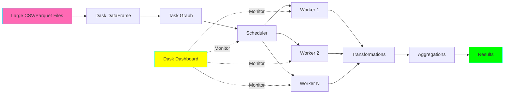
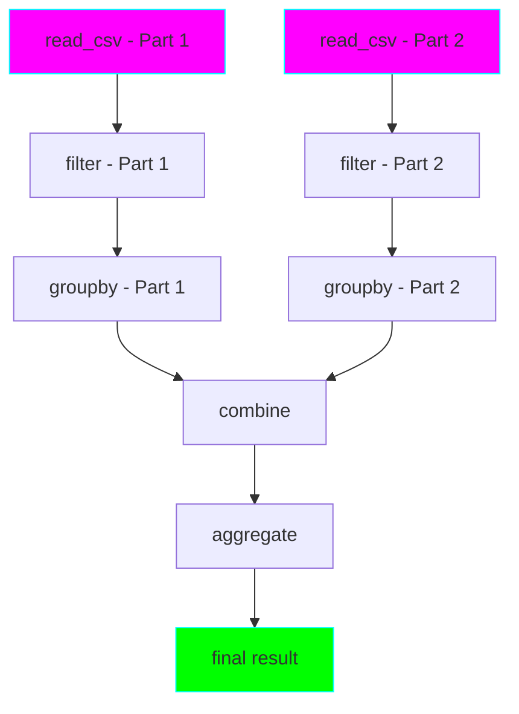
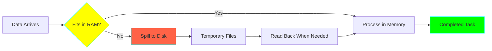

# Project 11: Distributed ETL with Dask

**Complexity:** ⭐⭐⭐☆☆ | **Time:** 7-9 hours | **Tier:** Advanced Intermediate

## Overview

Build a distributed ETL pipeline using Dask to process datasets that exceed single-machine memory. This project introduces parallel computing concepts and teaches how to scale pandas workloads across multiple cores and workers.

## Learning Objectives

After completing this project, you will understand:

- ✅ Distributed DataFrame concepts and lazy evaluation
- ✅ Task graph construction and optimization
- ✅ Parallel execution and worker coordination
- ✅ Memory management and spill-to-disk strategies
- ✅ Partitioning strategies for distributed data
- ✅ Performance tuning and bottleneck identification

## Architecture



## Key Concepts

### Lazy Evaluation vs Eager Execution

**Eager (Pandas):**
```python
df = pd.read_csv('data.csv')          # Loads immediately
df = df[df['amount'] > 100]            # Executes immediately
result = df.groupby('category').sum()  # Executes immediately
```

**Lazy (Dask):**
```python
ddf = dd.read_csv('data.csv')          # Creates task graph only
ddf = ddf[ddf['amount'] > 100]         # Adds to task graph
result = ddf.groupby('category').sum() # Still just task graph
result.compute()                       # NOW executes everything
```

**Benefits of Lazy Evaluation:**
- Optimization opportunities across entire pipeline
- Eliminates intermediate results
- Better memory management
- Parallelization planning

### Task Graph Architecture



### Partitioning Strategies

| Strategy | Use Case | Pros | Cons |
|----------|----------|------|------|
| File-based | Multiple input files | Natural partition boundary | Uneven partition sizes |
| Size-based | Large single files | Balanced partitions | Requires scanning |
| Hash-based | After groupby/join | Even distribution | Hash overhead |
| Range-based | Sorted data | Preserves ordering | Skew risk |

### Memory Management



## Implementation Guide

### Step 1: Basic Dask DataFrame Setup

```python
import dask
import dask.dataframe as dd
import pandas as pd
from dask.distributed import Client, LocalCluster
import logging

# Configure logging
logging.basicConfig(level=logging.INFO)
logger = logging.getLogger(__name__)

class DaskETLPipeline:
    """Distributed ETL pipeline using Dask."""

    def __init__(
        self,
        n_workers: int = 4,
        threads_per_worker: int = 2,
        memory_limit: str = '4GB'
    ):
        """
        Initialize Dask cluster.

        Args:
            n_workers: Number of worker processes
            threads_per_worker: Threads per worker
            memory_limit: Memory limit per worker
        """
        self.cluster = LocalCluster(
            n_workers=n_workers,
            threads_per_worker=threads_per_worker,
            memory_limit=memory_limit
        )
        self.client = Client(self.cluster)

        logger.info(f"Cluster dashboard: {self.client.dashboard_link}")

    def __enter__(self):
        return self

    def __exit__(self, exc_type, exc_val, exc_tb):
        self.client.close()
        self.cluster.close()
```

### Step 2: Reading and Partitioning Data

```python
from typing import Optional, List
from pathlib import Path

class DaskDataLoader:
    """Handle data loading with optimal partitioning."""

    @staticmethod
    def load_csv(
        path: str,
        blocksize: str = '64MB',
        dtype: Optional[dict] = None,
        **kwargs
    ) -> dd.DataFrame:
        """
        Load CSV with automatic partitioning.

        Args:
            path: File path or glob pattern
            blocksize: Size of each partition
            dtype: Column data types

        Returns:
            Dask DataFrame
        """
        ddf = dd.read_csv(
            path,
            blocksize=blocksize,
            dtype=dtype,
            assume_missing=True,
            **kwargs
        )

        logger.info(f"Loaded {ddf.npartitions} partitions")
        logger.info(f"Columns: {ddf.columns.tolist()}")

        return ddf

    @staticmethod
    def load_parquet(
        path: str,
        columns: Optional[List[str]] = None,
        filters: Optional[List] = None
    ) -> dd.DataFrame:
        """
        Load Parquet with predicate pushdown.

        Args:
            path: Directory containing parquet files
            columns: Columns to read (column pruning)
            filters: Row filters to apply

        Returns:
            Dask DataFrame
        """
        ddf = dd.read_parquet(
            path,
            columns=columns,
            filters=filters,
            engine='pyarrow'
        )

        logger.info(f"Loaded {ddf.npartitions} partitions")
        return ddf

    @staticmethod
    def optimize_partitions(
        ddf: dd.DataFrame,
        partition_size: str = '100MB'
    ) -> dd.DataFrame:
        """
        Repartition DataFrame for optimal performance.

        Args:
            ddf: Dask DataFrame
            partition_size: Target partition size

        Returns:
            Repartitioned DataFrame
        """
        # Calculate optimal number of partitions
        total_size = ddf.memory_usage(deep=True).sum().compute()
        target_size = pd.eval(partition_size.replace('MB', '*1024*1024'))
        optimal_partitions = int(total_size / target_size)

        logger.info(f"Repartitioning to {optimal_partitions} partitions")

        return ddf.repartition(npartitions=optimal_partitions)
```

### Step 3: Distributed Transformations

```python
class DaskTransformer:
    """Apply transformations to distributed DataFrames."""

    @staticmethod
    def filter_data(
        ddf: dd.DataFrame,
        conditions: dict
    ) -> dd.DataFrame:
        """
        Apply filtering conditions.

        Args:
            ddf: Dask DataFrame
            conditions: Dictionary of column: condition pairs

        Example:
            conditions = {
                'amount': lambda x: x > 100,
                'status': lambda x: x == 'active'
            }
        """
        filtered = ddf

        for column, condition in conditions.items():
            filtered = filtered[condition(filtered[column])]

        return filtered

    @staticmethod
    def apply_transformations(
        ddf: dd.DataFrame,
        transformations: dict,
        meta: Optional[dict] = None
    ) -> dd.DataFrame:
        """
        Apply column transformations.

        Args:
            ddf: Dask DataFrame
            transformations: Dictionary mapping column names to functions
            meta: Metadata for new columns (required for type inference)

        Example:
            transformations = {
                'total': lambda row: row['quantity'] * row['price'],
                'category_upper': lambda row: row['category'].upper()
            }
        """
        result = ddf.copy()

        for col_name, func in transformations.items():
            if meta and col_name in meta:
                result[col_name] = result.map_partitions(
                    lambda df: df.apply(func, axis=1),
                    meta=(col_name, meta[col_name])
                )
            else:
                result[col_name] = result.map_partitions(
                    lambda df: df.apply(func, axis=1)
                )

        return result

    @staticmethod
    def deduplicate(
        ddf: dd.DataFrame,
        subset: Optional[List[str]] = None,
        keep: str = 'first'
    ) -> dd.DataFrame:
        """
        Remove duplicate rows.

        Note: This requires shuffling data and can be expensive.

        Args:
            ddf: Dask DataFrame
            subset: Columns to consider for duplicates
            keep: Which duplicate to keep ('first', 'last', False)
        """
        # Set index for efficient deduplication if subset specified
        if subset:
            ddf = ddf.set_index(subset[0], drop=False)

        deduplicated = ddf.drop_duplicates(subset=subset, keep=keep)

        # Reset index if it was set
        if subset:
            deduplicated = deduplicated.reset_index(drop=True)

        return deduplicated
```

### Step 4: Aggregations and Groupby Operations

```python
from typing import Dict, Any

class DaskAggregator:
    """Perform distributed aggregations."""

    @staticmethod
    def aggregate(
        ddf: dd.DataFrame,
        groupby_cols: List[str],
        agg_functions: Dict[str, Any],
        split_out: Optional[int] = None
    ) -> dd.DataFrame:
        """
        Perform groupby aggregation.

        Args:
            ddf: Dask DataFrame
            groupby_cols: Columns to group by
            agg_functions: Aggregation functions per column
            split_out: Number of output partitions (helps with skew)

        Example:
            agg_functions = {
                'amount': ['sum', 'mean', 'count'],
                'quantity': 'sum'
            }
        """
        if split_out:
            result = ddf.groupby(groupby_cols).agg(
                agg_functions,
                split_out=split_out
            )
        else:
            result = ddf.groupby(groupby_cols).agg(agg_functions)

        return result

    @staticmethod
    def rolling_aggregation(
        ddf: dd.DataFrame,
        window: int,
        groupby_col: Optional[str] = None
    ) -> dd.DataFrame:
        """
        Compute rolling window aggregations.

        Args:
            ddf: Dask DataFrame (must have datetime index)
            window: Window size
            groupby_col: Optional column to group by first
        """
        if groupby_col:
            # This is expensive - requires data shuffle
            result = ddf.groupby(groupby_col).rolling(window).mean()
        else:
            result = ddf.rolling(window).mean()

        return result

    @staticmethod
    def pivot_table(
        ddf: dd.DataFrame,
        index: str,
        columns: str,
        values: str,
        aggfunc: str = 'sum'
    ) -> pd.DataFrame:
        """
        Create pivot table.

        Note: Results must fit in memory as this returns a pandas DataFrame.

        Args:
            ddf: Dask DataFrame
            index: Column to use as index
            columns: Column to pivot
            values: Column with values
            aggfunc: Aggregation function
        """
        # Pivot tables require compute()
        result = ddf.compute().pivot_table(
            index=index,
            columns=columns,
            values=values,
            aggfunc=aggfunc
        )

        return result
```

### Step 5: Writing Results

```python
class DaskWriter:
    """Write Dask DataFrames to various formats."""

    @staticmethod
    def to_parquet(
        ddf: dd.DataFrame,
        path: str,
        partition_cols: Optional[List[str]] = None,
        compression: str = 'snappy',
        **kwargs
    ):
        """
        Write to Parquet with partitioning.

        Args:
            ddf: Dask DataFrame
            path: Output directory path
            partition_cols: Columns to partition by
            compression: Compression algorithm
        """
        ddf.to_parquet(
            path,
            partition_on=partition_cols,
            compression=compression,
            engine='pyarrow',
            write_index=False,
            **kwargs
        )

        logger.info(f"Written Parquet to {path}")

    @staticmethod
    def to_csv(
        ddf: dd.DataFrame,
        path: str,
        single_file: bool = False,
        **kwargs
    ):
        """
        Write to CSV.

        Args:
            ddf: Dask DataFrame
            path: Output path (pattern if multiple files)
            single_file: Whether to write single file (requires compute)
        """
        if single_file:
            # This brings all data to single process
            ddf.compute().to_csv(path, index=False, **kwargs)
        else:
            # Writes multiple files
            ddf.to_csv(path, index=False, **kwargs)

        logger.info(f"Written CSV to {path}")

    @staticmethod
    def to_database(
        ddf: dd.DataFrame,
        table_name: str,
        connection_string: str,
        if_exists: str = 'append',
        chunksize: int = 10000
    ):
        """
        Write to SQL database in parallel.

        Args:
            ddf: Dask DataFrame
            table_name: Target table name
            connection_string: SQLAlchemy connection string
            if_exists: 'append', 'replace', or 'fail'
            chunksize: Rows per insert
        """
        from sqlalchemy import create_engine

        def write_partition(partition_df):
            engine = create_engine(connection_string)
            partition_df.to_sql(
                table_name,
                engine,
                if_exists=if_exists,
                index=False,
                chunksize=chunksize
            )
            return len(partition_df)

        # Process each partition
        results = ddf.map_partitions(write_partition).compute()

        logger.info(f"Written {sum(results)} rows to {table_name}")
```

### Step 6: Performance Monitoring and Optimization

```python
import time
from dataclasses import dataclass
from typing import Callable

@dataclass
class PerformanceMetrics:
    """Store performance metrics."""
    execution_time: float
    memory_peak_mb: float
    tasks_executed: int
    partitions_processed: int
    spilled_to_disk_mb: float

class DaskOptimizer:
    """Optimize Dask pipeline performance."""

    def __init__(self, client: Client):
        self.client = client

    def profile_execution(
        self,
        computation: Callable,
        *args,
        **kwargs
    ) -> tuple[Any, PerformanceMetrics]:
        """
        Profile a Dask computation.

        Args:
            computation: Function that returns a Dask collection

        Returns:
            (result, metrics)
        """
        # Reset performance history
        self.client.restart()

        # Execute and measure
        start_time = time.time()
        result = computation(*args, **kwargs)

        if hasattr(result, 'compute'):
            result = result.compute()

        execution_time = time.time() - start_time

        # Get performance info from client
        perf_report = self.client.profile()

        metrics = PerformanceMetrics(
            execution_time=execution_time,
            memory_peak_mb=0,  # Extract from perf_report if needed
            tasks_executed=0,
            partitions_processed=0,
            spilled_to_disk_mb=0
        )

        return result, metrics

    @staticmethod
    def optimize_task_graph(ddf: dd.DataFrame) -> dd.DataFrame:
        """
        Optimize task graph using Dask's optimizer.

        Args:
            ddf: Dask DataFrame

        Returns:
            Optimized DataFrame
        """
        # Dask automatically optimizes, but we can force optimization
        optimized = ddf.optimize()
        return optimized

    @staticmethod
    def persist_intermediate(
        ddf: dd.DataFrame,
        client: Client
    ) -> dd.DataFrame:
        """
        Persist intermediate results in distributed memory.

        Use when same intermediate result is used multiple times.

        Args:
            ddf: Dask DataFrame
            client: Dask client

        Returns:
            Persisted DataFrame
        """
        persisted = client.persist(ddf)
        return persisted
```

## Nuanced Scenarios

### 1. Handling Data Skew

**Challenge:** Uneven partition sizes cause some workers to do more work.

```python
def handle_skewed_data(ddf: dd.DataFrame, skewed_column: str = 'category'):
    """
    Redistribute skewed data for better balance.

    Strategy: Use hash-based repartitioning with salt.
    """
    import hashlib

    # Add salt column for better distribution
    def add_salt(partition_df):
        partition_df['_salt'] = partition_df[skewed_column].apply(
            lambda x: int(hashlib.md5(str(x).encode()).hexdigest(), 16) % 100
        )
        return partition_df

    # Add salt
    ddf = ddf.map_partitions(add_salt)

    # Repartition on combination of original + salt
    ddf = ddf.set_index(['_salt', skewed_column])
    ddf = ddf.reset_index(drop=False)
    ddf = ddf.drop('_salt', axis=1)

    return ddf

# Example usage
ddf = dd.read_parquet('skewed_data/')
ddf_balanced = handle_skewed_data(ddf, 'user_id')
result = ddf_balanced.groupby('user_id').sum().compute()
```

### 2. Adaptive Partition Sizing

**Challenge:** Automatically adjust partition sizes based on available memory.

```python
def adaptive_repartition(
    ddf: dd.DataFrame,
    target_memory_per_partition_mb: int = 100
) -> dd.DataFrame:
    """
    Dynamically adjust partitions based on data size.
    """
    # Estimate current partition sizes
    partition_sizes = ddf.map_partitions(
        lambda df: df.memory_usage(deep=True).sum()
    ).compute()

    avg_partition_size_mb = sum(partition_sizes) / len(partition_sizes) / (1024 * 1024)

    logger.info(f"Current avg partition size: {avg_partition_size_mb:.2f} MB")

    # Calculate optimal partition count
    if avg_partition_size_mb > target_memory_per_partition_mb:
        # Need more partitions
        scale_factor = avg_partition_size_mb / target_memory_per_partition_mb
        new_partitions = int(ddf.npartitions * scale_factor)

        logger.info(f"Increasing partitions from {ddf.npartitions} to {new_partitions}")
        return ddf.repartition(npartitions=new_partitions)

    elif avg_partition_size_mb < target_memory_per_partition_mb / 2:
        # Too many partitions (overhead)
        scale_factor = target_memory_per_partition_mb / avg_partition_size_mb
        new_partitions = max(1, int(ddf.npartitions / scale_factor))

        logger.info(f"Reducing partitions from {ddf.npartitions} to {new_partitions}")
        return ddf.repartition(npartitions=new_partitions)

    return ddf
```

### 3. Spill-to-Disk Management

**Challenge:** Handle datasets larger than available RAM.

```python
def configure_spill_to_disk(
    n_workers: int = 4,
    memory_limit: str = '4GB',
    memory_target_fraction: float = 0.6,
    memory_spill_fraction: float = 0.7
) -> Client:
    """
    Configure Dask to handle datasets larger than RAM.

    Args:
        n_workers: Number of workers
        memory_limit: Memory per worker
        memory_target_fraction: Start spilling at this fraction
        memory_spill_fraction: Pause work at this fraction
    """
    cluster = LocalCluster(
        n_workers=n_workers,
        threads_per_worker=2,
        memory_limit=memory_limit,
        memory_target_fraction=memory_target_fraction,
        memory_spill_fraction=memory_spill_fraction
    )

    client = Client(cluster)

    logger.info(f"Configured spill-to-disk at {memory_target_fraction*100}% memory")

    return client

# Example: Process 20GB dataset with only 8GB RAM
def process_large_dataset():
    client = configure_spill_to_disk(
        n_workers=2,
        memory_limit='4GB',
        memory_target_fraction=0.5,
        memory_spill_fraction=0.7
    )

    # Read large dataset
    ddf = dd.read_csv('large_data/*.csv', blocksize='64MB')

    # Process with automatic spilling
    result = ddf.groupby('category').agg({
        'amount': ['sum', 'mean', 'count']
    }).compute()

    client.close()
    return result
```

### 4. Multi-Stage Pipeline Optimization

**Challenge:** Optimize complex multi-stage ETL pipelines.

```python
class OptimizedPipeline:
    """Multi-stage ETL with optimization."""

    def __init__(self, client: Client):
        self.client = client

    def run_pipeline(self, input_path: str, output_path: str):
        """
        Run optimized multi-stage pipeline.

        Stages:
        1. Load and filter
        2. Join with reference data
        3. Transform and aggregate
        4. Write results
        """
        # Stage 1: Load and filter
        ddf = dd.read_parquet(input_path)
        ddf = ddf[ddf['amount'] > 0]

        # Persist after filter (reused in multiple places)
        ddf = self.client.persist(ddf)

        # Stage 2: Join with reference (broadcast small table)
        reference_df = pd.read_csv('reference.csv')  # Small table
        ddf = ddf.merge(
            reference_df,
            on='category_id',
            how='left',
            broadcast=True  # Broadcast small table to all workers
        )

        # Stage 3: Transform
        ddf['total'] = ddf['quantity'] * ddf['price']

        # Optimize before aggregation
        ddf = ddf.optimize()

        # Stage 4: Aggregate
        result = ddf.groupby('category').agg({
            'total': 'sum',
            'quantity': 'sum'
        })

        # Stage 5: Write
        result.to_parquet(output_path, compression='snappy')

        logger.info("Pipeline completed")
```

## Exercises

### Exercise 1: Basic Distributed ETL
Process a 5GB CSV file:
- Read with optimal partitioning
- Apply filters and transformations
- Write to Parquet
- Measure speedup vs pandas

### Exercise 2: Groupby Optimization
Given sales data with skewed categories:
- Detect and handle data skew
- Optimize partition sizes
- Compare different `split_out` values
- Benchmark performance

### Exercise 3: Memory Management
Process a 20GB dataset with only 8GB RAM:
- Configure spill-to-disk
- Monitor memory usage via dashboard
- Optimize partition sizes
- Ensure successful completion

### Exercise 4: Complex Pipeline
Build a multi-stage pipeline:
- Load from multiple sources
- Join datasets (broadcast small tables)
- Apply complex transformations
- Aggregate and write results
- Optimize task graph

## Success Criteria

- [ ] Process 10GB+ dataset efficiently
- [ ] Utilize all available CPU cores
- [ ] Handle data larger than RAM with spill-to-disk
- [ ] Optimize partition sizes for performance
- [ ] Monitor execution via Dask dashboard
- [ ] Achieve 4x+ speedup vs single-threaded pandas
- [ ] Implement proper error handling and retries

## Testing Checklist

```python
# tests/test_dask_etl.py

def test_basic_load_and_transform():
    """Test loading and basic transformations."""
    pass

def test_groupby_aggregation():
    """Test distributed groupby operations."""
    pass

def test_partitioning_strategy():
    """Test different partition sizes."""
    pass

def test_memory_management():
    """Test spill-to-disk functionality."""
    pass

def test_data_skew_handling():
    """Test handling of skewed data."""
    pass

def test_multi_stage_pipeline():
    """Test complex multi-stage pipeline."""
    pass

def test_error_handling():
    """Test error handling and retries."""
    pass

def test_performance_monitoring():
    """Test performance metrics collection."""
    pass
```

## Common Pitfalls

1. **Too Many Partitions:** Creates excessive overhead - aim for 100-1000 partitions
2. **Too Few Partitions:** Limits parallelism - each partition should be 100-200MB
3. **Not Using persist():** Recomputing intermediate results multiple times
4. **Ignoring Data Skew:** Some workers idle while others overloaded
5. **Eager Operations:** Using `.compute()` too early loses optimization opportunities
6. **Memory Overflow:** Not configuring spill-to-disk for large datasets

## Next Steps

After completing this project:
1. Move to **Project 12: Apache Spark Pipeline** for even larger scale
2. Apply Dask to previous projects for performance improvements
3. Explore Dask-ML for distributed machine learning
4. Learn Dask Arrays for multi-dimensional data

## References

- [Dask Documentation](https://docs.dask.org/)
- [Dask Best Practices](https://docs.dask.org/en/latest/best-practices.html)
- [Dask DataFrame API](https://docs.dask.org/en/latest/dataframe.html)
- [Distributed Computing with Dask](https://tutorial.dask.org/)
- [Dask Performance Tips](https://docs.dask.org/en/latest/dataframe-performance.html)

---

**Happy Learning! 🚀**
