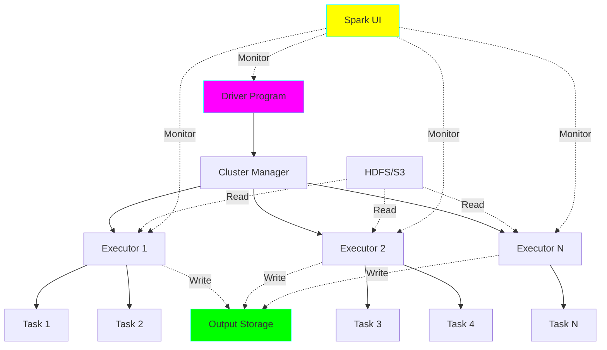
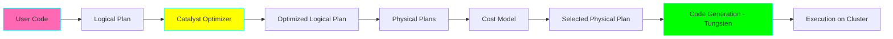
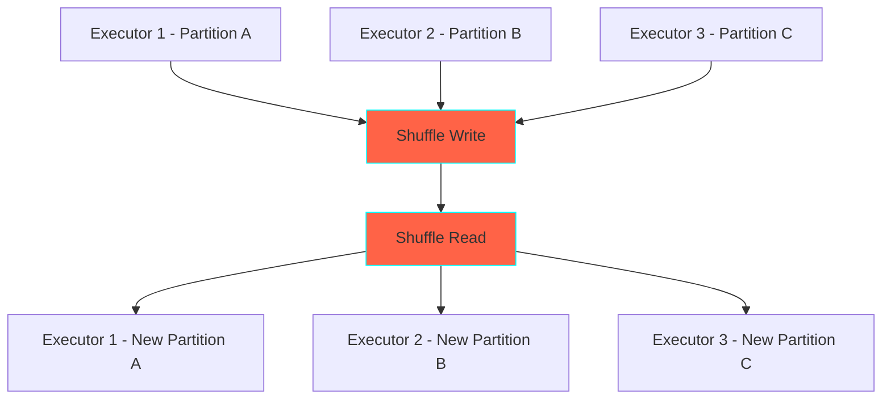

# Project 12: Apache Spark Pipeline

**Complexity:** ⭐⭐⭐⭐☆ | **Time:** 10-12 hours | **Tier:** Advanced Intermediate

## Overview

Build a production-grade ETL pipeline using Apache Spark to process massive datasets (50GB+) across distributed clusters. This project teaches the fundamentals of big data processing, Spark's execution model, and optimization techniques for handling data at scale.

## Learning Objectives

After completing this project, you will understand:

- ✅ Spark architecture (Driver, Executors, Cluster Manager)
- ✅ RDD, DataFrame, and Dataset APIs
- ✅ Catalyst optimizer and query planning
- ✅ Tungsten execution engine and code generation
- ✅ Shuffle operations and performance implications
- ✅ Join strategies and broadcast optimization
- ✅ Data skew detection and mitigation

## Architecture



## Key Concepts

### Spark Execution Model



### RDD vs DataFrame vs Dataset

| Feature | RDD | DataFrame | Dataset |
|---------|-----|-----------|---------|
| Type Safety | No | No | Yes (compile-time) |
| Optimization | Manual | Automatic (Catalyst) | Automatic (Catalyst) |
| Performance | Slower | Fast | Fast |
| API Complexity | Complex | Simple (SQL-like) | Medium |
| Use Case | Low-level control | Analytics | Type-safe analytics |

**Example:**
```python
# RDD (low-level)
rdd = sc.textFile("data.csv")
result = rdd.map(lambda x: x.split(',')) \
            .filter(lambda x: float(x[2]) > 100) \
            .count()

# DataFrame (recommended)
df = spark.read.csv("data.csv", header=True, inferSchema=True)
result = df.filter(df.amount > 100).count()
```

### Shuffle Operations



**Operations that cause shuffle:**
- `groupByKey`, `reduceByKey`
- `join`, `cogroup`
- `distinct`, `repartition`
- `sort`, `orderBy`

### Join Strategies

| Strategy | Use Case | Performance | Requirements |
|----------|----------|-------------|--------------|
| Broadcast Hash Join | Small table (<10GB) | Very Fast | One small table |
| Shuffle Hash Join | Medium tables | Medium | Even data distribution |
| Sort-Merge Join | Large tables | Slower | Sorted data helps |
| Cartesian Join | Avoid | Very Slow | Last resort |

## Implementation Guide

### Step 1: Spark Session Setup

```python
from pyspark.sql import SparkSession
from pyspark.conf import SparkConf
import logging

# Configure logging
logging.basicConfig(level=logging.INFO)
logger = logging.getLogger(__name__)

class SparkETLPipeline:
    """Production-grade Spark ETL pipeline."""

    def __init__(
        self,
        app_name: str = "ETL Pipeline",
        master: str = "local[*]",
        config: dict = None
    ):
        """
        Initialize Spark session with optimal configurations.

        Args:
            app_name: Application name
            master: Spark master URL
            config: Additional Spark configurations
        """
        conf = SparkConf()

        # Default optimizations
        default_config = {
            # Memory management
            "spark.executor.memory": "4g",
            "spark.driver.memory": "2g",
            "spark.memory.fraction": "0.8",
            "spark.memory.storageFraction": "0.3",

            # Shuffle optimization
            "spark.sql.shuffle.partitions": "200",
            "spark.sql.adaptive.enabled": "true",
            "spark.sql.adaptive.coalescePartitions.enabled": "true",

            # Serialization
            "spark.serializer": "org.apache.spark.serializer.KryoSerializer",

            # Dynamic allocation
            "spark.dynamicAllocation.enabled": "true",
            "spark.shuffle.service.enabled": "true",

            # Broadcast
            "spark.sql.autoBroadcastJoinThreshold": "10485760",  # 10MB
        }

        # Merge with custom config
        if config:
            default_config.update(config)

        # Apply configurations
        for key, value in default_config.items():
            conf.set(key, value)

        # Create Spark session
        self.spark = SparkSession.builder \
            .appName(app_name) \
            .master(master) \
            .config(conf=conf) \
            .getOrCreate()

        # Set log level
        self.spark.sparkContext.setLogLevel("WARN")

        logger.info(f"Spark UI available at: {self.spark.sparkContext.uiWebUrl}")

    def __enter__(self):
        return self

    def __exit__(self, exc_type, exc_val, exc_tb):
        self.spark.stop()
```

### Step 2: Data Loading and Schema Management

```python
from pyspark.sql.types import (
    StructType, StructField, StringType, IntegerType,
    DoubleType, TimestampType, BooleanType
)
from typing import Optional

class SparkDataLoader:
    """Handle data loading with schema enforcement."""

    def __init__(self, spark: SparkSession):
        self.spark = spark

    def load_csv(
        self,
        path: str,
        schema: Optional[StructType] = None,
        header: bool = True,
        infer_schema: bool = False,
        **options
    ):
        """
        Load CSV with schema enforcement.

        Args:
            path: File path or directory
            schema: Explicit schema (recommended for production)
            header: Whether CSV has header row
            infer_schema: Infer schema from data (slow)
        """
        reader = self.spark.read.format("csv") \
            .option("header", header)

        if schema:
            reader = reader.schema(schema)
        elif infer_schema:
            reader = reader.option("inferSchema", "true")

        # Apply additional options
        for key, value in options.items():
            reader = reader.option(key, value)

        df = reader.load(path)

        logger.info(f"Loaded {df.count()} rows from {path}")
        logger.info(f"Schema: {df.schema}")

        return df

    def load_parquet(
        self,
        path: str,
        columns: Optional[list] = None,
        predicate: Optional[str] = None
    ):
        """
        Load Parquet with predicate pushdown and column pruning.

        Args:
            path: Parquet file/directory path
            columns: Columns to read (column pruning)
            predicate: SQL-like predicate for filtering
        """
        df = self.spark.read.parquet(path)

        # Column pruning
        if columns:
            df = df.select(*columns)

        # Predicate pushdown
        if predicate:
            df = df.filter(predicate)

        logger.info(f"Loaded Parquet from {path}")
        return df

    @staticmethod
    def define_schema_from_dict(schema_dict: dict) -> StructType:
        """
        Create StructType schema from dictionary.

        Example:
            schema_dict = {
                'id': 'integer',
                'name': 'string',
                'amount': 'double',
                'timestamp': 'timestamp'
            }
        """
        type_mapping = {
            'string': StringType(),
            'integer': IntegerType(),
            'double': DoubleType(),
            'timestamp': TimestampType(),
            'boolean': BooleanType()
        }

        fields = []
        for field_name, field_type in schema_dict.items():
            spark_type = type_mapping.get(field_type.lower(), StringType())
            fields.append(StructField(field_name, spark_type, nullable=True))

        return StructType(fields)
```

### Step 3: Transformations and Optimizations

```python
from pyspark.sql import functions as F
from pyspark.sql import Window
from typing import List, Dict, Any

class SparkTransformer:
    """Apply transformations with Catalyst optimization."""

    @staticmethod
    def filter_data(df, conditions: List[str]):
        """
        Apply multiple filter conditions.

        Args:
            df: Spark DataFrame
            conditions: List of SQL-like conditions

        Example:
            conditions = ["amount > 100", "status = 'active'"]
        """
        for condition in conditions:
            df = df.filter(condition)

        return df

    @staticmethod
    def add_derived_columns(
        df,
        expressions: Dict[str, str]
    ):
        """
        Add derived columns using SQL expressions.

        Args:
            df: Spark DataFrame
            expressions: Column name -> SQL expression mapping

        Example:
            expressions = {
                'total': 'quantity * price',
                'profit_margin': '(price - cost) / price'
            }
        """
        for col_name, expression in expressions.items():
            df = df.withColumn(col_name, F.expr(expression))

        return df

    @staticmethod
    def deduplicate(
        df,
        subset: Optional[List[str]] = None,
        order_by: Optional[List[str]] = None,
        keep: str = 'first'
    ):
        """
        Remove duplicates with ordering.

        Args:
            df: Spark DataFrame
            subset: Columns to consider for duplicates
            order_by: Columns to order by before keeping
            keep: 'first' or 'last'
        """
        if order_by:
            # Use window function for ordered deduplication
            window_spec = Window.partitionBy(*subset).orderBy(
                *[F.desc(col) if keep == 'last' else F.asc(col)
                  for col in order_by]
            )

            df = df.withColumn('_row_num', F.row_number().over(window_spec))
            df = df.filter(F.col('_row_num') == 1).drop('_row_num')
        else:
            # Simple deduplication
            df = df.dropDuplicates(subset=subset)

        return df

    @staticmethod
    def apply_window_functions(
        df,
        partition_cols: List[str],
        order_cols: List[str],
        aggregations: Dict[str, Any]
    ):
        """
        Apply window functions for analytics.

        Args:
            df: Spark DataFrame
            partition_cols: Columns to partition by
            order_cols: Columns to order by
            aggregations: Window aggregations to apply

        Example:
            aggregations = {
                'running_total': F.sum('amount'),
                'rank': F.rank(),
                'row_num': F.row_number()
            }
        """
        window_spec = Window.partitionBy(*partition_cols).orderBy(*order_cols)

        for col_name, agg_func in aggregations.items():
            df = df.withColumn(col_name, agg_func.over(window_spec))

        return df
```

### Step 4: Advanced Joins and Aggregations

```python
class SparkJoiner:
    """Handle joins with optimization strategies."""

    @staticmethod
    def broadcast_join(
        large_df,
        small_df,
        join_keys: List[str],
        how: str = 'left'
    ):
        """
        Perform broadcast join for small tables.

        Args:
            large_df: Large DataFrame
            small_df: Small DataFrame (<10GB)
            join_keys: Columns to join on
            how: Join type
        """
        # Force broadcast
        small_df_broadcast = F.broadcast(small_df)

        result = large_df.join(
            small_df_broadcast,
            on=join_keys,
            how=how
        )

        return result

    @staticmethod
    def skew_join(
        df1,
        df2,
        join_keys: List[str],
        skew_keys: List[Any],
        how: str = 'inner'
    ):
        """
        Handle skewed joins using salting technique.

        Args:
            df1, df2: DataFrames to join
            join_keys: Join columns
            skew_keys: Keys known to be skewed
            how: Join type
        """
        # Identify skewed vs non-skewed data
        df1_skewed = df1.filter(F.col(join_keys[0]).isin(skew_keys))
        df1_normal = df1.filter(~F.col(join_keys[0]).isin(skew_keys))

        df2_skewed = df2.filter(F.col(join_keys[0]).isin(skew_keys))
        df2_normal = df2.filter(~F.col(join_keys[0]).isin(skew_keys))

        # Normal join for non-skewed data
        joined_normal = df1_normal.join(df2_normal, on=join_keys, how=how)

        # Salted join for skewed data
        salt_values = 10  # Number of replications

        # Add salt to skewed data
        df1_salted = df1_skewed.withColumn(
            '_salt',
            F.expr(f"floor(rand() * {salt_values})")
        )

        df2_salted = df2_skewed.withColumn(
            '_salt',
            F.explode(F.array([F.lit(i) for i in range(salt_values)]))
        )

        # Join salted data
        salted_join_keys = join_keys + ['_salt']
        joined_skewed = df1_salted.join(
            df2_salted,
            on=salted_join_keys,
            how=how
        ).drop('_salt')

        # Union results
        return joined_normal.union(joined_skewed)

class SparkAggregator:
    """Perform optimized aggregations."""

    @staticmethod
    def aggregate(
        df,
        group_by_cols: List[str],
        agg_expressions: Dict[str, List[str]]
    ):
        """
        Perform groupby aggregation.

        Args:
            df: Spark DataFrame
            group_by_cols: Columns to group by
            agg_expressions: Column -> aggregation functions mapping

        Example:
            agg_expressions = {
                'amount': ['sum', 'avg', 'max'],
                'quantity': ['sum']
            }
        """
        # Build aggregation expressions
        agg_list = []
        for col, funcs in agg_expressions.items():
            for func in funcs:
                agg_list.append(
                    getattr(F, func)(col).alias(f"{col}_{func}")
                )

        result = df.groupBy(*group_by_cols).agg(*agg_list)

        return result

    @staticmethod
    def pivot_aggregate(
        df,
        group_col: str,
        pivot_col: str,
        value_col: str,
        agg_func: str = 'sum'
    ):
        """
        Create pivot table with aggregation.

        Args:
            df: Spark DataFrame
            group_col: Column to group by
            pivot_col: Column to pivot
            value_col: Column with values
            agg_func: Aggregation function
        """
        result = df.groupBy(group_col) \
            .pivot(pivot_col) \
            .agg(getattr(F, agg_func)(value_col))

        return result
```

### Step 5: Writing Results

```python
class SparkWriter:
    """Write DataFrames with optimization."""

    @staticmethod
    def to_parquet(
        df,
        path: str,
        mode: str = 'overwrite',
        partition_by: Optional[List[str]] = None,
        compression: str = 'snappy',
        coalesce: Optional[int] = None
    ):
        """
        Write to Parquet with partitioning.

        Args:
            df: Spark DataFrame
            path: Output path
            mode: Write mode (overwrite, append, error, ignore)
            partition_by: Partition columns
            compression: Compression codec
            coalesce: Number of output files
        """
        writer = df.write.mode(mode) \
            .option("compression", compression)

        if partition_by:
            writer = writer.partitionBy(*partition_by)

        if coalesce:
            df = df.coalesce(coalesce)

        writer.parquet(path)

        logger.info(f"Written Parquet to {path}")

    @staticmethod
    def to_delta(
        df,
        path: str,
        mode: str = 'overwrite',
        partition_by: Optional[List[str]] = None,
        merge_schema: bool = False
    ):
        """
        Write to Delta Lake format.

        Args:
            df: Spark DataFrame
            path: Output path
            mode: Write mode
            partition_by: Partition columns
            merge_schema: Allow schema evolution
        """
        writer = df.write.format("delta") \
            .mode(mode) \
            .option("mergeSchema", merge_schema)

        if partition_by:
            writer = writer.partitionBy(*partition_by)

        writer.save(path)

        logger.info(f"Written Delta table to {path}")

    @staticmethod
    def to_database(
        df,
        url: str,
        table: str,
        mode: str = 'append',
        batch_size: int = 10000,
        num_partitions: int = 10
    ):
        """
        Write to JDBC database.

        Args:
            df: Spark DataFrame
            url: JDBC connection URL
            table: Table name
            mode: Write mode
            batch_size: Batch size for inserts
            num_partitions: Number of parallel connections
        """
        df.repartition(num_partitions).write \
            .format("jdbc") \
            .option("url", url) \
            .option("dbtable", table) \
            .option("batchsize", batch_size) \
            .mode(mode) \
            .save()

        logger.info(f"Written to database table {table}")
```

### Step 6: Performance Monitoring and Tuning

```python
import time
from dataclasses import dataclass

@dataclass
class SparkMetrics:
    """Store Spark execution metrics."""
    execution_time: float
    input_records: int
    output_records: int
    shuffle_read_mb: float
    shuffle_write_mb: float
    stages: int
    tasks: int

class SparkOptimizer:
    """Optimize Spark performance."""

    def __init__(self, spark: SparkSession):
        self.spark = spark

    def analyze_query_plan(self, df):
        """
        Analyze and print query execution plan.

        Args:
            df: Spark DataFrame
        """
        print("=== Logical Plan ===")
        df.explain(extended=False)

        print("\n=== Physical Plan ===")
        df.explain(mode="formatted")

        print("\n=== Cost-Based Optimization ===")
        df.explain(mode="cost")

    def cache_intermediate(self, df, storage_level="MEMORY_AND_DISK"):
        """
        Cache DataFrame for reuse.

        Args:
            df: Spark DataFrame
            storage_level: Storage level (MEMORY_ONLY, MEMORY_AND_DISK, etc.)
        """
        from pyspark import StorageLevel

        level_map = {
            "MEMORY_ONLY": StorageLevel.MEMORY_ONLY,
            "MEMORY_AND_DISK": StorageLevel.MEMORY_AND_DISK,
            "DISK_ONLY": StorageLevel.DISK_ONLY
        }

        df.persist(level_map.get(storage_level, StorageLevel.MEMORY_AND_DISK))

        # Trigger caching
        df.count()

        logger.info(f"Cached DataFrame with {storage_level}")

        return df

    @staticmethod
    def optimize_shuffle_partitions(df, target_partition_size_mb: int = 128):
        """
        Calculate optimal shuffle partitions.

        Args:
            df: Spark DataFrame
            target_partition_size_mb: Target size per partition
        """
        # Estimate data size
        sample = df.sample(0.01).cache()
        sample_size = sample.rdd.map(
            lambda row: len(str(row))
        ).sum()

        estimated_total_size = sample_size * 100  # Rough estimate
        estimated_size_mb = estimated_total_size / (1024 * 1024)

        optimal_partitions = max(
            1,
            int(estimated_size_mb / target_partition_size_mb)
        )

        logger.info(
            f"Recommended shuffle partitions: {optimal_partitions} "
            f"(estimated data size: {estimated_size_mb:.2f} MB)"
        )

        return optimal_partitions
```

## Nuanced Scenarios

### 1. Handling Extreme Data Skew

**Challenge:** Single key has 90% of data, causing one executor to do all work.

```python
def handle_extreme_skew(df, join_col: str, threshold_pct: float = 0.1):
    """
    Detect and handle extreme data skew.

    Strategy:
    1. Identify skewed keys
    2. Separate skewed and normal data
    3. Process differently
    """
    # Count frequencies
    key_counts = df.groupBy(join_col).count()
    total_count = df.count()

    # Identify skewed keys (>10% of total)
    threshold = total_count * threshold_pct
    skewed_keys = key_counts.filter(
        F.col('count') > threshold
    ).select(join_col).collect()

    skewed_values = [row[join_col] for row in skewed_keys]

    logger.info(f"Detected {len(skewed_values)} skewed keys")

    # Separate skewed data
    df_skewed = df.filter(F.col(join_col).isin(skewed_values))
    df_normal = df.filter(~F.col(join_col).isin(skewed_values))

    # Process skewed data with replication (see skew_join above)
    # Process normal data normally

    return df_skewed, df_normal, skewed_values
```

### 2. Adaptive Query Execution (AQE)

**Challenge:** Optimize execution based on runtime statistics.

```python
def configure_adaptive_execution(spark: SparkSession):
    """
    Enable and configure Adaptive Query Execution.

    AQE features:
    - Dynamically coalescing shuffle partitions
    - Dynamically switching join strategies
    - Dynamically optimizing skew joins
    """
    spark.conf.set("spark.sql.adaptive.enabled", "true")

    # Coalesce partitions
    spark.conf.set("spark.sql.adaptive.coalescePartitions.enabled", "true")
    spark.conf.set("spark.sql.adaptive.coalescePartitions.minPartitionSize", "1MB")

    # Skew join optimization
    spark.conf.set("spark.sql.adaptive.skewJoin.enabled", "true")
    spark.conf.set("spark.sql.adaptive.skewJoin.skewedPartitionFactor", "5")
    spark.conf.set("spark.sql.adaptive.skewJoin.skewedPartitionThresholdInBytes", "256MB")

    # Auto broadcast join
    spark.conf.set("spark.sql.adaptive.autoBroadcastJoinThreshold", "10MB")

    logger.info("Adaptive Query Execution configured")
```

### 3. Custom Partitioning Strategy

**Challenge:** Optimize partition distribution for specific query patterns.

```python
def custom_partition_strategy(df, partition_col: str, num_partitions: int = 200):
    """
    Apply custom partitioning to optimize for specific access patterns.
    """
    from pyspark.sql.functions import hash

    # Hash-based partitioning
    df_partitioned = df.repartition(
        num_partitions,
        hash(partition_col)
    )

    # Or range-based for sorted data
    # df_partitioned = df.repartitionByRange(num_partitions, partition_col)

    return df_partitioned

def partition_by_size(df, target_size_mb: int = 128):
    """
    Partition DataFrame to achieve target partition size.
    """
    # Sample to estimate size
    sample_df = df.sample(0.01).cache()
    sample_count = sample_df.count()
    sample_size = sample_df.rdd.map(lambda r: len(str(r))).sum()

    # Estimate total size
    total_count = df.count()
    avg_row_size = sample_size / sample_count if sample_count > 0 else 1000
    total_size_mb = (total_count * avg_row_size) / (1024 * 1024)

    # Calculate partitions
    num_partitions = max(1, int(total_size_mb / target_size_mb))

    logger.info(
        f"Repartitioning to {num_partitions} partitions "
        f"(estimated size: {total_size_mb:.2f} MB)"
    )

    return df.repartition(num_partitions)
```

### 4. Memory-Efficient UDFs

**Challenge:** UDFs bypass Catalyst optimizer and can be slow.

```python
from pyspark.sql.functions import udf, pandas_udf
from pyspark.sql.types import DoubleType
import pandas as pd

# Regular UDF (slower - row-by-row)
@udf(returnType=DoubleType())
def calculate_discount_udf(price, category):
    if category == 'premium':
        return price * 0.9
    else:
        return price * 0.95

# Pandas UDF (faster - vectorized)
@pandas_udf(DoubleType())
def calculate_discount_pandas_udf(price: pd.Series, category: pd.Series) -> pd.Series:
    discount = pd.Series([0.9 if cat == 'premium' else 0.95 for cat in category])
    return price * discount

# Best: Use native Spark functions when possible
def calculate_discount_native(df):
    return df.withColumn(
        'discounted_price',
        F.when(F.col('category') == 'premium', F.col('price') * 0.9)
         .otherwise(F.col('price') * 0.95)
    )
```

## Exercises

### Exercise 1: Basic Spark ETL
Build a pipeline to:
- Load 10GB CSV dataset
- Apply filters and transformations
- Aggregate by multiple dimensions
- Write to Parquet with partitioning

### Exercise 2: Join Optimization
Compare performance of:
- Regular join
- Broadcast join
- Bucketed join
- Measure and explain differences

### Exercise 3: Skew Handling
Given a dataset with 80/20 skew:
- Detect skewed keys
- Implement salting technique
- Compare performance with/without optimization

### Exercise 4: Complex Pipeline
Build a multi-stage pipeline:
- Read from multiple sources
- Perform multiple joins
- Apply window functions
- Write to Delta Lake
- Optimize for performance

## Success Criteria

- [ ] Process 50GB+ dataset successfully
- [ ] Optimize shuffle operations (minimize data movement)
- [ ] Implement efficient join strategies
- [ ] Handle data skew effectively
- [ ] Use Adaptive Query Execution
- [ ] Achieve 10x+ speedup over single-machine processing
- [ ] Monitor and tune via Spark UI

## Testing Checklist

```python
# tests/test_spark_pipeline.py

def test_data_loading():
    """Test loading various formats."""
    pass

def test_transformations():
    """Test DataFrame transformations."""
    pass

def test_broadcast_join():
    """Test broadcast join optimization."""
    pass

def test_skew_handling():
    """Test data skew mitigation."""
    pass

def test_aggregations():
    """Test groupby and window functions."""
    pass

def test_writing_formats():
    """Test writing to various formats."""
    pass

def test_performance_tuning():
    """Test performance optimizations."""
    pass

def test_error_handling():
    """Test error handling and recovery."""
    pass
```

## Common Pitfalls

1. **Too Many Small Files:** Use `coalesce()` before writing
2. **Shuffle Explosion:** Minimize wide transformations
3. **OOM Errors:** Reduce executor memory or increase partitions
4. **Slow UDFs:** Use native functions or Pandas UDFs
5. **Not Using AQE:** Enable Adaptive Query Execution for automatic optimization
6. **Ignoring Data Skew:** Monitor partition sizes and handle skew proactively

## Next Steps

After completing this project:
1. Move to **Project 13: Kafka Streaming Consumer** for real-time processing
2. Explore Spark Streaming for micro-batch processing
3. Learn Spark MLlib for distributed machine learning
4. Study Spark on Kubernetes for cloud deployments

## References

- [Apache Spark Documentation](https://spark.apache.org/docs/latest/)
- [Spark SQL Guide](https://spark.apache.org/docs/latest/sql-programming-guide.html)
- [Performance Tuning](https://spark.apache.org/docs/latest/sql-performance-tuning.html)
- [Adaptive Query Execution](https://spark.apache.org/docs/latest/sql-performance-tuning.html#adaptive-query-execution)
- [Learning Spark (O'Reilly)](https://www.oreilly.com/library/view/learning-spark-2nd/9781492050032/)

---

**Happy Learning! 🚀**
