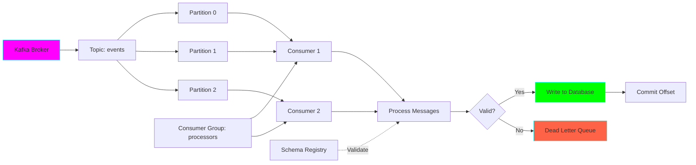
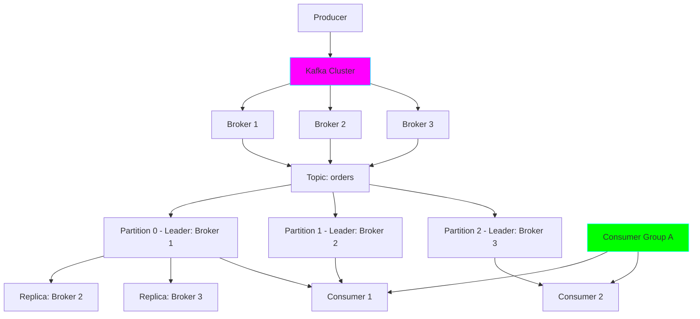
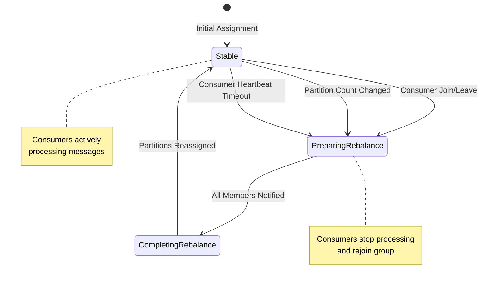

# Project 13: Kafka Streaming Consumer

**Complexity:** ⭐⭐⭐⭐☆ | **Time:** 8-10 hours | **Tier:** Advanced Intermediate

## Overview

Build a production-grade Kafka consumer that reliably processes streaming data with exactly-once semantics. This project teaches distributed messaging patterns, offset management, and real-time data processing fundamentals.

## Learning Objectives

After completing this project, you will understand:

- ✅ Kafka architecture (Topics, Partitions, Consumer Groups)
- ✅ Offset management and commit strategies
- ✅ Message delivery semantics (at-most-once, at-least-once, exactly-once)
- ✅ Consumer group rebalancing and partition assignment
- ✅ Schema evolution with Avro, JSON, and Protobuf
- ✅ Back-pressure handling and flow control
- ✅ Error handling and dead letter queues

## Architecture



## Key Concepts

### Kafka Architecture



### Message Delivery Semantics

| Semantic | Guarantee | Implementation | Use Case |
|----------|-----------|----------------|----------|
| At-most-once | No duplicates, may lose | Commit before processing | Metrics, logs |
| At-least-once | No loss, may duplicate | Commit after processing | Most common |
| Exactly-once | No loss, no duplicates | Transactional processing | Financial data |

### Consumer Group Rebalancing



### Offset Management Strategies

```python
# Auto-commit (simple, may lose or duplicate)
consumer_config = {
    'enable.auto.commit': True,
    'auto.commit.interval.ms': 5000
}

# Manual commit after each message (safest, slowest)
consumer.commit()

# Manual commit in batches (balanced)
if msg_count % 100 == 0:
    consumer.commit()

# Exactly-once with transactions
consumer.commit_transaction()
```

## Implementation Guide

### Step 1: Kafka Consumer Setup

```python
from confluent_kafka import Consumer, KafkaError, KafkaException
from typing import Optional, Dict, Callable, List
import logging
import json

# Configure logging
logging.basicConfig(level=logging.INFO)
logger = logging.getLogger(__name__)

class KafkaStreamConsumer:
    """Production-grade Kafka consumer with error handling."""

    def __init__(
        self,
        bootstrap_servers: str,
        group_id: str,
        topics: List[str],
        config: Optional[Dict] = None
    ):
        """
        Initialize Kafka consumer.

        Args:
            bootstrap_servers: Kafka broker addresses
            group_id: Consumer group ID
            topics: List of topics to subscribe to
            config: Additional consumer configurations
        """
        self.topics = topics

        # Default configuration
        default_config = {
            'bootstrap.servers': bootstrap_servers,
            'group.id': group_id,
            'auto.offset.reset': 'earliest',
            'enable.auto.commit': False,  # Manual commit for reliability
            'max.poll.interval.ms': 300000,  # 5 minutes
            'session.timeout.ms': 10000,
            'heartbeat.interval.ms': 3000,

            # Performance tuning
            'fetch.min.bytes': 1024,
            'fetch.max.wait.ms': 500,
            'max.partition.fetch.bytes': 1048576,  # 1MB
        }

        # Merge with custom config
        if config:
            default_config.update(config)

        self.config = default_config
        self.consumer = Consumer(self.config)
        self.running = False

        logger.info(f"Kafka consumer initialized for group: {group_id}")

    def subscribe(self):
        """Subscribe to topics."""
        self.consumer.subscribe(self.topics)
        logger.info(f"Subscribed to topics: {self.topics}")

    def __enter__(self):
        self.subscribe()
        return self

    def __exit__(self, exc_type, exc_val, exc_tb):
        self.close()

    def close(self):
        """Close consumer gracefully."""
        if self.consumer:
            self.consumer.close()
            logger.info("Consumer closed")
```

### Step 2: Message Processing with Error Handling

```python
from dataclasses import dataclass
from typing import Any
import time

@dataclass
class ProcessedMessage:
    """Container for processed message data."""
    key: Optional[str]
    value: Any
    topic: str
    partition: int
    offset: int
    timestamp: int
    headers: Optional[Dict] = None

class MessageProcessor:
    """Process Kafka messages with error handling."""

    def __init__(
        self,
        dead_letter_topic: Optional[str] = None,
        max_retries: int = 3,
        retry_delay: int = 1
    ):
        """
        Initialize message processor.

        Args:
            dead_letter_topic: Topic for failed messages
            max_retries: Maximum retry attempts
            retry_delay: Delay between retries (seconds)
        """
        self.dead_letter_topic = dead_letter_topic
        self.max_retries = max_retries
        self.retry_delay = retry_delay

    def process(
        self,
        message,
        processor_func: Callable
    ) -> Optional[ProcessedMessage]:
        """
        Process a single message with retry logic.

        Args:
            message: Kafka message
            processor_func: Function to process message value

        Returns:
            ProcessedMessage or None if processing failed
        """
        if message.error():
            if message.error().code() == KafkaError._PARTITION_EOF:
                logger.debug(f"Reached end of partition {message.partition()}")
                return None
            else:
                raise KafkaException(message.error())

        # Extract message data
        key = message.key().decode('utf-8') if message.key() else None
        value = message.value().decode('utf-8') if message.value() else None

        # Retry logic
        for attempt in range(self.max_retries):
            try:
                # Process message
                processed_value = processor_func(value)

                return ProcessedMessage(
                    key=key,
                    value=processed_value,
                    topic=message.topic(),
                    partition=message.partition(),
                    offset=message.offset(),
                    timestamp=message.timestamp()[1],
                    headers=self._extract_headers(message)
                )

            except Exception as e:
                logger.warning(
                    f"Processing failed (attempt {attempt + 1}/{self.max_retries}): {e}"
                )
                if attempt < self.max_retries - 1:
                    time.sleep(self.retry_delay * (2 ** attempt))  # Exponential backoff
                else:
                    logger.error(f"Message processing failed after {self.max_retries} attempts")
                    self._send_to_dead_letter_queue(message, e)
                    return None

    @staticmethod
    def _extract_headers(message) -> Dict:
        """Extract headers from Kafka message."""
        headers = {}
        if message.headers():
            for key, value in message.headers():
                headers[key] = value.decode('utf-8') if value else None
        return headers

    def _send_to_dead_letter_queue(self, message, error: Exception):
        """Send failed message to dead letter queue."""
        if not self.dead_letter_topic:
            return

        # Implementation depends on your setup
        # Could use a separate Kafka producer, database, or file
        logger.error(
            f"Sending to DLQ: topic={message.topic()}, "
            f"partition={message.partition()}, offset={message.offset()}, "
            f"error={str(error)}"
        )
```

### Step 3: Schema Registry Integration

```python
from confluent_kafka.schema_registry import SchemaRegistryClient
from confluent_kafka.schema_registry.avro import AvroDeserializer
from confluent_kafka.serialization import SerializationContext, MessageField
import json

class SchemaAwareConsumer:
    """Consumer with schema validation."""

    def __init__(
        self,
        schema_registry_url: str,
        value_schema: Optional[str] = None
    ):
        """
        Initialize schema-aware consumer.

        Args:
            schema_registry_url: Schema registry URL
            value_schema: Avro schema string
        """
        self.schema_registry_client = SchemaRegistryClient({
            'url': schema_registry_url
        })

        if value_schema:
            self.deserializer = AvroDeserializer(
                self.schema_registry_client,
                value_schema
            )
        else:
            self.deserializer = None

    def deserialize(
        self,
        message,
        schema_id: Optional[int] = None
    ) -> Any:
        """
        Deserialize message with schema validation.

        Args:
            message: Kafka message
            schema_id: Optional schema ID for validation

        Returns:
            Deserialized message value
        """
        if self.deserializer:
            ctx = SerializationContext(
                message.topic(),
                MessageField.VALUE
            )
            return self.deserializer(message.value(), ctx)
        else:
            # Fallback to JSON
            return json.loads(message.value().decode('utf-8'))

class JSONSchemaValidator:
    """Validate messages against JSON schema."""

    def __init__(self, schema: Dict):
        """
        Initialize with JSON schema.

        Args:
            schema: JSON schema dict
        """
        from jsonschema import validate, ValidationError
        self.schema = schema
        self.validate_func = validate

    def validate(self, message_value: str) -> Dict:
        """
        Validate and parse JSON message.

        Args:
            message_value: JSON string

        Returns:
            Parsed and validated dict

        Raises:
            ValidationError if invalid
        """
        from jsonschema import ValidationError

        data = json.loads(message_value)
        self.validate_func(instance=data, schema=self.schema)
        return data
```

### Step 4: Offset Management and Commit Strategies

```python
from collections import defaultdict
from typing import List

class OffsetManager:
    """Manage offset commits for reliability."""

    def __init__(
        self,
        consumer: Consumer,
        commit_strategy: str = 'batch',
        batch_size: int = 100,
        commit_interval_seconds: int = 5
    ):
        """
        Initialize offset manager.

        Args:
            consumer: Kafka consumer instance
            commit_strategy: 'immediate', 'batch', or 'interval'
            batch_size: Messages per commit (for batch strategy)
            commit_interval_seconds: Seconds between commits (for interval)
        """
        self.consumer = consumer
        self.commit_strategy = commit_strategy
        self.batch_size = batch_size
        self.commit_interval_seconds = commit_interval_seconds

        self.message_count = 0
        self.last_commit_time = time.time()
        self.pending_offsets = defaultdict(dict)

    def should_commit(self) -> bool:
        """Determine if it's time to commit offsets."""
        if self.commit_strategy == 'immediate':
            return True

        elif self.commit_strategy == 'batch':
            return self.message_count >= self.batch_size

        elif self.commit_strategy == 'interval':
            elapsed = time.time() - self.last_commit_time
            return elapsed >= self.commit_interval_seconds

        return False

    def track_message(self, message):
        """Track processed message for commit."""
        self.message_count += 1

        # Store offset per partition
        partition_key = (message.topic(), message.partition())
        self.pending_offsets[partition_key] = message.offset()

    def commit(self, message=None, asynchronous: bool = False):
        """
        Commit offsets.

        Args:
            message: Specific message to commit (or None for all pending)
            asynchronous: Whether to commit asynchronously
        """
        try:
            if message:
                # Commit specific message
                self.consumer.commit(message=message, asynchronous=asynchronous)
            else:
                # Commit current position
                self.consumer.commit(asynchronous=asynchronous)

            # Reset tracking
            self.message_count = 0
            self.last_commit_time = time.time()
            self.pending_offsets.clear()

            logger.debug("Offsets committed successfully")

        except KafkaException as e:
            logger.error(f"Offset commit failed: {e}")
            raise

    def commit_offsets(
        self,
        offsets: List[tuple],
        asynchronous: bool = False
    ):
        """
        Commit specific offsets.

        Args:
            offsets: List of (TopicPartition, offset) tuples
            asynchronous: Whether to commit asynchronously
        """
        from confluent_kafka import TopicPartition

        topic_partitions = [
            TopicPartition(topic, partition, offset + 1)
            for (topic, partition), offset in offsets
        ]

        self.consumer.commit(offsets=topic_partitions, asynchronous=asynchronous)
```

### Step 5: Consumer Loop with Graceful Shutdown

```python
import signal
import sys

class StreamingConsumer:
    """Main consumer loop with graceful shutdown."""

    def __init__(
        self,
        kafka_consumer: KafkaStreamConsumer,
        message_processor: MessageProcessor,
        offset_manager: OffsetManager
    ):
        """
        Initialize streaming consumer.

        Args:
            kafka_consumer: Kafka consumer instance
            message_processor: Message processor
            offset_manager: Offset manager
        """
        self.kafka_consumer = kafka_consumer
        self.message_processor = message_processor
        self.offset_manager = offset_manager
        self.running = False

        # Setup signal handlers for graceful shutdown
        signal.signal(signal.SIGINT, self._shutdown_handler)
        signal.signal(signal.SIGTERM, self._shutdown_handler)

    def _shutdown_handler(self, signum, frame):
        """Handle shutdown signals."""
        logger.info("Shutdown signal received, stopping consumer...")
        self.running = False

    def consume(
        self,
        processor_func: Callable,
        max_messages: Optional[int] = None
    ):
        """
        Main consumption loop.

        Args:
            processor_func: Function to process message values
            max_messages: Optional limit on messages to process
        """
        self.running = True
        messages_processed = 0

        try:
            while self.running:
                # Poll for message (timeout in seconds)
                message = self.kafka_consumer.consumer.poll(timeout=1.0)

                if message is None:
                    continue

                # Process message
                processed = self.message_processor.process(
                    message,
                    processor_func
                )

                if processed:
                    messages_processed += 1
                    self.offset_manager.track_message(message)

                    # Commit if needed
                    if self.offset_manager.should_commit():
                        self.offset_manager.commit(message)

                    logger.info(
                        f"Processed message: topic={processed.topic}, "
                        f"partition={processed.partition}, offset={processed.offset}"
                    )

                    # Check message limit
                    if max_messages and messages_processed >= max_messages:
                        logger.info(f"Reached message limit: {max_messages}")
                        break

        except KeyboardInterrupt:
            logger.info("Interrupted by user")

        finally:
            # Final commit before shutdown
            logger.info("Performing final offset commit...")
            self.offset_manager.commit()

            logger.info(f"Total messages processed: {messages_processed}")
```

### Step 6: Back-Pressure and Flow Control

```python
import queue
from threading import Thread
from concurrent.futures import ThreadPoolExecutor

class BackPressureConsumer:
    """Consumer with back-pressure handling."""

    def __init__(
        self,
        kafka_consumer: KafkaStreamConsumer,
        max_queue_size: int = 1000,
        num_workers: int = 4
    ):
        """
        Initialize consumer with worker pool.

        Args:
            kafka_consumer: Kafka consumer instance
            max_queue_size: Maximum buffered messages
            num_workers: Number of processing workers
        """
        self.kafka_consumer = kafka_consumer
        self.message_queue = queue.Queue(maxsize=max_queue_size)
        self.num_workers = num_workers
        self.executor = ThreadPoolExecutor(max_workers=num_workers)
        self.running = False

    def _consumer_thread(self):
        """Thread that reads from Kafka."""
        while self.running:
            message = self.kafka_consumer.consumer.poll(timeout=1.0)

            if message is None:
                continue

            if message.error():
                continue

            # This will block if queue is full (back-pressure)
            try:
                self.message_queue.put(message, timeout=5.0)
            except queue.Full:
                logger.warning("Message queue full, applying back-pressure")
                # Could pause consumption here
                time.sleep(1)

    def _worker_thread(self, processor_func: Callable):
        """Worker thread that processes messages."""
        while self.running:
            try:
                message = self.message_queue.get(timeout=1.0)

                # Process message
                value = message.value().decode('utf-8')
                result = processor_func(value)

                # Mark task as done
                self.message_queue.task_done()

            except queue.Empty:
                continue
            except Exception as e:
                logger.error(f"Processing error: {e}")

    def start(self, processor_func: Callable):
        """
        Start consumer with worker pool.

        Args:
            processor_func: Function to process messages
        """
        self.running = True

        # Start consumer thread
        consumer_thread = Thread(target=self._consumer_thread)
        consumer_thread.start()

        # Start worker threads
        workers = []
        for _ in range(self.num_workers):
            worker = Thread(target=self._worker_thread, args=(processor_func,))
            worker.start()
            workers.append(worker)

        # Wait for threads
        consumer_thread.join()
        for worker in workers:
            worker.join()

        self.executor.shutdown()
```

## Nuanced Scenarios

### 1. Handling Consumer Rebalancing

**Challenge:** Avoid duplicate processing during rebalance.

```python
class RebalanceAwareConsumer:
    """Handle rebalancing gracefully."""

    def __init__(self, consumer: Consumer):
        self.consumer = consumer
        self.current_offsets = {}

    def on_assign(self, consumer, partitions):
        """Called when partitions are assigned."""
        logger.info(f"Partitions assigned: {partitions}")

        # Seek to last committed offset or beginning
        for partition in partitions:
            # Get committed offset
            committed = consumer.committed([partition])
            if committed[0].offset >= 0:
                partition.offset = committed[0].offset
                logger.info(
                    f"Resuming partition {partition.partition} "
                    f"from offset {partition.offset}"
                )
            else:
                logger.info(
                    f"No committed offset for partition {partition.partition}, "
                    "starting from beginning"
                )

    def on_revoke(self, consumer, partitions):
        """Called before partitions are revoked."""
        logger.info(f"Partitions being revoked: {partitions}")

        # Commit offsets for partitions being revoked
        try:
            consumer.commit(asynchronous=False)
            logger.info("Committed offsets before rebalance")
        except KafkaException as e:
            logger.error(f"Failed to commit before rebalance: {e}")

    def subscribe_with_rebalance(self, topics: List[str]):
        """Subscribe with rebalance callbacks."""
        self.consumer.subscribe(
            topics,
            on_assign=self.on_assign,
            on_revoke=self.on_revoke
        )
```

### 2. Exactly-Once Semantics

**Challenge:** Ensure no duplicates and no data loss.

```python
class ExactlyOnceConsumer:
    """
    Implement exactly-once semantics.

    Strategy: Idempotent processing with database transactions
    """

    def __init__(
        self,
        consumer: Consumer,
        db_connection
    ):
        self.consumer = consumer
        self.db = db_connection

    def process_with_exactly_once(
        self,
        message,
        processor_func: Callable
    ):
        """
        Process message with exactly-once guarantee.

        Uses database transaction to ensure atomicity.
        """
        # Start database transaction
        with self.db.transaction():
            # Check if message already processed (deduplication)
            message_id = f"{message.topic()}_{message.partition()}_{message.offset()}"

            if self.db.is_processed(message_id):
                logger.debug(f"Message {message_id} already processed, skipping")
                return

            # Process message
            value = message.value().decode('utf-8')
            result = processor_func(value)

            # Store result in database
            self.db.store(result)

            # Mark message as processed
            self.db.mark_processed(message_id)

            # Store offset
            self.db.store_offset(
                message.topic(),
                message.partition(),
                message.offset()
            )

            # Commit transaction (atomically commits both data and offset)
            # If this fails, entire transaction rolls back

        # Commit Kafka offset AFTER successful database commit
        self.consumer.commit(message=message)
```

### 3. Schema Evolution Handling

**Challenge:** Handle schema changes without breaking consumers.

```python
class SchemaEvolutionHandler:
    """Handle schema evolution gracefully."""

    def __init__(self, schema_registry_url: str):
        self.schema_registry = SchemaRegistryClient({
            'url': schema_registry_url
        })
        self.deserializers = {}

    def get_deserializer(self, schema_id: int) -> AvroDeserializer:
        """
        Get or create deserializer for schema version.

        Args:
            schema_id: Schema version ID

        Returns:
            Deserializer for that schema version
        """
        if schema_id not in self.deserializers:
            schema = self.schema_registry.get_schema(schema_id)
            self.deserializers[schema_id] = AvroDeserializer(
                self.schema_registry,
                schema.schema_str
            )

        return self.deserializers[schema_id]

    def deserialize_with_evolution(self, message) -> Dict:
        """
        Deserialize message handling schema evolution.

        Supports:
        - Adding fields with defaults
        - Removing fields
        - Changing field types (compatible changes)
        """
        # Extract schema ID from message
        # (First 5 bytes in Confluent wire format)
        value_bytes = message.value()
        schema_id = int.from_bytes(value_bytes[1:5], byteorder='big')

        # Get appropriate deserializer
        deserializer = self.get_deserializer(schema_id)

        # Deserialize
        ctx = SerializationContext(message.topic(), MessageField.VALUE)
        return deserializer(value_bytes, ctx)
```

### 4. Multi-Topic Pattern Consumption

**Challenge:** Consume from dynamic set of topics.

```python
class MultiTopicConsumer:
    """Consume from multiple topics with patterns."""

    def __init__(self, consumer: Consumer):
        self.consumer = consumer

    def subscribe_pattern(self, pattern: str):
        """
        Subscribe to topics matching regex pattern.

        Example:
            pattern = '^events-.*'  # All topics starting with 'events-'
        """
        self.consumer.subscribe(
            pattern=pattern,
            on_assign=lambda c, p: logger.info(f"Assigned: {p}"),
            on_revoke=lambda c, p: logger.info(f"Revoked: {p}")
        )

    def route_by_topic(
        self,
        message,
        topic_handlers: Dict[str, Callable]
    ):
        """
        Route messages to different handlers based on topic.

        Args:
            message: Kafka message
            topic_handlers: Map of topic pattern -> handler function
        """
        import re

        topic = message.topic()

        # Find matching handler
        for pattern, handler in topic_handlers.items():
            if re.match(pattern, topic):
                handler(message)
                return

        logger.warning(f"No handler found for topic: {topic}")
```

## Exercises

### Exercise 1: Basic Consumer
Build a consumer that:
- Subscribes to a topic
- Processes messages
- Commits offsets in batches
- Logs processing statistics

### Exercise 2: Schema Validation
Implement schema validation:
- Define JSON schema
- Validate incoming messages
- Send invalid messages to DLQ
- Track validation metrics

### Exercise 3: Exactly-Once Processing
Implement exactly-once semantics:
- Use database transactions
- Prevent duplicate processing
- Handle failures gracefully
- Verify no data loss

### Exercise 4: High-Throughput Consumer
Optimize for high throughput:
- Use worker pool for parallel processing
- Implement back-pressure
- Monitor consumer lag
- Tune performance parameters

## Success Criteria

- [ ] Consume messages reliably from Kafka
- [ ] Implement proper offset management
- [ ] Handle consumer rebalancing gracefully
- [ ] Validate messages against schema
- [ ] Implement dead letter queue for failures
- [ ] Support exactly-once processing
- [ ] Monitor consumer lag and performance
- [ ] Handle graceful shutdown

## Testing Checklist

```python
# tests/test_kafka_consumer.py

def test_message_consumption():
    """Test basic message consumption."""
    pass

def test_offset_commit():
    """Test offset commit strategies."""
    pass

def test_schema_validation():
    """Test schema validation."""
    pass

def test_error_handling():
    """Test error handling and retries."""
    pass

def test_rebalancing():
    """Test consumer rebalancing."""
    pass

def test_exactly_once():
    """Test exactly-once semantics."""
    pass

def test_back_pressure():
    """Test back-pressure handling."""
    pass

def test_graceful_shutdown():
    """Test graceful consumer shutdown."""
    pass
```

## Common Pitfalls

1. **Auto-Commit Enabled:** Can lead to data loss or duplicates
2. **Large Poll Timeout:** Can cause rebalancing due to max.poll.interval exceeded
3. **Not Handling Rebalancing:** Leads to duplicate processing
4. **Synchronous Processing:** Blocks consumption, increases lag
5. **Ignoring Consumer Lag:** Can fall too far behind
6. **No Dead Letter Queue:** Failed messages lost forever

## Next Steps

After completing this project:
1. Move to **Project 14: Apache Airflow DAG Builder** for orchestration
2. Explore Kafka Streams for stream processing
3. Learn Flink for advanced streaming analytics
4. Implement Kafka Connect for data integration

## References

- [Apache Kafka Documentation](https://kafka.apache.org/documentation/)
- [Confluent Kafka Python Client](https://docs.confluent.io/kafka-clients/python/current/overview.html)
- [Kafka Consumer Configuration](https://kafka.apache.org/documentation/#consumerconfigs)
- [Schema Registry Guide](https://docs.confluent.io/platform/current/schema-registry/index.html)
- [Kafka: The Definitive Guide](https://www.oreilly.com/library/view/kafka-the-definitive/9781491936153/)

---

**Happy Learning! 🚀**
