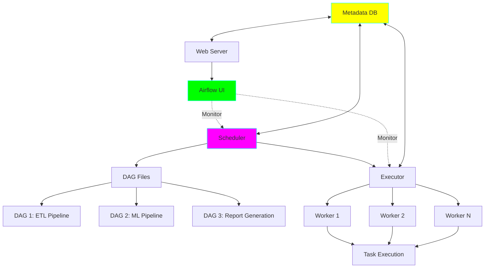
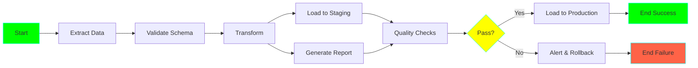
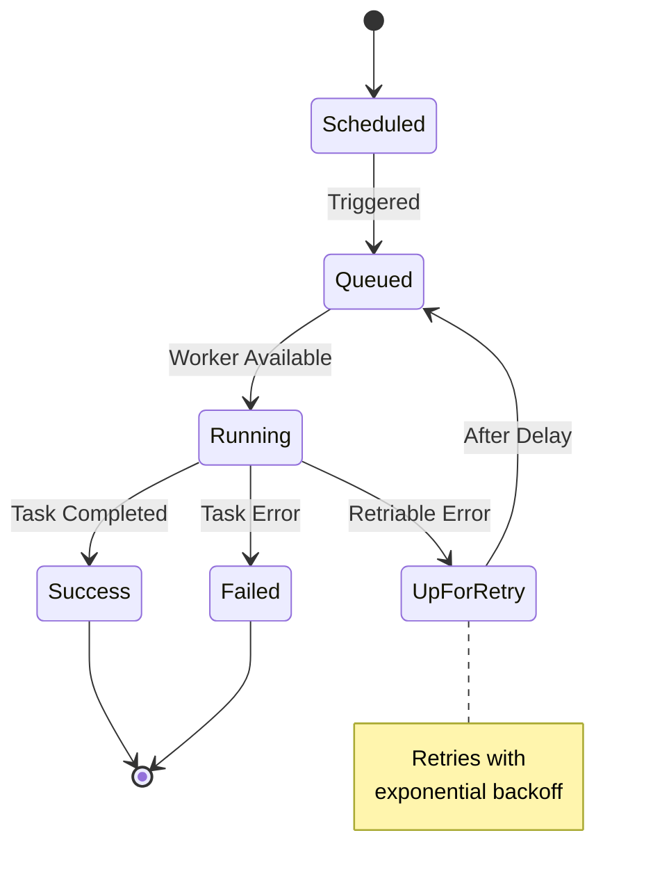

# Project 14: Apache Airflow DAG Builder

**Complexity:** ⭐⭐⭐⭐☆ | **Time:** 9-11 hours | **Tier:** Advanced Intermediate

## Overview

Build production-grade data pipelines using Apache Airflow with advanced orchestration patterns, dynamic DAG generation, and comprehensive error handling. This project teaches workflow orchestration, dependency management, and best practices for production data pipelines.

## Learning Objectives

After completing this project, you will understand:

- ✅ DAG structure and task dependencies
- ✅ Airflow operators and sensors
- ✅ XCom for inter-task communication
- ✅ Dynamic DAG generation
- ✅ Branching and conditional workflows
- ✅ SLA monitoring and alerting
- ✅ Connection and variable management
- ✅ TaskGroups and SubDAGs

## Architecture



## Key Concepts

### DAG Structure and Dependencies



### Task Lifecycle



### Executor Types

| Executor | Use Case | Pros | Cons |
|----------|----------|------|------|
| Sequential | Development, testing | Simple, no setup | No parallelism |
| Local | Small workloads | Easy setup | Limited scaling |
| Celery | Production | Distributed, scalable | Complex setup |
| Kubernetes | Cloud-native | Auto-scaling, isolation | K8s dependency |
| Dask | Data science | Python-native | Limited adoption |

### XCom (Cross-Communication)

```python
# Task A pushes data
def task_a(**context):
    result = {'processed_count': 1000, 'errors': 5}
    context['task_instance'].xcom_push(key='metrics', value=result)

# Task B pulls data
def task_b(**context):
    metrics = context['task_instance'].xcom_pull(
        task_ids='task_a',
        key='metrics'
    )
    print(f"Processed: {metrics['processed_count']}")
```

## Implementation Guide

### Step 1: Basic DAG Setup

```python
from airflow import DAG
from airflow.operators.python import PythonOperator
from airflow.operators.bash import BashOperator
from datetime import datetime, timedelta
import logging

logger = logging.getLogger(__name__)

# Default arguments for all tasks
default_args = {
    'owner': 'data-engineering',
    'depends_on_past': False,
    'email': ['alerts@company.com'],
    'email_on_failure': True,
    'email_on_retry': False,
    'retries': 3,
    'retry_delay': timedelta(minutes=5),
    'retry_exponential_backoff': True,
    'max_retry_delay': timedelta(hours=1),
    'execution_timeout': timedelta(hours=2),
}

# Create DAG
dag = DAG(
    'etl_pipeline',
    default_args=default_args,
    description='Production ETL pipeline',
    schedule_interval='0 2 * * *',  # Daily at 2 AM
    start_date=datetime(2024, 1, 1),
    catchup=False,  # Don't backfill
    max_active_runs=1,  # Prevent concurrent runs
    tags=['production', 'etl'],
)
```

### Step 2: Custom Operators

```python
from airflow.models import BaseOperator
from airflow.utils.decorators import apply_defaults
from typing import Optional, Dict, Any
import pandas as pd

class DataValidationOperator(BaseOperator):
    """
    Custom operator for data validation.

    Validates data against defined rules and fails if checks don't pass.
    """

    @apply_defaults
    def __init__(
        self,
        data_path: str,
        validation_rules: Dict[str, Any],
        fail_on_error: bool = True,
        *args,
        **kwargs
    ):
        super().__init__(*args, **kwargs)
        self.data_path = data_path
        self.validation_rules = validation_rules
        self.fail_on_error = fail_on_error

    def execute(self, context):
        """Execute validation."""
        logger.info(f"Validating data: {self.data_path}")

        # Load data
        df = pd.read_parquet(self.data_path)

        errors = []

        # Apply validation rules
        for column, rules in self.validation_rules.items():
            if column not in df.columns:
                errors.append(f"Missing column: {column}")
                continue

            # Check not null
            if rules.get('not_null'):
                null_count = df[column].isnull().sum()
                if null_count > 0:
                    errors.append(
                        f"Column {column} has {null_count} null values"
                    )

            # Check range
            if 'min' in rules:
                violations = (df[column] < rules['min']).sum()
                if violations > 0:
                    errors.append(
                        f"Column {column} has {violations} values < {rules['min']}"
                    )

            if 'max' in rules:
                violations = (df[column] > rules['max']).sum()
                if violations > 0:
                    errors.append(
                        f"Column {column} has {violations} values > {rules['max']}"
                    )

            # Check allowed values
            if 'allowed_values' in rules:
                invalid = ~df[column].isin(rules['allowed_values'])
                violations = invalid.sum()
                if violations > 0:
                    errors.append(
                        f"Column {column} has {violations} invalid values"
                    )

        # Push validation results to XCom
        validation_results = {
            'total_rows': len(df),
            'errors': errors,
            'valid': len(errors) == 0
        }

        context['task_instance'].xcom_push(
            key='validation_results',
            value=validation_results
        )

        # Fail if errors and fail_on_error is True
        if errors and self.fail_on_error:
            raise ValueError(f"Validation failed: {errors}")

        logger.info("Validation passed!")
        return validation_results


class IncrementalETLOperator(BaseOperator):
    """
    Custom operator for incremental ETL.

    Loads only new/changed data since last run.
    """

    @apply_defaults
    def __init__(
        self,
        source_conn_id: str,
        source_table: str,
        dest_path: str,
        watermark_column: str,
        *args,
        **kwargs
    ):
        super().__init__(*args, **kwargs)
        self.source_conn_id = source_conn_id
        self.source_table = source_table
        self.dest_path = dest_path
        self.watermark_column = watermark_column

    def execute(self, context):
        """Execute incremental load."""
        from airflow.hooks.base import BaseHook
        import sqlalchemy as sa

        # Get last watermark from XCom or Variable
        last_watermark = context['task_instance'].xcom_pull(
            task_ids=self.task_id,
            key='last_watermark',
            dag_id=self.dag_id
        )

        if not last_watermark:
            # First run - load all data
            last_watermark = '1970-01-01'

        logger.info(f"Loading data since: {last_watermark}")

        # Get connection
        connection = BaseHook.get_connection(self.source_conn_id)
        engine = sa.create_engine(connection.get_uri())

        # Query incremental data
        query = f"""
            SELECT *
            FROM {self.source_table}
            WHERE {self.watermark_column} > '{last_watermark}'
            ORDER BY {self.watermark_column}
        """

        df = pd.read_sql(query, engine)

        if len(df) == 0:
            logger.info("No new data to load")
            return

        # Save to parquet
        df.to_parquet(self.dest_path, index=False)

        # Update watermark
        new_watermark = df[self.watermark_column].max()
        context['task_instance'].xcom_push(
            key='last_watermark',
            value=str(new_watermark)
        )

        logger.info(f"Loaded {len(df)} rows, new watermark: {new_watermark}")

        return {
            'rows_loaded': len(df),
            'new_watermark': str(new_watermark)
        }
```

### Step 3: Sensors and Triggers

```python
from airflow.sensors.base import BaseSensorOperator
from airflow.sensors.filesystem import FileSensor
from airflow.sensors.external_task import ExternalTaskSensor
from airflow.operators.trigger_dagrun import TriggerDagRunOperator
import os

class DataQualitySensor(BaseSensorOperator):
    """
    Sensor that waits for data quality to meet threshold.

    Checks periodically and proceeds when quality is acceptable.
    """

    @apply_defaults
    def __init__(
        self,
        data_path: str,
        quality_threshold: float = 0.95,
        *args,
        **kwargs
    ):
        super().__init__(*args, **kwargs)
        self.data_path = data_path
        self.quality_threshold = quality_threshold

    def poke(self, context) -> bool:
        """
        Check if data quality meets threshold.

        Returns:
            True if quality acceptable, False otherwise
        """
        if not os.path.exists(self.data_path):
            logger.info(f"Data file not found: {self.data_path}")
            return False

        # Load data
        df = pd.read_parquet(self.data_path)

        # Calculate quality score
        total_cells = df.size
        null_cells = df.isnull().sum().sum()
        quality_score = 1 - (null_cells / total_cells)

        logger.info(f"Data quality score: {quality_score:.2%}")

        # Check threshold
        if quality_score >= self.quality_threshold:
            logger.info("Quality threshold met!")
            return True

        logger.info("Quality below threshold, waiting...")
        return False


# Example: Wait for file
wait_for_file = FileSensor(
    task_id='wait_for_input_file',
    filepath='/data/input/latest.csv',
    poke_interval=60,  # Check every 60 seconds
    timeout=3600,  # Timeout after 1 hour
    mode='poke',  # 'poke' or 'reschedule'
    dag=dag
)

# Example: Wait for another DAG's task
wait_for_upstream = ExternalTaskSensor(
    task_id='wait_for_data_ingestion',
    external_dag_id='data_ingestion_pipeline',
    external_task_id='load_complete',
    execution_delta=timedelta(hours=1),
    dag=dag
)

# Example: Trigger another DAG
trigger_report = TriggerDagRunOperator(
    task_id='trigger_report_generation',
    trigger_dag_id='daily_report_generator',
    conf={'report_date': '{{ ds }}'},  # Pass parameters
    dag=dag
)
```

### Step 4: Branching and Conditional Logic

```python
from airflow.operators.python import BranchPythonOperator
from airflow.operators.dummy import DummyOperator
from airflow.utils.trigger_rule import TriggerRule

def check_data_volume(**context):
    """
    Decide which processing path to take based on data volume.

    Returns:
        Task ID to execute next
    """
    # Get row count from previous task
    row_count = context['task_instance'].xcom_pull(
        task_ids='extract_data',
        key='row_count'
    )

    if row_count > 1000000:
        logger.info("Large dataset detected, using distributed processing")
        return 'process_with_spark'
    else:
        logger.info("Small dataset, using pandas")
        return 'process_with_pandas'


# Branching operator
branch_task = BranchPythonOperator(
    task_id='branch_by_data_volume',
    python_callable=check_data_volume,
    dag=dag
)

# Different processing paths
process_pandas = PythonOperator(
    task_id='process_with_pandas',
    python_callable=lambda: print("Processing with pandas"),
    dag=dag
)

process_spark = PythonOperator(
    task_id='process_with_spark',
    python_callable=lambda: print("Processing with Spark"),
    dag=dag
)

# Converge paths
join_task = DummyOperator(
    task_id='join_branches',
    trigger_rule=TriggerRule.NONE_FAILED_MIN_ONE_SUCCESS,
    dag=dag
)

# Set dependencies
branch_task >> [process_pandas, process_spark] >> join_task
```

### Step 5: TaskGroups for Organization

```python
from airflow.utils.task_group import TaskGroup

with dag:
    start = DummyOperator(task_id='start')

    # Extract TaskGroup
    with TaskGroup('extract', tooltip='Data extraction tasks') as extract_group:
        extract_db = PythonOperator(
            task_id='extract_from_database',
            python_callable=lambda: print("Extracting from DB")
        )

        extract_api = PythonOperator(
            task_id='extract_from_api',
            python_callable=lambda: print("Extracting from API")
        )

        extract_files = PythonOperator(
            task_id='extract_from_files',
            python_callable=lambda: print("Extracting from files")
        )

        extract_db >> extract_api >> extract_files

    # Transform TaskGroup
    with TaskGroup('transform', tooltip='Data transformation tasks') as transform_group:
        clean_data = PythonOperator(
            task_id='clean_data',
            python_callable=lambda: print("Cleaning data")
        )

        enrich_data = PythonOperator(
            task_id='enrich_data',
            python_callable=lambda: print("Enriching data")
        )

        aggregate_data = PythonOperator(
            task_id='aggregate_data',
            python_callable=lambda: print("Aggregating data")
        )

        clean_data >> enrich_data >> aggregate_data

    # Load TaskGroup
    with TaskGroup('load', tooltip='Data loading tasks') as load_group:
        validate = DataValidationOperator(
            task_id='validate_data',
            data_path='/tmp/transformed.parquet',
            validation_rules={
                'amount': {'not_null': True, 'min': 0},
                'status': {'allowed_values': ['active', 'inactive']}
            }
        )

        load_staging = PythonOperator(
            task_id='load_to_staging',
            python_callable=lambda: print("Loading to staging")
        )

        load_prod = PythonOperator(
            task_id='load_to_production',
            python_callable=lambda: print("Loading to production")
        )

        validate >> load_staging >> load_prod

    end = DummyOperator(task_id='end')

    # Overall dependencies
    start >> extract_group >> transform_group >> load_group >> end
```

### Step 6: Dynamic DAG Generation

```python
from airflow.models import Variable
import json

# Configuration for multiple similar pipelines
PIPELINE_CONFIG = [
    {
        'name': 'sales_pipeline',
        'source': 'sales_db',
        'table': 'transactions',
        'schedule': '0 1 * * *'
    },
    {
        'name': 'marketing_pipeline',
        'source': 'marketing_db',
        'table': 'campaigns',
        'schedule': '0 2 * * *'
    },
    {
        'name': 'product_pipeline',
        'source': 'product_db',
        'table': 'inventory',
        'schedule': '0 3 * * *'
    }
]

def create_etl_dag(config: Dict) -> DAG:
    """
    Factory function to create DAG from configuration.

    Args:
        config: Pipeline configuration

    Returns:
        Configured DAG
    """
    dag = DAG(
        config['name'],
        default_args=default_args,
        schedule_interval=config['schedule'],
        start_date=datetime(2024, 1, 1),
        catchup=False,
        tags=['dynamic', 'etl']
    )

    with dag:
        extract = IncrementalETLOperator(
            task_id='extract',
            source_conn_id=config['source'],
            source_table=config['table'],
            dest_path=f"/data/{config['name']}/extracted.parquet",
            watermark_column='updated_at'
        )

        transform = PythonOperator(
            task_id='transform',
            python_callable=lambda: print(f"Transforming {config['name']}")
        )

        load = PythonOperator(
            task_id='load',
            python_callable=lambda: print(f"Loading {config['name']}")
        )

        extract >> transform >> load

    return dag

# Generate DAGs
for config in PIPELINE_CONFIG:
    dag_id = config['name']
    globals()[dag_id] = create_etl_dag(config)
```

### Step 7: SLA Monitoring and Alerting

```python
from airflow.operators.email import EmailOperator
from airflow.utils.email import send_email

def sla_miss_callback(dag, task_list, blocking_task_list, slas, blocking_tis):
    """
    Callback when SLA is missed.

    Args:
        dag: DAG instance
        task_list: Tasks that missed SLA
        blocking_task_list: Tasks blocking SLA tasks
        slas: SLA configurations
        blocking_tis: Task instances blocking
    """
    logger.error(f"SLA MISSED for DAG: {dag.dag_id}")

    for task in task_list:
        logger.error(f"Task {task.task_id} missed SLA")

    # Send alert
    send_email(
        to=['alerts@company.com'],
        subject=f'SLA Missed: {dag.dag_id}',
        html_content=f"""
        <h3>SLA Missed Alert</h3>
        <p><strong>DAG:</strong> {dag.dag_id}</p>
        <p><strong>Tasks:</strong> {[t.task_id for t in task_list]}</p>
        <p><strong>Time:</strong> {datetime.now()}</p>
        """
    )

# DAG with SLA monitoring
dag_with_sla = DAG(
    'pipeline_with_sla',
    default_args=default_args,
    schedule_interval='0 2 * * *',
    start_date=datetime(2024, 1, 1),
    sla_miss_callback=sla_miss_callback,
    catchup=False
)

with dag_with_sla:
    # Task with SLA
    critical_task = PythonOperator(
        task_id='critical_processing',
        python_callable=lambda: print("Critical task"),
        sla=timedelta(hours=1)  # Must complete within 1 hour
    )

def failure_callback(context):
    """Called when task fails."""
    task_instance = context['task_instance']

    logger.error(
        f"Task {task_instance.task_id} failed in "
        f"DAG {task_instance.dag_id}"
    )

    # Custom alerting logic
    send_email(
        to=['oncall@company.com'],
        subject=f'Task Failure: {task_instance.task_id}',
        html_content=f"""
        <h3>Task Failure Alert</h3>
        <p><strong>Task:</strong> {task_instance.task_id}</p>
        <p><strong>DAG:</strong> {task_instance.dag_id}</p>
        <p><strong>Execution Date:</strong> {context['execution_date']}</p>
        <p><strong>Error:</strong> {context.get('exception')}</p>
        """
    )

# Task with failure callback
monitored_task = PythonOperator(
    task_id='monitored_task',
    python_callable=lambda: print("Important task"),
    on_failure_callback=failure_callback,
    dag=dag
)
```

## Nuanced Scenarios

### 1. Handling Long-Running Tasks

**Challenge:** Prevent executor from thinking task is dead.

```python
from airflow.operators.python import PythonOperator
from airflow.exceptions import AirflowTaskTimeout
import time

def long_running_task(**context):
    """
    Task that takes hours to complete.

    Must send heartbeats to prevent timeout.
    """
    from airflow.models import TaskInstance

    ti: TaskInstance = context['task_instance']
    total_iterations = 1000

    for i in range(total_iterations):
        # Do work
        time.sleep(10)

        # Update task state to show progress
        if i % 10 == 0:
            # Log progress
            progress = (i / total_iterations) * 100
            logger.info(f"Progress: {progress:.1f}%")

            # Send heartbeat (prevents timeout)
            ti.heartbeat()

    return "Completed"

long_task = PythonOperator(
    task_id='long_running_process',
    python_callable=long_running_task,
    execution_timeout=timedelta(hours=6),  # Extended timeout
    dag=dag
)
```

### 2. Idempotent Task Design

**Challenge:** Tasks should be safe to retry without side effects.

```python
def idempotent_load_task(**context):
    """
    Load data idempotently.

    Strategy: Use UPSERT or check if already loaded.
    """
    import sqlalchemy as sa

    execution_date = context['execution_date']
    batch_id = execution_date.strftime('%Y%m%d%H%M%S')

    # Check if already processed
    engine = sa.create_engine('postgresql://...')

    with engine.connect() as conn:
        result = conn.execute(
            sa.text("SELECT COUNT(*) FROM loads WHERE batch_id = :batch_id"),
            {'batch_id': batch_id}
        )

        if result.scalar() > 0:
            logger.info(f"Batch {batch_id} already processed, skipping")
            return

        # Load data
        df = pd.read_parquet(f'/data/{batch_id}.parquet')

        # Insert with UPSERT (PostgreSQL)
        df.to_sql(
            'target_table',
            engine,
            if_exists='append',
            index=False,
            method='multi'
        )

        # Record completion
        conn.execute(
            sa.text("""
                INSERT INTO loads (batch_id, loaded_at, row_count)
                VALUES (:batch_id, NOW(), :row_count)
            """),
            {'batch_id': batch_id, 'row_count': len(df)}
        )

        conn.commit()

    logger.info(f"Loaded {len(df)} rows for batch {batch_id}")
```

### 3. Cross-DAG Dependencies

**Challenge:** Coordinate across multiple DAGs.

```python
from airflow.sensors.external_task import ExternalTaskSensor, ExternalTaskMarker

# DAG 1: Upstream pipeline
with DAG('upstream_pipeline', ...) as upstream_dag:
    final_task = PythonOperator(
        task_id='final_processing',
        python_callable=lambda: print("Upstream complete")
    )

    # Mark completion for downstream DAGs
    marker = ExternalTaskMarker(
        task_id='mark_complete',
        external_dag_id='downstream_pipeline',
        external_task_id='wait_for_upstream'
    )

    final_task >> marker

# DAG 2: Downstream pipeline
with DAG('downstream_pipeline', ...) as downstream_dag:
    # Wait for upstream DAG
    wait = ExternalTaskSensor(
        task_id='wait_for_upstream',
        external_dag_id='upstream_pipeline',
        external_task_id='mark_complete',
        mode='reschedule',  # Don't block worker
        timeout=7200
    )

    process = PythonOperator(
        task_id='process_data',
        python_callable=lambda: print("Processing downstream")
    )

    wait >> process
```

### 4. Resource Management and Pools

**Challenge:** Limit concurrent tasks to prevent resource exhaustion.

```python
# Create pool via UI or CLI:
# airflow pools set database_pool 5 "Limit concurrent DB connections"

# Use pool in tasks
db_task_1 = PythonOperator(
    task_id='query_database_1',
    python_callable=lambda: print("Querying DB"),
    pool='database_pool',  # Limit to 5 concurrent
    priority_weight=10,  # Higher priority
    dag=dag
)

db_task_2 = PythonOperator(
    task_id='query_database_2',
    python_callable=lambda: print("Querying DB"),
    pool='database_pool',
    priority_weight=5,  # Lower priority
    dag=dag
)
```

## Exercises

### Exercise 1: Basic Pipeline
Create a DAG that:
- Extracts data from CSV
- Transforms with pandas
- Loads to database
- Sends success email

### Exercise 2: Dynamic DAG
Generate multiple DAGs from config:
- Read configuration from file/Variable
- Create similar pipelines
- Test with different schedules

### Exercise 3: Complex Dependencies
Build a pipeline with:
- Parallel tasks
- Branching logic
- TaskGroups
- Cross-DAG dependencies

### Exercise 4: Production Pipeline
Implement production features:
- SLA monitoring
- Error handling
- Idempotent tasks
- Resource pools
- Comprehensive logging

## Success Criteria

- [ ] Build functional multi-task DAG
- [ ] Implement error handling and retries
- [ ] Use TaskGroups for organization
- [ ] Implement branching logic
- [ ] Configure SLA monitoring
- [ ] Use sensors for external dependencies
- [ ] Implement dynamic DAG generation
- [ ] Design idempotent tasks

## Testing Checklist

```python
# tests/test_dags.py

def test_dag_loading():
    """Test DAG loads without errors."""
    pass

def test_task_dependencies():
    """Test task dependency graph."""
    pass

def test_task_execution():
    """Test individual task execution."""
    pass

def test_branching_logic():
    """Test branching decisions."""
    pass

def test_sla_configuration():
    """Test SLA settings."""
    pass

def test_xcom_communication():
    """Test XCom data passing."""
    pass

def test_error_handling():
    """Test retry and failure handling."""
    pass
```

## Common Pitfalls

1. **Catchup Enabled:** Causes backfill of all historical runs
2. **Heavy Operations in DAG File:** Slows scheduler parsing
3. **XCom Misuse:** Passing large data via XCom (use file paths instead)
4. **No Timeout:** Tasks can hang forever
5. **Not Idempotent:** Retries cause duplicates or errors
6. **Pool Exhaustion:** All workers blocked waiting for pool slots

## Next Steps

After completing this project:
1. Move to **Project 15: Delta Lake Implementation** for ACID transactions
2. Explore Airflow providers for AWS, GCP, Azure
3. Learn Airflow REST API for programmatic control
4. Study Airflow on Kubernetes for scalability

## References

- [Apache Airflow Documentation](https://airflow.apache.org/docs/)
- [Airflow Best Practices](https://airflow.apache.org/docs/apache-airflow/stable/best-practices.html)
- [DAG Writing Best Practices](https://airflow.apache.org/docs/apache-airflow/stable/best-practices.html#writing-a-dag)
- [Testing DAGs](https://airflow.apache.org/docs/apache-airflow/stable/best-practices.html#testing-a-dag)
- [Data Pipelines with Apache Airflow](https://www.manning.com/books/data-pipelines-with-apache-airflow)

---

**Happy Learning! 🚀**
