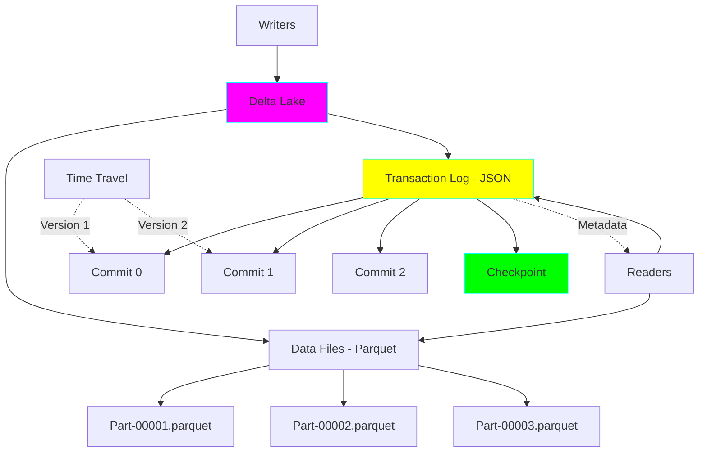
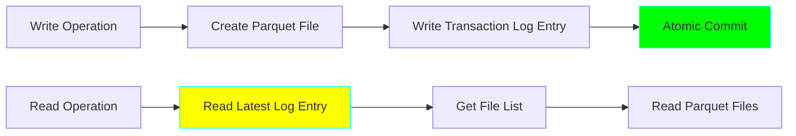
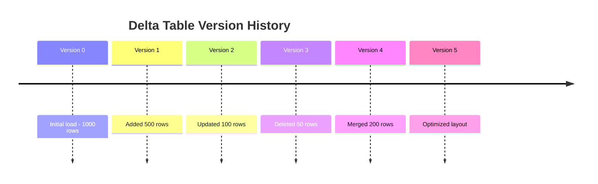
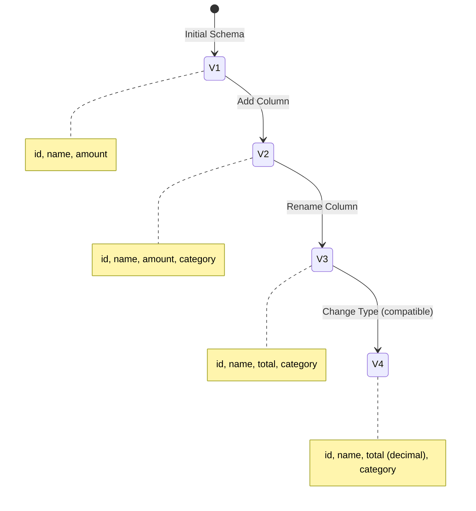

# Project 15: Delta Lake Implementation

**Complexity:** ⭐⭐⭐⭐☆ | **Time:** 8-10 hours | **Tier:** Advanced Intermediate

## Overview

Implement a production Delta Lake storage layer that brings ACID transactions, time travel, and schema evolution to data lakes. This project teaches how to build reliable data lakes with database-like guarantees while maintaining the scalability of object storage.

## Learning Objectives

After completing this project, you will understand:

- ✅ Delta Lake transaction log architecture
- ✅ ACID guarantees on object storage
- ✅ Time travel and data versioning
- ✅ Schema evolution and enforcement
- ✅ MERGE/UPSERT operations for CDC
- ✅ OPTIMIZE and VACUUM for maintenance
- ✅ Z-ordering for query performance
- ✅ Concurrent writer coordination

## Architecture



## Key Concepts

### Delta Lake Transaction Log



**Transaction Log Structure:**
```
_delta_log/
├── 00000000000000000000.json  # Commit 0
├── 00000000000000000001.json  # Commit 1
├── 00000000000000000002.json  # Commit 2
├── 00000000000000000010.checkpoint.parquet  # Checkpoint
└── 00000000000000000020.json  # Commit 20
```

### ACID Properties

| Property | Implementation | Benefit |
|----------|----------------|---------|
| Atomicity | Transaction log commits | All or nothing writes |
| Consistency | Schema validation | Type safety guaranteed |
| Isolation | Optimistic concurrency | No conflicts |
| Durability | Cloud storage | Permanent storage |

### Time Travel



**Query historical versions:**
```python
# Read version 2
df = spark.read.format("delta") \
    .option("versionAsOf", 2) \
    .load("/delta/table")

# Read as of timestamp
df = spark.read.format("delta") \
    .option("timestampAsOf", "2024-01-01") \
    .load("/delta/table")
```

### Schema Evolution



## Implementation Guide

### Step 1: Delta Lake Setup

```python
from delta import configure_spark_with_delta_pip
from pyspark.sql import SparkSession
from pyspark.conf import SparkConf
import logging

# Configure logging
logging.basicConfig(level=logging.INFO)
logger = logging.getLogger(__name__)

class DeltaLakeManager:
    """Manage Delta Lake tables with ACID guarantees."""

    def __init__(
        self,
        app_name: str = "Delta Lake Pipeline",
        master: str = "local[*]"
    ):
        """
        Initialize Spark session with Delta Lake support.

        Args:
            app_name: Application name
            master: Spark master URL
        """
        # Create Spark configuration
        conf = SparkConf()
        conf.set("spark.sql.extensions", "io.delta.sql.DeltaSparkSessionExtension")
        conf.set("spark.sql.catalog.spark_catalog", "org.apache.spark.sql.delta.catalog.DeltaCatalog")

        # Additional optimizations
        conf.set("spark.sql.adaptive.enabled", "true")
        conf.set("spark.databricks.delta.optimizeWrite.enabled", "true")
        conf.set("spark.databricks.delta.autoCompact.enabled", "true")

        # Create Spark session
        builder = SparkSession.builder \
            .appName(app_name) \
            .master(master) \
            .config(conf=conf)

        self.spark = configure_spark_with_delta_pip(builder).getOrCreate()

        logger.info("Delta Lake Spark session initialized")

    def __enter__(self):
        return self

    def __exit__(self, exc_type, exc_val, exc_tb):
        self.spark.stop()
```

### Step 2: Creating and Writing Delta Tables

```python
from delta.tables import DeltaTable
from pyspark.sql import DataFrame
from typing import Optional, List, Dict
from pyspark.sql import functions as F

class DeltaTableWriter:
    """Write operations for Delta tables."""

    def __init__(self, spark: SparkSession):
        self.spark = spark

    def create_table(
        self,
        df: DataFrame,
        path: str,
        partition_by: Optional[List[str]] = None,
        mode: str = "error",
        merge_schema: bool = False
    ):
        """
        Create Delta table from DataFrame.

        Args:
            df: Source DataFrame
            path: Delta table path
            partition_by: Partition columns
            mode: Write mode (error, append, overwrite, ignore)
            merge_schema: Allow schema evolution
        """
        writer = df.write.format("delta") \
            .mode(mode) \
            .option("mergeSchema", merge_schema)

        if partition_by:
            writer = writer.partitionBy(*partition_by)

        writer.save(path)

        logger.info(f"Created Delta table at {path}")

    def append_data(
        self,
        df: DataFrame,
        path: str,
        merge_schema: bool = False
    ):
        """
        Append data to existing Delta table.

        Args:
            df: Data to append
            path: Delta table path
            merge_schema: Allow schema changes
        """
        df.write.format("delta") \
            .mode("append") \
            .option("mergeSchema", merge_schema) \
            .save(path)

        logger.info(f"Appended {df.count()} rows to {path}")

    def overwrite_partition(
        self,
        df: DataFrame,
        path: str,
        partition_filter: str
    ):
        """
        Overwrite specific partition(s).

        Args:
            df: New data
            path: Delta table path
            partition_filter: Partition filter (e.g., "year=2024 AND month=01")
        """
        df.write.format("delta") \
            .mode("overwrite") \
            .option("replaceWhere", partition_filter) \
            .save(path)

        logger.info(f"Overwrote partition: {partition_filter}")

    def upsert_data(
        self,
        df: DataFrame,
        path: str,
        merge_keys: List[str],
        update_columns: Optional[List[str]] = None
    ):
        """
        Upsert data using MERGE operation.

        Args:
            df: Source data
            path: Delta table path
            merge_keys: Columns to match on
            update_columns: Columns to update (None = all)
        """
        delta_table = DeltaTable.forPath(self.spark, path)

        # Build merge condition
        merge_condition = " AND ".join([
            f"target.{key} = source.{key}"
            for key in merge_keys
        ])

        # Build update dict
        if update_columns:
            update_dict = {
                col: f"source.{col}"
                for col in update_columns
            }
        else:
            update_dict = {
                col: f"source.{col}"
                for col in df.columns
            }

        # Perform merge
        delta_table.alias("target") \
            .merge(
                df.alias("source"),
                merge_condition
            ) \
            .whenMatchedUpdate(set=update_dict) \
            .whenNotMatchedInsertAll() \
            .execute()

        logger.info(f"Upsert completed for {path}")
```

### Step 3: Reading and Time Travel

```python
from datetime import datetime, timedelta

class DeltaTableReader:
    """Read operations for Delta tables."""

    def __init__(self, spark: SparkSession):
        self.spark = spark

    def read_current(
        self,
        path: str,
        columns: Optional[List[str]] = None,
        filter_expr: Optional[str] = None
    ) -> DataFrame:
        """
        Read current version of Delta table.

        Args:
            path: Delta table path
            columns: Columns to select
            filter_expr: Filter expression

        Returns:
            DataFrame
        """
        df = self.spark.read.format("delta").load(path)

        if columns:
            df = df.select(*columns)

        if filter_expr:
            df = df.filter(filter_expr)

        return df

    def read_version(
        self,
        path: str,
        version: int
    ) -> DataFrame:
        """
        Read specific version (time travel).

        Args:
            path: Delta table path
            version: Version number

        Returns:
            DataFrame at that version
        """
        df = self.spark.read.format("delta") \
            .option("versionAsOf", version) \
            .load(path)

        logger.info(f"Reading version {version} from {path}")

        return df

    def read_timestamp(
        self,
        path: str,
        timestamp: str
    ) -> DataFrame:
        """
        Read table as of timestamp.

        Args:
            path: Delta table path
            timestamp: ISO format timestamp

        Returns:
            DataFrame at that time
        """
        df = self.spark.read.format("delta") \
            .option("timestampAsOf", timestamp) \
            .load(path)

        logger.info(f"Reading as of {timestamp} from {path}")

        return df

    def get_history(
        self,
        path: str,
        limit: Optional[int] = None
    ) -> DataFrame:
        """
        Get table history/audit log.

        Args:
            path: Delta table path
            limit: Number of versions to return

        Returns:
            DataFrame with version history
        """
        delta_table = DeltaTable.forPath(self.spark, path)
        history = delta_table.history(limit)

        return history

    def compare_versions(
        self,
        path: str,
        version1: int,
        version2: int
    ) -> Dict:
        """
        Compare two versions of a table.

        Args:
            path: Delta table path
            version1: First version
            version2: Second version

        Returns:
            Dict with comparison metrics
        """
        df1 = self.read_version(path, version1)
        df2 = self.read_version(path, version2)

        count1 = df1.count()
        count2 = df2.count()

        return {
            'version1': version1,
            'version2': version2,
            'count1': count1,
            'count2': count2,
            'diff': count2 - count1
        }
```

### Step 4: Schema Management

```python
from pyspark.sql.types import StructType, StructField, StringType, IntegerType

class DeltaSchemaManager:
    """Manage Delta table schemas."""

    def __init__(self, spark: SparkSession):
        self.spark = spark

    def get_schema(self, path: str) -> StructType:
        """
        Get current table schema.

        Args:
            path: Delta table path

        Returns:
            Schema
        """
        df = self.spark.read.format("delta").load(path)
        return df.schema

    def add_columns(
        self,
        path: str,
        new_columns: List[StructField]
    ):
        """
        Add new columns to table.

        Args:
            path: Delta table path
            new_columns: List of new column definitions
        """
        delta_table = DeltaTable.forPath(self.spark, path)

        for field in new_columns:
            # Generate ALTER TABLE statement
            delta_table.toDF() \
                .sparkSession.sql(f"""
                    ALTER TABLE delta.`{path}`
                    ADD COLUMNS ({field.name} {field.dataType.simpleString()})
                """)

        logger.info(f"Added {len(new_columns)} columns to {path}")

    def rename_column(
        self,
        path: str,
        old_name: str,
        new_name: str
    ):
        """
        Rename column.

        Args:
            path: Delta table path
            old_name: Current column name
            new_name: New column name
        """
        self.spark.sql(f"""
            ALTER TABLE delta.`{path}`
            RENAME COLUMN {old_name} TO {new_name}
        """)

        logger.info(f"Renamed column {old_name} -> {new_name}")

    def enforce_schema(
        self,
        df: DataFrame,
        expected_schema: StructType
    ) -> DataFrame:
        """
        Enforce schema on DataFrame before write.

        Args:
            df: Source DataFrame
            expected_schema: Expected schema

        Returns:
            DataFrame with enforced schema
        """
        # Validate columns
        for field in expected_schema.fields:
            if field.name not in df.columns:
                # Add missing column with nulls
                df = df.withColumn(field.name, F.lit(None).cast(field.dataType))

        # Select in correct order with correct types
        df = df.select(*[
            F.col(field.name).cast(field.dataType).alias(field.name)
            for field in expected_schema.fields
        ])

        return df
```

### Step 5: Optimization and Maintenance

```python
class DeltaTableOptimizer:
    """Optimize Delta tables for performance."""

    def __init__(self, spark: SparkSession):
        self.spark = spark

    def optimize(
        self,
        path: str,
        partition_filter: Optional[str] = None
    ):
        """
        Optimize table by compacting small files.

        Args:
            path: Delta table path
            partition_filter: Optional partition filter
        """
        delta_table = DeltaTable.forPath(self.spark, path)

        if partition_filter:
            delta_table.optimize() \
                .where(partition_filter) \
                .executeCompaction()
        else:
            delta_table.optimize().executeCompaction()

        logger.info(f"Optimized table at {path}")

    def z_order(
        self,
        path: str,
        z_order_cols: List[str],
        partition_filter: Optional[str] = None
    ):
        """
        Z-order table for better query performance.

        Args:
            path: Delta table path
            z_order_cols: Columns to z-order by
            partition_filter: Optional partition filter
        """
        delta_table = DeltaTable.forPath(self.spark, path)

        if partition_filter:
            delta_table.optimize() \
                .where(partition_filter) \
                .executeZOrderBy(*z_order_cols)
        else:
            delta_table.optimize().executeZOrderBy(*z_order_cols)

        logger.info(f"Z-ordered by {z_order_cols}")

    def vacuum(
        self,
        path: str,
        retention_hours: int = 168  # 7 days default
    ):
        """
        Remove old files no longer referenced.

        Args:
            path: Delta table path
            retention_hours: Hours to retain (default 168 = 7 days)
        """
        # Disable retention check (use carefully!)
        self.spark.conf.set("spark.databricks.delta.retentionDurationCheck.enabled", "false")

        delta_table = DeltaTable.forPath(self.spark, path)
        delta_table.vacuum(retention_hours)

        logger.info(f"Vacuumed files older than {retention_hours} hours")

    def get_table_stats(self, path: str) -> Dict:
        """
        Get table statistics.

        Args:
            path: Delta table path

        Returns:
            Dict with table metrics
        """
        delta_table = DeltaTable.forPath(self.spark, path)

        # Get detail
        detail = delta_table.detail().collect()[0]

        # Count files
        files = self.spark.sql(f"""
            SELECT COUNT(*) as file_count, SUM(size) as total_size
            FROM delta.`{path}`.files
        """).collect()[0]

        return {
            'num_files': detail['numFiles'],
            'size_bytes': detail['sizeInBytes'],
            'num_partitions': len(detail.get('partitionColumns', [])),
            'created_at': detail['createdAt'],
            'last_modified': detail['lastModified']
        }
```

### Step 6: Change Data Capture (CDC)

```python
class DeltaCDCProcessor:
    """Process CDC operations with Delta Lake."""

    def __init__(self, spark: SparkSession):
        self.spark = spark

    def apply_cdc(
        self,
        cdc_df: DataFrame,
        target_path: str,
        key_cols: List[str],
        operation_col: str = 'operation',
        sequence_col: str = 'timestamp'
    ):
        """
        Apply CDC changes to Delta table.

        Args:
            cdc_df: DataFrame with CDC events
            target_path: Target Delta table path
            key_cols: Key columns for matching
            operation_col: Column indicating operation (I/U/D)
            sequence_col: Column for ordering changes
        """
        delta_table = DeltaTable.forPath(self.spark, target_path)

        # Deduplicate CDC events (keep latest per key)
        from pyspark.sql.window import Window

        window_spec = Window.partitionBy(*key_cols) \
            .orderBy(F.desc(sequence_col))

        cdc_deduped = cdc_df.withColumn(
            '_row_num',
            F.row_number().over(window_spec)
        ).filter(F.col('_row_num') == 1).drop('_row_num')

        # Separate operations
        inserts = cdc_deduped.filter(F.col(operation_col) == 'I')
        updates = cdc_deduped.filter(F.col(operation_col) == 'U')
        deletes = cdc_deduped.filter(F.col(operation_col) == 'D')

        # Build merge condition
        merge_condition = " AND ".join([
            f"target.{key} = source.{key}"
            for key in key_cols
        ])

        # Apply inserts and updates
        if not inserts.rdd.isEmpty() or not updates.rdd.isEmpty():
            upserts = inserts.union(updates)

            delta_table.alias("target") \
                .merge(
                    upserts.alias("source"),
                    merge_condition
                ) \
                .whenMatchedUpdateAll() \
                .whenNotMatchedInsertAll() \
                .execute()

        # Apply deletes
        if not deletes.rdd.isEmpty():
            delta_table.alias("target") \
                .merge(
                    deletes.alias("source"),
                    merge_condition
                ) \
                .whenMatchedDelete() \
                .execute()

        logger.info("CDC changes applied")

    def get_changes(
        self,
        path: str,
        start_version: int,
        end_version: Optional[int] = None
    ) -> DataFrame:
        """
        Get CDC changes between versions.

        Args:
            path: Delta table path
            start_version: Starting version
            end_version: Ending version (None = latest)

        Returns:
            DataFrame with changes
        """
        if end_version:
            changes = self.spark.read.format("delta") \
                .option("readChangeFeed", "true") \
                .option("startingVersion", start_version) \
                .option("endingVersion", end_version) \
                .load(path)
        else:
            changes = self.spark.read.format("delta") \
                .option("readChangeFeed", "true") \
                .option("startingVersion", start_version) \
                .load(path)

        return changes
```

## Nuanced Scenarios

### 1. Concurrent Write Handling

**Challenge:** Multiple writers updating same table.

```python
from delta.exceptions import ConcurrentWriteException

class ConcurrentWriteHandler:
    """Handle concurrent writes safely."""

    def __init__(self, spark: SparkSession):
        self.spark = spark

    def write_with_retry(
        self,
        df: DataFrame,
        path: str,
        max_retries: int = 3
    ):
        """
        Write with automatic retry on conflict.

        Args:
            df: Data to write
            path: Delta table path
            max_retries: Maximum retry attempts
        """
        import time

        for attempt in range(max_retries):
            try:
                df.write.format("delta") \
                    .mode("append") \
                    .save(path)

                logger.info("Write successful")
                return

            except ConcurrentWriteException as e:
                if attempt < max_retries - 1:
                    wait_time = 2 ** attempt  # Exponential backoff
                    logger.warning(
                        f"Concurrent write detected, "
                        f"retrying in {wait_time}s..."
                    )
                    time.sleep(wait_time)
                else:
                    logger.error("Max retries exceeded")
                    raise

    def isolated_partition_write(
        self,
        df: DataFrame,
        path: str,
        partition_cols: List[str]
    ):
        """
        Write to isolated partitions (no conflicts).

        Strategy: Each writer handles different partitions.
        """
        # Get unique partition values
        partition_values = df.select(*partition_cols).distinct().collect()

        for partition in partition_values:
            # Build filter
            filter_expr = " AND ".join([
                f"{col} = '{getattr(partition, col)}'"
                for col in partition_cols
            ])

            partition_df = df.filter(filter_expr)

            # Write to specific partition (low conflict)
            partition_filter = " AND ".join([
                f"{col}='{getattr(partition, col)}'"
                for col in partition_cols
            ])

            partition_df.write.format("delta") \
                .mode("overwrite") \
                .option("replaceWhere", partition_filter) \
                .save(path)

            logger.info(f"Wrote partition: {partition_filter}")
```

### 2. Schema Evolution Strategies

**Challenge:** Evolve schema without breaking readers.

```python
class SchemaEvolutionStrategy:
    """Strategies for schema evolution."""

    @staticmethod
    def add_column_with_default(
        df: DataFrame,
        column_name: str,
        default_value,
        data_type
    ) -> DataFrame:
        """
        Add column with default value.

        Safe: Won't break existing readers.
        """
        return df.withColumn(
            column_name,
            F.lit(default_value).cast(data_type)
        )

    @staticmethod
    def rename_with_alias(
        df: DataFrame,
        old_name: str,
        new_name: str
    ) -> DataFrame:
        """
        Rename column while keeping old name as alias.

        Transition strategy: Keep both during migration.
        """
        return df.withColumn(new_name, F.col(old_name))

    @staticmethod
    def widen_type(
        df: DataFrame,
        column: str,
        new_type
    ) -> DataFrame:
        """
        Widen column type (safe evolution).

        Examples:
        - int -> long
        - float -> double
        - varchar(10) -> varchar(100)
        """
        return df.withColumn(column, F.col(column).cast(new_type))
```

### 3. Partition Evolution

**Challenge:** Change partitioning strategy without rewriting all data.

```python
def evolve_partitioning(
    spark: SparkSession,
    source_path: str,
    dest_path: str,
    old_partitions: List[str],
    new_partitions: List[str]
):
    """
    Evolve table to new partitioning scheme.

    Strategy: Copy data with new partitioning.
    """
    # Read with old partitioning
    df = spark.read.format("delta").load(source_path)

    # Write with new partitioning
    df.write.format("delta") \
        .mode("overwrite") \
        .partitionBy(*new_partitions) \
        .save(dest_path)

    logger.info(
        f"Evolved partitioning from {old_partitions} to {new_partitions}"
    )

    # Optionally: Replace old table
    # spark.sql(f"DROP TABLE delta.`{source_path}`")
    # spark.sql(f"ALTER TABLE delta.`{dest_path}` RENAME TO delta.`{source_path}`")
```

### 4. Version Retention and Cleanup

**Challenge:** Balance time travel vs storage costs.

```python
class VersionRetentionPolicy:
    """Manage version retention."""

    def __init__(self, spark: SparkSession):
        self.spark = spark

    def set_retention_policy(
        self,
        path: str,
        retention_days: int = 7
    ):
        """
        Set retention duration for old versions.

        Args:
            path: Delta table path
            retention_days: Days to retain old versions
        """
        retention_hours = retention_days * 24

        self.spark.sql(f"""
            ALTER TABLE delta.`{path}`
            SET TBLPROPERTIES (
                'delta.logRetentionDuration' = 'interval {retention_days} days',
                'delta.deletedFileRetentionDuration' = 'interval {retention_days} days'
            )
        """)

        logger.info(f"Set retention to {retention_days} days")

    def cleanup_old_versions(
        self,
        path: str,
        keep_versions: int = 10
    ):
        """
        Keep only recent versions, vacuum rest.

        Args:
            path: Delta table path
            keep_versions: Number of versions to keep
        """
        delta_table = DeltaTable.forPath(self.spark, path)

        # Get history
        history = delta_table.history().select("version").collect()
        total_versions = len(history)

        if total_versions > keep_versions:
            oldest_to_keep = history[keep_versions]["version"]

            # Calculate retention in hours
            # (rough estimate based on versions)
            retention_hours = 1  # Aggressive cleanup

            self.spark.conf.set(
                "spark.databricks.delta.retentionDurationCheck.enabled",
                "false"
            )

            delta_table.vacuum(retention_hours)

            logger.info(
                f"Cleaned up {total_versions - keep_versions} old versions"
            )
```

## Exercises

### Exercise 1: Basic Delta Lake
Create a Delta table:
- Load data from CSV
- Write as Delta format
- Read and verify
- Query history

### Exercise 2: Time Travel
Implement time travel:
- Make multiple updates
- Query different versions
- Compare versions
- Rollback to previous version

### Exercise 3: CDC Pipeline
Build CDC pipeline:
- Simulate CDC events
- Apply MERGE operations
- Handle deletes
- Track changes

### Exercise 4: Optimization
Optimize table:
- Compact small files
- Apply Z-ordering
- Vacuum old files
- Measure performance improvement

## Success Criteria

- [ ] Create Delta tables with ACID guarantees
- [ ] Implement MERGE/UPSERT operations
- [ ] Use time travel to query historical data
- [ ] Handle schema evolution
- [ ] Optimize tables with OPTIMIZE and Z-ordering
- [ ] Manage versions with VACUUM
- [ ] Handle concurrent writes safely
- [ ] Implement CDC processing

## Testing Checklist

```python
# tests/test_delta_lake.py

def test_table_creation():
    """Test Delta table creation."""
    pass

def test_append_data():
    """Test appending data."""
    pass

def test_merge_operation():
    """Test MERGE/UPSERT."""
    pass

def test_time_travel():
    """Test reading old versions."""
    pass

def test_schema_evolution():
    """Test adding columns."""
    pass

def test_optimization():
    """Test OPTIMIZE operation."""
    pass

def test_vacuum():
    """Test VACUUM operation."""
    pass

def test_concurrent_writes():
    """Test handling concurrent writes."""
    pass
```

## Common Pitfalls

1. **Vacuuming Too Aggressively:** Can't time travel after vacuum
2. **Not Using OPTIMIZE:** Many small files hurt performance
3. **Schema Enforcement Disabled:** Can lead to data quality issues
4. **Ignoring Concurrent Writes:** Can cause lost updates
5. **Over-partitioning:** Creates too many small files
6. **Not Checkpointing:** Transaction log becomes too large

## Next Steps

After completing this project:
1. Move to **Project 16: CDC with Debezium** for real-time CDC
2. Explore Delta Lake on different storage (S3, ADLS, GCS)
3. Learn Delta Sharing for secure data sharing
4. Study Apache Iceberg and Apache Hudi alternatives

## References

- [Delta Lake Documentation](https://docs.delta.io/)
- [Delta Lake Guide](https://docs.delta.io/latest/delta-intro.html)
- [Best Practices](https://docs.delta.io/latest/best-practices.html)
- [Delta Lake Paper](https://databricks.com/wp-content/uploads/2020/08/p975-armbrust.pdf)
- [Diving Into Delta Lake (O'Reilly)](https://www.oreilly.com/library/view/diving-into-delta/9781098151935/)

---

**Happy Learning! 🚀**
