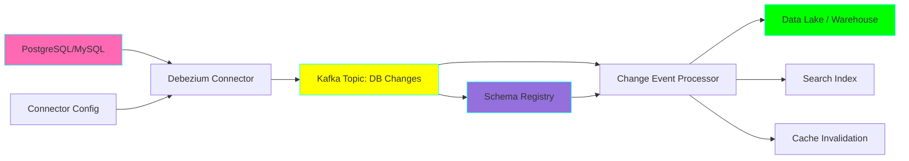
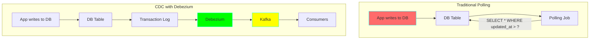
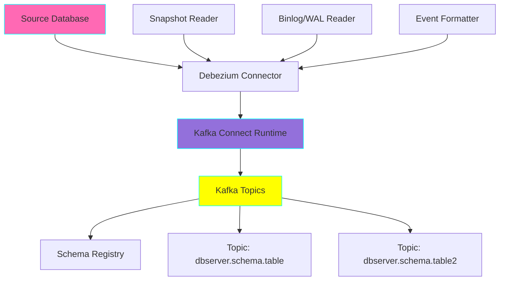
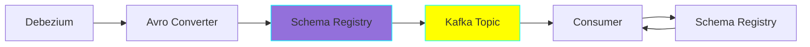

# Project 16: CDC with Debezium

**Complexity:** ⭐⭐⭐⭐⭐ | **Time:** 10-12 hours | **Tier:** Advanced Intermediate

## Overview

Build a Change Data Capture (CDC) system using Debezium to stream database changes in real-time. This project teaches how to capture insert, update, and delete operations from relational databases and process them as event streams for downstream systems.

## Learning Objectives

After completing this project, you will understand:

- ✅ Transaction log mining and CDC fundamentals
- ✅ Debezium architecture and connector ecosystem
- ✅ Schema registry and Avro serialization
- ✅ Eventual consistency patterns
- ✅ Event-driven architecture principles
- ✅ Handling database schema changes in real-time
- ✅ Snapshot strategies for initial loads
- ✅ Tombstone events for deletes

## Architecture



## Key Concepts

### Change Data Capture (CDC)

CDC captures changes from database transaction logs without impacting application performance.

**Traditional Polling vs CDC:**



**Benefits of CDC:**
- **Low Latency:** Changes captured in real-time (milliseconds)
- **No Application Changes:** Reads from transaction logs
- **Complete History:** Captures all changes, including deletes
- **Minimal DB Load:** No polling queries

### Debezium Architecture



### Change Event Structure

```json
{
  "before": {
    "id": 1001,
    "first_name": "Sally",
    "last_name": "Thomas",
    "email": "sally.thomas@example.com"
  },
  "after": {
    "id": 1001,
    "first_name": "Sally",
    "last_name": "Thompson",
    "email": "sally.thompson@example.com"
  },
  "source": {
    "version": "2.1.0.Final",
    "connector": "postgresql",
    "name": "dbserver1",
    "ts_ms": 1559033904863,
    "snapshot": "false",
    "db": "inventory",
    "schema": "public",
    "table": "customers",
    "txId": 556,
    "lsn": 24023816,
    "xmin": null
  },
  "op": "u",
  "ts_ms": 1559033904863
}
```

**Event Types:**
- `c` - Create (INSERT)
- `u` - Update (UPDATE)
- `d` - Delete (DELETE)
- `r` - Read (initial snapshot)

### Schema Registry Integration



## Implementation Guide

### Step 1: Database Setup with Replication

```python
# setup_postgres_cdc.py
import psycopg2
from psycopg2.extensions import ISOLATION_LEVEL_AUTOCOMMIT

def setup_postgres_for_cdc(host: str, port: int, user: str, password: str):
    """
    Configure PostgreSQL for CDC with Debezium.
    Requires logical replication to be enabled.
    """
    conn = psycopg2.connect(
        host=host,
        port=port,
        user=user,
        password=password,
        database='postgres'
    )
    conn.set_isolation_level(ISOLATION_LEVEL_AUTOCOMMIT)
    cursor = conn.cursor()

    # Create replication slot
    try:
        cursor.execute("""
            SELECT * FROM pg_create_logical_replication_slot(
                'debezium_slot',
                'pgoutput'
            );
        """)
        print("Created replication slot: debezium_slot")
    except psycopg2.Error as e:
        if "already exists" in str(e):
            print("Replication slot already exists")
        else:
            raise

    # Create publication for all tables
    try:
        cursor.execute("""
            CREATE PUBLICATION debezium_publication
            FOR ALL TABLES;
        """)
        print("Created publication: debezium_publication")
    except psycopg2.Error as e:
        if "already exists" in str(e):
            print("Publication already exists")
        else:
            raise

    # Verify configuration
    cursor.execute("SHOW wal_level;")
    wal_level = cursor.fetchone()[0]

    if wal_level != 'logical':
        raise Exception(
            f"WAL level is {wal_level}, must be 'logical'. "
            "Add 'wal_level = logical' to postgresql.conf and restart."
        )

    print(f"✓ PostgreSQL configured for CDC (wal_level={wal_level})")

    cursor.close()
    conn.close()

# Docker compose setup
DOCKER_COMPOSE = """
version: '3.8'
services:
  postgres:
    image: postgres:15
    environment:
      POSTGRES_USER: postgres
      POSTGRES_PASSWORD: postgres
      POSTGRES_DB: inventory
    command:
      - "postgres"
      - "-c"
      - "wal_level=logical"
    ports:
      - "5432:5432"
    volumes:
      - postgres_data:/var/lib/postgresql/data

  zookeeper:
    image: confluentinc/cp-zookeeper:7.4.0
    environment:
      ZOOKEEPER_CLIENT_PORT: 2181
      ZOOKEEPER_TICK_TIME: 2000

  kafka:
    image: confluentinc/cp-kafka:7.4.0
    depends_on:
      - zookeeper
    ports:
      - "9092:9092"
    environment:
      KAFKA_BROKER_ID: 1
      KAFKA_ZOOKEEPER_CONNECT: zookeeper:2181
      KAFKA_ADVERTISED_LISTENERS: PLAINTEXT://localhost:9092
      KAFKA_OFFSETS_TOPIC_REPLICATION_FACTOR: 1

  schema-registry:
    image: confluentinc/cp-schema-registry:7.4.0
    depends_on:
      - kafka
    ports:
      - "8081:8081"
    environment:
      SCHEMA_REGISTRY_HOST_NAME: schema-registry
      SCHEMA_REGISTRY_KAFKASTORE_BOOTSTRAP_SERVERS: kafka:9092

  connect:
    image: debezium/connect:2.4
    depends_on:
      - kafka
      - postgres
      - schema-registry
    ports:
      - "8083:8083"
    environment:
      BOOTSTRAP_SERVERS: kafka:9092
      GROUP_ID: 1
      CONFIG_STORAGE_TOPIC: connect_configs
      OFFSET_STORAGE_TOPIC: connect_offsets
      STATUS_STORAGE_TOPIC: connect_statuses
      KEY_CONVERTER: io.confluent.connect.avro.AvroConverter
      VALUE_CONVERTER: io.confluent.connect.avro.AvroConverter
      KEY_CONVERTER_SCHEMA_REGISTRY_URL: http://schema-registry:8081
      VALUE_CONVERTER_SCHEMA_REGISTRY_URL: http://schema-registry:8081

volumes:
  postgres_data:
"""
```

### Step 2: Debezium Connector Configuration

```python
# debezium_connector.py
import requests
import json
from typing import Dict, List, Optional
import logging

class DebeziumConnectorManager:
    """Manage Debezium connectors via REST API."""

    def __init__(self, connect_url: str = "http://localhost:8083"):
        self.connect_url = connect_url
        self.logger = logging.getLogger(__name__)

    def create_postgres_connector(
        self,
        connector_name: str,
        database_hostname: str,
        database_port: int,
        database_user: str,
        database_password: str,
        database_dbname: str,
        table_include_list: Optional[List[str]] = None,
        slot_name: str = "debezium_slot",
        publication_name: str = "debezium_publication"
    ) -> Dict:
        """
        Create a PostgreSQL CDC connector.

        Args:
            connector_name: Unique name for this connector
            database_hostname: PostgreSQL hostname
            database_port: PostgreSQL port
            database_user: Database user with replication privileges
            database_password: Database password
            database_dbname: Database name to capture
            table_include_list: List of tables (schema.table format)
            slot_name: Replication slot name
            publication_name: PostgreSQL publication name
        """
        config = {
            "name": connector_name,
            "config": {
                "connector.class": "io.debezium.connector.postgresql.PostgresConnector",
                "database.hostname": database_hostname,
                "database.port": str(database_port),
                "database.user": database_user,
                "database.password": database_password,
                "database.dbname": database_dbname,
                "database.server.name": connector_name,
                "plugin.name": "pgoutput",
                "slot.name": slot_name,
                "publication.name": publication_name,

                # Topic configuration
                "topic.prefix": connector_name,

                # Schema change handling
                "schema.history.internal.kafka.bootstrap.servers": "kafka:9092",
                "schema.history.internal.kafka.topic": f"{connector_name}.schema-changes",

                # Snapshot mode
                "snapshot.mode": "initial",

                # Serialization
                "key.converter": "io.confluent.connect.avro.AvroConverter",
                "value.converter": "io.confluent.connect.avro.AvroConverter",
                "key.converter.schema.registry.url": "http://schema-registry:8081",
                "value.converter.schema.registry.url": "http://schema-registry:8081",

                # Event processing
                "tombstones.on.delete": "true",
                "provide.transaction.metadata": "true",

                # Performance tuning
                "max.batch.size": "2048",
                "max.queue.size": "8192",
            }
        }

        # Add table filtering if specified
        if table_include_list:
            config["config"]["table.include.list"] = ",".join(table_include_list)

        response = requests.post(
            f"{self.connect_url}/connectors",
            headers={"Content-Type": "application/json"},
            data=json.dumps(config)
        )

        if response.status_code == 201:
            self.logger.info(f"✓ Created connector: {connector_name}")
            return response.json()
        else:
            self.logger.error(f"Failed to create connector: {response.text}")
            response.raise_for_status()

    def get_connector_status(self, connector_name: str) -> Dict:
        """Get connector status."""
        response = requests.get(f"{self.connect_url}/connectors/{connector_name}/status")
        return response.json()

    def pause_connector(self, connector_name: str):
        """Pause a running connector."""
        requests.put(f"{self.connect_url}/connectors/{connector_name}/pause")
        self.logger.info(f"Paused connector: {connector_name}")

    def resume_connector(self, connector_name: str):
        """Resume a paused connector."""
        requests.put(f"{self.connect_url}/connectors/{connector_name}/resume")
        self.logger.info(f"Resumed connector: {connector_name}")

    def delete_connector(self, connector_name: str):
        """Delete a connector."""
        requests.delete(f"{self.connect_url}/connectors/{connector_name}")
        self.logger.info(f"Deleted connector: {connector_name}")
```

### Step 3: Change Event Consumer

```python
# cdc_consumer.py
from confluent_kafka import Consumer, KafkaError
from confluent_kafka.schema_registry import SchemaRegistryClient
from confluent_kafka.schema_registry.avro import AvroDeserializer
from typing import Callable, Dict, Any, Optional
import json
import logging
from dataclasses import dataclass
from enum import Enum

class ChangeOperation(Enum):
    """CDC operation types."""
    CREATE = 'c'
    UPDATE = 'u'
    DELETE = 'd'
    READ = 'r'  # Snapshot read

@dataclass
class ChangeEvent:
    """Represents a database change event."""
    operation: ChangeOperation
    before: Optional[Dict[str, Any]]
    after: Optional[Dict[str, Any]]
    source: Dict[str, Any]
    timestamp_ms: int

    @property
    def table_name(self) -> str:
        return self.source.get('table', '')

    @property
    def database_name(self) -> str:
        return self.source.get('db', '')

    @property
    def is_snapshot(self) -> bool:
        return self.source.get('snapshot', 'false') == 'true'

class CDCEventProcessor:
    """Process change events from Debezium."""

    def __init__(
        self,
        kafka_bootstrap_servers: str,
        schema_registry_url: str,
        consumer_group: str = "cdc-processor"
    ):
        self.logger = logging.getLogger(__name__)

        # Schema Registry client
        self.schema_registry_client = SchemaRegistryClient({
            'url': schema_registry_url
        })

        # Kafka consumer configuration
        self.consumer_config = {
            'bootstrap.servers': kafka_bootstrap_servers,
            'group.id': consumer_group,
            'auto.offset.reset': 'earliest',
            'enable.auto.commit': False,
            'max.poll.interval.ms': 300000,
        }

        self.consumer = Consumer(self.consumer_config)
        self.handlers = {}

    def register_handler(
        self,
        table_name: str,
        handler: Callable[[ChangeEvent], None]
    ):
        """
        Register a handler function for a specific table.

        Args:
            table_name: Name of the table to handle
            handler: Function that processes ChangeEvent
        """
        self.handlers[table_name] = handler
        self.logger.info(f"Registered handler for table: {table_name}")

    def parse_change_event(self, message_value: Dict) -> ChangeEvent:
        """Parse Debezium change event."""
        return ChangeEvent(
            operation=ChangeOperation(message_value.get('op')),
            before=message_value.get('before'),
            after=message_value.get('after'),
            source=message_value.get('source', {}),
            timestamp_ms=message_value.get('ts_ms', 0)
        )

    def process_event(self, event: ChangeEvent):
        """Process a change event with registered handlers."""
        table_name = event.table_name

        if table_name in self.handlers:
            try:
                self.handlers[table_name](event)
            except Exception as e:
                self.logger.error(
                    f"Error processing event for {table_name}: {e}",
                    exc_info=True
                )
        else:
            self.logger.debug(f"No handler registered for table: {table_name}")

    def consume(self, topics: List[str], max_messages: Optional[int] = None):
        """
        Consume change events from Kafka topics.

        Args:
            topics: List of Kafka topics to subscribe to
            max_messages: Maximum number of messages to process (None = infinite)
        """
        self.consumer.subscribe(topics)
        self.logger.info(f"Subscribed to topics: {topics}")

        messages_processed = 0

        try:
            while True:
                if max_messages and messages_processed >= max_messages:
                    break

                msg = self.consumer.poll(timeout=1.0)

                if msg is None:
                    continue

                if msg.error():
                    if msg.error().code() == KafkaError._PARTITION_EOF:
                        continue
                    else:
                        self.logger.error(f"Consumer error: {msg.error()}")
                        continue

                # Deserialize message value
                try:
                    value = json.loads(msg.value().decode('utf-8'))

                    # Parse change event
                    event = self.parse_change_event(value)

                    # Process event
                    self.process_event(event)

                    # Commit offset
                    self.consumer.commit(asynchronous=False)

                    messages_processed += 1

                    if messages_processed % 100 == 0:
                        self.logger.info(f"Processed {messages_processed} messages")

                except Exception as e:
                    self.logger.error(f"Error processing message: {e}", exc_info=True)

        except KeyboardInterrupt:
            self.logger.info("Shutting down consumer...")

        finally:
            self.consumer.close()
            self.logger.info(f"Total messages processed: {messages_processed}")
```

### Step 4: Change Event Handlers

```python
# event_handlers.py
from cdc_consumer import ChangeEvent, ChangeOperation
import psycopg2
from typing import Dict, Any
import logging

class DataWarehouseSync:
    """Sync CDC events to a data warehouse."""

    def __init__(self, warehouse_connection_string: str):
        self.conn = psycopg2.connect(warehouse_connection_string)
        self.logger = logging.getLogger(__name__)

    def handle_customer_change(self, event: ChangeEvent):
        """Handle changes to customers table."""
        cursor = self.conn.cursor()

        try:
            if event.operation == ChangeOperation.CREATE:
                # Insert new record
                after = event.after
                cursor.execute("""
                    INSERT INTO customers_dwh (
                        id, first_name, last_name, email, created_at, updated_at
                    ) VALUES (%s, %s, %s, %s, %s, %s)
                    ON CONFLICT (id) DO NOTHING
                """, (
                    after['id'],
                    after['first_name'],
                    after['last_name'],
                    after['email'],
                    after.get('created_at'),
                    after.get('updated_at')
                ))

            elif event.operation == ChangeOperation.UPDATE:
                # Update existing record
                after = event.after
                cursor.execute("""
                    UPDATE customers_dwh SET
                        first_name = %s,
                        last_name = %s,
                        email = %s,
                        updated_at = %s
                    WHERE id = %s
                """, (
                    after['first_name'],
                    after['last_name'],
                    after['email'],
                    after.get('updated_at'),
                    after['id']
                ))

            elif event.operation == ChangeOperation.DELETE:
                # Soft delete or hard delete
                before = event.before
                cursor.execute("""
                    UPDATE customers_dwh SET
                        deleted_at = CURRENT_TIMESTAMP,
                        is_deleted = TRUE
                    WHERE id = %s
                """, (before['id'],))

            self.conn.commit()
            self.logger.debug(f"Synced {event.operation.value} for customer {event.after or event.before}")

        except Exception as e:
            self.logger.error(f"Error syncing customer: {e}")
            self.conn.rollback()

        finally:
            cursor.close()

class CacheInvalidator:
    """Invalidate cache entries based on CDC events."""

    def __init__(self, redis_client):
        self.redis = redis_client
        self.logger = logging.getLogger(__name__)

    def handle_product_change(self, event: ChangeEvent):
        """Invalidate product cache on changes."""
        try:
            if event.operation in [ChangeOperation.UPDATE, ChangeOperation.DELETE]:
                product_id = (event.after or event.before)['id']
                cache_key = f"product:{product_id}"

                self.redis.delete(cache_key)
                self.logger.info(f"Invalidated cache for product: {product_id}")

        except Exception as e:
            self.logger.error(f"Error invalidating cache: {e}")

class SearchIndexUpdater:
    """Update search index based on CDC events."""

    def __init__(self, elasticsearch_client):
        self.es = elasticsearch_client
        self.logger = logging.getLogger(__name__)

    def handle_product_change(self, event: ChangeEvent):
        """Update Elasticsearch index."""
        try:
            if event.operation == ChangeOperation.CREATE:
                # Index new document
                doc = event.after
                self.es.index(
                    index='products',
                    id=doc['id'],
                    document=doc
                )

            elif event.operation == ChangeOperation.UPDATE:
                # Update document
                doc = event.after
                self.es.update(
                    index='products',
                    id=doc['id'],
                    doc=doc
                )

            elif event.operation == ChangeOperation.DELETE:
                # Delete document
                doc_id = event.before['id']
                self.es.delete(
                    index='products',
                    id=doc_id
                )

            self.logger.info(f"Updated search index for product: {event.after or event.before}")

        except Exception as e:
            self.logger.error(f"Error updating search index: {e}")
```

## Nuanced Scenarios

### 1. Handling DDL Changes

**Challenge:** Database schema changes must be propagated to consumers.

```python
class SchemaChangeHandler:
    """Handle DDL changes from database."""

    def __init__(self):
        self.logger = logging.getLogger(__name__)
        self.schema_versions = {}

    def handle_schema_change(self, event: ChangeEvent):
        """
        Process schema change events.

        Debezium emits schema change events when:
        - Tables are created/dropped
        - Columns are added/removed/modified
        - Indexes are created/dropped
        """
        if event.source.get('schema_change', False):
            ddl = event.after.get('ddl')
            table = event.source.get('table')

            self.logger.warning(f"Schema change detected for {table}: {ddl}")

            # Notify downstream systems
            self._notify_schema_change(table, ddl)

            # Update schema registry
            self._update_schema_version(table, event.after.get('tableChanges'))

    def _notify_schema_change(self, table: str, ddl: str):
        """Notify downstream systems of schema changes."""
        # Send alerts, update documentation, etc.
        pass

    def _update_schema_version(self, table: str, changes: Dict):
        """Track schema versions."""
        if table not in self.schema_versions:
            self.schema_versions[table] = []

        self.schema_versions[table].append({
            'timestamp': datetime.now(),
            'changes': changes
        })
```

### 2. Large Transaction Processing

**Challenge:** Handle transactions that modify millions of rows.

```python
class LargeTransactionHandler:
    """Handle large transactions efficiently."""

    def __init__(self, batch_size: int = 1000):
        self.batch_size = batch_size
        self.current_batch = []
        self.logger = logging.getLogger(__name__)

    def handle_event(self, event: ChangeEvent):
        """
        Batch events from the same transaction.
        """
        # Check if event is part of a transaction
        tx_id = event.source.get('txId')

        if not tx_id:
            # Process immediately if not transactional
            self._process_single_event(event)
            return

        # Add to batch
        self.current_batch.append(event)

        # Process batch if size threshold reached
        if len(self.current_batch) >= self.batch_size:
            self._process_batch()

    def _process_batch(self):
        """Process accumulated batch."""
        if not self.current_batch:
            return

        self.logger.info(f"Processing batch of {len(self.current_batch)} events")

        # Bulk insert/update
        # Use bulk APIs for better performance

        self.current_batch = []

    def flush(self):
        """Flush remaining events."""
        self._process_batch()
```

### 3. Connector Failure Recovery

**Challenge:** Ensure no data loss during connector failures.

```python
class ConnectorHealthMonitor:
    """Monitor and recover from connector failures."""

    def __init__(self, connector_manager: DebeziumConnectorManager):
        self.manager = connector_manager
        self.logger = logging.getLogger(__name__)

    def check_connector_health(self, connector_name: str) -> bool:
        """Check if connector is healthy."""
        try:
            status = self.manager.get_connector_status(connector_name)

            connector_state = status['connector']['state']
            tasks_state = [task['state'] for task in status['tasks']]

            if connector_state != 'RUNNING':
                self.logger.error(f"Connector {connector_name} is {connector_state}")
                return False

            if any(state != 'RUNNING' for state in tasks_state):
                self.logger.error(f"Some tasks failed for {connector_name}")
                return False

            return True

        except Exception as e:
            self.logger.error(f"Error checking connector health: {e}")
            return False

    def recover_connector(self, connector_name: str):
        """Attempt to recover a failed connector."""
        self.logger.info(f"Attempting to recover connector: {connector_name}")

        # Restart tasks
        try:
            status = self.manager.get_connector_status(connector_name)

            for task in status['tasks']:
                if task['state'] == 'FAILED':
                    task_id = task['id']
                    self.logger.info(f"Restarting task {task_id}")
                    requests.post(
                        f"{self.manager.connect_url}/connectors/{connector_name}/tasks/{task_id}/restart"
                    )

        except Exception as e:
            self.logger.error(f"Error recovering connector: {e}")

    def monitor_continuously(self, connector_names: List[str], interval_seconds: int = 60):
        """Continuously monitor connectors."""
        import time

        while True:
            for name in connector_names:
                if not self.check_connector_health(name):
                    self.recover_connector(name)

            time.sleep(interval_seconds)
```

### 4. Cross-Database CDC

**Challenge:** Capture changes from multiple heterogeneous databases.

```python
class MultiDatabaseCDC:
    """Manage CDC from multiple database types."""

    def __init__(self, connector_manager: DebeziumConnectorManager):
        self.manager = connector_manager
        self.logger = logging.getLogger(__name__)

    def setup_postgres_cdc(self, config: Dict):
        """Setup PostgreSQL CDC."""
        return self.manager.create_postgres_connector(
            connector_name=config['name'],
            database_hostname=config['host'],
            database_port=config['port'],
            database_user=config['user'],
            database_password=config['password'],
            database_dbname=config['database']
        )

    def setup_mysql_cdc(self, config: Dict):
        """Setup MySQL CDC connector."""
        connector_config = {
            "name": config['name'],
            "config": {
                "connector.class": "io.debezium.connector.mysql.MySqlConnector",
                "database.hostname": config['host'],
                "database.port": str(config['port']),
                "database.user": config['user'],
                "database.password": config['password'],
                "database.server.id": "184054",
                "database.server.name": config['name'],
                "database.include.list": config['database'],
                "database.history.kafka.bootstrap.servers": "kafka:9092",
                "database.history.kafka.topic": f"{config['name']}.schema-changes"
            }
        }

        response = requests.post(
            f"{self.manager.connect_url}/connectors",
            headers={"Content-Type": "application/json"},
            data=json.dumps(connector_config)
        )

        return response.json()

    def setup_mongodb_cdc(self, config: Dict):
        """Setup MongoDB CDC connector."""
        # MongoDB uses change streams
        connector_config = {
            "name": config['name'],
            "config": {
                "connector.class": "io.debezium.connector.mongodb.MongoDbConnector",
                "mongodb.connection.string": config['connection_string'],
                "mongodb.name": config['name'],
                "collection.include.list": config.get('collections', '')
            }
        }

        response = requests.post(
            f"{self.manager.connect_url}/connectors",
            headers={"Content-Type": "application/json"},
            data=json.dumps(connector_config)
        )

        return response.json()
```

## Exercises

### Exercise 1: Basic CDC Setup
Set up Debezium to capture changes from a PostgreSQL database:
- Create source database with sample tables
- Configure Debezium connector
- Consume and log change events
- Verify INSERT, UPDATE, DELETE operations

### Exercise 2: Data Warehouse Sync
Build a pipeline that syncs database changes to a data warehouse:
- Process change events in order
- Handle late-arriving events
- Implement idempotent processing
- Add monitoring and alerting

### Exercise 3: Schema Evolution
Handle schema changes without downtime:
- Add new columns to source table
- Modify column types
- Process events with old and new schemas
- Implement backward compatibility

### Exercise 4: Multi-Table Join Materialization
Create materialized views by joining change events from multiple tables:
- Capture changes from orders and order_items tables
- Maintain denormalized view in real-time
- Handle foreign key relationships
- Optimize for query performance

## Success Criteria

- [ ] Capture database changes in real-time (<1s latency)
- [ ] Process INSERT, UPDATE, DELETE events correctly
- [ ] Handle schema changes without data loss
- [ ] Implement exactly-once processing semantics
- [ ] No data loss during connector failures
- [ ] Monitor connector health and lag metrics
- [ ] Support initial snapshot and incremental sync
- [ ] Handle tombstone events for deletes

## Testing Checklist

```python
# tests/test_cdc.py

def test_connector_creation():
    """Test creating Debezium connector."""
    pass

def test_change_event_processing():
    """Test processing INSERT, UPDATE, DELETE events."""
    pass

def test_schema_change_handling():
    """Test handling DDL changes."""
    pass

def test_large_transaction():
    """Test processing transactions with many rows."""
    pass

def test_connector_failure_recovery():
    """Test recovering from connector failures."""
    pass

def test_exactly_once_semantics():
    """Test idempotent event processing."""
    pass

def test_snapshot_mode():
    """Test initial snapshot functionality."""
    pass

def test_tombstone_events():
    """Test delete event tombstones."""
    pass
```

## Common Pitfalls

1. **Insufficient Replication Permissions:** Ensure database user has replication privileges
2. **WAL Disk Space:** Monitor transaction log growth and configure retention
3. **Schema Registry Failures:** Handle schema registry downtime gracefully
4. **Consumer Lag:** Monitor and scale consumers to keep up with change rate
5. **Large Snapshots:** Use incremental snapshots for very large tables
6. **Binary Log Format:** Ensure correct binlog format (ROW for MySQL)
7. **Network Partitions:** Handle network issues between database and Kafka

## Next Steps

After completing this project:
1. Move to **Project 17: API Rate Limiter & Backfill**
2. Combine CDC with **Project 15: Delta Lake** for ACID compliance
3. Use CDC events in **Project 19: Real-time Deduplication**

## References

- [Debezium Documentation](https://debezium.io/documentation/)
- [PostgreSQL Logical Replication](https://www.postgresql.org/docs/current/logical-replication.html)
- [Kafka Connect Documentation](https://docs.confluent.io/platform/current/connect/index.html)
- [Change Data Capture Patterns](https://www.confluent.io/blog/change-data-capture-with-debezium-and-kafka/)
- [Schema Registry Guide](https://docs.confluent.io/platform/current/schema-registry/index.html)

---

**Happy Learning! 🚀**
