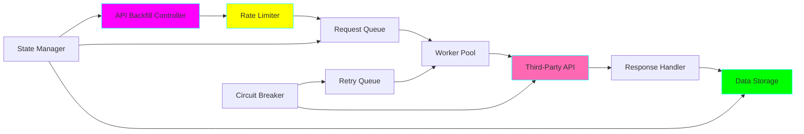
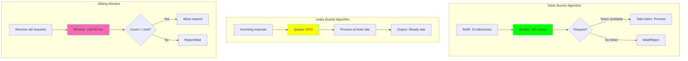
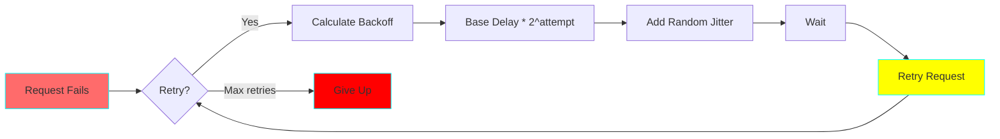

# Project 17: API Rate Limiter & Backfill

**Complexity:** ⭐⭐⭐☆☆ | **Time:** 6-8 hours | **Tier:** Advanced Intermediate

## Overview

Build a robust API data extraction system with intelligent rate limiting, exponential backoff, and historical data backfill capabilities. This project teaches how to work with third-party API constraints while ensuring reliable data ingestion.

## Learning Objectives

After completing this project, you will understand:

- ✅ Rate limiting algorithms (Token Bucket, Leaky Bucket, Sliding Window)
- ✅ Exponential backoff with jitter
- ✅ API pagination strategies
- ✅ Idempotent request handling
- ✅ State persistence for resumable operations
- ✅ Circuit breaker patterns
- ✅ Parallel request management
- ✅ Quota management and forecasting

## Architecture



## Key Concepts

### Rate Limiting Algorithms



### Exponential Backoff with Jitter



**Backoff Formula:**
```
delay = min(max_delay, base_delay * 2^attempt) + random(0, jitter)
```

### API Pagination Patterns

| Pattern | Description | Example |
|---------|-------------|---------|
| **Offset-based** | Skip N records | `?offset=100&limit=50` |
| **Cursor-based** | Opaque pointer | `?cursor=xyz123&limit=50` |
| **Page-based** | Page numbers | `?page=3&per_page=50` |
| **Link-based** | HATEOAS links | `rel="next"` in headers |

## Implementation Guide

### Step 1: Token Bucket Rate Limiter

```python
# rate_limiter.py
import time
import threading
from typing import Optional
from dataclasses import dataclass
import logging

@dataclass
class RateLimitConfig:
    """Configuration for rate limiting."""
    max_tokens: int  # Maximum tokens in bucket
    refill_rate: float  # Tokens added per second
    burst_size: int  # Allow bursts up to this size

class TokenBucketRateLimiter:
    """
    Thread-safe token bucket rate limiter.

    Allows bursts up to max_tokens, then enforces steady rate.
    """

    def __init__(self, config: RateLimitConfig):
        self.max_tokens = config.max_tokens
        self.refill_rate = config.refill_rate
        self.burst_size = min(config.burst_size, config.max_tokens)

        self.tokens = float(self.max_tokens)
        self.last_refill = time.time()
        self.lock = threading.Lock()
        self.logger = logging.getLogger(__name__)

    def _refill(self):
        """Refill tokens based on elapsed time."""
        now = time.time()
        elapsed = now - self.last_refill

        # Add tokens based on elapsed time
        new_tokens = elapsed * self.refill_rate
        self.tokens = min(self.max_tokens, self.tokens + new_tokens)
        self.last_refill = now

    def acquire(self, tokens: int = 1, blocking: bool = True, timeout: Optional[float] = None) -> bool:
        """
        Acquire tokens from the bucket.

        Args:
            tokens: Number of tokens to acquire
            blocking: If True, wait until tokens available
            timeout: Maximum time to wait (None = infinite)

        Returns:
            True if tokens acquired, False otherwise
        """
        start_time = time.time()

        while True:
            with self.lock:
                self._refill()

                if self.tokens >= tokens:
                    self.tokens -= tokens
                    return True

                if not blocking:
                    return False

                # Calculate wait time
                tokens_needed = tokens - self.tokens
                wait_time = tokens_needed / self.refill_rate

            # Check timeout
            if timeout is not None:
                elapsed = time.time() - start_time
                if elapsed >= timeout:
                    return False
                wait_time = min(wait_time, timeout - elapsed)

            # Wait and retry
            time.sleep(wait_time)

    def get_available_tokens(self) -> float:
        """Get current number of available tokens."""
        with self.lock:
            self._refill()
            return self.tokens

class MultiEndpointRateLimiter:
    """Manage rate limits for multiple API endpoints."""

    def __init__(self):
        self.limiters = {}
        self.logger = logging.getLogger(__name__)

    def add_endpoint(self, endpoint: str, config: RateLimitConfig):
        """Add rate limiter for an endpoint."""
        self.limiters[endpoint] = TokenBucketRateLimiter(config)
        self.logger.info(f"Added rate limiter for {endpoint}: {config}")

    def acquire(self, endpoint: str, tokens: int = 1, **kwargs) -> bool:
        """Acquire tokens for a specific endpoint."""
        if endpoint not in self.limiters:
            # No rate limit configured, allow request
            return True

        return self.limiters[endpoint].acquire(tokens, **kwargs)

    def get_wait_time(self, endpoint: str, tokens: int = 1) -> float:
        """Get estimated wait time for tokens."""
        if endpoint not in self.limiters:
            return 0.0

        limiter = self.limiters[endpoint]
        available = limiter.get_available_tokens()

        if available >= tokens:
            return 0.0

        tokens_needed = tokens - available
        return tokens_needed / limiter.refill_rate
```

### Step 2: Retry Logic with Exponential Backoff

```python
# retry_handler.py
import time
import random
from typing import Callable, Optional, Type, Tuple
from functools import wraps
import logging

class RetryConfig:
    """Configuration for retry logic."""

    def __init__(
        self,
        max_retries: int = 5,
        base_delay: float = 1.0,
        max_delay: float = 60.0,
        exponential_base: float = 2.0,
        jitter: bool = True,
        jitter_max: float = 1.0
    ):
        self.max_retries = max_retries
        self.base_delay = base_delay
        self.max_delay = max_delay
        self.exponential_base = exponential_base
        self.jitter = jitter
        self.jitter_max = jitter_max

class RetryHandler:
    """Handle retries with exponential backoff and jitter."""

    def __init__(self, config: RetryConfig):
        self.config = config
        self.logger = logging.getLogger(__name__)

    def calculate_delay(self, attempt: int) -> float:
        """
        Calculate delay for given attempt number.

        Formula: min(max_delay, base_delay * exponential_base^attempt) + jitter
        """
        # Exponential backoff
        delay = self.config.base_delay * (self.config.exponential_base ** attempt)
        delay = min(delay, self.config.max_delay)

        # Add jitter to prevent thundering herd
        if self.config.jitter:
            jitter = random.uniform(0, self.config.jitter_max)
            delay += jitter

        return delay

    def execute_with_retry(
        self,
        func: Callable,
        *args,
        retry_on: Tuple[Type[Exception], ...] = (Exception,),
        **kwargs
    ):
        """
        Execute function with retry logic.

        Args:
            func: Function to execute
            retry_on: Tuple of exception types to retry on
            *args, **kwargs: Arguments to pass to func

        Returns:
            Result of successful function call

        Raises:
            Last exception if all retries exhausted
        """
        last_exception = None

        for attempt in range(self.config.max_retries + 1):
            try:
                result = func(*args, **kwargs)
                if attempt > 0:
                    self.logger.info(f"Success after {attempt} retries")
                return result

            except retry_on as e:
                last_exception = e

                if attempt >= self.config.max_retries:
                    self.logger.error(f"Max retries ({self.config.max_retries}) exhausted")
                    raise

                delay = self.calculate_delay(attempt)
                self.logger.warning(
                    f"Attempt {attempt + 1} failed: {e}. "
                    f"Retrying in {delay:.2f}s..."
                )
                time.sleep(delay)

        # Should not reach here, but just in case
        raise last_exception

def retry(
    max_retries: int = 5,
    base_delay: float = 1.0,
    retry_on: Tuple[Type[Exception], ...] = (Exception,)
):
    """
    Decorator for automatic retry with exponential backoff.

    Usage:
        @retry(max_retries=3, base_delay=2.0)
        def fetch_data():
            # code that might fail
            pass
    """
    def decorator(func):
        @wraps(func)
        def wrapper(*args, **kwargs):
            config = RetryConfig(max_retries=max_retries, base_delay=base_delay)
            handler = RetryHandler(config)
            return handler.execute_with_retry(func, *args, retry_on=retry_on, **kwargs)
        return wrapper
    return decorator
```

### Step 3: API Client with Rate Limiting

```python
# api_client.py
import requests
from typing import Dict, Any, Optional, Generator
from urllib.parse import urljoin
import logging
from datetime import datetime

class RateLimitedAPIClient:
    """API client with built-in rate limiting and retry logic."""

    def __init__(
        self,
        base_url: str,
        rate_limiter: TokenBucketRateLimiter,
        retry_handler: RetryHandler,
        auth_token: Optional[str] = None
    ):
        self.base_url = base_url
        self.rate_limiter = rate_limiter
        self.retry_handler = retry_handler
        self.session = requests.Session()
        self.logger = logging.getLogger(__name__)

        if auth_token:
            self.session.headers.update({
                'Authorization': f'Bearer {auth_token}'
            })

    def _make_request(
        self,
        method: str,
        endpoint: str,
        **kwargs
    ) -> requests.Response:
        """Make HTTP request with rate limiting."""
        # Acquire rate limit token
        self.rate_limiter.acquire(tokens=1, blocking=True)

        # Make request
        url = urljoin(self.base_url, endpoint)
        self.logger.debug(f"{method} {url}")

        response = self.session.request(method, url, **kwargs)

        # Handle rate limit headers
        self._update_rate_limit_from_headers(response.headers)

        # Check for rate limit errors
        if response.status_code == 429:
            retry_after = int(response.headers.get('Retry-After', 60))
            self.logger.warning(f"Rate limited. Retry after {retry_after}s")
            time.sleep(retry_after)
            raise Exception("Rate limit exceeded")

        response.raise_for_status()
        return response

    def _update_rate_limit_from_headers(self, headers: Dict[str, str]):
        """Update rate limiter based on API response headers."""
        # Many APIs include rate limit info in headers
        # X-RateLimit-Remaining, X-RateLimit-Reset, etc.
        remaining = headers.get('X-RateLimit-Remaining')
        if remaining:
            self.logger.debug(f"API rate limit remaining: {remaining}")

    def get(self, endpoint: str, params: Optional[Dict] = None) -> Dict[str, Any]:
        """GET request with retry."""
        def make_get():
            response = self._make_request('GET', endpoint, params=params)
            return response.json()

        return self.retry_handler.execute_with_retry(make_get)

    def post(self, endpoint: str, data: Optional[Dict] = None) -> Dict[str, Any]:
        """POST request with retry."""
        def make_post():
            response = self._make_request('POST', endpoint, json=data)
            return response.json()

        return self.retry_handler.execute_with_retry(make_post)

    def paginate(
        self,
        endpoint: str,
        params: Optional[Dict] = None,
        page_size: int = 100,
        max_pages: Optional[int] = None
    ) -> Generator[Dict[str, Any], None, None]:
        """
        Paginate through API results.

        Supports multiple pagination styles:
        - Offset-based
        - Cursor-based
        - Link-based
        """
        params = params or {}
        page = 0

        while True:
            if max_pages and page >= max_pages:
                break

            # Try offset-based pagination
            page_params = {
                **params,
                'limit': page_size,
                'offset': page * page_size
            }

            response = self.get(endpoint, params=page_params)

            # Yield results
            if isinstance(response, dict):
                data = response.get('data', response.get('results', []))
            else:
                data = response

            if not data:
                break

            for item in data:
                yield item

            # Check for next page
            if isinstance(response, dict):
                # Cursor-based pagination
                next_cursor = response.get('next_cursor') or response.get('next')
                if next_cursor:
                    params['cursor'] = next_cursor
                    continue

                # Check if we got fewer results than page size (last page)
                if len(data) < page_size:
                    break

            page += 1
```

### Step 4: Backfill Orchestrator

```python
# backfill_orchestrator.py
from typing import Optional, Dict, Any, Callable
from datetime import datetime, timedelta
import json
from pathlib import Path
import logging
from concurrent.futures import ThreadPoolExecutor, as_completed
from dataclasses import dataclass, asdict
import hashlib

@dataclass
class BackfillState:
    """Track backfill progress."""
    start_date: str
    end_date: str
    current_date: str
    total_records: int
    failed_dates: list
    completed: bool
    last_updated: str

class BackfillOrchestrator:
    """Orchestrate historical data backfill with resume capability."""

    def __init__(
        self,
        api_client: RateLimitedAPIClient,
        state_file: str = "backfill_state.json",
        max_workers: int = 5
    ):
        self.api_client = api_client
        self.state_file = Path(state_file)
        self.max_workers = max_workers
        self.logger = logging.getLogger(__name__)

    def save_state(self, state: BackfillState):
        """Save backfill state to disk."""
        with open(self.state_file, 'w') as f:
            json.dump(asdict(state), f, indent=2)

    def load_state(self) -> Optional[BackfillState]:
        """Load backfill state from disk."""
        if not self.state_file.exists():
            return None

        with open(self.state_file, 'r') as f:
            data = json.load(f)
            return BackfillState(**data)

    def backfill_date_range(
        self,
        start_date: datetime,
        end_date: datetime,
        fetch_func: Callable[[datetime], Any],
        process_func: Callable[[Any, datetime], None],
        resume: bool = True
    ):
        """
        Backfill data for a date range.

        Args:
            start_date: Start of date range
            end_date: End of date range (inclusive)
            fetch_func: Function to fetch data for a date
            process_func: Function to process fetched data
            resume: Resume from previous state if available
        """
        # Load or create state
        if resume:
            state = self.load_state()
            if state and not state.completed:
                self.logger.info(f"Resuming backfill from {state.current_date}")
                current_date = datetime.fromisoformat(state.current_date)
            else:
                state = None
                current_date = start_date
        else:
            state = None
            current_date = start_date

        if not state:
            state = BackfillState(
                start_date=start_date.isoformat(),
                end_date=end_date.isoformat(),
                current_date=current_date.isoformat(),
                total_records=0,
                failed_dates=[],
                completed=False,
                last_updated=datetime.now().isoformat()
            )

        # Process each date
        while current_date <= end_date:
            date_str = current_date.strftime('%Y-%m-%d')
            self.logger.info(f"Processing {date_str}")

            try:
                # Fetch data for this date
                data = fetch_func(current_date)

                # Process data
                process_func(data, current_date)

                # Update state
                state.current_date = current_date.isoformat()
                state.total_records += len(data) if isinstance(data, list) else 1
                state.last_updated = datetime.now().isoformat()
                self.save_state(state)

                self.logger.info(f"✓ Completed {date_str} ({state.total_records} total records)")

            except Exception as e:
                self.logger.error(f"✗ Failed {date_str}: {e}")
                state.failed_dates.append(date_str)
                self.save_state(state)

            # Move to next date
            current_date += timedelta(days=1)

        # Mark as completed
        state.completed = True
        state.last_updated = datetime.now().isoformat()
        self.save_state(state)

        self.logger.info(f"Backfill completed! Total records: {state.total_records}")

        if state.failed_dates:
            self.logger.warning(f"Failed dates: {state.failed_dates}")

    def parallel_backfill(
        self,
        start_date: datetime,
        end_date: datetime,
        fetch_func: Callable[[datetime], Any],
        process_func: Callable[[Any, datetime], None]
    ):
        """
        Backfill data in parallel using thread pool.

        Use with caution - ensure rate limits can handle parallel requests.
        """
        # Generate list of dates
        dates = []
        current = start_date
        while current <= end_date:
            dates.append(current)
            current += timedelta(days=1)

        self.logger.info(f"Starting parallel backfill for {len(dates)} dates")

        total_records = 0
        failed_dates = []

        # Process in parallel
        with ThreadPoolExecutor(max_workers=self.max_workers) as executor:
            # Submit all tasks
            future_to_date = {
                executor.submit(fetch_func, date): date
                for date in dates
            }

            # Process completed tasks
            for future in as_completed(future_to_date):
                date = future_to_date[future]
                date_str = date.strftime('%Y-%m-%d')

                try:
                    data = future.result()
                    process_func(data, date)
                    total_records += len(data) if isinstance(data, list) else 1
                    self.logger.info(f"✓ Completed {date_str}")

                except Exception as e:
                    self.logger.error(f"✗ Failed {date_str}: {e}")
                    failed_dates.append(date_str)

        self.logger.info(f"Parallel backfill completed! Total records: {total_records}")

        if failed_dates:
            self.logger.warning(f"Failed dates: {failed_dates}")

class IdempotentProcessor:
    """Ensure idempotent processing of API data."""

    def __init__(self, storage_path: str = "processed_records.json"):
        self.storage_path = Path(storage_path)
        self.processed = self._load_processed()
        self.logger = logging.getLogger(__name__)

    def _load_processed(self) -> set:
        """Load set of processed record IDs."""
        if not self.storage_path.exists():
            return set()

        with open(self.storage_path, 'r') as f:
            return set(json.load(f))

    def _save_processed(self):
        """Save processed record IDs."""
        with open(self.storage_path, 'w') as f:
            json.dump(list(self.processed), f)

    def get_record_id(self, record: Dict[str, Any]) -> str:
        """Generate unique ID for a record."""
        # Use record's ID if available
        if 'id' in record:
            return str(record['id'])

        # Otherwise, hash the record
        record_str = json.dumps(record, sort_keys=True)
        return hashlib.md5(record_str.encode()).hexdigest()

    def is_processed(self, record: Dict[str, Any]) -> bool:
        """Check if record has been processed."""
        record_id = self.get_record_id(record)
        return record_id in self.processed

    def mark_processed(self, record: Dict[str, Any]):
        """Mark record as processed."""
        record_id = self.get_record_id(record)
        self.processed.add(record_id)
        self._save_processed()

    def process_if_new(
        self,
        record: Dict[str, Any],
        process_func: Callable[[Dict[str, Any]], None]
    ):
        """Process record only if not already processed."""
        if self.is_processed(record):
            self.logger.debug(f"Skipping already processed record: {self.get_record_id(record)}")
            return

        process_func(record)
        self.mark_processed(record)
```

## Nuanced Scenarios

### 1. Dynamic Rate Adjustment

**Challenge:** Adjust rate limits based on API responses.

```python
class AdaptiveRateLimiter:
    """Automatically adjust rate limits based on API behavior."""

    def __init__(self, initial_config: RateLimitConfig):
        self.limiter = TokenBucketRateLimiter(initial_config)
        self.success_count = 0
        self.failure_count = 0
        self.logger = logging.getLogger(__name__)

    def record_success(self):
        """Record successful request."""
        self.success_count += 1

        # Gradually increase rate if consistently successful
        if self.success_count >= 100 and self.failure_count == 0:
            self._increase_rate()
            self.success_count = 0

    def record_failure(self):
        """Record failed request (rate limited)."""
        self.failure_count += 1

        # Decrease rate on failures
        if self.failure_count >= 3:
            self._decrease_rate()
            self.failure_count = 0
            self.success_count = 0

    def _increase_rate(self):
        """Increase refill rate by 10%."""
        new_rate = self.limiter.refill_rate * 1.1
        self.limiter.refill_rate = new_rate
        self.logger.info(f"Increased rate to {new_rate:.2f} tokens/sec")

    def _decrease_rate(self):
        """Decrease refill rate by 25%."""
        new_rate = self.limiter.refill_rate * 0.75
        self.limiter.refill_rate = max(1.0, new_rate)  # Minimum 1 token/sec
        self.logger.warning(f"Decreased rate to {new_rate:.2f} tokens/sec")
```

### 2. Multi-Endpoint Rate Limits

**Challenge:** Different endpoints have different rate limits.

```python
class EndpointRateLimitManager:
    """Manage different rate limits for different endpoints."""

    def __init__(self):
        self.endpoint_configs = {
            '/users': RateLimitConfig(max_tokens=100, refill_rate=10, burst_size=50),
            '/orders': RateLimitConfig(max_tokens=1000, refill_rate=100, burst_size=500),
            '/products': RateLimitConfig(max_tokens=50, refill_rate=5, burst_size=25),
        }
        self.limiters = {
            endpoint: TokenBucketRateLimiter(config)
            for endpoint, config in self.endpoint_configs.items()
        }

    def acquire_for_endpoint(self, endpoint: str) -> bool:
        """Acquire token for specific endpoint."""
        # Find matching endpoint pattern
        for pattern, limiter in self.limiters.items():
            if endpoint.startswith(pattern):
                return limiter.acquire()

        # No rate limit for this endpoint
        return True
```

### 3. Quota Exhaustion Handling

**Challenge:** Handle monthly/daily quota limits.

```python
class QuotaManager:
    """Manage API quotas with forecasting."""

    def __init__(self, daily_quota: int, monthly_quota: int):
        self.daily_quota = daily_quota
        self.monthly_quota = monthly_quota
        self.daily_used = 0
        self.monthly_used = 0
        self.last_reset = datetime.now()
        self.logger = logging.getLogger(__name__)

    def check_quota(self, requests_needed: int = 1) -> bool:
        """Check if quota available."""
        self._reset_if_needed()

        if self.daily_used + requests_needed > self.daily_quota:
            self.logger.warning("Daily quota exhausted")
            return False

        if self.monthly_used + requests_needed > self.monthly_quota:
            self.logger.warning("Monthly quota exhausted")
            return False

        return True

    def use_quota(self, requests: int = 1):
        """Record quota usage."""
        self.daily_used += requests
        self.monthly_used += requests

    def _reset_if_needed(self):
        """Reset daily quota if day changed."""
        now = datetime.now()
        if now.date() > self.last_reset.date():
            self.daily_used = 0
            self.last_reset = now

    def forecast_completion(self, total_requests: int) -> datetime:
        """Forecast when backfill will complete given quotas."""
        requests_per_day = self.daily_quota
        days_needed = total_requests / requests_per_day
        return datetime.now() + timedelta(days=days_needed)
```

### 4. Historical Data Backfill with Checkpointing

**Challenge:** Resume large backfills without data loss.

```python
class CheckpointedBackfill:
    """Backfill with fine-grained checkpointing."""

    def __init__(self, checkpoint_file: str = "checkpoint.json"):
        self.checkpoint_file = Path(checkpoint_file)
        self.checkpoint = self._load_checkpoint()

    def _load_checkpoint(self) -> Dict:
        """Load checkpoint from disk."""
        if not self.checkpoint_file.exists():
            return {
                'last_date': None,
                'last_offset': 0,
                'total_processed': 0
            }

        with open(self.checkpoint_file, 'r') as f:
            return json.load(f)

    def _save_checkpoint(self):
        """Save checkpoint to disk."""
        with open(self.checkpoint_file, 'w') as f:
            json.dump(self.checkpoint, f, indent=2)

    def backfill_with_checkpoint(
        self,
        start_date: datetime,
        end_date: datetime,
        fetch_func: Callable,
        process_func: Callable
    ):
        """Backfill with checkpointing every N records."""
        # Resume from checkpoint
        if self.checkpoint['last_date']:
            current_date = datetime.fromisoformat(self.checkpoint['last_date'])
            offset = self.checkpoint['last_offset']
        else:
            current_date = start_date
            offset = 0

        while current_date <= end_date:
            # Fetch page of data
            data = fetch_func(current_date, offset=offset)

            # Process each record
            for i, record in enumerate(data):
                process_func(record)

                # Update checkpoint every 100 records
                if (offset + i) % 100 == 0:
                    self.checkpoint['last_date'] = current_date.isoformat()
                    self.checkpoint['last_offset'] = offset + i
                    self.checkpoint['total_processed'] += 1
                    self._save_checkpoint()

            # Move to next page or date
            if len(data) < 100:  # Last page
                current_date += timedelta(days=1)
                offset = 0
            else:
                offset += len(data)
```

## Exercises

### Exercise 1: Basic Rate Limiting
Implement a token bucket rate limiter and test with a mock API:
- Configure 10 requests/second limit
- Make 100 requests
- Verify rate is respected
- Measure actual throughput

### Exercise 2: Exponential Backoff
Implement retry logic with exponential backoff:
- Simulate API failures (50% failure rate)
- Retry up to 5 times
- Measure backoff delays
- Calculate success rate

### Exercise 3: API Pagination
Fetch all pages from a paginated API:
- Support offset-based pagination
- Support cursor-based pagination
- Handle rate limits
- Track progress

### Exercise 4: Historical Backfill
Backfill 1 year of daily data:
- Fetch data for each date
- Store in database
- Support resume on failure
- Respect API quotas

## Success Criteria

- [ ] Respect API rate limits (no 429 errors)
- [ ] Handle failures gracefully with retry logic
- [ ] Support incremental backfill with checkpointing
- [ ] Track extraction progress persistently
- [ ] Process data idempotently (no duplicates)
- [ ] Monitor quota usage and forecast completion
- [ ] Support multiple concurrent workers
- [ ] Implement circuit breaker for failing endpoints

## Testing Checklist

```python
# tests/test_api_rate_limiter.py

def test_token_bucket_rate_limiting():
    """Test token bucket enforces rate limits."""
    pass

def test_exponential_backoff():
    """Test backoff delays increase exponentially."""
    pass

def test_retry_logic():
    """Test retry on transient failures."""
    pass

def test_pagination():
    """Test pagination through all pages."""
    pass

def test_backfill_resume():
    """Test resuming interrupted backfill."""
    pass

def test_idempotent_processing():
    """Test duplicate records are skipped."""
    pass

def test_quota_management():
    """Test quota tracking and limits."""
    pass

def test_parallel_requests():
    """Test parallel request execution."""
    pass
```

## Common Pitfalls

1. **Thundering Herd:** Add jitter to retry delays to prevent simultaneous retries
2. **Quota Exhaustion:** Monitor quotas and throttle before hitting limits
3. **State Loss:** Persist state frequently to enable resume
4. **Duplicate Processing:** Use idempotency keys to prevent duplicates
5. **Memory Leaks:** Don't accumulate all data in memory during backfill
6. **Clock Drift:** Use server timestamps, not client timestamps
7. **Network Timeouts:** Set appropriate timeout values for slow APIs

## Next Steps

After completing this project:
1. Move to **Project 18: S3 Data Lake Organization**
2. Combine with **Project 16: CDC with Debezium** for real-time + batch
3. Use rate limiting in **Project 14: Apache Airflow DAG Builder**

## References

- [Token Bucket Algorithm](https://en.wikipedia.org/wiki/Token_bucket)
- [Exponential Backoff](https://aws.amazon.com/blogs/architecture/exponential-backoff-and-jitter/)
- [API Rate Limiting Best Practices](https://www.kennethlange.com/rate-limiting-api-requests/)
- [Idempotency in APIs](https://stripe.com/docs/api/idempotent_requests)
- [Circuit Breaker Pattern](https://martinfowler.com/bliki/CircuitBreaker.html)

---

**Happy Learning! 🚀**
