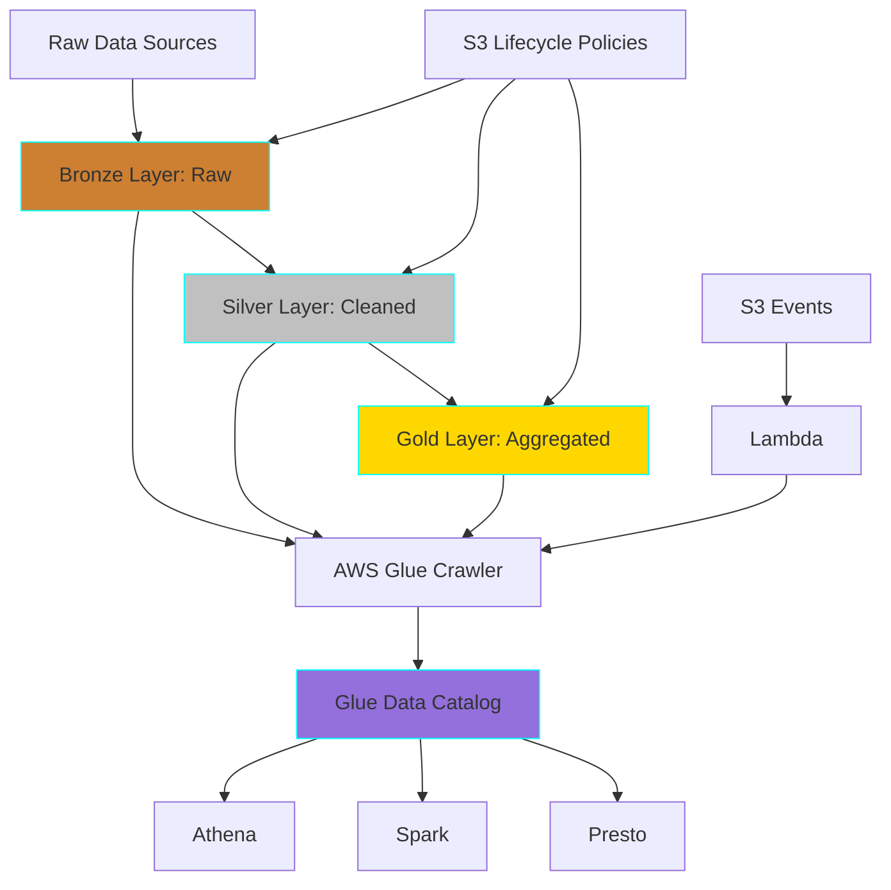
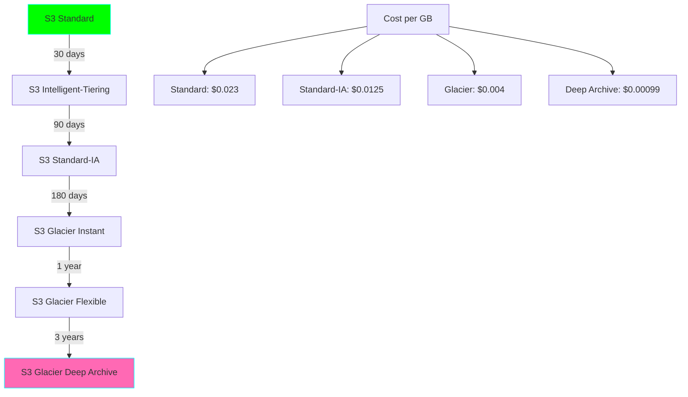
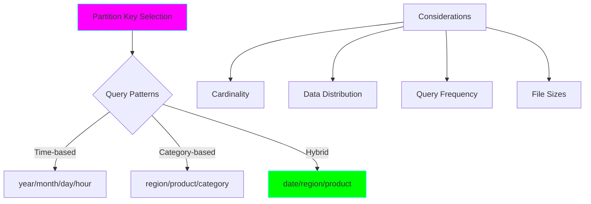

# Project 18: S3 Data Lake Organization

**Complexity:** ⭐⭐⭐⭐☆ | **Time:** 8-10 hours | **Tier:** Advanced Intermediate

## Overview

Build a well-organized, scalable data lake on AWS S3 using the medallion architecture (Bronze/Silver/Gold layers). This project teaches data lake design principles, partition strategies, lifecycle management, and metadata cataloging for efficient analytics.

## Learning Objectives

After completing this project, you will understand:

- ✅ Data lake architecture patterns (Medallion, Lambda, Kappa)
- ✅ S3 storage classes and lifecycle policies
- ✅ Hive-style partitioning for data lakes
- ✅ AWS Glue catalog integration
- ✅ Multi-tenant data isolation
- ✅ Access pattern optimization
- ✅ Cost optimization strategies
- ✅ Data lake governance and security

## Architecture



## Key Concepts

### Medallion Architecture

```mermaid
graph LR
    subgraph "Bronze Layer"
    A1[Raw Ingestion] --> A2[Unvalidated Data]
    A2 --> A3[All Fields]
    A3 --> A4[Schema on Read]
    end

    subgraph "Silver Layer"
    B1[Validated Data] --> B2[Cleansed]
    B2 --> B3[Deduplicated]
    B3 --> B4[Standardized Schema]
    end

    subgraph "Gold Layer"
    C1[Business Logic] --> C2[Aggregated]
    C2 --> C3[Denormalized]
    C3 --> C4[Analytics Ready]
    end

    A4 --> B1
    B4 --> C1

    style A1 fill:#cd7f32,stroke:#00ffff
    style B1 fill:#c0c0c0,stroke:#00ffff
    style C1 fill:#ffd700,stroke:#00ffff
```



**Layer Characteristics:**

| Layer | Purpose | Data Quality | Schema | Retention |
|-------|---------|--------------|--------|-----------|
| **Bronze** | Raw ingestion | As-is | Loose | Long-term |
| **Silver** | Cleaned & validated | High | Enforced | Medium-term |
| **Gold** | Business aggregates | Very High | Strict | Short-term |

### S3 Storage Classes



### Partition Strategy



## Implementation Guide

### Step 1: S3 Data Lake Structure Setup

```python
# data_lake_manager.py
import boto3
from typing import Dict, List, Optional
from datetime import datetime, timedelta
import logging
from pathlib import Path
import json

class DataLakeManager:
    """Manage S3-based data lake with medallion architecture."""

    def __init__(
        self,
        bucket_name: str,
        region: str = 'us-east-1',
        bronze_prefix: str = 'bronze',
        silver_prefix: str = 'silver',
        gold_prefix: str = 'gold'
    ):
        self.bucket_name = bucket_name
        self.region = region
        self.bronze_prefix = bronze_prefix
        self.silver_prefix = silver_prefix
        self.gold_prefix = gold_prefix

        self.s3_client = boto3.client('s3', region_name=region)
        self.s3_resource = boto3.resource('s3', region_name=region)
        self.logger = logging.getLogger(__name__)

    def create_data_lake_structure(self, domains: List[str]):
        """
        Create data lake folder structure.

        Structure:
        bucket/
        ├── bronze/
        │   ├── domain1/
        │   │   └── table1/
        │   │       └── year=2024/month=01/day=15/
        │   └── domain2/
        ├── silver/
        │   └── domain1/
        │       └── table1/
        └── gold/
            └── domain1/
                └── aggregate1/
        """
        bucket = self.s3_resource.Bucket(self.bucket_name)

        # Create bucket if it doesn't exist
        try:
            bucket.create(
                CreateBucketConfiguration={'LocationConstraint': self.region}
            )
            self.logger.info(f"Created bucket: {self.bucket_name}")
        except Exception as e:
            if 'BucketAlreadyOwnedByYou' in str(e):
                self.logger.info(f"Bucket already exists: {self.bucket_name}")
            else:
                raise

        # Create layer prefixes
        layers = [self.bronze_prefix, self.silver_prefix, self.gold_prefix]

        for layer in layers:
            for domain in domains:
                # Create domain folder in each layer
                key = f"{layer}/{domain}/.keep"
                bucket.put_object(Key=key, Body=b'')
                self.logger.info(f"Created {layer}/{domain}/")

    def setup_lifecycle_policies(self):
        """
        Configure S3 lifecycle policies for each layer.

        Bronze: Archive to Glacier after 90 days
        Silver: Archive to Glacier after 180 days
        Gold: Delete after 365 days (can be recreated from Silver)
        """
        lifecycle_config = {
            'Rules': [
                {
                    'Id': 'bronze-to-glacier',
                    'Status': 'Enabled',
                    'Filter': {'Prefix': f'{self.bronze_prefix}/'},
                    'Transitions': [
                        {
                            'Days': 90,
                            'StorageClass': 'GLACIER_IR'
                        },
                        {
                            'Days': 365,
                            'StorageClass': 'DEEP_ARCHIVE'
                        }
                    ]
                },
                {
                    'Id': 'silver-to-glacier',
                    'Status': 'Enabled',
                    'Filter': {'Prefix': f'{self.silver_prefix}/'},
                    'Transitions': [
                        {
                            'Days': 180,
                            'StorageClass': 'GLACIER_IR'
                        }
                    ]
                },
                {
                    'Id': 'gold-expiration',
                    'Status': 'Enabled',
                    'Filter': {'Prefix': f'{self.gold_prefix}/'},
                    'Expiration': {
                        'Days': 365
                    }
                },
                {
                    'Id': 'abort-incomplete-multipart-upload',
                    'Status': 'Enabled',
                    'Filter': {'Prefix': ''},
                    'AbortIncompleteMultipartUpload': {
                        'DaysAfterInitiation': 7
                    }
                }
            ]
        }

        self.s3_client.put_bucket_lifecycle_configuration(
            Bucket=self.bucket_name,
            LifecycleConfiguration=lifecycle_config
        )

        self.logger.info("Configured lifecycle policies")

    def setup_versioning(self):
        """Enable versioning for data protection."""
        self.s3_client.put_bucket_versioning(
            Bucket=self.bucket_name,
            VersioningConfiguration={'Status': 'Enabled'}
        )
        self.logger.info("Enabled versioning")

    def setup_encryption(self):
        """Enable server-side encryption by default."""
        self.s3_client.put_bucket_encryption(
            Bucket=self.bucket_name,
            ServerSideEncryptionConfiguration={
                'Rules': [
                    {
                        'ApplyServerSideEncryptionByDefault': {
                            'SSEAlgorithm': 'AES256'
                        },
                        'BucketKeyEnabled': True
                    }
                ]
            }
        )
        self.logger.info("Enabled default encryption")

    def setup_event_notifications(self, lambda_arn: str):
        """
        Setup S3 event notifications to trigger Lambda functions.

        Useful for:
        - Triggering Glue crawlers on new data
        - Data validation pipelines
        - Automatic catalog updates
        """
        self.s3_client.put_bucket_notification_configuration(
            Bucket=self.bucket_name,
            NotificationConfiguration={
                'LambdaFunctionConfigurations': [
                    {
                        'Id': 'new-bronze-data',
                        'LambdaFunctionArn': lambda_arn,
                        'Events': ['s3:ObjectCreated:*'],
                        'Filter': {
                            'Key': {
                                'FilterRules': [
                                    {
                                        'Name': 'prefix',
                                        'Value': f'{self.bronze_prefix}/'
                                    }
                                ]
                            }
                        }
                    }
                ]
            }
        )
        self.logger.info("Configured event notifications")
```

### Step 2: Partitioned Data Writer

```python
# partitioned_writer.py
import pyarrow as pa
import pyarrow.parquet as pq
from typing import List, Dict, Any, Optional
from datetime import datetime
import boto3
from io import BytesIO

class PartitionedS3Writer:
    """Write data to S3 with Hive-style partitioning."""

    def __init__(
        self,
        bucket_name: str,
        base_prefix: str,
        partition_cols: List[str]
    ):
        self.bucket_name = bucket_name
        self.base_prefix = base_prefix
        self.partition_cols = partition_cols
        self.s3_client = boto3.client('s3')
        self.logger = logging.getLogger(__name__)

    def write_parquet(
        self,
        table: pa.Table,
        domain: str,
        table_name: str,
        partition_values: Optional[Dict[str, Any]] = None
    ):
        """
        Write PyArrow table to S3 with partitioning.

        Args:
            table: PyArrow table to write
            domain: Domain name (e.g., 'sales', 'inventory')
            table_name: Table name
            partition_values: Optional partition values (extracted from data if None)
        """
        # Extract partition values if not provided
        if partition_values is None:
            partition_values = self._extract_partition_values(table)

        # Build S3 key with partition path
        s3_key = self._build_partition_path(
            domain, table_name, partition_values
        )

        # Remove partition columns from data
        columns_to_write = [
            col for col in table.column_names
            if col not in self.partition_cols
        ]
        table_to_write = table.select(columns_to_write)

        # Write to S3
        buffer = BytesIO()
        pq.write_table(
            table_to_write,
            buffer,
            compression='snappy',
            row_group_size=100000
        )

        buffer.seek(0)
        self.s3_client.upload_fileobj(
            buffer,
            self.bucket_name,
            s3_key
        )

        self.logger.info(f"Wrote {len(table)} rows to s3://{self.bucket_name}/{s3_key}")

    def _extract_partition_values(self, table: pa.Table) -> Dict[str, Any]:
        """Extract partition values from table data."""
        partition_values = {}

        for col in self.partition_cols:
            if col in table.column_names:
                # Get unique value (should be only one per partition)
                unique_values = table.column(col).unique()
                if len(unique_values) == 1:
                    partition_values[col] = unique_values[0].as_py()
                else:
                    raise ValueError(
                        f"Partition column {col} has multiple values: {unique_values}"
                    )

        return partition_values

    def _build_partition_path(
        self,
        domain: str,
        table_name: str,
        partition_values: Dict[str, Any]
    ) -> str:
        """
        Build Hive-style partition path.

        Example: bronze/sales/orders/year=2024/month=01/day=15/data.parquet
        """
        path_parts = [self.base_prefix, domain, table_name]

        # Add partition key=value pairs
        for col in self.partition_cols:
            value = partition_values.get(col)
            if value is not None:
                path_parts.append(f"{col}={value}")

        # Add filename with timestamp
        timestamp = datetime.now().strftime('%Y%m%d%H%M%S')
        filename = f"data_{timestamp}.parquet"
        path_parts.append(filename)

        return '/'.join(path_parts)

    def write_dataset(
        self,
        table: pa.Table,
        domain: str,
        table_name: str
    ):
        """
        Write table as partitioned dataset.

        Automatically splits data by partition columns.
        """
        import itertools

        # Get unique partition combinations
        partition_values = {}
        for col in self.partition_cols:
            if col in table.column_names:
                unique = table.column(col).unique().to_pylist()
                partition_values[col] = unique

        # Generate all combinations
        if partition_values:
            combinations = [
                dict(zip(self.partition_cols, combo))
                for combo in itertools.product(*partition_values.values())
            ]

            # Write each partition
            for partition in combinations:
                # Filter data for this partition
                mask = None
                for col, value in partition.items():
                    col_mask = pa.compute.equal(table.column(col), value)
                    mask = col_mask if mask is None else pa.compute.and_(mask, col_mask)

                partition_table = table.filter(mask)

                if len(partition_table) > 0:
                    self.write_parquet(
                        partition_table,
                        domain,
                        table_name,
                        partition
                    )
        else:
            # No partitions, write as single file
            self.write_parquet(table, domain, table_name, {})
```

### Step 3: AWS Glue Catalog Integration

```python
# glue_catalog.py
import boto3
from typing import List, Dict, Any, Optional
import pyarrow as pa

class GlueCatalogManager:
    """Manage AWS Glue Data Catalog."""

    def __init__(self, database_name: str, region: str = 'us-east-1'):
        self.database_name = database_name
        self.glue_client = boto3.client('glue', region_name=region)
        self.logger = logging.getLogger(__name__)

    def create_database(self, description: str = "Data Lake Catalog"):
        """Create Glue database if it doesn't exist."""
        try:
            self.glue_client.create_database(
                DatabaseInput={
                    'Name': self.database_name,
                    'Description': description
                }
            )
            self.logger.info(f"Created Glue database: {self.database_name}")
        except self.glue_client.exceptions.AlreadyExistsException:
            self.logger.info(f"Database already exists: {self.database_name}")

    def create_table_from_parquet(
        self,
        table_name: str,
        s3_location: str,
        schema: pa.Schema,
        partition_keys: Optional[List[str]] = None
    ):
        """
        Create Glue table from Parquet schema.

        Args:
            table_name: Name of the table
            s3_location: S3 path to data (e.g., s3://bucket/bronze/domain/table/)
            schema: PyArrow schema
            partition_keys: List of partition column names
        """
        # Convert PyArrow schema to Glue columns
        columns = self._arrow_schema_to_glue_columns(
            schema,
            exclude=partition_keys or []
        )

        # Build table input
        table_input = {
            'Name': table_name,
            'StorageDescriptor': {
                'Columns': columns,
                'Location': s3_location,
                'InputFormat': 'org.apache.hadoop.hive.ql.io.parquet.MapredParquetInputFormat',
                'OutputFormat': 'org.apache.hadoop.hive.ql.io.parquet.MapredParquetOutputFormat',
                'SerdeInfo': {
                    'SerializationLibrary': 'org.apache.hadoop.hive.ql.io.parquet.serde.ParquetHiveSerDe',
                    'Parameters': {
                        'serialization.format': '1'
                    }
                },
                'StoredAsSubDirectories': False
            },
            'TableType': 'EXTERNAL_TABLE'
        }

        # Add partition keys if provided
        if partition_keys:
            partition_columns = [
                {'Name': col, 'Type': self._get_glue_type(schema.field(col).type)}
                for col in partition_keys
            ]
            table_input['PartitionKeys'] = partition_columns

        try:
            self.glue_client.create_table(
                DatabaseName=self.database_name,
                TableInput=table_input
            )
            self.logger.info(f"Created Glue table: {table_name}")
        except self.glue_client.exceptions.AlreadyExistsException:
            self.logger.info(f"Table already exists: {table_name}")

    def _arrow_schema_to_glue_columns(
        self,
        schema: pa.Schema,
        exclude: List[str] = []
    ) -> List[Dict]:
        """Convert PyArrow schema to Glue column definitions."""
        columns = []

        for field in schema:
            if field.name not in exclude:
                columns.append({
                    'Name': field.name,
                    'Type': self._get_glue_type(field.type),
                    'Comment': field.metadata.get(b'comment', b'').decode() if field.metadata else ''
                })

        return columns

    def _get_glue_type(self, arrow_type: pa.DataType) -> str:
        """Map PyArrow type to Glue/Hive type."""
        type_mapping = {
            pa.int8(): 'tinyint',
            pa.int16(): 'smallint',
            pa.int32(): 'int',
            pa.int64(): 'bigint',
            pa.float32(): 'float',
            pa.float64(): 'double',
            pa.string(): 'string',
            pa.bool_(): 'boolean',
            pa.date32(): 'date',
            pa.timestamp('us'): 'timestamp',
        }

        return type_mapping.get(arrow_type, 'string')

    def add_partitions(
        self,
        table_name: str,
        partitions: List[Dict[str, str]],
        s3_base_path: str
    ):
        """
        Add partitions to Glue table.

        Args:
            table_name: Table name
            partitions: List of partition dicts (e.g., [{'year': '2024', 'month': '01'}])
            s3_base_path: Base S3 path for table
        """
        partition_inputs = []

        for partition in partitions:
            # Build partition location
            partition_path = '/'.join([f"{k}={v}" for k, v in partition.items()])
            location = f"{s3_base_path}/{partition_path}/"

            partition_inputs.append({
                'Values': list(partition.values()),
                'StorageDescriptor': {
                    'Location': location,
                    'InputFormat': 'org.apache.hadoop.hive.ql.io.parquet.MapredParquetInputFormat',
                    'OutputFormat': 'org.apache.hadoop.hive.ql.io.parquet.MapredParquetOutputFormat',
                    'SerdeInfo': {
                        'SerializationLibrary': 'org.apache.hadoop.hive.ql.io.parquet.serde.ParquetHiveSerDe'
                    }
                }
            })

        # Batch add partitions (max 100 per request)
        for i in range(0, len(partition_inputs), 100):
            batch = partition_inputs[i:i+100]
            self.glue_client.batch_create_partition(
                DatabaseName=self.database_name,
                TableName=table_name,
                PartitionInputList=batch
            )

        self.logger.info(f"Added {len(partitions)} partitions to {table_name}")

    def run_crawler(self, crawler_name: str):
        """Run Glue crawler to discover partitions."""
        self.glue_client.start_crawler(Name=crawler_name)
        self.logger.info(f"Started Glue crawler: {crawler_name}")

    def create_crawler(
        self,
        crawler_name: str,
        s3_targets: List[str],
        role_arn: str
    ):
        """
        Create Glue crawler for automatic schema discovery.

        Args:
            crawler_name: Name for the crawler
            s3_targets: List of S3 paths to crawl
            role_arn: IAM role ARN with Glue permissions
        """
        try:
            self.glue_client.create_crawler(
                Name=crawler_name,
                Role=role_arn,
                DatabaseName=self.database_name,
                Targets={
                    'S3Targets': [{'Path': path} for path in s3_targets]
                },
                SchemaChangePolicy={
                    'UpdateBehavior': 'UPDATE_IN_DATABASE',
                    'DeleteBehavior': 'LOG'
                }
            )
            self.logger.info(f"Created Glue crawler: {crawler_name}")
        except self.glue_client.exceptions.AlreadyExistsException:
            self.logger.info(f"Crawler already exists: {crawler_name}")
```

### Step 4: Data Lake ETL Pipeline

```python
# data_lake_etl.py
from typing import Callable, Dict, Any
import pyarrow as pa
import pyarrow.parquet as pq
import pyarrow.compute as pc
from datetime import datetime

class DataLakeETL:
    """ETL pipeline for medallion architecture."""

    def __init__(
        self,
        data_lake_manager: DataLakeManager,
        s3_writer: PartitionedS3Writer,
        glue_catalog: GlueCatalogManager
    ):
        self.data_lake = data_lake_manager
        self.writer = s3_writer
        self.catalog = glue_catalog
        self.logger = logging.getLogger(__name__)

    def bronze_ingestion(
        self,
        source_data: pa.Table,
        domain: str,
        table_name: str
    ):
        """
        Ingest raw data to Bronze layer.

        - No transformations
        - Preserve all columns
        - Add ingestion metadata
        """
        # Add ingestion metadata
        ingestion_time = datetime.now().isoformat()
        ingestion_col = pa.array([ingestion_time] * len(source_data))

        table_with_metadata = source_data.append_column(
            '_ingestion_timestamp',
            ingestion_col
        )

        # Write to Bronze
        self.writer.base_prefix = self.data_lake.bronze_prefix
        self.writer.write_dataset(table_with_metadata, domain, table_name)

        self.logger.info(f"Ingested {len(source_data)} rows to Bronze: {domain}.{table_name}")

    def bronze_to_silver(
        self,
        domain: str,
        table_name: str,
        transformation_func: Callable[[pa.Table], pa.Table]
    ):
        """
        Transform Bronze to Silver layer.

        - Data cleansing
        - Validation
        - Deduplication
        - Schema enforcement
        """
        # Read from Bronze
        bronze_path = f"s3://{self.data_lake.bucket_name}/{self.data_lake.bronze_prefix}/{domain}/{table_name}/"
        table = pq.read_table(bronze_path)

        # Apply transformation
        cleaned_table = transformation_func(table)

        # Add processing metadata
        processing_time = datetime.now().isoformat()
        processing_col = pa.array([processing_time] * len(cleaned_table))

        silver_table = cleaned_table.append_column(
            '_processing_timestamp',
            processing_col
        )

        # Write to Silver
        self.writer.base_prefix = self.data_lake.silver_prefix
        self.writer.write_dataset(silver_table, domain, table_name)

        self.logger.info(f"Processed {len(silver_table)} rows to Silver: {domain}.{table_name}")

    def silver_to_gold(
        self,
        domain: str,
        source_table: str,
        target_table: str,
        aggregation_func: Callable[[pa.Table], pa.Table]
    ):
        """
        Create Gold layer aggregates.

        - Business logic
        - Aggregations
        - Denormalization
        - Analytics-ready datasets
        """
        # Read from Silver
        silver_path = f"s3://{self.data_lake.bucket_name}/{self.data_lake.silver_prefix}/{domain}/{source_table}/"
        table = pq.read_table(silver_path)

        # Apply aggregation
        gold_table = aggregation_func(table)

        # Write to Gold
        self.writer.base_prefix = self.data_lake.gold_prefix
        self.writer.write_dataset(gold_table, domain, target_table)

        self.logger.info(f"Created Gold aggregate: {domain}.{target_table}")

# Example transformation functions
def cleanse_customer_data(table: pa.Table) -> pa.Table:
    """Example Silver transformation: Clean customer data."""
    # Remove nulls from critical columns
    mask = pc.is_valid(table.column('email'))
    table = table.filter(mask)

    # Deduplicate by email
    # (PyArrow doesn't have built-in dedup, use pandas or custom logic)

    # Standardize email to lowercase
    email_lower = pc.utf8_lower(table.column('email'))
    table = table.set_column(
        table.schema.get_field_index('email'),
        'email',
        email_lower
    )

    return table

def aggregate_daily_sales(table: pa.Table) -> pa.Table:
    """Example Gold aggregation: Daily sales summary."""
    # Group by date and calculate totals
    # (This is simplified - use PyArrow compute or pandas groupby)

    # Assume table has: date, product_id, quantity, amount
    # Return: date, total_quantity, total_amount, unique_products

    # This would typically use PyArrow's group_by once it's stable,
    # or convert to pandas for complex aggregations

    return table  # Placeholder
```

## Nuanced Scenarios

### 1. Multi-Tenant Isolation

**Challenge:** Securely isolate data for different tenants/customers.

```python
class MultiTenantDataLake:
    """Manage multi-tenant data lake with isolation."""

    def __init__(self, data_lake_manager: DataLakeManager):
        self.data_lake = data_lake_manager
        self.logger = logging.getLogger(__name__)

    def create_tenant_structure(self, tenant_id: str):
        """Create isolated folder structure for tenant."""
        layers = [
            self.data_lake.bronze_prefix,
            self.data_lake.silver_prefix,
            self.data_lake.gold_prefix
        ]

        for layer in layers:
            prefix = f"{layer}/tenant={tenant_id}/"
            # Create folder
            self.data_lake.s3_client.put_object(
                Bucket=self.data_lake.bucket_name,
                Key=f"{prefix}.keep",
                Body=b''
            )

    def create_tenant_iam_policy(self, tenant_id: str) -> Dict:
        """
        Generate IAM policy for tenant-specific access.

        Restricts access to only this tenant's data.
        """
        policy = {
            "Version": "2012-10-17",
            "Statement": [
                {
                    "Effect": "Allow",
                    "Action": [
                        "s3:GetObject",
                        "s3:PutObject",
                        "s3:ListBucket"
                    ],
                    "Resource": [
                        f"arn:aws:s3:::{self.data_lake.bucket_name}/*/tenant={tenant_id}/*"
                    ],
                    "Condition": {
                        "StringEquals": {
                            "s3:x-amz-server-side-encryption": "AES256"
                        }
                    }
                }
            ]
        }

        return policy
```

### 2. Access Pattern Optimization

**Challenge:** Optimize file sizes and partitioning for query performance.

```python
class AccessPatternOptimizer:
    """Optimize data lake for query patterns."""

    def __init__(self):
        self.logger = logging.getLogger(__name__)

    def recommend_partitioning(
        self,
        query_patterns: List[Dict[str, Any]]
    ) -> List[str]:
        """
        Recommend partition columns based on query patterns.

        Args:
            query_patterns: List of query patterns with filter columns
        """
        # Count frequency of filter columns
        from collections import Counter

        filter_columns = []
        for pattern in query_patterns:
            filter_columns.extend(pattern.get('filters', []))

        column_frequency = Counter(filter_columns)

        # Recommend top 3 most frequently filtered columns
        recommended = [col for col, _ in column_frequency.most_common(3)]

        self.logger.info(f"Recommended partitions: {recommended}")
        return recommended

    def optimize_file_sizes(
        self,
        s3_path: str,
        target_size_mb: int = 128
    ):
        """
        Combine small files or split large files to target size.

        Small files problem: Too many small files slow down queries
        Large files problem: Can't parallelize effectively
        """
        # List files and their sizes
        # Combine files smaller than target_size_mb/2
        # Split files larger than target_size_mb*2
        pass
```

### 3. Cost Optimization Strategies

**Challenge:** Minimize S3 storage costs while maintaining performance.

```python
class CostOptimizer:
    """Optimize data lake costs."""

    def __init__(self, data_lake_manager: DataLakeManager):
        self.data_lake = data_lake_manager
        self.cloudwatch = boto3.client('cloudwatch')
        self.logger = logging.getLogger(__name__)

    def analyze_access_patterns(self, days: int = 30) -> Dict[str, Dict]:
        """
        Analyze S3 access patterns to inform lifecycle policies.

        Returns data on:
        - Last access time per prefix
        - Access frequency
        - Storage size
        """
        # Use S3 Storage Lens or CloudWatch metrics
        # Return recommendations for storage class transitions
        pass

    def estimate_storage_costs(self) -> Dict[str, float]:
        """Estimate monthly storage costs by layer."""
        s3 = boto3.client('s3')
        cloudwatch = boto3.client('cloudwatch')

        layers = {
            'bronze': self.data_lake.bronze_prefix,
            'silver': self.data_lake.silver_prefix,
            'gold': self.data_lake.gold_prefix
        }

        costs = {}

        for layer_name, prefix in layers.items():
            # Get storage metrics from CloudWatch
            # Calculate costs based on storage class
            # S3 Standard: $0.023/GB
            # S3 IA: $0.0125/GB
            # Glacier: $0.004/GB

            costs[layer_name] = 0.0  # Placeholder

        return costs

    def apply_compression_optimization(self, table: pa.Table) -> pa.Table:
        """
        Apply optimal compression based on data characteristics.

        - Numeric columns: Dictionary encoding
        - String columns with low cardinality: Dictionary encoding
        - String columns with high cardinality: Snappy compression
        """
        # Analyze column characteristics
        # Apply appropriate compression
        return table
```

### 4. Metadata Synchronization

**Challenge:** Keep Glue catalog in sync with S3 data.

```python
class MetadataSynchronizer:
    """Synchronize metadata between S3 and Glue Catalog."""

    def __init__(
        self,
        data_lake_manager: DataLakeManager,
        glue_catalog: GlueCatalogManager
    ):
        self.data_lake = data_lake_manager
        self.catalog = glue_catalog
        self.logger = logging.getLogger(__name__)

    def sync_partitions(self, table_name: str, s3_prefix: str):
        """
        Discover new partitions in S3 and add to Glue.

        Can be triggered by S3 events or run on schedule.
        """
        # List S3 partitions
        s3_partitions = self._discover_s3_partitions(s3_prefix)

        # Get existing Glue partitions
        glue_partitions = self._get_glue_partitions(table_name)

        # Find new partitions
        new_partitions = set(s3_partitions) - set(glue_partitions)

        if new_partitions:
            # Add new partitions to Glue
            self.catalog.add_partitions(
                table_name,
                [dict(p) for p in new_partitions],
                s3_prefix
            )
            self.logger.info(f"Added {len(new_partitions)} new partitions to {table_name}")

    def _discover_s3_partitions(self, prefix: str) -> List[tuple]:
        """Discover partitions from S3 folder structure."""
        # Parse S3 keys to extract partition values
        # Return list of partition tuples
        pass

    def _get_glue_partitions(self, table_name: str) -> List[tuple]:
        """Get existing partitions from Glue."""
        # Query Glue for partition list
        pass
```

## Exercises

### Exercise 1: Create Data Lake Structure
Set up a complete data lake with medallion architecture:
- Create S3 bucket and folder structure
- Configure lifecycle policies
- Enable versioning and encryption
- Set up Glue database

### Exercise 2: Implement Bronze Ingestion
Ingest raw CSV data to Bronze layer:
- Read CSV files
- Add metadata columns
- Write to partitioned Parquet
- Register in Glue catalog

### Exercise 3: Silver Layer Transformation
Transform Bronze to Silver:
- Clean and validate data
- Deduplicate records
- Enforce schema
- Optimize file sizes

### Exercise 4: Gold Layer Aggregates
Create business-ready aggregates:
- Join multiple Silver tables
- Calculate daily/monthly aggregations
- Create denormalized views
- Query with Athena

## Success Criteria

- [ ] Implement medallion architecture (Bronze/Silver/Gold)
- [ ] Optimize partition strategy for queries
- [ ] Integrate with AWS Glue catalog
- [ ] Implement lifecycle policies
- [ ] Achieve 50%+ cost savings through optimization
- [ ] Query data with Athena successfully
- [ ] Handle schema evolution gracefully
- [ ] Monitor storage metrics

## Testing Checklist

```python
# tests/test_data_lake.py

def test_data_lake_structure_creation():
    """Test creating data lake folder structure."""
    pass

def test_partitioned_write():
    """Test writing partitioned Parquet to S3."""
    pass

def test_glue_catalog_registration():
    """Test registering tables in Glue catalog."""
    pass

def test_bronze_to_silver_transformation():
    """Test data cleansing pipeline."""
    pass

def test_lifecycle_policies():
    """Test S3 lifecycle policy configuration."""
    pass

def test_multi_tenant_isolation():
    """Test tenant data isolation."""
    pass

def test_athena_query():
    """Test querying data with Athena."""
    pass

def test_metadata_sync():
    """Test partition discovery and sync."""
    pass
```

## Common Pitfalls

1. **Small Files Problem:** Too many small files degrade query performance
2. **Partition Explosion:** Too many partitions make metadata management slow
3. **Missing Lifecycle Policies:** Unnecessary costs from not archiving old data
4. **Schema Drift:** Inconsistent schemas across partitions
5. **Security Gaps:** Insufficient encryption or access controls
6. **No Monitoring:** Lack of visibility into costs and usage
7. **Metadata Out of Sync:** Glue catalog not reflecting actual S3 data

## Next Steps

After completing this project:
1. Move to **Project 19: Real-time Deduplication**
2. Combine with **Project 15: Delta Lake** for ACID transactions
3. Use with **Project 26: Lakehouse with Iceberg** for advanced features

## References

- [AWS Data Lake Best Practices](https://aws.amazon.com/big-data/datalakes-and-analytics/what-is-a-data-lake/)
- [Medallion Architecture](https://www.databricks.com/glossary/medallion-architecture)
- [AWS Glue Documentation](https://docs.aws.amazon.com/glue/)
- [S3 Storage Classes](https://aws.amazon.com/s3/storage-classes/)
- [Partitioning Best Practices](https://docs.aws.amazon.com/athena/latest/ug/partitions.html)

---

**Happy Learning! 🚀**
