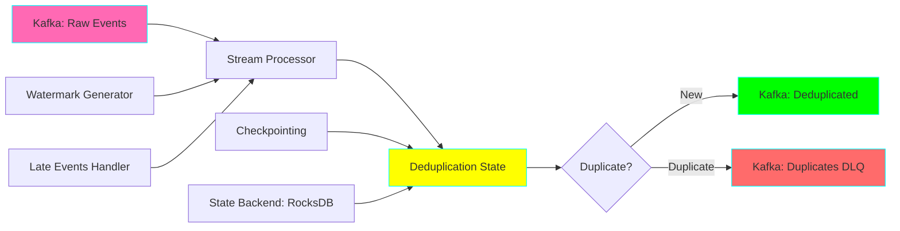
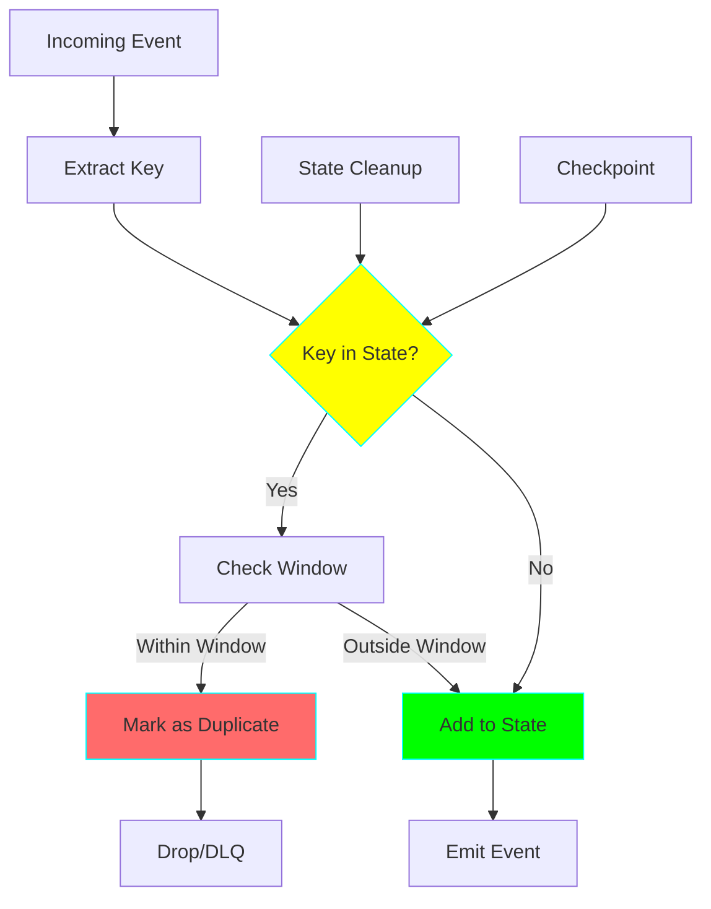
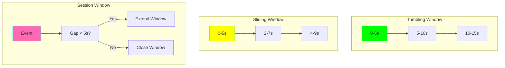
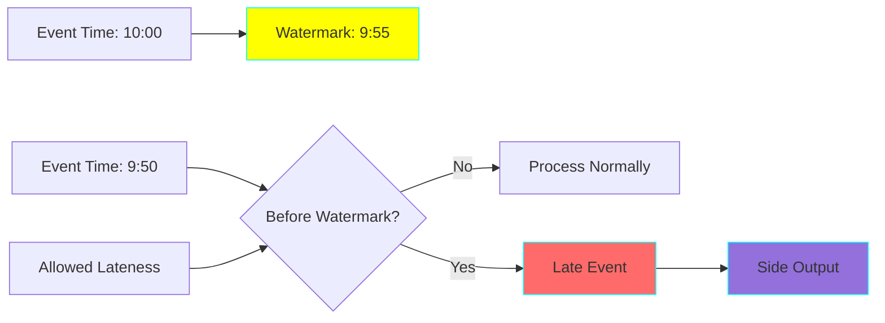

# Project 19: Real-time Deduplication

**Complexity:** ⭐⭐⭐⭐☆ | **Time:** 8-10 hours | **Tier:** Advanced Intermediate

## Overview

Build a real-time stream processing system that deduplicates events as they flow through Kafka topics. This project teaches stateful stream processing, windowing strategies, watermarking, and exactly-once semantics for high-throughput data pipelines.

## Learning Objectives

After completing this project, you will understand:

- ✅ Stateful stream processing fundamentals
- ✅ Windowing strategies (Tumbling, Sliding, Session)
- ✅ Watermarking and late event handling
- ✅ State backends and checkpointing
- ✅ Exactly-once processing guarantees
- ✅ Multi-key deduplication strategies
- ✅ State size management at scale
- ✅ Stream processing patterns

## Architecture



## Key Concepts

### Stateful Stream Processing



**State Management Challenges:**
- **State Size:** Can grow unbounded without cleanup
- **Performance:** Fast lookups required for high throughput
- **Durability:** Must survive failures
- **Scalability:** Must distribute across multiple instances

### Windowing Strategies



| Window Type | Use Case | State Size | Duplicate Window |
|-------------|----------|------------|------------------|
| **Tumbling** | Hourly dedup | Small | Fixed duration |
| **Sliding** | Rolling dedup | Medium | Overlapping |
| **Session** | User sessions | Variable | Activity-based |

### Watermarks and Late Events



**Watermark:** Indication that events with timestamp < watermark have all arrived
**Allowed Lateness:** Grace period for late events after watermark

## Implementation Guide

### Step 1: Kafka Streams Deduplication (Python with Faust)

```python
# deduplication_processor.py
import faust
from typing import Dict, Set, Optional
from datetime import datetime, timedelta
import logging
from dataclasses import dataclass, asdict
import hashlib

@dataclass
class Event:
    """Event schema."""
    event_id: str
    user_id: str
    event_type: str
    timestamp: datetime
    data: Dict

    def get_dedup_key(self) -> str:
        """Generate deduplication key."""
        # Deduplicate by event_id
        return self.event_id

    def get_content_hash(self) -> str:
        """Generate content-based hash for semantic deduplication."""
        # Hash based on content, not ID
        content = f"{self.user_id}:{self.event_type}:{self.data}"
        return hashlib.md5(content.encode()).hexdigest()

# Create Faust app
app = faust.App(
    'deduplication-processor',
    broker='kafka://localhost:9092',
    store='rocksdb://',  # Use RocksDB for state backend
    topic_partitions=4,
)

# Define topics
raw_events_topic = app.topic('raw-events', value_type=Event)
deduplicated_topic = app.topic('deduplicated-events', value_type=Event)
duplicates_topic = app.topic('duplicates-dlq', value_type=Event)

# State table for deduplication
# TTL-based cleanup: entries expire after 1 hour
seen_events = app.Table(
    'seen-events',
    default=None,
    on_window_close=lambda key, value: None,
).tumbling(timedelta(hours=1))

class DeduplicationProcessor:
    """Real-time deduplication processor."""

    def __init__(self):
        self.logger = logging.getLogger(__name__)
        self.metrics = {
            'processed': 0,
            'duplicates': 0,
            'unique': 0
        }

    @app.agent(raw_events_topic)
    async def deduplicate(self, events):
        """
        Deduplicate events in real-time.

        Uses tumbling window of 1 hour for state management.
        """
        async for event in events:
            self.metrics['processed'] += 1

            # Generate deduplication key
            dedup_key = event.get_dedup_key()

            # Check if we've seen this event
            if dedup_key in seen_events:
                # Duplicate found
                self.logger.debug(f"Duplicate event: {dedup_key}")
                self.metrics['duplicates'] += 1

                # Send to DLQ
                await duplicates_topic.send(value=event)

            else:
                # New event
                self.logger.debug(f"New event: {dedup_key}")
                self.metrics['unique'] += 1

                # Mark as seen
                seen_events[dedup_key] = {
                    'timestamp': event.timestamp,
                    'count': 1
                }

                # Forward to deduplicated topic
                await deduplicated_topic.send(value=event)

            # Log metrics every 1000 events
            if self.metrics['processed'] % 1000 == 0:
                self._log_metrics()

    def _log_metrics(self):
        """Log processing metrics."""
        total = self.metrics['processed']
        unique = self.metrics['unique']
        duplicates = self.metrics['duplicates']
        duplicate_rate = (duplicates / total * 100) if total > 0 else 0

        self.logger.info(
            f"Processed: {total}, Unique: {unique}, "
            f"Duplicates: {duplicates} ({duplicate_rate:.2f}%)"
        )

    @app.timer(interval=60.0)
    async def log_metrics_periodically(self):
        """Log metrics every minute."""
        self._log_metrics()

    @app.timer(interval=300.0)
    async def cleanup_old_state(self):
        """
        Clean up old state entries.

        Faust handles this automatically with windowing,
        but you can implement custom cleanup logic here.
        """
        self.logger.info("State cleanup triggered (handled by Faust windowing)")
```

### Step 2: Advanced Deduplication Strategies

```python
# advanced_dedup.py
from typing import List, Tuple, Optional
from datetime import datetime, timedelta
import mmh3  # MurmurHash for Bloom filters
import numpy as np

class BloomFilter:
    """
    Space-efficient probabilistic deduplication.

    Use when:
    - Very high throughput (millions of events/sec)
    - Can tolerate small false positive rate
    - Memory is constrained
    """

    def __init__(self, size: int = 1_000_000, hash_count: int = 7):
        """
        Args:
            size: Bit array size (larger = lower false positive rate)
            hash_count: Number of hash functions
        """
        self.size = size
        self.hash_count = hash_count
        self.bit_array = np.zeros(size, dtype=bool)
        self.items_added = 0

    def add(self, item: str):
        """Add item to filter."""
        for i in range(self.hash_count):
            index = mmh3.hash(item, i) % self.size
            self.bit_array[index] = True
        self.items_added += 1

    def contains(self, item: str) -> bool:
        """Check if item might be in filter."""
        for i in range(self.hash_count):
            index = mmh3.hash(item, i) % self.size
            if not self.bit_array[index]:
                return False
        return True

    def false_positive_rate(self) -> float:
        """Calculate approximate false positive rate."""
        # (1 - e^(-k*n/m))^k
        # k = hash_count, n = items_added, m = size
        k = self.hash_count
        n = self.items_added
        m = self.size

        return (1 - np.exp(-k * n / m)) ** k

class CountMinSketch:
    """
    Track event frequencies with bounded memory.

    Use when:
    - Need to count occurrences
    - Limited memory
    - Can tolerate small counting errors
    """

    def __init__(self, width: int = 10000, depth: int = 5):
        self.width = width
        self.depth = depth
        self.table = np.zeros((depth, width), dtype=np.int32)

    def add(self, item: str, count: int = 1):
        """Increment count for item."""
        for i in range(self.depth):
            index = mmh3.hash(item, i) % self.width
            self.table[i][index] += count

    def estimate(self, item: str) -> int:
        """Estimate count for item (returns minimum across all hash functions)."""
        counts = []
        for i in range(self.depth):
            index = mmh3.hash(item, i) % self.width
            counts.append(self.table[i][index])
        return min(counts)

class SemanticDeduplicator:
    """
    Deduplicate based on content similarity, not just ID.

    Use when:
    - Events might have different IDs but same content
    - Need to detect duplicate form submissions
    - Need fuzzy deduplication
    """

    def __init__(self, similarity_threshold: float = 0.95):
        self.threshold = similarity_threshold
        self.seen_hashes: Dict[str, Dict] = {}

    def get_content_hash(self, event: Event) -> str:
        """Generate semantic hash of event content."""
        # Sort keys for consistent hashing
        content = {
            'user_id': event.user_id,
            'event_type': event.event_type,
            'data': sorted(event.data.items())
        }

        import json
        content_str = json.dumps(content, sort_keys=True)
        return hashlib.sha256(content_str.encode()).hexdigest()

    def is_duplicate(self, event: Event, window_seconds: int = 300) -> bool:
        """
        Check if event is duplicate based on content.

        Args:
            event: Event to check
            window_seconds: Deduplication window (default 5 minutes)
        """
        content_hash = self.get_content_hash(event)

        # Check if we've seen this content recently
        if content_hash in self.seen_hashes:
            last_seen = self.seen_hashes[content_hash]['timestamp']
            time_diff = (event.timestamp - last_seen).total_seconds()

            if time_diff < window_seconds:
                # Duplicate within window
                return True

        # Not a duplicate, update state
        self.seen_hashes[content_hash] = {
            'timestamp': event.timestamp,
            'event_id': event.event_id
        }

        return False

    def cleanup_old_hashes(self, max_age_seconds: int = 3600):
        """Remove hashes older than max_age."""
        now = datetime.now()
        to_remove = []

        for hash_val, data in self.seen_hashes.items():
            age = (now - data['timestamp']).total_seconds()
            if age > max_age_seconds:
                to_remove.append(hash_val)

        for hash_val in to_remove:
            del self.seen_hashes[hash_val]
```

### Step 3: Multi-Key Deduplication

```python
# multi_key_dedup.py
from typing import List, Dict, Set
from collections import defaultdict

class MultiKeyDeduplicator:
    """
    Deduplicate across multiple key combinations.

    Example: Deduplicate by (user_id, event_type) AND (session_id, timestamp)
    """

    def __init__(self, key_combinations: List[List[str]]):
        """
        Args:
            key_combinations: List of key combinations to deduplicate on
                Example: [['user_id', 'event_type'], ['session_id']]
        """
        self.key_combinations = key_combinations
        self.state = defaultdict(lambda: defaultdict(set))
        self.logger = logging.getLogger(__name__)

    def extract_key(self, event: Event, key_fields: List[str]) -> str:
        """Extract composite key from event."""
        key_parts = []
        for field in key_fields:
            value = getattr(event, field, event.data.get(field, ''))
            key_parts.append(str(value))
        return ':'.join(key_parts)

    def is_duplicate(self, event: Event) -> Tuple[bool, Optional[str]]:
        """
        Check if event is duplicate based on any key combination.

        Returns:
            (is_duplicate, matching_combination)
        """
        event_id = event.event_id

        for combination in self.key_combinations:
            key = self.extract_key(event, combination)
            combination_name = ','.join(combination)

            if event_id in self.state[combination_name][key]:
                # Duplicate found
                self.logger.debug(
                    f"Duplicate on {combination_name}: {key}"
                )
                return True, combination_name

        # Not a duplicate, add to all combinations
        for combination in self.key_combinations:
            key = self.extract_key(event, combination)
            combination_name = ','.join(combination)
            self.state[combination_name][key].add(event_id)

        return False, None

    def cleanup_window(self, window_end: datetime):
        """Clean up state for completed windows."""
        # In production, track timestamps and remove old entries
        # For now, this is a placeholder
        pass
```

### Step 4: Exactly-Once Semantics

```python
# exactly_once.py
import faust
from typing import Optional
import asyncio

class ExactlyOnceProcessor:
    """
    Ensure exactly-once processing with Kafka transactions.

    Faust provides this automatically with:
    - Automatic offset commits
    - Transactional state updates
    - Checkpointing
    """

    def __init__(self, app: faust.App):
        self.app = app
        self.logger = logging.getLogger(__name__)

        # Configure for exactly-once semantics
        self.app.conf.processing_guarantee = 'exactly_once'
        self.app.conf.stream_wait_empty = False

    @app.agent(raw_events_topic)
    async def process_exactly_once(self, events):
        """
        Process events with exactly-once guarantees.

        Faust ensures:
        1. Events are processed exactly once
        2. State updates are atomic with offset commits
        3. Failures are handled with automatic recovery
        """
        async for event in events:
            try:
                # Process event
                await self._process_event(event)

                # State is automatically checkpointed
                # Offset is automatically committed
                # All happens atomically

            except Exception as e:
                self.logger.error(f"Error processing event: {e}")
                # Faust will retry based on configuration

    async def _process_event(self, event: Event):
        """Process individual event."""
        # Your processing logic here
        pass

class CheckpointManager:
    """Manage checkpoints for fault tolerance."""

    def __init__(self, checkpoint_interval: int = 1000):
        self.checkpoint_interval = checkpoint_interval
        self.processed_count = 0
        self.last_checkpoint = datetime.now()

    async def maybe_checkpoint(self):
        """Checkpoint if interval reached."""
        self.processed_count += 1

        if self.processed_count >= self.checkpoint_interval:
            await self._create_checkpoint()
            self.processed_count = 0

    async def _create_checkpoint(self):
        """Create checkpoint of current state."""
        # Faust handles this automatically
        # This is just for custom checkpoint logic
        self.last_checkpoint = datetime.now()
        self.logger.info("Checkpoint created")
```

## Nuanced Scenarios

### 1. State Size Management

**Challenge:** Prevent state from growing unbounded.

```python
class StateManager:
    """Manage state size with TTL and cleanup."""

    def __init__(self, max_state_size: int = 10_000_000):
        self.max_state_size = max_state_size
        self.state: Dict[str, Dict] = {}
        self.access_times: Dict[str, datetime] = {}

    def add(self, key: str, value: Dict, ttl_seconds: int = 3600):
        """Add entry with TTL."""
        # Check size limit
        if len(self.state) >= self.max_state_size:
            self._evict_lru()

        self.state[key] = value
        self.access_times[key] = datetime.now()

    def _evict_lru(self):
        """Evict least recently used entry."""
        if not self.access_times:
            return

        # Find oldest entry
        oldest_key = min(self.access_times, key=self.access_times.get)

        # Remove it
        del self.state[oldest_key]
        del self.access_times[oldest_key]

    def cleanup_expired(self, max_age_seconds: int = 3600):
        """Remove entries older than max_age."""
        now = datetime.now()
        to_remove = []

        for key, access_time in self.access_times.items():
            age = (now - access_time).total_seconds()
            if age > max_age_seconds:
                to_remove.append(key)

        for key in to_remove:
            del self.state[key]
            del self.access_times[key]
```

### 2. Late Event Handling

**Challenge:** Handle events that arrive after window has closed.

```python
class LateEventHandler:
    """Handle late-arriving events."""

    def __init__(self, allowed_lateness: timedelta = timedelta(minutes=5)):
        self.allowed_lateness = allowed_lateness
        self.late_events_count = 0

    def is_late(self, event: Event, watermark: datetime) -> bool:
        """Check if event is late relative to watermark."""
        return event.timestamp < watermark

    def should_process(self, event: Event, watermark: datetime) -> bool:
        """Determine if late event should still be processed."""
        if not self.is_late(event, watermark):
            return True

        # Check if within allowed lateness
        lateness = watermark - event.timestamp

        if lateness <= self.allowed_lateness:
            # Process as late event
            self.late_events_count += 1
            return True
        else:
            # Too late, drop it
            return False

    async def handle_late_event(self, event: Event):
        """Process late event (may require re-opening window)."""
        # Send to side output for late events
        # Or reprocess with updated window
        pass
```

### 3. Distributed State with RocksDB

**Challenge:** Scale state across multiple instances.

```python
class DistributedStateManager:
    """Manage distributed state with RocksDB backend."""

    def __init__(self):
        # Faust uses RocksDB by default for state
        # This shows how to configure it

        self.app = faust.App(
            'distributed-dedup',
            broker='kafka://localhost:9092',
            store='rocksdb://',
            topic_partitions=16,  # More partitions = more parallelism

            # RocksDB configuration
            stream_buffer_maxsize=16384,
            stream_processing_timeout=300.0,

            # Changelog topics for state backup
            topic_allow_declare=True,
            topic_disable_leader=False,
        )

    def configure_state_store(self):
        """Configure state store settings."""
        # State is automatically partitioned by Kafka partition
        # Each instance owns a subset of partitions
        # State is backed up to changelog topics

        pass
```

### 4. Monitoring and Alerting

**Challenge:** Monitor deduplication performance and state health.

```python
class DeduplicationMonitor:
    """Monitor deduplication metrics."""

    def __init__(self):
        from prometheus_client import Counter, Gauge, Histogram

        self.events_processed = Counter(
            'dedup_events_processed_total',
            'Total events processed'
        )

        self.duplicates_found = Counter(
            'dedup_duplicates_found_total',
            'Total duplicates found'
        )

        self.state_size = Gauge(
            'dedup_state_size',
            'Current state size (number of keys)'
        )

        self.processing_latency = Histogram(
            'dedup_processing_latency_seconds',
            'Event processing latency'
        )

    def record_event(self, is_duplicate: bool, latency_ms: float):
        """Record event processing."""
        self.events_processed.inc()

        if is_duplicate:
            self.duplicates_found.inc()

        self.processing_latency.observe(latency_ms / 1000.0)

    def update_state_size(self, size: int):
        """Update state size metric."""
        self.state_size.set(size)
```

## Exercises

### Exercise 1: Basic Deduplication
Implement event deduplication with Faust:
- Set up Kafka and Faust
- Create deduplication processor
- Test with duplicate events
- Measure duplicate detection rate

### Exercise 2: Windowed Deduplication
Implement time-based windows:
- Use 1-hour tumbling window
- Handle window transitions
- Clean up expired state
- Monitor state size

### Exercise 3: Multi-Key Strategy
Deduplicate across multiple key combinations:
- User ID + Event Type
- Session ID + Timestamp
- Content Hash
- Measure false positive/negative rates

### Exercise 4: Exactly-Once Processing
Ensure exactly-once semantics:
- Configure Kafka transactions
- Test failure scenarios
- Verify no duplicates after recovery
- Measure throughput impact

## Success Criteria

- [ ] Deduplicate events in real-time (<100ms latency)
- [ ] Handle 10,000+ events/second
- [ ] Maintain state efficiently (bounded memory)
- [ ] Support late arrivals within allowed lateness
- [ ] Achieve exactly-once processing
- [ ] Monitor duplicate detection rate (>99%)
- [ ] State recovery after failures
- [ ] Horizontal scalability

## Testing Checklist

```python
# tests/test_realtime_dedup.py

def test_basic_deduplication():
    """Test deduplicating exact duplicates."""
    pass

def test_windowed_deduplication():
    """Test time-based deduplication windows."""
    pass

def test_late_event_handling():
    """Test handling of late-arriving events."""
    pass

def test_state_cleanup():
    """Test state cleanup and TTL."""
    pass

def test_exactly_once():
    """Test exactly-once processing guarantees."""
    pass

def test_bloom_filter():
    """Test Bloom filter deduplication."""
    pass

def test_multi_key_dedup():
    """Test deduplication across multiple keys."""
    pass

def test_performance():
    """Test throughput and latency."""
    pass
```

## Common Pitfalls

1. **Unbounded State Growth:** Always implement state cleanup/TTL
2. **Hot Partitions:** Use good key distribution to avoid skew
3. **Late Event Drops:** Configure appropriate allowed lateness
4. **Memory Issues:** Monitor state size and use compression
5. **False Positives:** Bloom filters have false positives, plan accordingly
6. **Checkpoint Failures:** Ensure sufficient disk space for state
7. **Network Partitions:** Handle broker unavailability gracefully

## Next Steps

After completing this project:
1. Move to **Project 20: Prefect Deployment Pipeline**
2. Combine with **Project 13: Kafka Streaming Consumer**
3. Use with **Project 16: CDC with Debezium** for end-to-end pipeline

## References

- [Faust Documentation](https://faust.readthedocs.io/)
- [Kafka Streams Concepts](https://kafka.apache.org/documentation/streams/)
- [Bloom Filters Explained](https://en.wikipedia.org/wiki/Bloom_filter)
- [Exactly-Once Semantics](https://www.confluent.io/blog/exactly-once-semantics-are-possible-heres-how-apache-kafka-does-it/)
- [Watermarks in Stream Processing](https://www.oreilly.com/radar/the-world-beyond-batch-streaming-101/)

---

**Happy Learning! 🚀**
