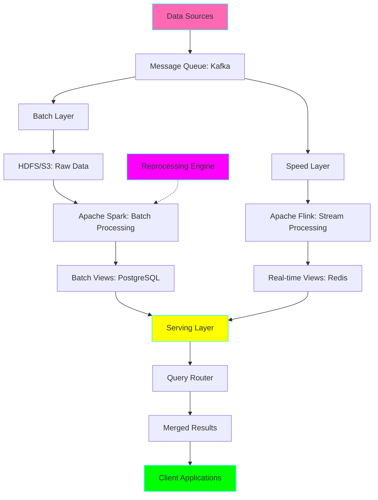
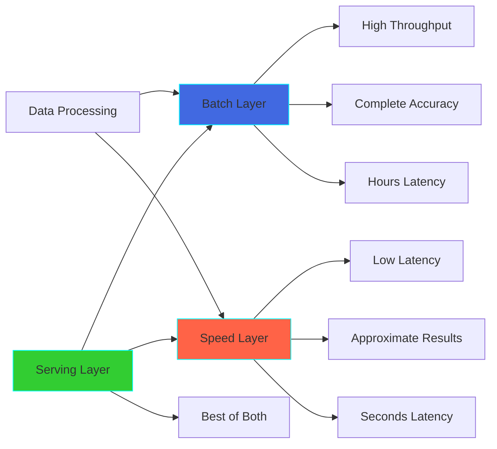

# Project 21: Lambda Architecture System

**Complexity:** ⭐⭐⭐⭐⭐ | **Time:** 12-15 hours | **Tier:** Expert Level

## Overview

Build a complete Lambda Architecture system that combines batch and stream processing to provide comprehensive, low-latency views of data. This architecture handles massive data volumes with both historical accuracy (batch layer) and real-time insights (speed layer), serving unified results through a serving layer.

## Learning Objectives

After completing this project, you will understand:

- ✅ Lambda Architecture principles and design patterns
- ✅ Batch processing with Apache Spark for historical data
- ✅ Stream processing with Kafka and Flink for real-time data
- ✅ Serving layer design patterns (Redis, PostgreSQL)
- ✅ Query routing and view reconciliation strategies
- ✅ Handling eventual consistency in distributed systems
- ✅ Reprocessing and data correction workflows
- ✅ Performance optimization across layers

## Architecture



## Key Concepts

### Lambda Architecture Layers

**1. Batch Layer (Source of Truth)**
- Stores complete, immutable dataset
- Computes batch views from historical data
- Provides high accuracy with high latency
- Recomputable for corrections

**2. Speed Layer (Real-time Updates)**
- Processes only recent data
- Provides low-latency updates
- Compensates for batch layer lag
- Eventually replaced by batch views

**3. Serving Layer (Query Interface)**
- Merges batch and real-time views
- Routes queries to appropriate layers
- Provides unified API for clients
- Handles data reconciliation

### Batch vs Stream Processing Tradeoffs



### View Reconciliation Strategies

| Strategy | Description | Use Case |
|----------|-------------|----------|
| **Replace** | Batch view replaces speed view | When batch is complete |
| **Merge** | Combine both views | Overlapping time windows |
| **Fallback** | Use speed if batch unavailable | High availability |
| **Hybrid** | Weighted combination | Gradual transition |

## Implementation Guide

### Step 1: Data Ingestion Layer (Kafka)

```python
from kafka import KafkaProducer, KafkaConsumer
from kafka.admin import KafkaAdminClient, NewTopic
import json
from typing import Dict, Any
import logging

class DataIngestionLayer:
    """Manages data ingestion into Lambda Architecture."""

    def __init__(
        self,
        bootstrap_servers: str = 'localhost:9092',
        raw_topic: str = 'raw-events',
        batch_topic: str = 'batch-events',
        speed_topic: str = 'speed-events'
    ):
        self.bootstrap_servers = bootstrap_servers
        self.raw_topic = raw_topic
        self.batch_topic = batch_topic
        self.speed_topic = speed_topic
        self.logger = logging.getLogger(__name__)

        self._setup_topics()

    def _setup_topics(self):
        """Create Kafka topics if they don't exist."""
        admin = KafkaAdminClient(bootstrap_servers=self.bootstrap_servers)

        topics = [
            NewTopic(name=self.raw_topic, num_partitions=3, replication_factor=1),
            NewTopic(name=self.batch_topic, num_partitions=3, replication_factor=1),
            NewTopic(name=self.speed_topic, num_partitions=3, replication_factor=1)
        ]

        try:
            admin.create_topics(new_topics=topics, validate_only=False)
            self.logger.info("Topics created successfully")
        except Exception as e:
            self.logger.info(f"Topics may already exist: {e}")

    def produce_event(self, event: Dict[str, Any]):
        """Produce event to both batch and speed layers."""
        producer = KafkaProducer(
            bootstrap_servers=self.bootstrap_servers,
            value_serializer=lambda v: json.dumps(v).encode('utf-8')
        )

        # Send to raw topic (archive)
        producer.send(self.raw_topic, value=event)

        # Send to batch topic
        producer.send(self.batch_topic, value=event)

        # Send to speed topic
        producer.send(self.speed_topic, value=event)

        producer.flush()
        self.logger.debug(f"Event produced: {event.get('id')}")
```

### Step 2: Batch Layer (Apache Spark)

```python
from pyspark.sql import SparkSession
from pyspark.sql.functions import *
from pyspark.sql.window import Window
from datetime import datetime, timedelta
import psycopg2
from typing import Optional

class BatchLayer:
    """Batch processing layer using Apache Spark."""

    def __init__(
        self,
        app_name: str = "LambdaArchitectureBatch",
        master: str = "local[*]"
    ):
        self.spark = SparkSession.builder \
            .appName(app_name) \
            .master(master) \
            .config("spark.sql.shuffle.partitions", "10") \
            .getOrCreate()

        self.logger = logging.getLogger(__name__)

    def load_historical_data(
        self,
        data_path: str,
        format: str = "parquet"
    ):
        """Load historical data from data lake."""
        return self.spark.read.format(format).load(data_path)

    def compute_batch_views(
        self,
        events_df,
        view_type: str = "aggregations"
    ):
        """
        Compute batch views from historical data.

        Args:
            events_df: Spark DataFrame with events
            view_type: Type of view to compute
        """
        if view_type == "aggregations":
            return self._compute_aggregations(events_df)
        elif view_type == "user_profiles":
            return self._compute_user_profiles(events_df)
        elif view_type == "product_stats":
            return self._compute_product_stats(events_df)
        else:
            raise ValueError(f"Unknown view type: {view_type}")

    def _compute_aggregations(self, events_df):
        """Compute time-based aggregations."""
        return events_df \
            .withColumn("date", to_date("timestamp")) \
            .withColumn("hour", hour("timestamp")) \
            .groupBy("date", "hour", "event_type") \
            .agg(
                count("*").alias("event_count"),
                countDistinct("user_id").alias("unique_users"),
                avg("value").alias("avg_value"),
                sum("value").alias("total_value")
            )

    def _compute_user_profiles(self, events_df):
        """Build comprehensive user profiles from all history."""
        window_spec = Window.partitionBy("user_id").orderBy(desc("timestamp"))

        return events_df \
            .withColumn("row_num", row_number().over(window_spec)) \
            .filter(col("row_num") == 1) \
            .groupBy("user_id") \
            .agg(
                first("user_name").alias("name"),
                first("user_email").alias("email"),
                count("*").alias("total_events"),
                max("timestamp").alias("last_activity"),
                collect_list("event_type").alias("event_history")
            )

    def _compute_product_stats(self, events_df):
        """Compute product-level statistics."""
        return events_df \
            .filter(col("event_type").isin(["view", "purchase"])) \
            .groupBy("product_id") \
            .agg(
                sum(when(col("event_type") == "view", 1).otherwise(0)).alias("view_count"),
                sum(when(col("event_type") == "purchase", 1).otherwise(0)).alias("purchase_count"),
                (sum(when(col("event_type") == "purchase", 1).otherwise(0)) /
                 sum(when(col("event_type") == "view", 1).otherwise(0))).alias("conversion_rate")
            )

    def write_to_serving_layer(
        self,
        df,
        table_name: str,
        db_config: Dict[str, str],
        mode: str = "overwrite"
    ):
        """Write batch views to PostgreSQL serving layer."""
        jdbc_url = f"jdbc:postgresql://{db_config['host']}:{db_config['port']}/{db_config['database']}"

        df.write \
            .format("jdbc") \
            .option("url", jdbc_url) \
            .option("dbtable", table_name) \
            .option("user", db_config['user']) \
            .option("password", db_config['password']) \
            .option("driver", "org.postgresql.Driver") \
            .mode(mode) \
            .save()

        self.logger.info(f"Batch view written to {table_name}")

    def run_batch_job(
        self,
        data_path: str,
        db_config: Dict[str, str],
        start_date: Optional[datetime] = None,
        end_date: Optional[datetime] = None
    ):
        """
        Execute complete batch processing job.

        This is the main orchestration method.
        """
        self.logger.info("Starting batch job...")

        # Load data
        events_df = self.load_historical_data(data_path)

        # Apply date filters if provided
        if start_date:
            events_df = events_df.filter(col("timestamp") >= start_date)
        if end_date:
            events_df = events_df.filter(col("timestamp") <= end_date)

        # Compute and write each view type
        for view_type, table_name in [
            ("aggregations", "batch_aggregations"),
            ("user_profiles", "batch_user_profiles"),
            ("product_stats", "batch_product_stats")
        ]:
            view_df = self.compute_batch_views(events_df, view_type)
            self.write_to_serving_layer(view_df, table_name, db_config)

        self.logger.info("Batch job completed!")
```

### Step 3: Speed Layer (Apache Flink)

```python
from pyflink.datastream import StreamExecutionEnvironment
from pyflink.datastream.connectors import FlinkKafkaConsumer, FlinkKafkaProducer
from pyflink.common.serialization import SimpleStringSchema
from pyflink.datastream.functions import MapFunction, KeyedProcessFunction
from pyflink.datastream.state import ValueStateDescriptor
import redis
import json
from typing import Dict, Any

class SpeedLayer:
    """Real-time processing layer using Apache Flink."""

    def __init__(
        self,
        redis_host: str = 'localhost',
        redis_port: int = 6379,
        kafka_servers: str = 'localhost:9092'
    ):
        self.env = StreamExecutionEnvironment.get_execution_environment()
        self.redis_client = redis.Redis(host=redis_host, port=redis_port, decode_responses=True)
        self.kafka_servers = kafka_servers
        self.logger = logging.getLogger(__name__)

    def create_kafka_source(self, topic: str):
        """Create Kafka source for streaming."""
        return FlinkKafkaConsumer(
            topics=topic,
            deserialization_schema=SimpleStringSchema(),
            properties={'bootstrap.servers': self.kafka_servers}
        )

    def process_stream(self, topic: str = 'speed-events'):
        """
        Process real-time event stream.

        Computes running aggregations and updates Redis.
        """
        # Create stream from Kafka
        stream = self.env.add_source(self.create_kafka_source(topic))

        # Parse JSON events
        parsed_stream = stream.map(lambda x: json.loads(x))

        # Key by different dimensions for aggregations
        keyed_stream = parsed_stream.key_by(lambda x: (x['event_type'], x['date']))

        # Process with stateful function
        processed_stream = keyed_stream.process(RealtimeAggregator(self.redis_client))

        return processed_stream

    def execute(self, job_name: str = "SpeedLayer"):
        """Execute the Flink job."""
        self.logger.info(f"Starting speed layer: {job_name}")
        self.env.execute(job_name)

class RealtimeAggregator(KeyedProcessFunction):
    """Stateful aggregation function for real-time processing."""

    def __init__(self, redis_client: redis.Redis):
        self.redis_client = redis_client

    def process_element(self, value, ctx):
        """Process each event and update Redis."""
        event_type = value['event_type']
        date = value['date']
        key = f"speed:{event_type}:{date}"

        # Increment count in Redis
        self.redis_client.hincrby(key, 'count', 1)

        # Update unique users (using HyperLogLog for efficiency)
        user_key = f"{key}:users"
        self.redis_client.pfadd(user_key, value['user_id'])

        # Update sum
        if 'value' in value:
            current_sum = float(self.redis_client.hget(key, 'sum') or 0)
            self.redis_client.hset(key, 'sum', current_sum + value['value'])

        # Set TTL (expire after batch layer catches up)
        self.redis_client.expire(key, 3600 * 24)  # 24 hours

        yield value
```

### Step 4: Serving Layer

```python
from typing import Dict, List, Any, Optional
import psycopg2
import redis
from datetime import datetime, timedelta
from dataclasses import dataclass

@dataclass
class QueryResult:
    """Result from serving layer."""
    data: List[Dict[str, Any]]
    source: str  # 'batch', 'speed', or 'merged'
    timestamp: datetime
    is_complete: bool

class ServingLayer:
    """Unified serving layer that merges batch and speed views."""

    def __init__(
        self,
        pg_config: Dict[str, str],
        redis_host: str = 'localhost',
        redis_port: int = 6379,
        batch_lag_hours: int = 2
    ):
        self.pg_conn = psycopg2.connect(**pg_config)
        self.redis_client = redis.Redis(host=redis_host, port=redis_port, decode_responses=True)
        self.batch_lag_hours = batch_lag_hours
        self.logger = logging.getLogger(__name__)

    def query_aggregations(
        self,
        event_type: str,
        start_date: datetime,
        end_date: datetime
    ) -> QueryResult:
        """
        Query aggregations with automatic batch/speed layer routing.
        """
        cutoff_time = datetime.now() - timedelta(hours=self.batch_lag_hours)

        # Determine which layers to query
        need_batch = start_date < cutoff_time
        need_speed = end_date >= cutoff_time

        if need_batch and not need_speed:
            return self._query_batch_only(event_type, start_date, end_date)
        elif need_speed and not need_batch:
            return self._query_speed_only(event_type, start_date, end_date)
        else:
            return self._query_merged(event_type, start_date, end_date, cutoff_time)

    def _query_batch_only(
        self,
        event_type: str,
        start_date: datetime,
        end_date: datetime
    ) -> QueryResult:
        """Query batch layer only."""
        cursor = self.pg_conn.cursor()

        query = """
            SELECT date, hour, event_count, unique_users, avg_value, total_value
            FROM batch_aggregations
            WHERE event_type = %s
              AND date BETWEEN %s AND %s
            ORDER BY date, hour
        """

        cursor.execute(query, (event_type, start_date.date(), end_date.date()))
        rows = cursor.fetchall()

        data = [
            {
                'date': row[0],
                'hour': row[1],
                'event_count': row[2],
                'unique_users': row[3],
                'avg_value': row[4],
                'total_value': row[5]
            }
            for row in rows
        ]

        return QueryResult(
            data=data,
            source='batch',
            timestamp=datetime.now(),
            is_complete=True
        )

    def _query_speed_only(
        self,
        event_type: str,
        start_date: datetime,
        end_date: datetime
    ) -> QueryResult:
        """Query speed layer only."""
        data = []

        # Iterate through dates in range
        current_date = start_date.date()
        while current_date <= end_date.date():
            key = f"speed:{event_type}:{current_date}"

            if self.redis_client.exists(key):
                count = int(self.redis_client.hget(key, 'count') or 0)
                total = float(self.redis_client.hget(key, 'sum') or 0)

                # Get unique users count from HyperLogLog
                user_key = f"{key}:users"
                unique_users = self.redis_client.pfcount(user_key)

                data.append({
                    'date': current_date,
                    'event_count': count,
                    'unique_users': unique_users,
                    'avg_value': total / count if count > 0 else 0,
                    'total_value': total
                })

            current_date += timedelta(days=1)

        return QueryResult(
            data=data,
            source='speed',
            timestamp=datetime.now(),
            is_complete=False  # Speed layer may have incomplete data
        )

    def _query_merged(
        self,
        event_type: str,
        start_date: datetime,
        end_date: datetime,
        cutoff_time: datetime
    ) -> QueryResult:
        """Query and merge both batch and speed layers."""
        # Query batch layer for old data
        batch_result = self._query_batch_only(
            event_type,
            start_date,
            cutoff_time
        )

        # Query speed layer for recent data
        speed_result = self._query_speed_only(
            event_type,
            cutoff_time,
            end_date
        )

        # Merge results
        merged_data = batch_result.data + speed_result.data

        return QueryResult(
            data=merged_data,
            source='merged',
            timestamp=datetime.now(),
            is_complete=True
        )

    def query_user_profile(self, user_id: str) -> Dict[str, Any]:
        """
        Get user profile from batch layer with real-time updates.
        """
        # Get base profile from batch layer
        cursor = self.pg_conn.cursor()
        cursor.execute(
            "SELECT * FROM batch_user_profiles WHERE user_id = %s",
            (user_id,)
        )
        row = cursor.fetchone()

        if not row:
            return {}

        profile = {
            'user_id': row[0],
            'name': row[1],
            'email': row[2],
            'total_events': row[3],
            'last_activity': row[4]
        }

        # Enhance with real-time data from speed layer
        recent_key = f"speed:user:{user_id}"
        if self.redis_client.exists(recent_key):
            recent_events = int(self.redis_client.get(f"{recent_key}:count") or 0)
            profile['total_events'] += recent_events
            profile['has_recent_activity'] = True
        else:
            profile['has_recent_activity'] = False

        return profile
```

### Step 5: Reprocessing Engine

```python
class ReprocessingEngine:
    """Handles data corrections and reprocessing in Lambda Architecture."""

    def __init__(
        self,
        batch_layer: BatchLayer,
        serving_layer: ServingLayer
    ):
        self.batch_layer = batch_layer
        self.serving_layer = serving_layer
        self.logger = logging.getLogger(__name__)

    def reprocess_date_range(
        self,
        start_date: datetime,
        end_date: datetime,
        data_path: str,
        db_config: Dict[str, str],
        reason: str = "Manual reprocessing"
    ):
        """
        Reprocess historical data for a date range.

        This is useful for:
        - Bug fixes in batch logic
        - Schema changes
        - Data corrections
        """
        self.logger.info(
            f"Starting reprocessing: {start_date} to {end_date}. Reason: {reason}"
        )

        # Run batch job for specific date range
        self.batch_layer.run_batch_job(
            data_path=data_path,
            db_config=db_config,
            start_date=start_date,
            end_date=end_date
        )

        self.logger.info("Reprocessing completed!")

    def handle_data_correction(
        self,
        correction_query: str,
        affected_date_range: tuple
    ):
        """
        Apply data correction and trigger reprocessing.

        Args:
            correction_query: SQL query to apply correction to raw data
            affected_date_range: (start_date, end_date) tuple
        """
        self.logger.info("Applying data correction...")

        # Apply correction to raw data in data lake
        # (implementation depends on data lake technology)

        # Trigger reprocessing
        start_date, end_date = affected_date_range
        self.reprocess_date_range(
            start_date=start_date,
            end_date=end_date,
            reason="Data correction applied"
        )
```

## Nuanced Scenarios

### 1. Handling Late-Arriving Data

**Challenge:** Data arrives after batch processing has completed.

```python
class LateDataHandler:
    """Handle late-arriving data in Lambda Architecture."""

    def __init__(
        self,
        batch_layer: BatchLayer,
        speed_layer: SpeedLayer,
        grace_period_hours: int = 6
    ):
        self.batch_layer = batch_layer
        self.speed_layer = speed_layer
        self.grace_period_hours = grace_period_hours

    def process_late_event(self, event: Dict[str, Any]):
        """
        Route late events appropriately.

        Strategy:
        1. If within grace period: Add to speed layer
        2. If beyond grace period: Queue for batch reprocessing
        """
        event_time = datetime.fromisoformat(event['timestamp'])
        age_hours = (datetime.now() - event_time).total_seconds() / 3600

        if age_hours <= self.grace_period_hours:
            # Still fresh enough for speed layer
            self._add_to_speed_layer(event)
        else:
            # Too old, needs batch reprocessing
            self._queue_for_reprocessing(event)

    def _add_to_speed_layer(self, event: Dict[str, Any]):
        """Add late event to speed layer with backdate."""
        # Process with original timestamp
        pass

    def _queue_for_reprocessing(self, event: Dict[str, Any]):
        """Queue event for next batch run."""
        # Add to reprocessing queue
        pass
```

### 2. Incremental Batch Processing

**Challenge:** Reduce batch processing time by only recomputing changed data.

```python
class IncrementalBatchProcessor:
    """Optimize batch processing with incremental updates."""

    def __init__(self, batch_layer: BatchLayer):
        self.batch_layer = batch_layer

    def compute_incremental_view(
        self,
        new_data_path: str,
        existing_view_table: str,
        merge_key: str
    ):
        """
        Compute only new/changed data and merge with existing views.

        This reduces processing time from hours to minutes.
        """
        spark = self.batch_layer.spark

        # Load only new data (e.g., last 24 hours)
        new_data = spark.read.parquet(new_data_path)

        # Compute views on new data only
        new_view = self.batch_layer.compute_batch_views(new_data)

        # Load existing view
        existing_view = spark.read.jdbc(
            url="...",
            table=existing_view_table
        )

        # Merge: Update existing records, add new ones
        merged_view = existing_view.alias("old").join(
            new_view.alias("new"),
            on=merge_key,
            how="full_outer"
        ).select(
            coalesce(col("new.*"), col("old.*"))
        )

        return merged_view
```

### 3. Query Optimization with Caching

**Challenge:** Reduce latency for frequently accessed queries.

```python
class CachedServingLayer(ServingLayer):
    """Enhanced serving layer with intelligent caching."""

    def __init__(self, *args, cache_ttl_seconds: int = 300, **kwargs):
        super().__init__(*args, **kwargs)
        self.cache_ttl = cache_ttl_seconds

    def query_with_cache(
        self,
        query_key: str,
        query_func: callable,
        *args,
        **kwargs
    ) -> QueryResult:
        """
        Execute query with result caching.

        Cache key includes query parameters to ensure correctness.
        """
        cache_key = f"query_cache:{query_key}"

        # Check cache
        cached = self.redis_client.get(cache_key)
        if cached:
            return json.loads(cached)

        # Execute query
        result = query_func(*args, **kwargs)

        # Cache result
        self.redis_client.setex(
            cache_key,
            self.cache_ttl,
            json.dumps(result.__dict__, default=str)
        )

        return result
```

### 4. Multi-Tenant Lambda Architecture

**Challenge:** Isolate data and processing for multiple tenants.

```python
class MultiTenantLambdaArchitecture:
    """Lambda Architecture with tenant isolation."""

    def __init__(self):
        self.tenant_configs = {}

    def register_tenant(
        self,
        tenant_id: str,
        data_path: str,
        kafka_topic: str,
        db_schema: str
    ):
        """Register a new tenant with isolated resources."""
        self.tenant_configs[tenant_id] = {
            'data_path': data_path,
            'kafka_topic': kafka_topic,
            'db_schema': db_schema,
            'batch_layer': BatchLayer(app_name=f"Batch-{tenant_id}"),
            'speed_layer': SpeedLayer(),
            'serving_layer': ServingLayer(...)
        }

    def query_tenant_data(
        self,
        tenant_id: str,
        query_type: str,
        **kwargs
    ):
        """Route query to tenant-specific serving layer."""
        if tenant_id not in self.tenant_configs:
            raise ValueError(f"Unknown tenant: {tenant_id}")

        config = self.tenant_configs[tenant_id]
        return config['serving_layer'].query_aggregations(**kwargs)
```

## Exercises

### Exercise 1: Basic Lambda Architecture
Build a simple Lambda Architecture for web analytics:
- Track page views and clicks
- Compute hourly aggregations in batch layer
- Maintain real-time counters in speed layer
- Serve unified views

### Exercise 2: Reprocessing Pipeline
Implement a reprocessing workflow:
- Simulate a bug in batch logic
- Correct the bug
- Reprocess affected date ranges
- Verify data consistency

### Exercise 3: Performance Optimization
Optimize the architecture for scale:
- Benchmark batch processing time
- Implement incremental batch updates
- Add caching to serving layer
- Measure latency improvements

### Exercise 4: Fault Tolerance
Add fault tolerance mechanisms:
- Handle Kafka consumer failures
- Implement Spark job retries
- Add Redis failover
- Test recovery scenarios

## Success Criteria

- [ ] Implement complete batch layer with Spark
- [ ] Implement real-time speed layer with Flink/Kafka
- [ ] Build serving layer that merges both views
- [ ] Create query router with automatic layer selection
- [ ] Handle late-arriving data gracefully
- [ ] Implement reprocessing for data corrections
- [ ] Achieve <100ms query latency for merged views
- [ ] Support 10,000+ events/second in speed layer
- [ ] Demonstrate eventual consistency guarantees
- [ ] Document architecture decisions and tradeoffs

## Testing Checklist

```python
# tests/test_lambda_architecture.py

def test_batch_layer_computation():
    """Test batch view computation."""
    pass

def test_speed_layer_processing():
    """Test real-time event processing."""
    pass

def test_serving_layer_merge():
    """Test batch/speed view merging."""
    pass

def test_query_routing():
    """Test automatic query routing logic."""
    pass

def test_late_data_handling():
    """Test late-arriving data scenarios."""
    pass

def test_reprocessing():
    """Test data reprocessing workflow."""
    pass

def test_consistency():
    """Test eventual consistency guarantees."""
    pass

def test_performance():
    """Test end-to-end latency."""
    pass

def test_fault_tolerance():
    """Test failure recovery mechanisms."""
    pass
```

## Common Pitfalls

1. **Inconsistent Time Windows:** Ensure batch and speed layers use same time bucketing
2. **Double Counting:** Careful when merging overlapping batch/speed data
3. **Expensive Reprocessing:** Optimize batch jobs to avoid full recomputation
4. **Cache Invalidation:** Expire caches when batch views update
5. **State Management:** Speed layer state can grow unbounded without TTLs
6. **Schema Evolution:** Plan for schema changes across all layers
7. **Monitoring Gaps:** Monitor lag between layers to detect issues

## Next Steps

After completing this project:
1. Move to **Project 22: Kappa Architecture Pipeline** (stream-only alternative)
2. Compare Lambda vs Kappa tradeoffs
3. Explore **Project 23: Real-time Feature Store** for ML applications

## References

- [Lambda Architecture by Nathan Marz](http://nathanmarz.com/blog/how-to-beat-the-cap-theorem.html)
- [Apache Spark Documentation](https://spark.apache.org/docs/latest/)
- [Apache Flink Documentation](https://flink.apache.org/documentation.html)
- [Kafka Streams Documentation](https://kafka.apache.org/documentation/streams/)
- [Questioning the Lambda Architecture](https://www.oreilly.com/radar/questioning-the-lambda-architecture/)
- [The Lambda Architecture: Principles and Best Practices](https://www.databricks.com/glossary/lambda-architecture)

---

**Happy Learning! 🚀**
