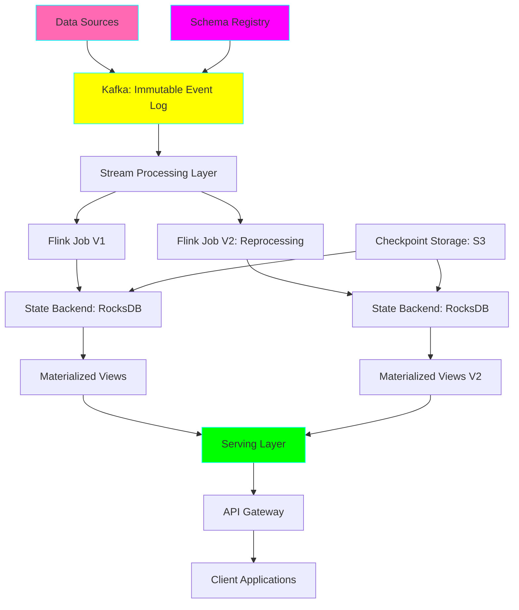
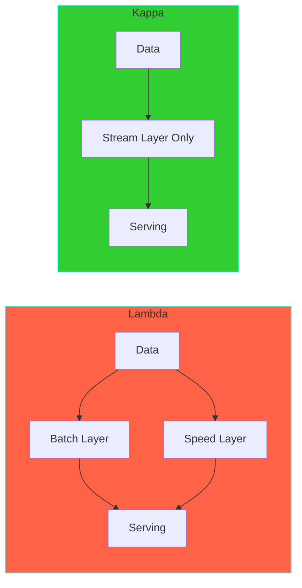

# Project 22: Kappa Architecture Pipeline

**Complexity:** ⭐⭐⭐⭐⭐ | **Time:** 12-15 hours | **Tier:** Expert Level

## Overview

Build a pure stream-processing architecture (Kappa Architecture) that eliminates the complexity of maintaining separate batch and speed layers. All data processing happens in a single stream processing pipeline, with the ability to reprocess historical data by replaying the event log.

## Learning Objectives

After completing this project, you will understand:

- ✅ Kappa Architecture principles and when to use it over Lambda
- ✅ Event sourcing and immutable event logs
- ✅ Stream reprocessing through Kafka log replay
- ✅ Stateful stream processing with Apache Flink
- ✅ Exactly-once processing semantics
- ✅ State management and checkpointing
- ✅ Multi-version deployment for code changes
- ✅ Scalability patterns for stream processing

## Architecture



## Key Concepts

### Kappa vs Lambda Architecture



**Lambda Architecture:**
- ✅ Handles both batch and streaming
- ❌ Duplicate logic in two layers
- ❌ Complex to maintain
- ✅ Well-understood patterns

**Kappa Architecture:**
- ✅ Single processing paradigm
- ✅ Simpler codebase
- ✅ Reprocessing via replay
- ❌ Requires replayable event log

### Event Sourcing Principles

**Immutable Event Log:**
```python
# Events are facts that happened
events = [
    {"id": 1, "type": "UserRegistered", "user_id": "u123", "timestamp": "2024-01-01T10:00:00Z"},
    {"id": 2, "type": "ProfileUpdated", "user_id": "u123", "field": "email", "value": "new@email.com"},
    {"id": 3, "type": "OrderPlaced", "user_id": "u123", "order_id": "o456", "amount": 99.99}
]

# Current state is derived from events
def derive_state(events):
    state = {}
    for event in events:
        apply_event(state, event)
    return state
```

### Reprocessing Strategies

| Strategy | Description | Use Case |
|----------|-------------|----------|
| **Full Replay** | Reprocess entire event log | Bug fixes, major changes |
| **Partial Replay** | Reprocess specific time range | Targeted corrections |
| **Parallel Processing** | Run old and new versions together | A/B testing logic |
| **Incremental Migration** | Gradually shift traffic | Low-risk deployments |

## Implementation Guide

### Step 1: Event Log Setup (Kafka)

```python
from kafka import KafkaProducer, KafkaConsumer
from kafka.admin import KafkaAdminClient, NewTopic, ConfigResource, ConfigResourceType
import json
from typing import Dict, Any, List
import logging
from datetime import datetime

class EventLog:
    """Manages the immutable event log using Kafka."""

    def __init__(
        self,
        bootstrap_servers: str = 'localhost:9092',
        topic: str = 'events',
        retention_days: int = 365  # Keep events for 1 year
    ):
        self.bootstrap_servers = bootstrap_servers
        self.topic = topic
        self.retention_ms = retention_days * 24 * 60 * 60 * 1000
        self.logger = logging.getLogger(__name__)

        self._setup_topic()

    def _setup_topic(self):
        """
        Create Kafka topic with appropriate retention settings.

        Key configurations:
        - Log compaction disabled (keep all events)
        - Long retention period
        - Multiple partitions for parallelism
        """
        admin = KafkaAdminClient(bootstrap_servers=self.bootstrap_servers)

        topic_config = {
            'retention.ms': str(self.retention_ms),
            'cleanup.policy': 'delete',  # Don't compact, keep all events
            'segment.ms': '86400000',  # 1 day segments
            'min.insync.replicas': '2'  # Durability
        }

        topic = NewTopic(
            name=self.topic,
            num_partitions=10,  # Allows 10 parallel consumers
            replication_factor=3,
            topic_configs=topic_config
        )

        try:
            admin.create_topics([topic])
            self.logger.info(f"Topic '{self.topic}' created")
        except Exception as e:
            self.logger.info(f"Topic may already exist: {e}")

    def produce_event(
        self,
        event: Dict[str, Any],
        key: str = None
    ):
        """
        Produce event to log with guaranteed ordering by key.

        Args:
            event: Event data
            key: Partition key (events with same key are ordered)
        """
        producer = KafkaProducer(
            bootstrap_servers=self.bootstrap_servers,
            value_serializer=lambda v: json.dumps(v).encode('utf-8'),
            key_serializer=lambda k: k.encode('utf-8') if k else None,
            acks='all',  # Wait for all replicas
            retries=3
        )

        # Add metadata
        event['_ingestion_time'] = datetime.now().isoformat()

        producer.send(
            self.topic,
            value=event,
            key=key
        )
        producer.flush()

        self.logger.debug(f"Event produced: {event.get('id')}")

    def create_consumer(
        self,
        group_id: str,
        auto_offset_reset: str = 'earliest'
    ) -> KafkaConsumer:
        """
        Create consumer for stream processing.

        Args:
            group_id: Consumer group ID
            auto_offset_reset: Where to start reading ('earliest' or 'latest')
        """
        return KafkaConsumer(
            self.topic,
            bootstrap_servers=self.bootstrap_servers,
            group_id=group_id,
            auto_offset_reset=auto_offset_reset,
            enable_auto_commit=False,  # Manual commit for exactly-once
            value_deserializer=lambda v: json.loads(v.decode('utf-8')),
            key_deserializer=lambda k: k.decode('utf-8') if k else None
        )
```

### Step 2: Stream Processor with Flink

```python
from pyflink.datastream import StreamExecutionEnvironment, RuntimeExecutionMode
from pyflink.datastream.state import ValueStateDescriptor, MapStateDescriptor
from pyflink.datastream.functions import KeyedProcessFunction, RuntimeContext
from pyflink.common.typeinfo import Types
from pyflink.common.watermark_strategy import WatermarkStrategy
from pyflink.datastream.connectors.kafka import KafkaSource, KafkaOffsetsInitializer
import json
from typing import Dict, Any
from datetime import datetime, timedelta

class StreamProcessor:
    """Core stream processing engine using Apache Flink."""

    def __init__(
        self,
        job_name: str = "KappaArchitecture",
        parallelism: int = 4,
        checkpoint_interval_ms: int = 60000
    ):
        self.job_name = job_name
        self.env = StreamExecutionEnvironment.get_execution_environment()

        # Configure for streaming
        self.env.set_runtime_mode(RuntimeExecutionMode.STREAMING)
        self.env.set_parallelism(parallelism)

        # Enable checkpointing for fault tolerance
        self.env.enable_checkpointing(checkpoint_interval_ms)

        self.logger = logging.getLogger(__name__)

    def create_kafka_source(
        self,
        topic: str,
        bootstrap_servers: str,
        group_id: str,
        starting_offset: str = 'earliest'
    ):
        """
        Create Kafka source for reading events.

        Args:
            starting_offset: 'earliest' for reprocessing, 'latest' for new data
        """
        offset_initializer = (
            KafkaOffsetsInitializer.earliest()
            if starting_offset == 'earliest'
            else KafkaOffsetsInitializer.latest()
        )

        return KafkaSource.builder() \
            .set_bootstrap_servers(bootstrap_servers) \
            .set_topics(topic) \
            .set_group_id(group_id) \
            .set_starting_offsets(offset_initializer) \
            .set_value_only_deserializer(SimpleStringSchema()) \
            .build()

    def build_pipeline(
        self,
        kafka_source,
        output_table: str
    ):
        """
        Build the complete stream processing pipeline.

        This processes events and maintains materialized views.
        """
        # Create data stream from Kafka
        event_stream = self.env.from_source(
            kafka_source,
            WatermarkStrategy.no_watermarks(),
            "Kafka Source"
        )

        # Parse JSON events
        parsed_stream = event_stream.map(
            lambda x: json.loads(x),
            output_type=Types.MAP(Types.STRING(), Types.STRING())
        )

        # Extract event time for windowing
        timestamped_stream = parsed_stream.assign_timestamps_and_watermarks(
            WatermarkStrategy
                .for_bounded_out_of_orderness(timedelta(seconds=30))
                .with_timestamp_assigner(lambda event, _: event['timestamp'])
        )

        # Key by entity ID for stateful processing
        keyed_stream = timestamped_stream.key_by(lambda event: event.get('user_id', 'unknown'))

        # Process with stateful function
        processed_stream = keyed_stream.process(EventProcessor())

        # Sink to serving layer
        processed_stream.sink_to(create_jdbc_sink(output_table))

        return processed_stream

    def execute(self):
        """Execute the Flink job."""
        self.logger.info(f"Starting Kappa job: {self.job_name}")
        self.env.execute(self.job_name)

class EventProcessor(KeyedProcessFunction):
    """
    Stateful event processor.

    Maintains state for each key (e.g., user_id) and computes
    aggregations incrementally.
    """

    def open(self, runtime_context: RuntimeContext):
        """Initialize state when processor starts."""
        # State for user profile
        self.user_state = runtime_context.get_state(
            ValueStateDescriptor(
                "user_profile",
                Types.MAP(Types.STRING(), Types.STRING())
            )
        )

        # State for aggregations
        self.aggregation_state = runtime_context.get_state(
            ValueStateDescriptor(
                "aggregations",
                Types.MAP(Types.STRING(), Types.LONG())
            )
        )

    def process_element(self, event, ctx):
        """
        Process each event and update state.

        This is the core business logic.
        """
        event_type = event.get('type')

        if event_type == 'UserRegistered':
            self._handle_user_registered(event)
        elif event_type == 'ProfileUpdated':
            self._handle_profile_updated(event)
        elif event_type == 'OrderPlaced':
            self._handle_order_placed(event)
        elif event_type == 'PageView':
            self._handle_page_view(event)

        # Emit updated state
        yield self._create_output(event, ctx)

    def _handle_user_registered(self, event):
        """Handle user registration event."""
        profile = {
            'user_id': event['user_id'],
            'registered_at': event['timestamp'],
            'email': event.get('email'),
            'name': event.get('name')
        }
        self.user_state.update(profile)

    def _handle_profile_updated(self, event):
        """Handle profile update event."""
        profile = self.user_state.value() or {}
        field = event.get('field')
        value = event.get('value')
        profile[field] = value
        self.user_state.update(profile)

    def _handle_order_placed(self, event):
        """Handle order placed event and update aggregations."""
        agg = self.aggregation_state.value() or {}

        # Increment order count
        agg['total_orders'] = agg.get('total_orders', 0) + 1

        # Add to total spent
        amount = float(event.get('amount', 0))
        agg['total_spent'] = agg.get('total_spent', 0) + amount

        # Update last order time
        agg['last_order_time'] = event['timestamp']

        self.aggregation_state.update(agg)

    def _handle_page_view(self, event):
        """Handle page view event."""
        agg = self.aggregation_state.value() or {}
        agg['page_views'] = agg.get('page_views', 0) + 1
        self.aggregation_state.update(agg)

    def _create_output(self, event, ctx):
        """Create output record with current state."""
        profile = self.user_state.value() or {}
        agg = self.aggregation_state.value() or {}

        return {
            'user_id': ctx.get_current_key(),
            'profile': profile,
            'aggregations': agg,
            'last_event': event['type'],
            'updated_at': datetime.now().isoformat()
        }
```

### Step 3: Reprocessing Engine

```python
class ReprocessingEngine:
    """
    Handles reprocessing of historical data in Kappa Architecture.

    Uses Kafka log replay to recompute views.
    """

    def __init__(
        self,
        event_log: EventLog,
        stream_processor: StreamProcessor
    ):
        self.event_log = event_log
        self.stream_processor = stream_processor
        self.logger = logging.getLogger(__name__)

    def reprocess_full_history(
        self,
        new_job_version: str,
        target_table: str
    ):
        """
        Reprocess entire event history with new logic.

        Steps:
        1. Deploy new version of stream processor
        2. Start from beginning of Kafka log (offset 0)
        3. Process all events to new table
        4. Swap tables when complete
        """
        self.logger.info(f"Starting full reprocessing: {new_job_version}")

        # Create new consumer group for reprocessing
        reprocess_group_id = f"reprocessing-{new_job_version}"

        # Create Kafka source starting from beginning
        kafka_source = self.stream_processor.create_kafka_source(
            topic=self.event_log.topic,
            bootstrap_servers=self.event_log.bootstrap_servers,
            group_id=reprocess_group_id,
            starting_offset='earliest'  # Key: Start from beginning
        )

        # Build pipeline writing to new table
        temp_table = f"{target_table}_reprocessing_{new_job_version}"
        self.stream_processor.build_pipeline(kafka_source, temp_table)

        # Execute (blocks until complete)
        self.stream_processor.execute()

        self.logger.info("Reprocessing complete!")

        # Swap tables (implementation depends on database)
        self._swap_tables(target_table, temp_table)

    def reprocess_time_range(
        self,
        start_timestamp: datetime,
        end_timestamp: datetime,
        target_table: str
    ):
        """
        Reprocess specific time range.

        Uses Kafka timestamp-based seeking.
        """
        self.logger.info(
            f"Reprocessing time range: {start_timestamp} to {end_timestamp}"
        )

        # Create consumer
        consumer = self.event_log.create_consumer(
            group_id=f"reprocess-{int(datetime.now().timestamp())}"
        )

        # Seek to timestamp
        from kafka import TopicPartition, OffsetAndTimestamp

        partitions = consumer.partitions_for_topic(self.event_log.topic)
        topic_partitions = [
            TopicPartition(self.event_log.topic, p)
            for p in partitions
        ]

        # Get offsets for start timestamp
        start_offsets = consumer.offsets_for_times({
            tp: int(start_timestamp.timestamp() * 1000)
            for tp in topic_partitions
        })

        # Assign and seek
        consumer.assign(topic_partitions)
        for tp, offset_and_timestamp in start_offsets.items():
            if offset_and_timestamp:
                consumer.seek(tp, offset_and_timestamp.offset)

        # Process events until end timestamp
        for message in consumer:
            event = message.value
            event_time = datetime.fromisoformat(event['timestamp'])

            if event_time > end_timestamp:
                break

            # Process event
            self._process_event(event, target_table)

        consumer.close()

    def _swap_tables(self, current_table: str, new_table: str):
        """Atomically swap tables after reprocessing."""
        # Implementation depends on database
        # PostgreSQL example:
        # BEGIN;
        # ALTER TABLE current_table RENAME TO old_table;
        # ALTER TABLE new_table RENAME TO current_table;
        # COMMIT;
        pass

    def _process_event(self, event: Dict[str, Any], target_table: str):
        """Process single event during partial reprocessing."""
        # Apply business logic
        pass
```

### Step 4: Multi-Version Deployment

```python
class MultiVersionDeployment:
    """
    Manages running multiple versions of stream processing jobs
    simultaneously for gradual migration.
    """

    def __init__(self):
        self.active_jobs = {}
        self.logger = logging.getLogger(__name__)

    def deploy_new_version(
        self,
        version: str,
        processor_class: type,
        traffic_percentage: int = 0
    ):
        """
        Deploy new version alongside existing version.

        Args:
            version: Version identifier
            processor_class: Stream processor class
            traffic_percentage: Percentage of traffic to route to new version
        """
        self.logger.info(f"Deploying version {version} with {traffic_percentage}% traffic")

        # Create new processor instance
        processor = processor_class(job_name=f"kappa-{version}")

        # Start processing
        processor.execute()

        # Register in active jobs
        self.active_jobs[version] = {
            'processor': processor,
            'traffic_percentage': traffic_percentage,
            'deployed_at': datetime.now()
        }

    def shift_traffic(
        self,
        from_version: str,
        to_version: str,
        percentage: int
    ):
        """
        Gradually shift traffic from old to new version.

        Useful for canary deployments and A/B testing.
        """
        if from_version in self.active_jobs:
            self.active_jobs[from_version]['traffic_percentage'] -= percentage

        if to_version in self.active_jobs:
            self.active_jobs[to_version]['traffic_percentage'] += percentage

        self.logger.info(
            f"Traffic shifted: {from_version} -> {to_version} ({percentage}%)"
        )

    def rollback(self, to_version: str):
        """Rollback to previous version."""
        self.logger.warning(f"Rolling back to version {to_version}")

        for version, job in self.active_jobs.items():
            if version == to_version:
                job['traffic_percentage'] = 100
            else:
                job['traffic_percentage'] = 0
```

### Step 5: Exactly-Once Semantics

```python
class ExactlyOnceProcessor:
    """
    Ensures exactly-once processing semantics using Flink's
    checkpointing and Kafka transactions.
    """

    def __init__(
        self,
        checkpoint_dir: str = "s3://checkpoints/kappa",
        checkpoint_interval_ms: int = 60000
    ):
        self.checkpoint_dir = checkpoint_dir
        self.checkpoint_interval_ms = checkpoint_interval_ms
        self.logger = logging.getLogger(__name__)

    def configure_environment(self, env: StreamExecutionEnvironment):
        """
        Configure Flink environment for exactly-once semantics.
        """
        # Enable checkpointing
        env.enable_checkpointing(self.checkpoint_interval_ms)

        # Configure checkpoint settings
        checkpoint_config = env.get_checkpoint_config()

        # Use filesystem backend for larger state
        env.set_state_backend(
            'rocksdb',  # RocksDB for large state
            checkpoint_dir=self.checkpoint_dir
        )

        # Exactly-once mode
        from pyflink.datastream import CheckpointingMode
        checkpoint_config.set_checkpointing_mode(CheckpointingMode.EXACTLY_ONCE)

        # Keep checkpoints on cancellation
        checkpoint_config.enable_externalized_checkpoints(
            True
        )

        # Minimum time between checkpoints
        checkpoint_config.set_min_pause_between_checkpoints(5000)

        # Checkpoint timeout
        checkpoint_config.set_checkpoint_timeout(600000)  # 10 minutes

        self.logger.info("Exactly-once semantics configured")

    def create_transactional_sink(self, target_table: str):
        """
        Create transactional sink that coordinates with checkpoints.

        Writes are only committed when checkpoint completes.
        """
        # Example: Kafka transactional producer
        from pyflink.datastream.connectors.kafka import KafkaSink, KafkaRecordSerializationSchema

        return KafkaSink.builder() \
            .set_bootstrap_servers('localhost:9092') \
            .set_record_serializer(
                KafkaRecordSerializationSchema.builder()
                    .set_topic(target_table)
                    .build()
            ) \
            .set_delivery_guarantee('exactly_once') \
            .set_transactional_id_prefix('kappa-') \
            .build()
```

## Nuanced Scenarios

### 1. State Migration

**Challenge:** Evolve state schema without losing data.

```python
class StateMigration:
    """Handle state schema evolution during reprocessing."""

    def migrate_state_v1_to_v2(self, old_state: Dict) -> Dict:
        """
        Migrate state from version 1 to version 2.

        V1: {'count': 10}
        V2: {'count': 10, 'last_updated': '2024-01-01', 'metadata': {}}
        """
        new_state = old_state.copy()

        # Add new fields with defaults
        new_state.setdefault('last_updated', datetime.now().isoformat())
        new_state.setdefault('metadata', {})

        # Transform existing fields if needed
        if 'old_field' in new_state:
            new_state['new_field'] = transform(new_state.pop('old_field'))

        return new_state

    def handle_incompatible_change(self):
        """
        For breaking changes, reprocess from scratch.

        1. Deploy new version with reset state
        2. Replay events from beginning
        3. Rebuild state with new schema
        """
        pass
```

### 2. Handling Slow Consumers

**Challenge:** Reprocessing job running slower than real-time data arrival.

```python
class ReprocessingOptimizer:
    """Optimize reprocessing to catch up with real-time stream."""

    def optimize_for_replay(self, env: StreamExecutionEnvironment):
        """
        Tune Flink for faster reprocessing.

        Tradeoffs:
        - Larger checkpoints intervals (faster processing, less fault tolerance)
        - More parallelism (faster, more resources)
        - Disable expensive operations (faster, less complete)
        """
        # Increase parallelism
        env.set_parallelism(20)  # vs. 4 for real-time

        # Longer checkpoint intervals
        env.enable_checkpointing(300000)  # 5 min vs. 1 min

        # Larger buffer sizes
        env.set_buffer_timeout(-1)  # Maximize throughput

    def catch_up_strategy(
        self,
        current_offset: int,
        target_offset: int,
        processing_rate: float
    ) -> dict:
        """
        Calculate if/when reprocessing will catch up.

        Returns time estimate and recommendations.
        """
        lag = target_offset - current_offset
        time_to_catch_up = lag / processing_rate

        return {
            'lag_events': lag,
            'estimated_hours': time_to_catch_up / 3600,
            'recommendation': (
                'Increase parallelism'
                if time_to_catch_up > 86400  # > 1 day
                else 'Current rate acceptable'
            )
        }
```

### 3. Event Schema Evolution

**Challenge:** Handle events with different schemas in same topic.

```python
class SchemaEvolutionHandler:
    """Handle multiple event schema versions in event log."""

    def __init__(self):
        self.schema_registry = {}

    def register_schema(self, event_type: str, version: int, schema: dict):
        """Register event schema version."""
        key = f"{event_type}:v{version}"
        self.schema_registry[key] = schema

    def process_event_with_version(self, event: Dict[str, Any]):
        """
        Process event using appropriate schema version.

        Event format:
        {
            "_schema_version": 2,
            "type": "OrderPlaced",
            ...
        }
        """
        event_type = event['type']
        version = event.get('_schema_version', 1)

        schema_key = f"{event_type}:v{version}"
        schema = self.schema_registry.get(schema_key)

        if not schema:
            # Fallback to latest version
            latest = self._get_latest_schema(event_type)
            return self._migrate_to_latest(event, latest)

        return self._validate_and_process(event, schema)

    def _migrate_to_latest(
        self,
        event: Dict[str, Any],
        latest_schema: dict
    ) -> Dict[str, Any]:
        """Migrate old event to latest schema."""
        migrated = event.copy()

        # Add missing fields with defaults
        for field, config in latest_schema['fields'].items():
            if field not in migrated:
                migrated[field] = config.get('default')

        return migrated
```

### 4. Backpressure Management

**Challenge:** Handle varying data rates without dropping events.

```python
class BackpressureManager:
    """Manage backpressure in streaming pipeline."""

    def configure_backpressure(self, env: StreamExecutionEnvironment):
        """
        Configure Flink to handle backpressure gracefully.
        """
        # Network buffer configuration
        env.set_buffer_timeout(100)  # ms

        # Enable unaligned checkpoints for better backpressure handling
        checkpoint_config = env.get_checkpoint_config()
        checkpoint_config.enable_unaligned_checkpoints(True)

    def monitor_backpressure(self) -> Dict[str, Any]:
        """
        Monitor backpressure metrics.

        Returns metrics about task backpressure.
        """
        # Query Flink metrics
        return {
            'backpressure_level': 'low',  # low, medium, high
            'buffer_usage': 0.45,  # 45%
            'recommended_action': 'none'
        }
```

## Exercises

### Exercise 1: Basic Kappa Pipeline
Build a simple Kappa pipeline:
- Ingest events to Kafka
- Process with stateful Flink job
- Materialize views
- Query results

### Exercise 2: Full Reprocessing
Implement complete reprocessing:
- Make breaking change to business logic
- Replay entire event log
- Compare old vs new results
- Perform blue-green deployment

### Exercise 3: Partial Reprocessing
Reprocess specific time range:
- Fix bug affecting specific dates
- Replay only affected events
- Merge results with production

### Exercise 4: State Management
Build complex stateful processor:
- Maintain user sessions
- Track multi-step workflows
- Handle state TTL
- Test state recovery

## Success Criteria

- [ ] Build stream-only processing architecture
- [ ] Implement event sourcing with Kafka
- [ ] Create stateful Flink jobs with checkpointing
- [ ] Support full event log replay for reprocessing
- [ ] Achieve exactly-once processing semantics
- [ ] Handle 50,000+ events/second
- [ ] Demonstrate zero data loss during failures
- [ ] Implement multi-version deployment strategy
- [ ] Optimize state management for scale
- [ ] Document when to use Kappa vs Lambda

## Testing Checklist

```python
# tests/test_kappa_architecture.py

def test_event_ingestion():
    """Test event ingestion to Kafka."""
    pass

def test_stateful_processing():
    """Test stateful stream processing."""
    pass

def test_exactly_once_semantics():
    """Test exactly-once guarantees."""
    pass

def test_full_reprocessing():
    """Test complete event log replay."""
    pass

def test_partial_reprocessing():
    """Test time-range reprocessing."""
    pass

def test_state_recovery():
    """Test state recovery from checkpoints."""
    pass

def test_schema_evolution():
    """Test handling multiple event schemas."""
    pass

def test_backpressure():
    """Test backpressure handling."""
    pass

def test_multi_version():
    """Test running multiple versions."""
    pass
```

## Common Pitfalls

1. **Unbounded State Growth:** Implement state TTL and cleanup
2. **Slow Reprocessing:** Optimize for replay throughput
3. **Checkpoint Failures:** Ensure sufficient timeout and storage
4. **Schema Incompatibility:** Version events and handle migration
5. **Resource Exhaustion:** Monitor and scale appropriately
6. **Lost Events:** Configure proper replication and acks
7. **Duplicate Processing:** Implement idempotent operations

## Next Steps

After completing this project:
1. Compare with **Project 21: Lambda Architecture** - understand tradeoffs
2. Move to **Project 23: Real-time Feature Store** for ML use cases
3. Explore **Project 26: Lakehouse with Iceberg** for storage layer

## References

- [Questioning the Lambda Architecture (Jay Kreps)](https://www.oreilly.com/radar/questioning-the-lambda-architecture/)
- [Apache Flink Documentation](https://flink.apache.org/documentation.html)
- [Kafka Streams Documentation](https://kafka.apache.org/documentation/streams/)
- [Event Sourcing Pattern](https://martinfowler.com/eaaDev/EventSourcing.html)
- [Designing Event-Driven Systems (Ben Stopford)](https://www.confluent.io/designing-event-driven-systems/)
- [Kappa Architecture is Mainstream](https://www.kai-waehner.de/blog/2021/09/23/real-time-kappa-architecture-mainstream-replacing-batch-lambda/)

---

**Happy Learning! 🚀**
