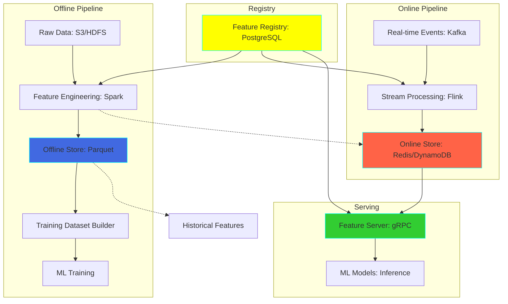
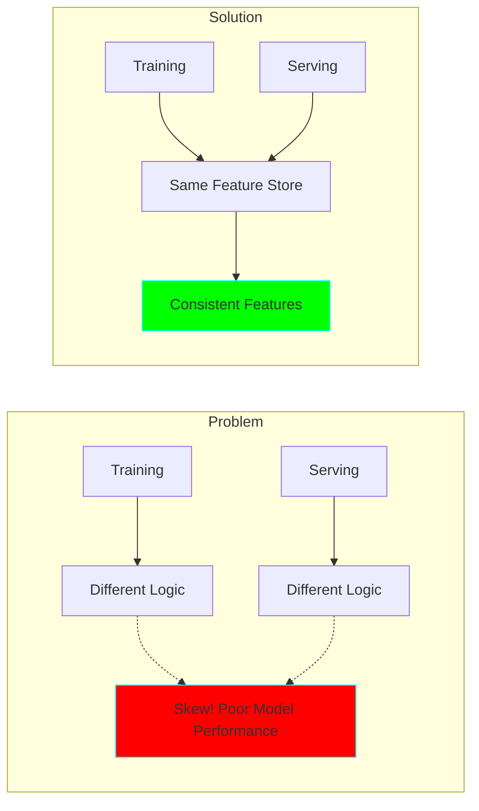

# Project 23: Real-time Feature Store

**Complexity:** ⭐⭐⭐⭐⭐ | **Time:** 12-15 hours | **Tier:** Expert Level

## Overview

Build a production-grade feature store that serves ML features with ultra-low latency while maintaining consistency between training and inference. This system handles both batch feature computation (offline) and real-time feature serving (online), preventing training-serving skew and enabling point-in-time correctness.

## Learning Objectives

After completing this project, you will understand:

- ✅ Feature store architecture and design patterns
- ✅ Online vs offline feature stores and their integration
- ✅ Point-in-time correctness for training data
- ✅ Low-latency feature serving (<10ms p99)
- ✅ Feature versioning and lineage tracking
- ✅ Training-serving skew prevention
- ✅ Feature freshness SLAs and monitoring
- ✅ Multi-model feature sharing and reuse

## Architecture



## Key Concepts

### Feature Store Components

**1. Feature Registry (Metadata)**
- Feature definitions and schemas
- Feature lineage and dependencies
- Version history
- SLA configurations

**2. Offline Store (Historical Features)**
- Complete feature history
- Training dataset generation
- Point-in-time correctness
- Batch feature computation

**3. Online Store (Real-time Features)**
- Latest feature values
- Low-latency serving (<10ms)
- High throughput (100k+ QPS)
- Feature caching

**4. Feature Server (API)**
- REST/gRPC endpoints
- Feature retrieval
- Batch feature fetching
- Request batching

### Training-Serving Skew



### Point-in-Time Correctness

```python
# Training requires features "as they were" at prediction time
# Without point-in-time correctness:
features_at_training = get_features(user_id, now())  # ❌ Data leakage!

# With point-in-time correctness:
features_at_training = get_features(user_id, event_timestamp)  # ✅ Correct
```

## Implementation Guide

### Step 1: Feature Registry

```python
from sqlalchemy import create_engine, Column, String, Integer, Float, JSON, DateTime, Boolean
from sqlalchemy.ext.declarative import declarative_base
from sqlalchemy.orm import sessionmaker
from datetime import datetime
from typing import Dict, List, Any, Optional
import json

Base = declarative_base()

class FeatureDefinition(Base):
    """Feature metadata and definition."""
    __tablename__ = 'features'

    feature_id = Column(String, primary_key=True)
    feature_name = Column(String, nullable=False)
    feature_group = Column(String, nullable=False)  # e.g., 'user_features', 'product_features'
    description = Column(String)
    data_type = Column(String, nullable=False)  # int, float, string, array, etc.
    version = Column(Integer, nullable=False, default=1)

    # Computation logic
    batch_source_query = Column(String)  # SQL for batch computation
    stream_source_topic = Column(String)  # Kafka topic for streaming
    transformation_logic = Column(JSON)  # Transformation function reference

    # Serving configuration
    online_enabled = Column(Boolean, default=True)
    offline_enabled = Column(Boolean, default=True)
    ttl_seconds = Column(Integer)  # How long to keep in online store

    # SLA configuration
    freshness_sla_seconds = Column(Integer)  # Max acceptable staleness
    expected_update_frequency = Column(String)  # '5min', '1hour', 'daily'

    # Metadata
    created_at = Column(DateTime, default=datetime.now)
    updated_at = Column(DateTime, onupdate=datetime.now)
    owner = Column(String)
    tags = Column(JSON)  # For discovery and organization

class FeatureRegistry:
    """Central registry for feature definitions."""

    def __init__(self, db_url: str = "postgresql://localhost/feature_store"):
        self.engine = create_engine(db_url)
        Base.metadata.create_all(self.engine)
        Session = sessionmaker(bind=self.engine)
        self.session = Session()

    def register_feature(
        self,
        feature_id: str,
        feature_name: str,
        feature_group: str,
        data_type: str,
        **kwargs
    ) -> FeatureDefinition:
        """
        Register a new feature in the registry.

        Example:
            registry.register_feature(
                feature_id='user_total_purchases',
                feature_name='total_purchases',
                feature_group='user_features',
                data_type='integer',
                batch_source_query='SELECT user_id, COUNT(*) FROM purchases GROUP BY user_id',
                freshness_sla_seconds=300,  # 5 minutes
                owner='data-team'
            )
        """
        feature = FeatureDefinition(
            feature_id=feature_id,
            feature_name=feature_name,
            feature_group=feature_group,
            data_type=data_type,
            **kwargs
        )

        self.session.add(feature)
        self.session.commit()

        return feature

    def get_feature(self, feature_id: str) -> Optional[FeatureDefinition]:
        """Retrieve feature definition."""
        return self.session.query(FeatureDefinition).filter_by(
            feature_id=feature_id
        ).first()

    def get_feature_group(self, feature_group: str) -> List[FeatureDefinition]:
        """Get all features in a group."""
        return self.session.query(FeatureDefinition).filter_by(
            feature_group=feature_group
        ).all()

    def search_features(self, tags: List[str] = None, owner: str = None) -> List[FeatureDefinition]:
        """Search features by tags or owner."""
        query = self.session.query(FeatureDefinition)

        if tags:
            # Search in JSON tags column
            for tag in tags:
                query = query.filter(FeatureDefinition.tags.contains([tag]))

        if owner:
            query = query.filter_by(owner=owner)

        return query.all()
```

### Step 2: Offline Feature Store

```python
from pyspark.sql import SparkSession, DataFrame
from pyspark.sql.functions import *
from pyspark.sql.window import Window
from datetime import datetime, timedelta
from typing import List

class OfflineFeatureStore:
    """
    Offline feature store for historical features and training dataset generation.

    Ensures point-in-time correctness.
    """

    def __init__(
        self,
        spark: SparkSession,
        storage_path: str = "s3://feature-store/offline"
    ):
        self.spark = spark
        self.storage_path = storage_path

    def materialize_features(
        self,
        feature_group: str,
        source_query: str,
        timestamp_column: str = 'timestamp'
    ):
        """
        Compute and materialize features from batch source.

        Saves features partitioned by date for efficient retrieval.
        """
        # Execute source query
        features_df = self.spark.sql(source_query)

        # Add partition columns
        features_df = features_df.withColumn(
            'date',
            to_date(col(timestamp_column))
        )

        # Write partitioned by date
        output_path = f"{self.storage_path}/{feature_group}"
        features_df.write \
            .mode('overwrite') \
            .partitionBy('date') \
            .parquet(output_path)

    def get_historical_features(
        self,
        entity_df: DataFrame,
        feature_groups: List[str],
        entity_id_column: str = 'user_id',
        timestamp_column: str = 'timestamp'
    ) -> DataFrame:
        """
        Get historical features with point-in-time correctness.

        This is critical for training: Features are retrieved as they
        existed at the timestamp of each training example.

        Args:
            entity_df: DataFrame with entity IDs and timestamps
            feature_groups: List of feature groups to retrieve
            entity_id_column: Column name for entity ID
            timestamp_column: Column name for timestamp

        Returns:
            DataFrame with point-in-time correct features
        """
        result_df = entity_df

        for feature_group in feature_groups:
            # Load feature group
            feature_path = f"{self.storage_path}/{feature_group}"
            features_df = self.spark.read.parquet(feature_path)

            # Point-in-time join
            result_df = self._point_in_time_join(
                result_df,
                features_df,
                entity_id_column,
                timestamp_column
            )

        return result_df

    def _point_in_time_join(
        self,
        entity_df: DataFrame,
        features_df: DataFrame,
        entity_id_column: str,
        timestamp_column: str
    ) -> DataFrame:
        """
        Perform point-in-time correct join.

        For each entity and timestamp, get the latest feature values
        that existed before or at that timestamp.
        """
        # Window partitioned by entity, ordered by timestamp
        window_spec = Window.partitionBy(entity_id_column).orderBy(col(timestamp_column).desc())

        # Join on entity ID and timestamp <= event timestamp
        joined = entity_df.alias('entities').join(
            features_df.alias('features'),
            (col(f'entities.{entity_id_column}') == col(f'features.{entity_id_column}')) &
            (col(f'features.{timestamp_column}') <= col(f'entities.{timestamp_column}')),
            'left'
        )

        # Get the most recent feature value for each entity-timestamp pair
        result = joined.withColumn(
            'row_num',
            row_number().over(window_spec)
        ).filter(col('row_num') == 1).drop('row_num')

        return result

    def create_training_dataset(
        self,
        labels_query: str,
        feature_groups: List[str],
        start_date: datetime,
        end_date: datetime,
        output_path: str
    ):
        """
        Create training dataset with labels and point-in-time correct features.

        Example:
            labels_query = '''
                SELECT user_id, timestamp, purchased as label
                FROM events
                WHERE event_type = 'checkout'
            '''
        """
        # Get labels
        labels_df = self.spark.sql(labels_query)
        labels_df = labels_df.filter(
            (col('timestamp') >= start_date) &
            (col('timestamp') <= end_date)
        )

        # Get historical features
        training_df = self.get_historical_features(
            entity_df=labels_df,
            feature_groups=feature_groups
        )

        # Save training dataset
        training_df.write.mode('overwrite').parquet(output_path)

        return training_df
```

### Step 3: Online Feature Store

```python
import redis
from redis.cluster import RedisCluster
import json
from typing import Dict, List, Any, Optional
import msgpack  # Faster than JSON for serialization

class OnlineFeatureStore:
    """
    Online feature store for low-latency feature serving.

    Uses Redis for sub-millisecond latency.
    """

    def __init__(
        self,
        redis_host: str = 'localhost',
        redis_port: int = 6379,
        use_cluster: bool = False,
        cluster_nodes: List[Dict] = None
    ):
        if use_cluster:
            self.client = RedisCluster(
                startup_nodes=cluster_nodes or [{'host': redis_host, 'port': redis_port}]
            )
        else:
            self.client = redis.Redis(
                host=redis_host,
                port=redis_port,
                decode_responses=False  # Binary mode for msgpack
            )

    def write_features(
        self,
        entity_id: str,
        feature_group: str,
        features: Dict[str, Any],
        ttl: Optional[int] = None
    ):
        """
        Write features for an entity to online store.

        Args:
            entity_id: Entity identifier (e.g., 'user:12345')
            feature_group: Feature group name
            features: Dict of feature name -> value
            ttl: Time-to-live in seconds
        """
        key = self._make_key(entity_id, feature_group)

        # Serialize with msgpack (faster than JSON)
        serialized = msgpack.packb(features)

        # Write to Redis
        if ttl:
            self.client.setex(key, ttl, serialized)
        else:
            self.client.set(key, serialized)

    def read_features(
        self,
        entity_id: str,
        feature_group: str,
        feature_names: Optional[List[str]] = None
    ) -> Dict[str, Any]:
        """
        Read features for an entity from online store.

        Args:
            entity_id: Entity identifier
            feature_group: Feature group name
            feature_names: Specific features to retrieve (None = all)

        Returns:
            Dict of feature name -> value
        """
        key = self._make_key(entity_id, feature_group)

        # Read from Redis
        serialized = self.client.get(key)

        if not serialized:
            return {}

        # Deserialize
        features = msgpack.unpackb(serialized, raw=False)

        # Filter to requested features
        if feature_names:
            features = {k: v for k, v in features.items() if k in feature_names}

        return features

    def batch_read_features(
        self,
        entity_ids: List[str],
        feature_group: str,
        feature_names: Optional[List[str]] = None
    ) -> Dict[str, Dict[str, Any]]:
        """
        Batch read features for multiple entities (more efficient).

        Uses Redis pipeline for batching.
        """
        keys = [self._make_key(entity_id, feature_group) for entity_id in entity_ids]

        # Use pipeline for batching
        pipe = self.client.pipeline()
        for key in keys:
            pipe.get(key)

        results = pipe.execute()

        # Deserialize results
        output = {}
        for entity_id, serialized in zip(entity_ids, results):
            if serialized:
                features = msgpack.unpackb(serialized, raw=False)
                if feature_names:
                    features = {k: v for k, v in features.items() if k in feature_names}
                output[entity_id] = features
            else:
                output[entity_id] = {}

        return output

    def _make_key(self, entity_id: str, feature_group: str) -> str:
        """Create Redis key for feature storage."""
        return f"features:{feature_group}:{entity_id}"

    def sync_from_offline(
        self,
        offline_store: OfflineFeatureStore,
        feature_group: str,
        entity_ids: List[str],
        ttl: int = 3600
    ):
        """
        Sync features from offline to online store.

        Used for:
        - Initial population
        - Backfilling
        - Cold start
        """
        # Get latest features from offline store
        # (Implementation depends on offline store details)
        pass
```

### Step 4: Feature Server (gRPC)

```python
from concurrent import futures
import grpc
import logging
from typing import List, Dict, Any

# Define gRPC service (feature_store.proto)
"""
syntax = "proto3";

service FeatureStore {
    rpc GetFeatures(GetFeaturesRequest) returns (GetFeaturesResponse);
    rpc BatchGetFeatures(BatchGetFeaturesRequest) returns (BatchGetFeaturesResponse);
}

message GetFeaturesRequest {
    string entity_id = 1;
    repeated string feature_names = 2;
}

message GetFeaturesResponse {
    map<string, FeatureValue> features = 1;
}

message FeatureValue {
    oneof value {
        int64 int_value = 1;
        double double_value = 2;
        string string_value = 3;
        bool bool_value = 4;
    }
}

message BatchGetFeaturesRequest {
    repeated string entity_ids = 1;
    repeated string feature_names = 2;
}

message BatchGetFeaturesResponse {
    map<string, EntityFeatures> features = 1;
}

message EntityFeatures {
    map<string, FeatureValue> features = 1;
}
"""

class FeatureServer:
    """
    gRPC server for low-latency feature serving.

    Serves features from online store with <10ms latency.
    """

    def __init__(
        self,
        online_store: OnlineFeatureStore,
        registry: FeatureRegistry,
        port: int = 50051
    ):
        self.online_store = online_store
        self.registry = registry
        self.port = port
        self.logger = logging.getLogger(__name__)

    def get_features(self, request, context):
        """
        Get features for a single entity.

        Implements GetFeatures RPC.
        """
        entity_id = request.entity_id
        feature_names = list(request.feature_names)

        # Group features by feature group for efficient retrieval
        feature_groups = self._group_features_by_group(feature_names)

        # Fetch from online store
        all_features = {}
        for feature_group, features in feature_groups.items():
            group_features = self.online_store.read_features(
                entity_id=entity_id,
                feature_group=feature_group,
                feature_names=features
            )
            all_features.update(group_features)

        # Convert to protobuf response
        return self._make_response(all_features)

    def batch_get_features(self, request, context):
        """
        Get features for multiple entities (more efficient).

        Implements BatchGetFeatures RPC.
        """
        entity_ids = list(request.entity_ids)
        feature_names = list(request.feature_names)

        # Group features by feature group
        feature_groups = self._group_features_by_group(feature_names)

        # Batch fetch from online store
        all_entity_features = {entity_id: {} for entity_id in entity_ids}

        for feature_group, features in feature_groups.items():
            batch_results = self.online_store.batch_read_features(
                entity_ids=entity_ids,
                feature_group=feature_group,
                feature_names=features
            )

            for entity_id, features_dict in batch_results.items():
                all_entity_features[entity_id].update(features_dict)

        # Convert to protobuf response
        return self._make_batch_response(all_entity_features)

    def _group_features_by_group(self, feature_names: List[str]) -> Dict[str, List[str]]:
        """Group feature names by their feature group."""
        groups = {}

        for feature_name in feature_names:
            # Look up feature in registry
            feature = self.registry.get_feature(feature_name)
            if feature:
                group = feature.feature_group
                if group not in groups:
                    groups[group] = []
                groups[group].append(feature_name)

        return groups

    def serve(self):
        """Start the gRPC server."""
        server = grpc.server(futures.ThreadPoolExecutor(max_workers=10))
        # Add service to server (generated from proto file)
        # feature_store_pb2_grpc.add_FeatureStoreServicer_to_server(self, server)

        server.add_insecure_port(f'[::]:{self.port}')
        server.start()

        self.logger.info(f"Feature server started on port {self.port}")
        server.wait_for_termination()
```

### Step 5: Stream Feature Processor

```python
from pyflink.datastream import StreamExecutionEnvironment
from pyflink.datastream.functions import KeyedProcessFunction
import json

class StreamFeatureProcessor:
    """
    Process streaming events and update online feature store in real-time.

    Ensures feature freshness for online serving.
    """

    def __init__(
        self,
        online_store: OnlineFeatureStore,
        registry: FeatureRegistry
    ):
        self.online_store = online_store
        self.registry = registry
        self.env = StreamExecutionEnvironment.get_execution_environment()

    def process_event_stream(self, kafka_topic: str):
        """
        Process events from Kafka and update online features.

        Example events:
            {'user_id': 'u123', 'event': 'purchase', 'amount': 99.99, 'timestamp': '...'}
        """
        # Create Kafka source
        # stream = self.env.add_source(...)

        # Parse and key by entity ID
        # keyed_stream = stream.key_by(lambda x: x['user_id'])

        # Process with stateful function
        # keyed_stream.process(FeatureUpdater(self.online_store, self.registry))

        # Execute
        # self.env.execute("StreamFeatureProcessor")
        pass

class FeatureUpdater(KeyedProcessFunction):
    """Update features in online store based on streaming events."""

    def __init__(self, online_store: OnlineFeatureStore, registry: FeatureRegistry):
        self.online_store = online_store
        self.registry = registry

    def process_element(self, event, ctx):
        """Process event and update features."""
        user_id = event['user_id']

        # Compute features from event
        features = self._compute_features(event)

        # Write to online store
        for feature_group, feature_dict in features.items():
            # Get TTL from registry
            feature_def = self.registry.get_feature_group(feature_group)[0]
            ttl = feature_def.ttl_seconds

            self.online_store.write_features(
                entity_id=user_id,
                feature_group=feature_group,
                features=feature_dict,
                ttl=ttl
            )

    def _compute_features(self, event: Dict[str, Any]) -> Dict[str, Dict[str, Any]]:
        """
        Compute features from event.

        Returns: {feature_group: {feature_name: value}}
        """
        # Example: Compute user behavior features
        return {
            'user_behavior': {
                'last_event_type': event['event'],
                'last_event_timestamp': event['timestamp'],
                'last_purchase_amount': event.get('amount', 0)
            }
        }
```

## Nuanced Scenarios

### 1. Feature Freshness Monitoring

**Challenge:** Detect and alert on stale features.

```python
class FeatureFreshnessMonitor:
    """Monitor feature freshness and alert on SLA violations."""

    def __init__(
        self,
        registry: FeatureRegistry,
        online_store: OnlineFeatureStore
    ):
        self.registry = registry
        self.online_store = online_store

    def check_freshness(self, entity_id: str, feature_group: str) -> Dict[str, Any]:
        """
        Check if features are within freshness SLA.

        Returns:
            {
                'is_fresh': bool,
                'age_seconds': int,
                'sla_seconds': int,
                'violation': bool
            }
        """
        # Get feature definition
        features = self.registry.get_feature_group(feature_group)
        sla_seconds = features[0].freshness_sla_seconds

        # Get features from online store
        feature_dict = self.online_store.read_features(entity_id, feature_group)

        # Check timestamp
        if '_updated_at' in feature_dict:
            updated_at = datetime.fromisoformat(feature_dict['_updated_at'])
            age_seconds = (datetime.now() - updated_at).total_seconds()

            return {
                'is_fresh': age_seconds <= sla_seconds,
                'age_seconds': age_seconds,
                'sla_seconds': sla_seconds,
                'violation': age_seconds > sla_seconds
            }

        return {
            'is_fresh': False,
            'age_seconds': None,
            'sla_seconds': sla_seconds,
            'violation': True
        }
```

### 2. Feature Versioning

**Challenge:** Support multiple versions of features for A/B testing and gradual rollout.

```python
class VersionedFeatureStore:
    """Feature store with version support."""

    def write_features_v2(
        self,
        entity_id: str,
        feature_group: str,
        features: Dict[str, Any],
        version: int = 1
    ):
        """Write features with version."""
        key = f"features:v{version}:{feature_group}:{entity_id}"
        # Write to Redis...

    def read_features_v2(
        self,
        entity_id: str,
        feature_group: str,
        version: int = 1
    ) -> Dict[str, Any]:
        """Read features from specific version."""
        key = f"features:v{version}:{feature_group}:{entity_id}"
        # Read from Redis...
```

### 3. Feature Caching

**Challenge:** Reduce load on feature store with intelligent caching.

```python
from functools import lru_cache
from cachetools import TTLCache
import hashlib

class CachedFeatureStore:
    """Feature store with local caching."""

    def __init__(self, online_store: OnlineFeatureStore, cache_ttl: int = 60):
        self.online_store = online_store
        self.cache = TTLCache(maxsize=10000, ttl=cache_ttl)

    def read_features_cached(
        self,
        entity_id: str,
        feature_group: str
    ) -> Dict[str, Any]:
        """Read with caching."""
        cache_key = f"{entity_id}:{feature_group}"

        if cache_key in self.cache:
            return self.cache[cache_key]

        features = self.online_store.read_features(entity_id, feature_group)
        self.cache[cache_key] = features

        return features
```

### 4. Feature Transformation Pipeline

**Challenge:** Apply complex transformations consistently across training and serving.

```python
class FeatureTransformer:
    """Apply transformations to features."""

    @staticmethod
    def transform_user_features(features: Dict[str, Any]) -> Dict[str, Any]:
        """
        Transform user features consistently.

        Same logic used in both:
        - Offline: Training data generation
        - Online: Real-time serving
        """
        transformed = features.copy()

        # Example: Log transform
        if 'total_purchases' in features:
            import math
            transformed['log_total_purchases'] = math.log1p(features['total_purchases'])

        # Example: Categorical encoding
        if 'country' in features:
            country_encoding = {'US': 0, 'UK': 1, 'DE': 2}
            transformed['country_encoded'] = country_encoding.get(features['country'], -1)

        # Example: Feature crossing
        if 'age' in features and 'gender' in features:
            transformed['age_gender'] = f"{features['age']}_{features['gender']}"

        return transformed
```

## Exercises

### Exercise 1: Basic Feature Store
Build a simple feature store:
- Register 5+ features
- Compute features batch and streaming
- Serve features via API
- Measure latency

### Exercise 2: Point-in-Time Correctness
Implement point-in-time joins:
- Create training dataset with labels
- Join historical features correctly
- Verify no data leakage
- Compare with naive join

### Exercise 3: Feature Monitoring
Build monitoring system:
- Track feature freshness
- Detect distribution drift
- Alert on SLA violations
- Create dashboard

### Exercise 4: Production Optimization
Optimize for production:
- Benchmark and improve latency
- Add caching layer
- Implement request batching
- Load test at scale

## Success Criteria

- [ ] Build complete feature registry with metadata
- [ ] Implement offline store with point-in-time correctness
- [ ] Build online store with <10ms p99 latency
- [ ] Create feature server with gRPC API
- [ ] Process streaming features in real-time
- [ ] Support 100,000+ QPS for feature serving
- [ ] Implement feature versioning
- [ ] Monitor feature freshness and quality
- [ ] Prevent training-serving skew
- [ ] Document feature engineering best practices

## Testing Checklist

```python
# tests/test_feature_store.py

def test_feature_registration():
    """Test feature registry."""
    pass

def test_point_in_time_join():
    """Test point-in-time correctness."""
    pass

def test_online_feature_serving():
    """Test low-latency serving."""
    pass

def test_feature_freshness():
    """Test freshness monitoring."""
    pass

def test_batch_feature_retrieval():
    """Test batch optimization."""
    pass

def test_feature_versioning():
    """Test version management."""
    pass

def test_training_serving_consistency():
    """Test same features in training and serving."""
    pass

def test_performance():
    """Test latency and throughput."""
    pass
```

## Common Pitfalls

1. **Data Leakage:** Not using point-in-time joins
2. **Training-Serving Skew:** Different logic in batch and streaming
3. **Stale Features:** Not monitoring freshness
4. **High Latency:** Inefficient online store design
5. **Missing Features:** No fallback for cold start
6. **Schema Drift:** Not versioning feature definitions
7. **No Lineage:** Can't track feature dependencies

## Next Steps

After completing this project:
1. Apply to **Project 30: Real-time ML Feature Platform**
2. Combine with **Project 21: Lambda Architecture**
3. Explore **Project 27: Data Quality Observability** for monitoring

## References

- [Feast Feature Store](https://docs.feast.dev/)
- [Feature Store for ML (Google)](https://cloud.google.com/blog/products/ai-machine-learning/introducing-feast-an-open-source-feature-store-for-machine-learning)
- [Michelangelo ML Platform (Uber)](https://www.uber.com/blog/michelangelo-machine-learning-platform/)
- [Feature Store: The Missing Layer in ML Pipelines](https://www.tecton.ai/blog/what-is-a-feature-store/)
- [Point-in-Time Correctness](https://www.tecton.ai/blog/time-travel-in-ml/)

---

**Happy Learning! 🚀**
