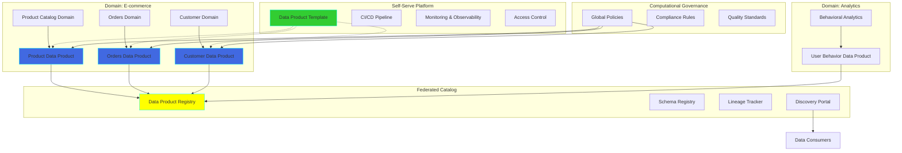
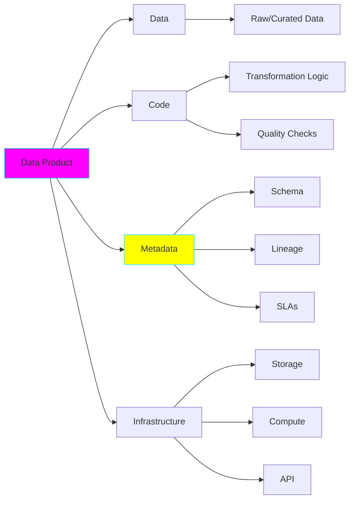

# Project 24: Data Mesh Implementation

**Complexity:** ⭐⭐⭐⭐⭐ | **Time:** 15-18 hours | **Tier:** Expert Level

## Overview

Build a Data Mesh implementation that transforms monolithic data architectures into decentralized, domain-oriented data products. This project demonstrates how to implement the four foundational principles of Data Mesh: domain-oriented ownership, data as a product, self-serve data infrastructure, and federated computational governance.

## Learning Objectives

After completing this project, you will understand:

- ✅ Data Mesh principles and architectural patterns
- ✅ Domain-driven design for data systems
- ✅ Data product thinking and API design
- ✅ Federated governance vs centralized control
- ✅ Self-serve data infrastructure platforms
- ✅ Data contracts and SLAs
- ✅ Cross-domain data sharing and discovery
- ✅ Decentralized data quality management

## Architecture



## Key Concepts

### Four Principles of Data Mesh

**1. Domain-Oriented Decentralization**
- Data ownership by domain teams
- Distributed data architecture
- Domain boundaries aligned with business

**2. Data as a Product**
- Data products with clear APIs
- Quality and SLA commitments
- Discoverability and documentation
- Consumer-centric design

**3. Self-Serve Data Infrastructure**
- Platform abstracts complexity
- Domain teams autonomously create data products
- Standardized tooling and automation
- Infrastructure as code

**4. Federated Computational Governance**
- Global policies, local execution
- Automated compliance checking
- Distributed quality management
- Interoperability standards

### Data Product Anatomy



### Centralized vs Federated Governance

| Aspect | Centralized | Federated (Data Mesh) |
|--------|-------------|----------------------|
| **Ownership** | Central data team | Domain teams |
| **Standards** | Imposed top-down | Agreed collectively |
| **Quality** | Central validation | Domain responsibility + automated checks |
| **Tooling** | Single stack | Polyglot (with standards) |
| **Scalability** | Bottleneck | Scales with domains |

## Implementation Guide

### Step 1: Data Product Abstraction

```python
from dataclasses import dataclass, field
from typing import List, Dict, Any, Optional
from datetime import datetime
from enum import Enum
import yaml

class DataProductType(Enum):
    """Types of data products."""
    SOURCE = "source"  # Raw data from operational systems
    AGGREGATE = "aggregate"  # Aggregated/summarized data
    CONSUMER_ALIGNED = "consumer_aligned"  # Optimized for specific use case
    DERIVED = "derived"  # Derived from other data products

class SLA:
    """Service Level Agreement for data product."""
    def __init__(
        self,
        freshness_minutes: int,
        completeness_percent: float,
        accuracy_threshold: float,
        availability_percent: float
    ):
        self.freshness_minutes = freshness_minutes
        self.completeness_percent = completeness_percent
        self.accuracy_threshold = accuracy_threshold
        self.availability_percent = availability_percent

@dataclass
class DataProduct:
    """
    Data Product definition following Data Mesh principles.

    A data product is a self-contained unit that includes:
    - The data itself
    - Code to produce and maintain it
    - Metadata and documentation
    - Infrastructure to serve it
    """

    # Identity
    product_id: str
    product_name: str
    domain: str  # Owning domain
    version: str

    # Product information
    description: str
    owner_team: str
    owner_email: str
    type: DataProductType

    # Data characteristics
    schema: Dict[str, Any]
    output_ports: List[str]  # APIs/endpoints to access data
    input_ports: List[str] = field(default_factory=list)  # Dependencies

    # Quality commitments
    sla: Optional[SLA] = None
    quality_checks: List[str] = field(default_factory=list)

    # Governance
    data_classification: str = "internal"  # public, internal, confidential
    retention_days: int = 365
    tags: List[str] = field(default_factory=list)

    # Technical details
    storage_location: str = ""
    transformation_code_repo: str = ""
    deployment_manifest: str = ""

    # Metadata
    created_at: datetime = field(default_factory=datetime.now)
    updated_at: datetime = field(default_factory=datetime.now)

    def to_yaml(self) -> str:
        """Export data product definition as YAML."""
        return yaml.dump(self.__dict__, default_flow_style=False)

    @classmethod
    def from_yaml(cls, yaml_string: str) -> 'DataProduct':
        """Load data product definition from YAML."""
        data = yaml.safe_load(yaml_string)
        return cls(**data)

    def validate(self) -> tuple[bool, List[str]]:
        """
        Validate data product definition.

        Returns: (is_valid, list_of_issues)
        """
        issues = []

        # Required fields
        if not self.product_id:
            issues.append("product_id is required")
        if not self.domain:
            issues.append("domain is required")
        if not self.owner_team:
            issues.append("owner_team is required")

        # Schema validation
        if not self.schema:
            issues.append("schema is required")

        # At least one output port
        if not self.output_ports:
            issues.append("At least one output port required")

        # SLA validation
        if self.sla:
            if self.sla.availability_percent < 95:
                issues.append("Availability SLA must be >= 95%")

        return len(issues) == 0, issues
```

### Step 2: Data Product Registry (Federated Catalog)

```python
from sqlalchemy import create_engine, Column, String, Integer, JSON, DateTime, Float
from sqlalchemy.ext.declarative import declarative_base
from sqlalchemy.orm import sessionmaker
from typing import List, Dict, Optional
import logging

Base = declarative_base()

class DataProductMetadata(Base):
    """Data product metadata stored in federated catalog."""
    __tablename__ = 'data_products'

    product_id = Column(String, primary_key=True)
    product_name = Column(String, nullable=False)
    domain = Column(String, nullable=False, index=True)
    version = Column(String, nullable=False)
    description = Column(String)
    owner_team = Column(String, index=True)
    owner_email = Column(String)
    type = Column(String)

    schema_json = Column(JSON)
    output_ports = Column(JSON)
    input_ports = Column(JSON)

    sla_json = Column(JSON)
    quality_checks = Column(JSON)

    data_classification = Column(String)
    retention_days = Column(Integer)
    tags = Column(JSON)

    storage_location = Column(String)
    transformation_code_repo = Column(String)

    created_at = Column(DateTime)
    updated_at = Column(DateTime)

    # Metrics (updated by monitoring)
    current_freshness_minutes = Column(Float)
    current_completeness_percent = Column(Float)
    current_availability_percent = Column(Float)

class DataProductRegistry:
    """
    Federated catalog for data product discovery.

    This is the "shopping catalog" for data consumers.
    """

    def __init__(self, db_url: str = "postgresql://localhost/data_mesh"):
        self.engine = create_engine(db_url)
        Base.metadata.create_all(self.engine)
        Session = sessionmaker(bind=self.engine)
        self.session = Session()
        self.logger = logging.getLogger(__name__)

    def register_product(self, product: DataProduct) -> bool:
        """
        Register a new data product in the catalog.

        This is called by domain teams when they create a data product.
        """
        # Validate product
        is_valid, issues = product.validate()
        if not is_valid:
            self.logger.error(f"Invalid data product: {issues}")
            return False

        # Convert to DB model
        metadata = DataProductMetadata(
            product_id=product.product_id,
            product_name=product.product_name,
            domain=product.domain,
            version=product.version,
            description=product.description,
            owner_team=product.owner_team,
            owner_email=product.owner_email,
            type=product.type.value,
            schema_json=product.schema,
            output_ports=product.output_ports,
            input_ports=product.input_ports,
            sla_json=product.sla.__dict__ if product.sla else None,
            quality_checks=product.quality_checks,
            data_classification=product.data_classification,
            retention_days=product.retention_days,
            tags=product.tags,
            storage_location=product.storage_location,
            transformation_code_repo=product.transformation_code_repo,
            created_at=product.created_at,
            updated_at=product.updated_at
        )

        self.session.add(metadata)
        self.session.commit()

        self.logger.info(f"Registered data product: {product.product_id}")
        return True

    def discover_products(
        self,
        domain: Optional[str] = None,
        tags: Optional[List[str]] = None,
        search_term: Optional[str] = None
    ) -> List[DataProductMetadata]:
        """
        Discover data products by domain, tags, or search term.

        This enables self-service data discovery.
        """
        query = self.session.query(DataProductMetadata)

        if domain:
            query = query.filter(DataProductMetadata.domain == domain)

        if tags:
            for tag in tags:
                query = query.filter(DataProductMetadata.tags.contains([tag]))

        if search_term:
            query = query.filter(
                (DataProductMetadata.product_name.ilike(f'%{search_term}%')) |
                (DataProductMetadata.description.ilike(f'%{search_term}%'))
            )

        return query.all()

    def get_product_lineage(self, product_id: str) -> Dict[str, List[str]]:
        """
        Get upstream and downstream lineage for a data product.

        Returns:
            {
                'upstream': [list of input data products],
                'downstream': [list of products that depend on this]
            }
        """
        product = self.session.query(DataProductMetadata).filter_by(
            product_id=product_id
        ).first()

        if not product:
            return {'upstream': [], 'downstream': []}

        # Upstream: This product's inputs
        upstream = product.input_ports or []

        # Downstream: Products that list this as input
        downstream_products = self.session.query(DataProductMetadata).filter(
            DataProductMetadata.input_ports.contains([product_id])
        ).all()
        downstream = [p.product_id for p in downstream_products]

        return {
            'upstream': upstream,
            'downstream': downstream
        }

    def check_sla_compliance(self, product_id: str) -> Dict[str, Any]:
        """
        Check if data product is meeting its SLA commitments.
        """
        product = self.session.query(DataProductMetadata).filter_by(
            product_id=product_id
        ).first()

        if not product or not product.sla_json:
            return {'compliant': None, 'details': 'No SLA defined'}

        sla = product.sla_json
        violations = []

        # Check freshness
        if product.current_freshness_minutes > sla['freshness_minutes']:
            violations.append(
                f"Freshness: {product.current_freshness_minutes}min > {sla['freshness_minutes']}min"
            )

        # Check completeness
        if product.current_completeness_percent < sla['completeness_percent']:
            violations.append(
                f"Completeness: {product.current_completeness_percent}% < {sla['completeness_percent']}%"
            )

        # Check availability
        if product.current_availability_percent < sla['availability_percent']:
            violations.append(
                f"Availability: {product.current_availability_percent}% < {sla['availability_percent']}%"
            )

        return {
            'compliant': len(violations) == 0,
            'violations': violations
        }
```

### Step 3: Data Contract Definition

```python
from pydantic import BaseModel, Field, validator
from typing import List, Dict, Any, Optional
from datetime import datetime

class FieldContract(BaseModel):
    """Contract for a single field in the data product."""
    name: str
    type: str  # 'string', 'integer', 'float', 'timestamp', etc.
    nullable: bool = True
    description: str = ""
    constraints: Optional[Dict[str, Any]] = None

    @validator('type')
    def validate_type(cls, v):
        valid_types = ['string', 'integer', 'float', 'boolean', 'timestamp', 'array', 'object']
        if v not in valid_types:
            raise ValueError(f"Type must be one of {valid_types}")
        return v

class DataContract(BaseModel):
    """
    Data contract between data product producer and consumers.

    This is a promise about the data structure and quality.
    """
    contract_id: str
    product_id: str
    version: str

    # Schema contract
    fields: List[FieldContract]
    partition_by: List[str] = Field(default_factory=list)

    # Quality contract
    min_completeness: float = 0.95  # 95% of records must be complete
    max_null_rate: Dict[str, float] = Field(default_factory=dict)  # Per field
    uniqueness_constraints: List[str] = Field(default_factory=list)  # Unique columns

    # Freshness contract
    max_latency_minutes: int = 60

    # Compatibility
    backward_compatible: bool = True
    schema_evolution_policy: str = "backward_compatible"  # or "none", "full"

    # Metadata
    effective_date: datetime = Field(default_factory=datetime.now)
    deprecated_date: Optional[datetime] = None

    def validate_data(self, data_df) -> tuple[bool, List[str]]:
        """
        Validate data against contract.

        Returns: (is_valid, list_of_violations)
        """
        violations = []

        # Check schema
        expected_fields = {f.name for f in self.fields}
        actual_fields = set(data_df.columns)

        missing_fields = expected_fields - actual_fields
        if missing_fields:
            violations.append(f"Missing fields: {missing_fields}")

        # Check data types
        for field in self.fields:
            if field.name in data_df.columns:
                # Type checking logic
                pass

        # Check completeness
        completeness = 1 - data_df.isnull().sum().sum() / (len(data_df) * len(data_df.columns))
        if completeness < self.min_completeness:
            violations.append(
                f"Completeness {completeness:.2%} below minimum {self.min_completeness:.2%}"
            )

        # Check null rates
        for field, max_rate in self.max_null_rate.items():
            if field in data_df.columns:
                null_rate = data_df[field].isnull().sum() / len(data_df)
                if null_rate > max_rate:
                    violations.append(
                        f"Field {field} null rate {null_rate:.2%} exceeds {max_rate:.2%}"
                    )

        # Check uniqueness
        for field in self.uniqueness_constraints:
            if field in data_df.columns:
                if data_df[field].duplicated().any():
                    violations.append(f"Field {field} contains duplicates")

        return len(violations) == 0, violations

class ContractRegistry:
    """Registry for data contracts."""

    def __init__(self):
        self.contracts: Dict[str, DataContract] = {}

    def register_contract(self, contract: DataContract):
        """Register a data contract."""
        self.contracts[contract.contract_id] = contract

    def get_contract(self, contract_id: str) -> Optional[DataContract]:
        """Retrieve a data contract."""
        return self.contracts.get(contract_id)

    def validate_compatibility(
        self,
        old_contract: DataContract,
        new_contract: DataContract
    ) -> tuple[bool, List[str]]:
        """
        Check if new contract is compatible with old contract.

        For backward compatibility:
        - Can add new optional fields
        - Cannot remove fields
        - Cannot change field types
        - Cannot make optional fields required
        """
        issues = []

        old_fields = {f.name: f for f in old_contract.fields}
        new_fields = {f.name: f for f in new_contract.fields}

        # Check for removed fields
        removed = set(old_fields.keys()) - set(new_fields.keys())
        if removed:
            issues.append(f"Removed fields (breaking): {removed}")

        # Check for type changes
        for name in old_fields:
            if name in new_fields:
                if old_fields[name].type != new_fields[name].type:
                    issues.append(f"Field {name} type changed: {old_fields[name].type} -> {new_fields[name].type}")

                # Check nullability
                if old_fields[name].nullable and not new_fields[name].nullable:
                    issues.append(f"Field {name} became non-nullable (breaking)")

        return len(issues) == 0, issues
```

### Step 4: Self-Serve Data Platform

```python
from typing import Dict, Any
import subprocess
import yaml
from pathlib import Path

class DataProductTemplate:
    """
    Self-serve template for creating data products.

    Provides scaffolding and automation for domain teams.
    """

    def __init__(self, platform_config: Dict[str, Any]):
        self.config = platform_config

    def create_data_product(
        self,
        product_id: str,
        domain: str,
        product_type: str,
        owner_team: str
    ) -> str:
        """
        Generate boilerplate for new data product.

        Creates:
        - Project structure
        - CI/CD pipeline
        - Infrastructure as code
        - Monitoring dashboards
        - Quality checks
        """
        project_path = Path(f"./data-products/{domain}/{product_id}")
        project_path.mkdir(parents=True, exist_ok=True)

        # Create directory structure
        (project_path / "src").mkdir(exist_ok=True)
        (project_path / "tests").mkdir(exist_ok=True)
        (project_path / "infrastructure").mkdir(exist_ok=True)
        (project_path / "docs").mkdir(exist_ok=True)

        # Generate data product manifest
        manifest = {
            'product_id': product_id,
            'domain': domain,
            'owner_team': owner_team,
            'type': product_type,
            'version': '1.0.0',
            'output_ports': [],
            'quality_checks': []
        }

        with open(project_path / "product.yaml", 'w') as f:
            yaml.dump(manifest, f)

        # Generate transformation template
        self._generate_transformation_code(project_path, product_type)

        # Generate infrastructure template
        self._generate_infrastructure(project_path)

        # Generate CI/CD pipeline
        self._generate_cicd_pipeline(project_path)

        # Generate quality checks
        self._generate_quality_checks(project_path)

        return str(project_path)

    def _generate_transformation_code(self, project_path: Path, product_type: str):
        """Generate transformation code template."""
        template = '''
from pyspark.sql import SparkSession
from pyspark.sql.functions import *

def transform(spark: SparkSession):
    """
    Main transformation logic for data product.

    TODO: Implement your transformation logic here.
    """
    # Read from source
    df = spark.read.parquet("s3://source/data")

    # Apply transformations
    df = df.filter(col("status") == "active")

    # Write to output
    df.write.mode("overwrite").parquet("s3://output/data")

if __name__ == "__main__":
    spark = SparkSession.builder.appName("DataProduct").getOrCreate()
    transform(spark)
'''
        with open(project_path / "src" / "transform.py", 'w') as f:
            f.write(template)

    def _generate_infrastructure(self, project_path: Path):
        """Generate Terraform/CloudFormation template."""
        terraform_template = '''
# Infrastructure for data product

resource "aws_s3_bucket" "data_product_storage" {
  bucket = var.bucket_name

  tags = {
    Domain = var.domain
    Product = var.product_id
  }
}

resource "aws_glue_job" "transformation" {
  name     = "${var.product_id}-transform"
  role_arn = var.glue_role_arn

  command {
    script_location = "s3://${var.scripts_bucket}/transform.py"
    python_version  = "3"
  }
}
'''
        with open(project_path / "infrastructure" / "main.tf", 'w') as f:
            f.write(terraform_template)

    def _generate_cicd_pipeline(self, project_path: Path):
        """Generate CI/CD pipeline (GitHub Actions, etc.)."""
        github_actions = '''
name: Data Product CI/CD

on:
  push:
    branches: [ main ]
  pull_request:
    branches: [ main ]

jobs:
  test:
    runs-on: ubuntu-latest
    steps:
      - uses: actions/checkout@v2
      - name: Run quality checks
        run: python -m pytest tests/
      - name: Validate data contract
        run: python -m data_mesh.validate_contract

  deploy:
    needs: test
    runs-on: ubuntu-latest
    steps:
      - name: Deploy infrastructure
        run: terraform apply -auto-approve
      - name: Run transformation
        run: python src/transform.py
      - name: Register in catalog
        run: python -m data_mesh.register_product
'''
        (project_path / ".github" / "workflows").mkdir(parents=True, exist_ok=True)
        with open(project_path / ".github" / "workflows" / "ci-cd.yaml", 'w') as f:
            f.write(github_actions)

    def _generate_quality_checks(self, project_path: Path):
        """Generate data quality check template."""
        quality_checks = '''
import great_expectations as ge

def run_quality_checks(data_path: str):
    """Run quality checks on data product output."""

    # Load data
    df = ge.read_csv(data_path)

    # Define expectations
    df.expect_column_values_to_not_be_null("id")
    df.expect_column_values_to_be_unique("id")
    df.expect_column_values_to_be_between("amount", min_value=0, max_value=1000000)

    # Validate
    results = df.validate()

    return results.success
'''
        with open(project_path / "src" / "quality_checks.py", 'w') as f:
            f.write(quality_checks)
```

### Step 5: Federated Governance Engine

```python
from typing import List, Dict, Any, Callable
from dataclasses import dataclass
from enum import Enum

class PolicyType(Enum):
    """Types of governance policies."""
    DATA_CLASSIFICATION = "data_classification"
    RETENTION = "retention"
    ACCESS_CONTROL = "access_control"
    QUALITY = "quality"
    PRIVACY = "privacy"

@dataclass
class GovernancePolicy:
    """Global governance policy applied across all data products."""
    policy_id: str
    name: str
    type: PolicyType
    description: str
    rule: Callable[[DataProduct], tuple[bool, str]]  # Returns (compliant, reason)
    enforcement_level: str = "warn"  # "warn", "block", "audit"

class FederatedGovernance:
    """
    Federated governance engine.

    Enforces global policies while allowing local execution by domain teams.
    """

    def __init__(self):
        self.policies: List[GovernancePolicy] = []
        self.logger = logging.getLogger(__name__)

    def register_policy(self, policy: GovernancePolicy):
        """Register a global governance policy."""
        self.policies.append(policy)
        self.logger.info(f"Registered policy: {policy.name}")

    def evaluate_product(
        self,
        product: DataProduct
    ) -> Dict[str, Any]:
        """
        Evaluate data product against all governance policies.

        Returns:
            {
                'compliant': bool,
                'violations': [list of violations],
                'warnings': [list of warnings]
            }
        """
        violations = []
        warnings = []

        for policy in self.policies:
            compliant, reason = policy.rule(product)

            if not compliant:
                if policy.enforcement_level == "block":
                    violations.append({
                        'policy': policy.name,
                        'reason': reason,
                        'severity': 'error'
                    })
                else:
                    warnings.append({
                        'policy': policy.name,
                        'reason': reason,
                        'severity': 'warning'
                    })

        return {
            'compliant': len(violations) == 0,
            'violations': violations,
            'warnings': warnings
        }

    def create_standard_policies(self):
        """Create standard governance policies."""

        # Policy 1: PII data must be encrypted
        def pii_encryption_check(product: DataProduct) -> tuple[bool, str]:
            if product.data_classification == "confidential":
                # Check if encryption is configured
                # (Simplified check)
                return True, ""
            return True, ""

        self.register_policy(GovernancePolicy(
            policy_id="pii_encryption",
            name="PII Encryption Required",
            type=PolicyType.PRIVACY,
            description="Confidential data must be encrypted at rest and in transit",
            rule=pii_encryption_check,
            enforcement_level="block"
        ))

        # Policy 2: Data retention limits
        def retention_check(product: DataProduct) -> tuple[bool, str]:
            max_retention = 2555  # 7 years
            if product.retention_days > max_retention:
                return False, f"Retention {product.retention_days} days exceeds limit {max_retention}"
            return True, ""

        self.register_policy(GovernancePolicy(
            policy_id="retention_limit",
            name="Maximum Retention Period",
            type=PolicyType.RETENTION,
            description="Data cannot be retained longer than 7 years",
            rule=retention_check,
            enforcement_level="warn"
        ))

        # Policy 3: Quality SLA required
        def sla_required_check(product: DataProduct) -> tuple[bool, str]:
            if not product.sla:
                return False, "All data products must define SLAs"
            return True, ""

        self.register_policy(GovernancePolicy(
            policy_id="sla_required",
            name="SLA Required",
            type=PolicyType.QUALITY,
            description="All data products must commit to SLAs",
            rule=sla_required_check,
            enforcement_level="block"
        ))
```

## Nuanced Scenarios

### 1. Cross-Domain Data Sharing

**Challenge:** Domain A needs data from Domain B.

```python
class DataProductAccessManager:
    """Manage cross-domain data access requests."""

    def request_access(
        self,
        requesting_domain: str,
        data_product_id: str,
        purpose: str
    ) -> str:
        """
        Request access to another domain's data product.

        Returns: access_request_id
        """
        # Create access request
        # Notify owning domain
        # Track approval workflow
        pass

    def grant_access(
        self,
        access_request_id: str,
        access_level: str = "read"
    ):
        """Grant access to data product."""
        # Update access control lists
        # Generate credentials/API keys
        # Send notification
        pass
```

### 2. Data Product Versioning

**Challenge:** Evolve data products without breaking consumers.

```python
class VersionManager:
    """Manage data product versions."""

    def create_new_version(
        self,
        product_id: str,
        changes: Dict[str, Any],
        backward_compatible: bool
    ) -> str:
        """
        Create new version of data product.

        If backward compatible: Deploy alongside v1
        If breaking: Deprecation period required
        """
        pass

    def deprecate_version(
        self,
        product_id: str,
        version: str,
        deprecation_date: datetime,
        migration_guide: str
    ):
        """Deprecate old version with migration path."""
        pass
```

### 3. Data Product Monitoring

**Challenge:** Monitor health across decentralized products.

```python
class DataProductMonitor:
    """Monitor data product health and SLAs."""

    def collect_metrics(self, product_id: str) -> Dict[str, Any]:
        """
        Collect metrics for data product:
        - Freshness
        - Completeness
        - Query latency
        - Error rates
        """
        pass

    def check_sla_violations(self) -> List[Dict[str, Any]]:
        """Check all products for SLA violations."""
        pass
```

### 4. Self-Service Data Discovery

**Challenge:** Enable consumers to find relevant data products.

```python
class DataDiscoveryPortal:
    """Self-service portal for data discovery."""

    def search_products(
        self,
        keywords: List[str],
        domain: Optional[str] = None,
        tags: Optional[List[str]] = None
    ) -> List[DataProduct]:
        """Search data products."""
        pass

    def get_recommendations(
        self,
        user_id: str,
        context: Dict[str, Any]
    ) -> List[DataProduct]:
        """Recommend relevant data products."""
        pass
```

## Exercises

### Exercise 1: Create Domain Data Products
Define 3+ data products across different domains:
- Design data contracts
- Implement quality checks
- Register in catalog

### Exercise 2: Implement Governance
Build federated governance:
- Define 5+ policies
- Automate compliance checking
- Handle violations

### Exercise 3: Cross-Domain Integration
Build cross-domain data pipeline:
- Request access to external product
- Consume via defined APIs
- Track lineage

### Exercise 4: Self-Serve Platform
Create self-serve capabilities:
- Generate product templates
- Automate deployment
- Provide monitoring dashboards

## Success Criteria

- [ ] Define 3+ data products with clear contracts
- [ ] Implement federated data product registry
- [ ] Build self-serve data product creation
- [ ] Enforce federated governance policies
- [ ] Enable cross-domain data discovery
- [ ] Implement automated quality checking
- [ ] Track end-to-end data lineage
- [ ] Monitor SLA compliance
- [ ] Document data product standards
- [ ] Create onboarding guide for domain teams

## Testing Checklist

```python
# tests/test_data_mesh.py

def test_data_product_creation():
    """Test data product creation and validation."""
    pass

def test_contract_validation():
    """Test data contract enforcement."""
    pass

def test_governance_policies():
    """Test policy evaluation."""
    pass

def test_product_discovery():
    """Test search and discovery."""
    pass

def test_lineage_tracking():
    """Test lineage computation."""
    pass

def test_sla_monitoring():
    """Test SLA compliance checking."""
    pass

def test_access_control():
    """Test cross-domain access."""
    pass
```

## Common Pitfalls

1. **Too Much Centralization:** Defeats the purpose of decentralization
2. **Insufficient Governance:** Leads to chaos and incompatibility
3. **Complex Onboarding:** Makes self-serve difficult
4. **Poor Documentation:** Hinders discovery and adoption
5. **Weak Contracts:** Causes breaking changes
6. **No Monitoring:** SLA violations go unnoticed
7. **Domain Boundaries:** Incorrectly defined domains

## Next Steps

After completing this project:
1. Explore **Project 27: Data Quality Observability** for monitoring
2. Apply principles to **Project 30: Real-time ML Feature Platform**
3. Study real-world implementations (Uber, Netflix, etc.)

## References

- [Data Mesh Principles (Zhamak Dehghani)](https://martinfowler.com/articles/data-monolith-to-mesh.html)
- [Data Mesh Book](https://www.oreilly.com/library/view/data-mesh/9781492092384/)
- [How to Move Beyond a Monolithic Data Lake (AWS)](https://aws.amazon.com/blogs/big-data/design-a-data-mesh-architecture-using-aws-lake-formation-and-aws-glue/)
- [Implementing Data Mesh (ThoughtWorks)](https://www.thoughtworks.com/insights/articles/data-mesh)
- [Data as a Product (Gartner)](https://www.gartner.com/en/documents/4006323)

---

**Happy Learning! 🚀**
