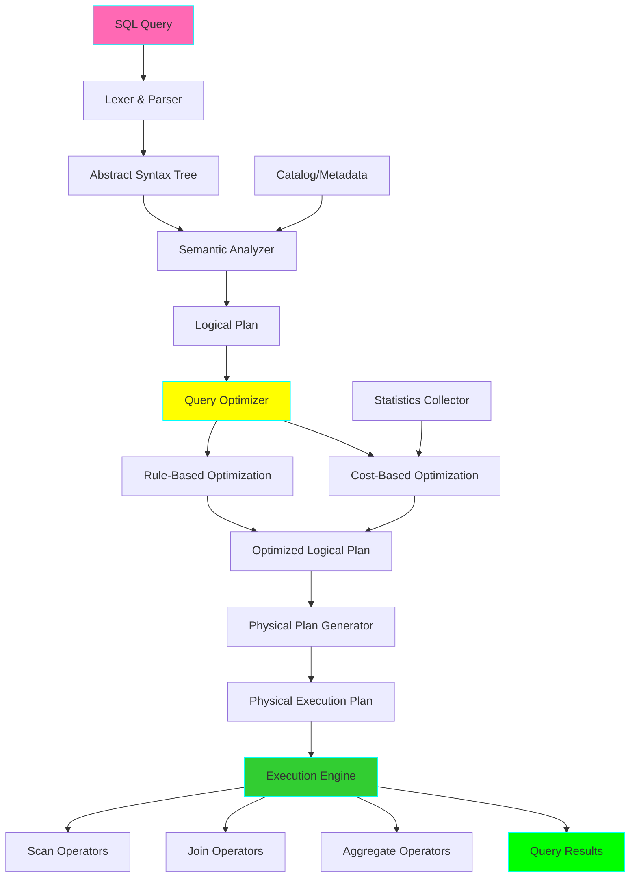
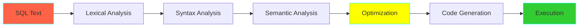

# Project 25: Custom Query Engine

**Complexity:** ⭐⭐⭐⭐⭐ | **Time:** 15-20 hours | **Tier:** Expert Level

## Overview

Build a custom SQL query engine from scratch that parses SQL queries, generates optimized execution plans, and executes them efficiently. This project provides deep insights into how database systems work internally, covering parsing, query planning, optimization, and execution.

## Learning Objectives

After completing this project, you will understand:

- ✅ SQL parsing and abstract syntax trees (AST)
- ✅ Logical and physical query plan generation
- ✅ Query optimization techniques (predicate pushdown, join ordering)
- ✅ Cost-based optimization with statistics
- ✅ Query execution models (volcano, vectorized)
- ✅ Index utilization and scan strategies
- ✅ Join algorithms (hash join, merge join, nested loop)
- ✅ Adaptive query execution

## Architecture



## Key Concepts

### Query Processing Pipeline



### Query Optimization Levels

| Level | Technique | Example |
|-------|-----------|---------|
| **Logical** | Predicate pushdown | Move WHERE before JOIN |
| **Logical** | Projection pruning | Only read needed columns |
| **Logical** | Subquery unnesting | Convert to join |
| **Physical** | Join algorithm | Hash join vs merge join |
| **Physical** | Index selection | Use index scan vs full scan |
| **Cost-based** | Join ordering | Smallest tables first |

### Join Algorithms

```python
# Hash Join: O(n + m)
# - Build hash table on smaller table
# - Probe with larger table

# Merge Join: O(n log n + m log m)
# - Sort both inputs
# - Merge sorted streams

# Nested Loop Join: O(n * m)
# - For each row in outer, scan inner
# - Use when one table is small
```

## Implementation Guide

### Step 1: SQL Parser

```python
from typing import List, Dict, Any, Optional, Union
from dataclasses import dataclass
from enum import Enum
import sqlparse
from sqlparse.sql import IdentifierList, Identifier, Where, Token
from sqlparse.tokens import Keyword, DML

class NodeType(Enum):
    """AST node types."""
    SELECT = "select"
    FROM = "from"
    WHERE = "where"
    JOIN = "join"
    GROUP_BY = "group_by"
    ORDER_BY = "order_by"
    LIMIT = "limit"

@dataclass
class ASTNode:
    """Abstract Syntax Tree node."""
    node_type: NodeType
    value: Any
    children: List['ASTNode'] = None

    def __post_init__(self):
        if self.children is None:
            self.children = []

class SQLParser:
    """
    Parse SQL queries into Abstract Syntax Trees.

    Uses sqlparse for tokenization and builds custom AST.
    """

    def __init__(self):
        self.logger = logging.getLogger(__name__)

    def parse(self, sql: str) -> ASTNode:
        """
        Parse SQL query into AST.

        Example:
            SELECT name, age FROM users WHERE age > 18

        AST:
            SELECT
            ├── COLUMNS: [name, age]
            ├── FROM: users
            └── WHERE: age > 18
        """
        # Parse with sqlparse
        parsed = sqlparse.parse(sql)[0]

        # Build AST
        root = self._build_ast(parsed)

        return root

    def _build_ast(self, parsed_statement) -> ASTNode:
        """Build AST from parsed SQL."""
        # Get statement type (SELECT, INSERT, etc.)
        stmt_type = self._get_statement_type(parsed_statement)

        if stmt_type == 'SELECT':
            return self._parse_select(parsed_statement)
        else:
            raise NotImplementedError(f"Statement type {stmt_type} not supported")

    def _parse_select(self, statement) -> ASTNode:
        """Parse SELECT statement."""
        select_node = ASTNode(NodeType.SELECT, "SELECT")

        # Extract components
        columns = self._extract_columns(statement)
        from_clause = self._extract_from(statement)
        where_clause = self._extract_where(statement)
        group_by = self._extract_group_by(statement)
        order_by = self._extract_order_by(statement)
        limit = self._extract_limit(statement)

        # Build tree
        if columns:
            select_node.children.append(
                ASTNode(NodeType.SELECT, columns)
            )

        if from_clause:
            select_node.children.append(from_clause)

        if where_clause:
            select_node.children.append(where_clause)

        if group_by:
            select_node.children.append(group_by)

        if order_by:
            select_node.children.append(order_by)

        if limit:
            select_node.children.append(limit)

        return select_node

    def _get_statement_type(self, statement) -> str:
        """Determine statement type (SELECT, INSERT, etc.)."""
        for token in statement.tokens:
            if token.ttype is DML:
                return token.value.upper()
        return None

    def _extract_columns(self, statement) -> List[str]:
        """Extract SELECT columns."""
        columns = []
        select_seen = False

        for token in statement.tokens:
            if select_seen:
                if isinstance(token, IdentifierList):
                    for identifier in token.get_identifiers():
                        columns.append(str(identifier))
                elif isinstance(token, Identifier):
                    columns.append(str(token))
                elif token.ttype is Keyword:
                    break

            if token.ttype is DML and token.value.upper() == 'SELECT':
                select_seen = True

        return columns

    def _extract_from(self, statement) -> Optional[ASTNode]:
        """Extract FROM clause."""
        from_seen = False

        for token in statement.tokens:
            if from_seen and isinstance(token, Identifier):
                return ASTNode(NodeType.FROM, str(token))

            if token.ttype is Keyword and token.value.upper() == 'FROM':
                from_seen = True

        return None

    def _extract_where(self, statement) -> Optional[ASTNode]:
        """Extract WHERE clause."""
        for token in statement.tokens:
            if isinstance(token, Where):
                # Remove "WHERE" keyword and get condition
                condition = str(token)[6:].strip()  # Skip "WHERE "
                return ASTNode(NodeType.WHERE, condition)

        return None

    def _extract_group_by(self, statement) -> Optional[ASTNode]:
        """Extract GROUP BY clause."""
        # Implementation similar to WHERE
        pass

    def _extract_order_by(self, statement) -> Optional[ASTNode]:
        """Extract ORDER BY clause."""
        # Implementation similar to WHERE
        pass

    def _extract_limit(self, statement) -> Optional[ASTNode]:
        """Extract LIMIT clause."""
        # Implementation similar to WHERE
        pass
```

### Step 2: Logical Plan Generator

```python
from typing import List, Optional
from dataclasses import dataclass, field
from enum import Enum

class LogicalOperator(Enum):
    """Logical plan operators."""
    SCAN = "scan"
    FILTER = "filter"
    PROJECT = "project"
    JOIN = "join"
    AGGREGATE = "aggregate"
    SORT = "sort"
    LIMIT = "limit"

@dataclass
class LogicalPlan:
    """Logical query execution plan."""
    operator: LogicalOperator
    properties: Dict[str, Any] = field(default_factory=dict)
    children: List['LogicalPlan'] = field(default_factory=list)

    def __str__(self, level=0):
        """Pretty print the plan."""
        indent = "  " * level
        result = f"{indent}{self.operator.value}: {self.properties}\n"
        for child in self.children:
            result += child.__str__(level + 1)
        return result

class LogicalPlanner:
    """Generate logical execution plan from AST."""

    def __init__(self, catalog: 'Catalog'):
        self.catalog = catalog

    def create_plan(self, ast: ASTNode) -> LogicalPlan:
        """
        Convert AST to logical plan.

        Example AST:
            SELECT name, age FROM users WHERE age > 18

        Logical Plan:
            PROJECT(name, age)
            └── FILTER(age > 18)
                └── SCAN(users)
        """
        if ast.node_type == NodeType.SELECT:
            return self._plan_select(ast)
        else:
            raise NotImplementedError(f"Node type {ast.node_type} not supported")

    def _plan_select(self, ast: ASTNode) -> LogicalPlan:
        """Plan SELECT statement."""
        # Start with SCAN
        from_node = self._find_child(ast, NodeType.FROM)
        if not from_node:
            raise ValueError("SELECT requires FROM clause")

        plan = LogicalPlan(
            operator=LogicalOperator.SCAN,
            properties={'table': from_node.value}
        )

        # Add FILTER if WHERE exists
        where_node = self._find_child(ast, NodeType.WHERE)
        if where_node:
            plan = LogicalPlan(
                operator=LogicalOperator.FILTER,
                properties={'condition': where_node.value},
                children=[plan]
            )

        # Add PROJECT for column selection
        select_node = self._find_child(ast, NodeType.SELECT)
        if select_node:
            plan = LogicalPlan(
                operator=LogicalOperator.PROJECT,
                properties={'columns': select_node.value},
                children=[plan]
            )

        # Add other operators (GROUP BY, ORDER BY, LIMIT)
        # ...

        return plan

    def _find_child(self, node: ASTNode, node_type: NodeType) -> Optional[ASTNode]:
        """Find child node of specific type."""
        for child in node.children:
            if child.node_type == node_type:
                return child
        return None
```

### Step 3: Query Optimizer

```python
from typing import List, Tuple
import logging

class QueryOptimizer:
    """
    Optimize logical plans using rule-based and cost-based techniques.
    """

    def __init__(self, statistics: 'StatisticsCollector'):
        self.statistics = statistics
        self.logger = logging.getLogger(__name__)

    def optimize(self, plan: LogicalPlan) -> LogicalPlan:
        """
        Apply optimization rules to logical plan.

        Order matters! Apply rules in sequence:
        1. Predicate pushdown
        2. Projection pruning
        3. Join ordering
        4. Common subexpression elimination
        """
        # Rule-based optimizations
        plan = self._predicate_pushdown(plan)
        plan = self._projection_pruning(plan)
        plan = self._constant_folding(plan)

        # Cost-based optimizations
        plan = self._optimize_joins(plan)

        return plan

    def _predicate_pushdown(self, plan: LogicalPlan) -> LogicalPlan:
        """
        Push filters as close to data source as possible.

        Before:
            PROJECT
            └── JOIN
                ├── SCAN(users)
                └── FILTER(age > 18)
                    └── SCAN(orders)

        After:
            PROJECT
            └── JOIN
                ├── SCAN(users)
                └── SCAN(orders)
                    └── FILTER(age > 18)  # Pushed down

        This reduces data processed by expensive operations like JOINs.
        """
        if plan.operator == LogicalOperator.FILTER:
            # Try to push filter down
            if len(plan.children) > 0:
                child = plan.children[0]

                # Push through PROJECT
                if child.operator == LogicalOperator.PROJECT:
                    # Move filter below project
                    filter_plan = LogicalPlan(
                        operator=LogicalOperator.FILTER,
                        properties=plan.properties,
                        children=[child.children[0]]
                    )
                    child.children[0] = filter_plan
                    return child

                # Push into JOIN (if condition only references one side)
                elif child.operator == LogicalOperator.JOIN:
                    # Analyze which tables the filter references
                    # If only left table: push to left child
                    # If only right table: push to right child
                    # If both: keep above join
                    pass

        # Recursively optimize children
        plan.children = [self._predicate_pushdown(child) for child in plan.children]
        return plan

    def _projection_pruning(self, plan: LogicalPlan) -> LogicalPlan:
        """
        Only read columns that are actually used.

        If SELECT only needs 'name', don't read 'age', 'email', etc.
        """
        if plan.operator == LogicalOperator.PROJECT:
            needed_columns = set(plan.properties.get('columns', []))

            # Propagate needed columns to children
            for child in plan.children:
                self._propagate_needed_columns(child, needed_columns)

        plan.children = [self._projection_pruning(child) for child in plan.children]
        return plan

    def _propagate_needed_columns(self, plan: LogicalPlan, needed: set):
        """Mark which columns are needed at each level."""
        plan.properties['needed_columns'] = needed

        # Recursively propagate
        for child in plan.children:
            self._propagate_needed_columns(child, needed)

    def _optimize_joins(self, plan: LogicalPlan) -> LogicalPlan:
        """
        Optimize join order using cost-based approach.

        Generally, join smallest tables first to reduce intermediate results.
        """
        if plan.operator == LogicalOperator.JOIN:
            # Get cardinalities from statistics
            left_card = self._estimate_cardinality(plan.children[0])
            right_card = self._estimate_cardinality(plan.children[1])

            # Swap if right is smaller (optimization: smaller table should be first)
            if right_card < left_card:
                self.logger.info(f"Swapping join order: {right_card} < {left_card}")
                plan.children[0], plan.children[1] = plan.children[1], plan.children[0]

        plan.children = [self._optimize_joins(child) for child in plan.children]
        return plan

    def _estimate_cardinality(self, plan: LogicalPlan) -> int:
        """
        Estimate number of rows output by operator.

        Uses statistics and selectivity estimation.
        """
        if plan.operator == LogicalOperator.SCAN:
            table = plan.properties['table']
            return self.statistics.get_row_count(table)

        elif plan.operator == LogicalOperator.FILTER:
            # Estimate selectivity of filter
            child_card = self._estimate_cardinality(plan.children[0])
            selectivity = self._estimate_selectivity(plan.properties['condition'])
            return int(child_card * selectivity)

        elif plan.operator == LogicalOperator.JOIN:
            # Simplified: Assume 10% of cross product
            left_card = self._estimate_cardinality(plan.children[0])
            right_card = self._estimate_cardinality(plan.children[1])
            return int(left_card * right_card * 0.1)

        return 1000  # Default estimate

    def _estimate_selectivity(self, condition: str) -> float:
        """
        Estimate what fraction of rows pass filter.

        Simplified heuristics:
        - Equality: 10%
        - Range: 30%
        - Default: 50%
        """
        if '=' in condition and '!=' not in condition:
            return 0.1  # 10% of rows
        elif '>' in condition or '<' in condition:
            return 0.3  # 30% of rows
        else:
            return 0.5  # 50% of rows

    def _constant_folding(self, plan: LogicalPlan) -> LogicalPlan:
        """
        Evaluate constant expressions at compile time.

        WHERE 1 + 1 = 2  ->  WHERE TRUE
        """
        # Implementation: Parse condition, evaluate constants
        pass
```

### Step 4: Physical Plan Generator

```python
from enum import Enum

class PhysicalOperator(Enum):
    """Physical execution operators."""
    SEQ_SCAN = "sequential_scan"
    INDEX_SCAN = "index_scan"
    HASH_JOIN = "hash_join"
    MERGE_JOIN = "merge_join"
    NESTED_LOOP_JOIN = "nested_loop_join"
    HASH_AGGREGATE = "hash_aggregate"
    SORT = "sort"

@dataclass
class PhysicalPlan:
    """Physical execution plan with concrete operators."""
    operator: PhysicalOperator
    properties: Dict[str, Any] = field(default_factory=dict)
    children: List['PhysicalPlan'] = field(default_factory=list)
    estimated_cost: float = 0.0

class PhysicalPlanner:
    """Generate physical execution plan from logical plan."""

    def __init__(self, catalog: 'Catalog', statistics: 'StatisticsCollector'):
        self.catalog = catalog
        self.statistics = statistics

    def create_plan(self, logical_plan: LogicalPlan) -> PhysicalPlan:
        """
        Convert logical plan to physical plan.

        Chooses concrete algorithms for each operator.
        """
        if logical_plan.operator == LogicalOperator.SCAN:
            return self._plan_scan(logical_plan)

        elif logical_plan.operator == LogicalOperator.FILTER:
            child_plan = self.create_plan(logical_plan.children[0])
            # Filter is usually fused with scan
            child_plan.properties['filter'] = logical_plan.properties['condition']
            return child_plan

        elif logical_plan.operator == LogicalOperator.JOIN:
            return self._plan_join(logical_plan)

        elif logical_plan.operator == LogicalOperator.AGGREGATE:
            return self._plan_aggregate(logical_plan)

        else:
            raise NotImplementedError(f"Operator {logical_plan.operator} not supported")

    def _plan_scan(self, logical_plan: LogicalPlan) -> PhysicalPlan:
        """
        Choose scan method: sequential or index.

        Decision based on:
        - Availability of index
        - Selectivity of filter
        - Table size
        """
        table = logical_plan.properties['table']

        # Check for applicable index
        filter_condition = logical_plan.properties.get('filter')
        if filter_condition:
            index = self.catalog.find_index(table, filter_condition)
            if index:
                # Use index scan
                return PhysicalPlan(
                    operator=PhysicalOperator.INDEX_SCAN,
                    properties={
                        'table': table,
                        'index': index,
                        'filter': filter_condition
                    }
                )

        # Default to sequential scan
        return PhysicalPlan(
            operator=PhysicalOperator.SEQ_SCAN,
            properties={'table': table}
        )

    def _plan_join(self, logical_plan: LogicalPlan) -> PhysicalPlan:
        """
        Choose join algorithm based on input sizes and sort order.

        Hash Join: Best for large unsorted inputs
        Merge Join: Best for sorted inputs
        Nested Loop: Best when one input is small
        """
        left_plan = self.create_plan(logical_plan.children[0])
        right_plan = self.create_plan(logical_plan.children[1])

        left_size = self.statistics.estimate_plan_output(left_plan)
        right_size = self.statistics.estimate_plan_output(right_plan)

        # Choose algorithm
        if left_size < 1000 or right_size < 1000:
            # One input is small: use nested loop
            operator = PhysicalOperator.NESTED_LOOP_JOIN
        elif self._is_sorted(left_plan) and self._is_sorted(right_plan):
            # Both sorted: use merge join
            operator = PhysicalOperator.MERGE_JOIN
        else:
            # Default: hash join
            operator = PhysicalOperator.HASH_JOIN

        return PhysicalPlan(
            operator=operator,
            properties=logical_plan.properties,
            children=[left_plan, right_plan]
        )

    def _plan_aggregate(self, logical_plan: LogicalPlan) -> PhysicalPlan:
        """Plan aggregation using hash table."""
        child_plan = self.create_plan(logical_plan.children[0])

        return PhysicalPlan(
            operator=PhysicalOperator.HASH_AGGREGATE,
            properties=logical_plan.properties,
            children=[child_plan]
        )

    def _is_sorted(self, plan: PhysicalPlan) -> bool:
        """Check if plan output is sorted."""
        return plan.operator == PhysicalOperator.SORT
```

### Step 5: Execution Engine

```python
import pandas as pd
from typing import Iterator, Any
from abc import ABC, abstractmethod

class Operator(ABC):
    """Base class for physical operators."""

    @abstractmethod
    def execute(self) -> Iterator[Any]:
        """Execute operator and yield rows."""
        pass

class SequentialScan(Operator):
    """Sequential scan of table."""

    def __init__(self, table_path: str, filter_condition: str = None):
        self.table_path = table_path
        self.filter_condition = filter_condition

    def execute(self) -> Iterator[pd.Series]:
        """Scan table and yield rows."""
        # Read table (Parquet, CSV, etc.)
        df = pd.read_parquet(self.table_path)

        # Apply filter if exists
        if self.filter_condition:
            df = df.query(self.filter_condition)

        # Yield rows
        for _, row in df.iterrows():
            yield row

class HashJoin(Operator):
    """Hash join implementation."""

    def __init__(
        self,
        left: Operator,
        right: Operator,
        join_key: str
    ):
        self.left = left
        self.right = right
        self.join_key = join_key

    def execute(self) -> Iterator[Any]:
        """
        Execute hash join.

        Phase 1: Build hash table on left (smaller) input
        Phase 2: Probe with right input
        """
        # Build phase
        hash_table = {}
        for row in self.left.execute():
            key = row[self.join_key]
            if key not in hash_table:
                hash_table[key] = []
            hash_table[key].append(row)

        # Probe phase
        for right_row in self.right.execute():
            key = right_row[self.join_key]
            if key in hash_table:
                for left_row in hash_table[key]:
                    # Merge rows
                    merged = {**left_row.to_dict(), **right_row.to_dict()}
                    yield pd.Series(merged)

class HashAggregate(Operator):
    """Hash-based aggregation."""

    def __init__(
        self,
        input: Operator,
        group_by: List[str],
        aggregates: Dict[str, str]  # column -> function (sum, count, avg)
    ):
        self.input = input
        self.group_by = group_by
        self.aggregates = aggregates

    def execute(self) -> Iterator[Any]:
        """
        Execute aggregation using hash table.

        GROUP BY creates hash table keyed by group columns.
        """
        hash_table = {}

        # Build aggregation hash table
        for row in self.input.execute():
            # Compute group key
            key = tuple(row[col] for col in self.group_by)

            if key not in hash_table:
                hash_table[key] = self._init_aggregates()

            # Update aggregates
            self._update_aggregates(hash_table[key], row)

        # Yield results
        for key, agg_values in hash_table.items():
            result = dict(zip(self.group_by, key))
            result.update(agg_values)
            yield pd.Series(result)

    def _init_aggregates(self) -> Dict[str, Any]:
        """Initialize aggregate values."""
        return {col: 0 for col in self.aggregates}

    def _update_aggregates(self, agg_state: Dict, row: pd.Series):
        """Update aggregate state with new row."""
        for col, func in self.aggregates.items():
            if func == 'sum':
                agg_state[col] += row[col]
            elif func == 'count':
                agg_state[col] += 1
            elif func == 'max':
                agg_state[col] = max(agg_state[col], row[col])
            # etc.

class QueryExecutor:
    """Execute physical plans."""

    def __init__(self, catalog: 'Catalog'):
        self.catalog = catalog

    def execute(self, physical_plan: PhysicalPlan) -> pd.DataFrame:
        """
        Execute physical plan and return results.
        """
        # Build operator tree
        operator = self._build_operator(physical_plan)

        # Execute and collect results
        results = list(operator.execute())

        # Convert to DataFrame
        return pd.DataFrame(results)

    def _build_operator(self, plan: PhysicalPlan) -> Operator:
        """Convert physical plan to executable operator."""
        if plan.operator == PhysicalOperator.SEQ_SCAN:
            table = plan.properties['table']
            table_path = self.catalog.get_table_path(table)
            return SequentialScan(
                table_path=table_path,
                filter_condition=plan.properties.get('filter')
            )

        elif plan.operator == PhysicalOperator.HASH_JOIN:
            left = self._build_operator(plan.children[0])
            right = self._build_operator(plan.children[1])
            return HashJoin(left, right, plan.properties['join_key'])

        elif plan.operator == PhysicalOperator.HASH_AGGREGATE:
            input_op = self._build_operator(plan.children[0])
            return HashAggregate(
                input=input_op,
                group_by=plan.properties['group_by'],
                aggregates=plan.properties['aggregates']
            )

        else:
            raise NotImplementedError(f"Operator {plan.operator} not implemented")
```

### Step 6: Statistics Collection

```python
class StatisticsCollector:
    """Collect and maintain table statistics for query optimization."""

    def __init__(self):
        self.table_stats = {}

    def collect_stats(self, table_name: str, table_path: str):
        """
        Collect statistics for a table.

        Statistics collected:
        - Row count
        - Column cardinalities
        - Min/max values
        - Null counts
        - Histograms
        """
        df = pd.read_parquet(table_path)

        stats = {
            'row_count': len(df),
            'columns': {}
        }

        for col in df.columns:
            stats['columns'][col] = {
                'cardinality': df[col].nunique(),
                'null_count': df[col].isnull().sum(),
                'min': df[col].min(),
                'max': df[col].max(),
                'avg': df[col].mean() if pd.api.types.is_numeric_dtype(df[col]) else None
            }

        self.table_stats[table_name] = stats

    def get_row_count(self, table: str) -> int:
        """Get row count for table."""
        return self.table_stats.get(table, {}).get('row_count', 0)

    def get_cardinality(self, table: str, column: str) -> int:
        """Get distinct value count for column."""
        return self.table_stats.get(table, {}) \
            .get('columns', {}) \
            .get(column, {}) \
            .get('cardinality', 0)
```

## Nuanced Scenarios

### 1. Adaptive Query Execution

**Challenge:** Adjust execution strategy based on runtime statistics.

```python
class AdaptiveExecutor:
    """Adjust execution plan based on runtime statistics."""

    def execute_adaptive(self, plan: PhysicalPlan) -> pd.DataFrame:
        """
        Execute with runtime adaptation.

        Example: Switch from hash join to nested loop if build side is small.
        """
        pass
```

### 2. Parallel Execution

**Challenge:** Execute query operators in parallel.

```python
class ParallelExecutor:
    """Execute operators in parallel using multiple threads."""

    def execute_parallel(self, plan: PhysicalPlan, num_workers: int = 4):
        """Partition data and execute in parallel."""
        pass
```

### 3. Vectorized Execution

**Challenge:** Process data in batches instead of row-at-a-time.

```python
class VectorizedOperator:
    """Process data in columnar batches."""

    def execute_vectorized(self) -> Iterator[pd.DataFrame]:
        """Yield batches of rows instead of single rows."""
        pass
```

## Exercises

### Exercise 1: Basic Query Engine
Implement basic functionality:
- Parse SELECT with WHERE
- Generate logical plan
- Execute with sequential scan
- Return results

### Exercise 2: Query Optimization
Add optimization:
- Predicate pushdown
- Projection pruning
- Join ordering
- Benchmark improvements

### Exercise 3: Join Implementation
Implement join algorithms:
- Hash join
- Merge join
- Nested loop join
- Compare performance

### Exercise 4: Cost-Based Optimization
Build cost model:
- Collect statistics
- Estimate cardinalities
- Choose optimal plans
- Validate with benchmarks

## Success Criteria

- [ ] Parse SQL queries into AST
- [ ] Generate logical execution plans
- [ ] Implement rule-based optimization
- [ ] Generate physical execution plans
- [ ] Implement 3+ join algorithms
- [ ] Build cost-based optimizer
- [ ] Collect and use table statistics
- [ ] Execute queries correctly
- [ ] Demonstrate 10x+ speedup from optimization
- [ ] Handle queries on 1M+ row tables

## Testing Checklist

```python
# tests/test_query_engine.py

def test_sql_parsing():
    """Test SQL to AST conversion."""
    pass

def test_logical_plan_generation():
    """Test AST to logical plan."""
    pass

def test_predicate_pushdown():
    """Test filter pushdown optimization."""
    pass

def test_join_ordering():
    """Test join optimization."""
    pass

def test_hash_join():
    """Test hash join correctness."""
    pass

def test_sequential_scan():
    """Test table scanning."""
    pass

def test_aggregation():
    """Test GROUP BY execution."""
    pass

def test_cost_estimation():
    """Test cardinality estimation."""
    pass

def test_end_to_end():
    """Test complete query execution."""
    pass
```

## Common Pitfalls

1. **Incorrect Optimization:** Breaking query semantics
2. **Poor Cost Estimation:** Leads to bad plans
3. **Memory Leaks:** Not cleaning up operators
4. **Missing Statistics:** Optimizer makes poor choices
5. **Wrong Join Algorithm:** Performance degradation
6. **No Null Handling:** Incorrect results
7. **Infinite Loops:** In recursive optimization

## Next Steps

After completing this project:
1. Study production query engines (PostgreSQL, DuckDB)
2. Explore **Project 08: Column-Store Query Optimizer**
3. Learn about vectorized execution (Apache Arrow)

## References

- [Architecture of a Database System](http://db.cs.berkeley.edu/papers/fntdb07-architecture.pdf)
- [PostgreSQL Query Planner](https://www.postgresql.org/docs/current/planner-optimizer.html)
- [DuckDB: An Embeddable Analytical Database](https://duckdb.org/docs/internals/overview)
- [Volcano Optimizer Generator](https://paperhub.s3.amazonaws.com/dace52a42c07f7f8348b08dc2b186061.pdf)
- [Cost-Based Query Optimization](https://web.stanford.edu/class/cs245/readings/cost-optimization.pdf)
- [Join Algorithms](https://en.wikipedia.org/wiki/Join_(SQL)#Join_algorithms)

---

**Happy Learning! 🚀**
