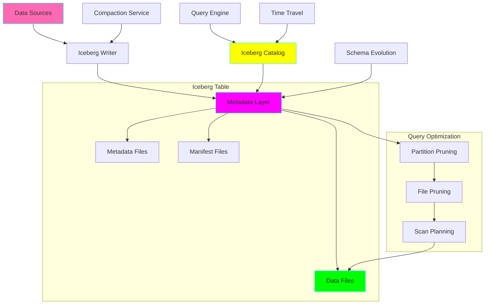
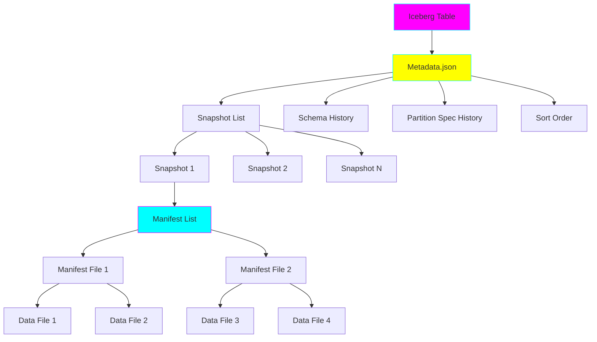
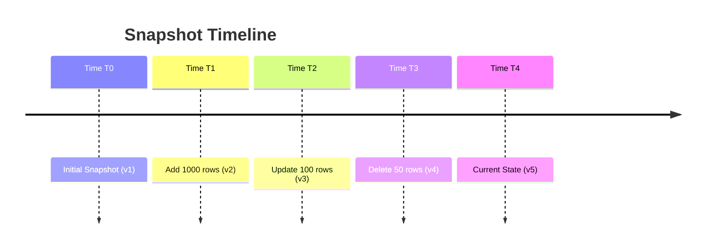

# Project 26: Lakehouse with Apache Iceberg

**Complexity:** ⭐⭐⭐⭐⭐ | **Time:** 12-15 hours | **Tier:** Expert Level

## Overview

Build a production-grade lakehouse architecture using Apache Iceberg table format. This project implements advanced features including hidden partitioning, schema evolution, time-travel queries, and ACID transactions on data lakes. You'll learn how Iceberg revolutionizes data lake architectures by bringing warehouse-like capabilities to object storage.

## Learning Objectives

After completing this project, you will understand:

- ✅ Apache Iceberg table format architecture and metadata management
- ✅ Hidden partitioning for automatic partition management
- ✅ Time-travel queries and snapshot isolation
- ✅ Schema evolution without table rewrites
- ✅ Concurrent writer coordination and optimistic concurrency
- ✅ Metadata compaction and maintenance operations
- ✅ Partition spec evolution and layout optimization
- ✅ File compaction strategies for read performance

## Architecture



## Key Concepts

### Iceberg Table Format Architecture



**Metadata Hierarchy:**
1. **Metadata.json** - Pointer to current snapshot and schema
2. **Snapshot** - Immutable state of table at point in time
3. **Manifest List** - List of manifest files for snapshot
4. **Manifest File** - Metadata about data files (statistics, partitions)
5. **Data Files** - Actual Parquet/ORC/Avro files

### Hidden Partitioning

Traditional partitioning requires users to know partition columns:
```sql
-- Traditional Hive partitioning
SELECT * FROM sales WHERE date_partition = '2024-01-01'
```

Iceberg hidden partitioning handles it automatically:
```sql
-- Iceberg hidden partitioning
SELECT * FROM sales WHERE order_date = '2024-01-01'
-- Iceberg automatically prunes to correct partitions
```

**Partition Transforms:**
- `year(timestamp)` - Partition by year
- `month(timestamp)` - Partition by month
- `day(timestamp)` - Partition by day
- `hour(timestamp)` - Partition by hour
- `bucket(N, column)` - Hash bucket partitioning
- `truncate(L, column)` - Truncate strings/numbers

### Time-Travel and Snapshot Isolation



Query any historical version:
```python
# Query as of specific snapshot
df = spark.read.option("snapshot-id", 1234567890).table("my_table")

# Query as of specific timestamp
df = spark.read.option("as-of-timestamp", "2024-01-01 00:00:00").table("my_table")
```

### Schema Evolution

| Operation | Traditional | Iceberg |
|-----------|------------|---------|
| Add column | Rewrite all data | Metadata-only |
| Drop column | Rewrite all data | Metadata-only |
| Rename column | Manual migration | Metadata-only |
| Reorder columns | N/A | Metadata-only |
| Type promotion | Rewrite all data | Metadata-only (safe types) |

## Implementation Guide

### Step 1: Iceberg Table Creation and Catalog Setup

```python
from pyiceberg.catalog import load_catalog
from pyiceberg.schema import Schema
from pyiceberg.types import (
    NestedField, StringType, IntegerType,
    TimestampType, DoubleType, LongType
)
from pyiceberg.partitioning import PartitionSpec, PartitionField
from pyiceberg.transforms import DayTransform, BucketTransform
from typing import Dict, List, Optional
import logging

class IcebergTableManager:
    """Manage Iceberg table lifecycle and operations."""

    def __init__(self, catalog_config: Dict[str, str]):
        """
        Initialize Iceberg catalog.

        Args:
            catalog_config: Configuration for catalog
                {
                    "type": "rest|glue|hive",
                    "uri": "catalog_uri",
                    "warehouse": "s3://bucket/warehouse"
                }
        """
        self.catalog = load_catalog("my_catalog", **catalog_config)
        self.logger = logging.getLogger(__name__)

    def create_table(
        self,
        database: str,
        table_name: str,
        schema: Schema,
        partition_spec: Optional[PartitionSpec] = None,
        properties: Optional[Dict[str, str]] = None
    ):
        """
        Create Iceberg table with schema and partitioning.

        Args:
            database: Database/namespace name
            table_name: Table name
            schema: Iceberg schema definition
            partition_spec: Partition specification
            properties: Table properties
        """
        identifier = f"{database}.{table_name}"

        # Default partition spec if none provided
        if partition_spec is None:
            partition_spec = PartitionSpec()

        # Default properties
        default_props = {
            "write.format.default": "parquet",
            "write.parquet.compression-codec": "zstd",
            "commit.retry.num-retries": "3",
            "commit.retry.wait-ms": "100"
        }
        if properties:
            default_props.update(properties)

        try:
            table = self.catalog.create_table(
                identifier=identifier,
                schema=schema,
                partition_spec=partition_spec,
                properties=default_props
            )
            self.logger.info(f"Created table {identifier}")
            return table
        except Exception as e:
            self.logger.error(f"Failed to create table: {e}")
            raise

# Example: Create sales table with hidden partitioning
def create_sales_table():
    """Create sales table with time-based partitioning."""

    # Define schema
    schema = Schema(
        NestedField(1, "order_id", LongType(), required=True),
        NestedField(2, "customer_id", LongType(), required=True),
        NestedField(3, "product_id", StringType(), required=True),
        NestedField(4, "quantity", IntegerType(), required=True),
        NestedField(5, "amount", DoubleType(), required=True),
        NestedField(6, "order_timestamp", TimestampType(), required=True),
        NestedField(7, "region", StringType(), required=True),
    )

    # Define hidden partition spec
    partition_spec = PartitionSpec(
        PartitionField(
            source_id=6,  # order_timestamp
            field_id=1000,
            transform=DayTransform(),
            name="order_date"
        ),
        PartitionField(
            source_id=7,  # region
            field_id=1001,
            transform=BucketTransform(num_buckets=16),
            name="region_bucket"
        )
    )

    catalog_config = {
        "type": "rest",
        "uri": "http://localhost:8181",
        "warehouse": "s3://lakehouse/warehouse"
    }

    manager = IcebergTableManager(catalog_config)
    table = manager.create_table(
        database="sales_db",
        table_name="orders",
        schema=schema,
        partition_spec=partition_spec,
        properties={
            "write.metadata.compression-codec": "gzip",
            "write.target-file-size-bytes": "134217728"  # 128 MB
        }
    )

    return table
```

### Step 2: Writing Data with ACID Transactions

```python
from pyiceberg.table import Table
import pyarrow as pa
import pandas as pd
from datetime import datetime
from typing import List

class IcebergWriter:
    """Write data to Iceberg tables with ACID guarantees."""

    def __init__(self, table: Table):
        self.table = table
        self.logger = logging.getLogger(__name__)

    def append_data(self, data: pa.Table):
        """
        Append data to table with automatic partitioning.

        Args:
            data: PyArrow table to append
        """
        try:
            # Append with automatic commit
            self.table.append(data)
            self.logger.info(f"Appended {len(data)} rows")
        except Exception as e:
            self.logger.error(f"Failed to append data: {e}")
            raise

    def overwrite_partition(
        self,
        data: pa.Table,
        partition_filter: str
    ):
        """
        Overwrite specific partition atomically.

        Args:
            data: New data for partition
            partition_filter: Partition filter expression
                e.g., "order_date = '2024-01-01'"
        """
        try:
            self.table.overwrite(data, overwrite_filter=partition_filter)
            self.logger.info(f"Overwrote partition: {partition_filter}")
        except Exception as e:
            self.logger.error(f"Failed to overwrite: {e}")
            raise

    def upsert_data(
        self,
        data: pa.Table,
        merge_keys: List[str]
    ):
        """
        Upsert (merge) data based on keys.

        Args:
            data: Data to merge
            merge_keys: Columns to match for updates
        """
        # Read existing data
        existing_df = self.table.scan().to_arrow()
        existing_pdf = existing_df.to_pandas()

        # Convert new data to pandas
        new_pdf = data.to_pandas()

        # Perform merge
        merged_pdf = pd.concat([existing_pdf, new_pdf])
        merged_pdf = merged_pdf.drop_duplicates(
            subset=merge_keys,
            keep='last'  # Keep latest version
        )

        # Convert back and overwrite
        merged_table = pa.Table.from_pandas(merged_pdf)

        # Atomic replace
        self.table.overwrite(merged_table)
        self.logger.info(f"Upserted {len(data)} rows")

# Example: Write sales data
def write_sales_data():
    """Write sample sales data to Iceberg table."""

    # Load table
    catalog_config = {
        "type": "rest",
        "uri": "http://localhost:8181"
    }
    catalog = load_catalog("my_catalog", **catalog_config)
    table = catalog.load_table("sales_db.orders")

    # Create writer
    writer = IcebergWriter(table)

    # Generate sample data
    data = pa.table({
        'order_id': pa.array([1, 2, 3, 4, 5]),
        'customer_id': pa.array([101, 102, 103, 104, 105]),
        'product_id': pa.array(['P1', 'P2', 'P3', 'P1', 'P2']),
        'quantity': pa.array([2, 1, 3, 1, 2]),
        'amount': pa.array([29.99, 49.99, 15.99, 29.99, 49.99]),
        'order_timestamp': pa.array([
            datetime(2024, 1, 1, 10, 0, 0),
            datetime(2024, 1, 1, 11, 30, 0),
            datetime(2024, 1, 2, 14, 15, 0),
            datetime(2024, 1, 2, 16, 45, 0),
            datetime(2024, 1, 3, 9, 20, 0),
        ]),
        'region': pa.array(['US-EAST', 'US-WEST', 'EU', 'US-EAST', 'APAC'])
    })

    # Append data
    writer.append_data(data)
```

### Step 3: Schema Evolution

```python
from pyiceberg.schema import Schema
from pyiceberg.types import NestedField, StringType, BooleanType

class SchemaEvolver:
    """Handle schema evolution operations."""

    def __init__(self, table: Table):
        self.table = table
        self.logger = logging.getLogger(__name__)

    def add_column(
        self,
        name: str,
        field_type: type,
        doc: Optional[str] = None
    ):
        """
        Add new column to table (metadata-only operation).

        Args:
            name: Column name
            field_type: Iceberg type
            doc: Column documentation
        """
        try:
            with self.table.update_schema() as update:
                update.add_column(name, field_type, doc=doc)
            self.logger.info(f"Added column: {name}")
        except Exception as e:
            self.logger.error(f"Failed to add column: {e}")
            raise

    def rename_column(self, old_name: str, new_name: str):
        """Rename column (metadata-only operation)."""
        try:
            with self.table.update_schema() as update:
                update.rename_column(old_name, new_name)
            self.logger.info(f"Renamed column: {old_name} -> {new_name}")
        except Exception as e:
            self.logger.error(f"Failed to rename column: {e}")
            raise

    def drop_column(self, name: str):
        """Drop column (metadata-only operation)."""
        try:
            with self.table.update_schema() as update:
                update.delete_column(name)
            self.logger.info(f"Dropped column: {name}")
        except Exception as e:
            self.logger.error(f"Failed to drop column: {e}")
            raise

    def make_column_optional(self, name: str):
        """Make required column optional."""
        try:
            with self.table.update_schema() as update:
                update.make_column_optional(name)
            self.logger.info(f"Made column optional: {name}")
        except Exception as e:
            self.logger.error(f"Failed to update column: {e}")
            raise

# Example: Evolve schema
def evolve_sales_schema():
    """Add columns to sales table without rewriting data."""

    catalog = load_catalog("my_catalog", type="rest", uri="http://localhost:8181")
    table = catalog.load_table("sales_db.orders")

    evolver = SchemaEvolver(table)

    # Add new columns
    evolver.add_column("is_paid", BooleanType(), doc="Payment status")
    evolver.add_column("payment_method", StringType(), doc="Payment method")
    evolver.add_column("discount_code", StringType(), doc="Applied discount code")

    # Rename column
    evolver.rename_column("amount", "total_amount")
```

### Step 4: Time-Travel Queries

```python
from datetime import datetime, timedelta
from typing import Optional

class TimeTravelQuery:
    """Execute time-travel queries on Iceberg tables."""

    def __init__(self, table: Table):
        self.table = table
        self.logger = logging.getLogger(__name__)

    def query_as_of_timestamp(self, timestamp: datetime) -> pa.Table:
        """
        Query table state at specific timestamp.

        Args:
            timestamp: Point in time to query

        Returns:
            PyArrow table at specified time
        """
        try:
            snapshot = self.table.snapshot_as_of_timestamp(
                timestamp.timestamp() * 1000  # Convert to milliseconds
            )

            scan = self.table.scan(snapshot_id=snapshot.snapshot_id)
            result = scan.to_arrow()

            self.logger.info(
                f"Queried snapshot {snapshot.snapshot_id} "
                f"at {timestamp}"
            )
            return result
        except Exception as e:
            self.logger.error(f"Time-travel query failed: {e}")
            raise

    def query_as_of_snapshot(self, snapshot_id: int) -> pa.Table:
        """
        Query specific snapshot by ID.

        Args:
            snapshot_id: Snapshot identifier

        Returns:
            PyArrow table at snapshot
        """
        try:
            scan = self.table.scan(snapshot_id=snapshot_id)
            result = scan.to_arrow()

            self.logger.info(f"Queried snapshot {snapshot_id}")
            return result
        except Exception as e:
            self.logger.error(f"Snapshot query failed: {e}")
            raise

    def get_snapshot_history(self) -> List[Dict]:
        """Get complete snapshot history."""
        snapshots = []

        for snapshot in self.table.snapshots():
            snapshots.append({
                'snapshot_id': snapshot.snapshot_id,
                'timestamp': datetime.fromtimestamp(snapshot.timestamp_ms / 1000),
                'operation': snapshot.summary.get('operation', 'unknown'),
                'added_files': snapshot.summary.get('added-files-count', 0),
                'deleted_files': snapshot.summary.get('deleted-files-count', 0),
                'total_records': snapshot.summary.get('total-records', 0)
            })

        return snapshots

    def rollback_to_snapshot(self, snapshot_id: int):
        """
        Rollback table to previous snapshot.

        Args:
            snapshot_id: Target snapshot to rollback to
        """
        try:
            self.table.rollback_to_snapshot(snapshot_id)
            self.logger.info(f"Rolled back to snapshot {snapshot_id}")
        except Exception as e:
            self.logger.error(f"Rollback failed: {e}")
            raise

# Example: Time-travel operations
def time_travel_example():
    """Demonstrate time-travel capabilities."""

    catalog = load_catalog("my_catalog", type="rest", uri="http://localhost:8181")
    table = catalog.load_table("sales_db.orders")

    tt = TimeTravelQuery(table)

    # View snapshot history
    history = tt.get_snapshot_history()
    for snap in history:
        print(f"Snapshot {snap['snapshot_id']} at {snap['timestamp']}")
        print(f"  Operation: {snap['operation']}")
        print(f"  Records: {snap['total_records']}")

    # Query data from yesterday
    yesterday = datetime.now() - timedelta(days=1)
    historical_data = tt.query_as_of_timestamp(yesterday)
    print(f"Records yesterday: {len(historical_data)}")

    # Rollback if needed
    if len(history) > 1:
        previous_snapshot = history[-2]['snapshot_id']
        tt.rollback_to_snapshot(previous_snapshot)
```

### Step 5: Maintenance Operations

```python
from pyiceberg.table.maintenance import (
    expire_snapshots,
    rewrite_manifests,
    rewrite_data_files
)
from datetime import timedelta

class TableMaintenance:
    """Perform maintenance operations on Iceberg tables."""

    def __init__(self, table: Table):
        self.table = table
        self.logger = logging.getLogger(__name__)

    def expire_old_snapshots(self, retention_days: int = 7):
        """
        Remove old snapshots to reduce metadata size.

        Args:
            retention_days: Days to retain snapshots
        """
        try:
            cutoff_time = datetime.now() - timedelta(days=retention_days)
            cutoff_ms = int(cutoff_time.timestamp() * 1000)

            expire_snapshots(
                self.table,
                older_than=cutoff_ms,
                retain_last=10  # Always keep at least 10 snapshots
            )

            self.logger.info(
                f"Expired snapshots older than {retention_days} days"
            )
        except Exception as e:
            self.logger.error(f"Snapshot expiration failed: {e}")
            raise

    def compact_manifests(self):
        """
        Compact small manifest files into larger ones.
        Improves query planning performance.
        """
        try:
            rewrite_manifests(self.table)
            self.logger.info("Compacted manifest files")
        except Exception as e:
            self.logger.error(f"Manifest compaction failed: {e}")
            raise

    def compact_data_files(
        self,
        target_file_size_mb: int = 128,
        min_file_size_mb: int = 10
    ):
        """
        Compact small data files to improve read performance.

        Args:
            target_file_size_mb: Target size for compacted files
            min_file_size_mb: Minimum file size to trigger compaction
        """
        try:
            target_size = target_file_size_mb * 1024 * 1024
            min_size = min_file_size_mb * 1024 * 1024

            rewrite_data_files(
                self.table,
                target_file_size_bytes=target_size,
                min_file_size_bytes=min_size
            )

            self.logger.info("Compacted data files")
        except Exception as e:
            self.logger.error(f"Data compaction failed: {e}")
            raise

    def remove_orphan_files(self):
        """
        Remove data files not referenced by any snapshot.
        Frees up storage space.
        """
        try:
            from pyiceberg.table.maintenance import remove_orphan_files

            removed_files = remove_orphan_files(
                self.table,
                older_than=datetime.now() - timedelta(days=3)
            )

            self.logger.info(f"Removed {len(removed_files)} orphan files")
        except Exception as e:
            self.logger.error(f"Orphan file removal failed: {e}")
            raise

    def optimize_table(self):
        """Run full optimization: compaction + cleanup."""
        self.logger.info("Starting table optimization...")

        # 1. Compact data files
        self.compact_data_files()

        # 2. Compact manifests
        self.compact_manifests()

        # 3. Expire old snapshots
        self.expire_old_snapshots(retention_days=7)

        # 4. Remove orphan files
        self.remove_orphan_files()

        self.logger.info("Table optimization complete")

# Example: Schedule maintenance
def schedule_maintenance():
    """Run periodic maintenance on Iceberg table."""

    catalog = load_catalog("my_catalog", type="rest", uri="http://localhost:8181")
    table = catalog.load_table("sales_db.orders")

    maintenance = TableMaintenance(table)

    # Run full optimization
    maintenance.optimize_table()
```

### Step 6: Partition Evolution

```python
from pyiceberg.partitioning import PartitionSpec
from pyiceberg.transforms import YearTransform, MonthTransform

class PartitionEvolution:
    """Evolve partition specifications without rewriting data."""

    def __init__(self, table: Table):
        self.table = table
        self.logger = logging.getLogger(__name__)

    def update_partition_spec(self, new_spec: PartitionSpec):
        """
        Update partition specification.
        Iceberg supports multiple partition specs over time.

        Args:
            new_spec: New partition specification
        """
        try:
            with self.table.update_spec() as update:
                # Remove old partition fields
                for field in self.table.spec().fields:
                    update.remove_field(field.name)

                # Add new partition fields
                for field in new_spec.fields:
                    update.add_field(
                        field.source_column_name,
                        field.transform,
                        field.name
                    )

            self.logger.info("Updated partition specification")
        except Exception as e:
            self.logger.error(f"Partition spec update failed: {e}")
            raise

# Example: Evolve partitions from daily to monthly
def evolve_partitioning():
    """Change from daily to monthly partitioning."""

    catalog = load_catalog("my_catalog", type="rest", uri="http://localhost:8181")
    table = catalog.load_table("sales_db.orders")

    # Create new monthly partition spec
    new_spec = PartitionSpec(
        PartitionField(
            source_id=6,  # order_timestamp
            field_id=2000,
            transform=MonthTransform(),
            name="order_month"
        )
    )

    evolver = PartitionEvolution(table)
    evolver.update_partition_spec(new_spec)
```

## Nuanced Scenarios

### 1. Concurrent Writer Coordination

**Challenge:** Multiple writers updating the same table simultaneously.

**Solution:** Optimistic concurrency with retry logic.

```python
import time
import random

class ConcurrentWriter:
    """Handle concurrent writes with optimistic concurrency."""

    def __init__(self, table: Table, max_retries: int = 5):
        self.table = table
        self.max_retries = max_retries
        self.logger = logging.getLogger(__name__)

    def write_with_retry(self, data: pa.Table):
        """
        Write data with exponential backoff on conflicts.

        Args:
            data: Data to write
        """
        retries = 0

        while retries < self.max_retries:
            try:
                # Attempt write
                self.table.append(data)
                self.logger.info("Write succeeded")
                return

            except Exception as e:
                if "CommitFailedException" in str(e):
                    retries += 1

                    if retries >= self.max_retries:
                        self.logger.error("Max retries exceeded")
                        raise

                    # Exponential backoff with jitter
                    wait_time = (2 ** retries) + random.uniform(0, 1)
                    self.logger.warning(
                        f"Commit conflict, retry {retries}/{self.max_retries} "
                        f"after {wait_time:.2f}s"
                    )
                    time.sleep(wait_time)
                else:
                    # Non-retryable error
                    raise
```

### 2. Metadata Compaction Strategy

**Challenge:** Metadata grows over time with many small commits.

**Solution:** Intelligent compaction based on thresholds.

```python
class MetadataCompactionStrategy:
    """Optimize metadata file size and count."""

    def __init__(self, table: Table):
        self.table = table
        self.logger = logging.getLogger(__name__)

    def analyze_metadata_health(self) -> Dict:
        """
        Analyze metadata file statistics.

        Returns:
            Health metrics
        """
        snapshots = list(self.table.snapshots())

        # Count manifest files
        manifest_count = sum(
            len(s.manifests()) for s in snapshots[-10:]  # Recent snapshots
        )

        # Average manifest size
        total_manifest_size = sum(
            sum(m.length for m in s.manifests())
            for s in snapshots[-10:]
        )
        avg_manifest_size = total_manifest_size / max(manifest_count, 1)

        health = {
            'total_snapshots': len(snapshots),
            'manifest_count': manifest_count,
            'avg_manifest_size_mb': avg_manifest_size / (1024 * 1024),
            'needs_compaction': manifest_count > 100 or avg_manifest_size < 1024 * 1024
        }

        return health

    def compact_if_needed(self):
        """Compact metadata if thresholds exceeded."""
        health = self.analyze_metadata_health()

        if health['needs_compaction']:
            self.logger.info("Metadata compaction needed")

            maintenance = TableMaintenance(self.table)
            maintenance.compact_manifests()
            maintenance.expire_old_snapshots(retention_days=3)

            self.logger.info("Metadata compacted")
        else:
            self.logger.info("Metadata health is good")
```

### 3. File Compaction with Z-Ordering

**Challenge:** Optimize file layout for common query patterns.

**Solution:** Combine compaction with Z-ordering.

```python
class ZOrderCompaction:
    """Compact files with Z-order clustering."""

    def __init__(self, table: Table):
        self.table = table
        self.logger = logging.getLogger(__name__)

    def compact_with_zorder(
        self,
        zorder_columns: List[str],
        partition_filter: Optional[str] = None
    ):
        """
        Compact files with Z-order clustering.

        Args:
            zorder_columns: Columns to Z-order by
            partition_filter: Specific partition to compact
        """
        from pyiceberg.table import UpdateProperties

        try:
            # Set Z-order columns
            with self.table.update_properties() as update:
                update.set(
                    "write.distribution-mode",
                    "range"
                )
                update.set(
                    "write.zorder.sort-columns",
                    ",".join(zorder_columns)
                )

            # Trigger compaction
            scan = self.table.scan()
            if partition_filter:
                scan = scan.filter(partition_filter)

            # Read and rewrite data with Z-ordering
            data = scan.to_arrow()

            # Sort by Z-order columns
            import pyarrow.compute as pc
            for col in reversed(zorder_columns):
                indices = pc.sort_indices(data[col])
                data = pc.take(data, indices)

            # Overwrite with sorted data
            if partition_filter:
                self.table.overwrite(data, overwrite_filter=partition_filter)
            else:
                self.table.overwrite(data)

            self.logger.info(
                f"Compacted with Z-order: {zorder_columns}"
            )

        except Exception as e:
            self.logger.error(f"Z-order compaction failed: {e}")
            raise
```

### 4. Multi-Version Schema Support

**Challenge:** Support queries across different schema versions.

**Solution:** Schema version tracking and compatibility checks.

```python
class SchemaVersionManager:
    """Manage multiple schema versions."""

    def __init__(self, table: Table):
        self.table = table
        self.logger = logging.getLogger(__name__)

    def get_schema_evolution_history(self) -> List[Dict]:
        """Track schema changes over time."""
        schemas = []

        for snapshot in self.table.snapshots():
            schema_id = snapshot.schema_id
            schema = self.table.schema()

            schemas.append({
                'snapshot_id': snapshot.snapshot_id,
                'schema_id': schema_id,
                'timestamp': datetime.fromtimestamp(snapshot.timestamp_ms / 1000),
                'columns': [f.name for f in schema.fields]
            })

        return schemas

    def verify_query_compatibility(
        self,
        required_columns: List[str],
        snapshot_id: Optional[int] = None
    ) -> bool:
        """
        Check if query is compatible with schema version.

        Args:
            required_columns: Columns needed by query
            snapshot_id: Specific snapshot to check

        Returns:
            True if compatible
        """
        if snapshot_id:
            # Get schema at specific snapshot
            snapshot = self.table.snapshot(snapshot_id)
            schema = self.table.schema()
        else:
            schema = self.table.schema()

        available_columns = {f.name for f in schema.fields}

        missing = set(required_columns) - available_columns

        if missing:
            self.logger.warning(f"Missing columns: {missing}")
            return False

        return True
```

## Exercises

### Exercise 1: Create Production Lakehouse
Build a complete lakehouse for e-commerce data:
- Tables: orders, products, customers, events
- Implement proper partitioning strategies
- Set up time-travel for auditing
- Configure automated maintenance

### Exercise 2: Schema Evolution Scenarios
Handle these schema changes:
1. Add new columns for promotions
2. Rename `customer_id` to `user_id`
3. Split `address` into separate fields
4. Make optional fields required (with backfill)

### Exercise 3: Concurrent Write Simulation
Simulate 10 concurrent writers:
- Track conflict rate
- Measure write throughput
- Optimize retry strategy
- Monitor metadata growth

### Exercise 4: Query Performance Optimization
Given query patterns:
- Time-range filters on timestamps
- Exact matches on customer_id
- Range scans on amount

Design optimal:
- Partition specification
- Z-order columns
- File sizing strategy

## Success Criteria

- [ ] Create Iceberg tables with hidden partitioning
- [ ] Implement schema evolution (add, rename, drop columns)
- [ ] Execute time-travel queries to historical snapshots
- [ ] Rollback table to previous state
- [ ] Handle concurrent writes with retry logic
- [ ] Perform maintenance operations (compaction, cleanup)
- [ ] Evolve partition specifications without rewrites
- [ ] Optimize query performance with statistics

## Testing Checklist

```python
# tests/test_iceberg_lakehouse.py

def test_table_creation():
    """Test Iceberg table creation with schema."""
    pass

def test_hidden_partitioning():
    """Test automatic partition management."""
    pass

def test_time_travel_query():
    """Test querying historical snapshots."""
    pass

def test_schema_evolution():
    """Test adding/renaming columns."""
    pass

def test_concurrent_writes():
    """Test multiple writers with conflicts."""
    pass

def test_snapshot_expiration():
    """Test metadata cleanup."""
    pass

def test_manifest_compaction():
    """Test manifest file optimization."""
    pass

def test_data_compaction():
    """Test small file compaction."""
    pass

def test_partition_evolution():
    """Test changing partition specs."""
    pass

def test_rollback():
    """Test rolling back to previous snapshot."""
    pass
```

## Common Pitfalls

1. **Too Many Small Files:** Leads to slow queries and high metadata overhead
   - Solution: Configure target file size, run regular compaction

2. **Metadata Bloat:** Accumulating snapshots and manifests
   - Solution: Regular snapshot expiration and manifest compaction

3. **Inefficient Partitioning:** Too many or too few partitions
   - Solution: Analyze query patterns, use hidden partitioning transforms

4. **Missing Statistics:** Poor query planning without table/file statistics
   - Solution: Ensure statistics collection is enabled

5. **Concurrent Write Conflicts:** High retry rate with many writers
   - Solution: Batch writes, use proper retry strategies

## Next Steps

After completing this project:
1. Integrate with **Project 27: Data Quality Observability** for monitoring
2. Use for **Project 29: Time-Travel Query System** backend
3. Combine with **Project 30: Real-time ML Feature Platform** for feature storage
4. Explore Iceberg with Spark, Trino, or Flink for advanced analytics

## References

- [Apache Iceberg Documentation](https://iceberg.apache.org/docs/latest/)
- [PyIceberg Guide](https://py.iceberg.apache.org/)
- [Iceberg Table Spec](https://iceberg.apache.org/spec/)
- [Netflix Iceberg Blog](https://netflixtechblog.com/tagged/iceberg)
- [Hidden Partitioning](https://iceberg.apache.org/docs/latest/partitioning/)
- [Iceberg Performance Tuning](https://iceberg.apache.org/docs/latest/performance/)

---

**Build the Future of Data Lakes! 🚀**
