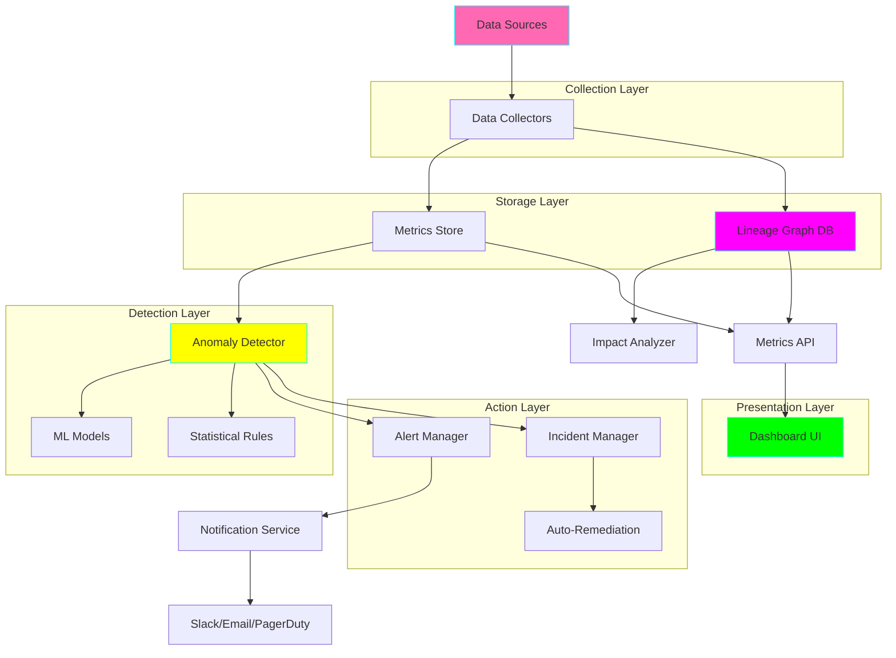
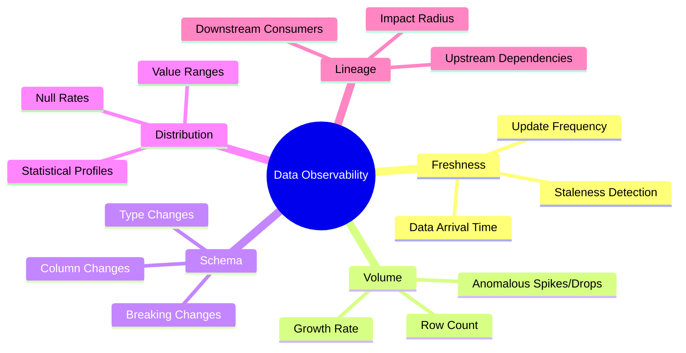

# Project 27: Data Quality Observability Platform

**Complexity:** ⭐⭐⭐⭐⭐ | **Time:** 15-18 hours | **Tier:** Expert Level

## Overview

Build a comprehensive data quality observability platform that monitors, detects anomalies, tracks lineage, and manages data quality incidents across your entire data ecosystem. This project implements the five pillars of data observability: freshness, volume, schema, distribution, and lineage.

## Learning Objectives

After completing this project, you will understand:

- ✅ The five pillars of data observability
- ✅ Statistical profiling and anomaly detection techniques
- ✅ ML-based anomaly detection algorithms
- ✅ Data lineage tracking and impact analysis
- ✅ Root cause analysis automation
- ✅ SLA monitoring and alerting strategies
- ✅ Automated incident remediation patterns
- ✅ Data quality metrics and KPIs

## Architecture



## Key Concepts

### Five Pillars of Data Observability



### 1. Freshness Monitoring

Track when data was last updated and detect delays:

```python
# Expected: Data updates every hour
# Alert if: No update in last 2 hours
# Severity: Critical if > 4 hours
```

### 2. Volume Monitoring

Monitor data volume and detect anomalies:

```python
# Expected: 1M ± 100k rows per day
# Alert if: < 800k or > 1.2M rows
# Use: Z-score, IQR, or ML-based detection
```

### 3. Schema Monitoring

Track schema changes and compatibility:

```python
# Monitor: Column additions, deletions, type changes
# Alert if: Breaking changes detected
# Track: Schema version history
```

### 4. Distribution Monitoring

Profile data distributions and detect drift:

```python
# Monitor: Mean, median, stddev, percentiles
# Alert if: Distribution shifts significantly
# Track: Null rates, cardinality, uniqueness
```

### 5. Lineage Tracking

Map data dependencies and impact:

```python
# Track: Table -> Table, Column -> Column
# Alert if: Critical upstream failure
# Analyze: Downstream impact radius
```

## Implementation Guide

### Step 1: Metrics Collection Framework

```python
from dataclasses import dataclass, field
from datetime import datetime
from typing import Dict, List, Optional, Any
from enum import Enum
import pandas as pd
import numpy as np
from sqlalchemy import create_engine, MetaData, Table
import logging

class MetricType(Enum):
    """Types of data quality metrics."""
    FRESHNESS = "freshness"
    VOLUME = "volume"
    SCHEMA = "schema"
    DISTRIBUTION = "distribution"
    CUSTOM = "custom"

@dataclass
class QualityMetric:
    """Data quality metric measurement."""
    table_name: str
    metric_type: MetricType
    metric_name: str
    value: Any
    timestamp: datetime = field(default_factory=datetime.now)
    metadata: Dict[str, Any] = field(default_factory=dict)

class MetricsCollector:
    """Collect data quality metrics from various sources."""

    def __init__(self, connection_string: str):
        self.engine = create_engine(connection_string)
        self.logger = logging.getLogger(__name__)

    def collect_freshness_metrics(self, table_name: str) -> QualityMetric:
        """
        Measure data freshness.

        Args:
            table_name: Table to check

        Returns:
            Freshness metric
        """
        query = f"""
        SELECT
            MAX(updated_at) as last_update,
            EXTRACT(EPOCH FROM (NOW() - MAX(updated_at))) as age_seconds
        FROM {table_name}
        """

        with self.engine.connect() as conn:
            result = conn.execute(query).fetchone()

        return QualityMetric(
            table_name=table_name,
            metric_type=MetricType.FRESHNESS,
            metric_name="last_update_age",
            value=result['age_seconds'],
            metadata={
                'last_update': result['last_update'],
                'measured_at': datetime.now()
            }
        )

    def collect_volume_metrics(self, table_name: str) -> List[QualityMetric]:
        """
        Measure data volume statistics.

        Args:
            table_name: Table to analyze

        Returns:
            List of volume metrics
        """
        query = f"SELECT COUNT(*) as row_count FROM {table_name}"

        with self.engine.connect() as conn:
            row_count = conn.execute(query).scalar()

        metrics = [
            QualityMetric(
                table_name=table_name,
                metric_type=MetricType.VOLUME,
                metric_name="row_count",
                value=row_count
            )
        ]

        # Daily growth rate
        query_daily = f"""
        SELECT
            DATE(created_at) as date,
            COUNT(*) as daily_count
        FROM {table_name}
        WHERE created_at >= CURRENT_DATE - INTERVAL '7 days'
        GROUP BY DATE(created_at)
        ORDER BY date
        """

        with self.engine.connect() as conn:
            daily_counts = pd.read_sql(query_daily, conn)

        if len(daily_counts) > 1:
            growth_rate = daily_counts['daily_count'].pct_change().mean()

            metrics.append(
                QualityMetric(
                    table_name=table_name,
                    metric_type=MetricType.VOLUME,
                    metric_name="daily_growth_rate",
                    value=growth_rate,
                    metadata={'daily_counts': daily_counts.to_dict()}
                )
            )

        return metrics

    def collect_schema_metrics(self, table_name: str) -> QualityMetric:
        """
        Capture current schema state.

        Args:
            table_name: Table to inspect

        Returns:
            Schema metric
        """
        metadata = MetaData()
        metadata.reflect(bind=self.engine)
        table = metadata.tables[table_name]

        schema_info = {
            'columns': [
                {
                    'name': col.name,
                    'type': str(col.type),
                    'nullable': col.nullable,
                    'primary_key': col.primary_key
                }
                for col in table.columns
            ],
            'column_count': len(table.columns),
            'primary_keys': [col.name for col in table.primary_key]
        }

        return QualityMetric(
            table_name=table_name,
            metric_type=MetricType.SCHEMA,
            metric_name="schema_snapshot",
            value=schema_info,
            metadata={'version': datetime.now().isoformat()}
        )

    def collect_distribution_metrics(
        self,
        table_name: str,
        column_name: str
    ) -> List[QualityMetric]:
        """
        Profile column distributions.

        Args:
            table_name: Table name
            column_name: Column to profile

        Returns:
            Distribution metrics
        """
        query = f"SELECT {column_name} FROM {table_name}"

        with self.engine.connect() as conn:
            df = pd.read_sql(query, conn)

        column_data = df[column_name]
        metrics = []

        # Null rate
        null_rate = column_data.isnull().sum() / len(column_data)
        metrics.append(
            QualityMetric(
                table_name=table_name,
                metric_type=MetricType.DISTRIBUTION,
                metric_name=f"{column_name}_null_rate",
                value=null_rate
            )
        )

        # For numeric columns
        if pd.api.types.is_numeric_dtype(column_data):
            stats = column_data.describe()

            metrics.extend([
                QualityMetric(
                    table_name=table_name,
                    metric_type=MetricType.DISTRIBUTION,
                    metric_name=f"{column_name}_mean",
                    value=stats['mean']
                ),
                QualityMetric(
                    table_name=table_name,
                    metric_type=MetricType.DISTRIBUTION,
                    metric_name=f"{column_name}_std",
                    value=stats['std']
                ),
                QualityMetric(
                    table_name=table_name,
                    metric_type=MetricType.DISTRIBUTION,
                    metric_name=f"{column_name}_p50",
                    value=stats['50%']
                ),
                QualityMetric(
                    table_name=table_name,
                    metric_type=MetricType.DISTRIBUTION,
                    metric_name=f"{column_name}_p95",
                    value=column_data.quantile(0.95)
                ),
                QualityMetric(
                    table_name=table_name,
                    metric_type=MetricType.DISTRIBUTION,
                    metric_name=f"{column_name}_p99",
                    value=column_data.quantile(0.99)
                )
            ])

        # Cardinality
        cardinality = column_data.nunique()
        metrics.append(
            QualityMetric(
                table_name=table_name,
                metric_type=MetricType.DISTRIBUTION,
                metric_name=f"{column_name}_cardinality",
                value=cardinality
            )
        )

        return metrics
```

### Step 2: Anomaly Detection Engine

```python
from scipy import stats
from sklearn.ensemble import IsolationForest
from typing import Tuple

class AnomalyDetector:
    """Detect anomalies in data quality metrics."""

    def __init__(self):
        self.logger = logging.getLogger(__name__)

    def detect_z_score_anomaly(
        self,
        current_value: float,
        historical_values: List[float],
        threshold: float = 3.0
    ) -> Tuple[bool, float]:
        """
        Detect anomaly using Z-score method.

        Args:
            current_value: Current metric value
            historical_values: Historical values for comparison
            threshold: Z-score threshold (default: 3.0)

        Returns:
            (is_anomaly, z_score)
        """
        if len(historical_values) < 2:
            return False, 0.0

        mean = np.mean(historical_values)
        std = np.std(historical_values)

        if std == 0:
            return False, 0.0

        z_score = (current_value - mean) / std
        is_anomaly = abs(z_score) > threshold

        return is_anomaly, z_score

    def detect_iqr_anomaly(
        self,
        current_value: float,
        historical_values: List[float],
        multiplier: float = 1.5
    ) -> Tuple[bool, Dict]:
        """
        Detect anomaly using Interquartile Range (IQR) method.

        Args:
            current_value: Current metric value
            historical_values: Historical values
            multiplier: IQR multiplier (default: 1.5)

        Returns:
            (is_anomaly, details)
        """
        if len(historical_values) < 4:
            return False, {}

        q1 = np.percentile(historical_values, 25)
        q3 = np.percentile(historical_values, 75)
        iqr = q3 - q1

        lower_bound = q1 - (multiplier * iqr)
        upper_bound = q3 + (multiplier * iqr)

        is_anomaly = current_value < lower_bound or current_value > upper_bound

        details = {
            'q1': q1,
            'q3': q3,
            'iqr': iqr,
            'lower_bound': lower_bound,
            'upper_bound': upper_bound,
            'current_value': current_value
        }

        return is_anomaly, details

    def detect_ml_anomaly(
        self,
        current_value: float,
        historical_values: List[float],
        contamination: float = 0.1
    ) -> Tuple[bool, float]:
        """
        Detect anomaly using Isolation Forest (ML-based).

        Args:
            current_value: Current metric value
            historical_values: Historical values for training
            contamination: Expected anomaly rate

        Returns:
            (is_anomaly, anomaly_score)
        """
        if len(historical_values) < 10:
            return False, 0.0

        # Prepare data
        X = np.array(historical_values).reshape(-1, 1)
        X_current = np.array([[current_value]])

        # Train Isolation Forest
        model = IsolationForest(
            contamination=contamination,
            random_state=42
        )
        model.fit(X)

        # Predict
        prediction = model.predict(X_current)[0]
        anomaly_score = model.score_samples(X_current)[0]

        is_anomaly = prediction == -1

        return is_anomaly, anomaly_score

    def detect_freshness_anomaly(
        self,
        age_seconds: float,
        expected_frequency_seconds: float,
        tolerance_multiplier: float = 2.0
    ) -> Tuple[bool, str]:
        """
        Detect freshness anomalies.

        Args:
            age_seconds: Current data age
            expected_frequency_seconds: Expected update frequency
            tolerance_multiplier: Tolerance factor

        Returns:
            (is_anomaly, severity)
        """
        threshold = expected_frequency_seconds * tolerance_multiplier

        if age_seconds <= threshold:
            return False, "ok"
        elif age_seconds <= threshold * 2:
            return True, "warning"
        elif age_seconds <= threshold * 4:
            return True, "critical"
        else:
            return True, "emergency"

    def detect_volume_anomaly(
        self,
        current_count: int,
        historical_counts: List[int],
        method: str = "iqr"
    ) -> Tuple[bool, Dict]:
        """
        Detect volume anomalies using specified method.

        Args:
            current_count: Current row count
            historical_counts: Historical counts
            method: Detection method (z_score, iqr, ml)

        Returns:
            (is_anomaly, details)
        """
        if method == "z_score":
            is_anomaly, score = self.detect_z_score_anomaly(
                current_count,
                historical_counts
            )
            return is_anomaly, {'z_score': score}

        elif method == "iqr":
            return self.detect_iqr_anomaly(current_count, historical_counts)

        elif method == "ml":
            is_anomaly, score = self.detect_ml_anomaly(
                current_count,
                historical_counts
            )
            return is_anomaly, {'anomaly_score': score}

        else:
            raise ValueError(f"Unknown method: {method}")

    def detect_schema_change(
        self,
        current_schema: Dict,
        previous_schema: Dict
    ) -> Tuple[bool, List[str]]:
        """
        Detect schema changes between versions.

        Args:
            current_schema: Current schema snapshot
            previous_schema: Previous schema snapshot

        Returns:
            (has_changes, list of changes)
        """
        changes = []

        current_cols = {
            col['name']: col
            for col in current_schema['columns']
        }
        previous_cols = {
            col['name']: col
            for col in previous_schema['columns']
        }

        # Detect added columns
        added = set(current_cols.keys()) - set(previous_cols.keys())
        for col in added:
            changes.append(f"Added column: {col}")

        # Detect removed columns
        removed = set(previous_cols.keys()) - set(current_cols.keys())
        for col in removed:
            changes.append(f"Removed column: {col} (BREAKING)")

        # Detect type changes
        for col in current_cols:
            if col in previous_cols:
                if current_cols[col]['type'] != previous_cols[col]['type']:
                    changes.append(
                        f"Type changed: {col} "
                        f"{previous_cols[col]['type']} -> "
                        f"{current_cols[col]['type']} (BREAKING)"
                    )

        return len(changes) > 0, changes

    def detect_distribution_drift(
        self,
        current_distribution: Dict[str, float],
        baseline_distribution: Dict[str, float],
        threshold: float = 0.2
    ) -> Tuple[bool, Dict]:
        """
        Detect distribution drift using statistical tests.

        Args:
            current_distribution: Current statistics
            baseline_distribution: Baseline statistics
            threshold: Drift threshold (20% change)

        Returns:
            (has_drift, drift_metrics)
        """
        drift_metrics = {}
        has_drift = False

        # Compare means
        if 'mean' in current_distribution and 'mean' in baseline_distribution:
            mean_change = abs(
                (current_distribution['mean'] - baseline_distribution['mean'])
                / baseline_distribution['mean']
            )
            drift_metrics['mean_change_pct'] = mean_change * 100

            if mean_change > threshold:
                has_drift = True

        # Compare standard deviations
        if 'std' in current_distribution and 'std' in baseline_distribution:
            std_change = abs(
                (current_distribution['std'] - baseline_distribution['std'])
                / baseline_distribution['std']
            )
            drift_metrics['std_change_pct'] = std_change * 100

            if std_change > threshold:
                has_drift = True

        # Compare null rates
        if 'null_rate' in current_distribution and 'null_rate' in baseline_distribution:
            null_change = abs(
                current_distribution['null_rate'] - baseline_distribution['null_rate']
            )
            drift_metrics['null_change'] = null_change

            if null_change > 0.05:  # 5% increase in nulls
                has_drift = True

        return has_drift, drift_metrics
```

### Step 3: Data Lineage Tracker

```python
from typing import Set
import networkx as nx
from enum import Enum

class NodeType(Enum):
    """Types of nodes in lineage graph."""
    TABLE = "table"
    COLUMN = "column"
    VIEW = "view"
    QUERY = "query"
    JOB = "job"

@dataclass
class LineageNode:
    """Node in lineage graph."""
    id: str
    type: NodeType
    name: str
    metadata: Dict[str, Any] = field(default_factory=dict)

@dataclass
class LineageEdge:
    """Edge in lineage graph."""
    source_id: str
    target_id: str
    transformation: Optional[str] = None
    metadata: Dict[str, Any] = field(default_factory=dict)

class LineageTracker:
    """Track and analyze data lineage."""

    def __init__(self):
        self.graph = nx.DiGraph()
        self.logger = logging.getLogger(__name__)

    def add_node(self, node: LineageNode):
        """Add node to lineage graph."""
        self.graph.add_node(
            node.id,
            type=node.type,
            name=node.name,
            metadata=node.metadata
        )

    def add_edge(self, edge: LineageEdge):
        """Add edge to lineage graph."""
        self.graph.add_edge(
            edge.source_id,
            edge.target_id,
            transformation=edge.transformation,
            metadata=edge.metadata
        )

    def get_upstream_dependencies(
        self,
        node_id: str,
        max_depth: Optional[int] = None
    ) -> Set[str]:
        """
        Get all upstream dependencies of a node.

        Args:
            node_id: Node to analyze
            max_depth: Maximum traversal depth

        Returns:
            Set of upstream node IDs
        """
        if node_id not in self.graph:
            return set()

        if max_depth is None:
            # Get all ancestors
            return nx.ancestors(self.graph, node_id)
        else:
            # BFS with depth limit
            visited = set()
            queue = [(node_id, 0)]

            while queue:
                current, depth = queue.pop(0)

                if depth >= max_depth:
                    continue

                for predecessor in self.graph.predecessors(current):
                    if predecessor not in visited:
                        visited.add(predecessor)
                        queue.append((predecessor, depth + 1))

            return visited

    def get_downstream_consumers(
        self,
        node_id: str,
        max_depth: Optional[int] = None
    ) -> Set[str]:
        """
        Get all downstream consumers of a node.

        Args:
            node_id: Node to analyze
            max_depth: Maximum traversal depth

        Returns:
            Set of downstream node IDs
        """
        if node_id not in self.graph:
            return set()

        if max_depth is None:
            return nx.descendants(self.graph, node_id)
        else:
            # BFS with depth limit
            visited = set()
            queue = [(node_id, 0)]

            while queue:
                current, depth = queue.pop(0)

                if depth >= max_depth:
                    continue

                for successor in self.graph.successors(current):
                    if successor not in visited:
                        visited.add(successor)
                        queue.append((successor, depth + 1))

            return visited

    def analyze_impact(self, node_id: str) -> Dict:
        """
        Analyze impact of a node failure or change.

        Args:
            node_id: Node to analyze

        Returns:
            Impact analysis results
        """
        downstream = self.get_downstream_consumers(node_id)

        # Categorize by type
        impact_by_type = {}
        for node in downstream:
            node_type = self.graph.nodes[node]['type']
            if node_type not in impact_by_type:
                impact_by_type[node_type] = []
            impact_by_type[node_type].append(
                self.graph.nodes[node]['name']
            )

        # Calculate criticality
        criticality = "low"
        if len(downstream) > 20:
            criticality = "critical"
        elif len(downstream) > 10:
            criticality = "high"
        elif len(downstream) > 5:
            criticality = "medium"

        return {
            'total_impact': len(downstream),
            'impact_by_type': impact_by_type,
            'criticality': criticality,
            'affected_nodes': list(downstream)
        }

    def find_root_cause_candidates(
        self,
        failed_node_id: str,
        max_depth: int = 3
    ) -> List[str]:
        """
        Find potential root causes of a failure.

        Args:
            failed_node_id: Failed node
            max_depth: How far upstream to search

        Returns:
            List of candidate root cause nodes
        """
        upstream = self.get_upstream_dependencies(failed_node_id, max_depth)

        # Check each upstream node for issues
        candidates = []

        for node_id in upstream:
            # Calculate distance (closer = more likely root cause)
            try:
                distance = nx.shortest_path_length(
                    self.graph,
                    source=node_id,
                    target=failed_node_id
                )

                candidates.append({
                    'node_id': node_id,
                    'node_name': self.graph.nodes[node_id]['name'],
                    'distance': distance,
                    'priority': max_depth - distance + 1
                })
            except nx.NetworkXNoPath:
                continue

        # Sort by priority (closest nodes first)
        candidates.sort(key=lambda x: x['priority'], reverse=True)

        return candidates

    def get_column_lineage(
        self,
        table_id: str,
        column_name: str
    ) -> Dict:
        """
        Get column-level lineage.

        Args:
            table_id: Table identifier
            column_name: Column name

        Returns:
            Column lineage information
        """
        column_id = f"{table_id}.{column_name}"

        if column_id not in self.graph:
            return {}

        upstream_columns = self.get_upstream_dependencies(column_id)
        downstream_columns = self.get_downstream_consumers(column_id)

        return {
            'column': column_name,
            'table': table_id,
            'upstream_columns': [
                {
                    'id': col_id,
                    'name': self.graph.nodes[col_id]['name']
                }
                for col_id in upstream_columns
            ],
            'downstream_columns': [
                {
                    'id': col_id,
                    'name': self.graph.nodes[col_id]['name']
                }
                for col_id in downstream_columns
            ]
        }

    def export_lineage_graph(self, output_path: str):
        """Export lineage graph for visualization."""
        import json

        # Convert to JSON-serializable format
        data = {
            'nodes': [
                {
                    'id': node_id,
                    'type': str(self.graph.nodes[node_id]['type']),
                    'name': self.graph.nodes[node_id]['name'],
                    'metadata': self.graph.nodes[node_id].get('metadata', {})
                }
                for node_id in self.graph.nodes()
            ],
            'edges': [
                {
                    'source': edge[0],
                    'target': edge[1],
                    'transformation': self.graph.edges[edge].get('transformation'),
                    'metadata': self.graph.edges[edge].get('metadata', {})
                }
                for edge in self.graph.edges()
            ]
        }

        with open(output_path, 'w') as f:
            json.dump(data, f, indent=2)

        self.logger.info(f"Exported lineage graph to {output_path}")
```

### Step 4: Alert Manager and Incident Response

```python
from enum import Enum
from typing import Callable, List

class AlertSeverity(Enum):
    """Alert severity levels."""
    INFO = "info"
    WARNING = "warning"
    CRITICAL = "critical"
    EMERGENCY = "emergency"

@dataclass
class Alert:
    """Data quality alert."""
    id: str
    table_name: str
    metric_name: str
    severity: AlertSeverity
    message: str
    current_value: Any
    expected_value: Any
    timestamp: datetime = field(default_factory=datetime.now)
    metadata: Dict[str, Any] = field(default_factory=dict)

class AlertManager:
    """Manage alerts and notifications."""

    def __init__(self):
        self.handlers: Dict[AlertSeverity, List[Callable]] = {
            AlertSeverity.INFO: [],
            AlertSeverity.WARNING: [],
            AlertSeverity.CRITICAL: [],
            AlertSeverity.EMERGENCY: []
        }
        self.logger = logging.getLogger(__name__)

    def register_handler(
        self,
        severity: AlertSeverity,
        handler: Callable[[Alert], None]
    ):
        """Register alert handler for severity level."""
        self.handlers[severity].append(handler)

    def send_alert(self, alert: Alert):
        """Send alert to registered handlers."""
        self.logger.info(
            f"Alert: {alert.severity.value} - {alert.message}"
        )

        # Execute handlers for this severity
        for handler in self.handlers[alert.severity]:
            try:
                handler(alert)
            except Exception as e:
                self.logger.error(f"Handler failed: {e}")

        # Also execute emergency handlers for critical alerts
        if alert.severity == AlertSeverity.CRITICAL:
            for handler in self.handlers[AlertSeverity.EMERGENCY]:
                try:
                    handler(alert)
                except Exception as e:
                    self.logger.error(f"Emergency handler failed: {e}")

# Example alert handlers
def slack_handler(alert: Alert):
    """Send alert to Slack."""
    import requests

    webhook_url = "https://hooks.slack.com/services/YOUR/WEBHOOK/URL"

    color_map = {
        AlertSeverity.INFO: "good",
        AlertSeverity.WARNING: "warning",
        AlertSeverity.CRITICAL: "danger",
        AlertSeverity.EMERGENCY: "danger"
    }

    payload = {
        "attachments": [{
            "color": color_map[alert.severity],
            "title": f"Data Quality Alert: {alert.table_name}",
            "text": alert.message,
            "fields": [
                {
                    "title": "Metric",
                    "value": alert.metric_name,
                    "short": True
                },
                {
                    "title": "Severity",
                    "value": alert.severity.value.upper(),
                    "short": True
                },
                {
                    "title": "Current Value",
                    "value": str(alert.current_value),
                    "short": True
                },
                {
                    "title": "Expected Value",
                    "value": str(alert.expected_value),
                    "short": True
                }
            ],
            "ts": int(alert.timestamp.timestamp())
        }]
    }

    requests.post(webhook_url, json=payload)

def pagerduty_handler(alert: Alert):
    """Send alert to PagerDuty."""
    import requests

    api_key = "YOUR_PAGERDUTY_API_KEY"
    routing_key = "YOUR_ROUTING_KEY"

    severity_map = {
        AlertSeverity.INFO: "info",
        AlertSeverity.WARNING: "warning",
        AlertSeverity.CRITICAL: "error",
        AlertSeverity.EMERGENCY: "critical"
    }

    payload = {
        "routing_key": routing_key,
        "event_action": "trigger",
        "dedup_key": alert.id,
        "payload": {
            "summary": alert.message,
            "severity": severity_map[alert.severity],
            "source": alert.table_name,
            "custom_details": {
                "metric": alert.metric_name,
                "current_value": alert.current_value,
                "expected_value": alert.expected_value,
                "metadata": alert.metadata
            }
        }
    }

    headers = {
        "Authorization": f"Token token={api_key}",
        "Content-Type": "application/json"
    }

    requests.post(
        "https://events.pagerduty.com/v2/enqueue",
        json=payload,
        headers=headers
    )

class IncidentManager:
    """Manage data quality incidents."""

    def __init__(self):
        self.incidents: Dict[str, Dict] = {}
        self.logger = logging.getLogger(__name__)

    def create_incident(self, alert: Alert) -> str:
        """Create incident from alert."""
        incident_id = f"INC-{alert.id}"

        self.incidents[incident_id] = {
            'id': incident_id,
            'alert': alert,
            'status': 'open',
            'created_at': datetime.now(),
            'updated_at': datetime.now(),
            'notes': [],
            'remediation_attempts': []
        }

        self.logger.info(f"Created incident: {incident_id}")
        return incident_id

    def add_note(self, incident_id: str, note: str):
        """Add note to incident."""
        if incident_id in self.incidents:
            self.incidents[incident_id]['notes'].append({
                'timestamp': datetime.now(),
                'note': note
            })
            self.incidents[incident_id]['updated_at'] = datetime.now()

    def attempt_remediation(
        self,
        incident_id: str,
        remediation_func: Callable,
        **kwargs
    ):
        """Attempt automated remediation."""
        if incident_id not in self.incidents:
            return

        try:
            result = remediation_func(**kwargs)

            self.incidents[incident_id]['remediation_attempts'].append({
                'timestamp': datetime.now(),
                'function': remediation_func.__name__,
                'success': True,
                'result': result
            })

            self.add_note(incident_id, f"Remediation successful: {result}")

        except Exception as e:
            self.incidents[incident_id]['remediation_attempts'].append({
                'timestamp': datetime.now(),
                'function': remediation_func.__name__,
                'success': False,
                'error': str(e)
            })

            self.add_note(incident_id, f"Remediation failed: {e}")

    def resolve_incident(self, incident_id: str, resolution: str):
        """Mark incident as resolved."""
        if incident_id in self.incidents:
            self.incidents[incident_id]['status'] = 'resolved'
            self.incidents[incident_id]['resolved_at'] = datetime.now()
            self.incidents[incident_id]['resolution'] = resolution
            self.logger.info(f"Resolved incident: {incident_id}")
```

### Step 5: Observability Dashboard API

```python
from fastapi import FastAPI, HTTPException
from pydantic import BaseModel
from typing import List

app = FastAPI(title="Data Quality Observability API")

class MetricResponse(BaseModel):
    """Metric API response."""
    table_name: str
    metric_type: str
    metric_name: str
    value: Any
    timestamp: datetime

class LineageResponse(BaseModel):
    """Lineage API response."""
    node_id: str
    upstream_count: int
    downstream_count: int
    criticality: str

@app.get("/metrics/{table_name}", response_model=List[MetricResponse])
async def get_table_metrics(table_name: str, hours: int = 24):
    """Get metrics for a table over time period."""
    # Query metrics store
    pass

@app.get("/lineage/{table_name}", response_model=LineageResponse)
async def get_table_lineage(table_name: str):
    """Get lineage information for a table."""
    # Query lineage graph
    pass

@app.get("/alerts", response_model=List[Alert])
async def get_active_alerts(severity: Optional[str] = None):
    """Get active alerts, optionally filtered by severity."""
    # Query alert store
    pass

@app.post("/alerts/acknowledge/{alert_id}")
async def acknowledge_alert(alert_id: str):
    """Acknowledge an alert."""
    # Update alert status
    pass
```

## Nuanced Scenarios

### 1. ML-Based Anomaly Detection with Auto-Tuning

```python
from sklearn.model_selection import GridSearchCV

class AdaptiveAnomalyDetector:
    """Self-tuning anomaly detector."""

    def __init__(self):
        self.models: Dict[str, Any] = {}
        self.logger = logging.getLogger(__name__)

    def train_adaptive_model(
        self,
        table_name: str,
        metric_name: str,
        historical_data: np.ndarray
    ):
        """Train and tune model for specific metric."""

        # Grid search for best parameters
        param_grid = {
            'contamination': [0.01, 0.05, 0.1, 0.15],
            'max_samples': [100, 256, 512],
            'n_estimators': [50, 100, 200]
        }

        base_model = IsolationForest(random_state=42)

        # Use silhouette score for unsupervised evaluation
        # (simplified - in production use domain-specific validation)
        grid_search = GridSearchCV(
            base_model,
            param_grid,
            cv=3,
            scoring='neg_mean_squared_error'
        )

        X = historical_data.reshape(-1, 1)
        grid_search.fit(X)

        best_model = grid_search.best_estimator_

        model_key = f"{table_name}.{metric_name}"
        self.models[model_key] = {
            'model': best_model,
            'params': grid_search.best_params_,
            'trained_at': datetime.now()
        }

        self.logger.info(
            f"Trained adaptive model for {model_key}: "
            f"{grid_search.best_params_}"
        )

    def detect_with_confidence(
        self,
        table_name: str,
        metric_name: str,
        value: float
    ) -> Tuple[bool, float, str]:
        """
        Detect anomaly with confidence score.

        Returns:
            (is_anomaly, confidence, explanation)
        """
        model_key = f"{table_name}.{metric_name}"

        if model_key not in self.models:
            return False, 0.0, "Model not trained"

        model_info = self.models[model_key]
        model = model_info['model']

        X = np.array([[value]])
        prediction = model.predict(X)[0]
        score = model.score_samples(X)[0]

        is_anomaly = prediction == -1

        # Convert score to confidence (0-1)
        confidence = abs(score) / 0.5  # Normalize

        explanation = (
            f"Value {value} is {'anomalous' if is_anomaly else 'normal'} "
            f"with {confidence:.2%} confidence"
        )

        return is_anomaly, confidence, explanation
```

### 2. Root Cause Analysis with ML

```python
class RootCauseAnalyzer:
    """Automated root cause analysis."""

    def __init__(self, lineage_tracker: LineageTracker):
        self.lineage = lineage_tracker
        self.logger = logging.getLogger(__name__)

    def analyze_failure_pattern(
        self,
        failed_nodes: List[str],
        time_window_hours: int = 24
    ) -> Dict:
        """
        Analyze pattern in failures to find root cause.

        Args:
            failed_nodes: List of failed node IDs
            time_window_hours: Time window to analyze

        Returns:
            Root cause analysis results
        """
        # Find common upstream nodes
        common_upstream = None

        for node_id in failed_nodes:
            upstream = self.lineage.get_upstream_dependencies(node_id)

            if common_upstream is None:
                common_upstream = upstream
            else:
                common_upstream = common_upstream.intersection(upstream)

        # Rank by impact
        candidates = []

        for node_id in common_upstream:
            impact = self.lineage.analyze_impact(node_id)

            # Count how many failed nodes are downstream
            downstream = self.lineage.get_downstream_consumers(node_id)
            affected_failed = len(set(failed_nodes).intersection(downstream))

            candidates.append({
                'node_id': node_id,
                'node_name': self.lineage.graph.nodes[node_id]['name'],
                'total_impact': impact['total_impact'],
                'affected_failed_nodes': affected_failed,
                'likelihood_score': affected_failed / len(failed_nodes)
            })

        # Sort by likelihood
        candidates.sort(key=lambda x: x['likelihood_score'], reverse=True)

        return {
            'root_cause_candidates': candidates[:5],  # Top 5
            'common_upstream_count': len(common_upstream),
            'analysis_timestamp': datetime.now()
        }
```

### 3. SLA Monitoring and Compliance

```python
@dataclass
class SLA:
    """Service Level Agreement definition."""
    name: str
    metric_type: MetricType
    table_name: str
    threshold: float
    operator: str  # 'lt', 'gt', 'eq'
    time_window_hours: int
    compliance_target: float  # e.g., 99.9%

class SLAMonitor:
    """Monitor SLA compliance."""

    def __init__(self):
        self.slas: Dict[str, SLA] = {}
        self.violations: List[Dict] = []
        self.logger = logging.getLogger(__name__)

    def register_sla(self, sla: SLA):
        """Register SLA for monitoring."""
        self.slas[sla.name] = sla
        self.logger.info(f"Registered SLA: {sla.name}")

    def check_compliance(
        self,
        sla_name: str,
        metric_values: List[Tuple[datetime, float]]
    ) -> Dict:
        """
        Check SLA compliance over time window.

        Args:
            sla_name: SLA to check
            metric_values: List of (timestamp, value) tuples

        Returns:
            Compliance report
        """
        if sla_name not in self.slas:
            raise ValueError(f"Unknown SLA: {sla_name}")

        sla = self.slas[sla_name]

        # Count violations
        violations = 0
        total = len(metric_values)

        for timestamp, value in metric_values:
            if sla.operator == 'lt' and value >= sla.threshold:
                violations += 1
                self.violations.append({
                    'sla': sla_name,
                    'timestamp': timestamp,
                    'value': value,
                    'threshold': sla.threshold
                })
            elif sla.operator == 'gt' and value <= sla.threshold:
                violations += 1
                self.violations.append({
                    'sla': sla_name,
                    'timestamp': timestamp,
                    'value': value,
                    'threshold': sla.threshold
                })

        # Calculate compliance
        compliance_rate = (1 - violations / total) * 100 if total > 0 else 100

        is_compliant = compliance_rate >= sla.compliance_target

        return {
            'sla_name': sla_name,
            'compliance_rate': compliance_rate,
            'target': sla.compliance_target,
            'is_compliant': is_compliant,
            'violations': violations,
            'total_measurements': total,
            'report_timestamp': datetime.now()
        }
```

### 4. Automated Remediation

```python
class AutoRemediation:
    """Automated remediation strategies."""

    def __init__(self):
        self.logger = logging.getLogger(__name__)

    def remediate_freshness_issue(
        self,
        table_name: str,
        pipeline_trigger_url: str
    ):
        """Trigger pipeline refresh for stale data."""
        import requests

        self.logger.info(f"Triggering pipeline refresh for {table_name}")

        response = requests.post(
            pipeline_trigger_url,
            json={'table': table_name, 'reason': 'freshness_sla_violation'}
        )

        if response.status_code == 200:
            self.logger.info("Pipeline triggered successfully")
            return "Pipeline refresh triggered"
        else:
            raise Exception(f"Failed to trigger pipeline: {response.text}")

    def remediate_volume_anomaly(
        self,
        table_name: str,
        expected_source: str
    ):
        """Investigate volume anomaly."""
        # Check source system health
        # Verify upstream data availability
        # Re-run extraction if needed

        self.logger.info(f"Investigating volume anomaly for {table_name}")

        # This would implement actual remediation logic
        return "Investigation logged, manual review required"

    def remediate_schema_drift(
        self,
        table_name: str,
        schema_version: str
    ):
        """Handle schema drift."""
        # Attempt schema evolution
        # Or rollback to previous version
        # Or trigger schema reconciliation

        self.logger.info(f"Handling schema drift for {table_name}")

        return "Schema reconciliation initiated"
```

## Exercises

### Exercise 1: Build Complete Observability Pipeline
Create end-to-end pipeline:
- Collect all 5 pillars of metrics
- Store in time-series database
- Implement 3+ anomaly detection methods
- Set up alerting

### Exercise 2: Advanced Lineage Tracking
Build lineage tracker:
- Parse SQL to extract dependencies
- Track column-level lineage
- Implement impact analysis
- Visualize lineage graph

### Exercise 3: SLA Dashboard
Create SLA monitoring:
- Define SLAs for key tables
- Track compliance over time
- Generate compliance reports
- Alert on SLA violations

### Exercise 4: Auto-Remediation System
Implement automated remediation:
- Detect freshness issues -> trigger pipelines
- Detect volume anomalies -> investigate sources
- Detect schema drift -> reconcile or rollback
- Track remediation success rate

## Success Criteria

- [ ] Monitor all 5 pillars of data observability
- [ ] Detect anomalies using 3+ methods (statistical, ML-based)
- [ ] Track table and column-level lineage
- [ ] Perform impact analysis for failures
- [ ] Send alerts to multiple channels (Slack, PagerDuty)
- [ ] Implement automated root cause analysis
- [ ] Monitor SLA compliance
- [ ] Execute automated remediation

## Testing Checklist

```python
# tests/test_observability_platform.py

def test_metrics_collection():
    """Test collecting all metric types."""
    pass

def test_zscore_anomaly_detection():
    """Test Z-score anomaly detection."""
    pass

def test_ml_anomaly_detection():
    """Test ML-based anomaly detection."""
    pass

def test_lineage_tracking():
    """Test lineage graph construction."""
    pass

def test_impact_analysis():
    """Test downstream impact calculation."""
    pass

def test_root_cause_analysis():
    """Test root cause identification."""
    pass

def test_alert_routing():
    """Test alert handlers."""
    pass

def test_sla_monitoring():
    """Test SLA compliance tracking."""
    pass

def test_auto_remediation():
    """Test automated remediation."""
    pass
```

## Common Pitfalls

1. **Alert Fatigue:** Too many false positives
   - Solution: Tune detection thresholds, implement smart alerting

2. **Lineage Complexity:** Graph becomes too large
   - Solution: Implement depth limits, focus on critical paths

3. **Storage Costs:** Metrics accumulate quickly
   - Solution: Implement retention policies, aggregate old data

4. **Missing Context:** Alerts without actionable information
   - Solution: Include lineage, impact, suggested remediation

5. **Over-Automation:** Remediation without human oversight
   - Solution: Require approval for critical changes

## Next Steps

After completing this project:
1. Integrate with **Project 26: Lakehouse** for Iceberg table monitoring
2. Use for **Project 30: ML Feature Platform** quality monitoring
3. Extend with custom domain-specific quality checks
4. Explore commercial solutions (Monte Carlo, Datadog, etc.)

## References

- [The Five Pillars of Data Observability](https://www.montecarlodata.com/blog-what-is-data-observability/)
- [Data Quality Fundamentals](https://www.oreilly.com/library/view/data-quality-fundamentals/9781098112011/)
- [Great Expectations Documentation](https://docs.greatexpectations.io/)
- [Anomaly Detection Techniques](https://arxiv.org/abs/2009.04680)
- [OpenLineage Specification](https://openlineage.io/)

---

**Build Confidence in Your Data! 🚀**
