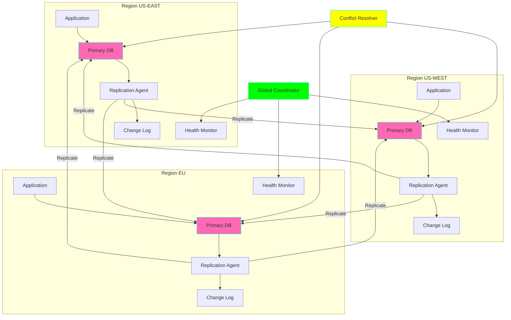
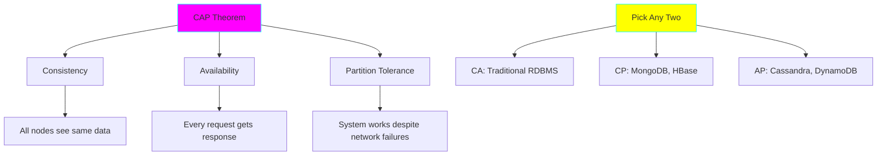
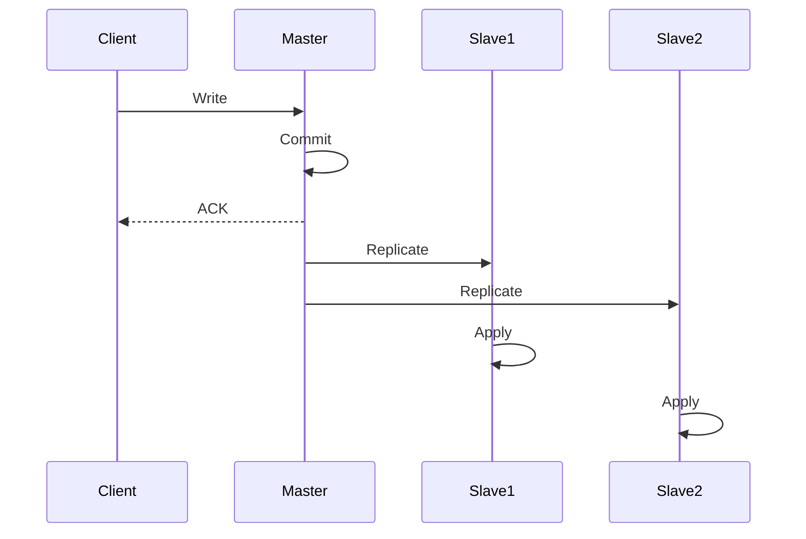
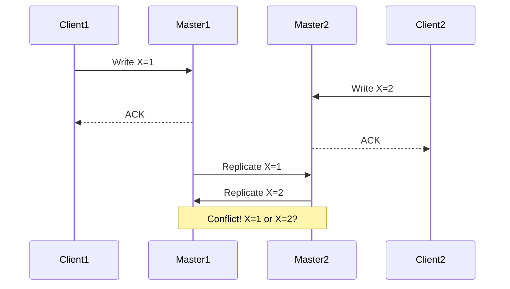

# Project 28: Multi-Region Data Replication

**Complexity:** ⭐⭐⭐⭐⭐ | **Time:** 12-15 hours | **Tier:** Expert Level

## Overview

Build a robust multi-region data replication system that synchronizes data across geographically distributed locations with support for conflict resolution, eventual consistency, network partition handling, and disaster recovery. This project teaches distributed systems concepts applied to data engineering.

## Learning Objectives

After completing this project, you will understand:

- ✅ Geo-distributed system architecture patterns
- ✅ Replication strategies (master-slave, multi-master)
- ✅ Conflict resolution algorithms (LWW, CRDT, custom)
- ✅ Consistency models (strong, eventual, causal)
- ✅ Network partition tolerance (CAP theorem)
- ✅ Latency optimization techniques
- ✅ Disaster recovery and failover strategies
- ✅ Cross-region data synchronization

## Architecture



## Key Concepts

### CAP Theorem



**In Multi-Region Systems:** Must choose AP (Availability + Partition Tolerance) → Eventual Consistency

### Replication Strategies

#### 1. Master-Slave Replication



**Pros:** Simple, consistent reads from master
**Cons:** Single point of failure, master bottleneck

#### 2. Multi-Master (Active-Active) Replication



**Pros:** High availability, low latency
**Cons:** Conflict resolution required

### Conflict Resolution Strategies

| Strategy | Description | Use Case |
|----------|-------------|----------|
| **LWW (Last Write Wins)** | Most recent timestamp wins | Simple updates, acceptable data loss |
| **First Write Wins** | First write keeps value | Reservations, tickets |
| **CRDTs** | Conflict-free datatypes | Counters, sets, maps |
| **Application Logic** | Custom business rules | Complex merges |
| **Manual** | Human intervention | Critical business data |

## Implementation Guide

### Step 1: Change Data Capture (CDC) for Replication

```python
import asyncio
from dataclasses import dataclass, field
from datetime import datetime
from typing import Dict, List, Optional, Any
from enum import Enum
import hashlib
import json
import logging

class ChangeType(Enum):
    """Types of data changes."""
    INSERT = "insert"
    UPDATE = "update"
    DELETE = "delete"

@dataclass
class ChangeEvent:
    """Represents a data change event."""
    id: str
    table: str
    change_type: ChangeType
    data: Dict[str, Any]
    timestamp: datetime
    region: str
    version: int
    checksum: str = field(init=False)

    def __post_init__(self):
        """Calculate checksum for data integrity."""
        data_str = json.dumps(self.data, sort_keys=True)
        self.checksum = hashlib.sha256(data_str.encode()).hexdigest()

class CDCCapture:
    """Capture database changes for replication."""

    def __init__(self, db_connection_string: str, region: str):
        self.connection_string = db_connection_string
        self.region = region
        self.logger = logging.getLogger(__name__)
        self.change_buffer: List[ChangeEvent] = []

    async def capture_changes(self, table_name: str):
        """
        Capture changes from database.
        Uses WAL (Write-Ahead Log) or triggers.

        Args:
            table_name: Table to monitor
        """
        # In production, use database-specific CDC:
        # - PostgreSQL: pg_logical_replication
        # - MySQL: binlog
        # - MongoDB: Change Streams
        # - SQL Server: Change Tracking

        # Simplified example using polling
        query = f"""
        SELECT *
        FROM {table_name}_changelog
        WHERE captured = FALSE
        ORDER BY timestamp
        """

        # Execute query and convert to change events
        # This is a simplified example
        pass

    def create_change_event(
        self,
        table: str,
        change_type: ChangeType,
        data: Dict[str, Any],
        version: int
    ) -> ChangeEvent:
        """Create change event from database change."""
        event_id = f"{self.region}_{table}_{datetime.now().timestamp()}_{version}"

        return ChangeEvent(
            id=event_id,
            table=table,
            change_type=change_type,
            data=data,
            timestamp=datetime.now(),
            region=self.region,
            version=version
        )

    async def publish_changes(self, change_queue: asyncio.Queue):
        """Publish captured changes to queue."""
        while True:
            if self.change_buffer:
                event = self.change_buffer.pop(0)
                await change_queue.put(event)
                self.logger.debug(f"Published change: {event.id}")

            await asyncio.sleep(0.1)  # Prevent busy waiting
```

### Step 2: Replication Agent

```python
import aiohttp
from typing import Set

class ReplicationAgent:
    """Agent responsible for replicating changes across regions."""

    def __init__(
        self,
        source_region: str,
        target_regions: List[str],
        replication_mode: str = "async"
    ):
        self.source_region = source_region
        self.target_regions = target_regions
        self.replication_mode = replication_mode  # async or sync
        self.logger = logging.getLogger(__name__)

        # Track replication lag per region
        self.replication_lag: Dict[str, float] = {}

        # Track failed events for retry
        self.failed_events: List[ChangeEvent] = []

    async def replicate_change(
        self,
        event: ChangeEvent,
        target_region: str
    ) -> bool:
        """
        Replicate single change event to target region.

        Args:
            event: Change event to replicate
            target_region: Target region

        Returns:
            Success status
        """
        endpoint = f"https://{target_region}.api.example.com/replicate"

        payload = {
            'event_id': event.id,
            'table': event.table,
            'change_type': event.change_type.value,
            'data': event.data,
            'timestamp': event.timestamp.isoformat(),
            'source_region': event.region,
            'version': event.version,
            'checksum': event.checksum
        }

        try:
            async with aiohttp.ClientSession() as session:
                async with session.post(
                    endpoint,
                    json=payload,
                    timeout=aiohttp.ClientTimeout(total=30)
                ) as response:
                    if response.status == 200:
                        self.logger.info(
                            f"Replicated {event.id} to {target_region}"
                        )
                        return True
                    else:
                        self.logger.error(
                            f"Replication failed: {response.status}"
                        )
                        return False

        except Exception as e:
            self.logger.error(f"Replication error: {e}")
            self.failed_events.append(event)
            return False

    async def replicate_with_retry(
        self,
        event: ChangeEvent,
        target_region: str,
        max_retries: int = 3
    ):
        """Replicate with exponential backoff retry."""
        for attempt in range(max_retries):
            success = await self.replicate_change(event, target_region)

            if success:
                return

            # Exponential backoff
            wait_time = 2 ** attempt
            self.logger.warning(
                f"Retry {attempt + 1}/{max_retries} after {wait_time}s"
            )
            await asyncio.sleep(wait_time)

        self.logger.error(
            f"Failed to replicate {event.id} after {max_retries} attempts"
        )

    async def replicate_to_all_regions(self, event: ChangeEvent):
        """Replicate change to all target regions."""
        tasks = []

        for region in self.target_regions:
            if region != event.region:  # Don't replicate back to source
                task = self.replicate_with_retry(event, region)
                tasks.append(task)

        if self.replication_mode == "sync":
            # Wait for all replications to complete
            await asyncio.gather(*tasks)
        else:
            # Fire and forget (async replication)
            asyncio.gather(*tasks)

    async def process_replication_queue(self, queue: asyncio.Queue):
        """Process changes from queue and replicate."""
        while True:
            event = await queue.get()

            try:
                await self.replicate_to_all_regions(event)
            except Exception as e:
                self.logger.error(f"Replication processing error: {e}")
            finally:
                queue.task_done()

    async def retry_failed_events(self):
        """Periodically retry failed replications."""
        while True:
            if self.failed_events:
                self.logger.info(
                    f"Retrying {len(self.failed_events)} failed events"
                )

                # Copy and clear failed events
                events_to_retry = self.failed_events.copy()
                self.failed_events.clear()

                # Retry each event
                for event in events_to_retry:
                    await self.replicate_to_all_regions(event)

            await asyncio.sleep(60)  # Retry every minute
```

### Step 3: Conflict Resolution

```python
from typing import Callable

class ConflictResolver:
    """Resolve conflicts in multi-master replication."""

    def __init__(self, strategy: str = "lww"):
        self.strategy = strategy
        self.logger = logging.getLogger(__name__)

        # Custom resolution functions
        self.custom_resolvers: Dict[str, Callable] = {}

    def resolve_conflict(
        self,
        event1: ChangeEvent,
        event2: ChangeEvent
    ) -> ChangeEvent:
        """
        Resolve conflict between two events.

        Args:
            event1: First conflicting event
            event2: Second conflicting event

        Returns:
            Winning event
        """
        if self.strategy == "lww":
            return self._resolve_lww(event1, event2)
        elif self.strategy == "fww":
            return self._resolve_fww(event1, event2)
        elif self.strategy == "custom":
            return self._resolve_custom(event1, event2)
        else:
            raise ValueError(f"Unknown strategy: {self.strategy}")

    def _resolve_lww(
        self,
        event1: ChangeEvent,
        event2: ChangeEvent
    ) -> ChangeEvent:
        """
        Last Write Wins resolution.
        Use timestamp and region as tiebreaker.
        """
        if event1.timestamp > event2.timestamp:
            return event1
        elif event1.timestamp < event2.timestamp:
            return event2
        else:
            # Same timestamp, use region as tiebreaker
            if event1.region > event2.region:
                return event1
            else:
                return event2

    def _resolve_fww(
        self,
        event1: ChangeEvent,
        event2: ChangeEvent
    ) -> ChangeEvent:
        """First Write Wins resolution."""
        if event1.timestamp < event2.timestamp:
            return event1
        elif event1.timestamp > event2.timestamp:
            return event2
        else:
            # Same timestamp, use region
            if event1.region < event2.region:
                return event1
            else:
                return event2

    def _resolve_custom(
        self,
        event1: ChangeEvent,
        event2: ChangeEvent
    ) -> ChangeEvent:
        """Custom business logic resolution."""
        table = event1.table

        if table in self.custom_resolvers:
            resolver = self.custom_resolvers[table]
            return resolver(event1, event2)
        else:
            # Fallback to LWW
            return self._resolve_lww(event1, event2)

    def register_custom_resolver(
        self,
        table: str,
        resolver: Callable[[ChangeEvent, ChangeEvent], ChangeEvent]
    ):
        """Register custom resolver for specific table."""
        self.custom_resolvers[table] = resolver
        self.logger.info(f"Registered custom resolver for {table}")

    def resolve_crdt_counter(
        self,
        event1: ChangeEvent,
        event2: ChangeEvent
    ) -> ChangeEvent:
        """
        Resolve counter using CRDT (Conflict-free Replicated Data Type).
        Merge increments from both events.
        """
        if 'counter' in event1.data and 'counter' in event2.data:
            # Merge counters by summing increments
            merged_data = event1.data.copy()
            merged_data['counter'] = (
                event1.data['counter'] + event2.data['counter']
            )

            return ChangeEvent(
                id=f"merged_{event1.id}_{event2.id}",
                table=event1.table,
                change_type=ChangeType.UPDATE,
                data=merged_data,
                timestamp=max(event1.timestamp, event2.timestamp),
                region="merged",
                version=max(event1.version, event2.version) + 1
            )
        else:
            return self._resolve_lww(event1, event2)

    def resolve_set_union(
        self,
        event1: ChangeEvent,
        event2: ChangeEvent
    ) -> ChangeEvent:
        """
        Resolve set conflicts using union (CRDT Set).
        """
        if 'items' in event1.data and 'items' in event2.data:
            # Union of sets
            merged_items = list(
                set(event1.data['items']) | set(event2.data['items'])
            )

            merged_data = event1.data.copy()
            merged_data['items'] = merged_items

            return ChangeEvent(
                id=f"merged_{event1.id}_{event2.id}",
                table=event1.table,
                change_type=ChangeType.UPDATE,
                data=merged_data,
                timestamp=max(event1.timestamp, event2.timestamp),
                region="merged",
                version=max(event1.version, event2.version) + 1
            )
        else:
            return self._resolve_lww(event1, event2)
```

### Step 4: Network Partition Handler

```python
class PartitionDetector:
    """Detect and handle network partitions."""

    def __init__(self, regions: List[str]):
        self.regions = regions
        self.region_health: Dict[str, bool] = {
            region: True for region in regions
        }
        self.logger = logging.getLogger(__name__)

    async def health_check(self, region: str) -> bool:
        """
        Check if region is reachable.

        Args:
            region: Region to check

        Returns:
            Health status
        """
        endpoint = f"https://{region}.api.example.com/health"

        try:
            async with aiohttp.ClientSession() as session:
                async with session.get(
                    endpoint,
                    timeout=aiohttp.ClientTimeout(total=5)
                ) as response:
                    return response.status == 200

        except Exception as e:
            self.logger.error(f"Health check failed for {region}: {e}")
            return False

    async def monitor_regions(self):
        """Continuously monitor region health."""
        while True:
            for region in self.regions:
                is_healthy = await self.health_check(region)

                if is_healthy != self.region_health[region]:
                    # Status changed
                    if is_healthy:
                        self.logger.info(f"Region {region} recovered")
                        await self.handle_recovery(region)
                    else:
                        self.logger.warning(f"Region {region} partitioned")
                        await self.handle_partition(region)

                self.region_health[region] = is_healthy

            await asyncio.sleep(10)  # Check every 10 seconds

    async def handle_partition(self, region: str):
        """
        Handle network partition.
        Buffer changes for later sync.

        Args:
            region: Partitioned region
        """
        self.logger.warning(f"Entering partition mode for {region}")

        # Stop replication to this region
        # Buffer changes for later reconciliation
        # Alert operations team

    async def handle_recovery(self, region: str):
        """
        Handle recovery from partition.
        Sync buffered changes.

        Args:
            region: Recovered region
        """
        self.logger.info(f"Recovering from partition: {region}")

        # Resume replication
        # Sync buffered changes
        # Resolve conflicts that occurred during partition

class PartitionReconciler:
    """Reconcile data after partition recovery."""

    def __init__(self, conflict_resolver: ConflictResolver):
        self.resolver = conflict_resolver
        self.logger = logging.getLogger(__name__)

    async def reconcile_regions(
        self,
        region1: str,
        region2: str
    ):
        """
        Reconcile data between two regions after partition.

        Args:
            region1: First region
            region2: Second region
        """
        self.logger.info(f"Reconciling {region1} <-> {region2}")

        # 1. Get changes from both regions during partition
        changes1 = await self._get_changes_during_partition(region1)
        changes2 = await self._get_changes_during_partition(region2)

        # 2. Identify conflicts
        conflicts = self._identify_conflicts(changes1, changes2)

        # 3. Resolve conflicts
        for conflict in conflicts:
            event1, event2 = conflict
            winner = self.resolver.resolve_conflict(event1, event2)

            # Apply winner to both regions
            await self._apply_resolution(region1, winner)
            await self._apply_resolution(region2, winner)

        self.logger.info(
            f"Reconciliation complete: {len(conflicts)} conflicts resolved"
        )

    def _identify_conflicts(
        self,
        changes1: List[ChangeEvent],
        changes2: List[ChangeEvent]
    ) -> List[tuple]:
        """Identify conflicting changes."""
        conflicts = []

        # Group by table and primary key
        changes1_by_key = self._group_by_key(changes1)
        changes2_by_key = self._group_by_key(changes2)

        # Find overlapping keys
        common_keys = set(changes1_by_key.keys()) & set(changes2_by_key.keys())

        for key in common_keys:
            conflicts.append((changes1_by_key[key], changes2_by_key[key]))

        return conflicts

    def _group_by_key(
        self,
        changes: List[ChangeEvent]
    ) -> Dict[str, ChangeEvent]:
        """Group changes by table+primary_key."""
        grouped = {}

        for change in changes:
            # Assuming 'id' is primary key
            key = f"{change.table}_{change.data.get('id')}"
            grouped[key] = change

        return grouped

    async def _get_changes_during_partition(
        self,
        region: str
    ) -> List[ChangeEvent]:
        """Get changes that occurred during partition."""
        # Query change log for events during partition window
        # This is a simplified example
        return []

    async def _apply_resolution(
        self,
        region: str,
        event: ChangeEvent
    ):
        """Apply conflict resolution to region."""
        # Apply the winning event to the region's database
        pass
```

### Step 5: Latency Optimization

```python
import time

class LatencyOptimizer:
    """Optimize cross-region replication latency."""

    def __init__(self):
        self.region_latencies: Dict[tuple, float] = {}
        self.logger = logging.getLogger(__name__)

    async def measure_latency(
        self,
        source: str,
        target: str
    ) -> float:
        """
        Measure network latency between regions.

        Args:
            source: Source region
            target: Target region

        Returns:
            Latency in milliseconds
        """
        endpoint = f"https://{target}.api.example.com/ping"

        start = time.time()

        try:
            async with aiohttp.ClientSession() as session:
                async with session.get(
                    endpoint,
                    timeout=aiohttp.ClientTimeout(total=10)
                ) as response:
                    await response.read()

            latency = (time.time() - start) * 1000  # Convert to ms
            self.region_latencies[(source, target)] = latency

            return latency

        except Exception as e:
            self.logger.error(f"Latency measurement failed: {e}")
            return float('inf')

    async def find_optimal_route(
        self,
        source: str,
        target: str,
        available_regions: List[str]
    ) -> List[str]:
        """
        Find optimal replication route (direct or via relay).

        Args:
            source: Source region
            target: Target region
            available_regions: Available intermediate regions

        Returns:
            Optimal route (list of regions)
        """
        # Direct route
        direct_latency = await self.measure_latency(source, target)

        # Try relay routes
        best_route = [source, target]
        best_latency = direct_latency

        for relay in available_regions:
            if relay != source and relay != target:
                lat1 = await self.measure_latency(source, relay)
                lat2 = await self.measure_latency(relay, target)

                total_latency = lat1 + lat2

                if total_latency < best_latency:
                    best_latency = total_latency
                    best_route = [source, relay, target]

        self.logger.info(
            f"Optimal route {source} -> {target}: {best_route} "
            f"({best_latency:.2f}ms)"
        )

        return best_route

    def enable_compression(self, event: ChangeEvent) -> bytes:
        """Compress event data to reduce transfer size."""
        import gzip

        data = json.dumps({
            'event_id': event.id,
            'table': event.table,
            'data': event.data
        }).encode()

        compressed = gzip.compress(data)

        compression_ratio = len(data) / len(compressed)
        self.logger.debug(f"Compression ratio: {compression_ratio:.2f}x")

        return compressed

    def batch_events(
        self,
        events: List[ChangeEvent],
        max_batch_size: int = 100
    ) -> List[List[ChangeEvent]]:
        """
        Batch events for efficient replication.

        Args:
            events: Events to batch
            max_batch_size: Maximum events per batch

        Returns:
            List of batches
        """
        batches = []

        for i in range(0, len(events), max_batch_size):
            batch = events[i:i + max_batch_size]
            batches.append(batch)

        return batches
```

### Step 6: Disaster Recovery

```python
class DisasterRecovery:
    """Handle disaster recovery scenarios."""

    def __init__(self, regions: List[str]):
        self.regions = regions
        self.primary_region: Optional[str] = None
        self.logger = logging.getLogger(__name__)

    async def failover_to_region(self, target_region: str):
        """
        Failover to different region.

        Args:
            target_region: Region to failover to
        """
        self.logger.critical(f"Initiating failover to {target_region}")

        # 1. Stop writes to current primary
        # 2. Promote target region to primary
        # 3. Update DNS/load balancer
        # 4. Resume writes to new primary

        self.primary_region = target_region

        self.logger.info(f"Failover complete: {target_region} is now primary")

    async def create_backup(self, region: str, table: str) -> str:
        """
        Create backup of table in region.

        Args:
            region: Region to backup
            table: Table to backup

        Returns:
            Backup ID
        """
        backup_id = f"backup_{region}_{table}_{datetime.now().timestamp()}"

        # Export table to S3/GCS/Azure Blob
        # Tag with region and timestamp
        # Encrypt backup

        self.logger.info(f"Created backup: {backup_id}")

        return backup_id

    async def restore_from_backup(
        self,
        backup_id: str,
        target_region: str
    ):
        """
        Restore table from backup.

        Args:
            backup_id: Backup to restore
            target_region: Region to restore to
        """
        self.logger.info(f"Restoring {backup_id} to {target_region}")

        # Download backup from storage
        # Decrypt
        # Import to database
        # Verify data integrity

        self.logger.info("Restore complete")

    def calculate_rpo_rto(
        self,
        last_backup_time: datetime,
        failure_time: datetime,
        recovery_time: datetime
    ) -> Dict[str, float]:
        """
        Calculate Recovery Point Objective (RPO) and
        Recovery Time Objective (RTO).

        Args:
            last_backup_time: Time of last backup
            failure_time: Time of failure
            recovery_time: Time when recovered

        Returns:
            RPO and RTO in seconds
        """
        rpo = (failure_time - last_backup_time).total_seconds()
        rto = (recovery_time - failure_time).total_seconds()

        return {
            'rpo_seconds': rpo,
            'rto_seconds': rto,
            'rpo_minutes': rpo / 60,
            'rto_minutes': rto / 60
        }
```

## Nuanced Scenarios

### 1. Active-Active Replication with CRDT

```python
class CRDTReplicator:
    """CRDT-based conflict-free replication."""

    def __init__(self):
        self.logger = logging.getLogger(__name__)

    def merge_grow_only_counter(
        self,
        counter1: Dict[str, int],
        counter2: Dict[str, int]
    ) -> Dict[str, int]:
        """
        Merge G-Counter (Grow-only Counter).

        Each region maintains its own increment count.
        Total = sum of all region counts.
        """
        merged = {}

        all_regions = set(counter1.keys()) | set(counter2.keys())

        for region in all_regions:
            val1 = counter1.get(region, 0)
            val2 = counter2.get(region, 0)
            merged[region] = max(val1, val2)

        return merged

    def merge_lww_register(
        self,
        reg1: Dict[str, Any],
        reg2: Dict[str, Any]
    ) -> Dict[str, Any]:
        """
        Merge LWW-Register (Last-Write-Wins Register).

        Format: {'value': X, 'timestamp': T, 'region': R}
        """
        if reg1['timestamp'] > reg2['timestamp']:
            return reg1
        elif reg1['timestamp'] < reg2['timestamp']:
            return reg2
        else:
            # Tie-breaker using region ID
            if reg1['region'] > reg2['region']:
                return reg1
            else:
                return reg2

    def merge_or_set(
        self,
        set1: Set[Any],
        set2: Set[Any]
    ) -> Set[Any]:
        """
        Merge OR-Set (Observed-Remove Set).

        Union of both sets.
        """
        return set1 | set2

    def merge_2p_set(
        self,
        set1: Dict[str, Set],
        set2: Dict[str, Set]
    ) -> Dict[str, Set]:
        """
        Merge 2P-Set (Two-Phase Set).

        Format: {'added': {items}, 'removed': {items}}
        """
        merged_added = set1['added'] | set2['added']
        merged_removed = set1['removed'] | set2['removed']

        # Final set = added - removed
        return {
            'added': merged_added,
            'removed': merged_removed,
            'current': merged_added - merged_removed
        }
```

### 2. Causal Consistency with Vector Clocks

```python
class VectorClock:
    """Vector clock for causal ordering."""

    def __init__(self, region: str, regions: List[str]):
        self.region = region
        self.clock: Dict[str, int] = {r: 0 for r in regions}

    def increment(self):
        """Increment local clock."""
        self.clock[self.region] += 1

    def update(self, other_clock: Dict[str, int]):
        """Update with received clock."""
        for region, value in other_clock.items():
            self.clock[region] = max(self.clock[region], value)

        # Increment local after update
        self.increment()

    def happens_before(self, other_clock: Dict[str, int]) -> bool:
        """Check if this clock happens before other."""
        less_than = False

        for region in self.clock:
            if self.clock[region] > other_clock.get(region, 0):
                return False
            elif self.clock[region] < other_clock.get(region, 0):
                less_than = True

        return less_than

    def concurrent(self, other_clock: Dict[str, int]) -> bool:
        """Check if events are concurrent (no causal relationship)."""
        return (
            not self.happens_before(other_clock) and
            not VectorClock._happens_before_static(other_clock, self.clock)
        )

    @staticmethod
    def _happens_before_static(clock1: Dict[str, int], clock2: Dict[str, int]) -> bool:
        """Static version of happens_before."""
        less_than = False

        for region in clock1:
            if clock1[region] > clock2.get(region, 0):
                return False
            elif clock1[region] < clock2.get(region, 0):
                less_than = True

        return less_than
```

### 3. Merkle Tree for Data Verification

```python
import hashlib

class MerkleTree:
    """Merkle tree for efficient data synchronization."""

    def __init__(self):
        self.tree: Dict[str, str] = {}
        self.logger = logging.getLogger(__name__)

    def build_tree(self, data_blocks: List[bytes]) -> str:
        """
        Build Merkle tree from data blocks.

        Args:
            data_blocks: List of data blocks

        Returns:
            Root hash
        """
        if not data_blocks:
            return ""

        # Leaf nodes
        current_level = [
            hashlib.sha256(block).hexdigest()
            for block in data_blocks
        ]

        level = 0

        # Build tree bottom-up
        while len(current_level) > 1:
            next_level = []

            for i in range(0, len(current_level), 2):
                left = current_level[i]

                if i + 1 < len(current_level):
                    right = current_level[i + 1]
                else:
                    right = left  # Duplicate if odd number

                combined = left + right
                parent_hash = hashlib.sha256(combined.encode()).hexdigest()

                # Store in tree
                self.tree[f"level{level}_node{i//2}"] = parent_hash

                next_level.append(parent_hash)

            current_level = next_level
            level += 1

        root_hash = current_level[0]
        self.tree['root'] = root_hash

        return root_hash

    def verify_sync(
        self,
        local_root: str,
        remote_root: str
    ) -> bool:
        """
        Verify if two regions are in sync.

        Args:
            local_root: Local Merkle root
            remote_root: Remote Merkle root

        Returns:
            True if in sync
        """
        return local_root == remote_root

    def find_differences(
        self,
        local_tree: 'MerkleTree',
        remote_tree: 'MerkleTree'
    ) -> List[str]:
        """
        Find differing blocks between trees.

        Args:
            local_tree: Local Merkle tree
            remote_tree: Remote Merkle tree

        Returns:
            List of differing block IDs
        """
        if local_tree.tree['root'] == remote_tree.tree['root']:
            return []  # Identical

        # Compare level by level to find differences
        differences = []

        # Simplified: in production, compare level by level
        # to minimize data transfer

        return differences
```

## Exercises

### Exercise 1: Build Multi-Region System
Create 3-region replication:
- Set up CDC in each region
- Implement bidirectional replication
- Add conflict resolution
- Monitor replication lag

### Exercise 2: Partition Tolerance
Simulate network partition:
- Disconnect region for 5 minutes
- Buffer changes during partition
- Reconcile after recovery
- Measure data divergence

### Exercise 3: CRDT Implementation
Implement CRDT datatypes:
- G-Counter (grow-only counter)
- PN-Counter (positive-negative counter)
- OR-Set (observed-remove set)
- LWW-Register

### Exercise 4: Disaster Recovery Drill
Simulate region failure:
- Trigger automatic failover
- Restore from backup
- Measure RPO and RTO
- Document recovery procedure

## Success Criteria

- [ ] Replicate data across 2+ regions with <5s lag
- [ ] Handle network partitions gracefully
- [ ] Resolve conflicts automatically (0% manual intervention)
- [ ] Achieve 99.9% replication success rate
- [ ] Failover in <60 seconds
- [ ] RPO < 1 minute, RTO < 5 minutes
- [ ] Monitor and alert on replication health

## Testing Checklist

```python
# tests/test_multi_region_replication.py

def test_change_capture():
    """Test CDC event capture."""
    pass

def test_replication_agent():
    """Test cross-region replication."""
    pass

def test_lww_conflict_resolution():
    """Test last-write-wins conflict resolution."""
    pass

def test_crdt_merge():
    """Test CRDT merge operations."""
    pass

def test_partition_detection():
    """Test network partition detection."""
    pass

def test_partition_recovery():
    """Test recovery from partition."""
    pass

def test_latency_optimization():
    """Test replication latency."""
    pass

def test_failover():
    """Test region failover."""
    pass

def test_backup_restore():
    """Test backup and restore."""
    pass
```

## Common Pitfalls

1. **Clock Skew:** Timestamps differ across regions
   - Solution: Use NTP, logical clocks (vector clocks)

2. **Replication Loops:** Events replicate infinitely
   - Solution: Track event origin, prevent echo

3. **Unbounded Conflict Growth:** Conflict resolution creates more conflicts
   - Solution: Use CRDTs or deterministic resolution

4. **Split Brain:** Multiple regions think they're primary
   - Solution: Quorum-based consensus, external coordinator

5. **Cascading Failures:** One region failure affects all
   - Solution: Circuit breakers, graceful degradation

## Next Steps

After completing this project:
1. Integrate with **Project 26: Lakehouse** for distributed Iceberg catalogs
2. Add to **Project 27: Observability** for replication monitoring
3. Explore production systems (DynamoDB, Cassandra, CockroachDB)
4. Implement consensus algorithms (Raft, Paxos)

## References

- [Designing Data-Intensive Applications](https://dataintensive.net/) - Chapter 5, 9
- [Conflict-free Replicated Data Types](https://crdt.tech/)
- [CAP Theorem](https://en.wikipedia.org/wiki/CAP_theorem)
- [Vector Clocks](https://en.wikipedia.org/wiki/Vector_clock)
- [Amazon DynamoDB Design](https://www.allthingsdistributed.com/2007/10/amazons_dynamo.html)
- [Google Spanner](https://research.google/pubs/pub39966/)

---

**Build Globally Distributed Systems! 🌍**
